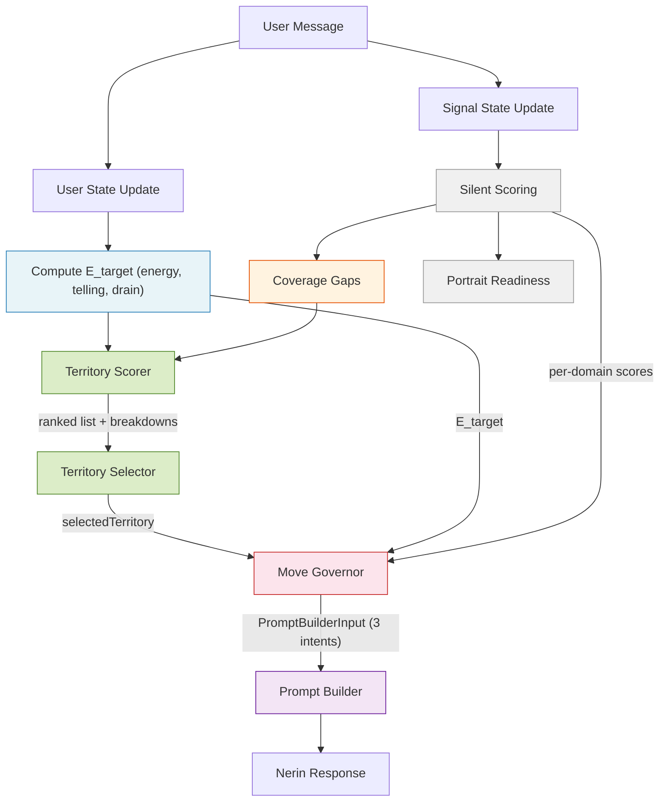

# Conversation Pacing Pipeline — Architecture

_Standalone architecture for the conversation pacing and territory steering pipeline. Consolidates 13 design decisions and 7 supporting specs into a single implementation reference. To be integrated into main architecture.md after epic/story development._

## Context & Problem Statement

### The Core Frame

**The product is not a personality assessment with a conversation wrapper. It is a guided self-discovery conversation with an assessment engine hidden underneath.**

Every architectural decision in this document flows from that frame. The test for any design choice: _does this make the user feel seen or measured?_

### Problems with the Current System

The original steering system suffers from three interconnected issues:

**Adversarial Steering.** When the system detects low energy, it pushes toward depth. When it detects high energy, it lets the user stay deep indefinitely. Light users feel pushed into uncomfortable territory. Deep users burn out without enforced relief. The steering is _reactive_ — it corrects the user's state rather than serving it.

**Emotional Fatigue.** Nerin excels at depth but does so until it exhausts the topic or the user. The LLM drives pacing, which means depth continues until natural momentum dies. This produces a mid-conversation energy drop that damages both experience quality and data quality.

**Assessment Leakage.** Assessment-native behaviors leak into the user experience: facet-level steering, contradiction-surfacing as a default move, "dig deeper" reflexes, and therapy-coded prompts. The system _thinks like an assessor_ even when it partially _behaves like a guide_.

### Key Insight

**Enjoyment and data quality are aligned, not opposed.** Peak engagement moments produce more evidence, not less. A relaxed, self-propelled user reveals more authentic personality data than an emotionally fatigued one. User wellbeing is not a concession — it is part of the optimization target.

### Relationship to Main Architecture

The main `architecture.md` covers the platform (hexagonal architecture, Effect-ts, handlers, repos, auth, payments). This document covers the **conversation intelligence pipeline** — a system that will live in:

| Location | Components |
|----------|-----------|
| `packages/domain/src/utils/` | E_target formula, territory scorer, territory selector (pure functions) |
| `packages/domain/src/utils/steering/` | Existing DRS, cold-start, territory-prompt-builder (to be evolved) |
| `packages/domain/src/constants/` | Territory catalog, decomposed character bible modules |
| `packages/domain/src/types/` | PromptBuilderInput, MoveGovernorDebug, ContradictionTarget, ConvergenceTarget |
| `apps/api/src/use-cases/` | Move Governor, updated nerin-pipeline orchestration |
| `packages/infrastructure/src/repositories/` | ConversAnalyzer v2 prompt (energy + telling extraction) |

---

## Priority Hierarchy

When forces conflict, resolve in this order:

1. **Protect user state** — never push harder because a facet is thin (enforced structurally: drain ceiling in E_target, coverage excluded from pacing)
2. **Maintain conversational momentum** — favor transitions that feel adjacent, not random
3. **Apply quiet pressure for breadth and depth** — through territory selection, never through E_target

---

## Six-Layer Pipeline Architecture

The system operates as six decoupled layers. Territory policy is split into three sub-layers (Scorer → Selector → Governor) with an enriched Prompt Builder. Each layer is independently diagnosable:



| Layer | Responsibility | Inputs | Output |
|-------|---------------|--------|--------|
| **Pacing (E_target)** | Estimate what the conversation can sustain | Energy, telling, drain | `E_target` [0, 1] |
| **Territory Scorer** | Rank all 25 territories by unified formula | E_target, coverage gaps, catalog, visit history, turn/totalTurns | Sorted ranked list with per-term score breakdowns |
| **Territory Selector** | Pick from ranked list via deterministic rules | TerritoryScorerOutput | `selectedTerritory` + debug fields |
| **Move Governor** | Constrain Nerin: entry pressure, observation gating | `selectedTerritory`, E_target, per-domain facet scores, `turnNumber`, `isFinalTurn` | `PromptBuilderInput` (3 intents) + `MoveGovernorDebug` |
| **Prompt Builder** | Compose contextual system prompt from 3 tiers + persona | `PromptBuilderInput` + territory catalog | Complete system prompt |
| **Silent Scoring** | Extract evidence, update estimates | User message, conversation history | Facet scores, confidence, portrait readiness, coverage gaps |

**Separation invariants:**
- Coverage flows to territory scorer, never through E_target
- Each layer does one job: scorer ranks, selector picks, Governor constrains, Nerin executes
- Silent scoring never affects Nerin's tone directly
- Portrait readiness is read-only — it never feeds back into E_target or territory scoring

---

## Core Architectural Decisions

### ADR-CP-1: E_target Pacing Formula — User-State-Pure

**Decision:** The pacing formula computes a target energy for the next exchange based solely on user state. No phase term. No time pressure. No monetization logic. No coverage pressure.

E_target is a **pipeline of transforms**, not an additive sum. Each signal operates in its natural mode. All values are in **[0, 1] space** — the band-to-numeric mapping outputs [0, 1] directly. No normalization step exists in the pipeline.

```text
1. E_s        = EMA of energy (smoothed anchor, init at 0.5, lambda=0.35)
2. V_up/down  = momentum from smoothed energy (split for asymmetric treatment)
3. trust      = f(telling) — qualifies upward momentum only
4. E_shifted  = E_s + alpha_up * trust * V_up - alpha_down * V_down
5. comfort    = running mean of all raw E values (adaptive baseline, init 0.5)
6. d          = average headroom-normalized excess cost over last 5 turns
7. E_cap      = concave fatigue ceiling from drain (floor=0.25, maxcap=0.9)
8. E_target   = clamp(min(E_shifted, E_cap), 0, 1)
```

**Normalization boundary:** Band-to-numeric mapping. The LLM outputs bands (not numbers). The mapping function converts directly to [0, 1] space: `minimal=0.1, low=0.3, steady=0.5, high=0.7, very_high=0.9`. No intermediate 0-10 scale at runtime. E_target is directly comparable with territory `expectedEnergy` — no conversion needed anywhere downstream.

**Key design choices:**

- **Momentum shifts, telling qualifies, drain constrains.** Different _types_ of force — not additive terms on the same axis. The pipeline structure makes this explicit.
- **Telling is asymmetric.** Qualifies upward momentum (is this self-propelled or performative?) but does not dampen downward momentum (always respect cooling). When unavailable, trust defaults to 1.0.
- **Drain measures excess cost above adaptive comfort.** Comfort adapts to the user's natural energy level (running mean, init 0.5). Only energy above the user's own baseline accumulates as fatigue. A naturally intense user at their normal level accumulates zero drain.
- **Drain is a ceiling, not a subtraction.** Fatigue protection dominates by construction — no other force can exceed the drain-derived cap.
- **Coverage is NOT in the formula.** Coverage pressure is assessment state, not user state. Simulation proved it causes inverted pressure on low-energy users. Coverage belongs in territory policy.

**Weight hierarchy:** `drain ceiling (structural) > alpha_down (0.6) >= alpha_up (0.5)`. No coverage term.

**Trust function:**

```text
trust(T) = 0.5                    when T = 0.0  (fully compliant — discount momentum)
trust(T) = 1.0                    when T = 0.5  (neutral — no modification)
trust(T) = 1.2                    when T = 1.0  (strongly self-propelled — slight boost)
```

Linear interpolation between anchor points.

**Drain computation:**

```text
comfort(n) = mean(E(1), E(2), …, E(n))          // adaptive to user's natural level, init 0.5 at turn 0
cost(E)    = max(0, E - comfort) / (1 - comfort) // headroom-normalized [0, 1]
d          = mean(cost(E) for last K turns)       // K = 5, always divide by 5
E_cap      = floor + (maxcap - floor) × (1 - d²)

Safety: cap comfort at 0.85 to prevent division-by-zero.
```

Constants: `floor=0.25, maxcap=0.9, K=5`

**Why adaptive comfort:** Fixed comfort at 0.5 assumes everyone is comfortable at mid-energy. A naturally intense user (average E ≈ 0.7) would accumulate drain at their normal operating level. A naturally quiet user (average E ≈ 0.3) would never accumulate drain even when being pushed. Adaptive comfort measures fatigue relative to _this user's_ baseline.

**Why headroom normalization `(1 - comfort)`:** The same absolute energy gap costs more when you have less room above your baseline. A quiet user pushed from 0.3→0.7 is being stretched harder (relative to their headroom) than an intense user pushed from 0.7→0.9.

**Why raw E (not E_s):** Drain measures what the user *actually experienced*, not what the smoothed model estimated. A single intense turn causes real fatigue even if the EMA trend is moderate. E_s is for pacing targets; raw E is for cost accounting.

The quadratic `(1 - d²)` shape is concave — gentle degradation at moderate drain, steep collapse at high drain. At d=0 (no fatigue): E_cap=0.9. At d=1 (maximum sustained overload): E_cap=0.25.

**Cold start:** Neutral defaults (momentum=0, drain=0, telling=neutral). First-turn E_target ≈ 0.5 (comfort midpoint).

**Full specification:** [E_target Formula Spec](../problem-solution-2026-03-07.md)

---

### ADR-CP-2: Two-Axis State Model — Energy × Telling

**Decision:** User state is a 2D space defined by two independent axes extracted by ConversAnalyzer v2.

**Energy [0, 1]:** How much intensity/load the user brings to their message. Represents _cost to the user_ — how much the message costs them to produce. Extracted as 5 bands, mapped directly to [0, 1] by the band-to-numeric mapping. Composed of 4 observable dimensions with **equal authority** (any one can drive the score high):

| Dimension | What It Measures |
|-----------|-----------------|
| Emotional activation | Feelings named, vulnerability shown, emotional stakes |
| Cognitive investment | Working through something — questioning, connecting, wrestling |
| Expressive investment | Precision of language, metaphor density, narrative craft |
| Activation/urgency | Pace, intensity markers, exclamation energy |

Extracted via 5 anchored bands: minimal(0.1) / low(0.3) / steady(0.5) / high(0.7) / very_high(0.9). **Absolute scoring** — no anchoring to recent conversation.

**Telling (0-1):** How self-propelled vs. compliance-driven the user is. Scored as _self-propulsion beyond the minimum viable answer_ to the previous assistant turn.

| Band | Value | Meaning |
|------|-------|---------|
| fully_compliant | 0.0 | Stays inside the question's frame, echoes Nerin's language |
| mostly_compliant | 0.25 | Answers thoroughly but doesn't steer |
| mixed | 0.5 | Some own material, some prompted |
| mostly_self_propelled | 0.75 | Introduces new threads, makes connections |
| strongly_self_propelled | 1.0 | Takes the wheel — new topics, questions back, reframes |

**Relative scoring** — scored against the minimum viable answer to the immediately previous assistant message.

**The four quadrants** (design language, not extraction output):

| State | Energy | Telling | Meaning |
|-------|--------|---------|---------|
| Flow | High | High | Self-propelled and engaged — stay out of the way |
| Performance | High | Low | Responding intensely but reactively — feels assessed |
| Quiet authenticity | Low | High | Volunteering at own pace — respect the rhythm |
| Disengagement | Low | Low | Fading — pivot to something fresh |

**Extraction guardrails:**
- Eloquence is not energy. Linguistic sophistication ≠ intensity/load.
- Sophistication is not cognitive investment. Comfortable analysis = "steady."
- Long detailed answers are not high telling. Thoroughness inside the prompt's frame is compliant.
- Understated styles are not low energy. Compressed restraint about heavy topics scores on emotional activation.
- Multi-part messages: score energy where the message _lands_, score telling at the _highest_ self-propulsion shown.

**ConversAnalyzer v2 output contract:**

```typescript
// Added to existing ConversAnalyzer output (evidence[] unchanged)
userState: {
  energy: number           // [0, 1] mapped from band (no intermediate 0-10 scale)
  telling: number          // 0-1, relative to previous prompt
  energyBand: EnergyBand   // "minimal"|"low"|"steady"|"high"|"very_high"
  tellingBand: TellingBand  // "fully_compliant"|"mostly_compliant"|"mixed"|"mostly_self_propelled"|"strongly_self_propelled"
  energyReason: string     // short justification
  tellingReason: string    // short justification
  withinMessageShift: boolean  // true if energy or telling shifted within the message
}
```

**Full specification:** [Energy and Telling Extraction Spec](../problem-solution-2026-03-07-energy-telling-extraction.md)

---

### ADR-CP-3: Territory Catalog — Architecture, Not Data

**Decision:** The territory catalog is a first-order architectural concern. Three of five scorer terms consume catalog fields directly. The scorer amplifies whatever the catalog says. Catalog quality IS scorer quality.

**25 territories** with continuous `expectedEnergy`, dual-domain tags, and expected facets:

```typescript
interface Territory {
  readonly id: TerritoryId;            // branded string
  readonly expectedEnergy: number;      // [0, 1] — opener cost, not depth potential
  readonly domains: readonly [LifeDomain, LifeDomain];  // exactly 2
  readonly expectedFacets: readonly FacetName[];         // 3-6 per territory
  readonly opener: string;              // natural conversation opener
}
```

**Energy distribution:** 9 light (0.20-0.37), 10 medium (0.38-0.53), 6 heavy (0.58-0.72). Upper range [0.75-0.85] is headroom for future territories.

**Domain distribution:** relationships (15), solo (13), work (9), family (6), leisure (6). All domains appear in ≥6 territories. Every territory has exactly 2 domains.

**Key design principles:**

- **`expectedEnergy` measures opener cost, not depth potential.** How much a genuine first answer typically costs — not how deep it _could_ go. Anchor: 0.5 = comfort threshold (zero drain).
- **Don't lie about what a territory is to make the math work.** If a facet needs different energy access, create a territory where it genuinely surfaces at that energy.
- **Create territories to fill gaps, don't force facets onto existing ones.** A new territory with narrative honesty score 1.0 beats overloading an existing territory at 0.7.
- **Accept thin facets rather than manufacturing artificial access.** Depression exists only in heavy territories (0.65, 0.72). The portrait communicates this as "still emerging."

**Full territory catalog (25 territories):**

| # | Territory ID | Domains | expectedEnergy | Facets | Opener |
|---|---|---|---|---|---|
| 1 | daily-routines | work, solo | 0.20 | orderliness, self_discipline, activity_level | What does a typical morning look like for you...? |
| 2 | creative-pursuits | leisure, solo | 0.25 | imagination, artistic_interests, adventurousness | Is there something creative you enjoy doing...? |
| 3 | weekend-adventures | leisure, solo | 0.25 | excitement_seeking, adventurousness, cheerfulness | What's something you did recently on a weekend...? |
| 4 | learning-curiosity | solo, work | 0.25 | intellect, imagination, self_efficacy | What's something you've been curious about...? |
| 5 | family-rituals | family, leisure | 0.28 | dutifulness, cheerfulness, cooperation, morality | Does your family have any traditions or rituals...? |
| 6 | social-circles | relationships, leisure | 0.30 | friendliness, gregariousness, trust | Tell me about the people you tend to spend time with. |
| 7 | helping-others | relationships, work | 0.30 | altruism, sympathy, cooperation | Can you tell me about a time you helped someone...? |
| 8 | comfort-zones | solo, relationships | 0.33 | cautiousness, vulnerability, adventurousness | What's your go-to way to recharge...? |
| 9 | spontaneity-and-impulse | leisure, solo | 0.37 | immoderation, excitement_seeking, cautiousness | What's the most spontaneous thing you've done...? |
| 10 | daily-frustrations | relationships, work | 0.38 | anger, cooperation, self_consciousness, assertiveness | What's something that really gets on your nerves...? |
| 11 | work-dynamics | work, relationships | 0.42 | assertiveness, achievement_striving, self_efficacy, cooperation | What's the most interesting challenge you've faced at work...? |
| 12 | emotional-awareness | solo, relationships | 0.42 | emotionality, anxiety, self_consciousness | When you're having a really good day, what does that feel like? |
| 13 | ambition-and-goals | work, solo | 0.43 | achievement_striving, self_discipline, activity_level | What's something you're working toward right now...? |
| 14 | growing-up | family, solo | 0.45 | emotionality, trust, imagination, dutifulness | What's something from growing up that shaped who you are? |
| 15 | social-dynamics | relationships, leisure | 0.46 | gregariousness, self_consciousness, cheerfulness, friendliness | How do you usually feel walking into a room full of strangers? |
| 16 | friendship-depth | relationships, solo | 0.48 | trust, friendliness, modesty, morality | Think of a close friend — what made that friendship important? |
| 17 | opinions-and-values | solo, relationships | 0.49 | liberalism, morality, assertiveness | Is there something you feel strongly about that others might disagree with? |
| 18 | team-and-leadership | work, relationships | 0.49 | assertiveness, cooperation, dutifulness, modesty | Tell me about a time you had to take charge of something. |
| 19 | giving-and-receiving | relationships, family | 0.53 | altruism, modesty, sympathy, immoderation | When someone does something really kind for you, how does that sit? |
| 20 | family-bonds | family, relationships | 0.58 | trust, sympathy, dutifulness, emotionality | Tell me about someone in your family who's had a real impact. |
| 21 | conflict-and-resolution | relationships, work | 0.59 | anger, cooperation, assertiveness, morality | Tell me about a disagreement that taught you something. |
| 22 | identity-and-purpose | solo, work | 0.63 | intellect, liberalism, self_efficacy, emotionality | If someone who knows you described what drives you, what would they say? |
| 23 | inner-struggles | solo, relationships | 0.65 | depression, anxiety, vulnerability, anger | Everyone has tough patches — what's been weighing on you? |
| 24 | vulnerability-and-trust | relationships, family | 0.70 | vulnerability, trust, anxiety, self_consciousness | Can you think of a time being open with someone brought you closer? |
| 25 | pressure-and-resilience | work, family | 0.72 | vulnerability, self_discipline, achievement_striving, depression | Think of a time when things got really tough — how did you get through? |

All 30 Big Five facets covered. Depression appears only in heavy territories (0.65, 0.72) — accepted by design; portrait communicates as "still emerging."

**Three natural corridors** emerged from honest domain tagging:
- _Introspective_ {solo, relationships}: comfort-zones → emotional-awareness → friendship-depth → opinions-values → inner-struggles
- _Interpersonal_ {relationships, work}: helping-others → daily-frustrations → work-dynamics → team-leadership → conflict-resolution
- _Achiever_ {solo, work}: daily-routines → learning-curiosity → ambition-goals → identity-purpose

**Bridge territories** connect corridors at Jaccard ≥ 0.33: growing-up, social-circles, social-dynamics, family-rituals, giving-and-receiving, pressure-resilience.

**Known risk:** Relationships at 60% of territories creates systematic adjacency advantage. If monitoring shows >70% of turns in relationship-tagged territories, switch to inverse-frequency-weighted Jaccard (a coefficient change, not a catalog change).

**Full specification:** [Territory Catalog Migration Spec](../problem-solution-2026-03-08.md)

---

### ADR-CP-4: Territory Scorer — Unified Five-Term Formula

**Decision:** A single additive formula ranks all 25 territories per turn. Five terms, each capturing a distinct concern. All terms are bounded [0, 1] by construction. Both `expectedEnergy` and `E_target` are [0, 1] — no normalization needed anywhere.

```text
For each territory t (all territories, no exclusions):

  --- Coverage Gain (source-normalized, reuses existing per-facet priority) ---
  priority_f = α × max(0, C_target - confidence_f)
             + β × max(0, P_target - signalPower_f)
  priority_max = α × C_target + β × P_target
  baseYield(t, f) = 1 / |t.expectedFacets|          // normalized: Σ baseYield = 1 per territory
  coverageGain(t) = sqrt(sum(baseYield(t, f) * priority_f / priority_max for f in t.expectedFacets))
  // bounded [0, 1] — at cold start all territories score equally regardless of facet count

  --- Adjacency (Jaccard similarity from catalog properties) ---
  domainSimilarity(a, b) = |a.domains ∩ b.domains| / |a.domains ∪ b.domains|
  facetSimilarity(a, b)  = |a.expectedFacets ∩ b.expectedFacets| / |a.expectedFacets ∪ b.expectedFacets|
  adjacency(t) = 0.8 × domainSimilarity(current, t) + 0.2 × facetSimilarity(current, t)

  --- Conversation Skew (energy-based U-shape) ---
  sessionProgress = turnNumber / totalTurns
  conversationSkew(t) =
    (1 - t.expectedEnergy) × max(0, 1 - sessionProgress / 0.2)     // light boost early
  + t.expectedEnergy       × max(0, (sessionProgress - 0.7) / 0.3) // heavy boost late

  --- Energy Malus (quadratic, no coverage dampening) ---
  energyMalus(t) = w_e × (t.expectedEnergy - E_target)²

  --- Freshness Penalty (linear decay, derived from message history) ---
  turnsSinceLastVisit = currentTurn - lastTurnInTerritory(t)  // from assessment_exchange.selected_territory
  freshnessPenalty(t) =
    0                                                    if t == currentTerritory
    max(0, w_f × (1 - turnsSinceLastVisit / cooldown))  otherwise
  // never-visited territories: turnsSinceLastVisit = ∞ → penalty = 0

  --- Final Score ---
  score(t) = coverageGain(t) + adjacency(t) + conversationSkew(t)
           - energyMalus(t) - freshnessPenalty(t)

Output: all territories sorted descending by score, with full breakdown per term.
Selection is NOT the scorer's concern — the Territory Selector consumes this ranking.
```

| Term | What It Does | Input Source | Bounded |
|------|-------------|-------------|---------|
| `coverageGain` | Boost territories that fill evidence gaps | Silent scoring (per-facet priority) × catalog (expectedFacets) | [0, 1] via sqrt + source normalization |
| `adjacency` | Boost narratively close territories | Jaccard on domains (0.8) + expectedFacets (0.2) | [0, 1] by Jaccard definition |
| `conversationSkew` | Shape session arc — light early, heavy late | Turn position × catalog (expectedEnergy) | [0, 1] by ramp clamp |
| `energyMalus` | Penalize beyond user capacity | E_target vs expectedEnergy — quadratic | [0, w_e] — penalty grows with gap² |
| `freshnessPenalty` | Penalize recently visited | Visit history (turns since last visit) | [0, w_f] — decays linearly |

**Key formula properties:**

- **Self-adjacency provides stability.** The current territory has Jaccard = 1.0 with itself. Another territory must overcome this natural inertia with meaningfully better coverage gain, skew, or freshness to trigger a shift. No explicit `currentBonus` needed — adjacency-to-self IS the stability mechanism.
- **Coverage is quiet by design.** `coverageGain` uses `sqrt()` compression — diminishing returns as coverage improves. At cold start, all territories score equally (uniform deficit). Coverage pressure never spikes; it's a gentle tide.
- **Adjacency absorbs assessment leakage.** When transitions are adjacent, even coverage-motivated moves feel natural. Adjacency quality directly determines how much coverage pressure the system can apply invisibly.
- **Stay/shift emerges from the formula.** No separate exit guard. As a territory's expected facets get covered through evidence, its `coverageGain` declines, and eventually another territory overtakes it.
- **Conversation skew is a bias, not an override.** Light territories boosted in turns 1-5 (earlyRamp), heavy territories boosted in turns ~18-25 (lateRamp), middle turns are quiet. `energyMalus` still dominates if the user is drained — the system ends warmly even with late-session skew.

**Scorer output contract:**

```typescript
type TerritoryScorerOutput = {
  ranked: Array<{
    territoryId: TerritoryId
    score: number
    breakdown: {
      coverageGain: number
      adjacency: number
      skew: number
      malus: number
      freshness: number
    }
  }>  // sorted descending by score
  currentTerritory: TerritoryId | null
  turnNumber: number
  totalTurns: number
}
```

**Full specification:** [Territory Policy Spec](../problem-solution-2026-03-07-territory-policy.md)

---

### ADR-CP-5: Territory Selector — Three Code Paths

**Decision:** A thin, deterministic, pure function that picks from the scorer's ranked list. Three branching rules based on turn position. Zero internal state — everything arrives in the input.

**Selection rules:**

| Turn | Rule | Mechanism |
|------|------|-----------|
| Turn 1 (cold start) | `cold-start-perimeter` | Take top score, include all territories within `COLD_START_PERIMETER` of top score, random pick from pool |
| Turns 2-24 | `argmax` | Deterministic top-1. Tiebreak: catalog order |
| Turn 25 (finale) | `argmax` | Same as steady-state — closing behavior lives in the Governor (`intent: "amplify"`), not the selector |

**Selector output contract:**

```typescript
type TerritorySelectorOutput = {
  // Governor consumer (1 field)
  selectedTerritory: TerritoryId

  // Debug/replay consumer
  selectionRule: "cold-start-perimeter" | "argmax"
  selectionSeed: string | null           // hashed, non-null only on cold-start
  scorerOutput: TerritoryScorerOutput    // full ranked list for debug
}
```

**The Governor consumes 1 field** (`selectedTerritory`). The Governor derives intent from `turnNumber` and `isFinalTurn` independently — it doesn't need the selector to annotate phase or transition.

`sessionPhase` and `transitionType` are derived columns on `assessment_exchange` for dashboard readability:
- `sessionPhase`: turn 1 → `"opening"`, turn 25 → `"closing"`, else → `"exploring"`
- `transitionType`: `selectedTerritory === currentTerritory` → `"continue"`, else → `"transition"`

These are observability annotations, not inter-layer contracts.

**Full specification:** [Territory Selector Spec](../problem-solution-2026-03-09.md)

---

### ADR-CP-6: Move Governor — Restraint Layer with Two-Axis Observation Model

**Decision:** The Governor is a restraint layer that handles what LLMs are bad at (frequency control, observation gating, entry pressure calibration) and trusts Nerin for what it's naturally good at (conversational action choice, question strategy, observation framing).

**The reframe:** The original design had 5 intents (open, deepen, bridge, hold, amplify) mapping Governor decisions to behavioral palettes. Analysis against the actual CHAT_CONTEXT revealed a coherence problem: Nerin's turn structure is `observation + question`, and these are orthogonal axes. The Governor should control the observation axis (what to observe about) while trusting Nerin for the question axis (how to invite the user forward).

**Two orthogonal axes per Nerin turn:**

| Axis | What it controls | Who owns it |
|------|-----------------|-------------|
| **Observation** (what to offer) | What Nerin observes about — a natural connection, a pattern, a contradiction, an identity signal | Governor (via `ObservationFocus`) |
| **Question** (how to invite) | Story-Pulling, Reflect, Threading — how Nerin asks the next question | Prompt Builder (via intent-based module selection). Governor has no knowledge of question modules. |

**Three intents:**

| Intent | When | What changes for Nerin |
|--------|------|----------------------|
| `open` | Turn 1 | Territory opener, light question palette (Reflect only), no observation (nothing to observe yet) |
| `explore` | Turns 2-24 | Full question palette (Story-Pulling, Reflect, Threading, Mirrors), observation via `ObservationFocus` |
| `amplify` | Turn 25 | Bold format, longer responses, declarative permission, Observation Quality, observation via `ObservationFocus` |

**Intent derivation:**

| Condition | Intent |
|-----------|--------|
| `turnNumber === 1` | `open` |
| `isFinalTurn` | `amplify` |
| Otherwise | `explore` |

**What disappeared from the original 5-intent model:**
- `bridge` — collapsed into `explore`. Don't tell Nerin the previous territory; just give it the target. Nerin bridges naturally via Threading (already strong in current CHAT_CONTEXT).
- `hold` — collapsed into `explore` + ObservationFocus. What made `hold` special was that a noticing/contradiction/convergence fired — that's now the observation overlay.
- `deepen` — renamed `explore` since it covers both staying and transitioning.
- `previousTerritory` field — removed. Territory is "where to go," not "where you were."

**Governor outputs 4 fields:**

| Field | Type | Description |
|-------|------|------------|
| `intent` | `"open" \| "explore" \| "amplify"` | Determines Nerin's behavioral palette |
| `territory` | `Territory` | Where to steer the conversation |
| `entryPressure` | `EntryPressure` | `"direct"` / `"angled"` / `"soft"` — not on `open`, always `"direct"` on `amplify` |
| `observationFocus` | `ObservationFocus` | What to observe about — not on `open` |

**ObservationFocus — four competing variants:**

| Variant | Strength formula | What it tells Nerin |
|---------|-----------------|-------------------|
| `Relate` | `energy × telling` | Default — natural connection to what the user said |
| `Noticing` | `smoothedClarity` | Domain compass: "something is shifting in [domain]" |
| `Contradiction` | `delta × min(domainConf_A, domainConf_B)` | Facet divergence across two life domains |
| `Convergence` | `(1 - normalizedSpread) × min(domainConf)` | Facet alignment across 3+ life domains |

**Per-domain confidence (shared formula for contradiction + convergence):**

```text
domainConf(f, d) = C_MAX × (1 - exp(-k × w_g(f, d)))
// C_MAX = 0.9, k = 0.7 — same formula and constants as facet-level confidence
// w_g(f, d) = per-domain evidence weight from FacetMetrics.domainWeights
```

Reuses the existing confidence formula from `computeFacetMetrics()`, scoped to a single domain's evidence weight. No new math — just applying the same function to `w_g` per domain instead of total `W` across domains. Both contradiction and convergence use this as their qualifier, ensuring a unified view of "do we have enough evidence in this domain to trust the signal?"

**Observation gating during `explore` — two cooperating forces:**

The system uses an evidence-derived phase curve and a shared linear escalation to control when observations fire. The phase curve determines _readiness_ (has Nerin seen enough?). The escalation enforces _scarcity_ (each "seen" moment spends emotional currency).

```text
phase = mean(confidence_f for f where confidence_f > 0) / C_MAX

effectiveStrength = rawStrength × phase

threshold(n) = OBSERVE_BASE + OBSERVE_STEP × n
  where n = total observation focuses fired in session (shared counter, excludes Relate)

fires if effectiveStrength > threshold(n)
```

**Observation gating constants:**

| Constant | Value | Rationale |
|----------|-------|-----------|
| `C_MAX` | 0.9 | Confidence ceiling — `C_MAX × (1 - exp(-k × w_g))` where k=0.7 |
| `OBSERVE_BASE` | 0.12 | First observation fires at mid-session when phase ≈ 0.35 and strength ≈ 0.35 (effective ≈ 0.12) |
| `OBSERVE_STEP` | 0.04 | Each fired observation raises the bar by 0.04 — allows ~4-5 total observations per session for strong signals |
| `CLARITY_EMA_DECAY` | 0.5 | Smoothing for noticing's `smoothedClarity` — responsive but not jittery |

Expected observation budget per session: 3-5 non-Relate focuses. At n=4, threshold = 0.28 — requires high phase (≈0.6+) AND strong signal to clear. This makes late-session observations rare and genuinely earned.

**Why evidence-derived phase, not turn-based:** A user who opens up fast at turn 6 has more accumulated evidence than a guarded user at turn 15. Turn-based gating would suppress the fast opener's moment and permit the guarded user's — exactly backwards. The phase curve adapts to the user's pace by measuring what the conversation has actually produced.

**Why shared counter, not per-type:** From the user's perspective, noticing, contradiction, and convergence are all experienced as "Nerin saw something about me." Each one spends the same emotional currency. The _category_ of insight is invisible to the user. The _frequency_ of insight is felt.

**Why linear escalation (not exponential):** With a shared counter across all focus types, exponential `BASE × ESCALATION^n` punishes too aggressively — the third "seen" moment becomes nearly impossible. Linear `BASE + ESCALATION × n` keeps later moments reachable for strong signals while still enforcing scarcity.

**Mutual exclusion during `explore`:** At most one non-Relate observation per turn. Priority: contradiction > convergence > noticing (rarest to commonest). If nothing clears the threshold → Relate wins by default (no gate needed). Deferred signals re-evaluated next turn.

**Observation competition during `amplify` — thresholds removed:**

On the final turn, the user has crossed the finish line. No drain protection needed. No pacing discipline needed. All four observation focuses compete on raw strength — no phase gating, no threshold:

```text
relateStrength      = energy × telling
noticingStrength    = smoothedClarity
contradictionStr    = delta × min(domainConf_A, domainConf_B)
convergenceStr      = (1 - normalizedSpread) × min(domainConf across 3+ domains)

Winner = argmax(all four)
```

Relate is not a fallback — it's a competitor. When the user is in flow (high energy × high telling), Relate wins honestly because honoring the user's momentum IS the strongest observation. When a contradiction has been simmering all session but never cleared the escalating threshold, it finally gets its chance. The best ending wins.

**Additional design choices:**

- **Domain compass, not facet target.** Noticing variant carries a `LifeDomain`, not a facet name. "Something is shifting in career" lets Nerin discover what's alive. "Notice their gregariousness at work" makes Nerin sound steered.
- **Convergence mirrors contradiction.** Contradiction detects a facet scoring _differently_ across two domains (complexity). Convergence detects a facet scoring _similarly_ across three or more domains (identity). Both evidence-based.
- **Window-based tracking.** The Governor tracks when it _opened_ observation windows, not when Nerin _used_ them. No response parsing, no feedback loop.
- **Derive-at-read for session state.** Observation fire count (`n`) reconstructed by scanning prior exchanges' `ObservationFocus.type` variants — consistent with the codebase pattern.

**V2 upgrade path:** The Governor currently trusts Nerin for question strategy. If behavioral evidence shows that Governor-selected question focus (story-pull vs reflect vs threading) produces measurably better responses, the Governor can be extended with a `QuestionFocus` axis.

**Full specification:** [Move Governor Spec](../problem-solution-2026-03-09-move-generator.md)

---

### ADR-CP-7: Prompt Builder — Three-Tier Contextual Composition

**Decision:** The prompt builder is a deterministic compositor that assembles Nerin's system prompt from modular layers. CHAT_CONTEXT (276-line monolith) is decomposed into observation modules and question modules — some always-on, others included per conversational intent.

**The three-tier model:**

```
┌─────────────────────────────────────────────┐
│  NERIN_PERSONA (universal identity)         │  ← shared across all surfaces
├─────────────────────────────────────────────┤
│  Core Identity modules (always-on chat)     │  ← coherent across all 25 messages
├─────────────────────────────────────────────┤
│  Question modules (intent-contextual)       │  ← included/excluded per intent
├─────────────────────────────────────────────┤
│  Steering section (per-turn)                │  ← Governor output: territory + observation focus
└─────────────────────────────────────────────┘
```

**The Prompt Builder owns the Governor → Nerin boundary.** It receives `intent`, `territory`, `entryPressure`, and `observationFocus` from the Governor and decides which question modules to include and how to translate the observation focus into a steering instruction.

**Three intents, two module axes:**

| Intent | Question Modules (Prompt Builder's concern) | Observation (Governor's concern) |
|--------|---------------------------------------------|--------------------------------|
| `open` | Reflect only (light opener) | None — no prior context |
| `explore` | Story-Pulling, Reflect, Threading, Mirrors (13) | ObservationFocus translated to steering instruction |
| `amplify` | Amplify-specific format, Observation Quality | ObservationFocus translated to steering instruction |

**Key design choices:**

- **Two-axis separation.** Observation (what to offer) and question (how to invite) are orthogonal. A turn with a contradiction focus can still use story-pulling: _"Something interesting — earlier you described X differently"_ [observation] + _"Tell me about a time that tension showed up"_ [question]. The Governor picks the observation; Nerin picks the question.
- **Instinct vs instruction.** Character bible describes instincts ("you never make someone feel insufficient"). Steering section gives directives ("enter at an angle"). Different abstraction levels cooperate. Same level competes.
- **The absence of modules IS the instruction.** Open-Nerin doesn't have Story-Pulling loaded. Amplify-Nerin doesn't have Story-Pulling loaded. Not because we said "don't pull stories" — because the cognitive palette doesn't include it.
- **Rhythm is emergent, not composed.** No `previousIntent` tracking, no turn-number awareness. Rhythm emerges from scorer (session arc) + Governor (observation gating) + pacing formula (energy ceiling).

**Character bible decomposition:**

- **Tier 1 — Core Identity (always-on):** `CONVERSATION_MODE`, `BELIEFS_IN_ACTION`, `CONVERSATION_INSTINCTS` (rewritten — directives removed), `QUALITY_INSTINCT`, `MIRROR_GUARDRAILS`, `HUMOR_GUARDRAILS`, `INTERNAL_TRACKING`
- **Tier 2 — Question modules (contextual):** `STORY_PULLING`, `REFLECT`, `THREADING`, `OBSERVATION_QUALITY`, `MIRRORS_EXPLORE` (13 mirrors — folds DEEPEN 10 + BRIDGE 3 unique: Coral Reef, Volcanic Vents, Mola Mola; HOLD mirrors already in DEEPEN), `MIRRORS_AMPLIFY` (4: Ghost Net, Mimic Octopus, Volcanic Vents, Mola Mola)
- **Eliminated:** QUESTIONING_STYLE (folded into intent instructions), RESPONSE_FORMAT (decomposed), RESPONSE_PALETTE, RELATE_REFLECT (split — Relate is now an ObservationFocus variant, Reflect is a question module), separate MIRRORS_BRIDGE and MIRRORS_HOLD (folded into MIRRORS_EXPLORE)

**Token budget (vs current monolith at ~2400 tokens):**

| Intent | Estimated Tokens | Reduction |
|--------|-----------------|-----------|
| `open` | ~500 | -79% |
| `explore` | ~1400 | -42% |
| `amplify` | ~900 | -63% |

**Full specification:** [Prompt Builder Architecture Spec](../problem-solution-2026-03-10.md)

---

### ADR-CP-8: Session Format & Closing Design

**Decision:** The conversation is capped at 25 exchanges — a deliberate episode format serving cost control, retention, and experience quality.

**Target emotional exit:**
- _"That felt good, I want more"_ (desired)
- _"I think you're reading me wrong"_ (avoided — bad frustration)
- _"They cut me off"_ (avoided — manufactured scarcity)

**Late-session depth bias:** `conversationSkew` in the territory scorer biases toward depth-friendly territories in turns ~18-25. This is one of five scorer terms, not a separate mechanism. If the user is drained, `energyMalus` prevents heavy territories from winning — the system ends warmly, never forces a peak.

**Amplify closing:** On the final turn, the Governor derives `intent: "amplify"`. Nerin gets permission to be braver — longer responses, bold format, declarative statements about the user. All four observation focuses (Relate, Noticing, Contradiction, Convergence) compete on raw strength with no thresholds. The best observation wins honestly. Entry pressure is always `"direct"`. Nerin doesn't know it's the last turn. The conversation cuts at peak intensity.

**No drain protection on amplify.** The user has crossed the finish line. The 24 turns of pacing that got them here earned the crescendo. E_target still computes but does not gate the amplify moment.

**The distinction:**
- **Engineering a peak** = manipulation
- **Avoiding a valley** = craftsmanship
- **Letting the best ending win** = honesty

---

### ADR-CP-9: Contradiction as Observation Focus Variant

**Decision:** Contradiction-surfacing is an `ObservationFocus` variant that competes with Relate, Noticing, and Convergence. During `explore` turns, it must clear the shared observation gate (phase × strength > threshold). During `amplify`, it competes on raw strength.

**Strength formula:** `contradictionStrength = delta × min(domainConf_A, domainConf_B)` — facet divergence across life domains, qualified by minimum per-domain confidence (reuses `domainConf(f, d) = C_MAX × (1 - exp(-k × w_g))`). High delta with low domain confidence doesn't fire; moderate delta with strong per-domain evidence can.

**Presentation rule:** Always framed as fascination, never as verdict.
- Good: _"Something interesting is happening — earlier you described X, and here it feels almost opposite."_
- Bad: _"So you're actually contradictory about closeness."_

---

### ADR-CP-10: Noticing as Observation Focus Variant

**Decision:** Nerin occasionally offers specific, grounded observations about the user. An `ObservationFocus` variant that competes alongside Relate, Contradiction, and Convergence.

**Strength formula:** `noticingStrength = smoothedClarity` — EMA-smoothed clarity for the top domain. No baseline subtraction (the shared observation gate's phase curve already handles "is it too early"). The escalating threshold handles pacing.

**Constraints:**
- Always grounded in something specific the user just said
- Never analytical, never labeled, never trait-language
- Domain compass hint (`LifeDomain`), not facet target — "something is shifting in career" lets Nerin discover what's alive

---

### ADR-CP-11: Portrait Readiness Is Read-Only

**Decision:** The system maintains a running estimate of portrait trustworthiness. It serves two purposes only: quality floor and continuation framing. It does NOT feed back into E_target or territory scoring.

**Hard constraint:** The moment portrait readiness pressures the conversation, the system reverts to assessment-first behavior.

---

### ADR-CP-12: Three-Tier Extraction with Fail-Open Defaults

**Decision:** ConversAnalyzer v2 extraction uses a three-tier retry strategy with decreasing strictness. Failure at any tier degrades gracefully — the conversation never breaks, it just becomes less steered.

**The principle:** Failure should never produce a worse experience than silence. A failed ConversAnalyzer should result in Nerin being less steered, not steered badly.

**Three-tier strategy:**

```text
Tier 1 (attempts 1-3): Strict schema, temperature 0.9
  → Full validation via EvidenceExtractionSchema (rejects if ANY item invalid)
  → 3 attempts — temperature 0.9 gives variation between retries
  → If all 3 fail → fall to Tier 2

Tier 2 (attempt 4): Lenient schema, temperature 0.9
  → Filters invalid items, keeps valid ones (LenientEvidenceExtractionSchema)
  → Recovers partial evidence + energy/telling if structurally parseable
  → If fails → fall to Tier 3

Tier 3 (no LLM call): Neutral defaults
  → energy = 0.5, telling = 0.5, evidence = []
  → No LLM cost. Comfort-level conversation continues.
```

**Temperature 0.9:** Slightly below the Anthropic default (1.0) but enough variation that if the LLM is stuck producing malformed output at one temperature, the randomness between attempts can break the pattern. This is an extraction task where some creativity helps with retries, but we don't want wildly different interpretations.

**Two repository methods (not one with a flag):**

| Method | Schema | Returns |
|--------|--------|---------|
| `analyze` | `EvidenceExtractionSchema` (strict) | Full validated output or error |
| `analyzeLenient` | `LenientEvidenceExtractionSchema` | Partial output (invalid items filtered) or error |

The repository is a thin LLM wrapper. The decode strategy is a use-case concern — the pipeline knows why it's retrying and what quality it accepts.

**Pipeline orchestration (in nerin-pipeline use-case):**

```text
const result = yield* conversanalyzer.analyze(input)
  .pipe(
    Effect.retry(Schedule.recurs(2)),              // Tier 1: strict × 3
    Effect.orElse(() =>
      conversanalyzer.analyzeLenient(input)        // Tier 2: lenient × 1
    ),
    Effect.catchAll(() =>
      Effect.succeed(NEUTRAL_DEFAULTS)             // Tier 3: defaults
    ),
  );
```

**Neutral defaults and their consequences:**

| Default | Value | Pipeline consequence |
|---------|-------|---------------------|
| `energy` | 0.5 | E_target ≈ 0.5 (comfort midpoint) — no deep push, no light pull |
| `telling` | 0.5 | Trust = 1.0 (neutral) — no momentum modification |
| `evidence` | `[]` | No new evidence this turn. Scorer uses prior coverage gaps. |
| `energyBand` | `"steady"` | Consistent with 0.5 energy |
| `tellingBand` | `"mixed"` | Consistent with 0.5 telling |

**Partial failure handling for v2 `userState`:**

ConversAnalyzer v2 returns both evidence and `userState` (energy + telling). These can fail independently:

| Scenario | What's available | What defaults |
|----------|-----------------|---------------|
| Full success | Everything | — |
| `userState` fails, evidence succeeds | Real evidence | `energy=0.5, telling=0.5` |
| Evidence fails, `userState` succeeds | Real energy + telling | `evidence=[]` |
| Full failure (Tier 3) | Nothing | All neutral defaults |

The lenient schema (Tier 2) handles this naturally: `userState` and `evidence` are parsed independently. If one parses and the other doesn't, the valid part is kept.

**What this means for the conversation:**

- **Tier 1 success (normal path):** Full steering — E_target, territory scoring, observation gating all have real data. Best possible Nerin prompt.
- **Tier 2 success (partial recovery):** Some evidence lost to filtering. Steering slightly less informed but still responsive. Log discarded item count for monitoring.
- **Tier 3 (neutral defaults):** Nerin gets a comfort-level prompt — territory selection uses prior coverage, observation gating uses prior confidence for phase, E_target at midpoint. The conversation feels "normal" — no weird behavior, just less steered. System recovers on the next turn.

**Monitoring:** Log the tier that succeeded per turn. If Tier 2/3 fire rates exceed 5%, investigate prompt or schema issues.

---

### ADR-CP-13: ConversAnalyzer v2 — Single-Call Dual Extraction

**Decision:** ConversAnalyzer v2 extracts both `userState` (energy + telling) and `evidence[]` (Big Five facet signals) in a single Haiku tool-use call. The prompt is structured for dual extraction with attention management via ordering.

**Why single-call:** Cost control. Haiku is cheap but adding a second LLM call per turn doubles ConversAnalyzer cost and adds latency to the critical path (ConversAnalyzer now runs BEFORE Nerin in the evolved pipeline). If evidence quality degrades from prompt crowding, state extraction moves to a separate call — but we don't pay for it until we need it.

**Prompt structure (attention ordering):**

```text
┌─────────────────────────────────────────────┐
│  System role + task framing                 │
├─────────────────────────────────────────────┤
│  USER STATE CLASSIFICATION (new — first)    │  ← gets prompt attention priority
│    Energy definition + 4 dimensions         │
│    Energy bands (5) with anchored examples  │
│    Telling definition + markers             │
│    Telling bands (5) with Nerin+user pairs  │
│    Orthogonality: diagonal contrastive      │
│    Within-message shift rule                │
├─────────────────────────────────────────────┤
│  EVIDENCE EXTRACTION (existing — second)    │  ← battle-tested, tolerates being second
│    Facet definitions (30)                   │
│    Life domains (6)                         │
│    Deviation calibration + dual-facet check │
│    Domain distribution context              │
│    Conversation context (last 6 messages)   │
└─────────────────────────────────────────────┘
```

**State extraction goes first** because it's the new, fragile signal. Evidence extraction is already working and can tolerate reduced attention priority. If monitoring shows evidence quality degradation after adding state extraction, the first intervention is prompt compression; the fallback is a separate call.

**LLM outputs bands, pipeline maps to numbers:**

The LLM classifies into anchored bands (reliable for Haiku). Code converts to numeric values. Clean separation — the LLM does what it's good at (classification), code does what it's good at (mapping).

```typescript
// LLM tool output schema (what Haiku produces)
const UserState = S.Struct({
  energyBand: EnergyBand,              // "minimal"|"low"|"steady"|"high"|"very_high"
  tellingBand: TellingBand,            // "fully_compliant"|...|"strongly_self_propelled"
  energyReason: S.String.pipe(S.maxLength(200)),
  tellingReason: S.String.pipe(S.maxLength(200)),
  withinMessageShift: S.Boolean,
});

const ConversanalyzerV2ToolOutput = S.Struct({
  userState: UserState,                 // NEW — positioned first in schema
  evidence: S.Array(EvidenceItem),      // UNCHANGED
});
```

**Band-to-numeric mapping (deterministic, in domain layer):**

```typescript
const ENERGY_BAND_MAP = {
  minimal: 0.1, low: 0.3, steady: 0.5, high: 0.7, very_high: 0.9
};
// E=0.5 ("steady") = comfort threshold (zero drain). By design.
// Directly in [0, 1] space — no intermediate 0-10 scale at runtime.

const TELLING_BAND_MAP = {
  fully_compliant: 0.0, mostly_compliant: 0.25, mixed: 0.5,
  mostly_self_propelled: 0.75, strongly_self_propelled: 1.0
};
// T=0.5 ("mixed") = trust 1.0 (neutral). By design.
```

**Strict vs lenient schemas (for ADR-CP-12 three-tier retry):**

| Schema | userState validation | evidence validation | Used in |
|--------|---------------------|--------------------| --------|
| **Strict** | All fields must validate (bands are exact Literal matches) | All items must validate (facet names, deviation range, enums) | Tier 1 (attempts 1-3) |
| **Lenient** | Parse fields independently — keep what validates, default the rest (`energy=0.5, telling=0.5`) | Filter invalid items, keep valid ones (existing pattern) | Tier 2 (attempt 4) |

The lenient schema parses `userState` and `evidence` independently. Partial success on either side is preserved:

| userState | evidence | Result |
|-----------|----------|--------|
| Parses fully | All items valid | Full extraction |
| Parses fully | Some items invalid | Full state + filtered evidence |
| energyBand valid, tellingBand invalid | All items valid | Real energy + default telling + full evidence |
| Fails entirely | All items valid | Default state + full evidence |
| Parses fully | Fails entirely | Full state + empty evidence |

**Six load-bearing guardrails in the prompt:**

These protect against systematic extraction bias — the formula's biggest vulnerability. Random noise is smoothed by EMA. Systematic bias propagates through the entire pipeline.

1. **Eloquence is not energy.** Beautiful writing about low-stakes topics is "steady."
2. **Sophistication is not cognitive investment.** Comfortable analysis = "steady."
3. **Peak dimension, not average.** One strongly present dimension is sufficient for high energy.
4. **Understated styles are not low energy.** Compressed restraint about heavy topics scores on emotional activation.
5. **Long detailed answer is not high telling.** Thoroughness inside the prompt's frame is compliant.
6. **Diagonal contrastive examples are mandatory.** High-E/low-T and low-E/high-T examples prevent the LLM from correlating the two axes.

**What changes from v1 ConversAnalyzer:**

| Aspect | v1 (current) | v2 (evolved) |
|--------|-------------|-------------|
| Energy format | 3-level categorical (`light\|medium\|heavy`) | 5-band → [0, 1] direct mapping |
| Energy concept | Emotional weight/vulnerability | Conversational intensity/load (cost to user) |
| Telling | Does not exist | 5-band → numeric (0-1) |
| Pipeline position | After Nerin (parallel) | Before Nerin (sequential — feeds steering) |
| Schema validation | Lenient only | Strict × 3 → lenient × 1 → defaults |
| Temperature | Default (1.0) | 0.9 (retry variation) |
| `observedEnergyLevel` | Primary output | Deprecated — kept nullable during migration |

**Evidence quality is the constraint to watch:** Monitor evidence count per message, deviation distribution, and polarity balance after shipping v2. If metrics degrade, the state extraction prompt needs compression or must move to a separate call.

**Full specification:** [Energy and Telling Extraction Spec](../problem-solution-2026-03-07-energy-telling-extraction.md)

---

### ADR-CP-14: Persistence — Exchange State Table

**Decision:** A dedicated `assessment_exchange` table stores all per-turn pipeline state and metrics. One row per exchange (user message → system computation → assistant response). Messages and evidence reference the exchange. `assessment_message` becomes lean — content and role only.

**Rationale:** The pacing pipeline produces ~15 metrics per turn across extraction, pacing, scoring, selection, and governance. Splitting these across user and assistant message rows (as in the original flat-column design) fragments the turn's state and makes debugging harder. A single exchange row is the natural unit of computation.

**New table: `assessment_exchange`**

```sql
assessment_exchange (
  -- Identity
  id                    uuid        PK
  session_id            uuid        FK → assessment_session
  turn_number           smallint    NOT NULL  -- 1-25

  -- Extraction (ConversAnalyzer v2)
  energy                real                  -- [0, 1]
  energy_band           text                  -- "minimal"|"low"|"steady"|"high"|"very_high"
  telling               real                  -- [0, 1]
  telling_band          text                  -- band label
  within_message_shift  boolean
  state_notes           jsonb                 -- { energyReason, tellingReason }
  extraction_tier       smallint              -- 1, 2, or 3

  -- Pacing (E_target computation)
  smoothed_energy       real                  -- EMA state carried forward
  comfort               real                  -- adaptive comfort this turn
  drain                 real                  -- d value
  drain_ceiling         real                  -- E_cap
  e_target              real                  -- [0, 1] final output

  -- Territory Scoring
  scorer_output         jsonb                 -- TerritoryScorerOutput (full ranked list, 5-term breakdowns)

  -- Territory Selection
  selected_territory    text                  -- TerritoryId
  selection_rule        text                  -- "cold-start-perimeter"|"argmax"

  -- Governor
  governor_output       jsonb                 -- PromptBuilderInput (intent, territory, entryPressure, observationFocus)
  governor_debug        jsonb                 -- MoveGovernorDebug (full diagnostics)

  -- Derived annotations (observability, not consumed by pipeline)
  session_phase         text                  -- "opening"|"exploring"|"closing"
  transition_type       text                  -- "continue"|"transition"

  created_at            timestamp
)
```

**Reference pattern:**

```
assessment_exchange (1 per turn)
  ├── assessment_message (2 per exchange: user + assistant)
  │     FK: exchange_id → assessment_exchange.id
  └── conversation_evidence (N per exchange)
        FK: exchange_id → assessment_exchange.id
        FK: message_id  → assessment_message.id  (provenance: which user message produced it)
```

**`assessment_message` becomes lean:**

| Column | Type | Notes |
|--------|------|-------|
| `id` | uuid | PK |
| `exchange_id` | uuid | FK → assessment_exchange (new) |
| `session_id` | uuid | FK → assessment_session (kept for direct session queries) |
| `role` | text | "user" \| "assistant" |
| `content` | text | Message body |
| `created_at` | timestamp | |

Removed: `territory_id`, `observed_energy_level` (moved to exchange), `user_id` (derivable from session).

**`conversation_evidence` gains `exchange_id`:**

Existing columns unchanged. New FK `exchange_id` links evidence to the exchange that produced it. Existing `message_id` FK kept for provenance (the specific user message the evidence was extracted from).

**Derive-at-read with exchange table:**

The pipeline reconstructs session state by scanning prior exchanges:
- **Observation fire count (n):** Count exchanges where `governor_output->'observationFocus'->>'type'` is not `'relate'`
- **Smoothed energy for EMA:** Read `smoothed_energy` from the most recent exchange
- **Visit history for freshness penalty:** Read `selected_territory` from prior exchanges
- **Comfort baseline:** Read `comfort` from the most recent exchange (or recompute from all prior exchange `energy` values)

**jsonb serialization rules:**
- `governor_output`: Territories stored as `TerritoryId` (not full objects). Pipeline resolves from catalog when reading back.
- `governor_debug`: Complete diagnostic snapshot. Never consumed by pipeline logic — only for replay, debugging, and monitoring dashboards.
- `scorer_output`: Full ranked list with per-territory score breakdowns. Enables "why did the system pick this territory?" debugging.
- `state_notes`: Flat `{ energyReason: string, tellingReason: string }`. No nesting.

**Migration strategy:** Fresh start. Product is in development — no production users. Single migration creates `assessment_exchange`, adds `exchange_id` FK to `assessment_message` and `conversation_evidence`, drops `territory_id` and `observed_energy_level` from `assessment_message`. Existing test/dev sessions discarded.

---

## Key Type Contracts

### PromptBuilderInput (Governor → Prompt Builder)

The Governor's external contract. Three intents, each carrying territory, entry pressure, and observation focus:

```typescript
type DomainScore = { domain: LifeDomain; score: number; confidence: number }

type ContradictionTarget = {
  facet: FacetName
  pair: [DomainScore, DomainScore]
  strength: number
}

type ConvergenceTarget = {
  facet: FacetName
  domains: DomainScore[]              // 3+ domains scoring similarly
  strength: number
}

type EntryPressure = "direct" | "angled" | "soft"
type ConversationalIntent = "open" | "explore" | "amplify"

// ─── Observation Focus (tagged union — 4 competing variants) ────
type RelateFocus        = { readonly type: "relate" }
type NoticingFocus      = { readonly type: "noticing";      readonly domain: LifeDomain }
type ContradictionFocus = { readonly type: "contradiction"; readonly target: ContradictionTarget }
type ConvergenceFocus   = { readonly type: "convergence";   readonly target: ConvergenceTarget }
type ObservationFocus = RelateFocus | NoticingFocus | ContradictionFocus | ConvergenceFocus

// ─── Prompt Builder Input ────
type PromptBuilderInput =
  | { intent: "open";    territory: Territory }
  | { intent: "explore"; territory: Territory; entryPressure: EntryPressure;
      observationFocus: ObservationFocus }
  | { intent: "amplify"; territory: Territory; entryPressure: "direct";
      observationFocus: ObservationFocus }
```

**Field sources:**
- `territory` — resolved from `TerritoryId` by pipeline via catalog lookup
- `entryPressure` — computed from gap between E_target and territory `expectedEnergy`; always `"direct"` on `amplify`
- `observationFocus` — winning variant from observation gating (explore) or raw competition (amplify)

**Serialization:** When persisted to jsonb on `assessment_exchange`, territories are stored as `TerritoryId` (not full objects). Pipeline resolves them fresh from catalog when reading back. Consistent with derive-at-read.

### ObservationGatingDebug (Observability)

Separate consumer — not sent to Prompt Builder. Captures the full competition state for replay and diagnostics:

```typescript
type ObservationCandidate = {
  focus: "relate" | "noticing" | "contradiction" | "convergence"
  rawStrength: number
  effectiveStrength: number     // rawStrength × phase (explore) or rawStrength (amplify)
}

type ObservationGatingDebug = {
  mode: "explore" | "amplify"
  phase: number                 // mean observed confidence / C_max
  threshold: number | null      // BASE + ESCALATION × n (null on amplify)
  sharedFireCount: number       // n — total non-Relate focuses fired so far
  candidates: ObservationCandidate[]  // all four, sorted by effectiveStrength
  winner: "relate" | "noticing" | "contradiction" | "convergence"
  mutualExclusionApplied: boolean     // true if a higher-priority candidate displaced another
}
```

### MoveGovernorDebug (Full Turn Debug)

```typescript
type EntryPressureDebug =
  | { result: "direct"; reason: "opening" | "amplify" }
  | { result: "direct"; reason: "within_range";
      eTarget: number; territoryEnergy: number; gap: number }
  | { result: "angled"; reason: "moderate_gap";
      eTarget: number; territoryEnergy: number; gap: number }
  | { result: "soft"; reason: "large_gap";
      eTarget: number; territoryEnergy: number; gap: number }

type MoveGovernorDebug = {
  intent: ConversationalIntent
  isFinalTurn: boolean
  entryPressure: EntryPressureDebug
  observationGating: ObservationGatingDebug
}
```

---

## Pipeline Wiring

### Integration with nerin-pipeline.ts

The conversation pacing pipeline integrates into the existing 8-step `nerin-pipeline.ts` orchestration. The key insertion points:

```text
Existing pipeline:
1. Advisory lock
2. Rate limit check
3. Save user message
4. Score territories (DRS) → select territory → build territory prompt
5. Call Nerin (with territory context in system prompt)
6. Save assistant message
7. Call ConversAnalyzer (parallel) → weight filter → save evidence
8. Release lock, return response

Evolved pipeline (new steps in bold):
1. Advisory lock
2. Rate limit check
3. **Create exchange row** (session_id, turn_number)
4. Save user message (with exchange_id)
5. **ConversAnalyzer v2 (extract evidence + energy + telling)**
6. **Save evidence** (with exchange_id + message_id)
7. **Compute E_target (from energy/telling history)**
8. **Territory Scorer (all 25 territories ranked)**
9. **Territory Selector (pick from ranked list)**
10. **Move Governor (intent + observation gating → PromptBuilderInput)**
11. **Prompt Builder (compose 3-tier system prompt)**
12. Call Nerin (with composed system prompt)
13. Save assistant message (with exchange_id)
14. **Update exchange row** (all metrics: extraction, pacing, scoring, governor)
15. Release lock, return response
```

**Key change: ConversAnalyzer moves before Nerin.** In the current pipeline, ConversAnalyzer runs parallel with or after Nerin. The evolved pipeline reverses this — ConversAnalyzer must run _first_ because the steering pipeline (E_target → Scorer → Selector → Governor → Prompt Builder) needs energy and telling signals to compose Nerin's system prompt. Evidence extraction still happens in the same ConversAnalyzer call; it just runs earlier.

**Latency implication:** This adds ConversAnalyzer's latency (~1-2s Haiku call) to the critical path _before_ Nerin responds. Previously the two LLM calls overlapped. The tradeoff is accepted because steering quality requires user state signals — without them, E_target defaults to comfort and the scorer loses its primary input. The pure-function steps 5-9 add sub-millisecond overhead and do not contribute meaningfully to latency.

**Ordering constraint:** Steps 5-11 are sequential (each feeds the next). Steps 5 and 12 are the two LLM calls (Haiku and Sonnet respectively). Steps 7-11 are pure functions — sub-millisecond total.

### Deployment Phases

```text
Phase 0: Territory catalog + domain types
  No runtime impact — data + types only

Phase 1: Full pipeline (ConversAnalyzer v2 → E_target → Scorer → Selector → Governor → Prompt Builder)
  ATOMIC across 3 packages (domain, infrastructure, api)
  Includes: assessment_exchange table + exchange_id FKs on assessment_message and conversation_evidence

Phase 2: Character bible reform (decompose CHAT_CONTEXT into modular constants)
  INDEPENDENT of Phase 1 — zero data flow coupling
  Can ship before or after Phase 1

Future: Shadow scoring (topic avoidance detection)
  Requires Phase 1 running (territories being selected)
```

---

## Validation & Open Questions

### Validation Targets

Test across user archetypes:
- **Guarded users** (low telling, careful answers)
- **Over-sharers** (high energy, high telling, may lack depth)
- **Skeptics** (resistant to the format)
- **Low-self-awareness users** (may not produce reflective content)

Key behavioral metrics:
- Telling ratio across the session
- Engagement arc (does energy decline, hold, or rise?)
- Volunteered detail density
- Territory coverage achieved
- The golden question: _"Did the user forget this was an assessment?"_

### Resolved Questions

- Formula structure — 8-step pipeline with adaptive comfort (Decision 3, evolved)
- Coverage in E_target — removed (Decision 3)
- Telling integration — asymmetric trust qualifier (Decision 3)
- Energy/telling extraction — 4-dimension energy, self-propulsion telling (ADR-CP-2)
- Territory catalog — 25 territories, continuous energy (Decision 11)
- Territory policy — 3-layer decomposition (Decisions 11-12)
- Move generator → Governor reframe (Decision 12)
- Prompt builder — 3-tier contextual composition (Decision 13)
- **Intent vocabulary** — collapsed from 5 (open/deepen/bridge/hold/amplify) to 3 (open/explore/amplify). Bridge absorbed by explore (trust Nerin's threading). Hold absorbed by explore + ObservationFocus overlay.
- **Two-axis turn model** — observation (Governor-owned) and question (Nerin-owned) are orthogonal. Governor has no knowledge of question modules.
- **ObservationFocus** — 4 competing variants (Relate, Noticing, Contradiction, Convergence). Relate is a competitor, not a fallback. Strength = `energy × telling`.
- **Observation gating** — evidence-derived phase curve (`mean observed confidence / C_max`) replaces turn-based U-shape. Shared linear escalation (`BASE + ESCALATION × n`) across all focus types.
- **Noticing strength** — simplified to `smoothedClarity` (baseline removed; phase curve handles "too early").
- **Amplify competition** — thresholds removed on final turn. All four focuses compete on raw strength. Entry pressure always direct. Best ending wins honestly.
- **Escalation shape** — linear (not exponential) because shared counter across focus types already enforces scarcity.
- **Error/fallback behavior** — three-tier extraction (strict × 3 → lenient × 1 → neutral defaults). Two repository methods (`analyze` strict, `analyzeLenient` lenient). Temperature 0.9 for retry variation. Neutral defaults = comfort-level conversation.
- **ConversAnalyzer v2 prompt architecture** — single-call dual extraction (userState + evidence). State extraction first for attention priority. LLM outputs bands, pipeline maps to numbers. Strict schema for tiers 1-3, lenient (independent parsing of userState and evidence) for tier 4. Six load-bearing guardrails against systematic bias.
- **Persistence** — dedicated `assessment_exchange` table (1 row per turn). All pipeline metrics on one row: extraction, pacing (E_target + adaptive comfort + drain), scoring, selection, governor. Messages and evidence reference the exchange via `exchange_id` FK. `assessment_message` becomes lean (content + role only).
- **Selector output slimmed** — Governor consumes 1 field (`selectedTerritory`). `sessionPhase` and `transitionType` demoted to derived columns on `assessment_exchange` for observability only — not part of any inter-layer contract.
- **Per-domain confidence** — `domainConf(f, d) = C_MAX × (1 - exp(-k × w_g(f, d)))` reuses existing formula scoped to domain's evidence weight. Shared by contradiction and convergence strength formulas.
- **Adaptive drain comfort** — `comfort(n) = mean(E(1)…E(n))` adapts to user's natural energy level (init 0.5). Cost headroom-normalized by `(1 - comfort)`. Fixed 0.5 comfort assumption removed.
- **Migration strategy** — fresh start. Product is in development, no production users. Single migration creates `assessment_exchange`, adds `exchange_id` FKs, drops `territory_id` and `observed_energy_level` from `assessment_message`. Existing dev sessions discarded.

### Still Open

- **Continuation experience** — what does conversation 2 feel like? Does Nerin remember? Does it pick up living threads from session 1?
- **Portrait framing** — how the portrait communicates "complete but inviting" after a single session
- **Response latency** — message timestamps as weak confirmatory signal (deferred, low-priority)
- **V1 constant calibration** — alpha_up, alpha_down, lambda, K, w_e, w_f, cooldown, OBSERVE_BASE, OBSERVE_STEP have simulation-derived defaults requiring empirical calibration

---

## Related Documents

Specs listed in dependency order (upstream first). Coherence status reflects alignment with Decisions 1-13.

| Spec | Date | Coherence | Notes |
|:-----|:-----|:----------|:------|
| [E_target Formula](../problem-solution-2026-03-07.md) | 03-07 | Partially superseded | Drain formula evolved (adaptive comfort, headroom normalization). Pipeline steps and trust function unchanged. |
| [Energy and Telling Extraction](../problem-solution-2026-03-07-energy-telling-extraction.md) | 03-07 | Current | Decisions 2-3 |
| [Territory Policy](../problem-solution-2026-03-07-territory-policy.md) | 03-07 | Updated 03-10 | Scorer formula, 3-layer decomposition |
| [Territory Catalog Migration](../problem-solution-2026-03-08.md) | 03-08 | Current | Decision 11. 22→25 territories |
| [Territory Selector](../problem-solution-2026-03-09.md) | 03-09 | Partially superseded | 3 code paths unchanged. Output slimmed from 6 to 4 fields (sessionPhase/transitionType removed from contract). |
| [Move Governor](../problem-solution-2026-03-09-move-generator.md) | 03-09 | Partially superseded | Decision 12. 5→3 intents, observation gating model evolved (shared linear escalation, evidence-derived phase). Prompt Builder section superseded. |
| [Prompt Builder Architecture](../problem-solution-2026-03-10.md) | 03-10 | Current | Decision 13 |
| [E_target Readiness Check](../problem-solution-2026-03-10-etarget-readiness.md) | 03-10 | N/A | Audit — confirmed spec ready |
| [Territory Policy Coherence Audit](../problem-solution-2026-03-10-territory-policy-coherence.md) | 03-10 | N/A | Audit — 18 issues resolved |
| [Design Decisions (authoritative)](./conversation-pacing-design-decisions.md) | 03-07→03-11 | Authority | 13 decisions — this architecture's source of truth |
| [Architecture (main)](./architecture.md) | 03-07 | Reference | Platform architecture — does not yet include pacing pipeline |
| [Conversation Experience Evolution](./architecture-conversation-experience-evolution.md) | 03-05 | Partially superseded | Territory scoring (DRS formula) and character bible sections replaced by this document. Other sections (portrait framing, experience arc) remain current until integrated. |

---

## Implementation Patterns & Consistency Rules

_Platform-level patterns (naming, structure, testing, error handling) are established in the [main architecture](./architecture.md#implementation-patterns--consistency-rules). This section covers pipeline-specific patterns where AI agents could make incompatible choices._

### Numeric Space & Constants

**All energy/telling/E_target values are [0, 1] space.** No intermediate scales exist at runtime.

- Band-to-numeric mapping outputs [0, 1] directly (e.g., `steady → 0.5`)
- Territory `expectedEnergy` is [0, 1]
- E_target output is [0, 1]
- Scorer terms are [0, 1] by construction
- **No normalization step exists anywhere in the pipeline.** If an agent adds one, it's a bug.

**Band-to-numeric mapping location:** `packages/domain/src/constants/band-mappings.ts` alongside `TERRITORY_CATALOG`. These are data declarations, not logic:

```typescript
export const ENERGY_BAND_MAP = {
  minimal: 0.1, low: 0.3, steady: 0.5, high: 0.7, very_high: 0.9
} as const;

export const TELLING_BAND_MAP = {
  fully_compliant: 0.0, mostly_compliant: 0.25, mixed: 0.5,
  mostly_self_propelled: 0.75, strongly_self_propelled: 1.0
} as const;
```

**EMA convention:** `E_s(n) = λ × E(n) + (1 - λ) × E_s(n-1)` where `λ = 0.35`. This means 35% weight on the current observation, 65% on history — a **slow-moving anchor**, not a responsive tracker.

**Scorer calibration defaults** (starter values, explicitly marked as calibration targets):

```typescript
// packages/domain/src/constants/scorer-defaults.ts
export const SCORER_DEFAULTS = {
  w_e: 2.0,        // energyMalus weight — at gap=0.5: malus=0.5, can suppress a single term
  w_f: 0.6,        // freshnessPenalty weight — fresh revisit (1 turn ago): penalty=0.6
  cooldown: 5,     // turns until territory is fully fresh
} as const;
```

**Entry pressure placeholder thresholds** (deferred to V1 calibration):

| Gap (`|expectedEnergy - E_target|`) | Entry pressure |
|-------------------------------------|---------------|
| ≤ 0.15 | `"direct"` |
| 0.15 – 0.30 | `"angled"` |
| > 0.30 | `"soft"` |

Always `"direct"` on `open` and `amplify`.

**Anti-pattern:** Creating a 0-10 or 0-100 intermediate scale. If you're writing `/ 10` or `* 100`, something is wrong. Placing band maps in `infrastructure` or inside the E_target module is also wrong — they're shared constants consumed by multiple layers.

### Turn Number Convention

**`turnNumber` is 1-indexed. Range: [1, 25]. Matches `assessment_exchange.turn_number`.**

- `turnNumber === 1` → first turn (cold start)
- `turnNumber === totalTurns` → final turn (amplify)
- `sessionProgress = turnNumber / totalTurns` (range: 0.04 → 1.0)
- Zero-indexing is a bug — the selector, Governor, and scorer formulas all assume 1-indexed.

### Turn 1 Behavior

Turn 1 has specific cold-start rules across multiple layers:

| Layer | Turn 1 behavior | Why |
|-------|-----------------|-----|
| **ConversAnalyzer** | `tellingBand` is always `"mixed"` (0.5) | No prior assistant message to measure self-propulsion against. This is correct, not a failure. Do not infer telling from energy. |
| **E_target** | Uses init defaults: `smoothed_energy=0.5, comfort=0.5, drain=0` | No prior exchange state. Real energy from ConversAnalyzer is applied via EMA. |
| **Scorer (adjacency)** | `adjacency(t) = 0` for all territories | No `currentTerritory`. Coverage gain + conversation skew (early ramp) determine ranking. |
| **Scorer (freshness)** | `freshnessPenalty(t) = 0` for all territories | All territories never-visited (`turnsSinceLastVisit = ∞`). The `if t == currentTerritory` guard never triggers (null matches nothing). |
| **Selector** | `cold-start-perimeter` rule | Random pick from pool within perimeter of top score. |
| **Governor** | `intent: "open"`, no `observationFocus`, no `entryPressure` | Nothing to observe yet. |

### Layer Boundary Contracts

Each pipeline layer consumes a typed input and produces a typed output. **Layers must not reach across boundaries.**

| Boundary | Contract | What's forbidden |
|----------|----------|------------------|
| ConversAnalyzer → E_target | `energy: number, telling: number` (mapped from bands) | E_target reading raw bands, E_target accessing evidence |
| E_target → Scorer | `E_target: number` | Scorer reading energy/telling directly |
| Scorer → Selector | `TerritoryScorerOutput` (full ranked list) | Selector accessing scorer internals or coverage data |
| Selector → Governor | `selectedTerritory: TerritoryId` (1 field) | Governor reading scorer output or selection rule |
| Governor → Prompt Builder | `PromptBuilderInput` (discriminated union) | Prompt Builder accessing governor debug or scorer state |

**The Governor has no knowledge of question modules.** It outputs `ObservationFocus`; the Prompt Builder decides which question modules to include. If the Governor references `STORY_PULLING` or `THREADING`, something is wrong.

**Coverage priority constants:** `α`, `β`, `C_target`, `P_target` in the coverage gain formula are reused from the existing per-facet priority function in `computeFacetMetrics()`. The scorer calls the same function, not a reimplementation. No new constants introduced.

### Pure Functions vs. Stateful Operations

| Component | Purity | State access |
|-----------|--------|-------------|
| E_target computation | **Pure function** | Receives prior `smoothed_energy`, `comfort`, raw E history as arguments |
| Territory scorer | **Pure function** | Receives E_target, coverage gaps, catalog, visit history, turn/totalTurns |
| Territory selector | **Pure function** | Receives `TerritoryScorerOutput` |
| Move Governor | **Pure function** | Receives selectedTerritory, E_target, per-domain scores, turnNumber, isFinalTurn, observation fire count |
| Prompt Builder | **Pure function** | Receives `PromptBuilderInput` + territory catalog |
| Observation fire count (n) | **Derived at read** | Scan prior exchanges (see below) |

**Rule:** Pure functions live in `packages/domain/src/utils/` (or `utils/steering/`). They take all inputs as arguments. They do NOT read from repositories. The nerin-pipeline use-case is the only orchestrator that reads state and passes it to pure functions.

**Scorer sort must be stable.** Tiebreak by catalog index (position in `TERRITORY_CATALOG` array):

```typescript
territories.sort((a, b) => b.score - a.score || a.catalogIndex - b.catalogIndex)
```

**Anti-pattern:** A scorer function that calls `yield* AssessmentExchangeRepository` internally.

### Carry-Forward State Recovery

`smoothed_energy` and `comfort` are stored on `assessment_exchange` as carry-forward optimizations:

| Situation | `smoothed_energy` | `comfort` |
|-----------|-------------------|-----------|
| **Turn 1** (no prior exchange) | Init default: `0.5` | Init default: `0.5` |
| **Turn 2+, prior exchange exists** | Read from most recent exchange | Read from most recent exchange |
| **Turn 2+, prior exchange missing carry-forward** (data integrity issue) | **Recompute:** apply EMA (`λ=0.35`) over all prior exchanges' `energy` values | **Recompute:** `mean(energy values from all prior exchanges)` |

**Rule:** Never default to `0.5` on turn 2+ — that discards session history. Recomputation is the fallback for data integrity, not the normal path. Log a warning when recomputation triggers.

### Catalog as Immutable Data

The territory catalog is a **compile-time constant**, not a runtime configuration:

```typescript
// packages/domain/src/constants/territory-catalog.ts
export const TERRITORY_CATALOG: readonly Territory[] = [ ... ] as const;
```

**Territory `domains` must be a 2-tuple, not an array.** The scorer's Jaccard computation assumes exactly 2 domains per territory:

```typescript
// Correct — enforces exactly 2 domains
readonly domains: readonly [LifeDomain, LifeDomain]

// Wrong — allows any number of domains
readonly domains: readonly LifeDomain[]
```

### Discriminant Convention for ObservationFocus

`ObservationFocus` is a **discriminated union**, not an Effect tagged type. Use `type` as the discriminant field, not `_tag`:

```typescript
type RelateFocus        = { readonly type: "relate" }
type NoticingFocus      = { readonly type: "noticing";      readonly domain: LifeDomain }
type ContradictionFocus = { readonly type: "contradiction"; readonly target: ContradictionTarget }
type ConvergenceFocus   = { readonly type: "convergence";   readonly target: ConvergenceTarget }
```

`_tag` implies `Schema.TaggedStruct` / `Match.tag` which carry Effect-specific semantics. `type` is explicit and dashboard-readable.

### Derive-at-Read for Session State

| State needed | Derived from | NOT from |
|-------------|-------------|----------|
| Observation fire count (n) | Count prior exchanges where `governor_output->'observationFocus'->>'type' != 'relate'` | A stored counter column |
| Visit history (freshness) | `selected_territory` from prior exchanges | A `territory_visit_count` column |
| Smoothed energy (EMA) | `smoothed_energy` from most recent exchange | Recomputing from all raw E values |
| Comfort baseline | `comfort` from most recent exchange (or recompute) | A stored running average |

**Observation fire count — null handling:** Exchanges with `intent: "open"` have no `observationFocus` field. When counting fires, **skip exchanges where `observationFocus` is absent.** In SQL: `governor_output->'observationFocus' IS NOT NULL AND governor_output->'observationFocus'->>'type' != 'relate'`. In TypeScript: filter for exchanges that have an `observationFocus` property before checking `.type`.

### Exchange Row Transaction Boundary

The exchange row is created early in the pipeline (before ConversAnalyzer) but **must only be committed with its `turn_number` after the assistant message is saved.** If the pipeline fails before the assistant message (Nerin timeout, rate limit, crash):

- The exchange row must be rolled back or remain incomplete
- The next retry must not increment `turn_number`
- `turnNumber` for pipeline logic is derived from count of exchanges with a saved assistant message, not from a sequential counter

This prevents turn count drift from retried messages.

### jsonb Serialization Rules

| Column | Serialization rule | Why |
|--------|-------------------|-----|
| `scorer_output` | Full `TerritoryScorerOutput` with per-territory breakdowns. Territories as `TerritoryId` strings. | Debug/replay needs the full competition. |
| `governor_output` | `PromptBuilderInput` with `ObservationFocus` as discriminated union (`{ type: "noticing", domain: "work" }`). Territory as `TerritoryId`. | Discriminant field enables derive-at-read observation counting. |
| `governor_debug` | `MoveGovernorDebug` — complete snapshot. | Never consumed by pipeline logic. Observability only. |
| `state_notes` | Flat `{ energyReason: string, tellingReason: string }`. | Simple key-value for dashboard display. |

**Rule:** All jsonb uses `camelCase` keys (TypeScript convention), not `snake_case`. DB columns are `snake_case`; their jsonb _contents_ are `camelCase`.

### Testing Patterns (Pipeline-Specific)

#### Mock ConversAnalyzer v2

The existing `analyzer.mock.repository.ts` returns v1 output (`evidence[] + observedEnergyLevel`). The pacing pipeline requires v2 output:

```typescript
// v1 (current) — to be deprecated
{
  evidence: FacetEvidence[],
  observedEnergyLevel: "light" | "medium" | "heavy",
  tokenUsage: TokenUsage,
}

// v2 (evolved) — required by pacing pipeline
{
  userState: {
    energyBand: EnergyBand,       // "minimal"|"low"|"steady"|"high"|"very_high"
    tellingBand: TellingBand,     // "fully_compliant"|...|"strongly_self_propelled"
    energyReason: string,
    tellingReason: string,
    withinMessageShift: boolean,
  },
  evidence: FacetEvidence[],      // unchanged
  tokenUsage: TokenUsage,
}
```

**Mock strategy:** The mock should derive energy and telling from user message content using the same regex-pattern approach as existing evidence extraction:

| User message pattern | energyBand | tellingBand | Rationale |
|---------------------|------------|-------------|-----------|
| Short, question-answering (`/^(yes\|no\|maybe\|I think so)/i`) | `"low"` | `"fully_compliant"` | Minimal engagement |
| Detailed but prompted (`/organize\|plan\|schedule/i` without tangents) | `"steady"` | `"mostly_compliant"` | Thorough but reactive |
| Introduces new threads (`/actually.*remind\|speaking of\|that connects/i`) | `"high"` | `"mostly_self_propelled"` | Self-propelled |
| Default / unmatched | `"steady"` | `"mixed"` | Neutral |

**Two repository methods** (matching ADR-CP-12):
- `analyze` — returns strict output (all fields validated)
- `analyzeLenient` — returns partial output (keeps what validates)

The mock should implement both, with `analyze` always succeeding (no need to simulate extraction failures in mocks — that's a unit test concern).

#### Seed Script Updates

`scripts/seed-completed-assessment.ts` must create `assessment_exchange` rows alongside messages and evidence:

```typescript
// Per exchange (1 per turn):
{
  id: uuid,
  session_id: sessionId,
  turn_number: n,                    // 1-indexed

  // Extraction
  energy: number,                    // mapped from band
  energy_band: EnergyBand,
  telling: number,
  telling_band: TellingBand,
  within_message_shift: false,
  state_notes: { energyReason: "...", tellingReason: "..." },
  extraction_tier: 1,

  // Pacing
  smoothed_energy: number,           // EMA carry-forward
  comfort: number,                   // adaptive baseline
  drain: number,
  drain_ceiling: number,
  e_target: number,

  // Territory
  scorer_output: TerritoryScorerOutput,  // jsonb — full ranked list
  selected_territory: TerritoryId,
  selection_rule: "cold-start-perimeter" | "argmax",

  // Governor
  governor_output: PromptBuilderInput,   // jsonb — intent + territory + observation
  governor_debug: MoveGovernorDebug,     // jsonb

  // Derived
  session_phase: "opening" | "exploring" | "closing",
  transition_type: "continue" | "transition",
}
```

**Seed data should tell a realistic story.** The existing seed creates 12 messages. With the pacing pipeline, those 12 messages map to 6 exchanges (6 user + 6 assistant). The seed should show:
- Turn 1: `cold-start-perimeter`, `intent: "open"`, light territory
- Turns 2-5: Territory transitions following adjacency, `intent: "explore"`, 1-2 observation fires (noticing or contradiction)
- Turn 6: Seeded as final turn for test purposes, `intent: "amplify"` if `MESSAGE_THRESHOLD=6`

**Helper function** for generating consistent exchange data:

```typescript
// scripts/seed-helpers/exchange-builder.ts
export function buildExchangeSequence(
  sessionId: string,
  messages: Array<{ userContent: string; assistantContent: string }>,
): AssessmentExchange[] {
  // Runs the actual pure pipeline functions (E_target, scorer, selector, governor)
  // against mock ConversAnalyzer output derived from message content.
  // Produces internally consistent exchange rows.
}
```

**Why run real pipeline functions in the seeder:** Handcrafted scorer_output/governor_output will drift from the actual formula as constants are calibrated. Running the real pure functions ensures seeded data matches pipeline behavior. The seeder imports from `@workspace/domain/utils/` — no API calls, no repos, just math.

#### E2E Test Updates

**Golden path:** Keep at `MESSAGE_THRESHOLD=1` — it's a smoke test for the full user journey, not a pipeline test.

**New pacing e2e spec** (`e2e/specs/pacing-pipeline.spec.ts`):

```typescript
// Playwright project config:
//   FREE_TIER_MESSAGE_THRESHOLD=6
//   MESSAGE_THRESHOLD=6
//   MOCK_LLM=true
```

| Turn | What to verify |
|------|---------------|
| 1 | Cold-start territory assigned. `intent: "open"`. Response is a natural opener. |
| 2-4 | Territory transitions occur (check via DB query). `intent: "explore"`. |
| 5 | At least 1 observation fire has occurred (query `assessment_exchange` for non-relate observation focus). |
| 6 | `intent: "amplify"`. Response feels like a closing (longer, more declarative). Results become available. |

**Verification strategy:** After each message, query the DB directly to check exchange state — don't rely on UI assertions for pipeline internals:

```typescript
const exchange = await queryTestDb(`
  SELECT selected_territory, governor_output->>'intent' as intent,
         governor_output->'observationFocus'->>'type' as obs_type
  FROM assessment_exchange
  WHERE session_id = $1
  ORDER BY turn_number DESC LIMIT 1
`, [sessionId]);

expect(exchange.intent).toBe("explore");
expect(exchange.selected_territory).toBeTruthy();
```

**compose.e2e.yaml update:** The pacing test project uses a separate Docker profile or env override with `MESSAGE_THRESHOLD=6`. Don't change the existing golden-path configuration.

#### Unit Test Fixture Updates

**`mockConversanalyzerOutput` shape (v2):**

```typescript
// apps/api/src/use-cases/__tests__/__fixtures__/send-message.fixtures.ts
export const mockConversanalyzerOutput = {
  userState: {
    energyBand: "steady" as const,
    tellingBand: "mixed" as const,
    energyReason: "Moderate engagement with topic",
    tellingReason: "Stays within prompted frame",
    withinMessageShift: false,
  },
  evidence: [
    { bigfiveFacet: "imagination", deviation: 2, strength: "strong", ... },
    { bigfiveFacet: "trust", deviation: 1, strength: "moderate", ... },
  ],
  tokenUsage: { input: 200, output: 50 },
};
```

**Archetype fixtures for pipeline pure functions** in `packages/domain/src/__tests__/__fixtures__/`:

| Fixture | Energy pattern | Telling pattern | Tests |
|---------|---------------|-----------------|-------|
| `guarded-user` | Low-steady (0.3 avg) | Low (mostly compliant) | E_target stays low, scorer favors light territories |
| `over-sharer` | High sustained (0.7+ avg) | High (self-propelled) | Drain ceiling activates, observation gating fires early |
| `skeptic` | Mixed/declining | Low telling, high energy spikes | Trust function dampens momentum, entry pressure stays soft |
| `low-self-awareness` | Steady (0.5 avg) | Mixed | Coverage gain dominates scorer, territories rotate broadly |

Each fixture is a sequence of 10-25 turns of `{ energy, telling, evidence[] }` representing a realistic session trajectory.

**Observation gating test input shape:** The Governor receives observation history as a minimal projection:

```typescript
type ObservationHistory = Array<{
  type: "relate" | "noticing" | "contradiction" | "convergence"
}>
```

The nerin-pipeline extracts this projection from exchange rows. The Governor never sees full exchange rows.

**Scorer golden test:** A deterministic regression test with known catalog, coverage state, E_target, turn position, and visit history producing an exact expected ranking. Any constant change (`w_e`, `w_f`, `cooldown`) must update the golden test. If it breaks without a deliberate constant change, it's a regression.

### Enforcement

Pipeline-specific patterns are verified by:
- **Type contracts** — `PromptBuilderInput`, `TerritoryScorerOutput`, `Territory` (2-tuple domains) enforce boundaries at compile time
- **Unit tests per layer** — each pure function tested independently with archetype fixtures
- **Scorer golden test** — deterministic regression test pinning the full ranking
- **Integration test** — full pipeline from ConversAnalyzer mock → Nerin prompt, verifying composed system prompt matches intent + territory + observation focus
- **E2E pacing spec** — 6-turn conversation verifying territory transitions, observation fires, and amplify closing against DB state

---

## Project Structure & File Map

_The full monorepo structure is documented in the [main architecture](./architecture.md#project-structure--boundaries). This section maps the pacing pipeline's new components to specific file locations._

### New Files (Pipeline Components)

```text
packages/domain/src/
├── constants/
│   ├── territory-catalog.ts              # TERRITORY_CATALOG: readonly Territory[] (25 territories)
│   ├── band-mappings.ts                  # ENERGY_BAND_MAP, TELLING_BAND_MAP (band → [0,1])
│   ├── scorer-defaults.ts               # SCORER_DEFAULTS: w_e, w_f, cooldown
│   └── pacing-defaults.ts               # EMA lambda, alpha_up/down, drain constants, observation gate constants
├── types/
│   ├── territory.ts                      # Territory, TerritoryId (branded)
│   ├── user-state.ts                     # EnergyBand, TellingBand, UserState
│   ├── prompt-builder-input.ts           # PromptBuilderInput, ObservationFocus (discriminated union)
│   ├── scorer-output.ts                  # TerritoryScorerOutput, TerritoryScoreBreakdown
│   ├── selector-output.ts               # TerritorySelectorOutput
│   └── governor-debug.ts                # MoveGovernorDebug, ObservationGatingDebug, EntryPressureDebug
├── utils/
│   ├── e-target.ts                       # computeETarget() — pure function
│   └── steering/
│       ├── territory-scorer.ts           # scoreAllTerritories() — pure function
│       ├── territory-selector.ts         # selectTerritory() — pure function
│       ├── move-governor.ts              # computeGovernorOutput() — pure function
│       └── prompt-builder.ts             # buildSystemPrompt() — pure function
└── __tests__/
    ├── e-target.test.ts
    ├── territory-scorer.test.ts
    ├── territory-selector.test.ts
    ├── move-governor.test.ts
    ├── prompt-builder.test.ts
    └── __fixtures__/
        ├── guarded-user.fixture.ts       # 25-turn low-energy session
        ├── over-sharer.fixture.ts        # 25-turn high-energy session
        ├── skeptic.fixture.ts            # 25-turn mixed/declining session
        ├── low-self-awareness.fixture.ts # 25-turn steady session
        └── scorer-golden.fixture.ts      # Known input → exact expected ranking
```

### Modified Files (Existing Components)

```text
packages/infrastructure/src/
├── db/drizzle/schema.ts                  # ADD: assessment_exchange table
│                                         # MODIFY: assessment_message (add exchange_id FK, drop territory_id, observed_energy_level)
│                                         # MODIFY: conversation_evidence (add exchange_id FK)
├── repositories/
│   ├── conversanalyzer.anthropic.repository.ts  # MODIFY: v2 output (userState + evidence), add analyzeLenient method
│   ├── assessment-exchange.drizzle.repository.ts  # NEW: CRUD for assessment_exchange
│   └── __mocks__/
│       ├── conversanalyzer.anthropic.repository.ts  # MODIFY: v2 mock output with regex-derived energy/telling
│       └── assessment-exchange.drizzle.repository.ts  # NEW: in-memory mock
│
packages/domain/src/
├── repositories/
│   └── assessment-exchange.repository.ts  # NEW: Context.Tag definition
├── utils/steering/
│   ├── drs.ts                            # DEPRECATED: replaced by territory-scorer.ts
│   ├── cold-start.ts                     # DEPRECATED: absorbed into territory-selector.ts
│   └── territory-prompt-builder.ts       # DEPRECATED: replaced by prompt-builder.ts
│
apps/api/src/
├── use-cases/
│   ├── nerin-pipeline.ts                 # MODIFY: evolved 15-step pipeline (ConversAnalyzer before Nerin)
│   └── __tests__/
│       ├── nerin-pipeline.use-case.test.ts  # MODIFY: v2 mock shape, exchange row assertions
│       └── __fixtures__/
│           └── send-message.fixtures.ts  # MODIFY: mockConversanalyzerOutput → v2 shape
│
scripts/
├── seed-completed-assessment.ts          # MODIFY: create assessment_exchange rows
└── seed-helpers/
    └── exchange-builder.ts               # NEW: builds exchange sequence using real pipeline functions
│
e2e/
├── specs/
│   └── pacing-pipeline.spec.ts           # NEW: 6-turn multi-message pipeline test
└── factories/
    └── assessment.factory.ts             # MODIFY: seedSessionForResults creates exchange rows
```

### Architectural Boundaries

**Pipeline boundary (packages/domain ↔ apps/api):**

```text
packages/domain/         apps/api/
  constants/               use-cases/
  types/                     nerin-pipeline.ts ← orchestrator
  utils/                       ↓ reads repos
    e-target.ts               ↓ calls pure functions from domain/utils
    steering/                 ↓ writes exchange rows
      territory-scorer.ts
      territory-selector.ts
      move-governor.ts
      prompt-builder.ts
```

Domain owns all pure functions and type contracts. API owns the orchestrator that reads state, calls pure functions, and writes results. Infrastructure owns the repository implementations and ConversAnalyzer prompt.

**ConversAnalyzer prompt boundary (packages/infrastructure):**

The ConversAnalyzer v2 prompt lives in infrastructure — it's an LLM integration concern, not domain logic. The prompt references domain types (EnergyBand, TellingBand, FacetName) but the parsing and validation happen in the repository implementation. The domain layer defines the output contract; infrastructure fulfills it.

**Character bible boundary (packages/domain/src/constants):**

The decomposed character bible modules (NERIN_PERSONA, CONVERSATION_MODE, BELIEFS_IN_ACTION, etc.) remain in `domain/src/constants/` alongside the existing `nerin-persona.ts`. The prompt builder in `domain/src/utils/steering/prompt-builder.ts` composes them — it imports constants from the same package, no cross-package dependency.

### Data Flow (Single Turn)

```text
User Message
  │
  ▼
[nerin-pipeline.ts]
  │
  ├─1─ Create exchange row (session_id, turn_number)
  ├─2─ Save user message (exchange_id)
  ├─3─ ConversAnalyzer v2 ──► [infrastructure] ──► Haiku API
  │      returns: userState { energyBand, tellingBand } + evidence[]
  ├─4─ Save evidence (exchange_id, message_id)
  ├─5─ mapBandToNumeric(energyBand, tellingBand) ──► [domain/constants]
  ├─6─ computeETarget(energy, telling, priorState) ──► [domain/utils]
  ├─7─ scoreAllTerritories(E_target, coverage, catalog, ...) ──► [domain/utils/steering]
  ├─8─ selectTerritory(scorerOutput) ──► [domain/utils/steering]
  ├─9─ computeGovernorOutput(territory, E_target, ...) ──► [domain/utils/steering]
  ├─10─ buildSystemPrompt(governorOutput, catalog) ──► [domain/utils/steering]
  ├─11─ Call Nerin ──► [infrastructure] ──► Sonnet API
  ├─12─ Save assistant message (exchange_id)
  └─13─ Update exchange row (all metrics)
```

Steps 5-10 are pure functions — sub-millisecond total. Steps 3 and 11 are LLM calls (sequential, not parallel).

---

## Architecture Validation Results

_Validated 2026-03-12. Two rounds of adversarial review (party mode + red team/pre-mortem) preceded this validation._

### Coherence Validation

**Decision-to-ADR Coverage (13/13):**

| Decision | ADR | Status |
|----------|-----|--------|
| 1: Self-Discovery First | Core Frame (§Context) | Embedded as architectural frame |
| 2: Two-Axis State Model | ADR-CP-2 | Full — energy dimensions, telling bands, extraction guardrails |
| 3: E_target User-State-Pure | ADR-CP-1 | Full — 8-step pipeline, adaptive comfort, drain ceiling |
| 4: Four Move Types | ADR-CP-6 | **Superseded** — 5→3 intents. Noted in Resolved Questions. |
| 5: Contradiction Gated | ADR-CP-9 | Full — observation focus variant with strength formula |
| 6: Noticing Event-Driven | ADR-CP-10 | Full — smoothedClarity, domain compass |
| 7: 25-Exchange Session | ADR-CP-8 | Full — session format, late-session depth bias |
| 8: End on Aliveness | ADR-CP-8 | Covered — amplify closing |
| 9: Portrait Readiness Silent | ADR-CP-11 | Full — read-only, never feeds back |
| 10: Validate with Real Users | Validation section | Covered — 4 user archetypes |
| 11: Territory Catalog | ADR-CP-3 | Full — 25 territories, continuous energy, 2-tuple domains |
| 12: Move Governor | ADR-CP-6 | Full — two-axis model, observation gating, 3 intents |
| 13: Prompt Composition | ADR-CP-7 | Full — three-tier model, module decomposition |

**Pattern consistency:** All patterns align with their source decisions. Numeric space [0,1], layer boundaries, pure function separation, turn 1 behavior, and `type` discriminant convention are internally consistent across all sections.

**No contradictions found.**

### Requirements Coverage

**NFR coverage:**

| NFR | Architectural support |
|-----|----------------------|
| Latency (<2s P95) | ConversAnalyzer adds ~1-2s before Nerin. Pure functions sub-ms. Accepted tradeoff. |
| Cost (~$0.20/assessment) | Single Haiku call (v2 dual extraction). No new LLM calls. |
| Resilience | Three-tier extraction (ADR-CP-12). Neutral defaults on full failure. |
| Concurrency | Advisory lock unchanged. Exchange transaction boundary prevents turn drift. |

### Implementation Readiness

- [x] All 14 ADRs with formulas, constants, and type contracts
- [x] Six-layer pipeline diagram with separation invariants
- [x] Full type contracts (PromptBuilderInput, TerritoryScorerOutput, MoveGovernorDebug, ObservationGatingDebug)
- [x] Layer boundary table with forbidden cross-boundary access
- [x] Pure function vs. stateful operation table
- [x] Turn 1 cold-start behavior per layer
- [x] Carry-forward recovery strategy (turn 1 defaults vs. turn 2+ recompute)
- [x] EMA convention (λ × new + (1-λ) × old, λ=0.35)
- [x] Scorer calibration defaults (w_e=2.0, w_f=0.6, cooldown=5)
- [x] Entry pressure placeholder thresholds
- [x] Scorer stable sort with catalogIndex tiebreak
- [x] Coverage priority reuses existing computeFacetMetrics()
- [x] ObservationFocus `type` discriminant (not `_tag`)
- [x] Null handling for observation fire counting (skip open-intent exchanges)
- [x] jsonb serialization rules (camelCase contents, snake_case columns)
- [x] Exchange row transaction boundary
- [x] Turn number convention (1-indexed, [1, 25])
- [x] Complete file map (new + modified files with annotations)
- [x] Data flow diagram (13-step single turn)
- [x] Test fixtures (4 archetypes + scorer golden test)
- [x] Mock ConversAnalyzer v2 strategy (regex-derived energy/telling)
- [x] Seed script updates (exchange rows via real pipeline functions)
- [x] E2E pacing spec (6-turn with DB assertions)
- [x] Deployment phases (0: catalog, 1: full pipeline, 2: character bible)

### Gap Analysis

**No critical gaps.**

**Deferred by design:**

| Gap | Status | Notes |
|-----|--------|-------|
| V1 constant calibration | Deferred | Starter defaults provided. Empirical calibration required post-launch. |
| Entry pressure thresholds | Deferred | Placeholder values (0.15/0.30). |
| Continuation experience | Open | What does session 2 feel like? |
| Portrait framing | Open | How portrait communicates completeness after single session. |
| Character bible module content | Phase 2 | Module boundaries defined; prose content is separate work. |

### Architecture Readiness

**Status:** READY FOR IMPLEMENTATION

**Confidence:** High — validated through party mode review (8 findings), pre-mortem analysis (4 findings), and red team attack (5 findings). All findings incorporated.

**Key strengths:**
- Pipeline-specific patterns prevent the most likely multi-agent conflicts (numeric space, layer boundaries, turn indexing, null handling, transaction boundaries)
- Pure function separation enables independent unit testing per layer
- File map is concrete — agents know exactly where to create/modify files
- Testing strategy covers all levels: archetype fixtures, golden test, mock v2, e2e pacing spec

**Areas for future enhancement:**
- Shadow scoring (topic avoidance detection) — requires Phase 1 running
- Response latency as weak confirmatory signal — deferred, low priority
- Inverse-frequency-weighted Jaccard if relationship domain exceeds 70% of turns
