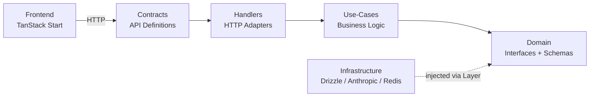
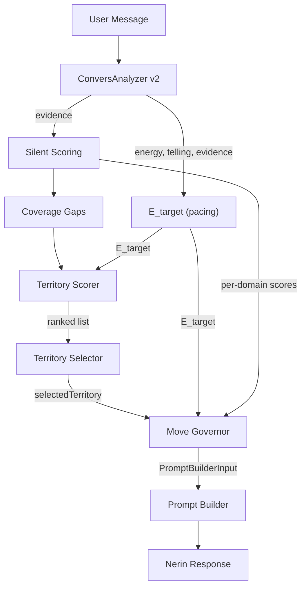

# big-ocean System Architecture

_This document is the authoritative architecture reference for the big-ocean platform. It consolidates all architectural decisions, patterns, and technical specifications into a single source of truth. Last consolidated: 2026-03-18 (integrated QR token model, conversation extension, email infrastructure, portrait reconciliation, free credit timing from UX spec gap analysis; replaced anonymous-first with auth-gated conversation per UX spec design principles #4/#5)._

## Project Context Analysis

### Requirements Overview

**Functional Requirements (Architectural Scope):**

This consolidated architecture covers the complete big-ocean system across all implemented and planned epics:

#### 1. Conversational Assessment Engine (Epics 1-4, 9-11, 23, 27-29)
- Auth-gated 25-exchange conversation with Nerin (Claude Haiku via LangChain)
- Real-time personality evidence extraction + user state (energy × telling) via ConversAnalyzer v2 (Haiku, per-message, runs BEFORE Nerin)
- Six-layer conversation pacing pipeline: ConversAnalyzer v2 → E_target pacing → Territory Scorer → Territory Selector → Move Governor → Prompt Builder → Nerin
- 25-territory catalog with continuous expectedEnergy [0,1], dual-domain tags, expected facets
- E_target: user-state-pure pacing formula (energy EMA × momentum × trust × adaptive drain ceiling)
- Territory scoring: five-term unified formula (coverageGain + adjacency + conversationSkew − energyMalus − freshnessPenalty)
- Move Governor: restraint layer with 3 intents (open/explore/close) + observation gating (4 competing variants: relate, noticing, contradiction, convergence)
- 2-layer prompt system: Common (Nerin identity, stable) + Steering (per-turn intent × observation templates, territory-as-desire framing)
- Bridge intent for territory transitions: park-bridge-close arc with natural curiosity shifting
- Cold-start perimeter selection (turn 1) → five-term scoring (turns 2-24) → close intent (turn 25)
- Session ownership verification, advisory locking, message rate limiting
- Derive-at-read: trait scores, OCEAN codes, archetypes computed from facet scores at read time
- `assessment_exchange` table: per-turn pipeline state (extraction, pacing, scoring, governor)

#### 2. Conversation Experience Evolution (Design Thinking 2026-03-04 — Architecture Defined, Implementation In Progress)
- Territory-based steering replacing facet targeting (architecture-conversation-experience-evolution.md, superseded by pacing pipeline)
- Two-axis user state model: energy (conversational intensity/load) × telling (self-propulsion vs compliance)
- Observation gating: evidence-derived phase curve + shared linear escalation controls when Nerin offers observations
- Character bible decomposed into modular constants: NERIN_PERSONA, CONVERSATION_MODE, BELIEFS_IN_ACTION, CONVERSATION_INSTINCTS (trimmed), QUALITY_INSTINCT, MIRROR_GUARDRAILS, HUMOR_GUARDRAILS, INTERNAL_TRACKING, REFLECT, STORY_PULLING
- 2-layer prompt system (2026-03-13): Common (identity) + Steering (per-turn). Collapsed from original 4-tier system.
- 5 modules dissolved: THREADING → common+bridge, MIRRORS_EXPLORE/AMPLIFY → intent×observation lookup, OBSERVATION_QUALITY → common+observation templates, EXPLORE_RESPONSE_FORMAT → skeleton system
- Six feedback loops to break: Depth Spiral, Reframing Echo, Rhetorical Dead End, flat evidence, 1D steering, portrait overload
- **Deferred:** Shadow scoring (topic avoidance detection), adaptive technique selection, meta-evidence from conversation dynamics

#### 3. Portrait & Results (Epics 11-12)
- Full portrait (Sonnet 4.6, async after PWYW payment, placeholder-row pattern)
  - Sources from **conversation evidence v2** (authoritative, not finalization evidence)
  - Depth-adaptive prompt (RICH/MODERATE/THIN based on evidence density, `finalWeight >= 0.36` threshold)
  - 16,000 max tokens (includes thinking + response), temperature 0.7
  - Portrait rating endpoint (`POST /portrait/rate`) for quality research
- Archetype lookup: in-memory registry + component-based generation fallback
- ADR-7: archetype metadata derived at read-time, not stored in DB

#### 4. Monetization (Epic 13)
- Polar.sh as merchant-of-record (EU VAT, CNIL-compliant)
- PWYW portrait unlock (minimum €1), relationship credits (€5/single, €15/5-pack)
- Append-only purchase_events event log — capabilities derived from events
- 8 event types covering purchases, grants, consumption, refunds

#### 5. Relationship Analysis (Epic 14)
- QR token model: credit-based QR code generation → scan → accept/refuse
- QR token lifecycle: generate on drawer open, 6h TTL, auto-regenerate hourly, poll every 60s, invalidate on accept
- Cross-user data access with two-step consent chain
- Relationship analysis: Sonnet LLM comparing both users' facet data + evidence
- `relationship_qr_tokens` + `relationship_analyses` tables (FKs to `assessment_results` for both users)
- Archive model: all analyses preserved, newest primary, older marked "previous version" via derive-at-read
- List endpoint: `GET /api/relationship/analyses` returns all analyses with version status

#### 6. Growth & Protection (Epic 15)
- Archetype card sharing (server-side Satori JSX → SVG → PNG)
- Budget protection: Redis-based global daily assessment gate + waitlist
- Two viral loops: archetype sharing (one-to-many) + relationship QR invitations (one-to-one)

**Non-Functional Requirements:**

| NFR | Requirement | Implementation |
|-----|-------------|----------------|
| Latency | Nerin response <2s P95 | Haiku model, streaming |
| Cost | ~$0.20 per assessment (free tier) | ~48 Haiku + 1 Sonnet (FinAnalyzer); +1 Sonnet if paid portrait |
| Resilience | ConversAnalyzer non-fatal, Redis fail-open | Retry-once-then-skip, fail-open pattern |
| Concurrency | No duplicate message processing | pg_try_advisory_lock per session |
| Privacy | Default-private profiles, explicit sharing | RLS, URL privacy, consent chains |
| Idempotency | Finalization safe to retry | Three-tier guards (result exists → evidence exists → full run) |
| Async reliability | Portrait/analysis generation recoverable | Placeholder-row + lazy retry via staleness detection |

### Technical Constraints & Dependencies

**Established Stack (Immutable):**
- Effect-ts with Context.Tag DI (hexagonal architecture)
- @effect/platform HttpApiGroup/HttpApiEndpoint contracts
- Drizzle ORM + PostgreSQL, Redis (ioredis)
- TanStack Start SSR + React 19 + TanStack Router/Query
- Better Auth for authentication
- Railway deployment, Docker Compose development

**External Dependencies (Swappable via Hexagonal Adapters):**
- Anthropic SDK (`@anthropic-ai/sdk`) + `@langchain/anthropic` — LLM provider (Claude Haiku, Sonnet)
- Polar.sh (`@polar-sh/checkout`) — payment processing
- Resend — transactional email (React Email for templates)
- Satori + `@resvg/resvg-js` — server-side card generation
- `qrcode.react` — client-side QR codes

**Key Architectural Constraints:**
- No business logic in handlers — all in use-cases
- Errors propagate unchanged (no remapping except fail-open catchTag)
- HTTP errors in contracts, infrastructure errors co-located with repo interfaces
- Derive-at-read for all aggregated scores
- Append-only for purchase events
- `__mocks__` co-location pattern for test repositories

### Cross-Cutting Concerns

1. **Cost tracking & rate limiting** — Redis fixed-window with fail-open, advisory locks, daily budget caps
2. **Error architecture** — Schema.TaggedError in contracts, plain Error in domain repos, propagation without remapping
3. **Async generation pattern** — Placeholder-row + forkDaemon + polling + lazy retry (portraits, relationship analyses)
4. **Derive-at-read** — Trait scores, OCEAN codes, archetypes, capabilities — never store what can be computed
5. **Consent & access control** — Auth-gated conversation (email collected before first turn), session ownership verification, two-step consent for cross-user data (QR token model)
6. **Transactional email** — Resend for drop-off re-engagement, Nerin check-in, deferred portrait recapture (3 email types, one-shot each)
7. **LLM prompt architecture** — Six distinct agents with separate prompts, model tiers, error resilience strategies. Nerin uses a 2-layer prompt system: Common (stable identity) + Steering (per-turn intent × observation templates with territory-as-desire framing). ConversAnalyzer v2 uses single-call dual extraction (userState + evidence).

## Technology Stack

### Established Stack (Brownfield — No Starter Evaluation)

This is a mature codebase. All technology choices are established and in production.

| Layer | Technology | Notes |
|-------|-----------|-------|
| **Runtime** | Node.js >= 20 | TypeScript, bundler mode (no .js extensions) |
| **Package Manager** | pnpm 10.4.1 | Workspace protocol, catalog for version sync |
| **Monorepo** | Turbo + pnpm workspaces | 2 apps + 6 packages |
| **Backend Framework** | Effect-ts + @effect/platform | Hexagonal architecture, Context.Tag DI |
| **Frontend Framework** | TanStack Start (React 19) | SSR, file-based routing, TanStack Query/Form/DB |
| **Styling** | Tailwind CSS v4 + shadcn/ui | Component library in @workspace/ui |
| **Database** | Drizzle ORM + PostgreSQL | Schema in infrastructure package |
| **Cache/Rate Limiting** | Redis (ioredis) | Fail-open pattern |
| **Authentication** | Better Auth | Session-based, httpOnly cookies |
| **LLM Provider** | Anthropic (Claude Haiku/Sonnet) | Via @anthropic-ai/sdk + @langchain/anthropic |
| **Payment** | Polar.sh | Merchant-of-record, @polar-sh/checkout |
| **Email** | Resend | Transactional email, React Email templates |
| **Testing** | Vitest + @effect/vitest | `__mocks__` co-location, TestClock |
| **Linting** | Biome | Shared config from @workspace/lint |
| **CI/CD** | GitHub Actions | lint → build → test → validate commits |
| **Deployment** | Railway + Docker Compose | Production: Railway; Dev: Docker Compose |

## Core Architectural Decisions

### Decision Priority Analysis

**Already Decided (Established in Codebase):**
All major architectural decisions are implemented and in production. This section documents them as the authoritative reference.

**Deferred Decisions (Post-Current State):**
- Shadow scoring — topic avoidance detection, avoidance classification (requires pacing pipeline running)
- V1 constant calibration — E_target weights, scorer weights, observation gating thresholds (empirical post-launch)
- Continuation experience UX details — conversation 2 model defined (new session + parent_session_id + prior state init), UX polish TBD
- SSE for real-time portrait/analysis status (replace polling)
- Background job queue for generation retry (replace lazy polling)
- Event-driven architecture for cross-domain side effects
- Gift product flows (Phase B)
- Full GDPR compliance — encryption at rest, deletion/portability, audit logging (Epic 6)

### ADR-1: Hexagonal Architecture with Effect-ts

**Decision:** Ports & adapters architecture using Effect-ts Context.Tag for dependency inversion.

**Layers:**



| Layer | Location | Responsibility |
|-------|----------|---------------|
| Contracts | `packages/contracts` | HTTP API definitions (HttpApiGroup/HttpApiEndpoint), shared frontend ↔ backend |
| Handlers | `apps/api/src/handlers` | Thin HTTP adapters — NO business logic |
| Use-Cases | `apps/api/src/use-cases` | Pure business logic — main unit test target |
| Domain | `packages/domain` | Repository interfaces (Context.Tag), schemas, branded types, pure functions |
| Infrastructure | `packages/infrastructure` | Repository implementations (Drizzle, Anthropic, Redis, Pino) |

**Hard Rules:**
- No business logic in handlers — all logic in use-cases
- Dependencies point inward toward domain abstractions
- Infrastructure injected via Effect Layer system

### ADR-2: Error Architecture

**Decision:** Three-location error system with propagation without remapping.

| Error Type | Location | Format |
|-----------|----------|--------|
| HTTP-facing errors | `packages/contracts/src/errors.ts` | `Schema.TaggedError` |
| Infrastructure errors | Co-located with repo interface in `packages/domain/src/repositories/` | Plain `Error` with `_tag` |
| Domain logic errors | Use contract errors directly | `Schema.TaggedError` |

**Propagation Rule:** Use-cases and handlers must NOT remap errors. Only allowed `catchTag` is fail-open resilience (e.g., Redis unavailable → log and continue).

### ADR-3: LLM Agent Architecture

**Decision:** Four distinct LLM agents with purpose-separated tiers. ConversAnalyzer evidence is the single source of truth for all scoring — no finalization re-analysis step.

| Agent | Model | When | Purpose | Error Handling |
|-------|-------|------|---------|---------------|
| Nerin | Haiku 4.5 | Every message | Conversational agent with 2-layer composed prompt (Common + Steering) | Fatal |
| ConversAnalyzer v2 | Haiku 4.5 | Every message, **before Nerin** (sequential, not parallel) | Dual extraction: user state (energy × telling) + evidence records — **single source of truth** for all scoring and pacing | Three-tier: strict ×3 → lenient ×1 → neutral defaults |
| Full Portrait | Sonnet 4.6 | Once after PWYW payment | Deep narrative from conversation evidence v2 | Placeholder + lazy retry |
| Relationship Analysis | Sonnet 4.6 | Once on QR token accept | Cross-user comparison | Placeholder + lazy retry |

**Per-assessment LLM budget (free tier):** ~48 Haiku ≈ $0.20. Sonnet only if paid portrait.

**Critical pipeline ordering change:** ConversAnalyzer v2 runs BEFORE Nerin (not parallel). The pacing pipeline (E_target → Scorer → Selector → Governor → Prompt Builder) requires energy and telling signals to compose Nerin's system prompt. This adds ConversAnalyzer's latency (~1-2s Haiku) to the critical path before Nerin responds. The tradeoff is accepted because steering quality requires user state signals.

**ConversAnalyzer v2 output contract:**

```typescript
{
  userState: {
    energyBand: EnergyBand,       // "minimal"|"low"|"steady"|"high"|"very_high"
    tellingBand: TellingBand,     // "fully_compliant"|...|"strongly_self_propelled"
    energyReason: string,         // short justification
    tellingReason: string,        // short justification
    withinMessageShift: boolean,  // energy or telling shifted within the message
  },
  evidence: FacetEvidence[],      // unchanged from v1
  tokenUsage: TokenUsage,
}
```

**Full specification:** [ConversAnalyzer v2 Architecture](./architecture-conversation-pacing.md#adr-cp-13-conversanalyzer-v2--single-call-dual-extraction)

### ADR-4: Evidence Model (v2 — Deviation-Based)

**Decision:** Single-tier evidence from ConversAnalyzer feeds everything — steering, results, portraits, relationship analyses.

**Schema (`conversation_evidence`):**

| Field | Type | Notes |
|-------|------|-------|
| `bigfive_facet` | enum (30 facets) | Which facet |
| `deviation` | smallint (-3 to +3) | Distance from population average |
| `strength` | enum (weak/moderate/strong) | Signal diagnosticity |
| `confidence` | enum (low/medium/high) | Certainty level |
| `domain` | enum (6 life domains) | Context |
| `note` | text (max 200) | Behavioral paraphrase |

**Quality gate:** `computeFinalWeight(strength, confidence) >= 0.36` (configurable via `MIN_EVIDENCE_WEIGHT`).
- `finalWeight = STRENGTH_WEIGHT[strength] × CONFIDENCE_WEIGHT[confidence]`
- Threshold 0.36 = moderate (0.6) × medium (0.6)
- No cap on records — LLM extracts everything, filter drops weak signals

**Weight matrices:**

| Strength | Weight | | Confidence | Weight |
|----------|--------|-|-----------|--------|
| weak | 0.3 | | low | 0.3 |
| moderate | 0.6 | | medium | 0.6 |
| strong | 1.0 | | high | 0.9 |

**Deviation → score mapping** (derive-at-read):
```text
score = 10 + deviation × (10/3)
```
Deviation 0 → score 10 (midpoint), +3 → 20 (max), -3 → 0 (min).

**Dual-facet extraction:** ConversAnalyzer prompted to find DIFFERENT facet with NEGATIVE deviation for every record. Polarity balance target: ≥30% negative deviations.

### ADR-5: Territory-Based Steering — Six-Layer Pipeline

**Decision:** Pure domain functions drive conversation steering via a six-layer pipeline. Legacy facet-targeting, micro-intents, domain streak tracking, and DRS-based scoring have been replaced by a unified five-term territory scorer with user-state-pure pacing.

**The core frame:** The product is not a personality assessment with a conversation wrapper. It is a guided self-discovery conversation with an assessment engine hidden underneath.

**Six-layer pipeline architecture:**



| Layer | Responsibility | Output |
|-------|---------------|--------|
| **Pacing (E_target)** | Estimate what the conversation can sustain | `E_target` [0, 1] |
| **Territory Scorer** | Rank all 25 territories by unified formula | Sorted ranked list with per-term breakdowns |
| **Territory Selector** | Pick from ranked list via deterministic rules | `selectedTerritory` |
| **Move Governor** | Constrain Nerin: intent, entry pressure, observation gating | `PromptBuilderInput` (3 intents) |
| **Prompt Builder** | Compose 2-layer system prompt from Common + Steering | Complete system prompt |
| **Silent Scoring** | Extract evidence, update estimates | Facet scores, confidence, coverage gaps |

**Separation invariants:**
- Coverage flows to territory scorer, never through E_target
- Each layer does one job: scorer ranks, selector picks, Governor constrains, Nerin executes
- Silent scoring never affects Nerin's tone directly

**Priority hierarchy** — when forces conflict:
1. **Protect user state** — never push harder because a facet is thin
2. **Maintain conversational momentum** — favor adjacent transitions
3. **Apply quiet pressure for breadth and depth** — through territory selection, never through E_target

**Key functions** in `packages/domain/src/utils/`:
- `computeETarget(energy, telling, priorState)` — user-state-pure pacing formula
- `scoreAllTerritories(E_target, coverage, catalog, visitHistory, turn)` — five-term unified formula
- `selectTerritory(scorerOutput)` — cold-start perimeter or argmax
- `computeGovernorOutput(territory, E_target, domainScores, ...)` — intent + observation gating
- `buildSystemPrompt(governorOutput, catalog)` — 2-layer prompt composition

**Cold-start (turn 1):** `cold-start-perimeter` selection from top-scored territories. **Turns 2-24:** argmax from five-term scorer. **Turn 25:** close intent (best observation wins).

**Full specification:** [Conversation Pacing Pipeline Architecture](./architecture-conversation-pacing.md)

### ADR-6: Derive-at-Read

**Decision:** Trait scores, OCEAN codes, archetypes, and capabilities recomputed from atomic sources at read time — never stored as pre-aggregated values.

| Derived Value | Source of Truth | Computed In |
|--------------|----------------|-------------|
| Trait scores (0-120) | 30 facet scores (from evidence deviation) | `get-results.use-case.ts`, `get-public-profile.use-case.ts` |
| OCEAN code (5-letter) | Facet scores → thresholds → semantic letters per trait | `generateOceanCode()` pure function |
| Archetype name/description/color | OCEAN code (4-letter, first 4 traits only) | `lookupArchetype()` in-memory registry |
| Trait summary | OCEAN code (5-letter) | `deriveTraitSummary()` pure function |
| Available credits | purchase_events aggregate | `getCredits()` use-case |
| Portrait status | portraits table row state | Derived in `get-portrait-status.use-case.ts` |
| Portrait version status | portrait's `assessment_result_id` vs latest result for user | `isLatestResult(resultId, userId)` shared utility |
| Relationship analysis version | analysis's `user_a_result_id` / `user_b_result_id` vs latest results | `isLatestResult(resultId, userId)` shared utility |
| Last conversation topic | last `assessment_exchange` row's `selected_territory` field | Territory name from catalog, used for re-engagement email |

**Rule:** If a value can be computed from evidence or events, compute it in the read path.

### ADR-7: Placeholder-Row Async Pattern

**Decision:** All slow LLM generation uses insert-placeholder → forkDaemon → poll → lazy retry.

**Four-part pattern:**
1. **Insert placeholder** — DB row with `content: null`, `retry_count: 0`
2. **Fork daemon** — `Effect.forkDaemon(generate(...))` — doesn't block HTTP response
3. **Client polls** — TanStack Query `refetchInterval` while `generating`, stops on `ready`/`failed`
4. **Lazy retry** — Status endpoint checks staleness (>5 min + retries remaining) → spawns new daemon

**Used by:** Full portrait generation, relationship analysis generation.

**Idempotency:** `UPDATE ... WHERE content IS NULL` ensures only one daemon's result is written.

### ADR-8: Better Auth + Polar Integration

**Decision:** Polar integrated as a Better Auth plugin, not a standalone webhook handler. Customer creation and payment processing handled within Better Auth's plugin system.

**Plugin stack** in `packages/infrastructure/src/context/better-auth.ts`:
```typescript
betterAuth({
  plugins: [
    haveIBeenPwned(),
    polar({
      client: polarClient,
      createCustomerOnSignUp: true,
      use: [checkout(), webhooks({ onOrderPaid })],
    }),
  ],
})
```

**Customer sync:** `externalId = userId` — Polar customer created automatically on signup with Better Auth user ID as external identifier. Webhook receives `order.customer.externalId` to route purchases.

**Webhook handler (`onOrderPaid`):** Lives inside Better Auth Polar plugin. Uses plain Drizzle (not Effect) for transaction:
- Insert purchase event (`onConflictDoNothing` for idempotency)
- Insert portrait placeholder if portrait-triggering purchase
- On first `portrait_unlocked` event: also insert `free_credit_granted` event (only if no prior `free_credit_granted` exists for this user) — this is the "PWYW >= EUR1 → free EUR5 credit" conversion nudge
- Portrait daemon spawning handled separately via Effect use-case

**Database hooks:**
- `user.create.after` — accepts pending QR invitations (no credit grant — credit is granted on first portrait purchase)
- `session.create.after` — no longer needed for session linking (sessions always have userId)

**Product mapping:** Polar product IDs (from config) → internal event types:
- `polarProductPortraitUnlock` → `portrait_unlocked`
- `polarProductRelationshipSingle` → `credit_purchased` (1 unit)
- `polarProductRelationship5Pack` → `credit_purchased` (5 units)
- `polarProductExtendedConversation` → `extended_conversation_unlocked`

### ADR-9: Append-Only Purchase Events

**Decision:** Immutable `purchase_events` event log. Capabilities derived from events, never stored as mutable state.

**8 event types:** `free_credit_granted`, `portrait_unlocked`, `credit_purchased`, `credit_consumed`, `extended_conversation_unlocked`, `portrait_refunded`, `credit_refunded`, `extended_conversation_refunded`

**Credit formula:** `available = COUNT(free_credit_granted + credit_purchased) × units - COUNT(credit_consumed)`

**Constraints:** INSERT-only, corrections via compensating events (refunds). `polar_checkout_id` UNIQUE for idempotent webhook processing.

### ADR-10: QR Token Relationship Model

**Decision:** Replace invitation link model with QR token model. Users generate ephemeral QR codes to initiate relationship analyses.

**QR token lifecycle:**
1. User A opens relationship drawer → `POST /api/relationship/qr/generate` creates token (6h TTL)
2. QR code displayed in drawer, auto-regenerates hourly
3. User A's client polls `GET /api/relationship/qr/:token/status` every 60s → `valid | accepted | expired`
4. User B scans QR → `/relationship/qr/:token` route → auth gate + assessment completion check
5. User B accepts (`POST /qr/:token/accept`) → consume credit, invalidate token, create analysis placeholder, fork daemon
6. User B refuses (`POST /qr/:token/refuse`) → token stays valid, no notification to User A

**New table: `relationship_qr_tokens`:**

| Column | Type | Notes |
|--------|------|-------|
| `id` | uuid | PK |
| `user_id` | uuid | FK → user (generator) |
| `token` | text | UNIQUE, URL-safe |
| `expires_at` | timestamptz | 6h from creation |
| `status` | enum | `active`, `accepted`, `expired` |
| `accepted_by_user_id` | uuid | FK → user (nullable, set on accept) |
| `created_at` | timestamptz | |

**Updated `relationship_analyses` schema:**

| Change | Details |
|--------|---------|
| DROP | `invitation_id` FK → `relationship_invitations` |
| ADD | `user_a_result_id` FK → `assessment_results` |
| ADD | `user_b_result_id` FK → `assessment_results` |
| KEEP | `user_a_id`, `user_b_id` FK → `user` |

**Relationship analysis archive model:** All analyses are preserved. The newest is primary; older entries are marked "previous version" via derive-at-read. Version detection: at read time, check if `assessment_results` has a newer row for either `user_a_id` or `user_b_id`. If yes, the analysis is "previous version." Same pattern as EvolutionBadge for portraits. Shared utility: `isLatestResult(resultId, userId) → boolean`.

**New use-cases:** `generate-qr-token`, `get-qr-token-status`, `accept-qr-invitation`, `refuse-qr-invitation`, `list-relationship-analyses`

**Removed:** `relationship_invitations` table, invitation endpoints, `InvitationBottomSheet` component, invitation-specific card states (`pending-sent`, `pending-received`, `declined`)

### ADR-11: Conversation Extension Model

**Decision:** Conversation extension creates a new `assessment_session` row linked to the original via `parent_session_id` FK.

**Schema change:** `assessment_sessions` gains `parent_session_id` (nullable FK → `assessment_sessions`).

**Extension behavior:**
- New session starts from exchange 1 (of 25) but initializes the pacing pipeline from the prior session's last user state (final exchange's smoothed energy, comfort, drain values)
- Loads all prior evidence from the parent session for coverage computation
- Nerin references "themes and patterns" from prior evidence, not specific exchanges
- On completion (exchange 25), generates a new `assessment_results` row from combined evidence of both sessions
- Prior portrait's `assessment_result_id` points to older result → "previous version"
- Prior relationship analyses' `user_X_result_id` points to older result → "previous version"
- User must repurchase portrait + relationship re-analysis after extension

**New use-case:** `activate-conversation-extension` — verifies `extended_conversation_unlocked` purchase event, creates new session with parent link

### ADR-12: Email Infrastructure (Resend)

**Decision:** Resend as transactional email provider with React Email for templates.

**Three email types for MVP:**
1. **Drop-off re-engagement** — "You and Nerin were talking about [last territory]..." Sent once after session inactive for X hours. One email only, then silence.
2. **Nerin check-in** — ~2 weeks post-assessment. References tension/theme from portrait. Nerin-voiced. One email only.
3. **Deferred portrait recapture** — "Nerin's portrait is waiting for you." Sent to users who skipped PWYW. Sent once after X days.

**Last conversation topic derivation:** No new column needed. The re-engagement email template queries the last `assessment_exchange` row's selected territory field for the session. The territory name from the catalog provides the "last conversation topic."

**New infrastructure:**
- `ResendEmailRepository` interface in `packages/domain/src/repositories/resend-email.repository.ts`
- `ResendEmailRepositoryLive` implementation in `packages/infrastructure/src/repositories/resend-email.resend.repository.ts`
- Email templates: React Email components (consistent with frontend styling)
- Free tier: 100 emails/day

### ADR-13: Portrait Reconciliation

**Decision:** On results page load, if a `portrait_unlocked` purchase event exists but no portrait row exists, auto-insert placeholder and fork daemon.

**Implementation:** Reconciliation logic in `reconcile-portrait-purchase.use-case.ts`, called from the results page loader:
1. Does `portrait_unlocked` event exist for this user?
2. Does a portrait row exist?
3. If (1) yes and (2) no → insert placeholder, fork daemon

This covers the "browser closed mid-payment" edge case where webhook fired but placeholder INSERT failed.

### ADR-14: Fail-Open Resilience

**Decision:** Redis-dependent features use fail-open — if Redis unavailable, request proceeds and failure is logged.

**Applies to:** Cost tracking, rate limiting, budget checks. Profile access logging is fire-and-forget.

### ADR-15: Auth-Gated Conversation (Replaces Anonymous-First)

**Decision:** Authentication required before the conversation starts. The `/chat` route redirects unauthenticated users to `/login?redirectTo=/chat`. Landing page (`/`) and public profiles (`/public-profile/:id`) remain fully unauthenticated.

**Flow:** Landing page (unauth) → `/chat` → auth gate (redirect to login/signup) → return to `/chat` → start assessment (authenticated) → 25 messages → generate results → results page.

**Why:** Auth-gating before the first turn collects email upfront, enabling automated recapture for interrupted sessions (drop-off re-engagement emails). This converts the save-and-resume problem from "lost anonymous user" to "delayed user with a nudge." The UX spec explicitly chose higher upfront friction for better retention.

**What this removes:**
- `AssessmentTokenSecurity` (httpOnly cookie token for anonymous sessions)
- `startAnonymousAssessment()` use-case — only `startAuthenticatedAssessment()` remains
- Dual auth in `sendMessage` handler — only `CurrentUser` from auth middleware
- `ChatAuthGate` component (inline auth gate after farewell) — replaced by route-level redirect
- `ResultsSignUpForm` / `ResultsSignInForm` — replaced by standard login/signup with `redirectTo` param
- `linkAnonymousAssessmentSession()` in Better Auth hooks — sessions always have `userId` from creation
- `results-auth-gate-storage.ts` (24h localStorage recovery for anonymous users)
- `sessionToken` column on `assessment_sessions` table — not needed
- `assessment_sessions.userId` becomes `NOT NULL`

**Auth middleware change:** Assessment group switches from `OptionalAuthMiddleware` to `AuthMiddleware` (or auth required on `start` endpoint at minimum).

**Auth gates (from UX spec, updated per ADR-24):**

| Route | Unauthenticated (incl. unverified) | Auth'd, no assessment | Auth'd, assessment complete |
|-------|----------------|------|------|
| `/` (landing) | Full access | Full access | Full access |
| `/public-profile/:id` | Full access | Full access | Full access + relationship CTA |
| `/verify-email` | Verify-email page (post-signup) | N/A (already verified) | N/A |
| `/chat` | → sign up | Start/resume conversation | Resume or extension CTA |
| `/dashboard` | → sign up | Empty state or in-progress: progress bar + "Continue" CTA | Full dashboard (identity, credits, relationships) |
| `/results` | → sign up | → `/chat` | Results page |
| `/relationship/:id` | → sign up | → `/chat` | Analysis (if participant) |
| QR URL | Login/sign up → return to accept screen | "Complete assessment first" | Accept screen |

**Unverified users:** Treated as unauthenticated. Better Auth's `requireEmailVerification: true` prevents session creation for unverified accounts, so route-level `beforeLoad` auth checks naturally redirect them. See ADR-24 for full details.

### ADR-16: Archetype Metadata Not Stored

**Decision:** Remove derived archetype fields from `public_profile`. Keep `oceanCode4` for DB queries. Derive archetype name, description, color, and trait summary at read-time via pure functions.

### ADR-17: E_target — User-State-Pure Pacing Formula

**Decision:** The pacing formula computes a target energy for the next exchange based solely on user state. No phase term. No time pressure. No monetization logic. No coverage pressure.

E_target is a **pipeline of transforms**, not an additive sum:

```text
1. E_s        = EMA of energy (smoothed anchor, init 0.5, lambda=0.35)
2. V_up/down  = momentum from smoothed energy (split for asymmetric treatment)
3. trust      = f(telling) — qualifies upward momentum only
4. E_shifted  = E_s + alpha_up * trust * V_up - alpha_down * V_down
5. comfort    = running mean of all raw E values (adaptive baseline, init 0.5)
6. d          = average headroom-normalized excess cost over last 5 turns
7. E_cap      = concave fatigue ceiling from drain (floor=0.25, maxcap=0.9)
8. E_target   = clamp(min(E_shifted, E_cap), 0, 1)
```

**Key design choices:**
- **Telling is asymmetric.** Qualifies upward momentum (is this self-propelled or performative?) but does not dampen downward momentum (always respect cooling).
- **Drain measures excess cost above adaptive comfort.** Comfort adapts to the user's natural energy level (running mean, init 0.5). Only energy above the user's own baseline accumulates as fatigue.
- **Drain is a ceiling, not a subtraction.** Fatigue protection dominates by construction.
- **Coverage is NOT in the formula.** Coverage pressure is assessment state, not user state. Coverage belongs in territory policy.

**Weight hierarchy:** `drain ceiling (structural) > alpha_down (0.6) >= alpha_up (0.5)`. No coverage term.

**Two-axis state model (Energy × Telling):** User state is a 2D space. Energy [0,1] = conversational intensity/load (cost to user). Telling [0,1] = self-propulsion vs compliance. ConversAnalyzer v2 extracts both as bands, pipeline maps to [0,1] directly.

**Full specification:** [Pacing Architecture ADR-CP-1](./architecture-conversation-pacing.md#adr-cp-1-e_target-pacing-formula--user-state-pure)

### ADR-18: Territory Scorer — Unified Five-Term Formula

**Decision:** A single additive formula ranks all 25 territories per turn. Five terms, each capturing a distinct concern.

```text
score(t) = coverageGain(t) + adjacency(t) + conversationSkew(t)
         - energyMalus(t) - freshnessPenalty(t)
```

| Term | What It Does | Bounded |
|------|-------------|---------|
| `coverageGain` | Boost territories that fill evidence gaps | [0, 1] via sqrt + source normalization |
| `adjacency` | Boost narratively close territories (Jaccard on domains + facets) | [0, 1] by Jaccard definition |
| `conversationSkew` | Shape session arc — light early, heavy late | [0, 1] by ramp clamp |
| `energyMalus` | Penalize beyond user capacity (quadratic) | [0, w_e] |
| `freshnessPenalty` | Penalize recently visited | [0, w_f] |

**Territory catalog:** 25 territories with continuous `expectedEnergy` [0,1], dual-domain tags (exactly 2 `LifeDomain` per territory), and 3-6 expected facets. All 30 Big Five facets covered.

**Territory Selector:** Three code paths — cold-start-perimeter (turn 1), argmax (turns 2-24), argmax (turn 25, closing behavior in Governor).

**Move Governor:** Restraint layer with 3 intents (open/explore/close), entry pressure (direct/angled/soft), and 4-variant observation gating (relate, noticing, contradiction, convergence). Observation gating uses evidence-derived phase curve + shared linear escalation: `threshold(n) = OBSERVE_BASE + OBSERVE_STEP × n`.

**Full specification:** [Pacing Architecture ADR-CP-4](./architecture-conversation-pacing.md#adr-cp-4-territory-scorer--unified-five-term-formula)

### ADR-19: 2-Layer Prompt System with Territory-as-Desire

**Decision:** Nerin's system prompt is a 2-layer architecture: Common (stable identity) + Steering (per-turn). The original 4-tier system and the 3-tier contextual composition (ADR-CP-7) are collapsed into 2 layers. Territory guidance is framed as Nerin's own curiosity, not an external instruction.

**Root cause addressed:** Nerin ignored territory assignments because: (1) steering was buried at the bottom (~50 words) while identity modules dominated (~1,500 words at top), (2) suggestive language with explicit permission to ignore, (3) unconditional depth instinct competed with steering, (4) territory transitions were invisible to Nerin.

**Layer 1 — Common (who Nerin is, stable across all turns):**
- NERIN_PERSONA, CONVERSATION_MODE, BELIEFS_IN_ACTION
- CONVERSATION_INSTINCTS (trimmed — unconditional "go deeper" removed, guarded→angle-change moved to pressure modifiers)
- QUALITY_INSTINCT, MIRROR_GUARDRAILS, HUMOR_GUARDRAILS, INTERNAL_TRACKING
- REFLECT, STORY_PULLING (moved from contextual to common)
- "Name it and hand it back" + "go beyond their framework"

**Layer 2 — Steering (per-turn, changes every turn):**
- Prefix: "What's caught your attention this turn:"
- Intent × observation template (13 templates: 1 open + 4 explore + 4 bridge + 4 close)
- Pressure modifier (explore + bridge only): direct / angled / soft
- Curated mirrors by intent × observation lookup

**Territory-as-desire framing:** Instead of "Suggested direction — you could explore something like..." → "Your curiosity is on {territory.name} — {territory.description}." Territory is Nerin's intrinsic curiosity, not an external instruction. The LLM follows the instruction because it *wants* to, not because it's told to.

**Bridge intent for territory transitions:** When territory changes, the Governor emits `intent: "bridge"`. Bridge response arc: (1) park current thread, (2) bridge observation connecting old→new territory, (3) closing question lands in new territory. Three-tier fallback: find a connection → flag and leave → clean jump.

**Module dissolution (from 4-tier to 2-layer):**

| Dissolved Module | New Home |
|-----------------|----------|
| THREADING | Common ("reference earlier parts") + bridge intent templates |
| MIRRORS_EXPLORE / MIRRORS_AMPLIFY | Intent × observation lookup table |
| OBSERVATION_QUALITY | Common + observation templates |
| EXPLORE_RESPONSE_FORMAT | Replaced by 13 skeleton templates |
| Unconditional "go deeper" | Removed — depth is steering-controlled |

**25 territory descriptions in Nerin's curiosity voice:**

Each territory has a `name` and `description` phrased as what Nerin is curious about ("how they...", "what they...", "who they..."). Example: `friendship-depth` → "who they let close, what earns that, and what they need from it."

**Prompt assembly:**
```
[Layer 1: Common modules]

What's caught your attention this turn:
[Intent × observation template with filled parameters]
[Pressure modifier if explore/bridge]

[Curated mirror examples for this intent × observation]
You can discover new mirrors in the moment — but the biology must be real.
```

**Source documents:** [Problem Solution 2026-03-13](../../problem-solution-2026-03-13.md), [Brainstorming Session 2026-03-13](../../brainstorming/brainstorming-session-2026-03-13.md)

### ADR-20: Three-Tier Extraction with Fail-Open Defaults

**Decision:** ConversAnalyzer v2 extraction uses a three-tier retry strategy with decreasing strictness. Failure at any tier degrades gracefully — the conversation never breaks, it just becomes less steered.

```text
Tier 1 (attempts 1-3): Strict schema, temperature 0.9
  → Full validation (rejects if ANY item invalid)

Tier 2 (attempt 4): Lenient schema, temperature 0.9
  → Filters invalid items, keeps valid ones
  → userState and evidence parsed independently

Tier 3 (no LLM call): Neutral defaults
  → energy=0.5, telling=0.5, evidence=[]
  → Comfort-level conversation continues
```

**Two repository methods:** `analyze` (strict) and `analyzeLenient` (lenient). The pipeline orchestrates: `strict ×3 → lenient ×1 → neutral defaults`.

**Full specification:** [Pacing Architecture ADR-CP-12](./architecture-conversation-pacing.md#adr-cp-12-three-tier-extraction-with-fail-open-defaults)

### ADR-21: Exchange State Table

**Decision:** A dedicated `assessment_exchange` table stores all per-turn pipeline state and metrics. One row per exchange (user message → system computation → assistant response).

```sql
assessment_exchange (
  id                    uuid        PK
  session_id            uuid        FK → assessment_session
  turn_number           smallint    NOT NULL  -- 1-25 (1-indexed)

  -- Extraction (ConversAnalyzer v2)
  energy, energy_band, telling, telling_band, within_message_shift, state_notes, extraction_tier

  -- Pacing (E_target computation)
  smoothed_energy, comfort, drain, drain_ceiling, e_target

  -- Territory Scoring + Selection
  scorer_output (jsonb), selected_territory, selection_rule

  -- Governor
  governor_output (jsonb), governor_debug (jsonb)

  -- Derived annotations (observability only)
  session_phase, transition_type
)
```

**Reference pattern:** `assessment_exchange` (1 per turn) → `assessment_message` (2 per exchange: user + assistant) → `conversation_evidence` (N per exchange). Messages and evidence reference the exchange via `exchange_id` FK.

**Full specification:** [Pacing Architecture ADR-CP-14](./architecture-conversation-pacing.md#adr-cp-14-persistence--exchange-state-table)

### Decision Impact Analysis

**Cross-Component Dependencies:**
```text
User message → ConversAnalyzer v2 (energy+telling+evidence) → E_target → Scorer → Selector → Governor → Prompt Builder → Nerin → save exchange
Assessment complete → compute results (derive-at-read) → redirect to results page
Polar checkout closes → Better Auth webhook → purchase event + placeholder → forkDaemon → polling → "ready"
First portrait purchase → onOrderPaid inserts portrait_unlocked + free_credit_granted (conditional) → free relationship credit
QR scan → accept → consume credit → placeholder row → forkDaemon → polling → both users see analysis
User signup → Polar customer created (externalId = userId) → accepts pending QR invitations (no credit grant)
Conversation extension purchase → new assessment_session (parent_session_id FK) → 25 exchanges → new assessment_results → prior portrait/analyses become "previous version"
Results page load → reconcile-portrait-purchase: if portrait_unlocked event but no portrait row → auto-insert placeholder + fork daemon
```

## Implementation Patterns & Consistency Rules

### Naming Patterns

**Database (Drizzle schema):**
- Tables: `snake_case` plural (`assessment_sessions`, `purchase_events`)
- Columns: `snake_case` (`assessment_session_id`, `bigfive_facet`)
- Foreign keys: `{referenced_table_singular}_id` (`user_id`, `assessment_session_id`)
- Enums: `snake_case` (`evidence_domain`, `bigfive_facet_name`)
- Indexes: auto-generated by Drizzle

**TypeScript:**
- Properties: `camelCase` (`sessionId`, `bigfiveFacet`)
- Types/Interfaces: `PascalCase` (`FacetName`, `TraitResult`, `EvidenceInput`)
- Constants: `UPPER_SNAKE_CASE` (`BIG_FIVE_TRAITS`, `ALL_FACETS`, `NERIN_PERSONA`)
- Branded types: `PascalCase` (`UserId`, `SessionId`)

**Files:**
- Repository interface: `kebab-case.repository.ts` (`assessment-message.repository.ts`)
- Repository impl: `kebab-case.{provider}.repository.ts` (`assessment-message.drizzle.repository.ts`)
- Use-case: `kebab-case.use-case.ts` (`send-message.use-case.ts`)
- Tests: `kebab-case.use-case.test.ts` (co-located in `__tests__/`)
- Mocks: `__mocks__/{same-filename-as-real}.ts`

**Exports:**
- Live layers: `{Name}{Provider}RepositoryLive` (`AssessmentMessageDrizzleRepositoryLive`)
- Repository tags: `{Name}Repository` (`AssessmentMessageRepository`)

**API endpoints:**
- Effect/Platform HttpApiEndpoint names: `camelCase` (`sendMessage`, `generateResults`)
- URL paths: `kebab-case` (`/api/assessment/generate-results`)

### Structure Patterns

**Repository interface → implementation → mock:**
```text
packages/domain/src/repositories/
  assessment-message.repository.ts          # Context.Tag definition

packages/infrastructure/src/repositories/
  assessment-message.drizzle.repository.ts  # Layer.effect implementation
  __mocks__/
    assessment-message.drizzle.repository.ts  # In-memory mock Layer
```

**Use-case → test:**
```text
apps/api/src/use-cases/
  send-message.use-case.ts
  __tests__/
    send-message.use-case.test.ts
```

**Pure domain functions:**
```text
packages/domain/src/utils/        # formula.ts, scoring.ts, ocean-code-generator.ts
packages/domain/src/constants/    # nerin-persona.ts, facet-definitions.ts
packages/domain/src/types/        # evidence.ts, branded types
packages/domain/src/config/       # app-config.ts interface + defaults
```

### Process Patterns

**Use-case pattern:**
```typescript
export const myUseCase = (input: Input) =>
  Effect.gen(function* () {
    const repo = yield* SomeRepository;    // Access via Context.Tag
    const result = yield* repo.doThing();  // Yield Effect operations
    return result;                          // Return typed result
  });
```

**Error handling — what agents MUST follow:**
1. HTTP errors: define in `contracts/src/errors.ts` as `Schema.TaggedError`
2. Infrastructure errors: co-locate with repo interface in `domain/src/repositories/`
3. Use-cases throw contract errors directly — no intermediate error types
4. Never remap errors in handlers or use-cases (except fail-open `catchTag`)

**Test pattern — what agents MUST follow:**
```typescript
import { vi } from "vitest";                    // FIRST
vi.mock("@workspace/infrastructure/repositories/...");  // vi.mock calls
import { describe, expect, it } from "@effect/vitest";  // AFTER vi.mock
```
- Never import from `__mocks__/` paths directly
- Each test composes minimal local `TestLayer` via `Layer.mergeAll(...)`
- No centralized TestRepositoriesLayer

**Async generation — what agents MUST follow:**
1. Insert placeholder row (content: null) BEFORE forkDaemon
2. Daemon updates with `WHERE content IS NULL` (idempotent)
3. Status endpoint derives state from data, doesn't store status column
4. Lazy retry checks staleness + retry_count in status endpoint

**Better Auth integration — what agents MUST follow:**
- Auth routes: `/api/auth/*` and `/api/polar/*` handled by Better Auth middleware
- Effect routes: everything else handled by @effect/platform
- Database hooks for side effects on user/session creation (session linking; free credit granted on first portrait purchase, not signup)
- Polar webhook processing in Better Auth plugin, portrait daemon spawning in Effect

### Anti-Patterns to Avoid

- Adding business logic in handlers
- Remapping errors in use-cases or handlers
- Storing derived values (trait scores, archetypes, capabilities)
- Using `as any` without comment explaining why
- Importing from `__mocks__/` paths
- Creating centralized test layers
- Adding `.js` extensions to imports
- Storing archetype metadata in DB (use pure function derivation)
- Using `facet_evidence` or `finalization_evidence` tables (deprecated — use `conversation_evidence`)
- **Pacing pipeline anti-patterns:**
  - Creating 0-10 or 0-100 intermediate scales (all values are [0,1] — no normalization step exists)
  - Adding coverage pressure to E_target (coverage belongs in territory policy, not user-state pacing)
  - Passing expected facets to Nerin or ConversAnalyzer (biases extraction)
  - Storing DRS/E_target in the database (computed per exchange from available data)
  - A pure function calling `yield* Repository` (pure functions take all inputs as arguments)
  - Using `_tag` for ObservationFocus discriminant (use `type` — it's not an Effect tagged type)
  - Zero-indexing turn numbers (pipeline assumes 1-indexed [1, 25])
  - Framing territory as an external instruction to Nerin ("you must ask about X") — use desire framing ("your curiosity is on...")
  - Adding unconditional depth instincts ("go deeper") — depth is steering-controlled

### Enforcement

- **Biome:** Shared config from `@workspace/lint` — auto-fix on staged files via pre-commit hook
- **TypeScript:** Strict mode, bundler resolution, `import type` enforced by Biome
- **Pre-push hook:** lint + typecheck + test must pass
- **Commit-msg hook:** Conventional commit format required
- **CI/CD:** GitHub Actions validates lint → build → test → commit format

## Project Structure & Boundaries

### Complete Project Directory Structure

```text
big-ocean/                                    # Monorepo root
├── .env / .env.example / .env.test           # Environment config (dev, test)
├── .githooks/                                # Git hooks (simple-git-hooks)
│   ├── commit-msg                            # Conventional commit validation
│   ├── pre-commit                            # Biome auto-fix on staged files
│   └── pre-push                              # lint + typecheck + test gate
├── .github/workflows/ci.yml                  # GitHub Actions CI pipeline
├── biome.json                                # Root Biome config (extends @workspace/lint)
├── compose.yaml                              # Docker Compose (dev: API + PG + Redis)
├── compose.test.yaml                         # Docker Compose (integration tests)
├── compose.e2e.yaml                          # Docker Compose (e2e tests)
├── drizzle.config.ts                         # Drizzle Kit migration config
├── package.json                              # Root workspace scripts
├── pnpm-lock.yaml / pnpm-workspace.yaml      # pnpm workspace config
├── tsconfig.json                             # Root TypeScript config
├── turbo.json                                # Turborepo pipeline config
├── vitest.config.ts / vitest.setup.ts        # Root Vitest config
├── vitest.workspace.ts                       # Vitest workspace (multi-project)
├── scripts/
│   ├── dev.sh / dev-stop.sh / dev-reset.sh   # Docker dev lifecycle
│   ├── seed-completed-assessment.ts          # Test data seeder (creates exchange rows)
│   ├── eval-portrait.ts                      # Portrait quality evaluation
│   └── seed-helpers/
│       └── exchange-builder.ts               # Builds exchange sequence using real pipeline functions
│
├── apps/
│   ├── api/                                  # Effect-ts backend (port 4000)
│   │   ├── Dockerfile / docker-entrypoint.sh # Container build + auto-migrate
│   │   ├── railway.json                      # Railway deployment config
│   │   ├── biome.json                        # Extends @workspace/lint
│   │   ├── vitest.config.ts                  # Unit test config
│   │   ├── vitest.config.integration.ts      # Integration test config
│   │   ├── src/
│   │   │   ├── index.ts                      # Server entry point
│   │   │   ├── migrate.ts                    # Drizzle migration runner
│   │   │   ├── middleware/
│   │   │   │   ├── auth.middleware.ts         # Effect auth middleware
│   │   │   │   └── better-auth.ts            # Better Auth route handler
│   │   │   ├── handlers/                     # HTTP adapters (NO business logic)
│   │   │   │   ├── assessment.ts             # /api/assessment/*
│   │   │   │   ├── evidence.ts               # /api/evidence/*
│   │   │   │   ├── health.ts                 # /health
│   │   │   │   ├── portrait.ts               # /api/portrait/*
│   │   │   │   ├── profile.ts                # /api/profile/*
│   │   │   │   ├── purchase.ts               # /api/purchase/*
│   │   │   │   ├── relationship.ts           # /api/relationship/*
│   │   │   │   ├── waitlist.ts               # /api/waitlist/*
│   │   │   │   └── __tests__/                # Handler-level tests
│   │   │   └── use-cases/                    # Business logic (29 use-cases)
│   │   │       ├── nerin-pipeline.ts         # Orchestrates 15-step pipeline: ConversAnalyzer v2 → E_target → Scorer → Selector → Governor → Prompt Builder → Nerin
│   │   │       ├── send-message.use-case.ts  # Per-message pipeline
│   │   │       ├── start-assessment.use-case.ts
│   │   │       ├── generate-results.use-case.ts
│   │   │       ├── generate-full-portrait.use-case.ts
│   │   │       ├── process-purchase.use-case.ts
│   │   │       ├── generate-qr-token.use-case.ts
│   │   │       ├── get-qr-token-status.use-case.ts
│   │   │       ├── accept-qr-invitation.use-case.ts
│   │   │       ├── refuse-qr-invitation.use-case.ts
│   │   │       ├── list-relationship-analyses.use-case.ts
│   │   │       ├── activate-conversation-extension.use-case.ts
│   │   │       ├── reconcile-portrait-purchase.use-case.ts
│   │   │       ├── ... (24 more use-cases)
│   │   │       ├── index.ts                  # Barrel export
│   │   │       └── __tests__/                # Unit tests (36 test files)
│   │   │           ├── __fixtures__/          # Shared test data
│   │   │           └── *.use-case.test.ts
│   │   ├── tests/integration/                # Docker-based integration tests
│   │   └── scripts/                          # Integration test setup/teardown
│   │
│   └── front/                                # TanStack Start frontend (port 3000)
│       ├── Dockerfile / docker-entrypoint.sh
│       ├── railway.json
│       ├── biome.json
│       ├── postcss.config.mjs
│       ├── assets/fonts/                     # Inter font for Satori card gen
│       ├── public/                           # Static assets (favicon, logos, manifest)
│       ├── server/routes/api/                # Server-side API routes
│       │   └── og/public-profile/[publicProfileId].get.ts  # OG card generation
│       └── src/
│           ├── router.tsx                    # TanStack Router config
│           ├── routeTree.gen.ts              # Auto-generated route tree
│           ├── routes/                       # File-based routing
│           │   ├── __root.tsx                # Root layout
│           │   ├── index.tsx                 # Landing page (/)
│           │   ├── chat/index.tsx            # Conversation (/chat)
│           │   ├── results.tsx               # Results layout (/results)
│           │   ├── results/$assessmentSessionId.tsx  # Results detail
│           │   ├── public-profile.$publicProfileId.tsx  # Public profiles
│           │   ├── relationship/$analysisId.tsx  # Relationship view
│           │   ├── relationship/qr/$token.tsx # QR accept/refuse screen
│           │   ├── login.tsx / signup.tsx     # Auth pages
│           │   └── 404.tsx
│           ├── components/                   # Feature-organized components
│           │   ├── auth/                     # Login/signup forms (6 files)
│           │   ├── chat/                     # Chat UI: input bar, depth meter, evidence card
│           │   ├── home/                     # Landing page sections (~12 files — 8-beat narrative + HowItWorks + ArchetypeGallery)
│           │   ├── results/                  # Results page: trait cards, portrait, archetype (28 files)
│           │   ├── relationship/             # QR accept screen, relationship card
│           │   ├── sharing/                  # Archetype card template, share card
│           │   ├── ocean-shapes/             # Geometric signature system (10 files)
│           │   ├── icons/                    # Custom OCEAN icons
│           │   ├── sea-life/                 # Decorative ocean animations
│           │   ├── waitlist/                 # Waitlist form
│           │   ├── TherapistChat.tsx         # Main chat component
│           │   ├── ChatAuthGate.tsx          # DEPRECATED — remove (auth gate moved to route-level redirect)
│           │   ├── ResultsAuthGate.tsx       # Auth gate for results
│           │   ├── Header.tsx / MobileNav.tsx / UserNav.tsx
│           │   ├── NerinAvatar.tsx / Logo.tsx
│           │   └── __fixtures__/             # Component test fixtures
│           ├── hooks/                        # Custom React hooks
│           │   ├── use-assessment.ts         # Assessment API hooks
│           │   ├── use-auth.ts               # Auth state hook
│           │   ├── use-evidence.ts           # Evidence query hooks
│           │   ├── use-relationship.ts        # Relationship QR + analysis hooks
│           │   ├── useTherapistChat.ts       # Chat orchestration hook
│           │   ├── usePortraitStatus.ts      # Portrait polling hook
│           │   └── __mocks__/                # Hook mocks for tests
│           ├── lib/                          # Client utilities
│           │   ├── auth-client.ts            # Better Auth client
│           │   ├── auth-session-linking.ts   # DEPRECATED — remove (anonymous sessions no longer exist)
│           │   ├── polar-checkout.ts         # Polar checkout integration
│           │   ├── archetype-card.server.ts  # Server-side Satori card gen
│           │   ├── card-generation.ts        # Card generation utilities
│           │   └── results-auth-gate-storage.ts  # DEPRECATED — remove (no anonymous sessions)
│           ├── integrations/tanstack-query/  # TanStack Query provider + devtools
│           ├── constants/                    # Chat placeholders
│           ├── data/                         # Demo data
│           └── db-collections/               # ElectricSQL collections
│
├── packages/
│   ├── domain/                               # Pure abstractions layer
│   │   ├── src/
│   │   │   ├── index.ts                      # Barrel export
│   │   │   ├── config/
│   │   │   │   └── app-config.ts             # AppConfig Context.Tag + defaults
│   │   │   ├── repositories/                 # 24 repository interfaces (Context.Tag)
│   │   │   │   ├── assessment-session.repository.ts
│   │   │   │   ├── assessment-message.repository.ts
│   │   │   │   ├── assessment-exchange.repository.ts  # NEW: exchange state (pacing pipeline)
│   │   │   │   ├── conversation-evidence.repository.ts
│   │   │   │   ├── conversanalyzer.repository.ts  # v2: analyze (strict) + analyzeLenient
│   │   │   │   ├── nerin-agent.repository.ts
│   │   │   │   ├── portrait-generator.repository.ts
│   │   │   │   ├── portrait.repository.ts
│   │   │   │   ├── purchase-event.repository.ts
│   │   │   │   ├── relationship-qr-token.repository.ts
│   │   │   │   ├── resend-email.repository.ts
│   │   │   │   ├── public-profile.repository.ts
│   │   │   │   ├── cost-guard.repository.ts
│   │   │   │   ├── ... (12 more)
│   │   │   │   └── __tests__/
│   │   │   ├── constants/                    # Domain constants
│   │   │   │   ├── big-five.ts               # BIG_FIVE_TRAITS, ALL_FACETS
│   │   │   │   ├── archetypes.ts             # 81 archetype definitions
│   │   │   │   ├── nerin-persona.ts          # Nerin personality definition (Layer 1 Common)
│   │   │   │   ├── nerin-greeting.ts / nerin-farewell.ts
│   │   │   │   ├── nerin-chat-context.ts     # Chat context builder (being decomposed into modular constants)
│   │   │   │   ├── nerin/                    # Decomposed character bible modules (Layer 1 + Layer 2)
│   │   │   │   │   ├── conversation-mode.ts  # CONVERSATION_MODE
│   │   │   │   │   ├── beliefs-in-action.ts  # BELIEFS_IN_ACTION
│   │   │   │   │   ├── conversation-instincts.ts  # CONVERSATION_INSTINCTS (trimmed — no unconditional depth)
│   │   │   │   │   ├── quality-instinct.ts   # QUALITY_INSTINCT
│   │   │   │   │   ├── mirror-guardrails.ts  # MIRROR_GUARDRAILS
│   │   │   │   │   ├── humor-guardrails.ts   # HUMOR_GUARDRAILS
│   │   │   │   │   ├── internal-tracking.ts  # INTERNAL_TRACKING
│   │   │   │   │   ├── reflect.ts            # REFLECT (question module, now common)
│   │   │   │   │   ├── story-pulling.ts      # STORY_PULLING (question module, now common)
│   │   │   │   │   ├── steering-templates.ts # 13 intent × observation templates (Layer 2)
│   │   │   │   │   ├── pressure-modifiers.ts # direct / angled / soft (Layer 2)
│   │   │   │   │   ├── mirror-lookup.ts      # Curated mirrors by intent × observation (Layer 2)
│   │   │   │   │   └── index.ts              # Barrel export
│   │   │   │   ├── territory-catalog.ts      # TERRITORY_CATALOG: 25 territories with name, description, expectedEnergy
│   │   │   │   ├── band-mappings.ts          # ENERGY_BAND_MAP, TELLING_BAND_MAP (band → [0,1])
│   │   │   │   ├── scorer-defaults.ts        # SCORER_DEFAULTS: w_e, w_f, cooldown
│   │   │   │   ├── pacing-defaults.ts        # EMA lambda, alpha_up/down, drain, observation gate constants
│   │   │   │   ├── facet-descriptions.ts / facet-prompt-definitions.ts
│   │   │   │   ├── trait-descriptions.ts     # Trait-level descriptions
│   │   │   │   ├── life-domain.ts            # 6 life domains
│   │   │   │   ├── finalization.ts           # Finalization constants
│   │   │   │   └── validation.ts             # Validation constants
│   │   │   ├── types/                        # Domain types & branded types
│   │   │   │   ├── evidence.ts               # EvidenceInput, deviation, strength, confidence
│   │   │   │   ├── facet.ts / trait.ts       # FacetName, TraitName branded types
│   │   │   │   ├── session.ts / message.ts   # Session/message types
│   │   │   │   ├── archetype.ts              # Archetype types
│   │   │   │   ├── purchase.types.ts         # Purchase event types
│   │   │   │   ├── relationship.types.ts     # Relationship types
│   │   │   │   ├── portrait-rating.types.ts
│   │   │   │   ├── facet-levels.ts / facet-evidence.ts
│   │   │   │   ├── territory.ts              # Territory, TerritoryId (branded), EnergyLevel
│   │   │   │   ├── user-state.ts             # EnergyBand, TellingBand, UserState
│   │   │   │   ├── prompt-builder-input.ts   # PromptBuilderInput, ObservationFocus (discriminated union)
│   │   │   │   ├── scorer-output.ts          # TerritoryScorerOutput, TerritoryScoreBreakdown
│   │   │   │   ├── selector-output.ts        # TerritorySelectorOutput
│   │   │   │   └── governor-debug.ts         # MoveGovernorDebug, ObservationGatingDebug, EntryPressureDebug
│   │   │   ├── schemas/                      # Effect Schema definitions
│   │   │   │   ├── big-five-schemas.ts       # Facet/trait schemas
│   │   │   │   ├── ocean-code.ts             # OCEAN code schema
│   │   │   │   ├── agent-schemas.ts          # LLM agent output schemas
│   │   │   │   ├── result-schemas.ts         # Assessment result schemas
│   │   │   │   ├── assessment-message.ts     # Message schemas
│   │   │   │   └── __tests__/
│   │   │   ├── utils/                        # Pure domain functions
│   │   │   │   ├── formula.ts                # computeFinalWeight, computeFacetMetrics, computeSteeringTarget
│   │   │   │   ├── ocean-code-generator.ts   # generateOceanCode()
│   │   │   │   ├── archetype-lookup.ts       # lookupArchetype() in-memory registry
│   │   │   │   ├── derive-trait-summary.ts   # deriveTraitSummary()
│   │   │   │   ├── derive-capabilities.ts    # deriveCapabilities() from events
│   │   │   │   ├── score-computation.ts      # Deviation → score mapping
│   │   │   │   ├── confidence.ts             # Confidence computation
│   │   │   │   ├── nerin-system-prompt.ts    # System prompt builder
│   │   │   │   ├── domain-distribution.ts    # Domain entropy
│   │   │   │   ├── facet-level.ts            # Facet level classification
│   │   │   │   ├── trait-colors.ts           # Trait → color mapping
│   │   │   │   ├── display-name.ts / date.utils.ts
│   │   │   │   ├── e-target.ts               # computeETarget() — user-state-pure pacing (pure function)
│   │   │   │   ├── steering/                 # Steering sub-module (6-layer pipeline)
│   │   │   │   │   ├── territory-scorer.ts   # scoreAllTerritories() — five-term formula (pure function)
│   │   │   │   │   ├── territory-selector.ts # selectTerritory() — cold-start or argmax (pure function)
│   │   │   │   │   ├── move-governor.ts      # computeGovernorOutput() — intent + observation gating (pure function)
│   │   │   │   │   ├── prompt-builder.ts     # buildSystemPrompt() — 2-layer composition (pure function)
│   │   │   │   │   ├── cold-start.ts         # DEPRECATED: absorbed into territory-selector.ts
│   │   │   │   │   ├── drs.ts                # DEPRECATED: replaced by territory-scorer.ts
│   │   │   │   │   ├── territory-prompt-builder.ts  # DEPRECATED: replaced by prompt-builder.ts
│   │   │   │   │   └── __tests__/
│   │   │   │   └── __tests__/                # 17 test files
│   │   │   ├── services/                     # Domain services
│   │   │   │   ├── confidence-calculator.service.ts
│   │   │   │   ├── cost-calculator.service.ts
│   │   │   │   └── __tests__/
│   │   │   ├── entities/                     # Entity definitions
│   │   │   │   ├── message.entity.ts
│   │   │   │   └── session.entity.ts
│   │   │   ├── context/
│   │   │   │   └── current-user.ts           # CurrentUser Context.Tag
│   │   │   ├── errors/
│   │   │   │   ├── http.errors.ts            # HTTP error re-exports
│   │   │   │   └── evidence.errors.ts
│   │   │   ├── prompts/
│   │   │   │   └── relationship-analysis.prompt.ts
│   │   │   └── test-utils/                   # Shared test utilities
│   │   └── vitest.config.ts
│   │
│   ├── contracts/                            # HTTP API definitions (shared FE ↔ BE)
│   │   └── src/
│   │       ├── index.ts
│   │       ├── api.ts                        # Legacy API barrel (deprecated)
│   │       ├── errors.ts                     # Schema.TaggedError definitions
│   │       ├── schemas.ts                    # Shared response schemas
│   │       ├── schemas/
│   │       │   ├── evidence.ts               # Evidence response schemas
│   │       │   └── ocean-code.ts             # OCEAN code response schemas
│   │       ├── http/                         # HttpApiGroup/HttpApiEndpoint
│   │       │   ├── api.ts                    # Root API composition
│   │       │   └── groups/                   # One file per handler group
│   │       │       ├── assessment.ts         # Assessment endpoints
│   │       │       ├── evidence.ts           # Evidence endpoints
│   │       │       ├── health.ts
│   │       │       ├── portrait.ts
│   │       │       ├── profile.ts
│   │       │       ├── purchase.ts
│   │       │       ├── relationship.ts
│   │       │       └── waitlist.ts
│   │       ├── middleware/
│   │       │   └── auth.ts                   # Auth middleware contract
│   │       ├── security/
│   │       │   ├── assessment-token.ts       # DEPRECATED — remove (no anonymous token auth)
│   │       │   └── qr-token.ts               # QR token schema
│   │       └── __tests__/
│   │
│   ├── infrastructure/                       # Repository implementations
│   │   ├── src/
│   │   │   ├── index.ts
│   │   │   ├── config/
│   │   │   │   ├── app-config.live.ts        # AppConfig.live from env vars
│   │   │   │   └── __tests__/                # Config validation tests
│   │   │   ├── context/                      # Infrastructure context
│   │   │   │   ├── better-auth.ts            # Better Auth + Polar plugin config
│   │   │   │   ├── database.ts               # Drizzle database connection
│   │   │   │   └── cost-guard.ts             # CostGuard composition
│   │   │   ├── db/drizzle/
│   │   │   │   ├── schema.ts                 # Complete Drizzle schema (all tables incl. assessment_exchange)
│   │   │   │   └── __tests__/
│   │   │   ├── repositories/                 # 24 implementations + 5 dev mocks
│   │   │   │   ├── *.drizzle.repository.ts   # PostgreSQL implementations (14, incl. assessment-exchange)
│   │   │   │   ├── *.anthropic.repository.ts # Anthropic LLM implementations (4, ConversAnalyzer has v2 dual extraction)
│   │   │   │   ├── *.claude.repository.ts    # Claude LLM implementations (2)
│   │   │   │   ├── *.redis.repository.ts + *.ioredis.repository.ts  # Redis implementations (2)
│   │   │   │   ├── *.polar.repository.ts     # Polar implementation (1)
│   │   │   │   ├── *.pino.repository.ts      # Logger implementation (1)
│   │   │   │   ├── *.mock.repository.ts      # Dev/test mock implementations (5)
│   │   │   │   ├── portrait-prompt.utils.ts  # Portrait prompt formatting
│   │   │   │   ├── __mocks__/                # 23 in-memory test mocks
│   │   │   │   └── __tests__/
│   │   │   └── utils/test/
│   │   │       └── app-config.testing.ts     # Test config helper
│   │   └── vitest.config.ts
│   │
│   ├── ui/                                   # shadcn/ui component library
│   │   └── src/
│   │       ├── components/                   # UI primitives
│   │       │   ├── button.tsx / card.tsx / input.tsx / badge.tsx
│   │       │   ├── avatar.tsx / dialog.tsx / drawer.tsx / sheet.tsx
│   │       │   ├── dropdown-menu.tsx / switch.tsx / tooltip.tsx
│   │       │   ├── chart.tsx                 # Recharts wrapper
│   │       │   ├── chat/                     # Chat UI components
│   │       │   │   ├── Avatar.tsx / Message.tsx / MessageBubble.tsx
│   │       │   │   ├── ChatConversation.tsx / NerinMessage.tsx
│   │       │   │   └── index.ts
│   │       │   └── *.stories.tsx             # Storybook stories
│   │       ├── hooks/use-theme.ts
│   │       └── lib/utils.ts                  # cn() utility
│   │
│   ├── lint/                                 # Shared Biome config
│   │   ├── biome.json                        # Single source of truth
│   │   └── package.json
│   │
│   └── typescript-config/                    # Shared TSConfig presets
│       ├── base.json / nextjs.json / react-library.json
│       └── package.json
│
└── docs/                                     # Project documentation
    ├── ARCHITECTURE.md                       # (DELETED — replaced by _bmad-output/planning-artifacts/architecture.md)
    ├── FRONTEND.md                           # Frontend patterns & conventions
    ├── COMMANDS.md                           # CLI command reference
    ├── DEPLOYMENT.md                         # Railway deployment guide
    ├── NAMING-CONVENTIONS.md                 # Naming patterns
    ├── COMPLETED-STORIES.md                  # Shipped story tracking
    ├── API-CONTRACT-SPECIFICATION.md         # HTTP API spec
    └── data-models.md                        # Data model documentation
```

### Architectural Boundaries

**API Boundaries:**

| Boundary | Surface | Auth | Handler |
|----------|---------|------|---------|
| Assessment flow | `POST /api/assessment/start`, `POST /api/assessment/send-message`, `POST /api/assessment/generate-results`, `GET /api/assessment/finalization-status` | Auth required (all endpoints) | `assessment.ts` |
| Evidence | `GET /api/evidence/facet/:facet`, `GET /api/evidence/message/:messageId` | Auth required | `evidence.ts` |
| Portrait | `GET /api/portrait/status`, `POST /api/portrait/rate` | Auth required | `portrait.ts` |
| Profile | `GET /api/profile/results`, `POST /api/profile/toggle-visibility`, `GET /api/profile/public/:id` | Auth / Public | `profile.ts` |
| Purchase | `POST /api/purchase/process` | Auth required | `purchase.ts` |
| Relationship | `POST /api/relationship/qr/generate`, `GET /api/relationship/qr/:token/status`, `POST /api/relationship/qr/:token/accept`, `POST /api/relationship/qr/:token/refuse`, `GET /api/relationship/analyses`, `GET /api/relationship/analysis/:id` | Auth required | `relationship.ts` |
| Waitlist | `POST /api/waitlist/join` | None | `waitlist.ts` |
| Auth | `/api/auth/*`, `/api/polar/*` | Better Auth middleware | `better-auth.ts` |
| Health | `GET /health` | None | `health.ts` |

**Middleware routing split:**
- Better Auth handles: `/api/auth/*` and `/api/polar/*` (auth + Polar webhook)
- Effect/Platform handles: everything else via HttpApiGroup composition

**Component Boundaries:**

| Frontend Domain | Route | Key Components | API Dependencies |
|----------------|-------|----------------|-----------------|
| Landing | `/` | HeroSection, ConversationFlow, HowItWorks, ArchetypeGalleryPreview, home/* | None (ArchetypeGallery fetches archetype data) |
| Chat | `/chat` | TherapistChat, ChatInputBarShell, DepthMeter, EvidenceCard | assessment.*, evidence.* |
| Results | `/results/$id` | ProfileView, TraitCard, ArchetypeCard, PersonalPortrait, ConfidenceRingCard, DetailZone | profile.results, portrait.*, evidence.* |
| Dashboard | `/dashboard` | DashboardIdentityCard (+ public profile link), DashboardInProgressCard, DashboardRelationshipsCard, DashboardCreditsCard, DashboardEmptyState | assessment.*, profile.*, relationship.*, credits.* |
| Public Profile | `/public-profile.$id` | ProfileView (read-only) | profile.public |
| Relationship | `/relationship/$id` | RelationshipCard | relationship.analysis |
| QR Accept | `/relationship/qr/$token` | QR accept/refuse screen (archetype card, confidence rings, credit balance) | relationship.qr |
| Auth | `/login`, `/signup` | login-form, signup-form | auth/* |
| Sharing | (server route) | archetype-card-template (Satori JSX) | OG card generation |

**Data Boundaries:**

| Table Group | Tables | Write Path | Read Path |
|------------|--------|-----------|-----------|
| Assessment | `assessment_sessions` (parent_session_id FK for extensions), `assessment_messages` (territory_id, observed_energy_level), `assessment_results` | Use-cases via Drizzle repos | Use-cases + derive-at-read |
| Evidence | `conversation_evidence` | ConversAnalyzer → nerin-pipeline → repo | Evidence queries + portrait generation |
| Portraits | `portraits`, `portrait_ratings` | Placeholder → forkDaemon | Status polling + lazy retry |
| Profiles | `public_profiles`, `profile_access_log` | Toggle visibility use-case | Public profile view + fire-and-forget logging |
| Payments | `purchase_events` | Better Auth webhook → Drizzle | Capability derivation (append-only) |
| Relationships | `relationship_qr_tokens`, `relationship_analyses` | QR token/accept use-cases | QR token polling + analysis list + analysis view |
| Auth | `user`, `session`, `account`, `verification` (Better Auth managed) | Better Auth | Better Auth + database hooks |
| Budget | Redis keys (daily counters) | Cost guard repo | Fail-open check |

### Requirements to Structure Mapping

**Epic → Directory Mapping:**

| Epic | Backend Use-Cases | Frontend Routes/Components | Packages |
|------|------------------|---------------------------|----------|
| **1-4: Assessment Engine** | `start-assessment`, `send-message`, `nerin-pipeline`, `resume-session`, `calculate-confidence` | `/chat` → TherapistChat, useTherapistChat | domain/utils/formula.ts, domain/utils/steering/*, domain/constants/nerin-*.ts |
| **9-11: Results & Finalization** | `generate-results`, `get-results`, `get-finalization-status`, `get-facet-evidence`, `get-message-evidence`, `get-transcript` | `/results/$id` → ProfileView, TraitCard, ArchetypeCard, EvidencePanel, DetailZone | domain/utils/ocean-code-generator.ts, scoring, archetype-lookup |
| **11-12: Portraits** | `generate-full-portrait`, `get-portrait-status`, `rate-portrait` | PersonalPortrait, PortraitReadingView, PortraitUnlockButton, PortraitWaitScreen | infrastructure/portrait-generator.claude.repository.ts |
| **13: Monetization** | `process-purchase`, `get-credits` | polar-checkout.ts, RelationshipCreditsSection | infrastructure/payment-gateway.polar.repository.ts, better-auth.ts (Polar plugin) |
| **14: Relationships** | `generate-qr-token`, `get-qr-token-status`, `accept-qr-invitation`, `refuse-qr-invitation`, `list-relationship-analyses`, `get-relationship-analysis`, `generate-relationship-analysis` | `/relationship/qr/$token`, `/relationship/$id`, RelationshipCard | domain/prompts/relationship-analysis.prompt.ts |
| **15: Growth** | `create-shareable-profile`, `toggle-profile-visibility`, `join-waitlist` | `/public-profile.$id`, sharing/*, waitlist/* | front/lib/archetype-card.server.ts (Satori) |

**Cross-Cutting → Location Mapping:**

| Concern | Backend Location | Frontend Location | Package Location |
|---------|-----------------|-------------------|-----------------|
| Auth | `middleware/auth.middleware.ts`, `middleware/better-auth.ts` | `lib/auth-client.ts`, `hooks/use-auth.ts`, ResultsAuthGate, route-level `beforeLoad` auth checks | `infrastructure/context/better-auth.ts` |
| Cost control | `use-cases/` (advisory lock, rate limit check) | N/A | `infrastructure/cost-guard.redis.repository.ts`, `domain/services/cost-calculator.service.ts` |
| Error handling | Handler → use-case error propagation | ErrorBanner component | `contracts/src/errors.ts`, `domain/src/errors/` |
| Derive-at-read | `get-results`, `get-public-profile`, `get-credits`, `get-portrait-status` | Components render derived data | `domain/utils/` (formula, scoring, archetype-lookup, derive-*) |
| Testing | `__tests__/` co-located with use-cases | `*.test.tsx` co-located with components | `__mocks__/` co-located with implementations |

### Integration Points

**Internal Communication:**
```text
Frontend (TanStack Query) → HTTP → Better Auth middleware → Effect middleware → Handler → Use-Case → Repository (via Context.Tag)
```

**External Integrations:**

| Service | Integration Point | Protocol |
|---------|------------------|----------|
| Anthropic Claude | `infrastructure/repositories/*.anthropic.repository.ts` + `*.claude.repository.ts` (6 files) | REST via @anthropic-ai/sdk |
| PostgreSQL | `infrastructure/context/database.ts` → Drizzle ORM | TCP (pg driver) |
| Redis | `infrastructure/repositories/redis.ioredis.repository.ts` | TCP (ioredis) |
| Polar.sh | `infrastructure/context/better-auth.ts` (plugin) + `infrastructure/repositories/payment-gateway.polar.repository.ts` | REST (webhook + checkout) |
| Better Auth | `infrastructure/context/better-auth.ts` | Internal (middleware) |
| Resend | `infrastructure/repositories/resend-email.resend.repository.ts` | REST (Resend API) |

**Key Data Flows:**

1. **Assessment message flow:**
   ```text
   User input → send-message use-case → advisory lock → ConversAnalyzer v2 (Haiku, sequential before Nerin) →
   weight filter (>=0.36) → save evidence → E_target → Scorer → Selector → Governor → Prompt Builder →
   Nerin agent (Haiku, with 2-layer composed prompt) → save message + exchange → return response
   ```

2. **Results generation flow:**
   ```text
   POST /generate-results → idempotency check → compute facet scores (derive-at-read) →
   compute trait scores → generate OCEAN code → lookup archetype →
   save assessment_results → redirect to results page
   ```

3. **Portrait purchase flow:**
   ```text
   Polar checkout → webhook → Better Auth onOrderPaid → insert purchase_event + portrait placeholder →
   Effect forkDaemon → Sonnet 4.6 generation → UPDATE WHERE content IS NULL →
   Client polls GET /portrait/status → lazy retry if stale
   ```

4. **Relationship flow (QR token model):**
   ```text
   User A opens drawer → POST /qr/generate (6h TTL, auto-regenerate hourly) → display QR code →
   User B scans → /relationship/qr/:token route → auth gate + assessment check →
   POST /qr/:token/accept (consume credit, invalidate token) →
   placeholder + forkDaemon → Sonnet comparison → both users see analysis
   Polling: GET /qr/:token/status every 60s → valid | accepted | expired
   ```

5. **Conversation extension flow:**
   ```text
   Purchase extended_conversation_unlocked → activate-conversation-extension use-case →
   new assessment_session (parent_session_id = prior session) →
   pacing pipeline initialized from prior session's last user state →
   25 new exchanges → new assessment_results row →
   prior portrait + relationship analyses become "previous version" (derive-at-read FK comparison)
   ```

6. **Portrait reconciliation flow:**
   ```text
   Results page load → get-portrait-status checks portrait_unlocked event exists but no portrait row →
   auto-insert placeholder → forkDaemon → Sonnet generation → polling picks up
   ```

### File Organization Patterns

**Configuration:** Root config files extend shared packages (`@workspace/lint` for Biome, `@workspace/typescript-config` for TS). Each app has its own `biome.json` extending root. Environment variables: `.env` (dev), `.env.test` (test), `.env.example` (template).

**Source Organization:** Feature-organized within each app. Backend organized by architectural layer (handlers → use-cases). Frontend organized by route/feature (components/auth, components/chat, components/results). Packages organized by responsibility (domain = abstractions, infrastructure = implementations, contracts = shared API surface).

**Test Organization:** Co-located `__tests__/` directories within use-cases and components. `__mocks__/` co-located with repository implementations. `__fixtures__/` for shared test data. Integration tests in separate `tests/integration/` directory. Vitest workspace for multi-project test orchestration.

### Development Workflow Integration

**Development:** `pnpm dev` starts Turbo watch mode → Docker Compose (PG + Redis) + API (port 4000) + Frontend (port 3000). Auto-seeds test assessment data on startup.

**Build:** `pnpm build` → Turbo builds all packages respecting dependency graph (domain → infrastructure → contracts → apps).

**Deployment:** Railway auto-deploys from `master` branch. `docker-entrypoint.sh` runs migrations before server start. Frontend and API deployed as separate Railway services.

## Architecture Validation Results

### Coherence Validation

**Decision Compatibility:** All 21 ADRs are coherent. The hexagonal architecture (ADR-1) with Effect-ts Context.Tag cleanly separates the five LLM agents (ADR-3) from business logic. The single-tier evidence model (ADR-4) feeds into derive-at-read (ADR-6) without conflict. Better Auth + Polar plugin (ADR-8) and append-only events (ADR-9) work together. QR token model (ADR-10) replaces invitation links with ephemeral tokens and updates relationship_analyses FKs. Conversation extension (ADR-11) creates new sessions linked via parent_session_id. Email infrastructure (ADR-12) adds Resend for 3 transactional email types. Portrait reconciliation (ADR-13) covers the payment-received-but-no-placeholder edge case. The conversation pacing pipeline (ADR-5, 17-21) is internally coherent: E_target is user-state-pure, territory scoring consumes E_target, Governor constrains based on scoring, Prompt Builder composes from Governor output. The 2-layer prompt system (ADR-19) eliminates the root causes of Nerin non-compliance identified in the 2026-03-13 analysis. No contradictory decisions found.

**Pattern Consistency:** Naming conventions are uniform: `kebab-case` files, `PascalCase` exports, `camelCase` properties, `UPPER_SNAKE_CASE` constants. The repository interface → implementation → mock triplet follows the same pattern across all 24 repositories. Test patterns (vi.mock + local TestLayer) are consistent. Error architecture (three locations, no remapping) is applied uniformly. Pacing pipeline patterns (all [0,1] numeric space, pure functions with argument injection, 1-indexed turns, `type` discriminant for ObservationFocus) are consistent across all pipeline layers.

**Structure Alignment:** Project structure maps directly to architectural layers — `packages/domain` = ports, `packages/infrastructure` = adapters, `apps/api/src/use-cases` = business logic, `apps/api/src/handlers` = HTTP adapters. The pacing pipeline pure functions live in `domain/src/utils/` (scorer, selector, governor, prompt-builder, e-target) while the orchestrator (`nerin-pipeline.ts`) lives in `apps/api/src/use-cases/`. The `__mocks__/` co-location supports the testing strategy. Contract groups mirror handler groups 1:1.

### Requirements Coverage Validation

**Epic Coverage:**

| Epic | Covered? | Notes |
|------|----------|-------|
| 1-4: Assessment Engine | Yes | send-message, nerin-pipeline, territory steering (DRS), cold-start |
| 9-11: Results & Finalization | Yes | generate-results, derive-at-read |
| 11-12: Portraits | Yes | Placeholder-row pattern, Sonnet 4.6, depth-adaptive prompt |
| 13: Monetization | Yes | Polar plugin, append-only events, capability derivation |
| 14: Relationships | Yes | QR token model, cross-user analysis, two-step consent, analysis archive |
| 15: Growth | Yes | Satori card gen, Redis budget gate, waitlist |
| 23, 27-29: Conversation Pacing | Yes | 6-layer pipeline (ADR-5, 17-21), 25 territories, E_target, scorer, governor, 2-layer prompt |
| Design Thinking 2026-03-04 | Yes | Architecture defined (ADR-5, 17-19), implementation in progress |

**Non-Functional Requirements:**

| NFR | Architecturally Supported? | Implementation |
|-----|---------------------------|----------------|
| Latency <2s | Yes | Haiku model + streaming. ConversAnalyzer before Nerin adds ~1-2s — accepted tradeoff for steering quality. |
| Cost ~$0.20 | Yes | Single Haiku call (v2 dual extraction — no additional LLM calls). Weight filter on evidence. |
| Resilience | Yes | Fail-open (ADR-14), three-tier extraction (ADR-20), neutral defaults on full failure |
| Concurrency | Yes | Advisory locks per session. Exchange transaction boundary prevents turn drift. |
| Privacy | Yes | Default-private, RLS, consent chains |
| Idempotency | Yes | Three-tier guards, `WHERE content IS NULL` |
| Async reliability | Yes | Placeholder-row + lazy retry (ADR-7) |

### Implementation Readiness Validation

**Decision Completeness:** All 21 ADRs document the decision, rationale, and implementation location. Weight matrices, threshold values, and algorithm details are specified with concrete numbers. Code examples provided for use-case pattern, test pattern, async generation pattern, Better Auth integration, and pacing pipeline patterns. Pacing pipeline has full type contracts (PromptBuilderInput, TerritoryScorerOutput, MoveGovernorDebug), layer boundary contracts, and calibration defaults.

**Structure Completeness:** Full directory tree with every handler, use-case, repository interface, implementation, and mock file listed. Pacing pipeline file map includes new files (e-target.ts, territory-scorer.ts, territory-selector.ts, move-governor.ts, prompt-builder.ts) and modified files (nerin-pipeline.ts, ConversAnalyzer, schema.ts). All routes, component directories, hooks, and lib files accounted for.

**Pattern Completeness:** Error handling, testing, async generation, auth integration, and pacing pipeline patterns each have explicit rules. Anti-patterns list covers both platform and pacing pipeline mistakes. Enforcement section documents automated checks (Biome, hooks, CI) plus pipeline-specific enforcement (type contracts, scorer golden test, integration test, e2e pacing spec).

### Gap Analysis Results

**No Critical Gaps** — all epics have architectural support and implementation paths are clear.

**Important Gaps (non-blocking):**
1. **ElectricSQL sync architecture** — Frontend uses TanStack DB / ElectricSQL for local-first sync, but the sync protocol and shape subscriptions aren't detailed in this document. Currently minimal usage (`db-collections/index.ts`).
2. **V1 constant calibration** — E_target weights, scorer weights (w_e, w_f, cooldown), observation gating thresholds (OBSERVE_BASE, OBSERVE_STEP) have simulation-derived defaults requiring empirical calibration post-launch.
3. **Shadow scoring** — Topic avoidance detection and classification deferred. Requires pacing pipeline running (territories being selected).
4. **Continuation experience UX** — Conversation extension model defined (new session, parent_session_id, prior state init). UX details (what Nerin references from prior session) TBD.

**Nice-to-Have:**
1. Database schema diagram (table relationships, FK constraints) — currently only in `data-models.md`
2. Sequence diagrams for the four key data flows
3. Environment variable reference table

### Architecture Completeness Checklist

**Requirements Analysis**
- [x] Project context thoroughly analyzed
- [x] Scale and complexity assessed (~$0.20/session, 5 LLM agents)
- [x] Technical constraints identified (established stack, hexagonal architecture)
- [x] Cross-cutting concerns mapped (cost, auth, errors, derive-at-read, consent)

**Architectural Decisions**
- [x] 21 ADRs documented with implementation details (16 platform + 5 pacing pipeline)
- [x] Technology stack fully specified (brownfield, all choices established)
- [x] Integration patterns defined (Better Auth plugin, Polar webhook, LLM agents, pacing pipeline)
- [x] Performance considerations addressed (Haiku tier, advisory locks, fail-open, ConversAnalyzer-before-Nerin latency tradeoff)

**Implementation Patterns**
- [x] Naming conventions established (DB, TS, files, exports, API)
- [x] Structure patterns defined (repo triplet, use-case + test, pure domain functions)
- [x] Communication patterns specified (HTTP → Handler → Use-Case → Repo)
- [x] Process patterns documented (error handling, testing, async gen, auth)

**Project Structure**
- [x] Complete directory structure defined (2 apps, 6 packages, full file listing)
- [x] Component boundaries established (API, frontend, data)
- [x] Integration points mapped (5 external services, 4 data flows)
- [x] Requirements to structure mapping complete (6 epics + 5 cross-cutting)

### Architecture Readiness Assessment

**Overall Status:** READY FOR IMPLEMENTATION

**Confidence Level:** High — brownfield platform architecture capturing an already-running system, plus conversation pacing pipeline validated through party mode + red team + pre-mortem reviews.

**Key Strengths:**
- Single source of truth for all architectural decisions (platform + pacing pipeline + prompt compliance)
- Every file and directory in the codebase has an explicit role
- Concrete implementation patterns with "MUST follow" rules for AI agents
- Complete epic-to-directory mapping eliminates ambiguity
- Pacing pipeline has full type contracts, layer boundary enforcement, and pure function separation
- 2-layer prompt system addresses all 5 root causes of Nerin non-compliance

**Areas for Future Enhancement:**
- Shadow scoring (topic avoidance detection) — separate architecture session
- V1 constant calibration — empirical post-launch
- ElectricSQL sync architecture details as usage grows
- Visual diagrams (sequence, ER) as supplementary reference

### Implementation Handoff

**AI Agent Guidelines:**
- Follow all architectural decisions exactly as documented
- Use implementation patterns consistently across all components
- Respect project structure and boundaries
- Refer to this document for all architectural questions
- When in doubt about where code belongs, check the Epic → Directory Mapping table

---

### ADR-22: Ocean Hieroglyph System — Rename, Consolidation & Data-Attribute Coloring

_Added: 2026-03-23. Supersedes the original "Ocean Shape" component set (Story 32-7b)._

**Decision:** Rename "Ocean Shape" to "Ocean Hieroglyph" across the entire codebase. Consolidate 15 individual React shape components into a single lookup table (pure data, no React) + a single renderer component. Replace all programmatic trait-color helpers (`getTraitColor()`) in DOM-rendering components with declarative `data-trait` CSS attribute coloring.

**Rationale:** Each glyph is a symbolic representation of a trait-level letter — an ancient-alphabet aesthetic that encodes personality meaning in geometric form. The current implementation scatters this concept across 15 files with inconsistent color application (mix of inline styles, CSS variables, and Tailwind classes). Consolidation reduces surface area (15 files → 2), makes hieroglyph data portable (server-side rendering, PDF, OG images), and establishes a single declarative coloring pattern.

#### 22.1 — Terminology

| Old Term | New Term |
|----------|----------|
| Ocean Shape | Ocean Hieroglyph |
| `data-slot="ocean-shape-*"` | `data-slot="ocean-hieroglyph-*"` |
| `GeometricSignature` | `OceanHieroglyphCode` |
| `OceanShapeSet` | `OceanHieroglyphSet` |
| `LETTER_TO_SHAPE` | `OCEAN_HIEROGLYPHS` (lookup table) |
| `animate-shape-reveal` | `animate-hieroglyph-reveal` |

#### 22.2 — Type Contracts

All hieroglyph APIs use the existing const-derived union types — never raw `string`:

```typescript
// packages/domain — already exists
export const TRAIT_NAMES = ["openness", "conscientiousness", "extraversion", "agreeableness", "neuroticism"] as const;
export type TraitName = (typeof TRAIT_NAMES)[number];
// → "openness" | "conscientiousness" | "extraversion" | "agreeableness" | "neuroticism"

// packages/domain — already exists
export type TraitLevel =
  | OpennessLevel          // "T" | "M" | "O"
  | ConscientiousnessLevel // "F" | "S" | "C"
  | ExtraversionLevel      // "I" | "B" | "E"
  | AgreeablenessLevel     // "D" | "P" | "A"
  | NeuroticismLevel;      // "R" | "V" | "N"

// packages/domain — NEW
export interface HieroglyphElement {
  readonly tag: "path" | "circle" | "ellipse" | "rect" | "polygon";
  readonly attrs: Record<string, string | number>;
}

export interface HieroglyphDef {
  readonly viewBox: string;
  readonly elements: ReadonlyArray<HieroglyphElement>;
}
```

**Typing rules:**
- Lookup table key: `TraitLevel` (15-letter union) — compile-time guarantee all 15 letters have a definition
- Renderer `letter` prop: `TraitLevel` — no `string` accepted
- `data-trait` attribute value: `TraitName` (5-value union) — enforced in component props
- OCEAN position mapping: `TRAIT_NAMES[i]` returns `TraitName`, not `string`

#### 22.3 — Hieroglyph Lookup Table (Pure Data)

Location: `packages/domain/src/constants/ocean-hieroglyphs.ts`

A `Record<TraitLevel, HieroglyphDef>` containing raw SVG geometry. No React, no color, no rendering logic. Example:

```typescript
export const OCEAN_HIEROGLYPHS: Record<TraitLevel, HieroglyphDef> = {
  // Openness
  T: { viewBox: "0 0 24 24", elements: [{ tag: "path", attrs: { d: "M9 2h6v7h7v6h-7v7H9v-7H2V9h7z" } }] },
  M: { viewBox: "0 0 24 24", elements: [{ tag: "path", attrs: { d: "M2 7h20v10H2z" } }] },
  O: { viewBox: "0 0 24 24", elements: [{ tag: "circle", attrs: { cx: 12, cy: 12, r: 10 } }] },
  // Conscientiousness
  F: { viewBox: "0 0 24 24", elements: [{ tag: "path", attrs: { d: "M2 2h20v10H12v10H2z" } }] },
  S: { viewBox: "0 0 24 24", elements: [
    { tag: "path", attrs: { d: "M2 12L12 12A10 10 0 0 1 2 22Z" } },
    { tag: "path", attrs: { d: "M22 12L12 12A10 10 0 0 1 22 2Z" } },
  ] },
  C: { viewBox: "0 0 24 24", elements: [{ tag: "path", attrs: { d: "M18 2 A10 10 0 0 0 18 22 Z" } }] },
  // Extraversion
  I: { viewBox: "0 0 24 24", elements: [{ tag: "ellipse", attrs: { cx: 12, cy: 12, rx: 6, ry: 10 } }] },
  B: { viewBox: "0 0 24 24", elements: [{ tag: "path", attrs: { d: "M2 2v20A20 20 0 0 0 22 2z" } }] },
  E: { viewBox: "0 0 24 24", elements: [{ tag: "rect", attrs: { x: 7, y: 2, width: 10, height: 20, rx: 1 } }] },
  // Agreeableness
  D: { viewBox: "0 0 24 24", elements: [{ tag: "path", attrs: { d: "M6 2 A10 10 0 0 1 6 22 Z" } }] },
  P: { viewBox: "0 0 24 24", elements: [
    { tag: "rect", attrs: { x: 5, y: 2, width: 14, height: 14 } },
    { tag: "rect", attrs: { x: 10, y: 16, width: 4, height: 6 } },
  ] },
  A: { viewBox: "0 0 24 24", elements: [{ tag: "polygon", attrs: { points: "12,2 22,22 2,22" } }] },
  // Neuroticism
  R: { viewBox: "0 0 24 24", elements: [
    { tag: "rect", attrs: { x: 2, y: 2, width: 20, height: 14 } },
    { tag: "rect", attrs: { x: 5, y: 16, width: 4, height: 6 } },
    { tag: "rect", attrs: { x: 15, y: 16, width: 4, height: 6 } },
  ] },
  V: { viewBox: "0 0 24 24", elements: [{ tag: "polygon", attrs: { points: "2,2 22,2 12,22" } }] },
  N: { viewBox: "0 0 24 24", elements: [{ tag: "polygon", attrs: { points: "12,1 23,12 12,23 1,12" } }] },
} as const;
```

**Portability:** This data can be consumed by any renderer — React SVG, server-side Satori (for OG/share cards), Canvas, PDF generation — without any React dependency.

#### 22.4 — Renderer Components (packages/ui)

**`OceanHieroglyph`** — single glyph renderer:

```typescript
interface OceanHieroglyphProps {
  letter: TraitLevel;         // Const union, not string
  className?: string;         // Tailwind size + color (e.g., "size-6 text-trait-openness")
}
```

- Looks up `OCEAN_HIEROGLYPHS[letter]`, renders SVG with `fill="currentColor"`
- No `color` prop, no `size` prop — use Tailwind `size-*` and `text-*` classes
- Sets `data-slot="ocean-hieroglyph-{letter}"` and `aria-hidden="true"`

**`OceanHieroglyphCode`** — 5-glyph composite (replaces `GeometricSignature`):

```typescript
interface OceanHieroglyphCodeProps {
  code: OceanCode5;           // Branded 5-letter code
  size?: number;              // Base size in px (default 32)
  animate?: boolean;          // Staggered reveal animation
  archetypeName?: string;     // Label below the code
  mono?: boolean;             // Monochrome mode — skips data-trait, uses currentColor
  className?: string;
}
```

- Splits code into 5 letters, maps each position to `TRAIT_NAMES[i]` (typed as `TraitName`)
- Each glyph wrapper gets `data-trait={TRAIT_NAMES[i]}` — CSS handles coloring automatically
- When `mono` is true, omits `data-trait` so `currentColor` cascades from parent
- Animation: staggered reveal via `animate-hieroglyph-reveal` + `--hieroglyph-index` CSS variable

**`OceanHieroglyphSet`** — branding set (replaces `OceanShapeSet`):

```typescript
interface OceanHieroglyphSetProps {
  size?: number;
  mono?: boolean;             // Monochrome mode
  className?: string;
}
```

- Renders the 5 "high" glyphs (O, C, E, A, N) in fixed OCEAN order
- Used in Logo component and hero sections

#### 22.5 — Declarative Trait Coloring via `data-trait`

New CSS rules in `packages/ui/src/styles/globals.css`:

```css
/* Trait color attribution — any element with data-trait inherits its trait color */
[data-trait="openness"]          { color: var(--trait-openness); }
[data-trait="conscientiousness"] { color: var(--trait-conscientiousness); }
[data-trait="extraversion"]      { color: var(--trait-extraversion); }
[data-trait="agreeableness"]     { color: var(--trait-agreeableness); }
[data-trait="neuroticism"]       { color: var(--trait-neuroticism); }
```

**How it works:**
- Set `data-trait="openness"` on any element → it gets the trait color
- Children inherit via `currentColor` (SVG `fill="currentColor"` picks it up)
- Tailwind classes still win for overrides (`className="text-white"` beats the attribute rule)
- Works for any element, not just hieroglyphs — trait-colored dots, labels, borders all benefit

**`getTraitColor()` deprecation plan:**
- Remove from all DOM-rendering components — replace with `data-trait` attribute
- Keep only for programmatic cases where JS must pass a color value (chart libraries like Recharts that take color as a prop)
- Mark remaining function as `@deprecated` with JSDoc guidance to prefer `data-trait`

#### 22.6 — Migration: Consumer Components

| Consumer | Current Pattern | New Pattern |
|----------|----------------|-------------|
| `GeometricSignature` | 15 component imports + `LETTER_TO_SHAPE` map + `color={TRAIT_COLORS[i]}` | **Deleted** — replaced by `OceanHieroglyphCode` from `packages/ui` |
| `OceanShapeSet` | 5 component imports + inline `color="var(--trait-*)"` | **Deleted** — replaced by `OceanHieroglyphSet` from `packages/ui` |
| `OceanCodeStrand` | Imports 5 shape components + `getTraitColor()` | Uses `OceanHieroglyph` + `data-trait` attribute |
| `ArchetypeHeroSection` | `<GeometricSignature>` | `<OceanHieroglyphCode>` |
| `ShareCardPreview` | `<GeometricSignature>` | `<OceanHieroglyphCode>` |
| `DashboardIdentityCard` | `getTraitColor()` for styling | `data-trait` attribute |
| `Logo` | `<OceanShapeSet>` | `<OceanHieroglyphSet>` |
| `TraitCard`, `TraitBand`, `FacetScoreBar` | `getTraitColor()` inline styles | `data-trait` attribute where applicable |
| `PersonalityRadarChart` | `getTraitColor()` for chart config | **Keep** — chart library requires JS color values |
| `DetailZone`, `EvidencePanel` | `getTraitColor()` for highlights | `data-trait` attribute |

#### 22.7 — File Map

| File | Action |
|------|--------|
| `packages/domain/src/types/ocean-hieroglyph.ts` | **Create** — `HieroglyphDef`, `HieroglyphElement` types |
| `packages/domain/src/constants/ocean-hieroglyphs.ts` | **Create** — `OCEAN_HIEROGLYPHS` lookup table |
| `packages/domain/src/index.ts` | **Modify** — export new types + constant |
| `packages/ui/src/components/ocean-hieroglyph.tsx` | **Create** — single glyph renderer |
| `packages/ui/src/components/ocean-hieroglyph-code.tsx` | **Create** — 5-glyph composite |
| `packages/ui/src/components/ocean-hieroglyph-set.tsx` | **Create** — branding set |
| `packages/ui/src/index.ts` | **Modify** — export new components |
| `packages/ui/src/styles/globals.css` | **Modify** — add `[data-trait]` color rules, rename `animate-shape-reveal` → `animate-hieroglyph-reveal` |
| `apps/front/src/components/ocean-shapes/*.tsx` | **Delete** — all 18 files (15 shapes + GeometricSignature + OceanShapeSet + index.ts) |
| `apps/front/src/components/results/OceanCodeStrand.tsx` | **Modify** — use `OceanHieroglyph` + `data-trait` |
| All consumer components | **Modify** — update imports, replace `getTraitColor()` with `data-trait` |
| `packages/domain/src/utils/trait-colors.ts` | **Modify** — mark `getTraitColor()` as `@deprecated` |
| Tests (`.test.tsx`) | **Rewrite** — new component names, `data-slot` values, no `color` prop assertions |
| Stories (`.stories.tsx`) | **Rewrite** — rename to `OceanHieroglyph*`, update demos |
| Kitchen sink (`/dev/components`) | **Update** — reflect new component API |

#### 22.8 — Anti-Patterns

- **Never encode color in SVG data** or pass a `color` prop to hieroglyph components — color is always external via `currentColor`
- **Never import individual hieroglyphs** — always use the lookup table via the renderer
- **Never use `getTraitColor()` when `data-trait` achieves the same result** — `data-trait` is the default; `getTraitColor()` is the escape hatch for chart libraries only
- **Never use raw `string` for trait/letter props** — always use `TraitLevel` or `TraitName` const unions
- **Never duplicate the hieroglyph SVG data** — single source of truth in `OCEAN_HIEROGLYPHS`

### ADR-23: Dashboard/Profile Consolidation

**Decision:** Merge the `/profile` route into `/dashboard` and delete `/profile` entirely. The dashboard becomes the single authenticated home surface.

**What changes:**
- `/profile` route deleted — all user-facing state (identity, in-progress assessment, relationships, credits) lives on `/dashboard`
- `AssessmentCard` and `EmptyProfile` components deleted — their in-progress state absorbed into `DashboardInProgressCard`
- `DashboardPortraitCard` removed — portrait access moved to the results page (`/results/$sessionId`)
- `DashboardIdentityCard` gains a public profile link (external-link icon → `/public-profile/$publicProfileId`)
- Navigation links updated: no "Profile" link in header, mobile nav, or user dropdown
- `use-profile.ts` hook removed — dashboard fetches its own data

**Why:** The dashboard and profile served overlapping purposes with split navigation. Users had to context-switch between two surfaces to understand their state. Consolidating into one hub simplifies the mental model: "dashboard = what I have + what I can do next." The dashboard was already the richer page; absorbing profile's in-progress state is additive, not a rebuild.

**Dashboard states (post-merge):**

| User State | Identity Card Shows | Other Cards |
|-----------|-------------------|-------------|
| No assessment started | `DashboardEmptyState`: "Start Your Conversation" CTA → `/chat` | Hidden |
| Assessment in progress | Progress bar (`messageCount / threshold`) + "Continue" CTA → `/chat?sessionId=...` | Credits (if applicable) |
| Assessment complete | Archetype name + OCEAN code + GeometricSignature + public profile link + "View Full Results" CTA | Credits + Relationships |

**Layout (2-column grid):**
```
┌─────────────────┬─────────────────┐
│  Identity Card  │  Credits Card   │  ← sm:grid-cols-2
│  + public link  │                 │
├─────────────────┴─────────────────┤
│  Relationships Card (span 2)      │
└───────────────────────────────────┘
```

**Related standalone documents (full specifications):**
- [Conversation Pacing Pipeline Architecture](./architecture-conversation-pacing.md) — Full specifications: E_target formula, territory scorer, selector, governor, observation gating, persistence, type contracts, testing patterns (1,823 lines)
- [Problem Solution: Nerin Territory Compliance](../../problem-solution-2026-03-13.md) — Root cause analysis, 3-layer solution (A+B+C), implementation plan
- [Brainstorming: Adaptive Response Format](../../brainstorming/brainstorming-session-2026-03-13.md) — 13 intent×observation templates, 25 territory descriptions, module dissolution plan
- [Conversation Experience Evolution Architecture](./architecture-conversation-experience-evolution.md) — Original territory-based steering and character bible reform (partially superseded by pacing pipeline)

### ADR-24: Email Verification Gate — Unverified Equals Unauthenticated

**Decision:** Enforce email verification as a hard gate before platform access. Unverified accounts are treated as unauthenticated — all authenticated routes redirect unverified users to `/verify-email`. Public routes (`/`, `/public-profile/:id`) remain accessible without authentication.

**Why:** The auth-gated conversation (ADR-15) collects email before the first turn to enable drop-off recapture. But if the email is unverified, recapture emails bounce or land in abandoned inboxes. Verification ensures the email is reachable, making the entire re-engagement pipeline (ADR-12) reliable. Additionally, verification prevents account creation with typo'd or fake emails that pollute the user base.

**Backend (already implemented):**

Better Auth configuration in `packages/infrastructure/src/context/better-auth.ts`:
```typescript
emailAndPassword: {
  requireEmailVerification: true,
  // ...
},
emailVerification: {
  sendOnSignUp: true,
  sendOnSignIn: true,
  autoSignInAfterVerification: true,
  sendVerificationEmail: async ({ user, url }) => { /* Resend via email-verification template */ },
},
```

- `requireEmailVerification: true` — Better Auth blocks session creation for unverified users. Sign-in returns **403** status
- `sendOnSignUp: true` — verification email sent automatically on signup
- `sendOnSignIn: true` — when an unverified user tries to log in, Better Auth auto-resends the verification email before returning 403. The login form itself becomes a resend mechanism
- `autoSignInAfterVerification: true` — clicking the verification link creates a session and redirects to the app
- Verification link expiry: Better Auth default (controlled by `expiresIn` on verification token — configured to 1 week)
- Resend capability: Better Auth's `sendVerificationEmail` client method, exposed via `auth-client.ts`
- **Anti-enumeration:** When `requireEmailVerification` is enabled, signing up with an existing email returns success instead of an error — prevents user enumeration attacks

**Frontend enforcement:**

| Route | Unverified behavior |
|-------|-------------------|
| `/verify-email` | Verify-email page: "Check your inbox" message + resend button |
| `/dashboard`, `/chat`, `/results`, `/relationship/:id` | Redirect to `/verify-email` (unverified = unauthenticated, Better Auth returns no session) |
| `/`, `/public-profile/:id` | Accessible (no auth required) |
| `/login` (unverified user logs in) | Better Auth returns 403 + auto-resends verification email (`sendOnSignIn: true`). Login form catches 403 and redirects to `/verify-email` |

**Signup flow:**
1. User submits email + password on `/signup`
2. Better Auth creates user record with `emailVerified: false`, sends verification email via Resend
3. Frontend redirects to `/verify-email` (check inbox message + resend button)
4. User clicks verification link → Better Auth sets `emailVerified: true`, creates session (`autoSignInAfterVerification`)
5. User redirected to `/chat` (or `redirectTo` param if present)

**Verification link expiry:** 1 week. Expired links redirect to `/verify-email` with "Link expired" messaging and resend button.

**Resend flow:** Three paths to resend verification email:
1. **Resend button** on `/verify-email` page — calls `authClient.sendVerificationEmail({ email, callbackURL })` (rate-limited)
2. **Login attempt** by unverified user — `sendOnSignIn: true` auto-resends before returning 403
3. **Manual** — `POST /auth/send-verification-email` endpoint (exposed by Better Auth)

**Login form 403 handling:**
```typescript
await authClient.signIn.email({ email, password }, {
  onError: (ctx) => {
    if (ctx.error.status === 403) {
      // Unverified — redirect to /verify-email
      // Better Auth already re-sent verification email (sendOnSignIn: true)
      navigate({ to: "/verify-email", search: { email } });
      return;
    }
    // Other errors: show generic "Invalid email or password"
  }
});
```

**Signup anti-enumeration note:** With `requireEmailVerification: true`, Better Auth returns success even when signing up with an existing email. The frontend signup error handling for "already exists" may no longer trigger — this is intentional security behavior, not a bug.

**What this changes from ADR-15:**
- ADR-15 auth gates table now has an implicit additional gate: unverified users are blocked at the same points as unauthenticated users
- The flow becomes: Landing → `/chat` → auth gate → signup → **verify email** → return to `/chat` → start assessment
- No new middleware needed — Better Auth's `requireEmailVerification` handles this at the session level (no session = route-level `beforeLoad` redirect fires)

**What this does NOT change:**
- No new database columns (Better Auth manages `emailVerified` on the `user` table)
- No new API endpoints (Better Auth exposes verification endpoints)
- No changes to Polar customer creation (still fires on signup via `createCustomerOnSignUp`, before verification)
- Email template already exists: `packages/infrastructure/src/email-templates/email-verification.ts`

**This document replaces:** `docs/ARCHITECTURE.md` as the single authoritative architecture reference. The standalone documents above contain full implementation-level specifications referenced by the ADRs in this document.
