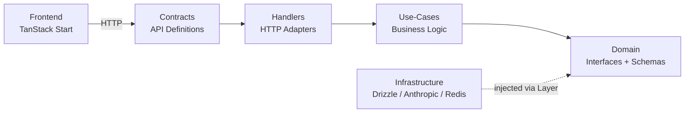

# big-ocean System Architecture

_This document is the authoritative architecture reference for the big-ocean platform. It consolidates all architectural decisions, patterns, and technical specifications into a single source of truth._

## Project Context Analysis

### Requirements Overview

**Functional Requirements (Architectural Scope):**

This consolidated architecture covers the complete big-ocean system across all implemented and planned epics:

#### 1. Conversational Assessment Engine (Epics 1-4, 9-11)
- Anonymous-first 25-message conversation with Nerin (Claude Haiku via Anthropic SDK)
- Real-time personality evidence extraction via ConversAnalyzer (Haiku, per-message)
- Territory-based steering: DRS-scored territories, energy-fit alignment, breadth/coverage optimization
- Cold-start seed territories (first 3 messages) → DRS-scored territory steering
- Session ownership verification, advisory locking, message rate limiting
- Derive-at-read: trait scores, OCEAN codes, archetypes computed from facet scores at read time

#### 2. Conversation Experience Evolution (Design Thinking 2026-03-04 — Not Yet Implemented)
- Behavioral scoring through choices AND avoidance/deflection/silence
- Adaptive technique selection based on user communication style
- Meta-evidence from conversation dynamics (engagement patterns, topic transitions)
- Six feedback loops to break: Depth Spiral, Reframing Echo, Rhetorical Dead End, flat evidence, 1D steering, portrait overload
- Universal approach: Nerin stays personality-neutral but technique-flexible

#### 3. Portrait & Results (Epics 11-12)
- Teaser portrait (Haiku, sync at finalization, free)
- Full portrait (Sonnet 4.6, async after PWYW payment, placeholder-row pattern)
  - Sources from **conversation evidence v2** (authoritative, not finalization evidence)
  - Depth-adaptive prompt (RICH/MODERATE/THIN based on evidence density, `finalWeight >= 0.36` threshold)
  - 16,000 max tokens (includes thinking + response), temperature 0.7
  - Portrait rating endpoint (`POST /portrait/rate`) for quality research
- Archetype lookup: in-memory registry + component-based generation fallback
- ADR-7: archetype metadata derived at read-time, not stored in DB

#### 4. Monetization (Epic 13)
- Polar.sh as merchant-of-record (EU VAT, CNIL-compliant)
- PWYW portrait unlock (minimum €1), relationship credits (€5/single, €15/5-pack)
- Append-only purchase_events event log — capabilities derived from events
- 8 event types covering purchases, grants, consumption, refunds

#### 5. Relationship Analysis (Epic 14)
- Invitation system: credit-based link creation → invitee assessment → accept/refuse
- Cross-user data access with two-step consent chain
- Relationship analysis: Sonnet LLM comparing both users' facet data + evidence
- Separate relationship_invitations + relationship_analyses tables

#### 6. Growth & Protection (Epic 15)
- Archetype card sharing (server-side Satori JSX → SVG → PNG)
- Budget protection: Redis-based global daily assessment gate + waitlist
- Two viral loops: archetype sharing (one-to-many) + relationship invitations (one-to-one)

**Non-Functional Requirements:**

| NFR | Requirement | Implementation |
|-----|-------------|----------------|
| Latency | Nerin response <2s P95 | Haiku model, streaming |
| Cost | ~$0.20 per assessment (free tier) | ~48 Haiku + 1 Sonnet (FinAnalyzer); +1 Sonnet if paid portrait |
| Resilience | ConversAnalyzer non-fatal, Redis fail-open | Retry-once-then-skip, fail-open pattern |
| Concurrency | No duplicate message processing | pg_try_advisory_lock per session |
| Privacy | Default-private profiles, explicit sharing | RLS, URL privacy, consent chains |
| Idempotency | Finalization safe to retry | Three-tier guards (result exists → evidence exists → full run) |
| Async reliability | Portrait/analysis generation recoverable | Placeholder-row + lazy retry via staleness detection |

### Technical Constraints & Dependencies

**Established Stack (Immutable):**
- Effect-ts with Context.Tag DI (hexagonal architecture)
- @effect/platform HttpApiGroup/HttpApiEndpoint contracts
- Drizzle ORM + PostgreSQL, Redis (ioredis)
- TanStack Start SSR + React 19 + TanStack Router/Query
- Better Auth for authentication
- Railway deployment, Docker Compose development

**External Dependencies (Swappable via Hexagonal Adapters):**
- Anthropic SDK (`@anthropic-ai/sdk`) + `@langchain/anthropic` — LLM provider (Claude Haiku, Sonnet)
- Polar.sh (`@polar-sh/checkout`) — payment processing
- Satori + `@resvg/resvg-js` — server-side card generation
- `qrcode.react` — client-side QR codes

**Key Architectural Constraints:**
- No business logic in handlers — all in use-cases
- Errors propagate unchanged (no remapping except fail-open catchTag)
- HTTP errors in contracts, infrastructure errors co-located with repo interfaces
- Derive-at-read for all aggregated scores
- Append-only for purchase events
- `__mocks__` co-location pattern for test repositories

### Cross-Cutting Concerns

1. **Cost tracking & rate limiting** — Redis fixed-window with fail-open, advisory locks, daily budget caps
2. **Error architecture** — Schema.TaggedError in contracts, plain Error in domain repos, propagation without remapping
3. **Async generation pattern** — Placeholder-row + forkDaemon + polling + lazy retry (portraits, relationship analyses)
4. **Derive-at-read** — Trait scores, OCEAN codes, archetypes, capabilities — never store what can be computed
5. **Consent & access control** — Anonymous-first sessions, session ownership verification, two-step consent for cross-user data
6. **LLM prompt architecture** — Six distinct agents with separate prompts, model tiers, error resilience strategies

## Technology Stack

### Established Stack (Brownfield — No Starter Evaluation)

This is a mature codebase. All technology choices are established and in production.

| Layer | Technology | Notes |
|-------|-----------|-------|
| **Runtime** | Node.js >= 20 | TypeScript, bundler mode (no .js extensions) |
| **Package Manager** | pnpm 10.4.1 | Workspace protocol, catalog for version sync |
| **Monorepo** | Turbo + pnpm workspaces | 2 apps + 6 packages |
| **Backend Framework** | Effect-ts + @effect/platform | Hexagonal architecture, Context.Tag DI |
| **Frontend Framework** | TanStack Start (React 19) | SSR, file-based routing, TanStack Query/Form/DB |
| **Styling** | Tailwind CSS v4 + shadcn/ui | Component library in @workspace/ui |
| **Database** | Drizzle ORM + PostgreSQL | Schema in infrastructure package |
| **Cache/Rate Limiting** | Redis (ioredis) | Fail-open pattern |
| **Authentication** | Better Auth | Session-based, httpOnly cookies |
| **LLM Provider** | Anthropic (Claude Haiku/Sonnet) | Via @anthropic-ai/sdk + @langchain/anthropic |
| **Payment** | Polar.sh | Merchant-of-record, @polar-sh/checkout |
| **Testing** | Vitest + @effect/vitest | `__mocks__` co-location, TestClock |
| **Linting** | Biome | Shared config from @workspace/lint |
| **CI/CD** | GitHub Actions | lint → build → test → validate commits |
| **Deployment** | Railway + Docker Compose | Production: Railway; Dev: Docker Compose |

## Core Architectural Decisions

### Decision Priority Analysis

**Already Decided (Established in Codebase):**
All major architectural decisions are implemented and in production. This section documents them as the authoritative reference.

**Deferred Decisions (Post-Current State):**
- Conversation experience evolution (design thinking 2026-03-04) — documented in Evolution Roadmap
- SSE for real-time portrait/analysis status (replace polling)
- Background job queue for generation retry (replace lazy polling)
- Event-driven architecture for cross-domain side effects
- Gift product flows (Phase B)
- Full GDPR compliance — encryption at rest, deletion/portability, audit logging (Epic 6)

### ADR-1: Hexagonal Architecture with Effect-ts

**Decision:** Ports & adapters architecture using Effect-ts Context.Tag for dependency inversion.

**Layers:**



| Layer | Location | Responsibility |
|-------|----------|---------------|
| Contracts | `packages/contracts` | HTTP API definitions (HttpApiGroup/HttpApiEndpoint), shared frontend ↔ backend |
| Handlers | `apps/api/src/handlers` | Thin HTTP adapters — NO business logic |
| Use-Cases | `apps/api/src/use-cases` | Pure business logic — main unit test target |
| Domain | `packages/domain` | Repository interfaces (Context.Tag), schemas, branded types, pure functions |
| Infrastructure | `packages/infrastructure` | Repository implementations (Drizzle, Anthropic, Redis, Pino) |

**Hard Rules:**
- No business logic in handlers — all logic in use-cases
- Dependencies point inward toward domain abstractions
- Infrastructure injected via Effect Layer system

### ADR-2: Error Architecture

**Decision:** Three-location error system with propagation without remapping.

| Error Type | Location | Format |
|-----------|----------|--------|
| HTTP-facing errors | `packages/contracts/src/errors.ts` | `Schema.TaggedError` |
| Infrastructure errors | Co-located with repo interface in `packages/domain/src/repositories/` | Plain `Error` with `_tag` |
| Domain logic errors | Use contract errors directly | `Schema.TaggedError` |

**Propagation Rule:** Use-cases and handlers must NOT remap errors. Only allowed `catchTag` is fail-open resilience (e.g., Redis unavailable → log and continue).

### ADR-3: LLM Agent Architecture

**Decision:** Five distinct LLM agents with purpose-separated tiers. ConversAnalyzer evidence is the single source of truth for all scoring — no finalization re-analysis step.

| Agent | Model | When | Purpose | Error Handling |
|-------|-------|------|---------|---------------|
| Nerin | Haiku 4.5 | Every message | Conversational agent with steering context | Fatal |
| ConversAnalyzer | Haiku 4.5 | Every message (post-cold-start) | Extract evidence records — **single source of truth** for all scoring | Retry once → skip |
| Teaser Portrait | Haiku 4.5 | Once at finalization | Opening section + locked titles | Retry once → fatal |
| Full Portrait | Sonnet 4.6 | Once after PWYW payment | Deep narrative from conversation evidence v2 | Placeholder + lazy retry |
| Relationship Analysis | Sonnet 4.6 | Once on invitation accept | Cross-user comparison | Placeholder + lazy retry |

**Per-assessment LLM budget (free tier):** ~48 Haiku ≈ $0.20. Sonnet only if paid portrait.

### ADR-4: Evidence Model (v2 — Deviation-Based)

**Decision:** Single-tier evidence from ConversAnalyzer feeds everything — steering, results, portraits, relationship analyses.

**Schema (`conversation_evidence`):**

| Field | Type | Notes |
|-------|------|-------|
| `bigfive_facet` | enum (30 facets) | Which facet |
| `deviation` | smallint (-3 to +3) | Distance from population average |
| `strength` | enum (weak/moderate/strong) | Signal diagnosticity |
| `confidence` | enum (low/medium/high) | Certainty level |
| `domain` | enum (6 life domains) | Context |
| `note` | text (max 200) | Behavioral paraphrase |

**Quality gate:** `computeFinalWeight(strength, confidence) >= 0.36` (configurable via `MIN_EVIDENCE_WEIGHT`).
- `finalWeight = STRENGTH_WEIGHT[strength] × CONFIDENCE_WEIGHT[confidence]`
- Threshold 0.36 = moderate (0.6) × medium (0.6)
- No cap on records — LLM extracts everything, filter drops weak signals

**Weight matrices:**

| Strength | Weight | | Confidence | Weight |
|----------|--------|-|-----------|--------|
| weak | 0.3 | | low | 0.3 |
| moderate | 0.6 | | medium | 0.6 |
| strong | 1.0 | | high | 0.9 |

**Deviation → score mapping** (derive-at-read):
```text
score = 10 + deviation × (10/3)
```
Deviation 0 → score 10 (midpoint), +3 → 20 (max), -3 → 0 (min).

**Dual-facet extraction:** ConversAnalyzer prompted to find DIFFERENT facet with NEGATIVE deviation for every record. Polarity balance target: ≥30% negative deviations.

### ADR-5: Territory-Based Steering

**Decision:** Pure domain functions drive conversation steering via territory scoring. Legacy facet-targeting, micro-intents, and domain streak tracking have been removed — territory-based steering is the sole mechanism.

**Key functions** in `packages/domain/src/utils/steering/`:
- `scoreTerritory(territory, config)` / `scoreAllTerritories(territories, config)` — DRS-based territory ranking
- `computeDRS(input)` — Domain Relevance Score combining breadth, coverage, energy fit
- `computeBreadth(facetEvidenceCounts)` — cross-facet evidence distribution
- `computeCoverageValue(facetEvidenceCounts)` — evidence density per facet
- `computeEnergyFit(territory, observedEnergy)` — alignment between territory and user energy
- `buildTerritoryPrompt(territory)` / `buildTerritorySystemPromptSection(content)` — prompt construction for Nerin
- `selectTerritoryWithColdStart(territories, config)` — cold-start aware territory selection

**Algorithm:** Territories scored by DRS formula. No hand-crafted domain-to-facet mapping. Formula computes which territory maximizes assessment coverage based on actual evidence distribution and user energy.

**Cold-start (≤ 3 user messages):** `selectColdStartTerritory()` provides predefined seed territories, then transitions to DRS-scored selection.

### ADR-6: Derive-at-Read

**Decision:** Trait scores, OCEAN codes, archetypes, and capabilities recomputed from atomic sources at read time — never stored as pre-aggregated values.

| Derived Value | Source of Truth | Computed In |
|--------------|----------------|-------------|
| Trait scores (0-120) | 30 facet scores (from evidence deviation) | `get-results.use-case.ts`, `get-public-profile.use-case.ts` |
| OCEAN code (5-letter) | Facet scores → thresholds → semantic letters per trait | `generateOceanCode()` pure function |
| Archetype name/description/color | OCEAN code (4-letter, first 4 traits only) | `lookupArchetype()` in-memory registry |
| Trait summary | OCEAN code (5-letter) | `deriveTraitSummary()` pure function |
| Available credits | purchase_events aggregate | `getCredits()` use-case |
| Portrait status | portraits table row state | Derived in `get-portrait-status.use-case.ts` |

**Rule:** If a value can be computed from evidence or events, compute it in the read path.

### ADR-7: Placeholder-Row Async Pattern

**Decision:** All slow LLM generation uses insert-placeholder → forkDaemon → poll → lazy retry.

**Four-part pattern:**
1. **Insert placeholder** — DB row with `content: null`, `retry_count: 0`
2. **Fork daemon** — `Effect.forkDaemon(generate(...))` — doesn't block HTTP response
3. **Client polls** — TanStack Query `refetchInterval` while `generating`, stops on `ready`/`failed`
4. **Lazy retry** — Status endpoint checks staleness (>5 min + retries remaining) → spawns new daemon

**Used by:** Full portrait generation, relationship analysis generation.

**Idempotency:** `UPDATE ... WHERE content IS NULL` ensures only one daemon's result is written.

### ADR-8: Better Auth + Polar Integration

**Decision:** Polar integrated as a Better Auth plugin, not a standalone webhook handler. Customer creation and payment processing handled within Better Auth's plugin system.

**Plugin stack** in `packages/infrastructure/src/context/better-auth.ts`:
```typescript
betterAuth({
  plugins: [
    haveIBeenPwned(),
    polar({
      client: polarClient,
      createCustomerOnSignUp: true,
      use: [checkout(), webhooks({ onOrderPaid })],
    }),
  ],
})
```

**Customer sync:** `externalId = userId` — Polar customer created automatically on signup with Better Auth user ID as external identifier. Webhook receives `order.customer.externalId` to route purchases.

**Webhook handler (`onOrderPaid`):** Lives inside Better Auth Polar plugin. Uses plain Drizzle (not Effect) for transaction:
- Insert purchase event (`onConflictDoNothing` for idempotency)
- Insert portrait placeholder if portrait-triggering purchase
- Portrait daemon spawning handled separately via Effect use-case

**Database hooks:**
- `user.create.after` — grants free relationship credit + links anonymous sessions + accepts pending invitations
- `session.create.after` — links anonymous sessions on signin + accepts invitations

**Product mapping:** Polar product IDs (from config) → internal event types:
- `polarProductPortraitUnlock` → `portrait_unlocked`
- `polarProductRelationshipSingle` → `credit_purchased` (1 unit)
- `polarProductRelationship5Pack` → `credit_purchased` (5 units)
- `polarProductExtendedConversation` → `extended_conversation_unlocked`

### ADR-9: Append-Only Purchase Events

**Decision:** Immutable `purchase_events` event log. Capabilities derived from events, never stored as mutable state.

**8 event types:** `free_credit_granted`, `portrait_unlocked`, `credit_purchased`, `credit_consumed`, `extended_conversation_unlocked`, `portrait_refunded`, `credit_refunded`, `extended_conversation_refunded`

**Credit formula:** `available = COUNT(free_credit_granted + credit_purchased) × units - COUNT(credit_consumed)`

**Constraints:** INSERT-only, corrections via compensating events (refunds). `polar_checkout_id` UNIQUE for idempotent webhook processing.

### ADR-10: Fail-Open Resilience

**Decision:** Redis-dependent features use fail-open — if Redis unavailable, request proceeds and failure is logged.

**Applies to:** Cost tracking, rate limiting, budget checks. Profile access logging is fire-and-forget.

### ADR-11: Anonymous-First Sessions

**Decision:** Assessment starts without authentication. Auth required only at finalization.

**Flow:** Anonymous start → 25 messages with Nerin → auth gate → POST /generate-results (auth required) → results page.

**Session ownership verification** lives in `/chat` route's `beforeLoad`.

### ADR-12: Archetype Metadata Not Stored

**Decision:** Remove derived archetype fields from `public_profile`. Keep `oceanCode4` for DB queries. Derive archetype name, description, color, and trait summary at read-time via pure functions.

### Decision Impact Analysis

**Cross-Component Dependencies:**
```text
Assessment complete → sync teaser (Haiku) → redirect to results (teaser ready)
Polar checkout closes → Better Auth webhook → purchase event + placeholder → forkDaemon → polling → "ready"
Invitee accepts → placeholder row → forkDaemon → polling → both users see analysis
User signup → Polar customer created (externalId = userId) → free credit granted → anonymous sessions linked
```

## Implementation Patterns & Consistency Rules

### Naming Patterns

**Database (Drizzle schema):**
- Tables: `snake_case` plural (`assessment_sessions`, `purchase_events`)
- Columns: `snake_case` (`assessment_session_id`, `bigfive_facet`)
- Foreign keys: `{referenced_table_singular}_id` (`user_id`, `assessment_session_id`)
- Enums: `snake_case` (`evidence_domain`, `bigfive_facet_name`)
- Indexes: auto-generated by Drizzle

**TypeScript:**
- Properties: `camelCase` (`sessionId`, `bigfiveFacet`)
- Types/Interfaces: `PascalCase` (`FacetName`, `TraitResult`, `EvidenceInput`)
- Constants: `UPPER_SNAKE_CASE` (`BIG_FIVE_TRAITS`, `ALL_FACETS`, `NERIN_PERSONA`)
- Branded types: `PascalCase` (`UserId`, `SessionId`)

**Files:**
- Repository interface: `kebab-case.repository.ts` (`assessment-message.repository.ts`)
- Repository impl: `kebab-case.{provider}.repository.ts` (`assessment-message.drizzle.repository.ts`)
- Use-case: `kebab-case.use-case.ts` (`send-message.use-case.ts`)
- Tests: `kebab-case.use-case.test.ts` (co-located in `__tests__/`)
- Mocks: `__mocks__/{same-filename-as-real}.ts`

**Exports:**
- Live layers: `{Name}{Provider}RepositoryLive` (`AssessmentMessageDrizzleRepositoryLive`)
- Repository tags: `{Name}Repository` (`AssessmentMessageRepository`)

**API endpoints:**
- Effect/Platform HttpApiEndpoint names: `camelCase` (`sendMessage`, `generateResults`)
- URL paths: `kebab-case` (`/api/assessment/generate-results`)

### Structure Patterns

**Repository interface → implementation → mock:**
```text
packages/domain/src/repositories/
  assessment-message.repository.ts          # Context.Tag definition

packages/infrastructure/src/repositories/
  assessment-message.drizzle.repository.ts  # Layer.effect implementation
  __mocks__/
    assessment-message.drizzle.repository.ts  # In-memory mock Layer
```

**Use-case → test:**
```text
apps/api/src/use-cases/
  send-message.use-case.ts
  __tests__/
    send-message.use-case.test.ts
```

**Pure domain functions:**
```text
packages/domain/src/utils/        # formula.ts, scoring.ts, ocean-code-generator.ts
packages/domain/src/constants/    # nerin-persona.ts, facet-definitions.ts
packages/domain/src/types/        # evidence.ts, branded types
packages/domain/src/config/       # app-config.ts interface + defaults
```

### Process Patterns

**Use-case pattern:**
```typescript
export const myUseCase = (input: Input) =>
  Effect.gen(function* () {
    const repo = yield* SomeRepository;    // Access via Context.Tag
    const result = yield* repo.doThing();  // Yield Effect operations
    return result;                          // Return typed result
  });
```

**Error handling — what agents MUST follow:**
1. HTTP errors: define in `contracts/src/errors.ts` as `Schema.TaggedError`
2. Infrastructure errors: co-locate with repo interface in `domain/src/repositories/`
3. Use-cases throw contract errors directly — no intermediate error types
4. Never remap errors in handlers or use-cases (except fail-open `catchTag`)

**Test pattern — what agents MUST follow:**
```typescript
import { vi } from "vitest";                    // FIRST
vi.mock("@workspace/infrastructure/repositories/...");  // vi.mock calls
import { describe, expect, it } from "@effect/vitest";  // AFTER vi.mock
```
- Never import from `__mocks__/` paths directly
- Each test composes minimal local `TestLayer` via `Layer.mergeAll(...)`
- No centralized TestRepositoriesLayer

**Async generation — what agents MUST follow:**
1. Insert placeholder row (content: null) BEFORE forkDaemon
2. Daemon updates with `WHERE content IS NULL` (idempotent)
3. Status endpoint derives state from data, doesn't store status column
4. Lazy retry checks staleness + retry_count in status endpoint

**Better Auth integration — what agents MUST follow:**
- Auth routes: `/api/auth/*` and `/api/polar/*` handled by Better Auth middleware
- Effect routes: everything else handled by @effect/platform
- Database hooks for side effects on user/session creation (free credit, session linking)
- Polar webhook processing in Better Auth plugin, portrait daemon spawning in Effect

### Anti-Patterns to Avoid

- Adding business logic in handlers
- Remapping errors in use-cases or handlers
- Storing derived values (trait scores, archetypes, capabilities)
- Using `as any` without comment explaining why
- Importing from `__mocks__/` paths
- Creating centralized test layers
- Adding `.js` extensions to imports
- Storing archetype metadata in DB (use pure function derivation)
- Using `facet_evidence` or `finalization_evidence` tables (deprecated — use `conversation_evidence`)

### Enforcement

- **Biome:** Shared config from `@workspace/lint` — auto-fix on staged files via pre-commit hook
- **TypeScript:** Strict mode, bundler resolution, `import type` enforced by Biome
- **Pre-push hook:** lint + typecheck + test must pass
- **Commit-msg hook:** Conventional commit format required
- **CI/CD:** GitHub Actions validates lint → build → test → commit format

## Project Structure & Boundaries

### Complete Project Directory Structure

```text
big-ocean/                                    # Monorepo root
├── .env / .env.example / .env.test           # Environment config (dev, test)
├── .githooks/                                # Git hooks (simple-git-hooks)
│   ├── commit-msg                            # Conventional commit validation
│   ├── pre-commit                            # Biome auto-fix on staged files
│   └── pre-push                              # lint + typecheck + test gate
├── .github/workflows/ci.yml                  # GitHub Actions CI pipeline
├── biome.json                                # Root Biome config (extends @workspace/lint)
├── compose.yaml                              # Docker Compose (dev: API + PG + Redis)
├── compose.test.yaml                         # Docker Compose (integration tests)
├── compose.e2e.yaml                          # Docker Compose (e2e tests)
├── drizzle.config.ts                         # Drizzle Kit migration config
├── package.json                              # Root workspace scripts
├── pnpm-lock.yaml / pnpm-workspace.yaml      # pnpm workspace config
├── tsconfig.json                             # Root TypeScript config
├── turbo.json                                # Turborepo pipeline config
├── vitest.config.ts / vitest.setup.ts        # Root Vitest config
├── vitest.workspace.ts                       # Vitest workspace (multi-project)
├── scripts/
│   ├── dev.sh / dev-stop.sh / dev-reset.sh   # Docker dev lifecycle
│   ├── seed-completed-assessment.ts          # Test data seeder
│   └── eval-portrait.ts                      # Portrait quality evaluation
│
├── apps/
│   ├── api/                                  # Effect-ts backend (port 4000)
│   │   ├── Dockerfile / docker-entrypoint.sh # Container build + auto-migrate
│   │   ├── railway.json                      # Railway deployment config
│   │   ├── biome.json                        # Extends @workspace/lint
│   │   ├── vitest.config.ts                  # Unit test config
│   │   ├── vitest.config.integration.ts      # Integration test config
│   │   ├── src/
│   │   │   ├── index.ts                      # Server entry point
│   │   │   ├── migrate.ts                    # Drizzle migration runner
│   │   │   ├── middleware/
│   │   │   │   ├── auth.middleware.ts         # Effect auth middleware
│   │   │   │   └── better-auth.ts            # Better Auth route handler
│   │   │   ├── handlers/                     # HTTP adapters (NO business logic)
│   │   │   │   ├── assessment.ts             # /api/assessment/*
│   │   │   │   ├── evidence.ts               # /api/evidence/*
│   │   │   │   ├── health.ts                 # /health
│   │   │   │   ├── portrait.ts               # /api/portrait/*
│   │   │   │   ├── profile.ts                # /api/profile/*
│   │   │   │   ├── purchase.ts               # /api/purchase/*
│   │   │   │   ├── relationship.ts           # /api/relationship/*
│   │   │   │   ├── waitlist.ts               # /api/waitlist/*
│   │   │   │   └── __tests__/                # Handler-level tests
│   │   │   └── use-cases/                    # Business logic (29 use-cases)
│   │   │       ├── nerin-pipeline.ts         # Orchestrates Nerin + ConversAnalyzer
│   │   │       ├── send-message.use-case.ts  # Per-message pipeline
│   │   │       ├── start-assessment.use-case.ts
│   │   │       ├── generate-results.use-case.ts
│   │   │       ├── generate-full-portrait.use-case.ts
│   │   │       ├── process-purchase.use-case.ts
│   │   │       ├── accept-invitation.use-case.ts
│   │   │       ├── ... (24 more use-cases)
│   │   │       ├── index.ts                  # Barrel export
│   │   │       └── __tests__/                # Unit tests (36 test files)
│   │   │           ├── __fixtures__/          # Shared test data
│   │   │           └── *.use-case.test.ts
│   │   ├── tests/integration/                # Docker-based integration tests
│   │   └── scripts/                          # Integration test setup/teardown
│   │
│   └── front/                                # TanStack Start frontend (port 3000)
│       ├── Dockerfile / docker-entrypoint.sh
│       ├── railway.json
│       ├── biome.json
│       ├── postcss.config.mjs
│       ├── assets/fonts/                     # Inter font for Satori card gen
│       ├── public/                           # Static assets (favicon, logos, manifest)
│       ├── server/routes/api/                # Server-side API routes
│       │   └── og/public-profile/[publicProfileId].get.ts  # OG card generation
│       └── src/
│           ├── router.tsx                    # TanStack Router config
│           ├── routeTree.gen.ts              # Auto-generated route tree
│           ├── routes/                       # File-based routing
│           │   ├── __root.tsx                # Root layout
│           │   ├── index.tsx                 # Landing page (/)
│           │   ├── chat/index.tsx            # Conversation (/chat)
│           │   ├── results.tsx               # Results layout (/results)
│           │   ├── results/$assessmentSessionId.tsx  # Results detail
│           │   ├── profile.tsx               # User profile (/profile)
│           │   ├── public-profile.$publicProfileId.tsx  # Public profiles
│           │   ├── relationship/$analysisId.tsx  # Relationship view
│           │   ├── invite/$token.tsx         # Invitation acceptance
│           │   ├── login.tsx / signup.tsx     # Auth pages
│           │   └── 404.tsx
│           ├── components/                   # Feature-organized components
│           │   ├── auth/                     # Login/signup forms (6 files)
│           │   ├── chat/                     # Chat UI: input bar, depth meter, evidence card
│           │   ├── home/                     # Landing page sections (14 files)
│           │   ├── results/                  # Results page: trait cards, portrait, archetype (28 files)
│           │   ├── profile/                  # User profile components
│           │   ├── relationship/             # Invitation sheet, relationship card
│           │   ├── sharing/                  # Archetype card template, share card
│           │   ├── ocean-shapes/             # Geometric signature system (10 files)
│           │   ├── icons/                    # Custom OCEAN icons
│           │   ├── sea-life/                 # Decorative ocean animations
│           │   ├── waitlist/                 # Waitlist form
│           │   ├── TherapistChat.tsx         # Main chat component
│           │   ├── ChatAuthGate.tsx          # Auth gate for chat
│           │   ├── ResultsAuthGate.tsx       # Auth gate for results
│           │   ├── Header.tsx / MobileNav.tsx / UserNav.tsx
│           │   ├── NerinAvatar.tsx / Logo.tsx
│           │   └── __fixtures__/             # Component test fixtures
│           ├── hooks/                        # Custom React hooks
│           │   ├── use-assessment.ts         # Assessment API hooks
│           │   ├── use-auth.ts               # Auth state hook
│           │   ├── use-evidence.ts           # Evidence query hooks
│           │   ├── use-invitation.ts         # Invitation hooks
│           │   ├── use-profile.ts            # Profile hooks
│           │   ├── useTherapistChat.ts       # Chat orchestration hook
│           │   ├── usePortraitStatus.ts      # Portrait polling hook
│           │   └── __mocks__/                # Hook mocks for tests
│           ├── lib/                          # Client utilities
│           │   ├── auth-client.ts            # Better Auth client
│           │   ├── auth-session-linking.ts   # Anonymous → auth session link
│           │   ├── polar-checkout.ts         # Polar checkout integration
│           │   ├── archetype-card.server.ts  # Server-side Satori card gen
│           │   ├── card-generation.ts        # Card generation utilities
│           │   └── results-auth-gate-storage.ts
│           ├── integrations/tanstack-query/  # TanStack Query provider + devtools
│           ├── constants/                    # Chat placeholders
│           ├── data/                         # Demo data
│           └── db-collections/               # ElectricSQL collections
│
├── packages/
│   ├── domain/                               # Pure abstractions layer
│   │   ├── src/
│   │   │   ├── index.ts                      # Barrel export
│   │   │   ├── config/
│   │   │   │   └── app-config.ts             # AppConfig Context.Tag + defaults
│   │   │   ├── repositories/                 # 23 repository interfaces (Context.Tag)
│   │   │   │   ├── assessment-session.repository.ts
│   │   │   │   ├── assessment-message.repository.ts
│   │   │   │   ├── conversation-evidence.repository.ts
│   │   │   │   ├── conversanalyzer.repository.ts
│   │   │   │   ├── nerin-agent.repository.ts
│   │   │   │   ├── portrait-generator.repository.ts
│   │   │   │   ├── portrait.repository.ts
│   │   │   │   ├── purchase-event.repository.ts
│   │   │   │   ├── relationship-invitation.repository.ts
│   │   │   │   ├── public-profile.repository.ts
│   │   │   │   ├── cost-guard.repository.ts
│   │   │   │   ├── ... (12 more)
│   │   │   │   └── __tests__/
│   │   │   ├── constants/                    # Domain constants
│   │   │   │   ├── big-five.ts               # BIG_FIVE_TRAITS, ALL_FACETS
│   │   │   │   ├── archetypes.ts             # 81 archetype definitions
│   │   │   │   ├── nerin-persona.ts          # Nerin personality definition
│   │   │   │   ├── nerin-greeting.ts / nerin-farewell.ts
│   │   │   │   ├── nerin-chat-context.ts     # Chat context builder
│   │   │   │   ├── facet-descriptions.ts / facet-prompt-definitions.ts
│   │   │   │   ├── trait-descriptions.ts     # Trait-level descriptions
│   │   │   │   ├── life-domain.ts            # 6 life domains
│   │   │   │   ├── finalization.ts           # Finalization constants
│   │   │   │   └── validation.ts             # Validation constants
│   │   │   ├── types/                        # Domain types & branded types
│   │   │   │   ├── evidence.ts               # EvidenceInput, deviation, strength, confidence
│   │   │   │   ├── facet.ts / trait.ts       # FacetName, TraitName branded types
│   │   │   │   ├── session.ts / message.ts   # Session/message types
│   │   │   │   ├── archetype.ts              # Archetype types
│   │   │   │   ├── purchase.types.ts         # Purchase event types
│   │   │   │   ├── relationship.types.ts     # Relationship types
│   │   │   │   ├── portrait-rating.types.ts
│   │   │   │   └── facet-levels.ts / facet-evidence.ts
│   │   │   ├── schemas/                      # Effect Schema definitions
│   │   │   │   ├── big-five-schemas.ts       # Facet/trait schemas
│   │   │   │   ├── ocean-code.ts             # OCEAN code schema
│   │   │   │   ├── agent-schemas.ts          # LLM agent output schemas
│   │   │   │   ├── result-schemas.ts         # Assessment result schemas
│   │   │   │   ├── assessment-message.ts     # Message schemas
│   │   │   │   └── __tests__/
│   │   │   ├── utils/                        # Pure domain functions
│   │   │   │   ├── formula.ts                # computeFinalWeight, computeFacetMetrics, computeSteeringTarget
│   │   │   │   ├── ocean-code-generator.ts   # generateOceanCode()
│   │   │   │   ├── archetype-lookup.ts       # lookupArchetype() in-memory registry
│   │   │   │   ├── derive-trait-summary.ts   # deriveTraitSummary()
│   │   │   │   ├── derive-capabilities.ts    # deriveCapabilities() from events
│   │   │   │   ├── score-computation.ts      # Deviation → score mapping
│   │   │   │   ├── confidence.ts             # Confidence computation
│   │   │   │   ├── nerin-system-prompt.ts    # System prompt builder
│   │   │   │   ├── domain-distribution.ts    # Domain entropy
│   │   │   │   ├── facet-level.ts            # Facet level classification
│   │   │   │   ├── trait-colors.ts           # Trait → color mapping
│   │   │   │   ├── display-name.ts / date.utils.ts
│   │   │   │   ├── steering/                 # Steering sub-module (DRS, cold-start, territory prompt)
│   │   │   │   │   ├── cold-start.ts
│   │   │   │   │   ├── drs.ts
│   │   │   │   │   ├── territory-prompt-builder.ts
│   │   │   │   │   ├── territory-scorer.ts
│   │   │   │   │   └── __tests__/
│   │   │   │   └── __tests__/                # 17 test files
│   │   │   ├── services/                     # Domain services
│   │   │   │   ├── confidence-calculator.service.ts
│   │   │   │   ├── cost-calculator.service.ts
│   │   │   │   └── __tests__/
│   │   │   ├── entities/                     # Entity definitions
│   │   │   │   ├── message.entity.ts
│   │   │   │   └── session.entity.ts
│   │   │   ├── context/
│   │   │   │   └── current-user.ts           # CurrentUser Context.Tag
│   │   │   ├── errors/
│   │   │   │   ├── http.errors.ts            # HTTP error re-exports
│   │   │   │   └── evidence.errors.ts
│   │   │   ├── prompts/
│   │   │   │   └── relationship-analysis.prompt.ts
│   │   │   └── test-utils/                   # Shared test utilities
│   │   └── vitest.config.ts
│   │
│   ├── contracts/                            # HTTP API definitions (shared FE ↔ BE)
│   │   └── src/
│   │       ├── index.ts
│   │       ├── api.ts                        # Legacy API barrel (deprecated)
│   │       ├── errors.ts                     # Schema.TaggedError definitions
│   │       ├── schemas.ts                    # Shared response schemas
│   │       ├── schemas/
│   │       │   ├── evidence.ts               # Evidence response schemas
│   │       │   └── ocean-code.ts             # OCEAN code response schemas
│   │       ├── http/                         # HttpApiGroup/HttpApiEndpoint
│   │       │   ├── api.ts                    # Root API composition
│   │       │   └── groups/                   # One file per handler group
│   │       │       ├── assessment.ts         # Assessment endpoints
│   │       │       ├── evidence.ts           # Evidence endpoints
│   │       │       ├── health.ts
│   │       │       ├── portrait.ts
│   │       │       ├── profile.ts
│   │       │       ├── purchase.ts
│   │       │       ├── relationship.ts
│   │       │       └── waitlist.ts
│   │       ├── middleware/
│   │       │   └── auth.ts                   # Auth middleware contract
│   │       ├── security/
│   │       │   ├── assessment-token.ts       # Assessment token schema
│   │       │   └── invite-token.ts           # Invite token schema
│   │       └── __tests__/
│   │
│   ├── infrastructure/                       # Repository implementations
│   │   ├── src/
│   │   │   ├── index.ts
│   │   │   ├── config/
│   │   │   │   ├── app-config.live.ts        # AppConfig.live from env vars
│   │   │   │   └── __tests__/                # Config validation tests
│   │   │   ├── context/                      # Infrastructure context
│   │   │   │   ├── better-auth.ts            # Better Auth + Polar plugin config
│   │   │   │   ├── database.ts               # Drizzle database connection
│   │   │   │   └── cost-guard.ts             # CostGuard composition
│   │   │   ├── db/drizzle/
│   │   │   │   ├── schema.ts                 # Complete Drizzle schema (all tables)
│   │   │   │   └── __tests__/
│   │   │   ├── repositories/                 # 23 implementations + 5 dev mocks
│   │   │   │   ├── *.drizzle.repository.ts   # PostgreSQL implementations (13)
│   │   │   │   ├── *.anthropic.repository.ts # Anthropic LLM implementations (4)
│   │   │   │   ├── *.claude.repository.ts    # Claude LLM implementations (2)
│   │   │   │   ├── *.redis.repository.ts + *.ioredis.repository.ts  # Redis implementations (2)
│   │   │   │   ├── *.polar.repository.ts     # Polar implementation (1)
│   │   │   │   ├── *.pino.repository.ts      # Logger implementation (1)
│   │   │   │   ├── *.mock.repository.ts      # Dev/test mock implementations (5)
│   │   │   │   ├── portrait-prompt.utils.ts  # Portrait prompt formatting
│   │   │   │   ├── __mocks__/                # 23 in-memory test mocks
│   │   │   │   └── __tests__/
│   │   │   └── utils/test/
│   │   │       └── app-config.testing.ts     # Test config helper
│   │   └── vitest.config.ts
│   │
│   ├── ui/                                   # shadcn/ui component library
│   │   └── src/
│   │       ├── components/                   # UI primitives
│   │       │   ├── button.tsx / card.tsx / input.tsx / badge.tsx
│   │       │   ├── avatar.tsx / dialog.tsx / drawer.tsx / sheet.tsx
│   │       │   ├── dropdown-menu.tsx / switch.tsx / tooltip.tsx
│   │       │   ├── chart.tsx                 # Recharts wrapper
│   │       │   ├── chat/                     # Chat UI components
│   │       │   │   ├── Avatar.tsx / Message.tsx / MessageBubble.tsx
│   │       │   │   ├── ChatConversation.tsx / NerinMessage.tsx
│   │       │   │   └── index.ts
│   │       │   └── *.stories.tsx             # Storybook stories
│   │       ├── hooks/use-theme.ts
│   │       └── lib/utils.ts                  # cn() utility
│   │
│   ├── lint/                                 # Shared Biome config
│   │   ├── biome.json                        # Single source of truth
│   │   └── package.json
│   │
│   └── typescript-config/                    # Shared TSConfig presets
│       ├── base.json / nextjs.json / react-library.json
│       └── package.json
│
└── docs/                                     # Project documentation
    ├── ARCHITECTURE.md                       # (DELETED — replaced by _bmad-output/planning-artifacts/architecture.md)
    ├── FRONTEND.md                           # Frontend patterns & conventions
    ├── COMMANDS.md                           # CLI command reference
    ├── DEPLOYMENT.md                         # Railway deployment guide
    ├── NAMING-CONVENTIONS.md                 # Naming patterns
    ├── COMPLETED-STORIES.md                  # Shipped story tracking
    ├── API-CONTRACT-SPECIFICATION.md         # HTTP API spec
    └── data-models.md                        # Data model documentation
```

### Architectural Boundaries

**API Boundaries:**

| Boundary | Surface | Auth | Handler |
|----------|---------|------|---------|
| Assessment flow | `POST /api/assessment/start`, `POST /api/assessment/send-message`, `POST /api/assessment/generate-results`, `GET /api/assessment/finalization-status` | Token (anon) → Auth (finalize) | `assessment.ts` |
| Evidence | `GET /api/evidence/facet/:facet`, `GET /api/evidence/message/:messageId` | Auth required | `evidence.ts` |
| Portrait | `GET /api/portrait/status`, `POST /api/portrait/rate` | Auth required | `portrait.ts` |
| Profile | `GET /api/profile/results`, `POST /api/profile/toggle-visibility`, `GET /api/profile/public/:id` | Auth / Public | `profile.ts` |
| Purchase | `POST /api/purchase/process` | Auth required | `purchase.ts` |
| Relationship | `POST /api/relationship/invite`, `POST /api/relationship/accept`, `GET /api/relationship/analysis/:id` | Auth required | `relationship.ts` |
| Waitlist | `POST /api/waitlist/join` | None | `waitlist.ts` |
| Auth | `/api/auth/*`, `/api/polar/*` | Better Auth middleware | `better-auth.ts` |
| Health | `GET /health` | None | `health.ts` |

**Middleware routing split:**
- Better Auth handles: `/api/auth/*` and `/api/polar/*` (auth + Polar webhook)
- Effect/Platform handles: everything else via HttpApiGroup composition

**Component Boundaries:**

| Frontend Domain | Route | Key Components | API Dependencies |
|----------------|-------|----------------|-----------------|
| Landing | `/` | HeroSection, ConversationFlow, home/* | None |
| Chat | `/chat` | TherapistChat, ChatAuthGate, ChatInputBarShell, DepthMeter, EvidenceCard | assessment.*, evidence.* |
| Results | `/results/$id` | ProfileView, TraitCard, ArchetypeCard, PersonalPortrait, ConfidenceRingCard, DetailZone | profile.results, portrait.*, evidence.* |
| Profile | `/profile` | AssessmentCard, EmptyProfile | profile.*, relationship.* |
| Public Profile | `/public-profile.$id` | ProfileView (read-only) | profile.public |
| Relationship | `/relationship/$id` | RelationshipCard | relationship.analysis |
| Invite | `/invite/$token` | InvitationBottomSheet | relationship.invite |
| Auth | `/login`, `/signup` | login-form, signup-form | auth/* |
| Sharing | (server route) | archetype-card-template (Satori JSX) | OG card generation |

**Data Boundaries:**

| Table Group | Tables | Write Path | Read Path |
|------------|--------|-----------|-----------|
| Assessment | `assessment_sessions`, `assessment_messages` (territory_id, observed_energy_level), `assessment_results` | Use-cases via Drizzle repos | Use-cases + derive-at-read |
| Evidence | `conversation_evidence` | ConversAnalyzer → nerin-pipeline → repo | Evidence queries + portrait generation |
| Portraits | `portraits`, `portrait_ratings` | Placeholder → forkDaemon | Status polling + lazy retry |
| Profiles | `public_profiles`, `profile_access_log` | Toggle visibility use-case | Public profile view + fire-and-forget logging |
| Payments | `purchase_events` | Better Auth webhook → Drizzle | Capability derivation (append-only) |
| Relationships | `relationship_invitations`, `relationship_analyses` | Invitation/accept use-cases | Invitation list + analysis view |
| Auth | `user`, `session`, `account`, `verification` (Better Auth managed) | Better Auth | Better Auth + database hooks |
| Budget | Redis keys (daily counters) | Cost guard repo | Fail-open check |

### Requirements to Structure Mapping

**Epic → Directory Mapping:**

| Epic | Backend Use-Cases | Frontend Routes/Components | Packages |
|------|------------------|---------------------------|----------|
| **1-4: Assessment Engine** | `start-assessment`, `send-message`, `nerin-pipeline`, `resume-session`, `calculate-confidence` | `/chat` → TherapistChat, ChatAuthGate, useTherapistChat | domain/utils/formula.ts, domain/utils/steering/*, domain/constants/nerin-*.ts |
| **9-11: Results & Finalization** | `generate-results`, `get-results`, `get-finalization-status`, `get-facet-evidence`, `get-message-evidence`, `get-transcript` | `/results/$id` → ProfileView, TraitCard, ArchetypeCard, EvidencePanel, DetailZone | domain/utils/ocean-code-generator.ts, scoring, archetype-lookup |
| **11-12: Portraits** | `generate-full-portrait`, `get-portrait-status`, `rate-portrait` | PersonalPortrait, PortraitReadingView, TeaserPortrait, PortraitWaitScreen | infrastructure/portrait-generator.claude.repository.ts |
| **13: Monetization** | `process-purchase`, `get-credits` | polar-checkout.ts, RelationshipCreditsSection | infrastructure/payment-gateway.polar.repository.ts, better-auth.ts (Polar plugin) |
| **14: Relationships** | `create-invitation`, `accept-invitation`, `refuse-invitation`, `list-invitations`, `get-relationship-analysis`, `generate-relationship-analysis` | `/invite/$token`, `/relationship/$id`, InvitationBottomSheet, RelationshipCard | domain/prompts/relationship-analysis.prompt.ts |
| **15: Growth** | `create-shareable-profile`, `toggle-profile-visibility`, `join-waitlist` | `/public-profile.$id`, sharing/*, waitlist/* | front/lib/archetype-card.server.ts (Satori) |

**Cross-Cutting → Location Mapping:**

| Concern | Backend Location | Frontend Location | Package Location |
|---------|-----------------|-------------------|-----------------|
| Auth | `middleware/auth.middleware.ts`, `middleware/better-auth.ts` | `lib/auth-client.ts`, `hooks/use-auth.ts`, ChatAuthGate, ResultsAuthGate | `infrastructure/context/better-auth.ts` |
| Cost control | `use-cases/` (advisory lock, rate limit check) | N/A | `infrastructure/cost-guard.redis.repository.ts`, `domain/services/cost-calculator.service.ts` |
| Error handling | Handler → use-case error propagation | ErrorBanner component | `contracts/src/errors.ts`, `domain/src/errors/` |
| Derive-at-read | `get-results`, `get-public-profile`, `get-credits`, `get-portrait-status` | Components render derived data | `domain/utils/` (formula, scoring, archetype-lookup, derive-*) |
| Testing | `__tests__/` co-located with use-cases | `*.test.tsx` co-located with components | `__mocks__/` co-located with implementations |

### Integration Points

**Internal Communication:**
```text
Frontend (TanStack Query) → HTTP → Better Auth middleware → Effect middleware → Handler → Use-Case → Repository (via Context.Tag)
```

**External Integrations:**

| Service | Integration Point | Protocol |
|---------|------------------|----------|
| Anthropic Claude | `infrastructure/repositories/*.anthropic.repository.ts` + `*.claude.repository.ts` (6 files) | REST via @anthropic-ai/sdk |
| PostgreSQL | `infrastructure/context/database.ts` → Drizzle ORM | TCP (pg driver) |
| Redis | `infrastructure/repositories/redis.ioredis.repository.ts` | TCP (ioredis) |
| Polar.sh | `infrastructure/context/better-auth.ts` (plugin) + `infrastructure/repositories/payment-gateway.polar.repository.ts` | REST (webhook + checkout) |
| Better Auth | `infrastructure/context/better-auth.ts` | Internal (middleware) |

**Key Data Flows:**

1. **Assessment message flow:**
   ```text
   User input → send-message use-case → advisory lock → score territories (DRS) → Nerin agent (Haiku, with territory prompt) → save message →
   ConversAnalyzer (Haiku, parallel) → weight filter (≥0.36) → save evidence → return response
   ```

2. **Results generation flow:**
   ```text
   POST /generate-results → idempotency check → compute facet scores (derive-at-read) →
   compute trait scores → generate OCEAN code → lookup archetype → teaser portrait (Haiku, sync) →
   save assessment_results → redirect to results page
   ```

3. **Portrait purchase flow:**
   ```text
   Polar checkout → webhook → Better Auth onOrderPaid → insert purchase_event + portrait placeholder →
   Effect forkDaemon → Sonnet 4.6 generation → UPDATE WHERE content IS NULL →
   Client polls GET /portrait/status → lazy retry if stale
   ```

4. **Relationship flow:**
   ```text
   Create invitation (deduct credit) → share link → invitee assesses → accept invitation →
   placeholder + forkDaemon → Sonnet comparison → both users see analysis
   ```

### File Organization Patterns

**Configuration:** Root config files extend shared packages (`@workspace/lint` for Biome, `@workspace/typescript-config` for TS). Each app has its own `biome.json` extending root. Environment variables: `.env` (dev), `.env.test` (test), `.env.example` (template).

**Source Organization:** Feature-organized within each app. Backend organized by architectural layer (handlers → use-cases). Frontend organized by route/feature (components/auth, components/chat, components/results). Packages organized by responsibility (domain = abstractions, infrastructure = implementations, contracts = shared API surface).

**Test Organization:** Co-located `__tests__/` directories within use-cases and components. `__mocks__/` co-located with repository implementations. `__fixtures__/` for shared test data. Integration tests in separate `tests/integration/` directory. Vitest workspace for multi-project test orchestration.

### Development Workflow Integration

**Development:** `pnpm dev` starts Turbo watch mode → Docker Compose (PG + Redis) + API (port 4000) + Frontend (port 3000). Auto-seeds test assessment data on startup.

**Build:** `pnpm build` → Turbo builds all packages respecting dependency graph (domain → infrastructure → contracts → apps).

**Deployment:** Railway auto-deploys from `master` branch. `docker-entrypoint.sh` runs migrations before server start. Frontend and API deployed as separate Railway services.

## Architecture Validation Results

### Coherence Validation

**Decision Compatibility:** All decisions are coherent. The hexagonal architecture (ADR-1) with Effect-ts Context.Tag cleanly separates the five LLM agents (ADR-3) from business logic. The single-tier evidence model (ADR-4) feeds into derive-at-read (ADR-6) without conflict. Better Auth + Polar plugin (ADR-8) and append-only events (ADR-9) work together — webhook writes events, capabilities derived at read time. No contradictory decisions found.

**Pattern Consistency:** Naming conventions are uniform: `kebab-case` files, `PascalCase` exports, `camelCase` properties, `UPPER_SNAKE_CASE` constants. The repository interface → implementation → mock triplet follows the same pattern across all 23 repositories. Test patterns (vi.mock + local TestLayer) are consistent. Error architecture (three locations, no remapping) is applied uniformly.

**Structure Alignment:** Project structure maps directly to architectural layers — `packages/domain` = ports, `packages/infrastructure` = adapters, `apps/api/src/use-cases` = business logic, `apps/api/src/handlers` = HTTP adapters. The `__mocks__/` co-location supports the testing strategy. Contract groups mirror handler groups 1:1.

### Requirements Coverage Validation

**Epic Coverage:**

| Epic | Covered? | Notes |
|------|----------|-------|
| 1-4: Assessment Engine | Yes | send-message, nerin-pipeline, territory steering (DRS), cold-start |
| 9-11: Results & Finalization | Yes | generate-results, derive-at-read, teaser portrait |
| 11-12: Portraits | Yes | Placeholder-row pattern, Sonnet 4.6, depth-adaptive prompt |
| 13: Monetization | Yes | Polar plugin, append-only events, capability derivation |
| 14: Relationships | Yes | Invitation system, cross-user analysis, two-step consent |
| 15: Growth | Yes | Satori card gen, Redis budget gate, waitlist |
| Design Thinking 2026-03-04 | Noted | Documented in Context Analysis as "Not Yet Implemented" |

**Non-Functional Requirements:**

| NFR | Architecturally Supported? | Implementation |
|-----|---------------------------|----------------|
| Latency <2s | Yes | Haiku model + streaming |
| Cost ~$0.20 | Yes | Weight filter eliminates weak evidence, Haiku-only free tier |
| Resilience | Yes | Fail-open (ADR-10), retry-once-then-skip |
| Concurrency | Yes | Advisory locks per session |
| Privacy | Yes | Default-private, RLS, consent chains |
| Idempotency | Yes | Three-tier guards, `WHERE content IS NULL` |
| Async reliability | Yes | Placeholder-row + lazy retry (ADR-7) |

### Implementation Readiness Validation

**Decision Completeness:** All 12 ADRs document the decision, rationale, and implementation location. Weight matrices, threshold values, and algorithm details are specified with concrete numbers. Code examples provided for use-case pattern, test pattern, async generation pattern, and Better Auth integration.

**Structure Completeness:** Full directory tree with every handler, use-case, repository interface, implementation, and mock file listed. All routes, component directories, hooks, and lib files accounted for. Integration points between frontend/backend clearly mapped.

**Pattern Completeness:** Error handling, testing, async generation, and auth integration patterns each have explicit "what agents MUST follow" rules. Anti-patterns list prevents common mistakes. Enforcement section documents automated checks (Biome, hooks, CI).

### Gap Analysis Results

**No Critical Gaps** — all epics have architectural support and implementation paths are clear.

**Important Gaps (non-blocking):**
1. **Evolution Roadmap section** — Design thinking 2026-03-04 proposals are noted in Context Analysis but don't have a dedicated Evolution Roadmap section yet. This was agreed as Option A approach — to be added as a short section.
2. **ElectricSQL sync architecture** — Frontend uses TanStack DB / ElectricSQL for local-first sync, but the sync protocol and shape subscriptions aren't detailed in this document. Currently minimal usage (`db-collections/index.ts`).

**Nice-to-Have:**
1. Database schema diagram (table relationships, FK constraints) — currently only in `data-models.md`
2. Sequence diagrams for the four key data flows
3. Environment variable reference table

### Architecture Completeness Checklist

**Requirements Analysis**
- [x] Project context thoroughly analyzed
- [x] Scale and complexity assessed (~$0.20/session, 5 LLM agents)
- [x] Technical constraints identified (established stack, hexagonal architecture)
- [x] Cross-cutting concerns mapped (cost, auth, errors, derive-at-read, consent)

**Architectural Decisions**
- [x] 12 ADRs documented with implementation details
- [x] Technology stack fully specified (brownfield, all choices established)
- [x] Integration patterns defined (Better Auth plugin, Polar webhook, LLM agents)
- [x] Performance considerations addressed (Haiku tier, advisory locks, fail-open)

**Implementation Patterns**
- [x] Naming conventions established (DB, TS, files, exports, API)
- [x] Structure patterns defined (repo triplet, use-case + test, pure domain functions)
- [x] Communication patterns specified (HTTP → Handler → Use-Case → Repo)
- [x] Process patterns documented (error handling, testing, async gen, auth)

**Project Structure**
- [x] Complete directory structure defined (2 apps, 6 packages, full file listing)
- [x] Component boundaries established (API, frontend, data)
- [x] Integration points mapped (5 external services, 4 data flows)
- [x] Requirements to structure mapping complete (6 epics + 5 cross-cutting)

### Architecture Readiness Assessment

**Overall Status:** READY FOR IMPLEMENTATION

**Confidence Level:** High — this is a brownfield document capturing an already-running system.

**Key Strengths:**
- Single source of truth for all architectural decisions (replaces 6+ fragmented docs)
- Every file and directory in the codebase has an explicit role
- Concrete implementation patterns with "MUST follow" rules for AI agents
- Complete epic-to-directory mapping eliminates ambiguity

**Areas for Future Enhancement:**
- Evolution Roadmap section for design thinking proposals
- ElectricSQL sync architecture details as usage grows
- Visual diagrams (sequence, ER) as supplementary reference

### Implementation Handoff

**AI Agent Guidelines:**
- Follow all architectural decisions exactly as documented
- Use implementation patterns consistently across all components
- Respect project structure and boundaries
- Refer to this document for all architectural questions
- When in doubt about where code belongs, check the Epic → Directory Mapping table

**This document replaces:** `docs/ARCHITECTURE.md` and all `_bmad-output/planning-artifacts/architecture-*.md` files as the single authoritative architecture reference.
