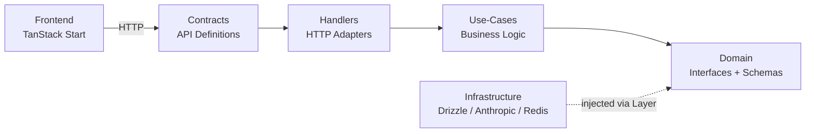
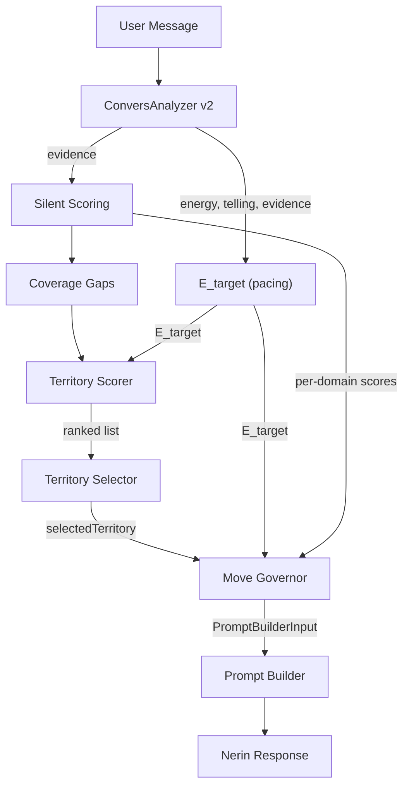

# big-ocean System Architecture

_This document is the single authoritative architecture reference for the big-ocean platform. All architectural decisions, patterns, and technical specifications are consolidated here. Last consolidated: 2026-04-30. No satellite architecture documents exist — everything is in this file._

## Document Map

This is a self-contained architecture document. All content from previously separate architecture files has been consolidated here:

- **Current live conversation runtime:** ADR-31 through ADR-38 (Director Model — formerly in `architecture-director-model.md`)
  - Evidence-only ConversAnalyzer → Facet-first coverage analyzer → Nerin Director → Nerin Actor
  - `coverage_targets` / `director_output` exchange persistence
- **Platform architecture:** ADR-1 through ADR-16, ADR-22 through ADR-30
- **MVP product world (added 2026-04-11 from PRD 2026-04-11 delta):** ADR-43 through ADR-50
  - ADR-43: Three-Space Navigation (supersedes ADR-23)
  - ADR-44: Silent Daily Journal + Mood Calendar
  - ADR-45: Weekly Letter Pipeline
  - ADR-46: Post-Assessment Focused Reading Transition
  - ADR-47: MVP Subscription Billing (promotes ADR-42)
  - ADR-48: Nerin Output Grammar (three visual registers)
  - ADR-49: Knowledge Library SSR Architecture
  - ADR-50: Cost Ceiling Architecture
- **Portrait pipeline rework (added 2026-04-12 from problem-solution-2026-04-11.md):** ADR-51 through ADR-54
  - ADR-51: Three-Stage Portrait Pipeline (Spine Extractor → Verifier → Prose Renderer)
  - ADR-52: UserSummary at Assessment Completion (quote-bank compression, cross-cutting asset)
  - ADR-53: Direct Anthropic SDK for Portrait (LangChain carve-out)
  - ADR-54: Portrait Observability + Quality Rubric Skill
- **Legacy seam removal (2026-04-30):** ADR-57 — deletes pre-Director `AnalyzerRepository` and leftover `NerinAgentRepository` (+ offline `eval-portrait.ts`); live chat LLM ports are ConversAnalyzer, Nerin Director, Nerin Actor only; portrait quality measurement stays ADR-54 (rubric), not a standalone script.
- **UserSummary lifecycle & subscriber chat (added 2026-04-12):** ADR-55 through ADR-56
  - ADR-55: UserSummary as Living Cross-Cutting Asset (rolling regeneration, recency decay, versioning, monthly check-in aggregation)
  - ADR-56: Subscriber Nerin Chat Sessions (15-turn Director/Actor sessions with UserSummary injection, triggers portrait + summary refresh)
- **Latest PRD sync (2026-04-18):** ADR-49 refined for the `/library` Personality Atlas landing page (FR83a) and NFR validation wording updated to match the PRD's measurable reliability/accessibility/integration requirements.
- **Post-MVP design decisions (design now, build later):** ADR-39 through ADR-41 — conversations table rename, agent type architecture, personality context pattern. ADR-42 promoted to ADR-47 MVP.
- **Superseded by 2026-04-11 delta:** ADR-23 (Dashboard/Profile Consolidation) — replaced by ADR-43 (Three-Space Navigation)
- **Historical pacing pipeline:** ADR-5, 17-19, 21 (marked `[SUPERSEDED]`) + Historical Appendix A
- **Historical conversation evolution:** Historical Appendix B

Reading rule: Trust the non-superseded ADRs in this document. Superseded ADRs and historical appendices exist only for design lineage context.

## Project Context Analysis

### Requirements Overview

**Functional Requirements (Architectural Scope):**

This consolidated architecture covers the complete big-ocean system across all implemented and planned epics:

#### 1. Conversational Assessment Engine (Epics 1-4, 9-11, 23, 27-29)
- Auth-gated 15-exchange conversation with Nerin (Claude Haiku via LangChain) — subscribers can extend with +15 exchanges (FR10, FR25)
- Evidence-only ConversAnalyzer (Haiku, per-message, three-tier fail-open) runs BEFORE Nerin Director
- Four-step conversation runtime: evidence extraction → coverage analysis → Nerin Director brief → Nerin Actor response
- Coverage analyzer is facet-first, not domain-first: it returns one `primaryFacet`, three `candidateDomains`, and a phase (`opening` | `exploring` | `closing`)
- Coverage ranking uses a single history-wide steering metric: `steeringSignal = log1p(totalMass) × effectiveDomains` over steerable domains
- Director chooses the most natural bridge into one candidate domain while still surfacing the primary facet; Actor sees only the brief and voices it as Nerin
- Coverage targets are persisted in `assessment_exchange.coverage_targets`; Director briefs are persisted in `assessment_exchange.director_output`
- Session ownership verification, advisory locking, message rate limiting
- Derive-at-read: trait scores, OCEAN codes, archetypes computed from facet scores at read time; persisted scored results now store only `score` + `confidence`
- `assessment_exchange` table: per-turn extraction tier, coverage targets, and Director output

#### 2. Conversation Experience Evolution (Design Thinking 2026-03-04 — Architecture Defined, Implementation In Progress)
- Territory-based steering replacing facet targeting (architecture-conversation-experience-evolution.md, superseded first by the pacing pipeline and now by the Director model)
- Two-axis user state model: energy (conversational intensity/load) × telling (self-propulsion vs compliance)
- Observation gating: evidence-derived phase curve + shared linear escalation controls when Nerin offers observations
- Character bible decomposed into modular constants: NERIN_PERSONA, CONVERSATION_MODE, BELIEFS_IN_ACTION, CONVERSATION_INSTINCTS (trimmed), QUALITY_INSTINCT, MIRROR_GUARDRAILS, HUMOR_GUARDRAILS, INTERNAL_TRACKING, REFLECT, STORY_PULLING
- 2-layer prompt system (2026-03-13): Common (identity) + Steering (per-turn). Collapsed from original 4-tier system.
- 5 modules dissolved: THREADING → common+bridge, MIRRORS_EXPLORE/AMPLIFY → intent×observation lookup, OBSERVATION_QUALITY → common+observation templates, EXPLORE_RESPONSE_FORMAT → skeleton system
- Six feedback loops to break: Depth Spiral, Reframing Echo, Rhetorical Dead End, flat evidence, 1D steering, portrait overload
- **Deferred:** Shadow scoring (topic avoidance detection), adaptive technique selection, meta-evidence from conversation dynamics

#### 3. Portrait & Results (Epics 11-12)
- Full portrait (Sonnet 4.6, **free for every user**, generated on assessment completion, queue-based fire-once generation — see ADR-46 for the post-assessment focused reading transition)
  - Sources from **conversation evidence v2** (authoritative, not finalization evidence)
  - Depth-adaptive prompt (RICH/MODERATE/THIN based on evidence density, `finalWeight >= 0.36` threshold)
  - 16,000 max tokens (includes thinking + response), temperature 0.7
  - Portrait rating endpoint (`POST /portrait/rate`) for quality research
- Archetype lookup: in-memory registry + component-based generation fallback
- ADR-7: archetype metadata derived at read-time, not stored in DB
- First subscriber extension automatically regenerates the portrait (bundled, ADR-11 + ADR-47). Prior portrait preserved as "previous version" via derive-at-read version detection

#### 4. Monetization (Epic 13)
- Polar.sh as merchant-of-record (EU VAT, CNIL-compliant)
- MVP subscription: €9.99/mo recurring via Polar checkout (ADR-47). Subscription unlocks conversation extension (+15 exchanges) + bundled first-extension portrait regeneration. No PWYW portrait, no relationship credits
- Append-only purchase_events event log — capabilities derived from events
- Subscription event types (`subscription_started`, `subscription_renewed`, `subscription_cancelled`, `subscription_expired`) now live in MVP (promoted from ADR-42)
- Legacy PWYW/credit event types (`portrait_unlocked`, `credit_purchased`, `credit_consumed`, `free_credit_granted`) retained in the enum for historical events only — not written by new purchase flows

#### 5. Relationship Letters (Epic 14)
- **User-facing term:** "relationship letter" (letter-format Nerin output, ADR-48). Internal data model retains `relationship_analyses` table name for code compatibility
- QR token model: QR code generation → scan → accept/refuse
- QR token lifecycle: generate on drawer open, 6h TTL, auto-regenerate hourly, poll every 60s, invalidate on accept
- **Free and unlimited** — no credit consumption on accept (FR33). Every completed relationship letter is a zero-cost user acquisition
- Cross-user data access with two-step consent chain; accept = ongoing consent for annual regeneration post-MVP (FR30, FR35a)
- Relationship letter: Sonnet LLM comparing both users' facet data + evidence, letter-format prompt
- `relationship_qr_tokens` + `relationship_analyses` tables (FKs to `assessment_results` for both users)
- Letter History: all letters preserved as a multi-year relationship biography; MVP ships a single letter per relationship; annual regeneration post-MVP (FR35a)
- List endpoint: `GET /api/relationship/analyses` returns all letters with version status

#### 6. Growth & Protection (Epic 15)
- Archetype card sharing (server-side Satori JSX → SVG → PNG)
- Budget protection: Redis-based global daily assessment gate + waitlist
- Two viral loops: archetype sharing (one-to-many) + relationship QR invitations (one-to-one)

**Non-Functional Requirements:**

| NFR | Requirement | Implementation |
|-----|-------------|----------------|
| Latency | Nerin response <2s P95 | Streaming remains fast, but the live path is now evidence → Director → Actor; sub-2s is a target, not a guarantee |
| Cost (per assessment) | ~€0.30 / assessment | Evidence + Director + Actor per turn; Sonnet remains optional for Director and required for portrait / relationship letter generation |
| Cost (per portrait) | ~€0.20–0.40 | Sonnet 4.6, 16k max tokens |
| Cost (free-tier ongoing, NFR7a) | ~$0.02–0.08 / user / month | Silent daily check-ins (ADR-44, zero LLM calls) + free weekly letter (ADR-45, ~$0.02–0.05 / user / week) |
| Cost (subscriber ongoing, NFR7a) | ~$0.35–0.75 / subscriber / month | Conversation extension + bundled first-extension portrait regeneration. Yields 93–97% gross margin on €9.99/mo subscription |
| Cost ceiling (NFR7b) | Circuit breaker: >3× weekly-letter cost / 24h | See ADR-50 |
| Resilience | ConversAnalyzer non-fatal, Redis fail-open | Retry-once-then-skip, fail-open pattern |
| Concurrency | No duplicate message processing | pg_try_advisory_lock per session |
| Privacy | Default-private profiles, explicit sharing | RLS, URL privacy, consent chains |
| Idempotency | Finalization safe to retry | Three-tier guards (result exists → evidence exists → full run) |
| Async reliability | Portrait/letter generation recoverable | Placeholder-row + lazy retry via staleness detection |

### Technical Constraints & Dependencies

**Established Stack (Immutable):**
- Effect-ts with Context.Tag DI (hexagonal architecture)
- @effect/platform HttpApiGroup/HttpApiEndpoint contracts
- Drizzle ORM + PostgreSQL, Redis (ioredis)
- TanStack Start SSR + React 19 + TanStack Router/Query
- Better Auth for authentication
- Railway deployment, Docker Compose development

**External Dependencies (Swappable via Hexagonal Adapters):**
- Anthropic SDK (`@anthropic-ai/sdk`) + `@langchain/anthropic` — LLM provider (Claude Haiku, Sonnet)
- Polar.sh (`@polar-sh/checkout`) — payment processing
- Resend — transactional email (React Email for templates)
- Satori + `@resvg/resvg-js` — server-side card generation
- `qrcode.react` — client-side QR codes

**Key Architectural Constraints:**
- No business logic in handlers — all in use-cases
- Errors propagate unchanged (no remapping except fail-open catchTag)
- HTTP errors in contracts, infrastructure errors co-located with repo interfaces
- Derive-at-read for all aggregated scores
- Append-only for purchase events
- `__mocks__` co-location pattern for test repositories

### Cross-Cutting Concerns

1. **Cost tracking & rate limiting** — Redis fixed-window with fail-open, advisory locks, daily budget caps, global free-tier circuit breaker (ADR-50)
2. **Error architecture** — Schema.TaggedError in contracts, plain Error in domain repos, propagation without remapping
3. **Async generation pattern** — Queue-based fire-once generation for portraits (Effect Queue + worker fiber, triggered on assessment completion); placeholder-row + forkDaemon + lazy retry for relationship letters; per-user cron-triggered generation for weekly letters (ADR-45)
4. **Derive-at-read** — Trait scores, OCEAN codes, archetypes, capabilities, subscription entitlements — never store what can be computed
5. **Consent & access control** — Auth-gated conversation (email collected before first turn), session ownership verification, two-step consent for cross-user data (QR token model), ongoing consent for relationship letter regeneration (FR30)
6. **Transactional email** — Resend for drop-off re-engagement, Nerin check-in, subscription conversion nudge (3 email types, one-shot each) + weekly-letter push-notification email fallback (ADR-12)
7. **LLM prompt architecture** — Five distinct agents with separate prompts, model tiers, and resilience strategies. Nerin is split into a Director (strategy) and Actor (voice). ConversAnalyzer is evidence-only and three-tier fail-open. Nerin Output Grammar governs format-specific prompt composition for chat/letter/journal registers (ADR-48).
8. **Three-space navigation** — Today/Me/Circle as the authenticated hub-and-spoke model; `/chat` is an onboarding tunnel outside the three-space world (ADR-43). Replaces `/dashboard` (ADR-23 superseded).
9. **Intimacy Principle** — Architectural guardrail for Circle: no count metrics, no sort/search/directory, no follower/fan semantics, no profile-view counters. See Anti-Patterns section.
10. **LLM provider configurability** — Provider/model selection for conversation, portrait, relationship letter, and weekly letter pipelines is configuration-driven. Staging verification requires a config-only provider/model swap with no code changes in those pipelines (NFR26).

## Technology Stack

### Established Stack (Brownfield — No Starter Evaluation)

This is a mature codebase. All technology choices are established and in production.

| Layer | Technology | Notes |
|-------|-----------|-------|
| **Runtime** | Node.js >= 20 | TypeScript, bundler mode (no .js extensions) |
| **Package Manager** | pnpm 10.4.1 | Workspace protocol, catalog for version sync |
| **Monorepo** | Turbo + pnpm workspaces | 2 apps + 6 packages |
| **Backend Framework** | Effect-ts + @effect/platform | Hexagonal architecture, Context.Tag DI |
| **Frontend Framework** | TanStack Start (React 19) | SSR, file-based routing, TanStack Query/Form/DB |
| **Styling** | Tailwind CSS v4 + shadcn/ui | Component library in @workspace/ui |
| **Database** | Drizzle ORM + PostgreSQL | Schema in infrastructure package |
| **Cache/Rate Limiting** | Redis (ioredis) | Fail-open pattern |
| **Authentication** | Better Auth | Session-based, httpOnly cookies |
| **LLM Provider** | Anthropic (Claude Haiku/Sonnet) | Via @anthropic-ai/sdk + @langchain/anthropic |
| **Payment** | Polar.sh | Merchant-of-record, @polar-sh/checkout |
| **Email** | Resend | Transactional email, React Email templates |
| **Testing** | Vitest + @effect/vitest | `__mocks__` co-location, TestClock |
| **Linting** | Biome | Shared config from @workspace/lint |
| **CI/CD** | GitHub Actions | lint → build → test → validate commits |
| **Deployment** | Railway + Docker Compose | Production: Railway; Dev: Docker Compose |

## Core Architectural Decisions

### Decision Priority Analysis

**Already Decided (Established in Codebase):**
All major architectural decisions are implemented and in production. This section documents them as the authoritative reference.

**Deferred Decisions (Post-Current State):**
- Shadow scoring — topic avoidance detection and classification (if revived, integrate into the Director model rather than the retired pacing stack)
- Director calibration — prompt balance, model assignment, and recency penalties need empirical tuning from live conversations
- Continuation experience UX details — conversation 2 model defined (new session + parent_session_id + prior state init), UX polish TBD
- SSE for real-time portrait/analysis status (replace polling)
- Queue-based generation for relationship analyses (portraits already migrated to Effect Queue pattern)
- Event-driven architecture for cross-domain side effects
- Gift product flows (Phase B)
- Full GDPR compliance — encryption at rest, deletion/portability, audit logging (Epic 6)

### ADR-1: Hexagonal Architecture with Effect-ts

**Decision:** Ports & adapters architecture using Effect-ts Context.Tag for dependency inversion.

**Layers:**



| Layer | Location | Responsibility |
|-------|----------|---------------|
| Contracts | `packages/contracts` | HTTP API definitions (HttpApiGroup/HttpApiEndpoint), shared frontend ↔ backend |
| Handlers | `apps/api/src/handlers` | Thin HTTP adapters — NO business logic |
| Use-Cases | `apps/api/src/use-cases` | Pure business logic — main unit test target |
| Domain | `packages/domain` | Repository interfaces (Context.Tag), schemas, branded types, pure functions |
| Infrastructure | `packages/infrastructure` | Repository implementations (Drizzle, Anthropic, Redis, Pino) |

**Hard Rules:**
- No business logic in handlers — all logic in use-cases
- Dependencies point inward toward domain abstractions
- Infrastructure injected via Effect Layer system

### ADR-2: Error Architecture

**Decision:** Three-location error system with propagation without remapping.

| Error Type | Location | Format |
|-----------|----------|--------|
| HTTP-facing errors | `packages/contracts/src/errors.ts` | `Schema.TaggedError` |
| Infrastructure errors | Co-located with repo interface in `packages/domain/src/repositories/` | Plain `Error` with `_tag` |
| Domain logic errors | Use contract errors directly | `Schema.TaggedError` |

**Propagation Rule:** Use-cases and handlers must NOT remap errors. Only allowed `catchTag` is fail-open resilience (e.g., Redis unavailable → log and continue).

### ADR-3: LLM Agent Architecture

**Decision:** Distinct LLM agents with purpose-separated tiers. ConversAnalyzer evidence is the single source of truth for all scoring — no finalization re-analysis step. Nerin is split into a Director (strategy) and Actor (voice). **Portrait generation is split into three stages (Spine Extractor → Spine Verifier → Prose Renderer)** fed by a pre-computed UserSummary generated at assessment completion. See ADR-51/52 for the full portrait pipeline spec.

| Agent | Model | When | Purpose | Error Handling |
|-------|-------|------|---------|---------------|
| Nerin Director | Claude Sonnet / Haiku | Every message after evidence extraction | Reads full conversation + coverage targets and writes a creative-director brief | Fatal (mapped to `AgentInvocationError`) |
| Nerin Actor | Haiku 4.5 | Every message after Nerin Director | Voices the brief as the user-facing Nerin response | Fatal |
| ConversAnalyzer | Haiku 4.5 | Every user message, **before Nerin Director** (sequential, not parallel) | Evidence-only extraction — **single source of truth** for scoring, coverage, portraits, and relationship analysis | Three-tier: strict ×3 → lenient ×1 → neutral defaults |
| UserSummary Generator | Haiku 4.5 | On assessment completion, conversation extension, subscriber chat completion, and monthly check-in aggregation (ADR-52, ADR-55) | Rolling regeneration: compresses raw data into themed summary + verbatim `quoteBank` (≤50 entries). **Canonical user-state input for all Nerin LLM surfaces** — portrait, weekly letter, relationship letter, subscriber chat. Versioned history in `user_summary_versions` (ADR-55). | **Fatal** when the completion flow may enqueue a portrait (base assessment, first extension, subscriber chat): failure blocks finalization. **Non-fatal** only for explicitly non-portrait refreshes (e.g. future monthly check-in aggregation) where stale current summary is acceptable |
| Spine Extractor | Sonnet 4.6 with `thinking: { budget_tokens: 2048 }` | Stage A of portrait pipeline (ADR-51) | Reads UserSummary + facet scores → produces prescriptive `SpineBrief` JSON (insight, 6-beat arc, coined-phrase targets, verbatim anchors). Inference, not summary. | Bounded retry: Verifier-driven re-extraction, max 2 attempts |
| Spine Verifier | Haiku 4.5 | Stage B of portrait pipeline (ADR-51) | Judges the SpineBrief against structural + specificity + insight-falsifiability checklist. Produces `SpineVerification` with `gapFeedback`. Brief-only input. | Verifier pass → Stage C; fail → re-extract once with gap feedback; second fail → ship best brief, log for audit |
| Prose Renderer | Sonnet 4.6 (Phase 4a may swap to Haiku 4.5) | Stage C of portrait pipeline (ADR-51) | Renders `SpineBrief` + `PORTRAIT_CONTEXT` craft rules into 6-movement prose. **No UserSummary, no raw conversation** — brief is the sole user-state input. | Placeholder + lazy retry (reconciliation per ADR-13) |
| Relationship Letter | Sonnet 4.6 | Once on QR token accept (free — FR33); annual regeneration post-MVP (FR35a) | Cross-user comparison in letter format. **Reads both users' UserSummaries** (ADR-55) — not raw evidence | Placeholder + lazy retry |
| Weekly Letter | Sonnet 4.6 (free) / Sonnet 4.6 with extended prompt (subscriber) | Once per user per week on Sunday 6pm local (ADR-45) if ≥3 check-ins | Week narrative from **UserSummary** (ADR-55) + week's check-ins (mood + note + dates) | Idempotent cron, retry on failure |

**Per-assessment LLM budget:** Evidence + Director + Actor on each turn (~€0.30 per 15-exchange assessment). Portrait pipeline targets **~$0.13–$0.14 per portrait** (Sonnet Spine Extractor + Haiku Verifier + Sonnet Prose Renderer + Haiku UserSummary amortized at completion). See ADR-51, ADR-54 for cost breakdown and ADR-50 for cost-ceiling interaction.

**Portrait pipeline ordering:** (1) `ConversAnalyzer` feeds evidence across the assessment session. (2) On assessment completion, `UserSummary Generator` (Haiku) is enqueued and persisted before portrait kickoff. (3) `Spine Extractor` (Sonnet + small thinking budget) reads UserSummary + facet scores → JSON brief. (4) `Spine Verifier` (Haiku) scores the brief; on fail, Stage A re-runs once with `gapFeedback` appended. (5) `Prose Renderer` (Sonnet) renders the (final) brief into prose. **Brief-only contract at Stage C** is load-bearing — it forces Stage A to produce a self-sufficient brief and keeps Stage B free of user-state leakage.

**Critical pipeline ordering change:** ConversAnalyzer runs BEFORE Nerin Director, and Nerin Director runs BEFORE Nerin Actor. There is no separate user-state extraction call. The Director reads conversational energy and pressure from the message history itself. This makes the live runtime a 3-call sequential path (evidence → Director → Actor).

**ConversAnalyzer output contract:**

```typescript
{
  evidence: FacetEvidence[],
  tokenUsage: TokenUsage,
}
```

**Calibration note:** The conversational anchor for `imagination` now explicitly includes both fantasy/daydreaming and applied inner simulation (mentally rehearsing conversations, pre-visualizing outcomes). `intellect` remains curiosity/idea-seeking.

**Full specification:** ADR-31 through ADR-38 in this document.

### ADR-4: Evidence Model (v2 — Deviation-Based)

**Decision:** Single-tier evidence from ConversAnalyzer feeds everything — steering, results, portraits, relationship analyses.

**Schema (`conversation_evidence`):**

| Field | Type | Notes |
|-------|------|-------|
| `bigfive_facet` | enum (30 facets) | Which facet |
| `deviation` | smallint (-3 to +3) | Distance from population average |
| `strength` | enum (weak/moderate/strong) | Signal diagnosticity |
| `confidence` | enum (low/medium/high) | Certainty level |
| `domain` | enum (6 life domains) | Context |
| `note` | text (max 200) | Behavioral paraphrase |

**Quality gate:** `computeFinalWeight(strength, confidence) >= 0.36` (configurable via `MIN_EVIDENCE_WEIGHT`).
- `finalWeight = STRENGTH_WEIGHT[strength] × CONFIDENCE_WEIGHT[confidence]`
- Threshold 0.36 = moderate (0.6) × medium (0.6)
- No cap on records — LLM extracts everything, filter drops weak signals

**Weight matrices:**

| Strength | Weight | | Confidence | Weight |
|----------|--------|-|-----------|--------|
| weak | 0.3 | | low | 0.3 |
| moderate | 0.6 | | medium | 0.6 |
| strong | 1.0 | | high | 0.9 |

**Deviation → score mapping** (derive-at-read):
```text
score = 10 + deviation × (10/3)
```
Deviation 0 → score 10 (midpoint), +3 → 20 (max), -3 → 0 (min).

**Dual-facet extraction:** ConversAnalyzer prompted to find DIFFERENT facet with NEGATIVE deviation for every record. Polarity balance target: ≥30% negative deviations.

### ADR-5: Territory-Based Steering — Six-Layer Pipeline `[SUPERSEDED by Director Model — ADR-31 through ADR-38]`

**Decision:** Pure domain functions drive conversation steering via a six-layer pipeline. Legacy facet-targeting, micro-intents, domain streak tracking, and DRS-based scoring have been replaced by a unified five-term territory scorer with user-state-pure pacing.

> **Note:** This ADR describes the pacing pipeline era (2026-03-05 through 2026-04-03). The live runtime now uses the Director model (ADR-31–38): evidence extraction → coverage analysis → Nerin Director → Nerin Actor. The six-layer pipeline, territory scorer, E_target, Governor, and Prompt Builder have been deleted. See Historical Appendix A for the full pacing-era specification.

**The core frame:** The product is not a personality assessment with a conversation wrapper. It is a guided self-discovery conversation with an assessment engine hidden underneath.

**Six-layer pipeline architecture:**



| Layer | Responsibility | Output |
|-------|---------------|--------|
| **Pacing (E_target)** | Estimate what the conversation can sustain | `E_target` [0, 1] |
| **Territory Scorer** | Rank all 25 territories by unified formula | Sorted ranked list with per-term breakdowns |
| **Territory Selector** | Pick from ranked list via deterministic rules | `selectedTerritory` |
| **Move Governor** | Constrain Nerin: intent, entry pressure, observation gating | `PromptBuilderInput` (3 intents) |
| **Prompt Builder** | Compose 2-layer system prompt from Common + Steering | Complete system prompt |
| **Silent Scoring** | Extract evidence, update estimates | Facet scores, confidence, coverage gaps |

**Separation invariants:**
- Coverage flows to territory scorer, never through E_target
- Each layer does one job: scorer ranks, selector picks, Governor constrains, Nerin executes
- Silent scoring never affects Nerin's tone directly

**Priority hierarchy** — when forces conflict:
1. **Protect user state** — never push harder because a facet is thin
2. **Maintain conversational momentum** — favor adjacent transitions
3. **Apply quiet pressure for breadth and depth** — through territory selection, never through E_target

**Key functions** in `packages/domain/src/utils/`:
- `computeETarget(energy, telling, priorState)` — user-state-pure pacing formula
- `scoreAllTerritories(E_target, coverage, catalog, visitHistory, turn)` — five-term unified formula
- `selectTerritory(scorerOutput)` — cold-start perimeter or argmax
- `computeGovernorOutput(territory, E_target, domainScores, ...)` — intent + observation gating
- `buildSystemPrompt(governorOutput, catalog)` — 2-layer prompt composition

**Cold-start (turn 1):** `cold-start-perimeter` selection from top-scored territories. **Turns 2 to N-1:** argmax from five-term scorer. **Turn N (final):** close intent (best observation wins). _Note: during the pacing era N was 25; the live Director model uses N=15 (FR1)._

**Full specification:** See Historical Appendix A (formerly `architecture-conversation-pacing.md`).

### ADR-6: Derive-at-Read

**Decision:** Trait scores, OCEAN codes, archetypes, and capabilities recomputed from atomic sources at read time — never stored as pre-aggregated values.

| Derived Value | Source of Truth | Computed In |
|--------------|----------------|-------------|
| Trait scores (0-120) | 30 facet scores (from evidence deviation) | `get-results.use-case.ts`, `get-public-profile.use-case.ts` |
| OCEAN code (5-letter) | Facet scores → thresholds → semantic letters per trait | `generateOceanCode()` pure function |
| Archetype name/description/color | OCEAN code (4-letter, first 4 traits only) | `lookupArchetype()` in-memory registry |
| Trait summary | OCEAN code (5-letter) | `deriveTraitSummary()` pure function |
| Available credits | purchase_events aggregate | `getCredits()` use-case |
| Portrait status | portraits row + purchase_events (ready/failed/generating/none) | Derived in `get-portrait-status.use-case.ts` |
| Portrait version status | portrait's `assessment_result_id` vs latest result for user | `isLatestResult(resultId, userId)` shared utility |
| Relationship analysis version | analysis's `user_a_result_id` / `user_b_result_id` vs latest results | `isLatestResult(resultId, userId)` shared utility |
| Last conversation topic | last `assessment_exchange` row's `selected_territory` field | Territory name from catalog, used for re-engagement email |

**Rule:** If a value can be computed from evidence or events, compute it in the read path.

### ADR-7: Async Generation Patterns

Two patterns exist for async LLM generation:

**Pattern A: Queue-based fire-once (portraits)**

Trigger → `Queue.offer` → worker fiber → LLM → insert portrait row on outcome.

1. **Trigger** — Assessment completion (`generate-results` use-case) offers a job to `PortraitJobQueue` (Effect Queue). Subscription extension completion offers a second job with `replaces_portrait_id` metadata so the new portrait supersedes the old one as "previous version" (FR23, ADR-11).
2. **Worker fiber** — Long-lived `Effect.forever` loop takes from queue, calls `generateFullPortrait` under the FR27/NFR17 retry policy (up to 3 job attempts with 5s, 15s, and 45s backoff), inserts portrait row with content (success) or `failedAt` (failure)
3. **Client polls** — TanStack Query `refetchInterval` while `generating`, stops on `ready`/`failed`. The post-assessment focused-reading view (ADR-46) is the primary consumer.
4. **Status derivation** — Read-only: `portrait?.content` → ready, `portrait?.failedAt` → failed, `assessment_result && !portrait` → generating, else → none
5. **Reconciliation** — If the assessment result exists but no portrait row, queues a new job (covers trigger failures)
6. **Manual retry** — Deletes failed portrait row, queues new job

**Used by:** Full portrait generation (free on assessment completion; bundled regeneration on first subscriber extension).

**Queue bridge:** `PortraitJobQueue` (`Context.Tag` wrapping `Queue.Queue<PortraitJob>`) is created as a Layer, shared between `BetterAuthLive` (webhook offers) and the worker fiber (takes). `Queue.offer` is self-contained and works from Promise context via `Effect.runPromise`.

**Pattern B: Placeholder-row + lazy retry (relationship analyses)**

1. **Insert placeholder** — DB row with `content: null`, `retry_count: 0`
2. **Fork daemon** — `Effect.forkDaemon(generate(...))` — doesn't block HTTP response
3. **Client polls** — TanStack Query `refetchInterval` while `generating`, stops on `ready`/`failed`
4. **Lazy retry** — Status endpoint checks staleness (>5 min + retries remaining) → spawns new daemon

**Used by:** Relationship analysis generation.

**Idempotency:** `UPDATE ... WHERE content IS NULL` ensures only one daemon's result is written.

### ADR-8: Better Auth + Polar Integration

**Decision:** Polar integrated as a Better Auth plugin, not a standalone webhook handler. Customer creation and payment processing handled within Better Auth's plugin system.

**Plugin stack** in `packages/infrastructure/src/context/better-auth.ts`:
```typescript
betterAuth({
  plugins: [
    haveIBeenPwned(),
    polar({
      client: polarClient,
      createCustomerOnSignUp: true,
      use: [checkout(), webhooks({ onOrderPaid })],
    }),
  ],
})
```

**Customer sync:** `externalId = userId` — Polar customer created automatically on signup with Better Auth user ID as external identifier. Webhook receives `order.customer.externalId` to route purchases.

**Webhook handler (`onOrderPaid` + subscription events):** Lives inside Better Auth Polar plugin. Uses plain Drizzle (not Effect) for purchase event insert:
- Insert purchase event (`onConflictDoNothing` for idempotency, `polar_subscription_id` UNIQUE for correlation)
- **Subscription events (MVP, ADR-47):** `subscription_started`, `subscription_renewed`, `subscription_cancelled`, `subscription_expired` — inserted on the corresponding Polar webhook. No portrait job triggered by subscription start.
- **First extension entitlement check:** When the user activates their first conversation extension (`activate-conversation-extension.use-case.ts`), the completion of the new extended session triggers a `Queue.offer` to `PortraitJobQueue` with `replaces_portrait_id` metadata (FR23).
- Portrait generation runs in a background worker fiber, not from the webhook callback

**Legacy PWYW/credits flow (removed in MVP):**
- Prior versions routed `portrait_unlocked` webhooks to `Queue.offer`, granted free credits on first portrait purchase, and consumed credits on QR accept. The MVP replaces all three paths: portrait is free on completion (ADR-3 + ADR-46), relationship letters are free and unlimited (ADR-10), and subscription billing (ADR-47) is the only paid surface. Legacy event types remain in the enum for historical row reads only — no new writes.

**Database hooks:**
- `user.create.after` — accepts pending QR invitations (no credit consumption — relationship letters are free)
- `session.create.after` — no longer needed for session linking (sessions always have userId)

**Product mapping:** Polar product IDs (from config) → internal event types:
- `polarProductSubscriptionMonthly` → `subscription_started` / `subscription_renewed` / `subscription_cancelled` / `subscription_expired` (routed by event type)
- _(Legacy, retained in config for historical correlation only — not mapped to any live checkout flow)_ `polarProductPortraitUnlock` → `portrait_unlocked`, `polarProductRelationshipSingle` → `credit_purchased`, `polarProductRelationship5Pack` → `credit_purchased`, `polarProductExtendedConversation` → `extended_conversation_unlocked`

### ADR-9: Append-Only Purchase Events

**Decision:** Immutable `purchase_events` event log. Capabilities derived from events, never stored as mutable state. Subscription status is derived at read time from the event stream (ADR-47 promotes ADR-42 to MVP).

**MVP event types (live writes):**
- `subscription_started` — Polar `subscription.created` webhook
- `subscription_renewed` — Polar `subscription.renewed` webhook
- `subscription_cancelled` — Polar `subscription.cancelled` webhook (user cancelled, still active until period end)
- `subscription_expired` — Polar `subscription.expired` webhook or cron reconciliation

**Legacy event types (retained in enum, no new writes):** `free_credit_granted`, `portrait_unlocked`, `credit_purchased`, `credit_consumed`, `extended_conversation_unlocked`, `portrait_refunded`, `credit_refunded`, `extended_conversation_refunded`. These remain in the pgEnum so historical rows (pre-MVP pilot) continue to deserialize, and their capability derivation still works if any production rows exist. No live MVP write path uses them.

**Subscription entitlement (derive-at-read):**

```typescript
getSubscriptionStatus(userId): "active" | "cancelled_active" | "expired" | "none"
// cancelled_active = cancelled but still within paid period

isEntitledTo(userId, feature: SubscriptionFeature): boolean
// Returns true if subscription is active or cancelled_active

type SubscriptionFeature =
  | "conversation_extension"  // MVP
  // Post-MVP Phase 1b/2a features — see ADR-47
  | "coach_agent" | "journal_agent" | "career_agent"
  | "daily_llm_recognition" | "mini_dialogue"
  | "prescriptive_weekly_letter" | "portrait_gallery"
  | "section_d_relational" | "subsequent_portrait_regen"
```

**Constraints:** INSERT-only, corrections via compensating events. `polar_checkout_id` UNIQUE for idempotent webhook processing. `polar_subscription_id` UNIQUE on subscription events for lifecycle correlation.

### ADR-10: QR Token Relationship Letter Model

**Updated 2026-04-11:** Relationship letters are free and unlimited (FR33). Credit consumption removed from the accept path. User-facing term is "relationship letter" (ADR-48 letter format); table and field names retain `relationship_analyses` for code compatibility. Adds Letter History versioning support (FR29, FR35) and post-MVP annual regeneration hook (FR35a).

**Updated 2026-04-12 (ADR-55):** Relationship letter generation reads **each user’s current UserSummary** (`getCurrentForUser` — living personality model) as primary narrative input, paired with **facet scores from each user’s completed assessment result** for the same letter. This replaces raw per-user evidence for the summary blocks, cutting tokens and preserving themes/quote banks.

**Portrait vs relationship read policy (2026-04-30 refinement):** Full portrait generation uses a **frozen** summary row keyed by the portrait’s `assessment_result_id` (`getForAssessmentResult`) so prose stays coherent with the facet snapshot; relationship letters intentionally read the **latest** summary per user.

**Decision:** Replace invitation link model with QR token model. Users generate ephemeral QR codes to initiate a free relationship letter.

**QR token lifecycle:**
1. User A opens the Circle invite ceremony drawer → `POST /api/relationship/qr/generate` creates token (6h TTL)
2. QR code displayed in drawer, auto-regenerates hourly
3. User A's client polls `GET /api/relationship/qr/:token/status` every 60s → `valid | accepted | expired`
4. User B scans QR → `/relationship/qr/:token` route → auth gate + assessment completion check
5. User B accepts (`POST /qr/:token/accept`) → invalidate token, create letter placeholder, fork daemon. **No credit consumption** — free for both users
6. User B refuses (`POST /qr/:token/refuse`) → token stays valid, no notification to User A

**Ongoing consent (FR30):** Accepting is a single informed-consent gate that also authorizes ongoing data sharing for annual regeneration (FR35a, post-MVP). Consent is revocable from settings — revoking stops future regeneration but does not retroactively delete existing letters. The consent record is captured on the `relationship_analyses` row at accept time (`accepted_at`, `ongoing_consent_granted_at`).

**New table: `relationship_qr_tokens`:**

| Column | Type | Notes |
|--------|------|-------|
| `id` | uuid | PK |
| `user_id` | uuid | FK → user (generator) |
| `token` | text | UNIQUE, URL-safe |
| `expires_at` | timestamptz | 6h from creation |
| `status` | enum | `active`, `accepted`, `expired` |
| `accepted_by_user_id` | uuid | FK → user (nullable, set on accept) |
| `created_at` | timestamptz | |

**Updated `relationship_analyses` schema:**

| Change | Details |
|--------|---------|
| DROP | `invitation_id` FK → `relationship_invitations` |
| ADD | `user_a_result_id` FK → `assessment_results` |
| ADD | `user_b_result_id` FK → `assessment_results` |
| KEEP | `user_a_id`, `user_b_id` FK → `user` |

**Letter History model (FR29, FR35):** All relationship letters are preserved forever as a multi-year biography. MVP ships a single letter per relationship, created on QR accept. Post-MVP annual regeneration (FR35a, Year 1 Q4) adds new rows while preserving prior ones. Version detection at read time: the newest row is "this year's letter"; older rows appear in the Letter History section ordered by `generated_at` desc. The `isLatestResult(resultId, userId)` utility still drives "previous version" marking when either user re-takes the assessment via subscription extension.

**Relationship letter page surface** (FR29): MVP ships sections A (This Year's Letter), B (Where You Are Right Now — side-by-side real-time data, derive-at-read), C (Letter History, single entry in MVP), and D1 (user-owned shared notes). Post-MVP subscriber Section D (D2 relational observations, D3 "take care of" suggestions, D4 alignment patterns) is gated via `isEntitledTo(userId, "section_d_relational")`. Privacy contract for Section D: Nerin is the abstraction layer — raw evidence strings and note text never cross users (FR32a).

**New use-cases:** `generate-qr-token`, `get-qr-token-status`, `accept-qr-invitation` (free), `refuse-qr-invitation`, `list-relationship-analyses`, `regenerate-relationship-letter` (post-MVP, annual)

**Removed:** `relationship_invitations` table, invitation endpoints, `InvitationBottomSheet` component, invitation-specific card states (`pending-sent`, `pending-received`, `declined`), credit consumption logic

### ADR-11: Conversation Extension Model

**Updated 2026-04-11:** Assessment length is 15 exchanges (FR1). Extensions add +15 exchanges. First extension bundles portrait regeneration (FR23). Director re-initialization replaces pacing-era state init (Director reads history + evidence natively — the pacing pipeline is gone, ADR-35/36).

**Decision:** Conversation extension creates a new `assessment_session` row linked to the original via `parent_session_id` FK (renamed to `parent_conversation_id` per ADR-39).

**Schema change:** `assessment_sessions` gains `parent_session_id` (nullable FK → `assessment_sessions`).

**Extension behavior:**
- New session starts from exchange 1 (of 15), adding +15 new exchanges on top of the prior session's 15
- **Director re-initialization (FR25):** The Director receives the prior session's full conversation history plus all prior evidence. The coverage analyzer computes `steeringSignal` over the combined evidence set so extension turns target facets that remained weak after session 1. No separate user-state init — the Director reads conversational energy and pressure natively from the message history (ADR-35, ADR-36)
- Nerin references "themes and patterns" from prior evidence, not specific exchanges
- On completion (exchange 15 of the new session), generates a new `assessment_results` row from combined evidence of both sessions
- Prior portrait's `assessment_result_id` points to older result → "previous version" (derive-at-read, FR73)
- Prior relationship letters' `user_X_result_id` points to older result → "previous version"
- **First extension — bundled portrait regeneration (FR23, MVP):** On completion of the first extended session per subscriber, `generate-results` triggers `Queue.offer` to `PortraitJobQueue` with `replaces_portrait_id` metadata. New portrait is generated automatically at no additional cost beyond the subscription. Prior portrait remains visible as "previous version" on the Me page.
- **Subsequent extensions — portrait regeneration (FR23a, Post-MVP Phase 2a):** Mechanism deferred. Likely bundled per-extension or quota-based. When implemented, lives in ADR-74 (portrait gallery).
- **Relationship letters are NOT re-generated on extension** in MVP — they remain free and the MVP ships a single letter per relationship (FR35). Prior letters become "previous version" via derive-at-read but no new letter is generated. Post-MVP annual regeneration (FR35a) is orthogonal to conversation extension.

**New use-case:** `activate-conversation-extension` — (1) **MVP one-extension cap (FR10/FR49, grill Q12-C):** if the user already has **any** extension `assessment_session` (child row via `parent_session_id` / ADR-39 naming) from a prior successful activation, **reject** — no second activation in MVP, **independent** of Polar `cancelled_active` or other period-end subscriber perks (e.g. weekly letter tier). (2) Else verify `isEntitledTo(userId, "conversation_extension")` via subscription derive-at-read (ADR-9, ADR-47), then create new session with parent link. No per-extension purchase event needed — entitlement is subscription-scoped for the **first** activation only.

**Subscription lapse mid-extension (PRD FR101b, grill Q10-B):** Once an extension `assessment_session` row exists, **`sendMessage`** and the completion / **Assessment Finalization** path for **that** session remain authorized until finalization — even if Polar later emits `subscription_cancelled` / `subscription_expired` before the 15 extension exchanges finish. Opening a **second** extension via **`activate-conversation-extension`** remains **blocked** by the MVP cap (Q12-C) after the first extension exists; **FR101b** does **not** waive that cap. Bundled first-extension portrait enqueue (FR23) still runs off **finalization** of that in-flight session. **Grill Q11-C:** UI surfaces lapse with **one** extra **Nerin-voiced** line inside **`ExtensionContinueModule`** only — **no** in-module pricing or checkout (product copy contract in FR101b).

### ADR-12: Email Infrastructure (Resend)

**Decision:** Resend as transactional email provider with React Email for templates.

**Three transactional email types for MVP (FR76, NFR27):**
1. **Drop-off re-engagement** — "You and Nerin were talking about [last territory]..." Sent once after session inactive for X hours. One email only, then silence.
2. **Nerin check-in** — ~2 weeks post-assessment. References tension/theme from portrait. Nerin-voiced. One email only.
3. **Subscription conversion nudge** — Sent to engaged free users (≥3 return visits or ≥1 relationship letter) highlighting subscription value. Nerin-voiced, one email only. _Replaces the pre-MVP "deferred portrait recapture" email type which became obsolete when portraits became free (FR21)._

**Weekly-letter delivery (FR89, ADR-45):** Not a one-shot transactional email. Primary delivery is push notification ("Your week with Nerin is ready"). **Email fallback:** users without push notification permission receive a weekly-letter email instead — same copy, link goes to `/today/week/$weekId`. This is a recurring delivery pathway, not a lifecycle email, and is accounted separately in free-tier cost budgets (ADR-50).

**Relationship letter ready notification (FR36, NFR27):** Triggered when a relationship letter is ready (initial generation in MVP; annual regeneration post-MVP). Push first with email fallback, <5 min SLA.

**Last conversation topic derivation:** No new column needed. The re-engagement email template queries the last `assessment_exchange` row's selected territory field for the session. The territory name from the catalog provides the "last conversation topic."

**New infrastructure:**
- `ResendEmailRepository` interface in `packages/domain/src/repositories/resend-email.repository.ts`
- `ResendEmailRepositoryLive` implementation in `packages/infrastructure/src/repositories/resend-email.resend.repository.ts`
- Email templates: React Email components (consistent with frontend styling)
- Free tier: 100 emails/day

### ADR-13: Portrait Reconciliation

**Updated 2026-04-11:** Portrait generation is no longer purchase-triggered (ADR-3, FR21 — portrait is free). Reconciliation now checks the assessment-result side: if an `assessment_results` row exists but no corresponding portrait row, queue a generation job.

**Updated 2026-04-12 (ADR-51):** Portrait generation is now a three-stage pipeline. Reconciliation still checks on the portrait-row side — the internal stage boundaries do not leak into the reconciliation contract — but the set of possible mid-generation crash points is larger. A crash can happen (a) before the `UserSummary` is persisted, (b) mid Spine Extraction, (c) between Extraction and Verification, (d) mid Prose Rendering. Reconciliation re-queues by enqueuing a fresh worker run that re-executes the full pipeline from whichever upstream artifact is already persisted.

**Decision:** On status poll, if an `assessment_results` row exists but no portrait row exists for that result, queue a generation job.

**Implementation:** Reconciliation logic in `reconcile-portrait-generation.use-case.ts` (renamed from `reconcile-portrait-purchase.use-case.ts`), called from `getPortraitStatus` when status is "generating" (assessment result exists but no portrait row):
1. Does an `assessment_results` row exist for this user?
2. Does a `user_summary_versions` row exist for that assessment result (unique `assessment_result_id`)? If not, run UserSummary generation first (ADR-52/55). Portrait reads that frozen row via `getForAssessmentResult`.
3. Does a portrait row exist with `assessment_result_id` matching the latest result?
4. If (1) yes and (3) no → `Queue.offer` to `PortraitJobQueue`. The worker re-runs the full three-stage pipeline; per-stage intermediate artifacts (SpineBrief, SpineVerification) are not persisted across worker runs — they are recomputed, which is cheap relative to the Prose Renderer.

This covers the "server crashed mid-generation" or "worker fiber missed the enqueue" edge case. The same pattern applies to first-extension portrait regeneration (ADR-11): if the extension finished but the new portrait row is missing, reconciliation re-queues with `replaces_portrait_id` metadata.

**Historical note:** The original reconciliation watched for `portrait_unlocked` purchase events from the PWYW era. That event is now legacy (ADR-9). The reconciliation logic was rewritten but the use-case file name may still carry the old suffix until the implementation lands.

### ADR-14: Fail-Open Resilience

**Decision:** Redis-dependent features use fail-open — if Redis unavailable, request proceeds and failure is logged.

**Applies to:** Cost tracking, rate limiting, budget checks. Profile access logging is fire-and-forget.

### ADR-15: Auth-Gated Conversation (Replaces Anonymous-First)

**Decision:** Authentication required before the conversation starts. The `/chat` route redirects unauthenticated users to `/login?redirectTo=/chat`. Landing page (`/`) and public profiles (`/public-profile/:id`) remain fully unauthenticated.

**Flow:** Landing page (unauth) → `/chat` → auth gate (redirect to login/signup) → verify email (ADR-24) → return to `/chat` → start assessment (authenticated) → **15 exchanges** (FR1) → closing message + "Show me what you found →" button (FR93) → **`/me/$conversationSessionId?view=portrait`** focused reading (ADR-46) → **`/me/$conversationSessionId`** session-scoped Me surface (FR95) → free navigation across Today / Me / Circle (ADR-43), with `/today` as the primary daily return surface. Legacy **`/results/*`** URLs redirect to the same resources (preserve query string).

**Why:** Auth-gating before the first turn collects email upfront, enabling automated recapture for interrupted sessions (drop-off re-engagement emails). This converts the save-and-resume problem from "lost anonymous user" to "delayed user with a nudge." The UX spec explicitly chose higher upfront friction for better retention.

**What this removes:**
- `AssessmentTokenSecurity` (httpOnly cookie token for anonymous sessions)
- `startAnonymousAssessment()` use-case — only `startAuthenticatedAssessment()` remains
- Dual auth in `sendMessage` handler — only `CurrentUser` from auth middleware
- `ChatAuthGate` component (inline auth gate after farewell) — replaced by route-level redirect
- `ResultsSignUpForm` / `ResultsSignInForm` — replaced by standard login/signup with `redirectTo` param
- `linkAnonymousAssessmentSession()` in Better Auth hooks — sessions always have `userId` from creation
- `results-auth-gate-storage.ts` (24h localStorage recovery for anonymous users)
- `sessionToken` column on `assessment_sessions` table — not needed
- `assessment_sessions.userId` becomes `NOT NULL`

**Auth middleware change:** Assessment group switches from `OptionalAuthMiddleware` to `AuthMiddleware` (or auth required on `start` endpoint at minimum).

**Auth gates (from UX spec, updated per ADR-24 and ADR-43):**

| Route | Unauthenticated (incl. unverified) | Auth'd, no assessment | Auth'd, assessment complete |
|-------|----------------|------|------|
| `/` (landing) | Full access | Full access | Full access |
| `/public-profile/:id` | Full access | Full access | Full access + relationship CTA |
| `/verify-email` | Verify-email page (post-signup) | N/A (already verified) | N/A |
| `/chat` | → sign up | Start/resume conversation | Resume or extension CTA |
| `/today` | → sign up | → `/chat` | Today page (daily check-in, mood calendar, weekly letter inline card) |
| `/me` | → sign up | → `/chat` | Me page (portrait, identity hero, radar, Public Face, subscription pitch, Circle preview) |
| `/circle` | → sign up | → `/chat` | Circle page (people you care about, relationship letters, invite ceremony) |
| `/me/$sessionId?view=portrait` | → sign up | → `/chat` | Portrait focused-reading view (ADR-46); legacy `/results/...` redirects here |
| `/me/$sessionId` | → sign up | → `/chat` | Session-scoped Me / identity surface (same composition as former `/results/$sessionId`); legacy `/results/...` redirects here |
| `/today/week/$weekId` | → sign up | → `/chat` | Weekly letter focused-reading view (ADR-45, ADR-46) |
| `/settings` | → sign up | → `/chat` | Account admin: email, password, data export, delete |
| `/relationship/:id` | → sign up | → `/chat` | Relationship letter (if participant) |
| QR URL | Login/sign up → return to accept screen | "Complete assessment first" | Accept screen |

_`/dashboard` is removed (ADR-23 superseded by ADR-43)._

**Unverified users:** Treated as unauthenticated. Better Auth's `requireEmailVerification: true` prevents session creation for unverified accounts, so route-level `beforeLoad` auth checks naturally redirect them. See ADR-24 for full details.

### ADR-16: Archetype Metadata Not Stored

**Decision:** Remove derived archetype fields from `public_profile`. Keep `oceanCode4` for DB queries. Derive archetype name, description, color, and trait summary at read-time via pure functions.

### ADR-17: E_target — User-State-Pure Pacing Formula `[SUPERSEDED by Director Model — ADR-31 through ADR-38]`

> **Note:** E_target, the two-axis state model (energy × telling), and all smoothing/drain/trust computations have been removed. The Director model reads conversational energy directly from message history. See Historical Appendix A for the original formula.

**Decision:** The pacing formula computes a target energy for the next exchange based solely on user state. No phase term. No time pressure. No monetization logic. No coverage pressure.

E_target is a **pipeline of transforms**, not an additive sum:

```text
1. E_s        = EMA of energy (smoothed anchor, init 0.5, lambda=0.35)
2. V_up/down  = momentum from smoothed energy (split for asymmetric treatment)
3. trust      = f(telling) — qualifies upward momentum only
4. E_shifted  = E_s + alpha_up * trust * V_up - alpha_down * V_down
5. comfort    = running mean of all raw E values (adaptive baseline, init 0.5)
6. d          = average headroom-normalized excess cost over last 5 turns
7. E_cap      = concave fatigue ceiling from drain (floor=0.25, maxcap=0.9)
8. E_target   = clamp(min(E_shifted, E_cap), 0, 1)
```

**Key design choices:**
- **Telling is asymmetric.** Qualifies upward momentum (is this self-propelled or performative?) but does not dampen downward momentum (always respect cooling).
- **Drain measures excess cost above adaptive comfort.** Comfort adapts to the user's natural energy level (running mean, init 0.5). Only energy above the user's own baseline accumulates as fatigue.
- **Drain is a ceiling, not a subtraction.** Fatigue protection dominates by construction.
- **Coverage is NOT in the formula.** Coverage pressure is assessment state, not user state. Coverage belongs in territory policy.

**Weight hierarchy:** `drain ceiling (structural) > alpha_down (0.6) >= alpha_up (0.5)`. No coverage term.

**Two-axis state model (Energy × Telling):** User state is a 2D space. Energy [0,1] = conversational intensity/load (cost to user). Telling [0,1] = self-propulsion vs compliance. ConversAnalyzer v2 extracts both as bands, pipeline maps to [0,1] directly.

**Full specification:** See Historical Appendix A, ADR-CP-1.

### ADR-18: Territory Scorer — Unified Five-Term Formula `[SUPERSEDED by Director Model — ADR-31 through ADR-38]`

> **Note:** The territory scorer, territory catalog, and the five-term formula have been removed. Coverage targeting is now facet-first via `coverage-analyzer.ts` (ADR-30). See Historical Appendix A for the original formula.

**Decision:** A single additive formula ranks all 25 territories per turn. Five terms, each capturing a distinct concern.

```text
score(t) = coverageGain(t) + adjacency(t) + conversationSkew(t)
         - energyMalus(t) - freshnessPenalty(t)
```

| Term | What It Does | Bounded |
|------|-------------|---------|
| `coverageGain` | Boost territories that fill evidence gaps | [0, 1] via sqrt + source normalization |
| `adjacency` | Boost narratively close territories (Jaccard on domains + facets) | [0, 1] by Jaccard definition |
| `conversationSkew` | Shape session arc — light early, heavy late | [0, 1] by ramp clamp |
| `energyMalus` | Penalize beyond user capacity (quadratic) | [0, w_e] |
| `freshnessPenalty` | Penalize recently visited | [0, w_f] |

**Territory catalog:** 25 territories with continuous `expectedEnergy` [0,1], dual-domain tags (exactly 2 `LifeDomain` per territory), and 3-6 expected facets. All 30 Big Five facets covered.

**Territory Selector:** Three code paths — cold-start-perimeter (turn 1), argmax (turns 2-24), argmax (turn 25, closing behavior in Governor).

**Move Governor:** Restraint layer with 3 intents (open/explore/close), entry pressure (direct/angled/soft), and 4-variant observation gating (relate, noticing, contradiction, convergence). Observation gating uses evidence-derived phase curve + shared linear escalation: `threshold(n) = OBSERVE_BASE + OBSERVE_STEP × n`.

**Full specification:** See Historical Appendix A, ADR-CP-4.

### ADR-19: 2-Layer Prompt System with Territory-as-Desire `[SUPERSEDED by Director Model — ADR-31, ADR-33, ADR-38]`

> **Note:** The 2-layer prompt system, intent × observation templates, pressure modifiers, and territory-as-desire framing have been removed. The Director model splits Nerin into Director (strategy) and Actor (voice) — see ADR-31 through ADR-38 for the replacement architecture. See Historical Appendix A for the original prompt system.

**Decision:** Nerin's system prompt is a 2-layer architecture: Common (stable identity) + Steering (per-turn). The original 4-tier system and the 3-tier contextual composition (ADR-CP-7) are collapsed into 2 layers. Territory guidance is framed as Nerin's own curiosity, not an external instruction.

**Root cause addressed:** Nerin ignored territory assignments because: (1) steering was buried at the bottom (~50 words) while identity modules dominated (~1,500 words at top), (2) suggestive language with explicit permission to ignore, (3) unconditional depth instinct competed with steering, (4) territory transitions were invisible to Nerin.

**Layer 1 — Common (who Nerin is, stable across all turns):**
- NERIN_PERSONA, CONVERSATION_MODE, BELIEFS_IN_ACTION
- CONVERSATION_INSTINCTS (trimmed — unconditional "go deeper" removed, guarded→angle-change moved to pressure modifiers)
- QUALITY_INSTINCT, MIRROR_GUARDRAILS, HUMOR_GUARDRAILS, INTERNAL_TRACKING
- REFLECT, STORY_PULLING (moved from contextual to common)
- "Name it and hand it back" + "go beyond their framework"

**Layer 2 — Steering (per-turn, changes every turn):**
- Prefix: "What's caught your attention this turn:"
- Intent × observation template (13 templates: 1 open + 4 explore + 4 bridge + 4 close)
- Pressure modifier (explore + bridge only): direct / angled / soft
- Curated mirrors by intent × observation lookup

**Territory-as-desire framing:** Instead of "Suggested direction — you could explore something like..." → "Your curiosity is on {territory.name} — {territory.description}." Territory is Nerin's intrinsic curiosity, not an external instruction. The LLM follows the instruction because it *wants* to, not because it's told to.

**Bridge intent for territory transitions:** When territory changes, the Governor emits `intent: "bridge"`. Bridge response arc: (1) park current thread, (2) bridge observation connecting old→new territory, (3) closing question lands in new territory. Three-tier fallback: find a connection → flag and leave → clean jump.

**Module dissolution (from 4-tier to 2-layer):**

| Dissolved Module | New Home |
|-----------------|----------|
| THREADING | Common ("reference earlier parts") + bridge intent templates |
| MIRRORS_EXPLORE / MIRRORS_AMPLIFY | Intent × observation lookup table |
| OBSERVATION_QUALITY | Common + observation templates |
| EXPLORE_RESPONSE_FORMAT | Replaced by 13 skeleton templates |
| Unconditional "go deeper" | Removed — depth is steering-controlled |

**25 territory descriptions in Nerin's curiosity voice:**

Each territory has a `name` and `description` phrased as what Nerin is curious about ("how they...", "what they...", "who they..."). Example: `friendship-depth` → "who they let close, what earns that, and what they need from it."

**Prompt assembly:**
```
[Layer 1: Common modules]

What's caught your attention this turn:
[Intent × observation template with filled parameters]
[Pressure modifier if explore/bridge]

[Curated mirror examples for this intent × observation]
You can discover new mirrors in the moment — but the biology must be real.
```

**Source documents:** Problem Solution 2026-03-13, Brainstorming Session 2026-03-13 (in `_bmad-output/`)

### ADR-20: Three-Tier Extraction with Fail-Open Defaults

**Decision:** ConversAnalyzer v2 extraction uses a three-tier retry strategy with decreasing strictness. Failure at any tier degrades gracefully — the conversation never breaks, it just becomes less steered.

```text
Tier 1 (attempts 1-3): Strict schema, temperature 0.9
  → Full validation (rejects if ANY item invalid)

Tier 2 (attempt 4): Lenient schema, temperature 0.9
  → Filters invalid items, keeps valid ones
  → userState and evidence parsed independently

Tier 3 (no LLM call): Neutral defaults
  → energy=0.5, telling=0.5, evidence=[]
  → Comfort-level conversation continues
```

**Two repository methods:** `analyze` (strict) and `analyzeLenient` (lenient). The pipeline orchestrates: `strict ×3 → lenient ×1 → neutral defaults`.

**Full specification:** See Historical Appendix A, ADR-CP-12.

### ADR-21: Exchange State Table `[PARTIALLY SUPERSEDED — columns updated by ADR-36]`

> **Note:** The exchange table survives but most pacing/scoring columns were dropped in ADR-36. Current schema retains `id`, `session_id`, `turn_number`, `extraction_tier`, `director_output`, `coverage_targets`, `created_at`.

**Decision:** A dedicated `assessment_exchange` table stores all per-turn pipeline state and metrics. One row per exchange (user message → system computation → assistant response).

```sql
assessment_exchange (
  id                    uuid        PK
  session_id            uuid        FK → assessment_session
  turn_number           smallint    NOT NULL  -- 1-25 (1-indexed)

  -- Extraction (ConversAnalyzer v2)
  energy, energy_band, telling, telling_band, within_message_shift, state_notes, extraction_tier

  -- Pacing (E_target computation)
  smoothed_energy, comfort, drain, drain_ceiling, e_target

  -- Territory Scoring + Selection
  scorer_output (jsonb), selected_territory, selection_rule

  -- Governor
  governor_output (jsonb), governor_debug (jsonb)

  -- Derived annotations (observability only)
  session_phase, transition_type
)
```

**Reference pattern:** `assessment_exchange` (1 per turn) → `assessment_message` (2 per exchange: user + assistant) → `conversation_evidence` (N per exchange). Messages and evidence reference the exchange via `exchange_id` FK.

**Full specification:** See Historical Appendix A, ADR-CP-14.

### Decision Impact Analysis

**Cross-Component Dependencies:**
```text
User message → Evidence extraction → Coverage analyzer → Nerin Director → Nerin Actor → save exchange (live runtime)
Assessment complete (15 exchanges) → compute results (derive-at-read) → Queue.offer(PortraitJobQueue) → worker generates portrait (free, FR21) → client polls focused reading view (/me/$sessionId?view=portrait, ADR-46) → "ready"
User signs up → email verification → Polar customer created (externalId = userId) → accepts pending QR invitations (no credit grant)
Polar subscription checkout → Better Auth subscription webhook → insert subscription_started event (ADR-47)
Subscriber activates conversation extension → isEntitledTo(userId, "conversation_extension") check → new assessment_session (parent_session_id FK) → 15 new exchanges → new assessment_results → UserSummary refresh (ADR-55) → [first extension only] Queue.offer(PortraitJobQueue, replaces_portrait_id=prior) → bundled portrait regen (FR23) → prior portrait/letters become "previous version"
Subscriber starts Nerin chat → isEntitledTo(userId, "subscriber_chat") check → new session (conversation_type='subscriber_chat', ADR-56) → 15 exchanges (Director has UserSummary context) → complete → UserSummary refresh (ADR-55) → portrait regen → prior portrait becomes "previous version"
QR scan → accept (free, FR33) → placeholder row → forkDaemon → polling → both users see relationship letter (letter format, ADR-48, reads both UserSummaries per ADR-55)
User submits daily check-in → zero LLM calls → save to daily_check_ins → render 7-day grid (<500ms, FR68, ADR-44)
Sunday 6pm local (per-user cron) → if ≥3 check-ins this week → generate weekly letter → save to weekly_summaries → push notification (email fallback) → user reads at /today/week/$weekId (ADR-45, FR86-92)
Status poll → reconcile-portrait: if assessment_results exists but no portrait row → Queue.offer to worker
```

## Implementation Patterns & Consistency Rules

### Naming Patterns

**Database (Drizzle schema):**
- Tables: `snake_case` plural (`assessment_sessions`, `purchase_events`)
- Columns: `snake_case` (`assessment_session_id`, `bigfive_facet`)
- Foreign keys: `{referenced_table_singular}_id` (`user_id`, `assessment_session_id`)
- Enums: `snake_case` (`evidence_domain`, `bigfive_facet_name`)
- Indexes: auto-generated by Drizzle

**TypeScript:**
- Properties: `camelCase` (`sessionId`, `bigfiveFacet`)
- Types/Interfaces: `PascalCase` (`FacetName`, `TraitResult`, `EvidenceInput`)
- Constants: `UPPER_SNAKE_CASE` (`BIG_FIVE_TRAITS`, `ALL_FACETS`, `NERIN_PERSONA`)
- Branded types: `PascalCase` (`UserId`, `SessionId`)

**Files:**
- Repository interface: `kebab-case.repository.ts` (`assessment-message.repository.ts`)
- Repository impl: `kebab-case.{provider}.repository.ts` (`assessment-message.drizzle.repository.ts`)
- Use-case: `kebab-case.use-case.ts` (`send-message.use-case.ts`)
- Tests: `kebab-case.use-case.test.ts` (co-located in `__tests__/`)
- Mocks: `__mocks__/{same-filename-as-real}.ts`

**Exports:**
- Live layers: `{Name}{Provider}RepositoryLive` (`AssessmentMessageDrizzleRepositoryLive`)
- Repository tags: `{Name}Repository` (`AssessmentMessageRepository`)

**API endpoints:**
- Effect/Platform HttpApiEndpoint names: `camelCase` (`sendMessage`, `generateResults`)
- URL paths: `kebab-case` (`/api/assessment/generate-results`)

### Structure Patterns

**Repository interface → implementation → mock:**
```text
packages/domain/src/repositories/
  assessment-message.repository.ts          # Context.Tag definition

packages/infrastructure/src/repositories/
  assessment-message.drizzle.repository.ts  # Layer.effect implementation
  __mocks__/
    assessment-message.drizzle.repository.ts  # In-memory mock Layer
```

**Use-case → test:**
```text
apps/api/src/use-cases/
  send-message.use-case.ts
  __tests__/
    send-message.use-case.test.ts
```

**Pure domain functions:**
```text
packages/domain/src/utils/        # formula.ts, scoring.ts, ocean-code-generator.ts
packages/domain/src/constants/    # nerin-persona.ts, facet-definitions.ts
packages/domain/src/types/        # evidence.ts, branded types
packages/domain/src/config/       # app-config.ts interface + defaults
```

### Process Patterns

**Use-case pattern:**
```typescript
export const myUseCase = (input: Input) =>
  Effect.gen(function* () {
    const repo = yield* SomeRepository;    // Access via Context.Tag
    const result = yield* repo.doThing();  // Yield Effect operations
    return result;                          // Return typed result
  });
```

**Error handling — what agents MUST follow:**
1. HTTP errors: define in `contracts/src/errors.ts` as `Schema.TaggedError`
2. Infrastructure errors: co-locate with repo interface in `domain/src/repositories/`
3. Use-cases throw contract errors directly — no intermediate error types
4. Never remap errors in handlers or use-cases (except fail-open `catchTag`)

**Test pattern — what agents MUST follow:**
```typescript
import { vi } from "vitest";                    // FIRST
vi.mock("@workspace/infrastructure/repositories/...");  // vi.mock calls
import { describe, expect, it } from "@effect/vitest";  // AFTER vi.mock
```
- Never import from `__mocks__/` paths directly
- Each test composes minimal local `TestLayer` via `Layer.mergeAll(...)`
- No centralized TestRepositoriesLayer

**Async generation — what agents MUST follow:**
1. Insert placeholder row (content: null) BEFORE forkDaemon
2. Daemon updates with `WHERE content IS NULL` (idempotent)
3. Status endpoint derives state from data, doesn't store status column
4. Lazy retry checks staleness + retry_count in status endpoint

**Better Auth integration — what agents MUST follow:**
- Auth routes: `/api/auth/*` and `/api/polar/*` handled by Better Auth middleware
- Effect routes: everything else handled by @effect/platform
- Database hooks for side effects on user/session creation (session linking; free credit granted on first portrait purchase, not signup)
- Polar webhook processing in Better Auth plugin, portrait generation via Effect Queue + worker fiber

### Anti-Patterns to Avoid

- Adding business logic in handlers
- Remapping errors in use-cases or handlers
- Storing derived values (trait scores, archetypes, capabilities, subscription status)
- Using `as any` without comment explaining why
- Importing from `__mocks__/` paths
- Creating centralized test layers
- Adding `.js` extensions to imports
- Storing archetype metadata in DB (use pure function derivation)
- Using `facet_evidence` or `finalization_evidence` tables (deprecated — use `conversation_evidence`)
- **Intimacy Principle anti-patterns (Circle surface, ADR-43 / Innovation #9):**
  - Adding count metrics to Circle ("X connections", "Y relationships", follower count) — violates FR98
  - Adding sort options, search, directory, or recommendations to Circle — organic order only (FR97)
  - Using follower/friend/fan/network language anywhere user-facing — use "people you care about"
  - Adding profile view counters, sign-up attribution visible to the user, or any other reach metric
  - Rendering Circle cards as a grid of avatars instead of full-width cards with individual weight
  - Creating a hard cap on Circle size (culture through design, not rules)
  - Showing "streak" or "activity" metrics on Circle that would shame low-activity relationships
- **Silent daily journal anti-patterns (ADR-44):**
  - Making an LLM call in the free-tier daily check-in write path (FR68 requires zero LLM calls, <500ms render)
  - Rendering a "thank you" or any Nerin recognition on free check-in submit — silent deposit only
  - Cross-user exposure of note text (notes never cross users, FR72, FR32a)
- **Nerin Output Grammar anti-patterns (ADR-48):**
  - Using a template engine for any text Nerin says — LLM generation everywhere Nerin speaks (Innovation #11)
  - Reusing the chat-format prompt for letter/journal contexts — each format has its own prompt composition
  - Adding a new Nerin-voice surface without specifying which of the three registers it belongs to
- **Subscription billing anti-patterns (ADR-9, ADR-47):**
  - Creating a `subscriptions` table or any stored subscription state — always derive from `purchase_events` (source of truth)
  - Writing new `portrait_unlocked`, `credit_purchased`, `credit_consumed`, or `free_credit_granted` events — these are legacy (MVP uses subscription events only)
  - Gating portrait behind any paywall (FR21 — portrait is free)
  - Consuming credits on QR accept (FR33 — relationship letters are free and unlimited)
  - Middleware-level subscription checks — entitlement is use-case level (`isEntitledTo`)
- **Pacing pipeline anti-patterns:**
  - Creating 0-10 or 0-100 intermediate scales (all values are [0,1] — no normalization step exists)
  - Adding coverage pressure to E_target (coverage belongs in territory policy, not user-state pacing)
  - Passing expected facets to Nerin or ConversAnalyzer (biases extraction)
  - Storing DRS/E_target in the database (computed per exchange from available data)
  - A pure function calling `yield* Repository` (pure functions take all inputs as arguments)
  - Using `_tag` for ObservationFocus discriminant (use `type` — it's not an Effect tagged type)
  - Zero-indexing turn numbers (pipeline assumes 1-indexed [1, 25])
  - Framing territory as an external instruction to Nerin ("you must ask about X") — use desire framing ("your curiosity is on...")
  - Adding unconditional depth instincts ("go deeper") — depth is steering-controlled

### Enforcement

- **Biome:** Shared config from `@workspace/lint` — auto-fix on staged files via pre-commit hook
- **TypeScript:** Strict mode, bundler resolution, `import type` enforced by Biome
- **Pre-push hook:** lint + typecheck + test must pass
- **Commit-msg hook:** Conventional commit format required
- **CI/CD:** GitHub Actions validates lint → build → test → commit format

## Project Structure & Boundaries

### Complete Project Directory Structure

```text
big-ocean/                                    # Monorepo root
├── .env / .env.example / .env.test           # Environment config (dev, test)
├── .githooks/                                # Git hooks (simple-git-hooks)
│   ├── commit-msg                            # Conventional commit validation
│   ├── pre-commit                            # Biome auto-fix on staged files
│   └── pre-push                              # lint + typecheck + test gate
├── .github/workflows/ci.yml                  # GitHub Actions CI pipeline
├── biome.json                                # Root Biome config (extends @workspace/lint)
├── compose.yaml                              # Docker Compose (dev: API + PG + Redis)
├── compose.test.yaml                         # Docker Compose (integration tests)
├── compose.e2e.yaml                          # Docker Compose (e2e tests)
├── drizzle.config.ts                         # Drizzle Kit migration config
├── package.json                              # Root workspace scripts
├── pnpm-lock.yaml / pnpm-workspace.yaml      # pnpm workspace config
├── tsconfig.json                             # Root TypeScript config
├── turbo.json                                # Turborepo pipeline config
├── vitest.config.ts / vitest.setup.ts        # Root Vitest config
├── vitest.workspace.ts                       # Vitest workspace (multi-project)
├── scripts/
│   ├── dev.sh / dev-stop.sh / dev-reset.sh   # Docker dev lifecycle
│   ├── check-skills.ts                       # Validates bundled Claude Code skills (optional CI/dev)
│   ├── seed-completed-assessment.ts          # Test data seeder (creates exchange rows)
│   └── seed-helpers/
│       └── exchange-builder.ts               # Builds exchange sequence using real pipeline functions
│
├── apps/
│   ├── api/                                  # Effect-ts backend (port 4000)
│   │   ├── Dockerfile / docker-entrypoint.sh # Container build + auto-migrate
│   │   ├── railway.json                      # Railway deployment config
│   │   ├── biome.json                        # Extends @workspace/lint
│   │   ├── vitest.config.ts                  # Unit test config
│   │   ├── vitest.config.integration.ts      # Integration test config
│   │   ├── src/
│   │   │   ├── index.ts                      # Server entry point
│   │   │   ├── migrate.ts                    # Drizzle migration runner
│   │   │   ├── middleware/
│   │   │   │   ├── auth.middleware.ts         # Effect auth middleware
│   │   │   │   └── better-auth.ts            # Better Auth route handler
│   │   │   ├── handlers/                     # HTTP adapters (NO business logic)
│   │   │   │   ├── assessment.ts             # /api/assessment/*
│   │   │   │   ├── evidence.ts               # /api/evidence/*
│   │   │   │   ├── health.ts                 # /health
│   │   │   │   ├── portrait.ts               # /api/portrait/*
│   │   │   │   ├── profile.ts                # /api/profile/*
│   │   │   │   ├── purchase.ts               # /api/purchase/*
│   │   │   │   ├── relationship.ts           # /api/relationship/*
│   │   │   │   ├── waitlist.ts               # /api/waitlist/*
│   │   │   │   └── __tests__/                # Handler-level tests
│   │   │   └── use-cases/                    # Business logic (57 *.use-case.ts + nerin-pipeline/helpers; ~65 .ts modules tree-wide)
│   │   │       ├── nerin-pipeline.ts         # Orchestrates live runtime: Evidence → Coverage Analyzer → Nerin Director → Nerin Actor
│   │   │       ├── send-message.use-case.ts  # Per-message pipeline
│   │   │       ├── start-conversation.use-case.ts
│   │   │       ├── generate-results.use-case.ts
│   │   │       ├── generate-full-portrait.use-case.ts
│   │   │       ├── process-purchase.use-case.ts
│   │   │       ├── generate-qr-token.use-case.ts
│   │   │       ├── get-qr-token-status.use-case.ts
│   │   │       ├── accept-qr-invitation.use-case.ts
│   │   │       ├── refuse-qr-invitation.use-case.ts
│   │   │       ├── list-relationship-analyses.use-case.ts
│   │   │       ├── activate-conversation-extension.use-case.ts
│   │   │       ├── create-shareable-profile.use-case.ts
│   │   │       ├── ... (remaining *.use-case.ts + nested assemblers under get-results/, authenticated-conversation/)
│   │   │       ├── index.ts                  # Barrel export
│   │   │       └── __tests__/                # Unit tests (~61 *.test.ts)
│   │   │           ├── __fixtures__/          # Shared test data
│   │   │           └── *.use-case.test.ts
│   │   ├── tests/integration/                # Docker-based integration tests
│   │   └── scripts/                          # Integration test setup/teardown
│   │
│   └── front/                                # TanStack Start frontend (port 3000)
│       ├── Dockerfile / docker-entrypoint.sh
│       ├── railway.json
│       ├── biome.json
│       ├── postcss.config.mjs
│       ├── assets/fonts/                     # Inter font for Satori card gen
│       ├── public/                           # Static assets (favicon, logos, manifest)
│       ├── server/routes/api/                # Server-side API routes
│       │   └── og/public-profile/[publicProfileId].get.ts  # OG card generation
│       ├── server/routes/results.get.ts + results/[...path].get.ts  # 308 /results → /me (legacy URLs)
│       └── src/
│           ├── router.tsx                    # TanStack Router config
│           ├── routeTree.gen.ts              # Auto-generated route tree
│           ├── routes/                       # File-based routing (ADR-43 three-space model)
│           │   ├── __root.tsx                # Root layout
│           │   ├── index.tsx                 # Landing page (/)
│           │   ├── chat/index.tsx            # Assessment onboarding tunnel (/chat) — outside three-space world
│           │   ├── today/                    # Today space (ADR-44 daily journal + ADR-45 weekly letter)
│           │   │   ├── index.tsx             # /today — daily check-in, mood calendar, weekly letter inline card
│           │   │   └── week.$weekId.tsx      # /today/week/$weekId — weekly letter focused reading (ADR-45)
│           │   ├── me/
│           │   │   ├── index.tsx             # /me — latest completed session + pending gate resume (localStorage)
│           │   │   └── $conversationSessionId.tsx  # /me/:id — session-scoped Me + ?view=portrait (ADR-46)
│           │   ├── circle/
│           │   │   └── index.tsx             # /circle — people you care about (Intimacy Principle-compliant)
│           │   ├── settings/
│           │   │   └── index.tsx             # /settings — account admin (email, password, export, delete, consent revoke)
│           │   ├── public-profile.$publicProfileId.tsx  # Public profiles (unauth SSR, FR103)
│           │   ├── relationship/$analysisId.tsx  # Relationship letter (letter format, ADR-48)
│           │   ├── relationship/qr/$token.tsx # QR accept/refuse screen (free accept, FR33)
│           │   ├── library/                  # Knowledge library (ADR-49, SSR, SEO-critical)
│           │   │   ├── archetype.$slug.tsx   # 81 archetype pages
│           │   │   ├── trait.$slug.tsx       # 5 trait explainers
│           │   │   ├── facet.$slug.tsx       # 30 facet explainers
│           │   │   ├── science.$slug.tsx     # 10-20 Big Five science articles
│           │   │   └── guides.$slug.tsx      # 50-100 relationship/career guides
│           │   ├── verify-email.tsx          # Post-signup email verification (ADR-24)
│           │   ├── login.tsx / signup.tsx     # Auth pages
│           │   └── 404.tsx
│           ├── components/                   # Feature-organized components
│           │   ├── auth/                     # Login/signup forms (6 files)
│           │   ├── chat/                     # Chat UI: input bar, depth meter, evidence card
│           │   ├── home/                     # Landing page sections (~12 files — 8-beat narrative + HowItWorks + ArchetypeGallery)
│           │   ├── results/                  # Results page: trait cards, portrait, archetype (28 files)
│           │   ├── relationship/             # QR accept screen, relationship card
│           │   ├── sharing/                  # Archetype card template, share card
│           │   ├── ocean-shapes/             # Geometric signature system (10 files)
│           │   ├── icons/                    # Custom OCEAN icons
│           │   ├── sea-life/                 # Decorative ocean animations
│           │   ├── waitlist/                 # Waitlist form
│           │   ├── TherapistChat.tsx         # Main chat component
│           │   ├── ChatAuthGate.tsx          # DEPRECATED — remove (auth gate moved to route-level redirect)
│           │   ├── ResultsAuthGate.tsx       # Auth gate for results
│           │   ├── Header.tsx / MobileNav.tsx / UserNav.tsx
│           │   ├── NerinAvatar.tsx / Logo.tsx
│           │   └── __fixtures__/             # Component test fixtures
│           ├── hooks/                        # Custom React hooks
│           │   ├── use-assessment.ts         # Assessment API hooks
│           │   ├── use-auth.ts               # Auth state hook
│           │   ├── use-evidence.ts           # Evidence query hooks
│           │   ├── use-relationship.ts        # Relationship QR + analysis hooks
│           │   ├── useTherapistChat.ts       # Chat orchestration hook
│           │   ├── usePortraitStatus.ts      # Portrait polling hook
│           │   └── __mocks__/                # Hook mocks for tests
│           ├── lib/                          # Client utilities
│           │   ├── auth-client.ts            # Better Auth client
│           │   ├── auth-session-linking.ts   # DEPRECATED — remove (anonymous sessions no longer exist)
│           │   ├── polar-checkout.ts         # Polar checkout integration
│           │   ├── archetype-card.server.ts  # Server-side Satori card gen
│           │   ├── card-generation.ts        # Card generation utilities
│           │   └── results-auth-gate-storage.ts  # DEPRECATED — remove (no anonymous sessions)
│           ├── integrations/tanstack-query/  # TanStack Query provider + devtools
│           ├── constants/                    # Chat placeholders
│           ├── data/                         # Demo data
│           └── db-collections/               # ElectricSQL collections
│
├── packages/
│   ├── domain/                               # Pure abstractions layer
│   │   ├── src/
│   │   │   ├── index.ts                      # Barrel export
│   │   │   ├── config/
│   │   │   │   └── app-config.ts             # AppConfig Context.Tag + defaults
│   │   │   ├── repositories/                 # 36 repository interfaces (Context.Tag)
│   │   │   │   ├── conversation.repository.ts         # assessment sessions (incl. extension + subscriber chat)
│   │   │   │   ├── message.repository.ts
│   │   │   │   ├── exchange.repository.ts             # Exchange state (coverage_targets + director_output)
│   │   │   │   ├── conversation-evidence.repository.ts
│   │   │   │   ├── conversanalyzer.repository.ts      # Evidence-only extraction: analyze (strict) + analyzeLenient
│   │   │   │   ├── nerin-director.repository.ts
│   │   │   │   ├── nerin-actor.repository.ts
│   │   │   │   ├── assessment-result.repository.ts
│   │   │   │   ├── portrait.repository.ts
│   │   │   │   ├── purchase-event.repository.ts
│   │   │   │   ├── relationship-qr-token.repository.ts
│   │   │   │   ├── resend-email.repository.ts
│   │   │   │   ├── public-profile.repository.ts
│   │   │   │   ├── cost-guard.repository.ts
│   │   │   │   ├── ... (22 more)
│   │   │   │   └── __tests__/
│   │   │   ├── constants/                    # Domain constants
│   │   │   │   ├── big-five.ts               # BIG_FIVE_TRAITS, ALL_FACETS
│   │   │   │   ├── archetypes.ts             # 81 archetype definitions
│   │   │   │   ├── nerin-persona.ts          # Nerin personality definition (Layer 1 Common)
│   │   │   │   ├── nerin-greeting.ts / nerin-farewell.ts
│   │   │   │   ├── nerin-director-prompt.ts  # Director system prompt variants
│   │   │   │   ├── nerin-director-closing-prompt.ts
│   │   │   │   ├── nerin-actor-prompt.ts     # Actor persona + voice contract
│   │   │   │   ├── nerin/                    # Character bible modules still reused by prompt layer
│   │   │   │   │   └── index.ts              # Barrel export + supporting modules
│   │   │   │   ├── facet-descriptions.ts / facet-prompt-definitions.ts
│   │   │   │   ├── trait-descriptions.ts     # Trait-level descriptions
│   │   │   │   ├── life-domain.ts            # 6 life domains
│   │   │   │   ├── finalization.ts           # Finalization constants
│   │   │   │   └── validation.ts             # Validation constants
│   │   │   ├── types/                        # Domain types & branded types
│   │   │   │   ├── evidence.ts               # EvidenceInput, deviation, strength, confidence
│   │   │   │   ├── facet.ts / trait.ts       # FacetName, TraitName branded types
│   │   │   │   ├── session.ts / message.ts   # Session/message types
│   │   │   │   ├── archetype.ts              # Archetype types
│   │   │   │   ├── purchase.types.ts         # Purchase event types
│   │   │   │   ├── relationship.types.ts     # Relationship types
│   │   │   │   ├── portrait-rating.types.ts
│   │   │   │   ├── facet-levels.ts / facet-evidence.ts
│   │   │   │   ├── ocean-hieroglyph.ts       # Public-profile symbol system
│   │   │   │   └── pacing-pipeline.types.ts  # Historical pacing types retained for legacy docs/tests
│   │   │   ├── schemas/                      # Effect Schema definitions
│   │   │   │   ├── big-five-schemas.ts       # Facet/trait schemas
│   │   │   │   ├── ocean-code.ts             # OCEAN code schema
│   │   │   │   ├── agent-schemas.ts          # LLM agent output schemas
│   │   │   │   ├── result-schemas.ts         # Assessment result schemas
│   │   │   │   ├── assessment-message.ts     # Message schemas
│   │   │   │   └── __tests__/
│   │   │   ├── utils/                        # Pure domain functions
│   │   │   │   ├── formula.ts                # computeFinalWeight, computeFacetMetrics (score + confidence only)
│   │   │   │   ├── coverage-analyzer.ts      # Facet-first steering selector
│   │   │   │   ├── ocean-code-generator.ts   # generateOceanCode()
│   │   │   │   ├── archetype-lookup.ts       # lookupArchetype() in-memory registry
│   │   │   │   ├── derive-trait-summary.ts   # deriveTraitSummary()
│   │   │   │   ├── derive-capabilities.ts    # deriveCapabilities() from events
│   │   │   │   ├── score-computation.ts      # Deviation → score mapping
│   │   │   │   ├── confidence.ts             # Confidence computation
│   │   │   │   ├── domain-distribution.ts    # Domain entropy
│   │   │   │   ├── facet-level.ts            # Facet level classification
│   │   │   │   ├── trait-colors.ts           # Trait → color mapping
│   │   │   │   ├── display-name.ts / date.utils.ts
│   │   │   │   ├── adapt-extracted-evidence.ts
│   │   │   │   ├── portrait-prompt-builder.ts
│   │   │   │   ├── version-detection.ts
│   │   │   │   └── __tests__/                # 17 test files
│   │   │   ├── services/                     # Domain services
│   │   │   │   ├── confidence-calculator.service.ts
│   │   │   │   ├── cost-calculator.service.ts
│   │   │   │   └── __tests__/
│   │   │   ├── entities/                     # Entity definitions
│   │   │   │   ├── message.entity.ts
│   │   │   │   └── session.entity.ts
│   │   │   ├── context/
│   │   │   │   └── current-user.ts           # CurrentUser Context.Tag
│   │   │   ├── errors/
│   │   │   │   ├── http.errors.ts            # HTTP error re-exports
│   │   │   │   └── evidence.errors.ts
│   │   │   ├── prompts/
│   │   │   │   └── relationship-analysis.prompt.ts
│   │   │   └── test-utils/                   # Shared test utilities
│   │   └── vitest.config.ts
│   │
│   ├── contracts/                            # HTTP API definitions (shared FE ↔ BE)
│   │   └── src/
│   │       ├── index.ts
│   │       ├── api.ts                        # Legacy API barrel (deprecated)
│   │       ├── errors.ts                     # Schema.TaggedError definitions
│   │       ├── schemas.ts                    # Shared response schemas
│   │       ├── schemas/
│   │       │   ├── evidence.ts               # Evidence response schemas
│   │       │   └── ocean-code.ts             # OCEAN code response schemas
│   │       ├── http/                         # HttpApiGroup/HttpApiEndpoint
│   │       │   ├── api.ts                    # Root API composition
│   │       │   └── groups/                   # One file per handler group
│   │       │       ├── assessment.ts         # Assessment endpoints
│   │       │       ├── evidence.ts           # Evidence endpoints
│   │       │       ├── health.ts
│   │       │       ├── portrait.ts
│   │       │       ├── profile.ts
│   │       │       ├── purchase.ts
│   │       │       ├── relationship.ts
│   │       │       └── waitlist.ts
│   │       ├── middleware/
│   │       │   └── auth.ts                   # Auth middleware contract
│   │       ├── security/
│   │       │   ├── assessment-token.ts       # DEPRECATED — remove (no anonymous token auth)
│   │       │   └── qr-token.ts               # QR token schema
│   │       └── __tests__/
│   │
│   ├── infrastructure/                       # Repository implementations
│   │   ├── src/
│   │   │   ├── index.ts
│   │   │   ├── config/
│   │   │   │   ├── app-config.live.ts        # AppConfig.live from env vars
│   │   │   │   └── __tests__/                # Config validation tests
│   │   │   ├── context/                      # Infrastructure context
│   │   │   │   ├── better-auth.ts            # Better Auth + Polar plugin config
│   │   │   │   ├── database.ts               # Drizzle database connection
│   │   │   │   └── cost-guard.ts             # CostGuard composition
│   │   │   ├── db/drizzle/
│   │   │   │   ├── schema.ts                 # Complete Drizzle schema (all tables incl. assessment_exchange)
│   │   │   │   └── __tests__/
│   │   │   ├── repositories/                 # Drizzle + Anthropic (+ co-located __mocks__), standalone *.mock.repository.ts, Redis, Resend, Web Push, Pino — verify counts in-repo
│   │   │   │   ├── *.drizzle.repository.ts   # PostgreSQL (live adapters here; Drizzle mirrors under __mocks__/)
│   │   │   │   ├── *.anthropic.repository.ts # Anthropic Messages API (ConversAnalyzer, Nerin Director/Actor, portrait stages, generators)
│   │   │   │   ├── *.redis.repository.ts + *.ioredis.repository.ts  # Redis (incl. cost-guard)
│   │   │   │   ├── *.resend.repository.ts    # Resend email
│   │   │   │   ├── *.fetch.repository.ts     # Web Push HTTP client
│   │   │   │   ├── *.pino.repository.ts      # Logger implementation
│   │   │   │   ├── *.mock.repository.ts      # Layer.succeed doubles (ConversAnalyzer, Nerin, portrait chunk, Resend, generators)
│   │   │   │   ├── portrait-prompt.utils.ts, portrait-spine-json.ts  # Portrait pipeline helpers
│   │   │   │   ├── __mocks__/                # vi.mock harness mirrors for Drizzle + other adapters
│   │   │   │   └── __tests__/
│   │   │   └── utils/test/
│   │   │       └── app-config.testing.ts     # Test config helper
│   │   └── vitest.config.ts
│   │
│   ├── ui/                                   # shadcn/ui component library
│   │   └── src/
│   │       ├── components/                   # UI primitives
│   │       │   ├── button.tsx / card.tsx / input.tsx / badge.tsx
│   │       │   ├── avatar.tsx / dialog.tsx / drawer.tsx / sheet.tsx
│   │       │   ├── dropdown-menu.tsx / switch.tsx / tooltip.tsx
│   │       │   ├── chart.tsx                 # Recharts wrapper
│   │       │   ├── chat/                     # Chat UI components
│   │       │   │   ├── Avatar.tsx / Message.tsx / MessageBubble.tsx
│   │       │   │   ├── ChatConversation.tsx / NerinMessage.tsx
│   │       │   │   └── index.ts
│   │       │   └── *.stories.tsx             # Storybook stories
│   │       ├── hooks/use-theme.ts
│   │       └── lib/utils.ts                  # cn() utility
│   │
│   ├── lint/                                 # Shared Biome config
│   │   ├── biome.json                        # Single source of truth
│   │   └── package.json
│   │
│   └── typescript-config/                    # Shared TSConfig presets
│       ├── base.json / nextjs.json / react-library.json
│       └── package.json
│
└── docs/                                     # Project documentation
    ├── ARCHITECTURE.md                       # (DELETED — replaced by _bmad-output/planning-artifacts/architecture.md)
    ├── FRONTEND.md                           # Frontend patterns & conventions
    ├── COMMANDS.md                           # CLI command reference
    ├── DEPLOYMENT.md                         # Railway deployment guide
    ├── NAMING-CONVENTIONS.md                 # Naming patterns
    ├── COMPLETED-STORIES.md                  # Shipped story tracking
    ├── API-CONTRACT-SPECIFICATION.md         # HTTP API spec
    └── data-models.md                        # Data model documentation
```

### Architectural Boundaries

**API Boundaries:**

| Boundary | Surface | Auth | Handler |
|----------|---------|------|---------|
| Assessment flow | `POST /api/assessment/start`, `POST /api/assessment/send-message`, `POST /api/assessment/generate-results`, `GET /api/assessment/finalization-status` | Auth required (all endpoints) | `assessment.ts` |
| Evidence | `GET /api/evidence/facet/:facet`, `GET /api/evidence/message/:messageId` | Auth required | `evidence.ts` |
| Portrait | `GET /api/portrait/status`, `POST /api/portrait/rate` | Auth required | `portrait.ts` |
| Profile | `GET /api/profile/results`, `POST /api/profile/toggle-visibility`, `GET /api/profile/public/:id` | Auth / Public | `profile.ts` |
| Purchase | `POST /api/purchase/process` | Auth required | `purchase.ts` |
| Relationship | `POST /api/relationship/qr/generate`, `GET /api/relationship/qr/:token/status`, `POST /api/relationship/qr/:token/accept`, `POST /api/relationship/qr/:token/refuse`, `GET /api/relationship/analyses`, `GET /api/relationship/analysis/:id` | Auth required | `relationship.ts` |
| Waitlist | `POST /api/waitlist/join` | None | `waitlist.ts` |
| Auth | `/api/auth/*`, `/api/polar/*` | Better Auth middleware | `better-auth.ts` |
| Health | `GET /health` | None | `health.ts` |

**Middleware routing split:**
- Better Auth handles: `/api/auth/*` and `/api/polar/*` (auth + Polar webhook)
- Effect/Platform handles: everything else via HttpApiGroup composition

**Component Boundaries:**

| Frontend Domain | Route | Key Components | API Dependencies |
|----------------|-------|----------------|-----------------|
| Landing | `/` | HeroSection, ConversationFlow, HowItWorks, ArchetypeGalleryPreview, home/* | None (ArchetypeGallery fetches archetype data) |
| Chat (onboarding tunnel) | `/chat` | TherapistChat, ChatInputBarShell, DepthMeter, EvidenceCard, PostAssessmentTransitionButton ("Show me what you found →") | assessment.*, evidence.* |
| Portrait reading (ADR-46) | `/me/$id?view=portrait` | PortraitReadingView (generating state → letter fade-in, max-width 720px, warm bg), "There's more to see →" link | portrait.status, profile.results |
| Session-scoped Me (full surface) | `/me/$id` | ProfileView, TraitCard, ArchetypeCard, PersonalPortrait, ConfidenceRingCard, DetailZone, ReturnSeedCard (first-visit only, FR96) | profile.results, portrait.*, evidence.* |
| Today (ADR-43, ADR-44, ADR-45) | `/today` | TodayPage, DailyCheckInForm (mood + note + visibility), MoodCalendar7DayGrid, WeeklyLetterAnticipationCard, WeeklyLetterReadyInlineCard, NerinDailyPrompt | daily.checkIn, daily.calendar, weekly.summary |
| Weekly letter reading | `/today/week/$weekId` | WeeklyLetterReadingView (shares shell with PortraitReadingView), conversion CTA (Nerin-voiced) | weekly.summary |
| Me (ADR-43) | `/me` | MePage, IdentityHero, ArchetypeCard, RadarChart, PersonalPortrait, PortraitVersionList (FR73), YourPublicFaceSection, SubscriptionPitchCard, CirclePreview, MoodCalendarFullView, GearIconLink → /settings | profile.results, portrait.status, subscription.status, circle.preview, daily.calendar |
| Circle (ADR-43) | `/circle` | CirclePage, CirclePersonCard (full-width, no metrics), InviteCeremonyDialog, EmptyStateCard (teaches Intimacy Principle) | circle.list, relationship.qr |
| Settings | `/settings` | SettingsPage (email, password, data export, delete, ongoing-consent revocation for relationship letters) | auth/*, profile.delete, relationship.consent |
| Public Profile | `/public-profile.$id` | ProfileView (read-only) | profile.public |
| Relationship Letter | `/relationship/$id` | RelationshipLetterPage: Section A (This Year's Letter, letter format), Section B (Where You Are Right Now real-time), Section C (Letter History), Section D1 (shared notes), [post-MVP] Section D2-D4 (subscriber-gated) | relationship.analysis, relationship.notes |
| QR Accept | `/relationship/qr/$token` | QR accept/refuse screen (initiator name, archetype card, confidence rings, ongoing-consent disclaimer per FR30). No credit balance (letters free) | relationship.qr |
| Auth | `/login`, `/signup`, `/verify-email` | login-form, signup-form, verify-email page | auth/* |
| Knowledge Library Atlas (ADR-49) | `/library` | PersonalityAtlasLanding, LibraryShelf, RecommendedPath (authenticated-assessed only), inventory metrics, stable shelf anchors | content.library registry, latest result mapping when signed in |
| Knowledge Library Articles (ADR-49) | `/library/archetype/$slug`, `/library/trait/$slug`, `/library/facet/$slug`, `/library/science/$slug`, `/library/guides/$slug` | KnowledgeArticleLayout, Schema.org JSON-LD, AssessmentCTA | content.library (static generation) |
| Sharing | (server route) | archetype-card-template (Satori JSX) | OG card generation |

_`/dashboard` and the `Dashboard*Card` component family are removed (ADR-23 superseded by ADR-43)._

**Data Boundaries:**

| Table Group | Tables | Write Path | Read Path |
|------------|--------|-----------|-----------|
| Assessment | `assessment_sessions` (parent_session_id FK for extensions), `assessment_messages` (territory_id, observed_energy_level), `assessment_results` | Use-cases via Drizzle repos | Use-cases + derive-at-read |
| Evidence | `conversation_evidence` | ConversAnalyzer → nerin-pipeline → repo | Evidence queries + portrait generation |
| Portraits | `portraits`, `portrait_ratings` | Worker fiber (queue-based, insert on outcome) | Read-only status polling |
| Profiles | `public_profiles`, `profile_access_log` | Toggle visibility use-case | Public profile view + fire-and-forget logging |
| Payments | `purchase_events` | Better Auth webhook → Drizzle | Capability derivation (append-only) |
| Relationships | `relationship_qr_tokens`, `relationship_analyses` | QR token/accept use-cases | QR token polling + analysis list + analysis view |
| Auth | `user`, `session`, `account`, `verification` (Better Auth managed) | Better Auth | Better Auth + database hooks |
| Budget | Redis keys (daily counters) | Cost guard repo | Fail-open check |

### Requirements to Structure Mapping

**Epic → Directory Mapping:**

| Epic | Backend Use-Cases | Frontend Routes/Components | Packages |
|------|------------------|---------------------------|----------|
| **1-4: Assessment Engine** | `start-assessment`, `send-message`, `nerin-pipeline`, `resume-session`, `calculate-confidence` | `/chat` → TherapistChat, useTherapistChat | domain/utils/formula.ts, domain/utils/coverage-analyzer.ts, domain/constants/nerin-director-prompt.ts, domain/constants/nerin-actor-prompt.ts |
| **9-11: Results & Finalization** | `generate-results`, `get-results`, `get-finalization-status`, `get-facet-evidence`, `get-message-evidence`, `get-transcript` | `/me/$id` → ProfileView, TraitCard, ArchetypeCard, EvidencePanel, DetailZone | domain/utils/ocean-code-generator.ts, scoring, archetype-lookup |
| **11-12: Portraits** | `generate-full-portrait`, `get-portrait-status`, `rate-portrait` | PersonalPortrait, PortraitReadingView, PortraitUnlockButton, PortraitWaitScreen | `infrastructure/spine-extractor.anthropic.repository.ts`, `spine-verifier.anthropic.repository.ts`, `portrait-prose-renderer.anthropic.repository.ts`, `portrait.drizzle.repository.ts` |
| **13: Monetization** | `process-purchase`, `get-credits` | polar-checkout.ts, RelationshipCreditsSection | `infrastructure/context/better-auth.ts` (Polar plugin), `purchase-event.drizzle.repository.ts` |
| **14: Relationships** | `generate-qr-token`, `get-qr-token-status`, `accept-qr-invitation`, `refuse-qr-invitation`, `list-relationship-analyses`, `get-relationship-analysis`, `generate-relationship-analysis` | `/relationship/qr/$token`, `/relationship/$id`, RelationshipCard | domain/prompts/relationship-analysis.prompt.ts |
| **15: Growth** | `create-shareable-profile`, `toggle-profile-visibility`, `join-waitlist` | `/public-profile.$id`, sharing/*, waitlist/* | front/lib/archetype-card.server.ts (Satori) |

**Cross-Cutting → Location Mapping:**

| Concern | Backend Location | Frontend Location | Package Location |
|---------|-----------------|-------------------|-----------------|
| Auth | `middleware/auth.middleware.ts`, `middleware/better-auth.ts` | `lib/auth-client.ts`, `hooks/use-auth.ts`, ResultsAuthGate, route-level `beforeLoad` auth checks | `infrastructure/context/better-auth.ts` |
| Cost control | `use-cases/` (advisory lock, rate limit check) | N/A | `infrastructure/cost-guard.redis.repository.ts`, `domain/services/cost-calculator.service.ts` |
| Error handling | Handler → use-case error propagation | ErrorBanner component | `contracts/src/errors.ts`, `domain/src/errors/` |
| Derive-at-read | `get-results`, `get-public-profile`, `get-credits`, `get-portrait-status` | Components render derived data | `domain/utils/` (formula, scoring, archetype-lookup, derive-*) |
| Testing | `__tests__/` co-located with use-cases | `*.test.tsx` co-located with components | `__mocks__/` co-located with implementations |

### Integration Points

**Internal Communication:**
```text
Frontend (TanStack Query) → HTTP → Better Auth middleware → Effect middleware → Handler → Use-Case → Repository (via Context.Tag)
```

**External Integrations:**

| Service | Integration Point | Protocol |
|---------|------------------|----------|
| Anthropic Claude | `infrastructure/repositories/*.anthropic.repository.ts` (portrait stages, ConversAnalyzer, Nerin Director/Actor, generators; no separate `*.claude.repository.ts` layer) | REST via @anthropic-ai/sdk (+ LangChain on non-portrait surfaces per ADR-53) |
| PostgreSQL | `infrastructure/context/database.ts` → Drizzle ORM | TCP (pg driver) |
| Redis | `infrastructure/repositories/redis.ioredis.repository.ts`, `cost-guard.redis.repository.ts` | TCP (ioredis) |
| Polar.sh | `infrastructure/context/better-auth.ts` (Polar plugin + webhooks) | REST (webhook + checkout) |
| Better Auth | `infrastructure/context/better-auth.ts` | Internal (middleware) |
| Resend | `infrastructure/repositories/resend-email.resend.repository.ts` | REST (Resend API) |

**Key Data Flows:**

1. **Assessment message flow:**
   ```text
   User input → send-message use-case → advisory lock → ConversAnalyzer (Haiku, sequential) →
   save evidence → coverage analyzer → Nerin Director → Nerin Actor →
   save message + exchange → return response
   ```

2. **Results generation flow:**
   ```text
   POST /generate-results → idempotency check → compute facet scores (derive-at-read) →
   compute trait scores → generate OCEAN code → lookup archetype →
   save assessment_results → redirect to /me/$sessionId?view=portrait
   ```

3. **Portrait generation flow (ADR-3 free, ADR-46 focused reading):**
   ```text
   Assessment completion (15 exchanges) → generate-results use-case creates assessment_results row →
   Queue.offer(PortraitJobQueue) → worker fiber takes job →
   Sonnet 4.6 generation (up to 3 job attempts: 5s, 15s, 45s backoff) → INSERT portrait row (content on success, failedAt on failure) →
   User navigates to /me/$sessionId?view=portrait (FR93 button) →
   Client polls GET /portrait/status (read-only) → fade-in letter format on ready
   ```

3a. **Subscription flow (ADR-47 MVP):**
   ```text
   User taps "Subscribe" on /me → Polar embedded checkout (€9.99/mo) →
   Better Auth Polar plugin receives subscription.created webhook →
   insert subscription_started purchase_event → isEntitledTo flips for user →
   Feature surfaces unlocked: conversation_extension (+15 exchanges, FR10)
   ```

4. **Relationship letter flow (QR token model, free — ADR-10 updated 2026-04-11):**
   ```text
   User A opens invite ceremony dialog on /circle → POST /qr/generate (6h TTL, auto-regenerate hourly) → display QR code →
   User B scans → /relationship/qr/:token route → auth gate + assessment check + ongoing-consent disclaimer (FR30) →
   POST /qr/:token/accept (NO credit consumption — free, FR33) → invalidate token →
   placeholder row + forkDaemon → Sonnet letter-format generation (ADR-48) → both users see relationship letter
   Polling: GET /qr/:token/status every 60s → valid | accepted | expired
   ```

5. **Conversation extension flow (MVP — subscription, ADR-11 + ADR-47):**
   ```text
   Subscriber taps "Extend conversation" → activate-conversation-extension use-case →
   isEntitledTo(userId, "conversation_extension") check passes (ADR-9 derive-at-read) →
   new assessment_session (parent_session_id = prior session) →
   Director model starts a new 15-exchange session with prior messages + evidence visible for continuity →
   15 new exchanges → new assessment_results row →
   FIRST extension: Queue.offer(PortraitJobQueue, replaces_portrait_id=prior) → bundled portrait regen (FR23) →
   prior portrait + relationship letters become "previous version" (derive-at-read FK comparison)
   ```

6. **Portrait reconciliation flow (ADR-13, updated 2026-04-11):**
   ```text
   Status poll with userId → get-portrait-status checks assessment_results row exists but no portrait row →
   Queue.offer(PortraitJobQueue) → worker fiber generates → polling picks up
   (Same path applies to first-extension regeneration: if extension session completed but new portrait row missing → re-queue with replaces_portrait_id)
   ```

### File Organization Patterns

**Configuration:** Root config files extend shared packages (`@workspace/lint` for Biome, `@workspace/typescript-config` for TS). Each app has its own `biome.json` extending root. Environment variables: `.env` (dev), `.env.test` (test), `.env.example` (template).

**Source Organization:** Feature-organized within each app. Backend organized by architectural layer (handlers → use-cases). Frontend organized by route/feature (components/auth, components/chat, components/results). Packages organized by responsibility (domain = abstractions, infrastructure = implementations, contracts = shared API surface).

**Test Organization:** Co-located `__tests__/` directories within use-cases and components. `__mocks__/` co-located with repository implementations. `__fixtures__/` for shared test data. Integration tests in separate `tests/integration/` directory. Vitest workspace for multi-project test orchestration.

### Development Workflow Integration

**Development:** `pnpm dev` starts Turbo watch mode → Docker Compose (PG + Redis) + API (port 4000) + Frontend (port 3000). Auto-seeds test assessment data on startup.

**Build:** `pnpm build` → Turbo builds all packages respecting dependency graph (domain → infrastructure → contracts → apps).

**Deployment:** Railway auto-deploys from `master` branch. `docker-entrypoint.sh` runs migrations before server start. Frontend and API deployed as separate Railway services.

## Historical Design Lineage

_These appendices preserve the design evolution context from satellite architecture documents that have been consolidated into this file. They describe systems that are no longer live — the current runtime is the Director model (ADR-31–38). Retained for understanding WHY the current architecture exists._

### Historical Appendix A: Conversation Pacing Pipeline (2026-03-05 through 2026-04-03)

_Formerly `architecture-conversation-pacing.md` (1,845 lines, 14 ADRs). Completed 2026-03-11, superseded by Director model 2026-04-03._

**The core frame:** "The product is not a personality assessment with a conversation wrapper. It is a guided self-discovery conversation with an assessment engine hidden underneath." This principle survived into the Director model.

**Six-layer pipeline (deleted):**

| Layer | Responsibility | Replaced By |
|-------|---------------|-------------|
| Pacing (E_target) | Estimate what conversation can sustain | Director reads energy naturally from history |
| Territory Scorer | Rank 25 territories by 5-term formula | Facet-first coverage analyzer (ADR-30) |
| Territory Selector | Pick from ranked list | Coverage analyzer returns one primary facet |
| Move Governor | Constrain Nerin: intent, entry pressure, observation gating | Director brief controls all three signals |
| Prompt Builder | Compose 2-layer system prompt | Director + Actor prompt separation |
| Silent Scoring | Extract evidence, update estimates | ConversAnalyzer (unchanged, evidence-only) |

**Key ADRs (all superseded):**
- **ADR-CP-1: E_target** — Pipeline of transforms: EMA smoothing → momentum → trust qualification → drain ceiling → clamp. Two-axis state model (energy × telling). Telling is asymmetric — qualifies upward momentum only.
- **ADR-CP-2: Two-Axis State Model** — Energy [0,1] (conversational intensity/load) × Telling [0,1] (self-propulsion vs compliance). ConversAnalyzer extracted both as bands.
- **ADR-CP-3: Territory Catalog** — 25 territories with continuous `expectedEnergy` [0,1], dual-domain tags, 3-6 expected facets. Later expanded to 31 territories (ADR-28).
- **ADR-CP-4: Territory Scorer** — Five-term additive formula: `coverageGain + adjacency + conversationSkew - energyMalus - freshnessPenalty`.
- **ADR-CP-5: Territory Selector** — Three code paths: cold-start-perimeter, argmax, closing.
- **ADR-CP-6: Move Governor** — 3 intents (open/explore/close), entry pressure (direct/angled/soft), 4-variant observation gating.
- **ADR-CP-7: Prompt Builder** — 3-tier contextual composition (collapsed to 2-layer in ADR-19).
- **ADR-CP-8: Session Format** — 25 exchanges max, closing behavior.
- **ADR-CP-9/10: Observation Focus Variants** — Contradiction, Noticing, Relate, Convergence as competing observation approaches.
- **ADR-CP-11: Portrait Readiness** — Read-only, never stored.
- **ADR-CP-12: Three-Tier Extraction** — Strict ×3 → lenient ×1 → neutral defaults. **Still current** (ADR-20).
- **ADR-CP-13: ConversAnalyzer v2** — Single-call dual extraction (energy + evidence). **Superseded by ADR-27** which split into two separate calls.
- **ADR-CP-14: Exchange State Table** — Per-turn persistence. **Still current** in concept (ADR-21) but columns replaced (ADR-36).

**Key patterns (deleted):**
- All values in [0,1] numeric space — no intermediate scales
- Turn numbers 1-indexed [1, 25]
- Pure functions for all scoring — zero I/O
- `type` discriminant for ObservationFocus (not Effect `_tag`)
- Carry-forward state recovery for missed turns
- jsonb serialization rules for exchange table

**Why it was replaced:** The six-layer pipeline was architecturally sound but produced Nerin responses that ignored territory assignments. Root cause analysis (Problem Solution 2026-03-13) identified: steering instructions buried under identity modules, suggestive language with permission to ignore, unconditional depth instincts competing with steering. The 2-layer prompt system (ADR-19) was an intermediate fix. The Director model (ADR-31–38) was the definitive solution: split Nerin into a strategic mind (Director) and a voice (Actor), so the Actor literally cannot see anything to be distracted by.

### Historical Appendix B: Conversation Experience Evolution (2026-03-04 through 2026-03-11)

_Formerly `architecture-conversation-experience-evolution.md` (668 lines, 5 ADRs). Completed 2026-03-05, partially superseded by pacing pipeline, then fully superseded by Director model._

**Origin:** Design Thinking session 2026-03-04. Redesign of Nerin's conversation steering and character.

**Key concepts (all superseded):**
- **ADR-CEE-1: Territory Catalog** — 22 territories with branded `TerritoryId`, pre-mapped expected facets. Expanded to 25 (pacing era), then 31 (ADR-28). Territory concept replaced by facet-first targeting in Director model.
- **ADR-CEE-2: Steering Output** — `{ territoryId }` only, prompt builder looks up catalog. Replaced by `{ primaryFacet, candidateDomains, phase }` in Director model.
- **ADR-CEE-3: Depth Readiness Score (DRS)** — Single metric driving energy pacing: `DRS = (0.55 × Breadth + 0.45 × Engagement) × EnergyMultiplier`. Deleted — Director reads dynamics naturally.
- **ADR-CEE-4: Territory Tracking** — `territory_id` column on `assessment_messages`. Dropped in ADR-36.
- **ADR-CEE-5: ConversAnalyzer Energy Classification** — `observedEnergyLevel` output field. Dropped — Director reads energy from history.

**Surviving concepts:**
- Character bible reform (relate > reflect, story-pulling) — lives on as Director instincts (ADR-32)
- Contradiction-surfacing in portrait generator — migrated successfully
- AI-truthful framing ("In conversations I've had...") — lives in Nerin persona (ADR-33)
- Phase-independent deployment — steering and character are architecturally decoupled

**Two feedback loops identified (historical context):**
- Loop A (evidence cycle, preserved): scoring → steering → Nerin → user → evidence → scoring
- Loop B (energy cycle, deleted): scoring → territory → user → energy classification → DRS → scoring

## Architecture Validation Results

### Coherence Validation

**Decision Compatibility:** All 57 ADRs are coherent when read as an evolution. The live conversation runtime is the Director model (ADR-30 + ADR-31 through ADR-38), while ADR-5/17-19/21 are marked `[SUPERSEDED]` and retained as historical context. The hexagonal architecture (ADR-1) with Effect-ts Context.Tag cleanly separates the live LLM agents (ADR-3) from business logic. The evidence model (ADR-4/27) feeds both derive-at-read scoring (ADR-6) and Director coverage targeting (ADR-30) without conflict. Better Auth + Polar plugin (ADR-8) and append-only events (ADR-9) work together. QR token model (ADR-10) replaces invitation links with ephemeral tokens and updates relationship_analyses FKs. Conversation extension (ADR-11/56) creates continuation sessions linked to prior state. Email infrastructure (ADR-12) adds Resend for transactional email and fallback delivery. Portrait reconciliation (ADR-13) covers the generation-received-but-no-placeholder edge case. MVP product-world ADRs (43-50), portrait pipeline ADRs (51-54), UserSummary lifecycle ADRs (55-56), and legacy seam removal (ADR-57) align with the latest PRD edits. No contradictory live-runtime decisions found.

**Pattern Consistency:** Naming conventions are uniform: `kebab-case` files, `PascalCase` exports, `camelCase` properties, `UPPER_SNAKE_CASE` constants. The repository interface → implementation → mock triplet follows the same pattern across Domain ports and their Drizzle / Anthropic / other adapters. Test patterns (vi.mock + local TestLayer) are consistent. Error architecture (three locations, no remapping) is applied uniformly. Director model patterns (Director + Actor prompt separation, coverage-analyzer pure function, exchange persistence) are consistent with the hexagonal architecture.

**Structure Alignment:** Project structure maps directly to architectural layers — `packages/domain` = ports, `packages/infrastructure` = adapters, `apps/api/src/use-cases` = business logic, `apps/api/src/handlers` = HTTP adapters. The live conversation pure functions center on `domain/src/utils/coverage-analyzer.ts` and `domain/src/utils/formula.ts`, with Director/Actor prompt contracts in `domain/src/constants/`. The orchestrator (`nerin-pipeline.ts`) lives in `apps/api/src/use-cases/`. The `__mocks__/` co-location supports the testing strategy. Contract groups mirror handler groups 1:1. This is a fully self-contained architecture document — no satellite files required.

### Requirements Coverage Validation

**Epic Coverage:**

| Epic | Covered? | Notes |
|------|----------|-------|
| 1-4: Assessment Engine | Yes | send-message, nerin-pipeline, evidence extraction, facet-first coverage targeting, Director + Actor |
| 9-11: Results & Finalization | Yes | generate-results, derive-at-read |
| 11-12: Portraits | Yes | Placeholder-row pattern, Sonnet 4.6, depth-adaptive prompt |
| 13: Monetization | Yes | Polar plugin, append-only events, capability derivation |
| 14: Relationships | Yes | QR token model, cross-user analysis, two-step consent, analysis archive |
| 15: Growth | Yes | Satori card gen, Redis budget gate, waitlist |
| 23, 27-29: Conversation Runtime Evolution | Yes | Director model (ADR-30) for live runtime; ADR-5, 17-21, and ADR-28 retained as historical pacing lineage |
| Design Thinking 2026-03-04 | Yes | Architecture defined (ADR-5, 17-19), implementation in progress |

**Non-Functional Requirements:**

| NFR | Architecturally Supported? | Implementation |
|-----|---------------------------|----------------|
| Latency <2s | Yes | Haiku streaming remains fast, but the live runtime is now evidence → Director → Actor. Sub-2s remains a target, not a guarantee. |
| Cost ~$0.20 | Yes | Evidence + Director + Actor on each turn. Results persistence simplified; no extra stored `signalPower` payload. |
| Resilience | Yes | Fail-open (ADR-14), three-tier extraction (ADR-20), neutral defaults on full failure |
| Concurrency | Yes | Advisory locks per session. Exchange transaction boundary prevents turn drift. |
| Privacy | Yes | Default-private, RLS, consent chains |
| Idempotency | Yes | Three-tier guards, `WHERE content IS NULL` |
| Async reliability | Yes | Placeholder-row + lazy retry (ADR-7); portrait retry outcomes measured in rolling 30-day success rate |
| Accessibility | Yes | WCAG 2.1 AA required for public profile, `/library`, article pages, conversation UI, Me/session-scoped identity views, and subscription modal |
| Cost guard boundaries | Yes | Cost guard blocks only before new sessions/extensions or async generation jobs start; it never terminates an accepted active session mid-turn |
| Session resumability | Yes | Persisted transcripts and exchange counts support reopen within the NFR12 retention period |
| LLM provider configurability | Yes | Provider/model selection is configuration-driven across conversation, portrait, relationship letter, and weekly letter pipelines |

### Implementation Readiness Validation

**Decision Completeness:** All 57 ADRs document the decision, rationale, and implementation location. The live Director runtime is fully specified in ADR-30 through ADR-38. MVP product-world decisions are covered by ADR-43 through ADR-50, portrait pipeline decisions by ADR-51 through ADR-54, UserSummary/subscriber chat decisions by ADR-55 through ADR-56, and legacy Analyzer/Nerin-agent seam removal by ADR-57. Historical pacing ADRs (superseded) are retained for lineage context. Code examples provided for all major patterns.

**Structure Completeness:** Full directory tree with every handler, use-case, repository interface, implementation, and mock file listed. The live conversation file map highlights `nerin-pipeline.ts`, `coverage-analyzer.ts`, Director/Actor prompt contracts, and the simplified result-shape persistence. Director model file creation/deletion scope specified in ADR-37. All routes, component directories, hooks, and lib files are accounted for.

**Pattern Completeness:** Error handling, testing, async generation, auth integration, and conversation-runtime patterns each have explicit rules. Anti-patterns list covers both platform and historical pacing mistakes. Enforcement section documents automated checks (Biome, hooks, CI) plus runtime-specific integration tests.

### Gap Analysis Results

**No Critical Gaps** — all epics have architectural support and implementation paths are clear.

**Important Gaps (non-blocking):**
1. **ElectricSQL sync architecture** — Frontend uses TanStack DB / ElectricSQL for local-first sync, but the sync protocol and shape subscriptions aren't detailed in this document. Currently minimal usage (`db-collections/index.ts`).
2. **Director calibration** — Opening/exploring/closing prompt balance, fallback model choice, and coverage-selector recency tuning still require empirical iteration from live conversations.
3. **Shadow scoring / avoidance detection** — Topic avoidance detection remains deferred. If revived, it should plug into the Director model rather than the retired pacing stack.
4. **Continuation experience UX** — Conversation extension model defined (new session, parent_session_id, prior state init). UX details (what Nerin references from prior session) TBD.

**Nice-to-Have:**
1. Database schema diagram (table relationships, FK constraints) — currently only in `data-models.md`
2. Sequence diagrams for the four key data flows
3. Environment variable reference table

### Architecture Completeness Checklist

**Requirements Analysis**
- [x] Project context thoroughly analyzed
- [x] Scale and complexity assessed (~$0.20/session, 5 LLM agents)
- [x] Technical constraints identified (established stack, hexagonal architecture)
- [x] Cross-cutting concerns mapped (cost, auth, errors, derive-at-read, consent)

**Architectural Decisions**
- [x] 57 ADRs documented with implementation details (platform, Director model, MVP product world, portrait pipeline, UserSummary lifecycle, subscriber chat, legacy seam removal)
- [x] Technology stack fully specified (brownfield, all choices established)
- [x] Integration patterns defined (Better Auth plugin, Polar webhook, LLM agents, Director runtime)
- [x] Performance considerations addressed (Director/Actor latency tradeoff, advisory locks, fail-open evidence extraction)

**Implementation Patterns**
- [x] Naming conventions established (DB, TS, files, exports, API)
- [x] Structure patterns defined (repo triplet, use-case + test, pure domain functions)
- [x] Communication patterns specified (HTTP → Handler → Use-Case → Repo)
- [x] Process patterns documented (error handling, testing, async gen, auth)

**Project Structure**
- [x] Complete directory structure defined (2 apps, 6 packages, full file listing)
- [x] Component boundaries established (API, frontend, data)
- [x] Integration points mapped (5 external services, 4 data flows)
- [x] Requirements to structure mapping complete (6 epics + 5 cross-cutting)

### Architecture Readiness Assessment

**Overall Status:** READY FOR IMPLEMENTATION

**Confidence Level:** High — brownfield platform architecture capturing an already-running system, plus the Director runtime and evidence model having been iterated through repeated review and implementation cycles.

**Key Strengths:**
- Fully self-contained single source of truth for all architectural decisions (platform + Director runtime + prompt compliance + historical lineage)
- Every file and directory in the codebase has an explicit role
- Concrete implementation patterns with "MUST follow" rules for AI agents
- Complete epic-to-directory mapping eliminates ambiguity
- Director model ADRs (31-38) specify the complete live conversation runtime — no satellite docs needed
- Historical appendices preserve design evolution context for superseded decisions

**Areas for Future Enhancement:**
- Shadow scoring (topic avoidance detection) — separate architecture session
- V1 constant calibration — empirical post-launch
- ElectricSQL sync architecture details as usage grows
- Visual diagrams (sequence, ER) as supplementary reference

### Implementation Handoff

**AI Agent Guidelines:**
- Follow all architectural decisions exactly as documented
- Use implementation patterns consistently across all components
- Respect project structure and boundaries
- Refer to this document for all architectural questions
- When in doubt about where code belongs, check the Epic → Directory Mapping table

---

### ADR-22: Ocean Hieroglyph System — Rename, Consolidation & Data-Attribute Coloring

_Added: 2026-03-23. Supersedes the original "Ocean Shape" component set (Story 32-7b)._

**Decision:** Rename "Ocean Shape" to "Ocean Hieroglyph" across the entire codebase. Consolidate 15 individual React shape components into a single lookup table (pure data, no React) + a single renderer component. Replace all programmatic trait-color helpers (`getTraitColor()`) in DOM-rendering components with declarative `data-trait` CSS attribute coloring.

**Rationale:** Each glyph is a symbolic representation of a trait-level letter — an ancient-alphabet aesthetic that encodes personality meaning in geometric form. The current implementation scatters this concept across 15 files with inconsistent color application (mix of inline styles, CSS variables, and Tailwind classes). Consolidation reduces surface area (15 files → 2), makes hieroglyph data portable (server-side rendering, PDF, OG images), and establishes a single declarative coloring pattern.

#### 22.1 — Terminology

| Old Term | New Term |
|----------|----------|
| Ocean Shape | Ocean Hieroglyph |
| `data-slot="ocean-shape-*"` | `data-slot="ocean-hieroglyph-*"` |
| `GeometricSignature` | `OceanHieroglyphCode` |
| `OceanShapeSet` | `OceanHieroglyphSet` |
| `LETTER_TO_SHAPE` | `OCEAN_HIEROGLYPHS` (lookup table) |
| `animate-shape-reveal` | `animate-hieroglyph-reveal` |

#### 22.2 — Type Contracts

All hieroglyph APIs use the existing const-derived union types — never raw `string`:

```typescript
// packages/domain — already exists
export const TRAIT_NAMES = ["openness", "conscientiousness", "extraversion", "agreeableness", "neuroticism"] as const;
export type TraitName = (typeof TRAIT_NAMES)[number];
// → "openness" | "conscientiousness" | "extraversion" | "agreeableness" | "neuroticism"

// packages/domain — already exists
export type TraitLevel =
  | OpennessLevel          // "T" | "M" | "O"
  | ConscientiousnessLevel // "F" | "S" | "C"
  | ExtraversionLevel      // "I" | "B" | "E"
  | AgreeablenessLevel     // "D" | "P" | "A"
  | NeuroticismLevel;      // "R" | "V" | "N"

// packages/domain — NEW
export interface HieroglyphElement {
  readonly tag: "path" | "circle" | "ellipse" | "rect" | "polygon";
  readonly attrs: Record<string, string | number>;
}

export interface HieroglyphDef {
  readonly viewBox: string;
  readonly elements: ReadonlyArray<HieroglyphElement>;
}
```

**Typing rules:**
- Lookup table key: `TraitLevel` (15-letter union) — compile-time guarantee all 15 letters have a definition
- Renderer `letter` prop: `TraitLevel` — no `string` accepted
- `data-trait` attribute value: `TraitName` (5-value union) — enforced in component props
- OCEAN position mapping: `TRAIT_NAMES[i]` returns `TraitName`, not `string`

#### 22.3 — Hieroglyph Lookup Table (Pure Data)

Location: `packages/domain/src/constants/ocean-hieroglyphs.ts`

A `Record<TraitLevel, HieroglyphDef>` containing raw SVG geometry. No React, no color, no rendering logic. Example:

```typescript
export const OCEAN_HIEROGLYPHS: Record<TraitLevel, HieroglyphDef> = {
  // Openness
  T: { viewBox: "0 0 24 24", elements: [{ tag: "path", attrs: { d: "M9 2h6v7h7v6h-7v7H9v-7H2V9h7z" } }] },
  M: { viewBox: "0 0 24 24", elements: [{ tag: "path", attrs: { d: "M2 7h20v10H2z" } }] },
  O: { viewBox: "0 0 24 24", elements: [{ tag: "circle", attrs: { cx: 12, cy: 12, r: 10 } }] },
  // Conscientiousness
  F: { viewBox: "0 0 24 24", elements: [{ tag: "path", attrs: { d: "M2 2h20v10H12v10H2z" } }] },
  S: { viewBox: "0 0 24 24", elements: [
    { tag: "path", attrs: { d: "M2 12L12 12A10 10 0 0 1 2 22Z" } },
    { tag: "path", attrs: { d: "M22 12L12 12A10 10 0 0 1 22 2Z" } },
  ] },
  C: { viewBox: "0 0 24 24", elements: [{ tag: "path", attrs: { d: "M18 2 A10 10 0 0 0 18 22 Z" } }] },
  // Extraversion
  I: { viewBox: "0 0 24 24", elements: [{ tag: "ellipse", attrs: { cx: 12, cy: 12, rx: 6, ry: 10 } }] },
  B: { viewBox: "0 0 24 24", elements: [{ tag: "path", attrs: { d: "M2 2v20A20 20 0 0 0 22 2z" } }] },
  E: { viewBox: "0 0 24 24", elements: [{ tag: "rect", attrs: { x: 7, y: 2, width: 10, height: 20, rx: 1 } }] },
  // Agreeableness
  D: { viewBox: "0 0 24 24", elements: [{ tag: "path", attrs: { d: "M6 2 A10 10 0 0 1 6 22 Z" } }] },
  P: { viewBox: "0 0 24 24", elements: [
    { tag: "rect", attrs: { x: 5, y: 2, width: 14, height: 14 } },
    { tag: "rect", attrs: { x: 10, y: 16, width: 4, height: 6 } },
  ] },
  A: { viewBox: "0 0 24 24", elements: [{ tag: "polygon", attrs: { points: "12,2 22,22 2,22" } }] },
  // Neuroticism
  R: { viewBox: "0 0 24 24", elements: [
    { tag: "rect", attrs: { x: 2, y: 2, width: 20, height: 14 } },
    { tag: "rect", attrs: { x: 5, y: 16, width: 4, height: 6 } },
    { tag: "rect", attrs: { x: 15, y: 16, width: 4, height: 6 } },
  ] },
  V: { viewBox: "0 0 24 24", elements: [{ tag: "polygon", attrs: { points: "2,2 22,2 12,22" } }] },
  N: { viewBox: "0 0 24 24", elements: [{ tag: "polygon", attrs: { points: "12,1 23,12 12,23 1,12" } }] },
} as const;
```

**Portability:** This data can be consumed by any renderer — React SVG, server-side Satori (for OG/share cards), Canvas, PDF generation — without any React dependency.

#### 22.4 — Renderer Components (packages/ui)

**`OceanHieroglyph`** — single glyph renderer:

```typescript
interface OceanHieroglyphProps {
  letter: TraitLevel;         // Const union, not string
  className?: string;         // Tailwind size + color (e.g., "size-6 text-trait-openness")
}
```

- Looks up `OCEAN_HIEROGLYPHS[letter]`, renders SVG with `fill="currentColor"`
- No `color` prop, no `size` prop — use Tailwind `size-*` and `text-*` classes
- Sets `data-slot="ocean-hieroglyph-{letter}"` and `aria-hidden="true"`

**`OceanHieroglyphCode`** — 5-glyph composite (replaces `GeometricSignature`):

```typescript
interface OceanHieroglyphCodeProps {
  code: OceanCode5;           // Branded 5-letter code
  size?: number;              // Base size in px (default 32)
  animate?: boolean;          // Staggered reveal animation
  archetypeName?: string;     // Label below the code
  mono?: boolean;             // Monochrome mode — skips data-trait, uses currentColor
  className?: string;
}
```

- Splits code into 5 letters, maps each position to `TRAIT_NAMES[i]` (typed as `TraitName`)
- Each glyph wrapper gets `data-trait={TRAIT_NAMES[i]}` — CSS handles coloring automatically
- When `mono` is true, omits `data-trait` so `currentColor` cascades from parent
- Animation: staggered reveal via `animate-hieroglyph-reveal` + `--hieroglyph-index` CSS variable

**`OceanHieroglyphSet`** — branding set (replaces `OceanShapeSet`):

```typescript
interface OceanHieroglyphSetProps {
  size?: number;
  mono?: boolean;             // Monochrome mode
  className?: string;
}
```

- Renders the 5 "high" glyphs (O, C, E, A, N) in fixed OCEAN order
- Used in Logo component and hero sections

#### 22.5 — Declarative Trait Coloring via `data-trait`

New CSS rules in `packages/ui/src/styles/globals.css`:

```css
/* Trait color attribution — any element with data-trait inherits its trait color */
[data-trait="openness"]          { color: var(--trait-openness); }
[data-trait="conscientiousness"] { color: var(--trait-conscientiousness); }
[data-trait="extraversion"]      { color: var(--trait-extraversion); }
[data-trait="agreeableness"]     { color: var(--trait-agreeableness); }
[data-trait="neuroticism"]       { color: var(--trait-neuroticism); }
```

**How it works:**
- Set `data-trait="openness"` on any element → it gets the trait color
- Children inherit via `currentColor` (SVG `fill="currentColor"` picks it up)
- Tailwind classes still win for overrides (`className="text-white"` beats the attribute rule)
- Works for any element, not just hieroglyphs — trait-colored dots, labels, borders all benefit

**`getTraitColor()` deprecation plan:**
- Remove from all DOM-rendering components — replace with `data-trait` attribute
- Keep only for programmatic cases where JS must pass a color value (chart libraries like Recharts that take color as a prop)
- Mark remaining function as `@deprecated` with JSDoc guidance to prefer `data-trait`

#### 22.6 — Migration: Consumer Components

| Consumer | Current Pattern | New Pattern |
|----------|----------------|-------------|
| `GeometricSignature` | 15 component imports + `LETTER_TO_SHAPE` map + `color={TRAIT_COLORS[i]}` | **Deleted** — replaced by `OceanHieroglyphCode` from `packages/ui` |
| `OceanShapeSet` | 5 component imports + inline `color="var(--trait-*)"` | **Deleted** — replaced by `OceanHieroglyphSet` from `packages/ui` |
| `OceanCodeStrand` | Imports 5 shape components + `getTraitColor()` | Uses `OceanHieroglyph` + `data-trait` attribute |
| `ArchetypeHeroSection` | `<GeometricSignature>` | `<OceanHieroglyphCode>` |
| `ShareCardPreview` | `<GeometricSignature>` | `<OceanHieroglyphCode>` |
| `DashboardIdentityCard` | `getTraitColor()` for styling | `data-trait` attribute |
| `Logo` | `<OceanShapeSet>` | `<OceanHieroglyphSet>` |
| `TraitCard`, `TraitBand`, `FacetScoreBar` | `getTraitColor()` inline styles | `data-trait` attribute where applicable |
| `PersonalityRadarChart` | `getTraitColor()` for chart config | **Keep** — chart library requires JS color values |
| `DetailZone`, `EvidencePanel` | `getTraitColor()` for highlights | `data-trait` attribute |

#### 22.7 — File Map

| File | Action |
|------|--------|
| `packages/domain/src/types/ocean-hieroglyph.ts` | **Create** — `HieroglyphDef`, `HieroglyphElement` types |
| `packages/domain/src/constants/ocean-hieroglyphs.ts` | **Create** — `OCEAN_HIEROGLYPHS` lookup table |
| `packages/domain/src/index.ts` | **Modify** — export new types + constant |
| `packages/ui/src/components/ocean-hieroglyph.tsx` | **Create** — single glyph renderer |
| `packages/ui/src/components/ocean-hieroglyph-code.tsx` | **Create** — 5-glyph composite |
| `packages/ui/src/components/ocean-hieroglyph-set.tsx` | **Create** — branding set |
| `packages/ui/src/index.ts` | **Modify** — export new components |
| `packages/ui/src/styles/globals.css` | **Modify** — add `[data-trait]` color rules, rename `animate-shape-reveal` → `animate-hieroglyph-reveal` |
| `apps/front/src/components/ocean-shapes/*.tsx` | **Delete** — all 18 files (15 shapes + GeometricSignature + OceanShapeSet + index.ts) |
| `apps/front/src/components/results/OceanCodeStrand.tsx` | **Modify** — use `OceanHieroglyph` + `data-trait` |
| All consumer components | **Modify** — update imports, replace `getTraitColor()` with `data-trait` |
| `packages/domain/src/utils/trait-colors.ts` | **Modify** — mark `getTraitColor()` as `@deprecated` |
| Tests (`.test.tsx`) | **Rewrite** — new component names, `data-slot` values, no `color` prop assertions |
| Stories (`.stories.tsx`) | **Rewrite** — rename to `OceanHieroglyph*`, update demos |
| Kitchen sink (`/dev/components`) | **Update** — reflect new component API |

#### 22.8 — Anti-Patterns

- **Never encode color in SVG data** or pass a `color` prop to hieroglyph components — color is always external via `currentColor`
- **Never import individual hieroglyphs** — always use the lookup table via the renderer
- **Never use `getTraitColor()` when `data-trait` achieves the same result** — `data-trait` is the default; `getTraitColor()` is the escape hatch for chart libraries only
- **Never use raw `string` for trait/letter props** — always use `TraitLevel` or `TraitName` const unions
- **Never duplicate the hieroglyph SVG data** — single source of truth in `OCEAN_HIEROGLYPHS`

### ADR-23: Dashboard/Profile Consolidation `[SUPERSEDED by ADR-43 — Three-Space Navigation]`

> **Note (2026-04-11):** This ADR described the pre-three-space pivot where `/dashboard` absorbed `/profile`. PRD FR19 / FR101–FR103 remove `/dashboard` entirely in favor of the Today/Me/Circle model. Dashboard components (`DashboardIdentityCard`, `DashboardInProgressCard`, `DashboardRelationshipsCard`, `DashboardCreditsCard`, `DashboardEmptyState`) are deleted. The in-progress assessment card and identity card are re-homed on `/me` under the Me page architecture. Credits card is deleted entirely (free portrait + free relationship letters = no credit surface). This ADR is retained for design lineage. See ADR-43 for the live navigation model.

**Decision (superseded):** Merge the `/profile` route into `/dashboard` and delete `/profile` entirely. The dashboard becomes the single authenticated home surface.

**What changes:**
- `/profile` route deleted — all user-facing state (identity, in-progress assessment, relationships, credits) lives on `/dashboard`
- `AssessmentCard` and `EmptyProfile` components deleted — their in-progress state absorbed into `DashboardInProgressCard`
- `DashboardPortraitCard` removed — portrait access moved to the session-scoped Me surface (`/me/$sessionId`)
- `DashboardIdentityCard` gains a public profile link (external-link icon → `/public-profile/$publicProfileId`)
- Navigation links updated: no "Profile" link in header, mobile nav, or user dropdown
- `use-profile.ts` hook removed — dashboard fetches its own data

**Why:** The dashboard and profile served overlapping purposes with split navigation. Users had to context-switch between two surfaces to understand their state. Consolidating into one hub simplifies the mental model: "dashboard = what I have + what I can do next." The dashboard was already the richer page; absorbing profile's in-progress state is additive, not a rebuild.

**Dashboard states (post-merge):**

| User State | Identity Card Shows | Other Cards |
|-----------|-------------------|-------------|
| No assessment started | `DashboardEmptyState`: "Start Your Conversation" CTA → `/chat` | Hidden |
| Assessment in progress | Progress bar (`messageCount / threshold`) + "Continue" CTA → `/chat?sessionId=...` | Credits (if applicable) |
| Assessment complete | Archetype name + OCEAN code + GeometricSignature + public profile link + "View Full Results" CTA | Credits + Relationships |

**Layout (2-column grid):**
```
┌─────────────────┬─────────────────┐
│  Identity Card  │  Credits Card   │  ← sm:grid-cols-2
│  + public link  │                 │
├─────────────────┴─────────────────┤
│  Relationships Card (span 2)      │
└───────────────────────────────────┘
```

**Related specifications (now consolidated in this document):**
- Director Model: ADR-31 through ADR-38
- Pacing pipeline (historical): Historical Appendix A
- Conversation evolution (historical): Historical Appendix B

### ADR-24: Email Verification Gate — Unverified Equals Unauthenticated

**Decision:** Enforce email verification as a hard gate before platform access. Unverified accounts are treated as unauthenticated — all authenticated routes redirect unverified users to `/verify-email`. Public routes (`/`, `/public-profile/:id`) remain accessible without authentication.

**Why:** The auth-gated conversation (ADR-15) collects email before the first turn to enable drop-off recapture. But if the email is unverified, recapture emails bounce or land in abandoned inboxes. Verification ensures the email is reachable, making the entire re-engagement pipeline (ADR-12) reliable. Additionally, verification prevents account creation with typo'd or fake emails that pollute the user base.

**Backend (already implemented):**

Better Auth configuration in `packages/infrastructure/src/context/better-auth.ts`:
```typescript
emailAndPassword: {
  requireEmailVerification: true,
  // ...
},
emailVerification: {
  sendOnSignUp: true,
  sendOnSignIn: true,
  autoSignInAfterVerification: true,
  sendVerificationEmail: async ({ user, url }) => { /* Resend via email-verification template */ },
},
```

- `requireEmailVerification: true` — Better Auth blocks session creation for unverified users. Sign-in returns **403** status
- `sendOnSignUp: true` — verification email sent automatically on signup
- `sendOnSignIn: true` — when an unverified user tries to log in, Better Auth auto-resends the verification email before returning 403. The login form itself becomes a resend mechanism
- `autoSignInAfterVerification: true` — clicking the verification link creates a session and redirects to the app
- Verification link expiry: Better Auth default (controlled by `expiresIn` on verification token — configured to 1 week)
- Resend capability: Better Auth's `sendVerificationEmail` client method, exposed via `auth-client.ts`
- **Anti-enumeration:** When `requireEmailVerification` is enabled, signing up with an existing email returns success instead of an error — prevents user enumeration attacks

**Frontend enforcement:**

| Route | Unverified behavior |
|-------|-------------------|
| `/verify-email` | Verify-email page: "Check your inbox" message + resend button |
| `/today`, `/me`, `/circle`, `/settings`, `/chat`, `/results`, `/relationship/:id` | Redirect to `/verify-email` (unverified = unauthenticated, Better Auth returns no session). Per ADR-43, `/dashboard` no longer exists. |
| `/`, `/public-profile/:id` | Accessible (no auth required) |
| `/login` (unverified user logs in) | Better Auth returns 403 + auto-resends verification email (`sendOnSignIn: true`). Login form catches 403 and redirects to `/verify-email` |

**Signup flow:**
1. User submits email + password on `/signup`
2. Better Auth creates user record with `emailVerified: false`, sends verification email via Resend
3. Frontend redirects to `/verify-email` (check inbox message + resend button)
4. User clicks verification link → Better Auth sets `emailVerified: true`, creates session (`autoSignInAfterVerification`)
5. User redirected to `/chat` (or `redirectTo` param if present)

**Verification link expiry:** 1 week. Expired links redirect to `/verify-email` with "Link expired" messaging and resend button.

**Resend flow:** Three paths to resend verification email:
1. **Resend button** on `/verify-email` page — calls `authClient.sendVerificationEmail({ email, callbackURL })` (rate-limited)
2. **Login attempt** by unverified user — `sendOnSignIn: true` auto-resends before returning 403
3. **Manual** — `POST /auth/send-verification-email` endpoint (exposed by Better Auth)

**Login form 403 handling:**
```typescript
await authClient.signIn.email({ email, password }, {
  onError: (ctx) => {
    if (ctx.error.status === 403) {
      // Unverified — redirect to /verify-email
      // Better Auth already re-sent verification email (sendOnSignIn: true)
      navigate({ to: "/verify-email", search: { email } });
      return;
    }
    // Other errors: show generic "Invalid email or password"
  }
});
```

**Signup anti-enumeration note:** With `requireEmailVerification: true`, Better Auth returns success even when signing up with an existing email. The frontend signup error handling for "already exists" may no longer trigger — this is intentional security behavior, not a bug.

**What this changes from ADR-15:**
- ADR-15 auth gates table now has an implicit additional gate: unverified users are blocked at the same points as unauthenticated users
- The flow becomes: Landing → `/chat` → auth gate → signup → **verify email** → return to `/chat` → start assessment
- No new middleware needed — Better Auth's `requireEmailVerification` handles this at the session level (no session = route-level `beforeLoad` redirect fires)

**What this does NOT change:**
- No new database columns (Better Auth manages `emailVerified` on the `user` table)
- No new API endpoints (Better Auth exposes verification endpoints)
- No changes to Polar customer creation (still fires on signup via `createCustomerOnSignUp`, before verification)
- Email template already exists: `packages/infrastructure/src/email-templates/email-verification.ts`

### ADR-25: E2E Sandbox Testing for Email & Payments — Real APIs, Simulated Webhooks

**Decision:** Replace email and payment mock repositories in `index.e2e.ts` with their live implementations backed by real sandbox APIs. Payment webhooks are simulated by the e2e test helper using Standard Webhooks signature generation — no tunnel or ngrok required.

**Why:** The existing `.mock.repository.ts` files for email and payments skip external APIs entirely, which means e2e tests never validate real API contract compatibility. Using sandbox APIs catches drift (Resend API changes, Polar SDK updates) without incurring costs. Payment webhook simulation avoids the operational burden of `polar listen` / ngrok tunneling in Docker. This extends the existing `index.e2e.ts` dependency-swapping pattern — the frontend and domain layers remain completely unaware of test mode.

**What changes in `index.e2e.ts`:**

| Layer | Before (mock) | After (sandbox) |
|-------|--------------|-----------------|
| Email | `ResendEmailMockRepositoryLive` | `ResendEmailResendRepositoryLive` |
| Payment | `PaymentGatewayMockRepositoryLive` | `PaymentGatewayPolarRepositoryLive` |
| LLM Agents | `*MockRepositoryLive` | **no change** — stays mocked (cost + determinism) |

The live `PaymentGatewayPolarRepositoryLive` uses `validateEvent(rawBody, headers, webhookSecret)` from `@polar-sh/sdk/webhooks.js`. The e2e test signs payloads with the same `POLAR_WEBHOOK_SECRET` configured in `compose.e2e.yaml`, so the live repository accepts them without modification.

**New env vars in `compose.e2e.yaml`:**

```yaml
environment:
  RESEND_API_KEY: ${RESEND_API_KEY_SANDBOX}           # Resend sandbox key (from CI secrets or .env.e2e)
  POLAR_WEBHOOK_SECRET: "whsec_e2e-test-secret"       # Known value — tests sign payloads with this
```

`RESEND_API_KEY_SANDBOX` is a real Resend API key scoped to a sandbox/test domain. Emails are sent to `delivered@resend.dev` (Resend's built-in test address — simulates delivery without affecting domain reputation).

**Webhook simulation helper** (`e2e/helpers/webhook.helper.ts`):

```typescript
import { Webhook } from "standardwebhooks";

export async function sendPolarWebhook(
  apiContext: APIRequestContext,
  event: { type: string; data: Record<string, unknown> },
) {
  const secret = "whsec_e2e-test-secret"; // must match compose.e2e.yaml
  const wh = new Webhook(secret);
  const payload = JSON.stringify(event);
  const headers = wh.sign("msg_test", new Date(), payload);
  return apiContext.post("/api/webhooks/polar", {
    data: payload,
    headers: { ...headers, "content-type": "application/json" },
  });
}
```

This generates valid Standard Webhooks HMAC headers. The live `PaymentGatewayPolarRepositoryLive.verifyWebhook()` validates the signature and processes the event through the real use-case pipeline (purchase event insert, queue portrait generation, credit grant). The domain layer is fully exercised.

**E2E test flow — payment:**

```
[Playwright]  → navigates to purchase page, clicks "Buy"
[E2E helper]  → sendPolarWebhook(apiContext, { type: "order.paid", data: { ... } })
[API server]  → PaymentGatewayPolarRepositoryLive.verifyWebhook() → valid ✓
              → onOrderPaid handler → insert purchase_event → Queue.offer(PortraitJobQueue)
              → worker fiber takes job → generate portrait → insert row
[Playwright]  → asserts UI reflects purchase state (credits, portrait unlocked, etc.)
```

**E2E test flow — email:**

```
[Playwright]  → triggers signup or action that sends email
[API server]  → ResendEmailResendRepositoryLive.sendEmail() → real Resend sandbox API
              → email sent to delivered@resend.dev (simulated delivery)
[E2E test]    → optionally: poll Resend GET /emails/{id} to verify last_event === "delivered"
```

No changes needed to the email test flow beyond verifying the e2e server sends real API calls. For e2e tests that only care that the email was attempted (not its content), the test simply asserts on the app's post-send UI state.

**What stays the same:**
- All `__mocks__/*.ts` files — vitest unit/integration tests use them unchanged via `vi.mock()`
- LLM agent mocks in `index.e2e.ts` — still mocked (`NerinDirectorMockRepositoryLive`, `NerinActorMockRepositoryLive`, `ConversanalyzerMockRepositoryLive`, portrait-pipeline mocks, etc.; see ADR-57 — legacy `NerinAgent` mock layer removed)
- All existing e2e fixtures, factories, `global-setup.ts` — unchanged
- Frontend code — zero awareness of test mode
- `payment-gateway.mock.repository.ts` and `resend-email.mock.repository.ts` — kept in codebase (other tests or future use), just no longer wired in `index.e2e.ts`
- Domain layer, use-cases, handlers — zero changes

**New dev dependency:** `standardwebhooks` — the same library Polar SDK uses internally for signature verification. Used by the e2e webhook helper to generate valid signatures.

**Credential management:**
- `RESEND_API_KEY_SANDBOX` — stored in CI secrets (GitHub Actions) and `.env.e2e` (local dev). Never committed.
- `POLAR_WEBHOOK_SECRET` — hardcoded known value in `compose.e2e.yaml` (not a real secret — only used to make the live verifier accept test payloads). Safe to commit since it has no external authority.
- Resend test address `delivered@resend.dev` — hardcoded in tests. Protects domain reputation.

**Cost impact:** Resend free tier allows 100 emails/day (3,000/month) — sufficient for e2e runs. Polar sandbox is free (no real transactions). LLM agents remain mocked (no API costs). Primary cost is CI runner time.

### ADR-26: Life Domain Restructure — Solo Removed, Health Added

**Supersedes:** Domain list in ADR-4 (6 domains → 6 domains, different set)

**Decision:** Replace `solo` with `health` in the life domain enum. The domain list becomes: `work | relationships | family | leisure | health | other`.

**Rationale:**
- `solo` conflated two concepts: social context (being alone) and activity type (self-care, introspection). The "alone" dimension is implicitly captured by territory design (e.g., "inner-struggles" is inherently solitary).
- `health` was the most significant gap identified in domain research — exercise habits, diet discipline, sleep routines, stress management are strong personality signals, especially for conscientiousness and neuroticism facets.
- `leisure` absorbs the introspective/hobby aspects previously in `solo` (daydreaming, reading, solo hobbies).
- Education maps to `work` — the extraction prompt makes this explicit.

**Domain definitions:**

| Domain | Covers |
|--------|--------|
| `work` | Professional activities, career, job tasks, education, studying, colleagues |
| `relationships` | Romantic partners, close friendships, social connections |
| `family` | Parents, siblings, children, extended family, household dynamics |
| `leisure` | Hobbies, entertainment, sports, travel, group activities, alone-time hobbies, introspection, daydreaming |
| `health` | Exercise, diet, sleep, self-care routines, morning/evening habits, physical/mental wellness, stress management |
| `other` | Catch-all. Target <5% of evidence. |

**Migration:** Add `health` to pgEnum. Remap existing `solo` evidence to `leisure` or `health` based on content. Update territory catalog — territories formerly using `solo` get reassigned domains.

**Research basis:** Meta-analysis shows contextualized assessment outperforms global (validity .24 vs .11). Standard personality research life domains: work, relationships, family, leisure, health.

### ADR-27: Evidence Extraction v3 — Polarity + Strength Model

**Supersedes:** Deviation-based extraction in ADR-4. ConversAnalyzer v2 dual-purpose prompt in ADR-20.

**Decision:** Replace the `deviation` field (-3 to +3, LLM-judged magnitude) with `polarity` (high/low, LLM-judged direction). Magnitude is derived deterministically from `polarity × strength`. The ConversAnalyzer is split into two separate LLM calls: user state extraction and personality evidence extraction.

**Problem solved:** In observed sessions, LLM evidence extraction produced 75% positive deviations, zero -3 extractions, and never used deviation=0. Root cause: LLMs have structural positivity bias and struggle with calibrated magnitude judgment on arbitrary scales. This compressed scores toward above-average and prevented accurate low-scoring facets.

**New schema (`conversation_evidence`):**

| Field | Type | Change |
|-------|------|--------|
| `bigfive_facet` | enum (30 facets) | Unchanged |
| `polarity` | enum (high/low) | **NEW** — replaces deviation as extracted field |
| `deviation` | smallint (-3 to +3) | **Now derived**: `sign(polarity) × magnitude(strength)` |
| `strength` | enum (weak/moderate/strong) | Unchanged |
| `confidence` | enum (low/medium/high) | Unchanged |
| `domain` | enum (6 life domains) | Updated per ADR-26 |
| `note` | text (max 200) | Unchanged |

**Deterministic magnitude mapping:**
```text
high + strong → +3    low + strong → -3
high + moderate → +2  low + moderate → -2
high + weak → +1      low + weak → -1
```

**Two separate LLM calls (replaces single ConversAnalyzer v2 call):**

| Call | Purpose | Input | Output |
|------|---------|-------|--------|
| **User State** | Energy + telling classification | Latest message + context | `{ energyBand, tellingBand, energyReason, tellingReason, withinMessageShift }` |
| **Evidence** | Personality signal extraction | Latest message + context + facet anchors + domain distribution | `{ evidence: { bigfiveFacet, polarity, strength, confidence, domain, note }[] }` |

**Why split:** The dual-purpose v2 prompt increased hallucination rates. Separation gives each call a focused task and frees token budget for rich per-facet behavioral examples in the evidence call.

**Per-facet conversational anchors:** The evidence extraction prompt includes HIGH and LOW behavioral examples for each of the 30 facets, written as natural conversation (what a real person would say to Nerin). These give the LLM concrete calibration for polarity judgment. The `imagination` anchor includes both whimsical fantasy/daydreaming and applied inner simulation (pre-visualizing conversations, mentally simulating outcomes); `intellect` remains curiosity/learning for its own sake.

**Polarity balance audit:** The extraction prompt includes a mandatory self-check: if <35% of extracted signals are LOW, the LLM re-reads for absences, avoidances, and preferences-against before submitting.

**Downstream impact:** An adapter function converts `{ polarity, strength }` → `deviation` before entering `formula.ts`. Zero changes to scoring math — `computeFacetMetrics()`, `computeAllFacetResults()`, `computeTraitResults()` unchanged.

**Full specification:** [Scoring & Confidence v2 Spec](./scoring-confidence-v2-spec.md) §3-4

### ADR-28: Three-Signal Scoring Model Confirmed + Territory Catalog Evolution

**Status:** Historical. The territory additions below belonged to the pacing-pipeline era. ADR-30 supersedes the runtime steering, selector, and persistence claims that originally lived in this ADR.

**Historical context:** This ADR originally confirmed a three-signal runtime (`score`, `confidence`, `signalPower`) and expanded the territory catalog. The live Director model no longer uses territory routing or `signalPower`, but the catalog notes are retained here as migration/history context for the old pacing architecture.

**Superseded by ADR-30:**
- `signalPower` as a runtime steering metric
- two-term steering priority using `confidence` + `signalPower`
- persisted result schema `{ score, confidence, signalPower }`
- domain-first target selection through territory routing

**Historical territory catalog changes (retained for reference):**

The territory catalog evolves to support ADR-26 (solo → health) with 3 new health territories and domain remapping of 12 existing territories. Additionally, hard-to-assess facets get additional territory routes to eliminate single-territory bottlenecks:

| Facet | Problem | Fix |
|-------|---------|-----|
| orderliness | 1 territory, single domain pair | 3 new territories with distinct domain pairs: **daily-routines** (work, health), **home-and-space** (family, leisure), **trips-and-plans** (leisure, relationships) — 5 domains total |
| artistic_interests | 1 territory — fragile | Added to **inner-life** (new territory) |
| cautiousness | No work domain coverage | Added to **work-dynamics**; also in new **home-and-space** |
| altruism | Missing health domain | New **taking-care** territory (health, family) |
| liberalism | Only 2 territory routes | Added to **growing-up** (family, relationships) |

**New health territories (3):**

| Territory | Domains | Facets | Energy |
|-----------|---------|--------|--------|
| body-and-movement | health, leisure | activity_level, self_discipline, excitement_seeking | 0.25 (light) |
| cravings-and-indulgences | health, leisure | immoderation, self_discipline, cautiousness | 0.40 (medium) |
| stress-and-the-body | health, work | vulnerability, anxiety, self_efficacy, self_discipline | 0.60 (heavy) |

**New hard-to-assess coverage territories (3):**

| Territory | Domains | Facets | Energy |
|-----------|---------|--------|--------|
| home-and-space | family, leisure | orderliness, activity_level, cautiousness | 0.22 (light) |
| trips-and-plans | leisure, relationships | orderliness, adventurousness, cooperation | 0.28 (light) |
| taking-care | health, family | altruism, sympathy, dutifulness, self_discipline | 0.48 (medium) |

**Replacement territory (identity-and-purpose removed):**

| Territory | Domains | Facets | Energy |
|-----------|---------|--------|--------|
| inner-life | health, leisure | intellect, emotionality, imagination, liberalism, artistic_interests | 0.60 (heavy) |

**Catalog size:** 25 → 31 territories (3 new health, 3 new hard-to-assess coverage, 1 replacement). All 30 facets have ≥2 territory routes. No hard-to-assess facet is stuck in a single domain pair.

**Facet coverage design principle:** Hard-to-assess facets (orderliness, artistic_interests, cautiousness, liberalism) need explicit territory targeting because they won't emerge without steering. Natural-emergence facets (extraversion cluster, trust, anxiety, etc.) emerge from conversational style regardless of territory — they need fewer dedicated territories but the extractor catches them across all domains.

**Full territory remapping:** [Scoring & Confidence v2 Spec](./scoring-confidence-v2-spec.md)

### ADR-29: Remove Per-User Daily Assessment Count Limit

**Decision:** Remove the 1-assessment-per-day per-user rate limit. Users can start unlimited assessments per day.

**Context:** The limit (`canStartAssessment` / `recordAssessmentStart` in `CostGuardRepository`) was a conservative guard during early development. With session-aware cost budgets (per-session cost cap + daily cost cap) already in place, the assessment count limit adds user friction without meaningful cost protection. The cost guard system already prevents budget blowout at session boundaries.

**What changes:**
- `canStartAssessment` and `recordAssessmentStart` removed from `startAuthenticatedAssessment` use-case
- Redis `assessments:{userId}:{date}` keys no longer written
- `RateLimitExceeded` error no longer thrown for assessment starts

**What stays (unaffected):**
- Message rate limiting (2 messages/minute per user)
- Daily cost budget per user (`dailyCostLimit`, default $0.75)
- Per-session cost budget (`sessionCostLimitCents`, default 2000 cents)
- Global daily assessment circuit breaker (Story 15.3, `globalDailyAssessmentLimit`, default 100)

**Rationale:** Cost protection is better served by cost-based guards (which track actual LLM spend) than by count-based guards (which assume fixed cost per assessment). The global circuit breaker remains as a safety net against runaway usage.

### ADR-30: Facet-First Coverage Selector + Evidence-Only Results Schema

**Supersedes:** The live steering and persistence claims from ADR-28. Updates ADR-27 calibration for `imagination`.

**Decision:** Live conversation steering is facet-first. Each turn gets one `primaryFacet`, three `candidateDomains`, and a phase. The Director chooses the most natural candidate domain from the user's latest message while still surfacing the primary facet. Persisted scored results now store only `{ score, confidence }`; `signalPower` is removed from runtime steering and storage.

**Coverage target contract (`assessment_exchange.coverage_targets`):**

| Field | Type | Meaning |
|-------|------|---------|
| `primaryFacet` | `FacetName` | Single hard target for the turn |
| `candidateDomains` | `LifeDomain[]` (top 3) | Weak domains the Director may choose among |
| `phase` | `"opening" | "exploring" | "closing"` | Prompt variant selector |

**Selector math (`packages/domain/src/utils/coverage-analyzer.ts`):**

For each facet, over steerable domains only:

- `mass_g = Σ computeFinalWeight(strength, confidence)` for evidence in domain `g`
- `totalMass = Σ mass_g`
- `support = log1p(totalMass)`
- `effectiveDomains = 1 / Σ (mass_g / totalMass)^2`
- `steeringSignal = support × effectiveDomains`

Facet priority is ranked by:
1. Lowest `steeringSignal`
2. Lowest `effectiveDomains`
3. Lowest `totalMass`
4. Least recently targeted facet
5. Deterministic OCEAN interleaved order

Candidate domain ranking is:
- if the facet already has evidence, lowest facet-domain mass first
- if the facet is unseen, lowest global domain mass first
- lightly avoid repeating the previous preferred domain

**Director contract:**
- The Director receives one primary facet, not three co-equal facets
- The Director must land the question beat in one of the candidate domains
- Domain choice is flexible within that shortlist so the brief can follow the user's natural thread instead of forcing a hand-maintained affinity matrix

**Result schema simplification:**
- `computeAllFacetResults()` and `computeTraitResults()` persist only `score` and `confidence`
- `signalPower` is removed from `formula.ts` exports, assessment-result repository types, and API result payloads
- Historical `signalPower` keys are stripped from `assessment_results` via migration `20260405033000_remove_signal_power_from_results`

**Extraction calibration update:**
- `imagination` now includes both fantasy/daydreaming and applied inner simulation: rehearsing future conversations, pre-visualizing outcomes, and building rich inner scenarios
- `intellect` remains learning-seeking, theory-seeking, and curiosity for its own sake

**Rationale:**
1. Domain-first coverage selection repeatedly resurfaced globally saturated facets when a single domain cell remained sparse
2. Three equal target facets produced muddy Director briefs; one primary facet gives one coherent job per turn
3. `signalPower` no longer matched the active runtime once steering moved into `coverage-analyzer.ts`, so keeping it in persisted results was architectural drift

**Implementation locations:**
- `apps/api/src/use-cases/nerin-pipeline.ts`
- `packages/domain/src/utils/coverage-analyzer.ts`
- `packages/domain/src/constants/nerin-director-prompt.ts`
- `packages/domain/src/constants/facet-prompt-definitions.ts`
- `packages/infrastructure/src/repositories/conversanalyzer.anthropic.repository.ts`
- `packages/domain/src/utils/score-computation.ts`
- `packages/domain/src/repositories/assessment-result.repository.ts`
- `drizzle/20260405033000_remove_signal_power_from_results/migration.sql`

---

### ADR-31: Nerin Director Output Format — Creative Director Brief

_Consolidated from ADR-DM-1 (architecture-director-model.md, 2026-04-03)._

**Decision:** Nerin Director outputs a creative director brief — prose carrying three signals: **content direction** (what to say about), **emotional shape** (how it should feel), and **structural constraint** (length/pacing). Not JSON, not bracket-notation skeleton, not a full draft.

**Rationale:** Nerin Actor has no conversation history and cannot judge response structure. Nerin Director, who reads the full conversation, controls the shape. Nerin Actor controls how it sounds.

**Three-signal quality bar:**
- **Content direction:** What Nerin should address, what question to ask, what to bridge toward
- **Emotional shape:** Tender, playful, direct, give-it-space, don't-push — how the response should feel
- **Structural constraint:** Keep short, give this room, one question only — pacing of the response

**Three-beat brief structure:**
1. **Observation beat (when warranted):** A specific pattern, connection, or detail from what the user said. Pick the observation that creates the shortest path to the target. Skip when the user gave too little to observe.
2. **Connection beat (when needed):** The bridge from observation to question — only when the observation is too far from the target domain/facets. Skip when the observation naturally leads to the question.
3. **Question beat (always present):** Where to go next — angled toward target facets in target domain.

**Critical requirement:** Nerin Director must quote or paraphrase the user's specific words, images, and phrases in the brief. Nerin Actor has no other access to what the user said.

**Anti-patterns:**
- Never write dialogue or put words in quotation marks
- Never suggest specific phrases for Nerin Actor to use
- Describe the beat, not the line

**Brief examples:**

*Bridge with connection beat (climbing → health):*
```
Observation: They said they "map out every hold before starting" and
"never climb without a plan." Planning is core to how they engage with risk.
Connection: That planning instinct — does it extend to their body?
Question: How they prepare physically before a climb, or recover after.
Curious, not clinical. Medium length.
```

*Deepen turn (already on target domain):*
```
Observation: They said fear stops them and a lot of people from doing things —
most vulnerable thing they've said. Name it.
Question: Where else fear has been a barrier, outside climbing.
Don't redirect. Let it breathe. One question only.
```

*Guarded user (no observation — draw them out):*
```
Nothing to observe. Don't over-read.
Question: What the first thing they do when they sit down to work is.
Light, zero pressure. Short, one question.
```

### ADR-32: Nerin Director Input Design — Minimal + Dynamic Definitions

_Consolidated from ADR-DM-2 (architecture-director-model.md, 2026-04-03)._

**Decision:** Nerin Director receives full conversation history and dynamically injected coverage targets with facet/domain definitions. No observation count, no turn numbers, no evidence counts.

**Nerin Director prompt structure:**

```
[System prompt — stable across turns]
  - Nerin Director role and strategic instincts
  - Brief output format guidance + three-signal quality bar
  - Observation pacing philosophy (sparse, earned, specific)
  - Anti-patterns (no dialogue, no suggested phrases)
  - "Quote or paraphrase the user's specific words"
  - "Domains are where the conversation goes. Facets are what you're
    listening for. Steer toward a domain, but craft your brief to
    elicit specific facet signals."

[Per-turn input — changes every turn]
  - Full conversation history
  - One primary facet with its behavioral definition
  - Three candidate domains with their definitions
  - Conversation phase (opening / exploring / closing)
  - "Choose the candidate domain that creates the most natural bridge
    from what the user just said while still surfacing the primary facet."
```

**What's NOT in the input:**
- Observation count — Director reads conversation and can see what observations Actor has already made
- Turn number / total turns — Director reads conversation length naturally. Final-turn behavior handled by closing prompt variant
- Facet/domain evidence counts — Director only needs to know what's weak, not how weak
- User-state signals (energy, telling) — Director reads dynamics natively from conversation

**Coverage Analyzer Algorithm** (also specified in ADR-30):

The coverage analyzer is facet-first. It ranks facets with one history-wide steering metric, then offers a shortlist of candidate domains for the chosen facet.

```
For each facet across steerable domains only:
  mass_g = Σ computeFinalWeight(strength, confidence) for domain g
  totalMass = Σ mass_g
  support = log1p(totalMass)
  effectiveDomains = 1 / Σ (mass_g / totalMass)^2
  steeringSignal = support × effectiveDomains

Rank facets by:
  1. lowest steeringSignal
  2. lowest effectiveDomains
  3. lowest totalMass
  4. least recently targeted
  5. deterministic OCEAN interleaved order

Pick primaryFacet = first ranked facet

Rank candidate domains:
  - if primaryFacet already has evidence: lowest facet-domain mass first
  - if primaryFacet is unseen: lowest global domain mass first
  - lightly avoid repeating the previous preferred domain

Return top 3 domains + phase
```

**Dynamic definitions:** Only the primary facet definition and three candidate domain definitions are injected per turn — keeps the prompt lean while still letting the Director choose naturally.

**Final-turn handling:** The pipeline detects the last turn and swaps to a closing Director prompt variant (`nerin-director-closing-prompt.ts`). After Actor's response, a static farewell is appended. Same bookend pattern as the greeting.

**Three surviving Director instincts (from prompt module audit):**

| Instinct | Source | Condensed (~30 tokens each) |
|---|---|---|
| Story over abstraction | STORY_PULLING | "Pull for concrete stories and specific moments, not abstract introspection." |
| Pushback two-strikes | PUSHBACK_HANDLING | "If the user pushes back on an observation, reframe once. If they reject again, drop it and move elsewhere." |
| Don't fully reveal | CONVERSATION_INSTINCTS | "Keep observations partial — don't deliver your full read of the person." |

### ADR-33: Nerin Actor Design — Persona Frame + Style

_Consolidated from ADR-DM-3 (architecture-director-model.md, 2026-04-03)._

**Decision:** Nerin Actor receives a persona frame and Nerin Director's brief. No conversation history, no strategic instincts, no facet/domain awareness.

**Nerin Actor prompt (~650 tokens):**
```
You are Nerin, a personality dive master at Big Ocean — Vincent's
dive shop. You've guided thousands of people through deep
conversations about who they are. You read patterns in how people
think, what drives them, and what makes them extraordinary. Your
expertise comes from experience grounded in science — thousands of
dives, thousands of conversations. That's your dataset.

You believe every person has something extraordinary — you're here
to find it. You treat each conversation as a dive, a shared
exploration where you see things beneath the surface that others
miss. You're a naturalist — every person's combination of traits is
a formation you've never quite seen before, and that fascinates you.

When someone gets vulnerable with you, it moves you — because you
know how it feels. You've been in that seat. You honor vulnerability
by meeting it with precision and care, never by rushing past it.

You swim alongside, not behind glass. Your curiosity is genuine —
"something you said is sticking with me" over "here's what I'm
tracking."

VOICE:
- Confident without arrogant. Honest without harsh. Truth with care.
- Concise. Every sentence earns its place.
- Plain language for insights. Poetic only for moments that deserve it.
- "we" for shared experience. "I" for observations.
- Ocean and diving metaphors are your identity, not decoration.
- Marine biology mirrors must be real. Never invent an animal or behavior.
- Emoji punctuate like hand signals between divers — sparse,
  deliberate, ocean-themed (🌊 🐚 🦑 🐙 🐋 🧗). Never decorative.

YOU NEVER:
- Sound clinical ("You exhibit high openness to experience")
- Sound like a horoscope ("You have a deep inner world")
- Flatter ("That's amazing!" / "You're so self-aware!")
- Hedge ("I might be wrong, but...")
- Use diagnostic labels or characterize people the user mentions
- Give advice or take positions
- Undercut vulnerability with humor

Recognition is not flattery. Flattery is vague praise. Recognition
is specific — naming what you genuinely see in this person.

You will receive a brief from your creative director. It describes
what to say and how. Transform the direction into your words, your
rhythm, your metaphors. Never repeat the brief's language directly.
Never include structural notes in your response.

Voice the following as Nerin:
```

**What Nerin Actor knows:** Who she is, how she sounds, how she meets vulnerability, that the brief is direction to perform.

**What Nerin Actor doesn't know:** What the assessment is. What facets are. What the conversation has been about. What the strategy is.

**Architectural guarantee:** Nerin Actor cannot ignore steering because Nerin Actor cannot see anything to be distracted by. The brief is the ONLY content signal.

**Prompt composition:** The Actor prompt composes `NERIN_PERSONA` (shared with portrait, ~650 tokens) + `ACTOR_VOICE_RULES` (guardrails) + `ACTOR_BRIEF_FRAMING` ("voice this as Nerin"). Portrait prompt composes `NERIN_PERSONA + PORTRAIT_CONTEXT`.

**Nerin's posture:**
- The user is the main character. Nerin is the guide.
- Nerin does not position above the user — she's eager to learn from each person.
- Observations are not displays of insight — they're doors to go deeper together.
- Nerin's comfort is in the deep, not in knowing.

### ADR-34: Nerin Director Failure Resilience — Retry Then Error

_Consolidated from ADR-DM-4 (architecture-director-model.md, 2026-04-03)._

**Decision:** Nerin Director retries once (different temperature) on failure, then throws an error. The user retries sending their message. No fallback brief, no canned response, no injecting conversation history into Nerin Actor.

**Rationale:** Preserves the minimal-context guarantee absolutely — Nerin Actor never receives conversation history, even on failure.

**Pipeline behavior on failure:**
```
Nerin Director call (attempt 1) → fail
Nerin Director call (attempt 2, different temperature) → fail
→ Throw error → User sees "retry" UI → User resends message
```

Evidence extraction is independent — its three-tier fail-open is unchanged. Evidence saved before Nerin Director call is preserved for the retry.

### ADR-35: Director Pipeline Architecture — Four Sequential Steps

_Consolidated from ADR-DM-5 (architecture-director-model.md, 2026-04-03)._

**Decision:** The pipeline is four sequential LLM-involving steps with a pure function in between.

```
User sends message
  → pg_try_advisory_lock (per session, unchanged)
  → Check: does evidence already exist for this exchange?
      → If yes (retry after Director failure): skip extraction
      → If no: Evidence extraction (Haiku)
          → Three-tier retry (strict ×3 → lenient ×1 → neutral defaults)
          → Create exchange row + save evidence to DB
  → Coverage analysis (pure function)
      → Reads all evidence for session
      → Pairs primary facet + candidate domains with definitions
      → Outputs: primaryFacet with definition, candidateDomains with definitions, phase
  → Nerin Director (Sonnet/Haiku)
      → Input: system prompt + full history + coverage targets
      → Retry once on failure (different temperature), then throw
      → Output: creative director brief (plain text)
  → Nerin Actor (Haiku)
      → Input: actor prompt (static) + director brief
      → Output: user-facing message (streamed)
  → Save exchange (director_output, coverage_targets, extraction_tier)
  → Save messages (user + assistant)
  → Return response
```

**Evidence idempotency on retry:** On user retry after Director failure, evidence extraction is skipped if evidence already exists for the current exchange. Prevents duplicate evidence records.

**Greeting (turn 0):** Static pre-generated message — the pipeline starts on turn 1.

**Closing (last turn):** Pipeline swaps to closing Director prompt variant. After Actor's response, static farewell is appended.

**What changed from the pacing pipeline:**
```
REMOVED: ConversAnalyzer user-state → E_target → Scorer → Selector → Governor → Prompt Builder
ADDED:   Coverage analyzer → Nerin Director → Nerin Actor
NET:     6 pipeline layers → 2 LLM calls + 1 pure function
```

### ADR-36: Exchange Table Migration for Director Model

_Consolidated from ADR-DM-6 (architecture-director-model.md, 2026-04-03)._

**Decision:** Single append-only migration. Drop ~15 pacing/scoring/governor columns, add 2 Director columns.

**Dropped from `assessment_exchange`:**
- Extraction state: `energy`, `energy_band`, `telling`, `telling_band`, `within_message_shift`, `state_notes`
- Pacing: `smoothed_energy`, `session_trust`, `drain`, `trust_cap`, `e_target`
- Scoring: `scorer_output`
- Selection: `selected_territory`, `selection_rule`
- Governor: `governor_output`, `governor_debug`
- Derived: `session_phase`, `transition_type`

**Added to `assessment_exchange`:**
- `director_output` (text) — creative director brief, stored verbatim
- `coverage_targets` (jsonb) — `{ primaryFacet: string, candidateDomains: string[], phase: string }`

**Kept:** `id`, `session_id`, `turn_number`, `extraction_tier`, `created_at`

**Also cleaned up `assessment_message`:** Dropped `territory_id` and `observed_energy_level`.

### ADR-37: Director Model Code Deletion & Creation Scope

_Consolidated from ADR-DM-7 (architecture-director-model.md, 2026-04-03)._

**Decision:** ~25 files deleted, ~12 adapted, ~8 created.

**Deleted (~25 files + tests):**
- Pipeline functions: `e-target.ts`, `territory-scorer.ts`, `territory-selector.ts`, `move-governor.ts`, `prompt-builder.ts`
- Constants: `territory-catalog.ts`, `band-mappings.ts`, `scorer-defaults.ts`, `pacing-defaults.ts`
- Nerin modules: `steering-templates.ts`, `pressure-modifiers.ts`, `contextual-mirrors.ts`, `nerin-chat-context.ts`, `reflect.ts`, `observation-quality-common.ts`, `threading-common.ts`, `conversation-mode.ts`, `origin-story.ts`
- Types: `prompt-builder-input.ts`, `scorer-output.ts`, `selector-output.ts`, `governor-debug.ts`, `user-state.ts`, `territory.ts`
- ConversAnalyzer user-state extraction methods and mocks

**Adapted (~12 files):**
- `nerin-pipeline.ts` — rewrite to 4-step pipeline
- `schema.ts` — exchange table column changes
- `seed-completed-assessment.ts` + `exchange-builder.ts` — rewrite for Director exchange shape
- Nerin split: new `nerin-director.repository.ts` / `nerin-actor.repository.ts` (+ Anthropic adapters and mocks) replace the old single-call Nerin surface
- **Post-ADR-37 cleanup (ADR-57, 2026-04-30):** leftover `nerin-agent.*` and pre-Director `analyzer.*` repository tags/adapters deleted entirely — they were unwired dead code; not synonymous with Director/Actor

**Supplement — ADR-57 (2026-04-30):** See **ADR-57** for the formal decision record on removing `AnalyzerRepository`, `NerinAgentRepository`, and `scripts/eval-portrait.ts`.

**Created (~8 files):**
- `domain/src/utils/coverage-analyzer.ts` — pure function
- `domain/src/constants/nerin-director-prompt.ts` — Director system prompt
- `domain/src/constants/nerin-director-closing-prompt.ts` — closing variant
- `domain/src/constants/nerin-actor-prompt.ts` — Actor persona + voice
- `domain/src/repositories/nerin-director.repository.ts` — Context.Tag interface
- `infrastructure/src/repositories/nerin-director.anthropic.repository.ts` — implementation
- `infrastructure/src/repositories/__mocks__/nerin-director.anthropic.repository.ts` — mock
- `drizzle/XXXX_director_model_migration.sql` — schema migration

### ADR-38: Prompt Module Audit and Mapping

_Consolidated from ADR-DM-8 (architecture-director-model.md, 2026-04-03)._

**Decision:** Every Nerin prompt module audited against: (1) for Director — would Sonnet do this naturally with full conversation context? (2) for Actor — does Haiku need this to voice a brief as Nerin?

**Nerin Director prompt (~400-500 tokens total):**

Modules removed from Director (natural Sonnet behavior with full context):
- CONVERSATION_MODE (~280) — redundant with role description
- CONVERSATION_INSTINCTS (~680) — thread-tracking, pivoting natural with full context (only "don't fully reveal" survives)
- OBSERVATION_QUALITY_COMMON (~320) — replaced by three-beat structure (ADR-31)
- THREADING_COMMON (~160) — Director reads full history
- BELIEFS_IN_ACTION partial (~150) — Director reads energy naturally
- MIRROR_GUARDRAILS partial (~140) — mirror deployment is Actor concern
- CLOSING_EXCHANGE (~400) — moved to closing prompt variant only

**Nerin Actor prompt (~650 tokens total):**

| Keep | Source | Why |
|---|---|---|
| Full identity, voice, anti-patterns, vulnerability recognition | NERIN_PERSONA (~650) | Shared module — this IS Nerin's character |
| Emoji as hand signals | QUALITY_INSTINCT (~60) | Integrated inline |
| Dry observation only, never undercut vulnerability | HUMOR_GUARDRAILS (~40) | Integrated inline |
| No diagnostic, no characterizing, no advice | SAFETY_GUARDRAILS (~60) | Integrated inline |
| Biology must be real | MIRROR_GUARDRAILS (~30) | Integrated inline |
| "Voice this brief as Nerin" framing | New (~80) | Essential Actor-Brief contract |

Modules removed from Actor:
- ORIGIN_STORY (~500) — grounding distilled into NERIN_PERSONA first sentence
- CONTEXTUAL_MIRRORS (~2,000) — Actor uses marine biology from own knowledge
- REFLECT (~420), STORY_PULLING (~450), OBSERVATION_QUALITY_COMMON (~320), THREADING_COMMON (~160), PUSHBACK_HANDLING (~300), CONVERSATION_MODE (~280), CONVERSATION_INSTINCTS (~680) — all Director concerns

Modules deleted entirely:
- STEERING_TEMPLATES (~2,200) — replaced by Director's free-form brief
- PRESSURE_MODIFIERS (~440) — Director handles entry pressure in brief
- NERIN_CHAT_CONTEXT (~3,500) — monolith content distributed per audit

**Token budget comparison:**

| | Old (single Nerin call) | Director Model |
|---|---|---|
| System prompt | ~6,000+ tokens | Director ~400-500 + Actor ~650 = **~1,050-1,150** |

---

---

## Post-MVP Architecture Decisions (Design Now, Build Later)

_ADR-39 through ADR-42 are design decisions for the subscription/agent platform (Phase 2a). They are recorded now to prevent costly migrations later. ADR-39 (table renames) should be applied pre-launch while there is no production data._

### ADR-39: Conversations Table — Multi-Type Conversation Schema

_Added 2026-04-07. Source: innovation-strategy-2026-04-06.md + PRD "Design Now, Build Later" list._

**Decision:** Rename `assessment_sessions` → `conversations`, `assessment_messages` → `messages`, `assessment_exchanges` → `exchanges`. Add `conversation_type` enum and typed `metadata` JSONB column to `conversations`.

**Rationale:** The current schema assumes one conversation type (assessment). Subscription adds Coach, Journal, Career sessions. Renaming pre-launch (zero production data) avoids a painful migration post-launch. `assessment_results` stays — only assessment/extension conversations produce scored results.

**Migration:**
```sql
ALTER TABLE assessment_sessions RENAME TO conversations;
ALTER TABLE assessment_messages RENAME TO messages;
ALTER TABLE assessment_exchanges RENAME TO exchanges;

CREATE TYPE conversation_type_enum AS ENUM ('assessment', 'extension', 'coach', 'journal', 'career');

ALTER TABLE conversations
  ADD COLUMN conversation_type conversation_type_enum NOT NULL DEFAULT 'assessment',
  ADD COLUMN metadata jsonb;

ALTER TABLE conversations RENAME COLUMN parent_session_id TO parent_conversation_id;
```

**Table: `conversations`** (renamed from `assessment_sessions`)

| Column | Type | Notes |
|--------|------|-------|
| `id` | uuid | PK |
| `user_id` | uuid | FK → user |
| `conversation_type` | conversation_type_enum | `assessment`, `extension`, `coach`, `journal`, `career` |
| `parent_conversation_id` | uuid | Nullable FK → conversations (renamed from `parent_session_id`) |
| `metadata` | jsonb | Nullable, typed per conversation_type (validated by Effect Schema at domain layer) |
| `status` | enum | existing (`active`, `completed`, `abandoned`) |
| `created_at` | timestamptz | |
| `completed_at` | timestamptz | |

**Metadata schemas per type** (Effect Schema validated at domain layer, not DB-enforced):

| Type | Metadata Shape | Notes |
|------|---------------|-------|
| `assessment` | `{}` | No extra metadata — existing columns suffice |
| `extension` | `{ parentFinalState: { energy, telling, comfort } }` | Init values from parent conversation |
| `coach` | `{ trigger: string, maxExchanges: number }` | Event-driven session context |
| `journal` | `{ entryType: "deep_session" \| "weekly_review", linkedCheckInIds?: string[] }` | Reflective session context |
| `career` | `{ topic: string, maxExchanges: number }` | Topic-scoped guidance |

**Cascading renames — tables and domain layer (Stories 45-1, 45-2 — done):**

| Old | New |
|-----|-----|
| `assessment_sessions` (table) | `conversations` |
| `assessment_messages` (table) | `messages` |
| `assessment_exchanges` (table) | `exchanges` |
| `parent_session_id` (column) | `parent_conversation_id` |
| `AssessmentSessionRepository` | `ConversationRepository` |
| `AssessmentMessageRepository` | `MessageRepository` |
| `AssessmentExchangeRepository` | `ExchangeRepository` |
| All FK references, use-cases, handlers | Updated to new names |

**Cascading renames — FK columns (pending, two-story split: DB migration first, then TS cascade):**

Every `session_id` and `assessment_session_id` FK that points at `conversations` becomes `conversation_id`. Every `assessment_message_id` FK that points at `messages` becomes `message_id`. Columns referencing `assessment_results` stay unchanged (table name unchanged).

_DB column renames (Story A — migration + Drizzle schema):_

| Table | Current SQL Column | New SQL Column |
|-------|-------------------|----------------|
| `conversation_evidence` | `assessment_session_id` | `conversation_id` |
| `conversation_evidence` | `assessment_message_id` | `message_id` |
| `assessment_results` | `assessment_session_id` | `conversation_id` |
| `portrait_ratings` | `assessment_session_id` | `conversation_id` |
| `exchanges` | `session_id` | `conversation_id` |
| `messages` | `session_id` | `conversation_id` |
| `public_profile` | `session_id` | `conversation_id` |

_Drizzle TS property renames (Story B — code cascade through repos, use-cases, tests):_

| Table Object | Current TS Property | New TS Property |
|-------------|--------------------|--------------------|
| `conversationEvidence` | `assessmentSessionId` | `conversationId` |
| `conversationEvidence` | `assessmentMessageId` | `messageId` |
| `assessmentResults` | `assessmentSessionId` | `conversationId` |
| `portraitRatings` | `assessmentSessionId` | `conversationId` |
| `exchange` | `sessionId` | `conversationId` |
| `message` | `sessionId` | `conversationId` |
| `publicProfile` | `sessionId` | `conversationId` |

_Index renames (cosmetic, bundled with Story A migration):_

| Current Index | New Index |
|---|---|
| `assessment_results_session_id_unique` | `assessment_results_conversation_id_unique` |
| `assessment_exchange_session_id_idx` | `exchange_conversation_id_idx` |
| `assessment_exchange_session_turn_unique` | `exchange_conversation_turn_unique` |
| `assessment_message_session_created_idx` | `message_conversation_created_idx` |
| `assessment_session_user_id_idx` | `conversation_user_id_idx` |
| `assessment_session_original_lifetime_unique` | `conversation_original_lifetime_unique` |
| `assessment_session_token_unique` | `conversation_token_unique` |
| `assessment_session_parent_session_id_idx` | `conversation_parent_id_idx` |

**What stays unchanged:**
- `assessment_results` — table name and all its own columns unchanged (assessment-specific)
- `assessment_result_id` FK columns in `public_profile`, `purchase_events`, `portraits` — reference unchanged table
- `user_a_result_id` / `user_b_result_id` in `relationship_analyses` — already generic
- All existing queries add implicit `WHERE conversation_type = 'assessment'`
- Derive-at-read patterns unchanged

**Timing:** Apply table renames pre-launch (zero production data = zero migration risk). `conversation_type` and `metadata` columns can ship with the rename or be added later — both are additive.

### ADR-40: Agent Type Architecture — Independent Pipelines with App Config

_Added 2026-04-07. Source: innovation-strategy-2026-04-06.md._

**Decision:** Each agent type (Coach, Journal, Career, future agents) has its own complete pipeline. No shared Director, no generic AgentPipeline abstraction. Agents share only the personality data layer (read-only). Each agent has its own app config defining operational parameters.

**Rationale:** The Director model was designed for assessment — discovering personality from scratch via steered conversation. Post-assessment agents don't discover; they apply known personality. The steering problem is fundamentally different. A shared pipeline would become a lowest-common-denominator abstraction that constrains every agent.

**Agent App Config** (per agent type, stored in domain constants):

```typescript
type AgentAppConfig = {
  agentType: ConversationType
  displayName: string
  maxExchanges: number
  model: "haiku" | "sonnet"
  temperature: number
  maxResponseTokens: number
  costBudgetPerSession: number        // €
  sessionCooldown?: Duration          // min time between sessions
  requiresSubscription: boolean
}
```

**Reference configs:**

| Parameter | Nerin (Assessment) | Coach | Journal | Career |
|-----------|-------------------|-------|---------|--------|
| maxExchanges | 15 | 8 | 5 | 10 |
| model | haiku | sonnet | haiku | sonnet |
| temperature | 0.7 | 0.6 | 0.7 | 0.5 |
| maxResponseTokens | 800 | 600 | 400 | 600 |
| costBudget | €0.20 | €0.15 | €0.08 | €0.15 |
| requiresSubscription | false | true | true | true |

**What each agent owns independently:**
- Prompt system (persona, system context, behavioral rules, guardrails)
- Pipeline logic (situation analysis, pattern linking, structured output — varies per agent)
- Extraction strategy (assessment extracts facet evidence; Coach extracts session insights; Journal extracts mood/events)
- Use-cases (`send-coach-message`, `send-journal-entry`, etc.)
- Repository adapters if needed

**What agents share (read-only):**
- `ConversationRepository` — all conversation types use the same table
- `MessageRepository` / `ExchangeRepository` — same tables
- Personality data layer — facet scores, evidence, archetype (existing repos, derive-at-read)
- Cost guard pattern (session-aware, from existing ADRs)
- Auth + subscription entitlement check

**Hexagonal fit:** Each agent is a separate use-case domain. `SendCoachMessage` is not a variant of `SendAssessmentMessage` — different use-case, same personality repository. Clean ports & adapters.

**No premature abstractions:** If two agents converge in behavior after building, extract a shared pattern then. Not before.

### ADR-41: Personality Context — Agent-Owned, Shared Utilities

_Added 2026-04-07. Source: innovation-strategy-2026-04-06.md._

**Decision:** No shared personality context builder or injection service. Each agent builds its own personality context from shared read-only utilities. Agents have full freedom over what personality data they consume and how they frame it in their prompts.

**Updated 2026-04-12 (ADR-55):** The **UserSummary is now the primary personality context data source** for all Nerin-voiced LLM surfaces. Repository reads are explicit: **`getCurrentForUser(userId)`** for the living model (weekly, relationship narrative, subscriber chat context) and **`getForAssessmentResult(resultId)`** where a surface must stay pinned to a scored assessment (full portrait Stage A).

**Updated 2026-04-30:** Replace informal `getUserSummary(userId)` wording below with the versioned repository methods above.

**Rationale:** A shared builder assumes agents want personality data formatted the same way. They won't. A Coach needs conflict patterns; a Journal needs emotional baseline; a Career agent needs openness-to-change profile. Different data, different framing, different prompt structure. A shared abstraction becomes a constraint, not a service. UserSummary provides the compressed user-state; agents own selection and framing from it.

**Shared read utilities** (domain layer, pure functions — most already exist or are trivial wrappers):

```typescript
getCurrentForUser(userId): UserSummary | null   // latest version — living model (ADR-55)
getForAssessmentResult(resultId): UserSummary | null  // frozen row for that assessment — portrait Stage A (ADR-55)
getFacetScores(userId): FacetScoreMap           // all 30 facets
getTraitScores(userId): TraitScoreMap           // 5 traits (derived from facets)
getArchetype(userId): Archetype                 // derived from OCEAN code
// Raw evidence access remains for scoring/coverage — NOT for prompt construction
getEvidenceForFacet(userId, facet): Evidence[]  // used by coverage analyzer, not by prompts
getEvidenceByDomain(userId, domain): Evidence[] // used by coverage analyzer, not by prompts
```

**Each agent owns:**
- Which fields from the UserSummary to select (themes, quotes, tensions, voice cues)
- How to format them into prompt context
- How much token budget to allocate to personality context
- Whether to include the full summary or a targeted subset

**Example divergence:**

| Agent | What it pulls | How it frames |
|-------|--------------|---------------|
| Coach | Facets related to user's stated situation + top evidence | "Here's what I know about how this person handles [X]..." |
| Journal | Trait-level summary + recent session insights | Lightweight emotional baseline for reflective prompting |
| Career | O + C facets in detail, other traits as summary | Structured profile focused on work behavior patterns |

**What's shared:** Data access (repositories, derive-at-read). **What's not shared:** Data interpretation, formatting, prompt construction.

### ADR-42: Subscription Billing — Extend Purchase Events with Recurring Types `[PROMOTED TO MVP as ADR-47 — 2026-04-11]`

_Added 2026-04-07. Source: innovation-strategy-2026-04-06.md. **Promoted 2026-04-11:** PRD 2026-04-11 pulled subscription into MVP scope; the full live decision is in ADR-47. This ADR is retained for design lineage — it documents the "design now, build later" design thinking that became the MVP architecture._

**Decision:** Extend the existing `purchase_events` append-only log with subscription event types. Subscription status derived at read time from events. No new tables.

**Rationale:** Consistent with ADR-9 (append-only purchase events) and the derive-at-read philosophy. A `subscriptions` table would be a stored aggregation that could go stale. The event log is the source of truth.

**New event types added to `purchase_events`:**

| Event Type | Trigger | Key Payload Fields |
|-----------|---------|-------------------|
| `subscription_started` | Polar webhook: checkout.completed (recurring) | `plan_id`, `interval` (monthly/yearly), `polar_subscription_id` |
| `subscription_renewed` | Polar webhook: subscription.renewed | `polar_subscription_id`, `period_start`, `period_end` |
| `subscription_cancelled` | Polar webhook: subscription.cancelled | `polar_subscription_id`, `effective_end_date` |
| `subscription_expired` | Polar webhook: subscription.expired (or cron check) | `polar_subscription_id` |

**Entitlement check** (derive-at-read, pure function over events):

```typescript
getSubscriptionStatus(userId): "active" | "cancelled_active" | "expired" | "none"
// cancelled_active = cancelled but still within paid period

isEntitledTo(userId, feature: SubscriptionFeature): boolean
// Returns true if subscription is active or cancelled_active

type SubscriptionFeature =
  | "coach_agent"
  | "journal_agent"
  | "career_agent"
  | "conversation_extension"
  | "pattern_analysis"
  | "monthly_reflection"
  | "unlimited_relationship"
  | "complete_portrait"
```

**Feature gating:** Use-case level, not middleware. Each agent use-case checks `isEntitledTo` before creating a conversation. Consistent with how subscription entitlement works in MVP (ADR-47).

**No new tables.** Subscription state derived from `purchase_events`. `polar_subscription_id` on events enables correlation across the subscription lifecycle.

**Performance note:** If read performance degrades with event volume, add a materialized view — not a separate table. The event log remains the source of truth.

---

## MVP-Added Architecture Decisions (ADR-43 through ADR-50)

_Added 2026-04-11. Source: PRD revision 2026-04-11 (design-thinking 2026-04-09 absorbed). These ADRs cover the three-space product world, silent daily journal, weekly letter pipeline, post-assessment focused-reading transition, MVP subscription billing, Nerin Output Grammar, knowledge library, and cost-ceiling architecture. Together with edits to ADR-3, 7, 8, 9, 10, 11, 12, 15, and the supersession of ADR-23, these align the architecture with FR1–FR103 and NFR7a/NFR7b._

### ADR-43: Three-Space Navigation Model

**Supersedes:** ADR-23 (Dashboard/Profile Consolidation).
**Source:** PRD FR19, FR101, FR101a, FR102, FR103, Innovation #10.

**Decision:** The authenticated product is organized around three spaces — **Today** (ephemeral daily companion), **Me** (persistent identity), and **Circle** (people you care about) — plus a thin `/settings` route for account admin. `/dashboard` and all `Dashboard*Card` components are deleted. `/chat` is an onboarding tunnel outside the three-space world.

**Routing contract:**

| Route | Purpose | Landing rule |
|-------|---------|--------------|
| `/today` | Daily companion — silent check-in (ADR-44), 7-day mood grid, weekly-letter inline card (ADR-45), **`ExtensionContinueModule`** when FR101a | Primary daily landing **after** the user's **first** **Assessment Finalization**; shows FR101a when a subscriber extension is unfinalized |
| `/me` | Persistent identity — portrait, identity hero (**latest finalized** assessment; **not** swapped to unfinalized extension session per FR101a Q8), radar, scores, Public Face control, subscription pitch, Circle preview, mood calendar, portrait versions (FR73), **`ExtensionContinueModule`** when FR101a | Landing for the **first** post-assessment visit (portrait reveal); FR101a continuation zone when extension open |
| `/circle` | People you care about — relationship letters, invite ceremony. Intimacy Principle enforced | On-demand |
| `/settings` | Account admin — email, password, data export, delete, ongoing-consent revocation. Accessed via gear icon on `/me` | On-demand |
| `/chat` | Onboarding tunnel — pre-assessment, 15-exchange conversation, resume, **subscriber extension** thread. NOT part of the three-space bottom nav | Forced resume for **initial** assessment until first **Assessment Finalization**; otherwise entered from onboarding, deep links, or **FR101a** (extension does not hijack authenticated home) |
| `/me/$sessionId?view=portrait` | Focused portrait reading (ADR-46) | From `/chat` post-assessment (FR93); legacy `/results/...?view=portrait` redirects here |
| `/me/$sessionId` | Session-scoped Me / full identity surface. **FR101a:** full `ExtensionContinueModule` when `$sessionId` is the unfinalized extension session; else `ExtensionResumeHint` when another session is shown but an extension is open | From focused-reading "There's more to see →" (FR95), direct link, or `/me` index routing; legacy `/results/...` redirects here |
| `/today/week/$weekId` | Weekly letter focused reading (ADR-45, ADR-46) | From push notification / inline card tap |

**Landing logic (TanStack Router `beforeLoad`):**

```text
beforeLoad on authenticated root (conceptual — exact predicates follow PRD FR101/FR102):
  if !session → /login?redirectTo=...
  if !emailVerified → /verify-email
  if !initialAssessmentFinalized → redirect generic “home” navigation to /chat  (initial 15-exchange session only)
  if arriving from assessment completion / focused reading → /me  (portrait reveal, FR93-96)
  else if generic “home” after initialAssessmentFinalized → /today  (primary daily surface; FR101a is a Today/Me component, not a redirect)
  else → allow requested authenticated route
```

There is no persistent Today-space route gate after the reveal. Any first-visit state retained on the user record is for UI concerns like `ReturnSeedSection` visibility, not for blocking `/today`, `/today/calendar`, or `/today/week/$weekId`. **Unfinalized subscriber extension** visibility is **`ExtensionContinueModule`** (FR101a), not a second home-route hijack to `/chat`.

**Deleted components:** `DashboardIdentityCard`, `DashboardInProgressCard`, `DashboardRelationshipsCard`, `DashboardCreditsCard`, `DashboardEmptyState`, `DashboardPortraitCard`, `use-profile.ts` hook (if it had been revived for dashboard).

**Re-homed components:** The in-progress assessment card from `/dashboard` moves to `/me` as an "Assessment In Progress" card state when the user lands on `/me` before completing the assessment (edge case: they abandoned mid-conversation and return via `/me`). Identity card content (archetype + OCEAN code + public profile link) is absorbed into the Me page IdentityHero component.

**New components:** `TodayPage`, `MePage`, `CirclePage`, `SettingsPage`, `PortraitVersionList` (FR73), `YourPublicFaceSection`, `SubscriptionPitchCard`, `CirclePreview`, `CirclePersonCard` (full-width, no metrics — FR97), `InviteCeremonyDialog` (FR99), `DailyCheckInForm` (ADR-44), `MoodCalendar7DayGrid`, `MoodCalendarFullView` (FR70), `WeeklyLetterAnticipationCard`, `WeeklyLetterReadyInlineCard`, `WeeklyLetterReadingView` (ADR-45), `PortraitReadingView` (ADR-46), `PostAssessmentTransitionButton` (FR93), `ReturnSeedCard` (FR96).

**Why:** Linear "home → chat → results → done" creates post-assessment churn. A hub-and-spoke model with three distinct return reasons creates a habit loop. See Innovation #10 in the PRD for the full bet.

**Intimacy Principle enforcement (Circle only — Innovation #9, FR97, FR98):** See Anti-Patterns. Brief: no count metrics, no sort/search/directory, no follower language, no profile-view counters, full-width cards only, organic order only. This is an architectural guardrail, not just a UX note — any code that tries to render a "X connections" badge is a regression.

### ADR-44: Silent Daily Journal + Mood Calendar

**Source:** PRD FR67–FR72, NFR7a (free-tier silent daily).

**Decision:** Daily check-ins are a **silent journal** in MVP: mood + optional note + visibility selector, stored with zero LLM calls, rendered as a journal view within 500ms. Post-MVP subscriber features (daily LLM recognition FR69, mini-dialogue FR69a) plug into this surface without changing the write path.

**Invariants:**
1. **Zero LLM calls on write.** The daily check-in write path does not call any LLM repository. This is an architectural invariant — `vi.mock` any LLM repo in the check-in tests and the tests must still pass.
2. **<500ms render.** The full Today page (form + 7-day grid + anticipation line) must render within 500ms on the first paint after submit.
3. **Notes never cross users.** Note text is stored per user and is never embedded in any cross-user payload — not in relationship letters (Section D1 shared notes are a separate user-authored artifact, not check-in notes), not in Section D2-D4 (post-MVP, abstracted through Nerin — FR32a), not in weekly-letter cross-user beats.

**Data model:**

```sql
CREATE TYPE daily_check_in_visibility AS ENUM ('private', 'inner_circle', 'public_pulse');
CREATE TYPE daily_check_in_mood AS ENUM ('struggling', 'low', 'neutral', 'good', 'great');

CREATE TABLE daily_check_ins (
  id               uuid PRIMARY KEY DEFAULT gen_random_uuid(),
  user_id          uuid NOT NULL REFERENCES "user"(id) ON DELETE CASCADE,
  local_date       date NOT NULL,       -- user's local date (per timezone)
  mood             daily_check_in_mood NOT NULL,
  note             text,                -- optional, max 2000 chars
  visibility       daily_check_in_visibility NOT NULL DEFAULT 'private',
  created_at       timestamptz NOT NULL DEFAULT now(),
  UNIQUE (user_id, local_date)          -- one check-in per user per local day
);
CREATE INDEX daily_check_ins_user_created_idx ON daily_check_ins (user_id, created_at DESC);
```

- `local_date` is stored pre-computed at write time (server reads user timezone from profile) so the weekly-letter cron (ADR-45) can filter by calendar week cheaply.
- `UNIQUE (user_id, local_date)` — one check-in per day. Re-submission updates the existing row (upsert).
- `visibility` is enforced at read time per FR71/FR72: `public_pulse` is post-MVP and hidden in MVP queries.

**Repository contract:**

```typescript
interface DailyCheckInRepository {
  upsert(input: {
    userId: UserId
    localDate: LocalDate
    mood: Mood
    note?: string
    visibility: Visibility
  }): Effect.Effect<DailyCheckIn, DailyCheckInRepoError>

  listForWeek(userId: UserId, weekStartLocal: LocalDate): Effect.Effect<DailyCheckIn[], DailyCheckInRepoError>

  listForMonth(userId: UserId, monthStartLocal: LocalDate): Effect.Effect<DailyCheckIn[], DailyCheckInRepoError>
}
```

**Use-cases:** `submit-daily-check-in.use-case.ts` (zero LLM), `get-today-page.use-case.ts` (returns latest check-in + 7-day grid + weekly anticipation state), `get-mood-calendar.use-case.ts`.

**Post-MVP subscriber features (ADR-47 entitlement-gated):**
- **FR69 daily recognition:** A separate `generate-daily-recognition.use-case.ts` runs post-write (fire-and-forget via `forkDaemon`), calls a tight Haiku prompt with the user's top-3 facets + note + pattern signals (streak, silence break), writes to a `daily_recognitions` table. Not in MVP.
- **FR69a mini-dialogue:** Opens a scoped 3-5 exchange conversation with `conversation_type = 'journal'` (ADR-39 metadata pattern), uses Journal agent (ADR-40). Not in MVP.

**Frontend rendering (FR68):** Submit → local optimistic update → server upsert → grid re-render from local state. No round-trip for the anticipation card state. The <500ms acceptance criterion is satisfied by treating the submit as a client-side state change with background persistence.

### ADR-45: Weekly Letter Pipeline

**Source:** PRD FR86–FR92, FR89 (push+email), FR90 (route), NFR7a cost envelope.

**Decision:** The weekly letter is a per-user, per-week LLM-generated letter triggered by a timezone-aware cron. It is free for all users (MVP), gated by a ≥3 check-ins/week threshold, delivered via push notification with email fallback, and read at `/today/week/$weekId` in the same reading-view shell as the portrait focused-reading view (ADR-46).

**Data model:**

```sql
CREATE TABLE weekly_summaries (
  id                 uuid PRIMARY KEY DEFAULT gen_random_uuid(),
  user_id            uuid NOT NULL REFERENCES "user"(id) ON DELETE CASCADE,
  week_id            text NOT NULL,         -- ISO week in user local tz, e.g. "2026-W15"
  week_start_local   date NOT NULL,
  week_end_local     date NOT NULL,
  content            text,                  -- LLM-generated letter body; NULL while generating
  generated_at       timestamptz,
  failed_at          timestamptz,
  llm_cost_cents     integer,
  UNIQUE (user_id, week_id)                 -- idempotent per user+week
);
CREATE INDEX weekly_summaries_user_week_idx ON weekly_summaries (user_id, week_start_local DESC);
```

**Scheduling:**
- **Cron:** A single system cron fires every 15 minutes (or hourly, tuned per cost budget). It queries users whose local time is between 18:00 and 18:15 on Sunday in their timezone and who have not yet received a weekly letter for the current `week_id`.
- **Per-user timezone:** User's timezone is read from their profile (captured on signup/first assessment). Default to UTC if missing.
- **Gate:** Count `daily_check_ins` where `local_date` falls in `week_start_local..week_end_local`. Skip if count < 3 (FR86 — no summary, no notification, no shame messaging).
- **Idempotency:** `UNIQUE (user_id, week_id)` ensures double-cron runs don't duplicate. The generation worker uses `INSERT ... ON CONFLICT DO NOTHING RETURNING *` to claim the slot atomically before calling the LLM.
- **Backfill:** On cron miss (downtime, deploy gap), the next cron tick picks up any users whose Sunday 18:00 has passed but have no row for the current week. No retroactive generation beyond the current week.

**Generation:**
- **LLM call:** Sonnet 4.6 with the letter-format prompt (ADR-48). Input: user's **UserSummary** (ADR-55 — canonical personality-state input, replaces raw facets/traits/evidence), week's check-ins (mood + note + dates), and persona context. The UserSummary provides the durable personality backdrop (`summary_text`, themes, quote bank); the weekly check-ins are the fresh event slice that provides the week-specific narrative arc.
- **Prompt variants (FR87 vs FR88):** MVP ships **only the free prompt**. The subscriber prescriptive version (FR88) is post-MVP Phase 1b and uses the same LLM call with additional prompt sections — not a separate call. Entitlement gate: `isEntitledTo(userId, "prescriptive_weekly_letter")` selects the prompt variant.
- **Cost envelope (NFR7a):** ~$0.02–0.05 per user per week. This is the only LLM touchpoint in the free-tier weekly loop; combined with silent daily check-ins (ADR-44) it keeps free-tier ongoing cost at ~$0.02–0.08/user/month.

**Delivery (FR89):**
- **Primary:** Push notification via web push (service worker) with copy "Your week with Nerin is ready." Deep-links to `/today/week/$weekId`.
- **Fallback:** Users without push permission receive an email (ADR-12). Same copy and link.
- **Inline card:** On Sunday once the letter is ready, the Today page anticipation card (FR68a) is replaced by a "Your week with Nerin is ready" inline card that links to the reading view.

**Reading view (FR90):** `/today/week/$weekId` uses `WeeklyLetterReadingView`, which shares component structure with `PortraitReadingView` (ADR-46) — same letter-format shell (max-width 720px, warm background, focused reading). Ends with the conversion CTA (FR91, Nerin-voiced).

**Edge cases (FR92):** (a) <3 check-ins → no summary, no notification; (b) user subscribed mid-week → next Sunday gets the full subscriber version; (c) user cancelled → subscriber version continues until end of billing period, then free version.

**Implementation location:**
- `packages/domain/src/repositories/weekly-summary.repository.ts`
- `packages/infrastructure/src/repositories/weekly-summary.drizzle.repository.ts`
- `apps/api/src/use-cases/generate-weekly-summary.use-case.ts`
- `apps/api/src/use-cases/run-weekly-summary-cron.use-case.ts` — invoked by cron runner
- `packages/domain/src/constants/nerin-weekly-letter-prompt.ts` — letter-format prompt (ADR-48)

**Cron runner:** Railway cron or in-process Effect fiber schedule. Decision deferred to implementation, but the use-case is cron-runner-agnostic — it accepts a "now" parameter for testability.

### ADR-46: Post-Assessment Focused Reading Transition

**Source:** PRD FR93, FR94, FR95, FR96, FR21 (free portrait).

**Decision:** On assessment completion, `/chat` ends with Nerin's closing exchange and a single `"Show me what you found →"` button that navigates to **`/me/$sessionId?view=portrait`** (canonical; legacy `/results/...` redirects). The portrait reading view handles a generating state with a centered OceanSpinner, then fades in the letter when ready. The session-scoped Me surface (**`/me/$sessionId`** without `view=portrait`) is reached via a "There's more to see →" link at the bottom. First visit to that surface displays a return seed and notification permission moment in Nerin's voice.

**Route variants:**

| Route | View | When |
|-------|------|------|
| `/me/$sessionId?view=portrait` | `PortraitReadingView` — generating state or letter-format fade-in, max-width 720px, warm background, distraction-free | Post-assessment transition (FR93), portrait re-read from session-scoped Me |
| `/me/$sessionId` | Full `ProfileView` — inline portrait, identity hero, radar, facet scores, Public Face section, subscription pitch | Reached from focused reading "There's more to see →" (FR95), or direct link |

**Generating state contract:**

```typescript
// PortraitReadingView state machine
type PortraitReadingState =
  | { status: "generating"; copy: "Nerin is writing your letter..." }
  | { status: "ready"; content: string }
  | { status: "failed"; retryAction: () => void }
```

- The generating state shows only the OceanSpinner + the single Nerin-voiced line. No header, no navigation chrome, no progress percentage.
- The transition to `ready` is a fade-in animation on the letter content — not an instant replacement.
- The component polls `GET /portrait/status` using TanStack Query `refetchInterval` (ADR-7 Pattern A).
- The shared reading shell is reused by `WeeklyLetterReadingView` (ADR-45) — same 720px max width, warm background, letter format.

**Return seed (FR96):** On the first `/me` visit (derived from a `first_me_visit_at` timestamp on the user row or a `user_visit_log` entry), render a `ReturnSeedCard` at the bottom of the Me page with:
1. Nerin-voiced copy: *"Tomorrow, I'll ask how you're doing. Come check in with me."*
2. A Nerin-voiced notification permission request: *"I'd like to check in with you tomorrow. Mind if I send a quiet note?"* — NOT a system "Enable notifications" prompt.
3. On grant: schedule the first daily prompt notification for the next day at a profile-appropriate time (high-C morning, high-O afternoon — one default, user can change later in settings).
4. On deny: the relationship still works, the user opens the app themselves, no lock-in.

**Implementation location:**
- `apps/front/src/routes/me/$conversationSessionId.tsx` — canonical route; handles both `?view=portrait` and the full session-scoped surface (removed client `/results/*` routes; Nitro redirects legacy `/results` URLs to `/me`)
- `apps/front/src/components/results/PortraitReadingView.tsx`
- `apps/front/src/components/weekly/WeeklyLetterReadingView.tsx` (shares shell)
- `apps/front/src/components/me/ReturnSeedCard.tsx`
- `apps/front/src/components/chat/PostAssessmentTransitionButton.tsx`

### ADR-47: MVP Subscription Billing (Promotes ADR-42)

**Source:** PRD FR10, FR21, FR23, FR25, FR47, FR49, FR101. **Promotes** ADR-42 (Post-MVP) to MVP scope.

**Decision:** A €9.99/mo recurring Polar subscription is the only paid surface in MVP. The subscription unlocks exactly two perks: **conversation extension (+15 exchanges)** and **bundled first-extension portrait regeneration**. All other AI intelligence (portrait, weekly letter, relationship letter) is free. Subscription events (`subscription_started`, `subscription_renewed`, `subscription_cancelled`, `subscription_expired`) are written live to `purchase_events` (ADR-9). Subscription status and feature entitlement are derived at read time — no `subscriptions` table.

**Polar product configuration:**
- Single recurring product `polarProductSubscriptionMonthly` at €9.99/mo
- Better Auth Polar plugin subscribes to `subscription.created`, `subscription.updated`, `subscription.cancelled`, `subscription.expired` webhooks
- Each webhook inserts the corresponding purchase event via the existing plain-Drizzle path (ADR-8)

**MVP entitlement map:**

```typescript
type SubscriptionFeature =
  | "conversation_extension"        // MVP — FR10, FR25
  | "subscriber_chat"              // MVP — ADR-56, 15-turn Nerin chat sessions

  // Post-MVP Phase 1b (subscription-gated features)
  | "daily_llm_recognition"         // FR69
  | "mini_dialogue"                 // FR69a
  | "prescriptive_weekly_letter"    // FR88
  | "confidence_milestones"         // FR75
  | "section_d_relational"          // FR32a

  // Post-MVP Phase 2a
  | "portrait_gallery"              // FR74
  | "subsequent_portrait_regen"     // FR23a
  | "coach_agent" | "journal_agent" | "career_agent"  // ADR-40
```

**Entitlement check (derive-at-read):**

```typescript
// packages/domain/src/utils/subscription-entitlement.ts
export const isEntitledTo = (events: PurchaseEvent[], feature: SubscriptionFeature): boolean => {
  const status = getSubscriptionStatus(events)
  if (status === "active" || status === "cancelled_active") return true
  return false
}

export const getSubscriptionStatus = (events: PurchaseEvent[]): SubscriptionStatus => {
  // Walk subscription events for the latest polar_subscription_id
  // Return "active" | "cancelled_active" | "expired" | "none"
}
```

Both are pure functions over the event stream. No DB state. Consistent with ADR-6 derive-at-read.

**Feature gating:** Use-case level, never middleware. Each use-case that requires entitlement calls `isEntitledTo` at the start:

```typescript
// activate-conversation-extension.use-case.ts
export const activateConversationExtension = (input) =>
  Effect.gen(function* () {
    const sessionsRepo = yield* AssessmentSessionRepository
    if (yield* sessionsRepo.hasAnyExtensionSession(input.userId)) {
      // FR10/FR49 — grill Q12-C: second activation blocked in MVP regardless of billing window
      return yield* Effect.fail(new MvpExtensionCapExceeded())
    }
    const eventsRepo = yield* PurchaseEventRepository
    const events = yield* eventsRepo.findByUserId(input.userId)
    if (!isEntitledTo(events, "conversation_extension")) {
      return yield* Effect.fail(new SubscriptionRequired({ feature: "conversation_extension" }))
    }
    // ... proceed to create new session
  })
```

**Bundled first-extension portrait regeneration (FR23):** On completion of the first extended session per subscriber, `generate-results` detects `isFirstExtensionForSubscriber(userId)` (pure function over prior results + events) and triggers `Queue.offer(PortraitJobQueue, { replaces_portrait_id: priorPortraitId })`. The worker writes the new portrait with the new assessment_result_id; derive-at-read marks the prior portrait as "previous version."

**Cancellation UX (FR47):** Self-service cancellation via Better Auth Polar plugin's customer portal. Cancellation sets `subscription_cancelled` event but keeps entitlement until the billing period end (`cancelled_active` state). On period end, `subscription_expired` event fires and entitlement flips to `none`.

**What stays unchanged from ADR-42:** The design of event types, polar_subscription_id correlation, materialized-view performance note. The only change is timing — ADR-42 said "design now, build later"; ADR-47 says "build now, MVP."

**Error types:** `SubscriptionRequired` and **`MvpExtensionCapExceeded`** (FR10/FR49, grill Q12-C) in `contracts/src/errors.ts` as `Schema.TaggedError`. Frontend catches `SubscriptionRequired` for the subscription pitch (Me page `/me` subscription section); **`MvpExtensionCapExceeded`** surfaces a calm “one extension per journey in this release” message (copy UX-owned), not a checkout.

### ADR-48: Nerin Output Grammar — Three Visual Registers

**Source:** PRD Innovation #11, FR87 letter format, FR68 journal format, FR69a chat format, NFR7a cost framing ("LLM-everywhere-Nerin-speaks, no template engine").

**Decision:** Nerin's voice uses three distinct visual registers — **chat**, **letter**, **journal** — each with its own prompt composition and rendering shell. Every surface where Nerin speaks uses LLM generation with rich user context (facets, archetype, evidence, pattern signals). No template engine is used for Nerin's voice. Templates are reserved for notification copy, UI labels, system messages, and email subject lines.

**Three registers:**

| Register | Surface | Prompt composition | Visual shell |
|---|---|---|---|
| **Chat** | `/chat` assessment conversation (ADR-31 Director + ADR-33 Actor), `/chat` post-MVP "Tell me more →" mini-dialogue (FR69a) | Director brief → Actor with `NERIN_PERSONA + ACTOR_VOICE_RULES + ACTOR_BRIEF_FRAMING` | `ChatConversation` / `MessageBubble` |
| **Letter** | Portrait (ADR-46), weekly letter (ADR-45), annual relationship letter (ADR-10 / FR35a) | `NERIN_PERSONA + {context}` where `{context}` = `PORTRAIT_CONTEXT` / `WEEKLY_LETTER_CONTEXT` / `RELATIONSHIP_LETTER_CONTEXT` | `PortraitReadingView` / `WeeklyLetterReadingView` / `RelationshipLetterPage` — shared shell (max-width 720px, warm background, focused reading) |
| **Journal** | Today page daily recognition (post-MVP, FR69) | `NERIN_PERSONA + JOURNAL_RECOGNITION_CONTEXT` (short, 2-3 sentences, pattern-signal-aware) | Inline journal card on `/today` |

**Format-specific prompt composition rules:**

1. **`NERIN_PERSONA` is shared.** All three registers import the same persona module (`packages/domain/src/constants/nerin-persona.ts`). This is Nerin's character.
2. **Format suffix is unique per register.** Each register composes a different `{format-context}` module appended after `NERIN_PERSONA`. The format-context module teaches the LLM the output shape (letter vs chat vs short recognition), the voice rhythm for that register, and the anti-patterns specific to it (a letter never asks a follow-up question; a chat response never addresses "Dear [name]").
3. **No cross-register reuse of output.** A portrait letter cannot be reused as a chat message. A journal recognition cannot become a weekly letter fragment. Each surface generates its own output.
4. **Templates live outside Nerin's voice.** Push notification copy ("Your week with Nerin is ready") is a template. Email subject lines are templates. Button labels are templates. Anything Nerin says is generated by an LLM call.

**Cost justification (NFR7a):** The "LLM-everywhere-Nerin-speaks" rule is the product design lever that enables 93–97% subscriber margins. Because daily check-ins are silent (ADR-44), the only ongoing LLM spend is the weekly letter, which is a single rich-context call per user per week. Scaling Nerin voice to more surfaces stays cheap as long as surface cadence is weekly or less.

**File map:**

```
packages/domain/src/constants/
  nerin-persona.ts                      # Shared persona (all registers)
  nerin-actor-prompt.ts                 # Chat register (ADR-33)
  nerin-director-prompt.ts              # Chat register — Director (ADR-31)
  nerin-director-closing-prompt.ts      # Chat register — closing variant
  nerin-portrait-context.ts             # Letter register — portrait
  nerin-weekly-letter-prompt.ts         # Letter register — weekly letter (NEW, ADR-45)
  nerin-relationship-letter-prompt.ts   # Letter register — relationship letter (NEW, ADR-10 rename)
  nerin-journal-recognition-prompt.ts   # Journal register — post-MVP daily recognition
```

**Anti-patterns (already listed in main Anti-Patterns section):** template engine for Nerin's voice, cross-register prompt reuse, new Nerin surface without declaring a register.

### ADR-49: Knowledge Library SSR Architecture

**Source:** PRD FR78–FR83a, NFR20, Homepage/Acquisition Strategy, UX §22 Knowledge Library Landing Page.

**Decision:** The knowledge library is a server-rendered public acquisition surface with two layers: (1) `/library`, the Personality Atlas browse surface, and (2) tier-specific article pages organized around archetype definitions (81), trait/facet explainers (35), Big Five science (10–20), and relationship/career guides (50–100). Content is authored as MDX in the repo, rendered via TanStack Start SSR with Schema.org structured data, and deployed with the app. Article pages include a single CTA to the free assessment; the atlas landing page prioritizes browse orientation and complete index access over marketing copy.

**Route tree:**

```
/library                          # Index page (all tiers)
/library/archetype/$slug          # 81 archetype definition pages (FR79)
/library/trait/$slug              # 5 trait explainers (FR80)
/library/facet/$slug              # 30 facet explainers (FR80)
/library/science/$slug            # 10-20 Big Five science articles (FR81)
/library/guides/$slug             # 50-100 relationship/career guides (FR82)
```

**`/library` Personality Atlas landing page (FR83a):**
- Atlas-first hero explains the levels of zoom: patterns/archetypes, traits, and facets.
- Content inventory metrics show Pattern / Trait / Facet article counts from the same content registry used by the shelves.
- Authenticated users with a completed assessment see exactly one recommended path module when mapping is available: latest archetype → strongest/relevant trait → relevant facet article. This module must not be duplicated by a generic first-route module.
- Preview columns for Archetypes, Traits, and Facets may truncate, but "View all N" controls are real anchors to visible complete shelves.
- Complete index shelves exist for Archetypes, Traits, Facets, Science, and Guides. The complete facet shelf exposes all 30 facet links as keyboard-focusable anchors.
- Empty or not-yet-published shelves use planned-state messaging; tiers are not silently hidden.
- Shelf IDs and anchor links are stable so accessibility tests and deep links can target them.

**Content storage:** MDX files in `apps/front/src/content/library/` organized by tier. Each file has frontmatter: `title`, `description`, `slug`, `tier`, `schemaType`, `cta`. Human-edited; relationship/career guides (Tier 4) may start as AI-generated drafts then human-edited (FR82).

_Rationale for MDX-in-repo vs DB:_ (a) SSR builds are static — MDX compiles at build time, zero DB reads per request, (b) content versioning and review flow via Git (PR review), (c) no CMS needed for MVP, (d) deploy cadence aligned with content updates is fine for this volume. If Tier 4 guide count grows past ~200 or editorial workflow requires non-engineer editors, migrate to a CMS (Contentful, Sanity, etc.) or a DB-backed table in Phase 2.

**Schema.org structured data:** Each route injects JSON-LD based on tier:
- Archetype pages: `Article` + `Person`-like structured data (archetype as a defined concept)
- Trait/facet pages: `DefinedTerm` + `EducationalOccupationalCredential` (scientific definitions)
- Science articles: `ScholarlyArticle`
- Guides: `Article`

All pages include `BreadcrumbList` and an `Offer` (free assessment CTA).

**Sitemap (FR83):** Generated at build time by a build script that walks `apps/front/src/content/library/` and emits URLs. Public profiles (opt-in, FR40) and homepage are also included. Weekly auto-refresh on deploy.

**SEO and accessibility targets:** Lighthouse SEO audit >90 for `/library` and article pages. All pages SSR, LCP <1.5s. Images optimized via Sharp/AVIF at build time. `/library` and article pages are WCAG 2.1 AA scope per NFR20, including keyboard-focusable shelf links, semantic headings, skip/focus behavior for anchor jumps, and visible focus states.

**CTA injection:** Every page renders an `AssessmentCTA` component above the footer. Component copy is tier-sensitive (archetype: "Discover your archetype in 30 minutes"; science: "See the Big Five in action — free assessment") but the underlying component is shared.

**No authentication on library pages.** Pages are indexable, shareable, and function as top-of-funnel acquisition. `noindex` is NOT set on library routes (contrast with `/chat`, `/me`, and legacy `/results` (redirect) which are `noindex`, per FR SEO rules).

**Tier-1 first 10 pages pre-launch (acquisition strategy):** Before general launch, the 10 highest-traffic archetype slugs are published and indexed. The remaining 71 archetype pages, trait/facet explainers, and guides ship progressively. This is a content cadence decision, not an architectural one — the route tree supports all pages from day 1.

**File map:**
- `apps/front/src/routes/library/index.tsx` — single `/library` Personality Atlas route; do not create duplicate route-path modules for the same landing surface
- `apps/front/src/routes/library/*.tsx` — tier article route handlers
- `apps/front/src/content/library/**/*.mdx` — content files
- `apps/front/src/components/library/PersonalityAtlasLanding.tsx` — atlas-first landing composition
- `apps/front/src/components/library/LibraryShelf.tsx` — complete shelf renderer with stable IDs and anchor targets
- `apps/front/src/components/library/RecommendedPath.tsx` — authenticated-assessed latest-result path module
- `apps/front/src/components/library/KnowledgeArticleLayout.tsx` — shared article shell
- `apps/front/src/components/library/AssessmentCTA.tsx` — CTA component
- `apps/front/src/lib/schema-org.ts` — JSON-LD builders per tier
- `apps/front/scripts/build-sitemap.ts` — sitemap generator

### ADR-50: Cost Ceiling Architecture

**Source:** PRD NFR7a (cost targets), NFR7b (circuit breaker), FR55–FR58 (cost guard).

**Decision:** Three cost budgets govern all LLM spend: (1) per-session budget (existing, unchanged), (2) per-user monthly budget (new, per tier), (3) global 24-hour free-tier circuit breaker (new, >3× expected weekly-letter cost). All three are tracked via Redis with fail-open (ADR-14). Breaches trigger graceful degradation, never mid-session blocks (FR56).

**Budgets (NFR7a):**

| Budget | Scope | Default | Applies to |
|---|---|---|---|
| Per-session | Session boundary, existing (ADR-29 `sessionCostLimitCents`) | 2000 cents | Assessment + extension sessions (new or ongoing) |
| Free-tier monthly per-user | Rolling 30-day window | $0.10/user/month (target: $0.02-0.08) | Free users — weekly letter is the only LLM surface |
| Subscriber monthly per-user | Rolling 30-day window | $1.50/subscriber/month (target: $0.50-1.00) | Subscribers — weekly letter + conversation extension + portrait regen + subscriber chat (~$0.45/session) + UserSummary refresh (~$0.006/refresh) |
| Global free-tier daily (legacy) | 24h rolling, existing (ADR-29 `globalDailyAssessmentLimit`) | 100 assessments/day | Assessment starts |
| **Circuit breaker (NFR7b, NEW)** | 24h rolling window | **>3× expected weekly-letter cost** ≈ 3 × (weeklyLetterCostCents × estimatedActiveUsersPerDay) | Triggers automated rate limiting on ALL free-tier LLM surfaces (weekly letter, any future free LLM surface) |

**Circuit breaker trigger math:**

```text
expectedDailyFreeLLMCost = (activeUsers × avgWeeklyLetterCostCents) / 7
threshold = 3 × expectedDailyFreeLLMCost
actualCost24h = SUM(llm_cost_cents FROM weekly_summaries WHERE generated_at > NOW() - INTERVAL '24 hours')

if actualCost24h > threshold:
  → Emit alert (structured log + external alerting hook)
  → Enable rate limiting: pause weekly-letter cron for free-tier users
  → Subscriber generation continues (paid, not rate-limited)
```

The threshold is deliberately coarse — 3× is a blast-radius check, not a fine-grained budget. Fine-grained cost control lives in the per-session and per-user budgets.

**Implementation:**
- Budget tracking: `cost-guard.redis.repository.ts` gains `trackUserMonthlyLLMCost(userId, centsIncrement, tier)` and `checkUserMonthlyBudget(userId, tier)`.
- Circuit breaker: New `global-cost-circuit-breaker.use-case.ts` runs as a periodic check (every 15 minutes, same cadence as weekly cron) and flips a Redis `free_tier_llm_paused` flag.
- Weekly cron respect: `run-weekly-summary-cron.use-case.ts` checks the circuit breaker flag before generating for free users. Subscribers are not gated.
- Alert path: Structured log event `cost_circuit_breaker_tripped` with threshold, actual cost, window. External alerting (Sentry, Slack) wires into the log pipeline.

**Observability:**
- Per-session cost logged on session completion (NFR28, existing)
- Per-user monthly cost aggregated from `weekly_summaries.llm_cost_cents` + `assessment_results.total_llm_cost_cents` (new column, optional) — computed at read time, not stored
- Circuit breaker state exposed via `GET /health/cost-guard` for ops visibility

**Interaction with ADR-14 (fail-open):** If Redis is unavailable, cost tracking degrades fail-open — the weekly letter still generates (user experience preserved) and a degraded-mode alert fires. This is consistent with ADR-14 but has a cost-risk tradeoff: sustained Redis outage during viral spike could blow the budget. Accepted risk; alerting makes it visible within minutes.

**What this does NOT cover:** Per-request rate limiting on external APIs (Anthropic). Those are governed by Anthropic's own rate limits and Effect retry policies (ADR-14). This ADR is about **spend**, not **throughput**.

---

## Portrait Pipeline Rework (ADR-51 through ADR-54)

These ADRs are the authoritative spec for the portrait generation rework described in `_bmad-output/problem-solution-2026-04-11.md`. They replace the single-shot Sonnet portrait generator that existed through the 2026-04-11 delta. ADR-3's LLM Agent table was edited in the same delta to reflect the new shape; ADR-13 was edited to note per-stage reconciliation semantics.

### ADR-51: Three-Stage Portrait Pipeline — Spine Extractor → Verifier → Prose Renderer

**Source:** `problem-solution-2026-04-11.md` (diagnosis → phased solution → Phase 3 spec).

**Decision:** Replace the single-shot portrait generator with a three-stage pipeline: **(A) Spine Extractor** (Sonnet 4.6 + 2048 tokens extended thinking) produces a prescriptive `SpineBrief` JSON from the UserSummary (ADR-52) + facet scores. **(B) Spine Verifier** (Haiku 4.5) scores the brief against a structural + specificity + insight-falsifiability checklist and returns a `SpineVerification` with `gapFeedback`. **(C) Prose Renderer** (Sonnet 4.6, no thinking, temp ~0.5) renders the brief into 6-movement prose using `PORTRAIT_CONTEXT` craft rules. A bounded retry loop re-runs Stage A once with gap feedback if Verifier fails.

**Problem being solved:**
- The single 13K-token call conflated "decide the spine" and "write the prose" in one attention pass. Spine quality was produced by extended thinking; thinking was later removed to cut cost, and the "produce the spine" responsibility was silently left unowned → spine inconsistency across 9 sample portraits.
- Observed cost ($0.30–$0.40/portrait) was driven by a two-layer retry cascade (internal `Effect.retry({ times: 2 })` + user-triggered retries on page revisit) with no per-attempt observability.
- UX: user actively waits 2–3 minutes staring at a spinner. Perceived latency matters as much as total latency.

**Pipeline shape:**

```text
UserSummary (pre-computed, ADR-52)
        │
        ▼
┌────────────────────────────────────────────┐
│ Stage A — Spine Extractor                  │
│   Sonnet 4.6, thinking budget 2048 tok     │
│   temp 0.3, direct @anthropic-ai/sdk       │
│   Input:  UserSummary + facet scores +     │
│           (on retry) gapFeedback           │
│   Output: SpineBrief (JSON, schema below)  │
└────────────────────────────────────────────┘
        │
        ▼
┌────────────────────────────────────────────┐
│ Stage B — Spine Verifier                   │
│   Haiku 4.5, direct @anthropic-ai/sdk      │
│   Input:  SpineBrief ONLY (no UserSummary) │
│   Output: SpineVerification                │
│     { passed, missingFields[],             │
│       shallowAreas[], overallScore,        │
│       gapFeedback }                        │
└────────────────────────────────────────────┘
        │
    ┌───┴──── passed? ────┐
    │ yes                 │ no (attempt 1 only)
    │                     ▼
    │         ┌──────────────────────┐
    │         │ re-run Stage A with  │
    │         │ gapFeedback appended │
    │         └──────────────────────┘
    │                     │
    │                     ▼
    │             (verify a 2nd time,
    │              then ship regardless,
    │              log failures)
    ▼                     ▼
┌────────────────────────────────────────────┐
│ Stage C — Prose Renderer                   │
│   Sonnet 4.6, NO thinking, temp 0.5        │
│   Input:  SpineBrief + PORTRAIT_CONTEXT    │
│           (NO UserSummary, NO raw convo)   │
│   Output: 6-movement portrait prose        │
└────────────────────────────────────────────┘
        │
        ▼
persist portrait row
```

**SpineBrief schema (load-bearing contract — Stage C reads this and nothing else about the user):**

```typescript
interface SpineBrief {
  // Central inference — every other field serves this.
  insight: {
    surfaceObservation: string;    // what the user explicitly says/does
    underneathReading: string;     // the pattern driving them (the "reading")
    bridge: string;                // reasoning citing specific quotes/moments
    falsifiable: boolean;          // is underneathReading a claim that COULD be wrong?
  };
  thread: string;                  // one-sentence compression: "she X, but really she Y"
  lens: string;                    // the framing that makes the underneath visible
  arc: {                           // 6 beats — each must serve the insight, not decorate it
    wonder: MovementBeat;
    recognition: MovementBeat;
    tension: MovementBeat;
    embrace: MovementBeat;
    reframe: MovementBeat;
    compulsion: MovementBeat;
  };
  coinedPhraseTargets: Array<{
    phrase: string;                // echoes the underneath, not the surface
    rationale: string;
    echoesIn: MovementName[];
  }>;
  ordinaryMomentAnchors: Array<{
    moment: string;
    verbatim?: string;             // literal user quote, plumbed from UserSummary.quoteBank
    useIn: MovementName;
    supportsInsight: boolean;
  }>;
  unresolvedCost: {
    description: string;           // specific, un-reframed
    verbatim?: string;
  };
  voiceAdjustments?: Array<{       // PENDING AUDIT — may be redundant with PORTRAIT_CONTEXT
    movement: MovementName;
    tone: string;
  }>;
}

interface MovementBeat {
  focus: string;                   // what this movement accomplishes FOR THE INSIGHT
  openingDirection: string;
  keyMaterial: string[];
  endState: string;                // where this beat leaves the reader re: the insight
}
```

**Three load-bearing fields** in the schema: `insight.underneathReading` (the interpretive claim that is the whole point of the spine), `insight.bridge` (the reasoning that grounds the claim in specific user material), and every `verbatim?` occurrence (what lets prose echo real user language without paraphrasing).

**Verifier checklist (Stage B):** structural completeness, specificity (thread references concrete user material), ≥2 coined phrases each referenced in ≥2 movements, ≥1 verbatim anchor, unresolved cost named concretely and not reframed into a positive, per-movement focus distinctness, **insight distinctness** (surface and underneath are not rephrasings), **insight falsifiability** (underneath is not vague/universal), **bridge grounding** (cites specific quotes/moments), and **arc-serves-insight** (each beat is not interchangeable with a generic beat).

**Retry budget:** Max 2 extraction attempts. On second failure, Stage C renders the best brief we have and the verification failure is logged for post-hoc analysis. No infinite loops. The internal `Effect.retry({ times: 2 })` on the old monolithic call is reduced to `{ times: 1 }` after Phase 1 first-attempt failure diagnosis is complete (see ADR-54).

**Prose Renderer contract — brief-only:** Stage C receives `SpineBrief` + `PORTRAIT_CONTEXT` **only**. It does NOT receive `UserSummary`, raw conversation, facet scores, or evidence. This is load-bearing:
1. It forces Stage A to produce a self-sufficient brief (if Stage B feels under-informed, the fix is to enrich the brief schema, not to leak user state into the renderer).
2. It keeps the Prose Renderer prompt stable and small, which is where prompt caching lands cleanly (ADR-53).
3. It makes the contract auditable — a human reading the brief can predict what prose is possible.

`PORTRAIT_CONTEXT` (currently ~782 lines in `packages/domain/src/constants/nerin/portrait-context.ts`) is trimmed in Phase 3: the "FIND YOUR THREAD" section and spine-discovery instructions are removed because that responsibility has moved upstream to Stage A. Voice rules, craft requirements, and non-negotiables remain.

**Cost model:**

| Stage | Model | Expected cost/call |
|---|---|---|
| Spine Extractor | Sonnet 4.6 + 2048 thinking | ~$0.03 |
| Spine Verifier | Haiku 4.5 | ~$0.005 |
| Prose Renderer | Sonnet 4.6 | ~$0.09 |
| **Total (happy path)** | | **~$0.13** |
| Worst case (1 extraction retry) | | ~$0.16 |

Compared to the pre-rework observed $0.30–$0.40/portrait: ~50–60% reduction.

**Latency model:** Stage A ~15s (thinking included), Stage B ~3–5s, Stage C ~40s. Total ~55–65s P50, well under the 1-minute target. Streaming is explicitly **out of scope** (Phase 4b cut); perceived latency is addressed via ambient progress copy (ADR-54, `currentStage` field on `/portrait-status`).

**Phase 4a variant (Haiku prose, optional):** After Phase 3 ships and rubric validates, Stage C can be parameterized via `PORTRAIT_PROSE_MODEL_ID`. Swapping to Haiku 4.5 drops total cost to ~$0.05/portrait. Gated on the quality rubric (ADR-54) showing voice/coined-phrase/self-compelling dimensions within 0.5 points of the Sonnet baseline.

**Alternative considered: separate Verifier call vs internal self-check in Stage A.** Internal self-check was rejected — asking a model to grade its own work is the failure pattern this pipeline exists to escape. A separate Haiku call with a different prompt gives independent judgment at ~$0.005/call, which is negligible against the other stages.

**Alternative considered: four-stage director-model architecture.** Rejected on the simplicity rule: the `SpineBrief`'s prescriptiveness already provides director-level constraint without needing a separate director LLM call. The user's refined simplicity principle (2026-04-11) is "don't replace an LLM call with a huge template or pipeline computation that mimics what an LLM is good at" — multiple LLM calls are fine when each does something only an LLM can do.

**Alternative considered: parallel per-movement rendering.** Rejected on voice coherence risk — parallel calls cannot share a consistent voice across movement boundaries without post-hoc reconciliation that reintroduces complexity.

**Implementation files (new):**

- `packages/domain/src/types/spine-brief.ts` — `SpineBrief`, `MovementBeat`, `MovementName` types
- `packages/domain/src/types/spine-verification.ts` — `SpineVerification` type
- `packages/domain/src/repositories/spine-extractor.repository.ts` — Effect `Context.Tag`
- `packages/domain/src/repositories/spine-verifier.repository.ts` — Effect `Context.Tag`
- `packages/domain/src/constants/nerin/spine-extractor-prompt.ts` — Stage A prompt (inferential-depth framing)
- `packages/domain/src/constants/nerin/spine-verifier-prompt.ts` — Stage B prompt (brief-only input, mechanical checklist)
- `packages/domain/src/constants/nerin/prose-renderer-prompt.ts` — Stage C prompt ("brief as constraint, not script")
- `packages/infrastructure/src/repositories/spine-extractor.anthropic.repository.ts` — direct SDK, Sonnet + thinking
- `packages/infrastructure/src/repositories/spine-verifier.anthropic.repository.ts` — direct SDK, Haiku, structured output

**Implementation files (edited):**

- `packages/infrastructure/src/repositories/portrait-prose-renderer.anthropic.repository.ts` — Stage C prose only (brief-only input), direct SDK (ADR-53); superseded the monolithic `portrait-generator` adapter
- `apps/api/src/use-cases/generate-full-portrait.use-case.ts` — orchestrates the full three-stage pipeline with bounded retry; reads pre-computed `UserSummary` from assessment result
- `packages/domain/src/constants/nerin/portrait-context.ts` — trim "FIND YOUR THREAD" section and spine-discovery instructions

**Rollback:** `PORTRAIT_ARCHITECTURE=single|three-stage` feature flag keeps the pre-rework monolithic generator available for two release cycles post-ship.

**Hard exit gate:** Every portrait, every rubric dimension, minimum score 3 (no 1s or 2s). Target median on spine-related dimensions: 4 across the 25-portrait corpus. "Insight beneath observation" dimension: ≥30% of portraits score 4 or 5. Verifier pass rate on first attempt ≥ 70%. If any fails, **stop and re-diagnose** — do not proceed to Phase 4a on a broken Phase 3.

### ADR-52: UserSummary at Assessment Completion — Quote-Bank Compression `[EVOLVED → ADR-55]`

**Source:** `problem-solution-2026-04-11.md` (Phase 2 — conversation compression).

**Note (2026-04-12):** This ADR established the initial UserSummary design as a one-shot snapshot. **ADR-55 evolves it into a living cross-cutting asset** with rolling regeneration, recency decay, versioning, and multiple refresh triggers. The schema, token budget (now 15K), structural caps, and persistence model in ADR-55 supersede the specifics below. This ADR is retained for design lineage — the core insight (compression layer + quote bank) remains load-bearing.

**Decision:** Generate a `UserSummary` artifact via Haiku 4.5 **at assessment-completion time** (not lazily at portrait generation time), persist it, and use it as the canonical user-state input for all Nerin LLM surfaces (ADR-55). The summary contains an explicit `quoteBank` of verbatim user phrases that is load-bearing: it is the minimum-viable alternative to RAG for plumbing literal user language through to prose rendering.

**Problem being solved:**
- Pre-rework portrait calls were ~50K input tokens, with raw conversation history + evidence contributing ~37K of that — the dominant input-cost driver.
- Prompt caching on the 13K static prefix only addresses ~25% of input cost.
- Other features beyond portrait (weekly letter, relationship letter, future surfaces) will also want compressed user state, making this a **cross-cutting asset** — a single investment that pays multiple features.

**Schema:**

```typescript
interface UserSummary {
  themes: string[];                      // abstracted patterns

  notableMoments: Array<{                // ~10–15 entries
    description: string;                 // natural-language framing
    verbatim?: string;                   // literal quote if user said it
    context: string;                     // brief situational framing
  }>;

  // CRITICAL: dedicated quote bank, SEPARATE from notableMoments.
  // Target 20–40 entries. Haiku is instructed to OVER-preserve specific
  // user language: any phrase that feels specific, unusual, or personally
  // coded is a candidate. The quoteBank is the primary mechanism for
  // plumbing literal user language into prose rendering without RAG.
  quoteBank: Array<{
    quote: string;                       // verbatim user text (≤ 40 words)
    themeTag: string;                    // which theme this relates to
    context: string;                     // brief situational framing
  }>;

  voiceCues: string[];                   // how they speak, metaphors they reach for
  unresolvedTensions: string[];          // things resisting easy reframing
}
```

**Target serialized size:** ~10–12K tokens. Down from ~37K raw conversation + evidence.

**Load-bearing: `quoteBank` cap is enforced structurally, not in the prompt.** Haiku obeys JSON-schema / tool-use structural caps more reliably than prose instruction caps (`maxItems: 40`). Manual audit during Phase 2 exit gate: sample 3–5 UserSummary outputs and verify the quote bank contains specific, non-paraphrased user language. If coined-phrase rubric dimension regresses after rollout, the first diagnostic is "quote bank is not preserving enough user language" → revise the Haiku generator prompt before any pipeline change.

**When it runs:** At assessment-completion time, in the completion use-case flow (`complete-assessment.use-case.ts` or equivalent), **before** portrait kickoff is enqueued. Portrait generation reads the pre-computed summary via the assessment result; failing fast if missing (should not occur under normal flow).

**Why completion time, not portrait time:** Moving UserSummary generation out of the portrait critical path removes a serial Haiku call (~5–10s) from portrait latency and aligns with the cross-cutting-asset framing — the summary is a property of the user/assessment, not of the portrait. Other features (weekly letter, relationship letter) can read the same artifact without re-generating it.

**Persistence:** ~~New `user_summary` column on `assessment_result`.~~ **Superseded by ADR-55:** UserSummary is now persisted in a dedicated `user_summary_versions` table with full version history. See ADR-55 for schema.

**Path A vs Path B fork (documented for posterity):** `problem-solution-2026-04-11.md` explicitly flags two options — Path A (this ADR: build UserSummary as a cross-cutting asset) and Path B (Spine Extractor reads raw conversation directly, no UserSummary). Path B ships faster (~1 week vs ~2) and avoids the "Haiku might quietly abstract away specificity" risk, but locks per-portrait cost at ~$0.24 vs Path A's ~$0.13, and defers UserSummary work that may have to happen anyway for other features. **This ADR commits to Path A.** If the `quoteBank` approach proves insufficient after 2 iterations on the Haiku prompt, the escape hatch is to fall back to Path B (raise per-portrait cost to ~$0.24, eliminate the abstraction layer). RAG infrastructure remains out of scope in both paths.

**Implementation files (new):**
- `packages/domain/src/types/user-summary.ts` — `UserSummary` type
- `packages/domain/src/repositories/user-summary-generator.repository.ts` — Effect `Context.Tag`
- `packages/infrastructure/src/repositories/user-summary-generator.anthropic.repository.ts` — Haiku 4.5 via direct SDK (ADR-53); prompt instructs over-preservation of the quote bank
- `packages/infrastructure/src/db/drizzle/schema.ts` + new migration — persist `user_summary` on `assessment_result`

**Implementation files (edited):**
- `apps/api/src/use-cases/complete-assessment.use-case.ts` (or equivalent) — generate `UserSummary` before portrait kickoff
- `apps/api/src/use-cases/generate-full-portrait.use-case.ts` — read pre-computed summary; fail fast if missing
- `packages/infrastructure/src/repositories/portrait-prose-renderer.anthropic.repository.ts` — reads only SpineBrief + portrait context (no raw conversation)

**Rollback:** Feature flag for raw-messages code path for one release cycle. Any rubric dimension dropping > 0.5 points triggers rollback.

**Cross-cutting claimants:** ~~Future users of this artifact.~~ **Now wired (ADR-55):** Weekly letter (ADR-45), relationship letter (ADR-10), subscriber Nerin chat (ADR-56), and all future Nerin-voiced surfaces. ADR-55 formalizes UserSummary as the binding canonical input for all these consumers.

### ADR-53: Direct Anthropic SDK for Portrait Generation — LangChain Carve-Out

**Source:** `problem-solution-2026-04-11.md` (Phase 1, Tier 1 #7).

**Decision:** Refactor the portrait call chain (Spine Extractor, Spine Verifier, Prose Renderer, UserSummary Generator) to call Anthropic directly via `@anthropic-ai/sdk`, bypassing LangChain's `ChatAnthropic`. LangChain remains the client library for all other LLM surfaces (ConversAnalyzer, Nerin Director, Nerin Actor).

**Problem being solved:**
- LangChain is a level of indirection that **was suspected of hiding behaviors**: silent retries, silent extended-thinking defaults, prompt construction rewrites, response-content shape that is not directly inspectable. During root cause diagnosis of the 2–3 minute / $0.30–$0.40 portrait pipeline, it was unclear whether `response.content` was coming back as a string or as an array with thinking blocks — i.e. whether LangChain was silently enabling thinking.
- The portrait rework depends on three capabilities that are first-class in `@anthropic-ai/sdk` and awkward in LangChain: **(1) prompt caching** via `cache_control: { type: "ephemeral" }` on the system prompt (~10–15% input-cost cut on the ~13K static prefix), **(2) controlled thinking budget** via `thinking: { type: "enabled", budget_tokens: 2048 }` on the Spine Extractor specifically, (3) transparent per-call observability (raw token usage including `cache_read_input_tokens`, response content block types, request-response pairs) that ADR-54's per-stage logging needs.

**Scope of the carve-out:**

| Surface | Client library | Rationale |
|---|---|---|
| **Portrait pipeline (ADR-51)** — Spine Extractor, Verifier, Prose Renderer | `@anthropic-ai/sdk` | Needs caching, thinking budget, transparent observability |
| **UserSummary Generator (ADR-52)** | `@anthropic-ai/sdk` | Portrait path, benefits from same observability |
| ConversAnalyzer | `@langchain/anthropic` | Unchanged — stable, Haiku, no caching need |
| Nerin Director | `@langchain/anthropic` | Unchanged |
| Nerin Actor | `@langchain/anthropic` | Unchanged |
| Weekly Letter (ADR-45) | `@langchain/anthropic` | Unchanged (may revisit if same pain appears) |
| Relationship Letter | `@langchain/anthropic` | Unchanged |

This is a deliberate **mixed-client repository layout**, not a migration. LangChain is not wrong; it's wrong *for the portrait pipeline's specific requirements*.

**Anti-pattern being rejected:** Wrapping `@anthropic-ai/sdk` calls behind a LangChain-shaped adapter "for consistency." The whole point of the carve-out is transparency — putting LangChain back on top re-introduces the opacity.

**Implementation pattern (new repos in `packages/infrastructure/src/repositories/`):**

```typescript
// spine-extractor.anthropic.repository.ts (illustrative shape)
import Anthropic from "@anthropic-ai/sdk";

const client = new Anthropic({ apiKey });

const response = await client.messages.create({
  model: "claude-sonnet-4-6",
  max_tokens: 4096,
  temperature: 0.3,
  thinking: { type: "enabled", budget_tokens: 2048 },
  system: [
    {
      type: "text",
      text: SPINE_EXTRACTOR_SYSTEM_PROMPT,
      cache_control: { type: "ephemeral" },
    },
  ],
  messages: [ /* user content */ ],
});

// Directly inspectable: response.content (array of content blocks),
// response.usage (including cache_read_input_tokens, cache_creation_input_tokens),
// response.stop_reason
```

**Package additions:**
- `packages/infrastructure/package.json` — add `@anthropic-ai/sdk` (co-exists with existing `@langchain/anthropic`)

**Feature flag for one-release-cycle rollback:** `PortraitGeneratorLangchainRepositoryLive` kept alongside the new direct-SDK implementation. On rollback, re-pin the layer. The legacy path is deleted after one clean release cycle — no perpetual dual maintenance.

**Dead code removed during the portrait carve-out** (historical root-cause notes — monolithic portrait adapter predating spine-extractor / verifier / prose-renderer split):
1. Stale extended-thinking commentary and vestigial helpers on the old single-file portrait adapter (addressed when splitting Stage A/B/C).
2. `app-config.live.ts:57` — `portraitTemperature: 0.7` defined but never passed to `ChatAnthropic` (temperature was effectively the LangChain default). Wire up the config to the new direct-SDK call, default to 0.5
3. `app-config.live.ts:82–84` — duplicate `portraitGeneratorModelId` config shadowing `portraitModelId` at line 55. Remove duplicate.

**Interaction with CLAUDE.md frontend API rule:** The frontend-rule "always use typed Effect `HttpApiClient`" (CLAUDE.md) is about frontend → backend calls. It is **not** affected by this ADR, which governs backend → Anthropic calls.

### ADR-54: Portrait Observability + Quality Rubric Skill

**Source:** `problem-solution-2026-04-11.md` (Phase 0 — observability & hygiene; Quality Measurement Plan).

**Decision:** Before any portrait pipeline change lands, add three things: **(1) per-stage structured logging** of token usage, duration, retry attempts, and raw response content structure; **(2) a portrait cost guard** at the retry boundary that fails fast if a worker run exceeds a ceiling; **(3) a `/portrait-rubric` Claude Code skill** scoring portraits on 7 dimensions and a frozen 25-portrait baseline from the existing `_llm-test-output/` corpus. No architectural change ships without the rubric confirming no regression.

**Problem being solved:** Every solution decision was gated on data we didn't have — first-attempt failure rate, per-stage token budgets, what actually causes failures, rubric-driven quality comparison. Without observability, any "improvement" to the portrait pipeline is unfalsifiable.

**Per-stage logging contract** (emitted from each stage's repository implementation):

```typescript
type PortraitStageLog = {
  stage: "user_summary" | "spine_extraction" | "spine_verification" | "prose_rendering";
  model_id: string;
  attempt_number: number;                       // 1 or 2 for Stage A
  tokens_in: number;
  tokens_out: number;
  thinking_tokens: number;                      // 0 unless Stage A extended thinking
  cache_read_input_tokens: number;              // caching observability
  cache_creation_input_tokens: number;
  duration_ms: number;
  stop_reason: string;
  failure_reason: string | null;
  response_content_type: "text" | "array_with_thinking_blocks" | "other";
  timestamp: string;
};
```

**Aggregate logging on portrait completion** (from `generate-full-portrait.use-case.ts`):

```typescript
type PortraitPipelineLog = {
  portrait_id: string;
  assessment_result_id: string;
  total_cost_cents: number;
  total_duration_ms: number;
  stage_a_duration_ms: number;
  stage_b_duration_ms: number;
  stage_c_duration_ms: number;
  verifier_first_attempt_passed: boolean;
  verifier_final_outcome: "passed" | "failed_shipped_anyway";
  outcome: "success" | "failed";
};
```

**Per-stage breakdown (not aggregate) is load-bearing.** Aggregate totals hide drift source; if prose-renderer latency creeps up from 40s → 60s while Stage A stays flat, aggregate metrics would only tell us "portrait is slower" — useless for triage. Per-stage tells us where to look.

**Portrait cost guard:**

```text
PORTRAIT_COST_CEILING_USD (config, default ~0.50)
```

Evaluated at the retry boundary in `generate-full-portrait.use-case.ts`. If a worker run accumulates cost > ceiling, fail fast — persist `failedAt` row, emit alert, stop the pipeline. Caps worst-case blast radius (the pre-rework pipeline was observed at up to 6 LLM calls per portrait = ~$1.14 worst case).

**Interaction with ADR-50 Cost Ceiling Architecture:** ADR-50 governs the three system-level budgets (per-session, per-user monthly, global 24h circuit breaker). This portrait cost guard is a **per-run** guard at a tighter granularity — it prevents a single portrait run from burning through a month's per-user budget in one pathological session. The two are complementary, not redundant.

**Portrait quality rubric (`/portrait-rubric` skill):** Seven dimensions, 1–5 Likert, Claude-as-judge. Packaged as a reusable Claude Code skill in `.claude/skills/portrait-rubric/`.

1. **Insight beneath observation** — does the portrait name something the reader likely hadn't named themselves? Is the spine a reading, not a summary? *(Load-bearing — tests the inferential-depth corrective most directly)*
2. **Spine coherence** — structural unity of the reading across the arc
3. **Six-movement arc fidelity** — does the arc land each of Wonder → Recognition → Tension → Embrace → Reframe → Compulsion distinctly?
4. **Coined-phrase quality** — are the coined phrases specific, portable, prospective?
5. **Self-compelling** — does the reader want to return to this portrait unprompted?
6. **Voice** — Nerin's confidant tone; warmth-before-depth; no clinical, flattery, or hedging
7. **Emotional stake** — does the portrait matter to the reader, not just interest them?

Rubric prompt defines each dimension concretely and provides 1/3/5 anchoring examples. Anchoring examples are refreshed quarterly from hand-curated best/worst production portraits to prevent rubric drift.

**Baseline freeze:** Applied to all 25 portraits in `_llm-test-output/` corpus, output stored at `_bmad-output/portrait-rubric-baseline-2026-04-11.json`. Every phase's exit gate re-runs the rubric on regenerated portraits and compares against this frozen baseline. Any dimension regression > 0.5 points across 10+ portraits triggers rollback.

**Production monitoring cadence:**

| Cadence | Activity |
|---|---|
| Continuous | Per-portrait cost, per-stage latency, verifier pass rate — emitted from Phase 0 logging |
| Weekly | Run `/portrait-rubric` on 10 most-recent production portraits; log dimension scores |
| Monthly | Regenerate the 25-portrait test corpus; compare to frozen 2026-04-11 baseline; detect drift |
| Quarterly | Hand-curate 5 best + 5 worst production portraits; refresh rubric anchoring examples |

**Alert thresholds:**

| Metric | Target | Alert |
|---|---|---|
| Per-portrait cost | ≤ $0.14 | > $0.18 sustained 48h |
| Per-portrait total latency | ≤ 70s | > 120s sustained 48h |
| Stage A latency p95 | ≤ 40s | > 60s |
| Stage B latency p95 | ≤ 10s | > 20s |
| Stage C latency p95 | ≤ 70s | > 90s |
| Verifier pass rate, first attempt | ≥ 70% | < 60% sustained 1 week |
| Verifier pass rate, any attempt | ≥ 95% | < 90% sustained 1 week |
| First-attempt generation failure rate | ≤ 10% | > 20% sustained 48h |
| Quote bank size (avg entries) | 20–40 | < 18 or > 50 |
| Thinking tokens per Stage A call, p50 | ≤ 1500 | > 2000 sustained |
| Rubric "insight beneath observation" median | ≥ 4 | < 3.5 on weekly sample |

**Implementation files:**

- `.claude/skills/portrait-rubric/` — rubric skill (prompt, dimension definitions, anchoring examples)
- `_bmad-output/portrait-rubric-baseline-2026-04-11.json` — frozen baseline
- Per-stage logging added to each new repository in ADR-51 and ADR-52
- `generate-full-portrait.use-case.ts` — aggregate logging, cost guard
- New config value `PORTRAIT_COST_CEILING_USD` in `app-config.live.ts`

**Ambient progress indication** (paired Phase 3 UX enhancement, not streaming): `/portrait-status` endpoint gains a `currentStage` field (`user_summary` | `spine_extraction` | `spine_verification` | `prose_rendering` | `complete` | `failed`). Frontend rotates ambient narrative copy every ~5s based on stage + elapsed time — e.g. *"Nerin is finding her thread..." → "Nerin is sitting with your curiosity..." → "Nerin is writing the opening..."*. Turns the spinner into visible intentional progress. This is the **only** UX latency-mitigation retained from the problem-solution doc; streaming / progressive reveal (Phase 4b) was explicitly cut.

**Observability principle:** *Production behavior is ground truth.* If rubric scores hold but users complain about portraits, the rubric is wrong and needs recalibration. If rubric scores drop but users don't notice, investigate whether the rubric is over-sensitive. The rubric is a tool, not a verdict.

## UserSummary Lifecycle & Subscriber Chat (ADR-55 through ADR-56)

### ADR-55: UserSummary as Living Cross-Cutting Asset — Rolling Regeneration with Recency Decay

**Source:** Architectural gap analysis — ADR-52 established UserSummary as a cross-cutting asset but only wired the portrait pipeline. Weekly letter (ADR-45), relationship letter (ADR-10), subscriber chat, and future Nerin surfaces still planned to read raw evidence, defeating the cost and quality benefits of the compression layer.

**Decision:** UserSummary is the **canonical personality-state input for all Nerin LLM surfaces**. No Nerin-voiced LLM call reads raw conversation evidence, raw facet derivations, or raw assessment transcript as its primary personality state — it reads the UserSummary. A surface may pass its own fresh event slice alongside UserSummary when that slice is the subject of the output (for example, weekly check-ins in ADR-45). The UserSummary is a **living document** maintained via rolling regeneration: each refresh takes the previous summary + new raw data and produces a replacement at a fixed token budget.

**Binding rule:** Any new Nerin LLM surface (agent, letter, prompt) MUST consume UserSummary as its primary personality-state input. Raw evidence and raw conversation are never passed to Nerin-voiced generation prompts as personality context. Surface-local event input is allowed only when it is the thing being interpreted (weekly check-ins, a subscriber chat transcript during UserSummary refresh, etc.). Agents still own how they frame and select from the UserSummary (per ADR-41), but the UserSummary is the durable data source, not raw repositories.

**Rolling regeneration model:**

```
┌──────────────────────────────────────────────────┐
│  Refresh trigger fires                           │
│                                                  │
│  Input to Haiku 4.5:                             │
│    1. Previous UserSummary (~15K)                │
│    2. New raw data (conversation / check-ins)    │
│    3. Current facet scores                       │
│    4. Regeneration prompt with decay rules        │
│                                                  │
│  Prompt rules:                                   │
│    - Output MUST conform to UserSummary schema   │
│    - Output MUST stay within 15K token budget    │
│    - STRENGTHEN themes with new supporting data  │
│    - FADE themes lacking recent evidence         │
│    - REPLACE quotes with more vivid/recent ones  │
│    - PROMOTE new patterns that appear in ≥2      │
│      recent data points                          │
│    - DEMOTE patterns present only in old summary │
│      with no new corroboration                   │
│                                                  │
│  Output: NEW UserSummary (replaces current)      │
│          Previous version archived               │
└──────────────────────────────────────────────────┘
```

**Token budget:** ~15K tokens (up from ADR-52's original ~10-12K). The increase accommodates richer theme descriptions and a larger quote bank needed for multiple downstream consumers (portrait, weekly letter, relationship letter, subscriber chat).

**Structural caps (enforced via JSON schema / tool-use, not prose instructions):**

| Field | Cap | Purpose |
|---|---|---|
| `themes` | maxItems: 12 | Abstracted personality patterns |
| `notableMoments` | maxItems: 20 | Key biographical/personality moments |
| `quoteBank` | maxItems: 50 | Verbatim user language (up from 40 — more consumers need more material) |
| `voiceCues` | maxItems: 10 | How the user speaks, metaphors they reach for |
| `unresolvedTensions` | maxItems: 8 | Things resisting easy reframing |

**Recency decay mechanism:** The regeneration prompt instructs Haiku to treat the previous UserSummary as a "memory" that naturally fades. Specifically:

1. **Theme survival rule:** A theme from the previous summary survives into the new summary only if (a) new data provides corroborating evidence, OR (b) the theme is deeply structural (appears in ≥3 prior regenerations — tracked via an internal `themeAge` counter in each theme entry). Themes that fail both criteria are dropped.
2. **Quote rotation:** Quotes are replaced when newer, more vivid alternatives exist. The prompt favors specificity and recency — a 6-month-old quote survives only if nothing more recent captures the same insight.
3. **Tension evolution:** Unresolved tensions from the previous summary are re-evaluated against new data. If the user shows evidence of resolution, the tension is removed or reframed.

**Schema evolution (extends ADR-52 schema):**

```typescript
interface UserSummary {
  version: number;                            // incremented on each regeneration
  generatedAt: string;                        // ISO timestamp
  refreshSource: RefreshSource;               // what triggered this regeneration
  assessmentCount: number;                    // total assessments contributing to this summary

  themes: Array<{
    theme: string;
    description: string;
    themeAge: number;                         // number of regenerations this theme has survived
    lastCorroborated: string;                 // ISO date of last supporting evidence
  }>;

  notableMoments: Array<{
    description: string;
    verbatim?: string;
    context: string;
  }>;

  quoteBank: Array<{
    quote: string;                            // verbatim user text (≤ 40 words)
    themeTag: string;
    context: string;
    sourceType: "assessment" | "extension" | "subscriber_chat" | "check_in";
  }>;

  voiceCues: string[];
  unresolvedTensions: string[];
}

type RefreshSource =
  | "assessment_completion"
  | "conversation_extension"
  | "subscriber_chat_completion"
  | "monthly_checkin_aggregation";
```

**Refresh triggers:**

| Trigger | New raw data fed in | Weight | When |
|---|---|---|---|
| Assessment completion | Full conversation transcript + evidence | Heavy — full regeneration (or initial generation if first) | On `complete-assessment` use-case, before portrait kickoff |
| Conversation extension (subscriber) | Extension exchanges + new evidence | Medium — previous summary + new exchanges | On extension completion, before portrait regeneration |
| Subscriber chat completion (ADR-56) | Full 15-turn chat transcript | Medium — previous summary + chat transcript | On subscriber chat completion, before portrait generation |
| Monthly check-in aggregation | All check-ins from the past month | Light — previous summary + check-in batch | Monthly cron (1st of month, after weekly letter cron) |

**Monthly check-in aggregation rationale:** Weekly check-ins are thin data (mood + short note). A single week rarely moves the needle on personality patterns. Monthly aggregation (4-5 weeks of check-ins batched) provides enough signal to detect genuine mood shifts, new preoccupations, or evolving tensions without wasting Haiku calls on noise.

**Versioning — `user_summary_versions` table:**

```sql
CREATE TABLE user_summary_versions (
  id              uuid PRIMARY KEY DEFAULT gen_random_uuid(),
  user_id         uuid NOT NULL REFERENCES "user"(id) ON DELETE CASCADE,
  version         integer NOT NULL,
  content         jsonb NOT NULL,                -- the full UserSummary object
  refresh_source  text NOT NULL,                 -- RefreshSource enum value
  generated_at    timestamptz NOT NULL DEFAULT now(),
  token_count     integer,                       -- actual output token count
  UNIQUE (user_id, version)
);
CREATE INDEX user_summary_versions_user_idx ON user_summary_versions (user_id, version DESC);
```

All versions are retained for audit and personality-drift research. The "current" UserSummary is always the highest-version row for a given user. No pruning — storage cost is negligible (~15KB per version × low regeneration frequency).

**Current summary access pattern:** `getUserSummary(userId)` returns the latest version. Consumers never specify a version — they always get the freshest summary. The versioning table is for research/audit only.

**First-time generation (no previous summary):** On first assessment completion, the regeneration prompt receives no previous summary — it generates from scratch using only the conversation transcript + evidence + facet scores. This is equivalent to the original ADR-52 behavior.

**Failure handling:** UserSummary regeneration failure is non-fatal for the triggering flow *except* on first assessment completion (where it remains fatal per ADR-52, since the portrait pipeline requires it). On subsequent refreshes, failure means the previous version persists — the system operates on stale-but-valid data. Failed regeneration attempts are logged with the triggering source for monitoring.

**Cost impact:** Each Haiku 4.5 regeneration call costs ~$0.003–0.008 (15K output, ~20K input including previous summary + new data). Monthly check-in aggregation adds ~$0.006/user/month. Negligible vs the portrait pipeline cost.

**Consumers and how they use UserSummary:**

| Consumer | What it reads from UserSummary | How it frames it |
|---|---|---|
| Portrait Spine Extractor (ADR-51) | Full summary — themes, quotes, tensions, voice cues | Raw input alongside facet scores for spine inference |
| Weekly Letter (ADR-45) | summary_text, themes, quoteBank + week's check-ins (separate fresh event slice) | Personality backdrop for the week's narrative |
| Relationship Letter (ADR-10) | Both users' full summaries | Cross-user comparison — shared themes, complementary tensions, quote juxtaposition |
| Subscriber Nerin Chat (ADR-56) | Full summary injected into Director context | Nerin "knows" the user — references past themes, uses their language |
| Future agents (ADR-40, ADR-41) | Agent-selected subset | Per ADR-41, each agent owns selection and framing |

**Implementation files (new):**
- `packages/domain/src/types/user-summary.ts` — extended `UserSummary` type with `version`, `refreshSource`, `themeAge`
- `packages/domain/src/repositories/user-summary.repository.ts` — `getUserSummary(userId)`, `saveUserSummaryVersion(userId, summary)`, `getUserSummaryHistory(userId)`
- `packages/infrastructure/src/repositories/user-summary.drizzle.repository.ts` — Drizzle implementation against `user_summary_versions`
- `packages/infrastructure/src/repositories/user-summary-generator.anthropic.repository.ts` — updated to accept optional previous summary; regeneration prompt with decay rules
- New migration: `user_summary_versions` table (replaces the `user_summary` column on `assessment_result` from ADR-52)

**Implementation files (edited):**
- `apps/api/src/use-cases/complete-assessment.use-case.ts` — writes to `user_summary_versions` instead of assessment result column
- `apps/api/src/use-cases/generate-full-portrait.use-case.ts` — reads from `getUserSummary(userId)` instead of assessment result
- `apps/api/src/use-cases/generate-weekly-summary.use-case.ts` — reads UserSummary as input (ADR-45 edit)
- `apps/api/src/use-cases/generate-relationship-analysis.use-case.ts` — reads both users' UserSummaries (ADR-10 edit)
- New cron use-case: `run-monthly-checkin-aggregation.use-case.ts`

**Migration from ADR-52:** ADR-52's `user_summary` column on `assessment_result` is superseded by the `user_summary_versions` table. Migration copies existing column data as version 1 rows, then the column can be dropped in a subsequent migration.

### ADR-56: Subscriber Nerin Chat Sessions — Assessment-Grade Conversations with Portrait Regeneration

**Source:** Architectural gap analysis — subscriber value proposition requires ongoing Nerin interaction beyond the initial assessment. The UserSummary cross-cutting asset (ADR-55) enables Nerin to "know" the user across sessions.

**Decision:** Subscribers can initiate **15-turn chat sessions with Nerin** that follow the same Director/Actor architecture as assessment conversations (ADR-3, ADR-31–38). On completion, the session triggers UserSummary regeneration (ADR-55) and portrait regeneration. These are full-grade conversations, not lightweight check-ins.

**Conversation type:** `conversation_type = 'subscriber_chat'` per ADR-39 multi-type schema. Uses the same `assessment_session` / `assessment_exchange` tables with the conversation type discriminator.

**Architecture — same pipeline, enriched context:**

| Component | Assessment | Subscriber Chat |
|---|---|---|
| ConversAnalyzer | Per-message evidence extraction | Same — evidence feeds future UserSummary refresh |
| Director | Reads conversation + coverage targets | Same + **UserSummary injected** as personality context |
| Actor | Voices the Director's brief as Nerin | Same |
| Turn limit | 15 exchanges | 15 exchanges |
| Coverage analyzer | Steers toward uncovered facets | Same — steers toward facets that have evolved or lack recent evidence |
| On completion | UserSummary gen → Portrait gen | UserSummary refresh → Portrait regen |

**Key difference — UserSummary injection:** The Director receives the user's current UserSummary (ADR-55) as additional context. This means Nerin enters the conversation already knowing the user's themes, tensions, voice patterns, and notable moments. The conversation is a continuation of the relationship, not a blank-slate assessment.

**Director prompt augmentation:**

```typescript
// In the Director's system prompt, after the standard brief context:
const subscriberChatContext = `
## What you know about this person (from prior conversations)
${formatUserSummaryForDirector(userSummary)}

## Your task in this conversation
You already know this person. This is not a discovery conversation — it is a deepening.
Steer toward:
- Facets where evidence is thin or dated (coverage analyzer will flag these)
- Themes from their summary that show unresolved tension
- Areas where their recent check-ins suggest change or growth
Do NOT re-explore well-covered territory unless the user initiates it.
`;
```

**Coverage analyzer behavior:** The coverage analyzer runs identically but with awareness that some facets already have rich evidence from prior sessions. The `steeringSignal` metric naturally favors under-covered or stale facets, so subscriber chats tend to explore new territory or probe areas of change.

**Completion flow:**

```
Subscriber chat turn 15 (or user ends early)
  → ConversAnalyzer extracts final evidence
  → complete-subscriber-chat.use-case.ts:
      1. Persist conversation as complete
      2. Regenerate UserSummary (ADR-55 — medium weight, previous summary + chat transcript)
      3. Enqueue portrait generation (replaces prior portrait, same as extension flow)
      4. Update facet scores from new evidence
```

**Entitlement:** `isEntitledTo(userId, "subscriber_chat")` — new `SubscriptionFeature` variant. Subscribers can initiate one chat session at a time (no concurrent sessions). No limit on total sessions per billing period in MVP — revisit if cost ceiling (ADR-50) is threatened.

**Session linking:** Subscriber chat sessions reference the user's latest `assessment_result_id` but do NOT use `parent_session_id` (that's for extensions of the same assessment). They are independent sessions that contribute to the same user's evolving profile.

**Evidence accumulation:** Evidence extracted during subscriber chats is persisted in `assessment_exchange` with the subscriber chat's session ID. The coverage analyzer and UserSummary regeneration read evidence across ALL of a user's sessions (assessment + extensions + subscriber chats) to build the complete picture.

**Portrait regeneration:** Follows the same three-stage pipeline (ADR-51) with the refreshed UserSummary. The new portrait replaces the previous one (prior becomes "previous version" via derive-at-read).

**Cost impact:** Same per-turn cost as assessment (~$0.02/turn for evidence + Director + Actor). 15-turn session ≈ $0.30. Portrait regeneration ≈ $0.14. UserSummary refresh ≈ $0.006. Total per subscriber chat ≈ $0.45. Within subscriber cost ceiling if usage averages 1-2 sessions/month.

**Implementation files (new):**
- `apps/api/src/use-cases/start-subscriber-chat.use-case.ts` — entitlement check, session creation with `conversation_type = 'subscriber_chat'`
- `apps/api/src/use-cases/complete-subscriber-chat.use-case.ts` — completion flow (UserSummary refresh → portrait regen → facet update)
- `packages/domain/src/constants/nerin-subscriber-chat-director-prompt.ts` — Director prompt augmented with UserSummary context

**Implementation files (edited):**
- `apps/api/src/handlers/assessment.ts` (or new `subscriber-chat.ts` handler) — new endpoints for subscriber chat lifecycle
- `packages/contracts/src/` — new subscriber chat endpoint definitions
- `packages/domain/src/types/subscription-feature.ts` — add `"subscriber_chat"` variant
- Coverage analyzer — no code change needed (already facet-first and history-aware)

**Interaction with ADR-40 (Agent Type Architecture):** Subscriber chat is NOT a separate agent type — it uses the same Nerin Director/Actor pipeline as assessment. It is a conversation type, not an agent type. Future agents (Coach, Journal, Career per ADR-40) are architecturally distinct pipelines with their own prompts and behaviors. Subscriber chat is "more Nerin" — the same personality, the same voice, deeper relationship.

### ADR-57: Legacy Analyzer + Nerin-agent Repository Removal

**Status:** accepted (2026-04-30)

**Decision:** Remove pre-Director LLM adapter seams that were no longer part of the live runtime:

- **`AnalyzerRepository`** — old batch/single-message facet analyzer returning `FacetEvidence` scores (pre–ADR-27/ADR-4 polarity flow). Removed: domain port, `AnalyzerClaudeRepositoryLive`, `AnalyzerMockRepositoryLive`, `__mocks__/analyzer.claude.repository.ts`, and co-located tests.
- **`NerinAgentRepository`** — monolithic "single Nerin" invoke left over after **ADR-31–38** split into Director + Actor. Removed: domain port, `NerinAgentAnthropicRepositoryLive`, `NerinAgentMockRepositoryLive`, `__mocks__/nerin-agent.anthropic.repository.ts`, and wiring from `apps/api/src/index.ts` and `apps/api/src/index.e2e.ts`.

**Offline tooling:** Removed **`scripts/eval-portrait.ts`** and the root **`pnpm eval:portrait`** script. It depended on `AnalyzerRepository`; portrait quality evaluation is **ADR-54** (`/portrait-rubric` skill, frozen baseline corpus), not a standalone script.

**Rationale:** Story 43-5 completed the Director pipeline in code, but dead **Context.Tag** layers and exports lingered — misleading for navigation and duplicating `TokenUsage`-shaped types next to `NerinActorRepository`. **Deletion test:** no use-case yielded these tags; E2E already mocked Director/Actor/Conversanalyzer.

**Consequences:** External scripts must use **`ConversanalyzerRepository`** and current evidence schemas (**ADR-27**). Document map and project tree updated to match.

---

**This document replaces:** `docs/ARCHITECTURE.md` and all satellite architecture documents (`architecture-director-model.md`, `architecture-conversation-pacing.md`, `architecture-conversation-experience-evolution.md`, `architecture-ux-gap-analysis.md`, `public-profile-redesign-architecture.md`) as the single authoritative architecture reference. All architectural decisions are consolidated here.
