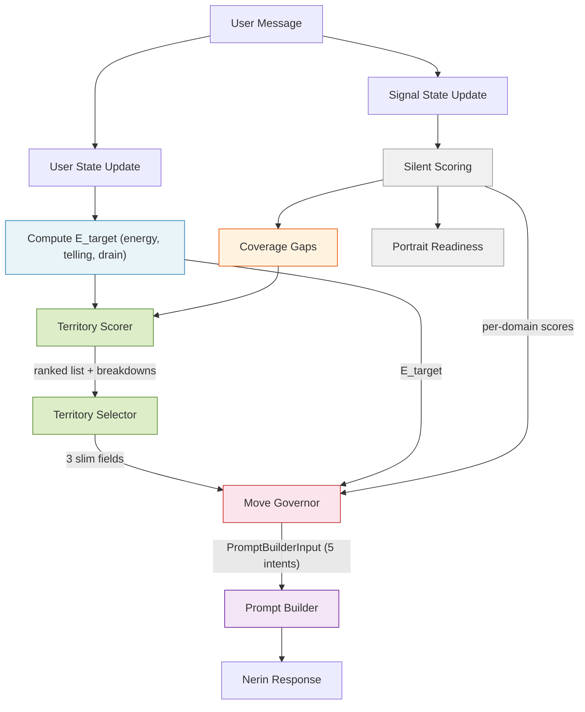

# Conversation Pacing Design Decisions

## Purpose

This document captures the design decisions and driving principles for Nerin's conversation pacing architecture. It defines *what was decided and why* to serve as the authoritative reference before building technical specs.

## Core Frame

**The product is not a personality assessment with a conversation wrapper. It is a guided self-discovery conversation with an assessment engine hidden underneath.**

Every decision in this document flows from that frame. The test for any design choice: *does this make the user feel seen or measured?*

## Problem Statement

The current system suffers from three interconnected issues:

### Adversarial Steering

When the system detects low energy, it pushes toward depth. When it detects high energy, it lets the user stay deep indefinitely. This creates two failure modes:

- **Light users** feel pushed into uncomfortable territory. Constant nudging toward depth signals "you're not giving us enough." This is exhausting and alienating for users who are naturally lighter communicators.
- **Deep users** burn out. The system permits sustained heavy engagement without enforced relief, draining the user's emotional energy even when they don't consciously feel it.

The steering is *reactive* — it corrects the user's state rather than serving it. It optimizes for signal extraction, not experience quality.

### Emotional Fatigue

Nerin excels at engaging users and going deep on subjects, but does so until it exhausts the topic or the user. The LLM drives the conversation pacing, which means depth continues until natural momentum dies. This produces a mid-conversation energy drop that damages both experience quality and data quality.

### Assessment Leakage

Assessment-native behaviors leak into the user experience: facet-level steering, contradiction-surfacing as a default move, "dig deeper" reflexes, and therapy-coded prompts. These make the user feel assessed rather than discovered. The system *thinks like an assessor* even when it partially *behaves like a guide*.

## Key Insight

**Enjoyment and data quality are aligned, not opposed.** Peak engagement moments produce more evidence, not less. A relaxed, self-propelled user reveals more authentic personality data than an emotionally fatigued one. User wellbeing is not a concession — it is part of the optimization target.

---

## Design Decisions

### Decision 1: Self-Discovery First, Assessment Hidden

The product frame is a guided self-discovery conversation. The assessment engine runs silently underneath. Nerin is responsible for flow and presence. The policy layer is responsible for pacing and territory selection. The analyzer is responsible for extracting signal from whatever the user naturally gives.

**Principle:** The user should never feel assessed. Every design choice is tested against "does this make the user feel seen or measured?"

**Rationale:** The richest signal comes from concrete stories, volunteered detail, topic choice, and self-made connections — not from pushed introspection. When users feel observed and clinical, they shift into performance mode, which produces thinner, less authentic data.

---

### Decision 2: Two-Axis State Model — Energy x Telling

User state is a 2D space defined by two independent axes:

- **Energy** — how much intensity the user brings to their message (0-10 scale)
- **Telling** — how self-propelled vs. compliance-driven the user is (ratio or score)

These combine with one derived signal for pacing:

- **Drain** — cumulative excess energy cost over a sliding window, representing fatigue

Coverage pressure (how much of the personality space remains thin) is tracked separately and feeds into **territory policy**, not into the pacing formula. See Decision 3 for rationale.

**The four quadrants:**

| State | Energy | Telling | Meaning |
|-------|--------|---------|---------|
| Flow | High | High | User is self-propelled and engaged — stay out of the way |
| Performance | High | Low | User is responding intensely but reactively — they feel assessed |
| Quiet authenticity | Low | High | User is volunteering at their own pace — respect the rhythm |
| Disengagement | Low | Low | User is fading — pivot to something fresh |

**Principle:** Intensity alone does not capture experience quality. A user performing answers at high energy is not the same as a user volunteering stories at high energy. Both axes are needed to read the room.

**Rationale:** The original system used energy alone to drive steering. This missed a critical distinction: a high-energy user in "answering mode" (responding to Nerin's prompts) is compliant, not discovering. The telling signal captures whether the user is self-propelled — introducing new ideas, telling stories unprompted, making their own connections. That is the behavioral signature of self-discovery.

---

### Decision 3: E_target Is User-State-Pure

The pacing formula computes a target energy for the next exchange based solely on user state. No phase term. No time pressure. No monetization logic. No coverage pressure.

E_target is a **pipeline of transforms**, not an additive sum. Each signal operates in its natural mode:

```text
1. E_s        = EMA of energy (smoothed anchor, init at 5.0, lambda=0.35)
2. V_up/down  = momentum from smoothed energy (split for asymmetric treatment)
3. trust      = f(telling) — qualifies upward momentum only
4. E_shifted  = E_s + alpha_up * trust * V_up - alpha_down * V_down
5. d          = average excess cost over last 5 turns (only energy above comfort counts)
6. E_cap      = concave fatigue ceiling from drain (floor=2.5, maxcap=9.0)
7. E_target   = clamp(min(E_shifted, E_cap), 0, 10)
```

**Key design choices:**

- **Momentum shifts, telling qualifies, drain constrains.** These are different *types* of force — not additive terms on the same axis. The pipeline structure makes this explicit.
- **Telling is asymmetric.** It qualifies upward momentum (is this self-propelled or performative?) but does not dampen downward momentum (always respect cooling). When telling is unavailable, trust defaults to 1.0 — the formula works without it.
- **Drain measures excess cost, not raw energy.** Only energy above a comfort threshold (5.0) counts as cost. A lively E=5 conversation accumulates zero drain. This distinguishes "sustained aliveness" from "sustained heaviness."
- **Drain is a ceiling, not a subtraction.** Fatigue protection dominates by construction — no other force can exceed the drain-derived cap. This is structural, not coefficient-dependent.
- **Coverage is NOT in the formula.** Coverage pressure is assessment state, not user state. Simulation proved it causes inverted pressure on low-energy users (light, guarded, fading users received the strongest upward push because they had the most headroom). Coverage belongs in territory policy, where it steers topic choice at the energy the user can sustain.

**Weight hierarchy:** `drain ceiling (structural) > alpha_down (0.6) >= alpha_up (0.5)`. No coverage term.

**Principle:** The pacing formula serves the user, not the business. Coverage, time-awareness, and portrait readiness live downstream in territory selection, never in the state model. E_target reads the room and outputs a number. What happens with that number is territory policy's job.

**Rationale:** An earlier draft used `E_target = E_base + a*V - b*D + g*C_deficit`. This additive form forced four different signal types onto the same axis and created scale mismatches. Coverage contaminated the state model by smuggling assessment pressure into pacing. The pipeline topology resolves both problems: each signal operates naturally, and the weight hierarchy is enforced architecturally rather than by coefficient discipline.

For the complete formula specification with constants, function shapes, and archetype simulation results, see [E_target Formula Specification](../problem-solution-2026-03-07.md).

---

### Decision 4: Four Move Types — Pull, Bridge, Hold, Pivot

The policy layer chooses from four functional move types. Richness and nuance come from Nerin's execution of the move, not from the taxonomy.

| Move | Function | Examples |
|------|----------|----------|
| **Pull** | Invite the user into a territory | Ask for a concrete story, offer a preference with contrast, invite a showcase moment |
| **Bridge** | Connect something the user said to somewhere new | Lateral connection, thematic link between topics |
| **Hold** | Reflect something specific, make space | Mirror one observation and let the sentence hang — an invitation with no pressure |
| **Pivot** | Change territory when energy or telling demands it | Topic shift, energy reset, fresh angle |

**Move selection as design vocabulary:**

> **Superseded by Decision 12:** The E_target-gap dispatch mapping below was retired. Move types survive as vocabulary for prompt builder instructions, post-hoc analysis, and design communication — not as policy-layer dispatch targets. The Governor computes entry pressure from the E_target gap but does not dispatch move types. Nerin naturally chooses the conversational action from context. See Decision 12 for the Governor's actual mechanism.

- `E_target ~ E(n)` — **Pull** or **Bridge** (stay the course or expand naturally)
- `E_target < E(n)` — **Pivot** (shift to lighter territory)
- `E_target > E(n)` — **Bridge** (connect to a territory at the right energy; territory policy uses coverage gaps to choose *where*)

**Principle:** The policy layer should be simple enough to tune mathematically. Fewer levers produce a more predictable system that is easier to calibrate with real data.

**Rationale:** An earlier iteration proposed seven move types. The additional types (normalize-not-knowing, affirm-and-move, rare contradiction) are not functionally distinct from the user's perspective — they are *flavors* of Hold or Pivot. Nerin handles the flavor in execution. The policy layer only needs to decide the *function*.

---

### Decision 5: Contradiction Is a Gated Flavor of Hold

Contradiction-surfacing is removed from the default rotation. It remains in the toolkit as a special flavor of Hold, available only when multiple thresholds are met simultaneously.

**Gates (all must be true):**

- Energy is high
- Telling ratio is high
- Drain is low
- The contradiction has been observed across at least two territories (not inferred from a single sentence)
- The user is not in a recently defensive or compressed mode

**Presentation rule:** Contradiction is always framed as fascination, never as verdict.

- Good: *"Something interesting is happening — earlier you described X, and here it feels almost opposite. I find that fascinating."*
- Bad: *"So you're actually contradictory about closeness."*

The first invites discovery. The second imposes a frame.

**Principle:** Contradiction is the most powerful self-discovery moment and the most dangerous assessment-feeling moment. It earns its way in through multiple thresholds.

**Rationale:** The current system uses contradiction-surfacing as a default move, which makes users feel analyzed and clinical. But deleting it entirely would sacrifice the most memorable moments in the conversation — the moments where users feel truly *seen*. The solution is to make it rare, gated, and framed as curiosity rather than diagnosis.

---

### Decision 6: Noticing Is Event-Driven, Triggered by Telling Peaks

During the conversation, Nerin occasionally offers a specific, grounded observation about the user. These "noticing" moments are not scheduled — they are triggered by high-telling-score moments.

**Constraints:**

- 2-4 moments per session maximum
- Always grounded in something specific the user just said
- Never analytical, never labeled, never trait-language
- Triggered when telling-score peaks — when the user is most alive and self-propelled

**Examples of the right class:**

- *"You really come alive when you talk about building things."*
- *"You get unusually precise when something matters to you."*
- *"You seem to care a lot about not saying something carelessly."*

**Principle:** Assessment stays hidden. Presence appears only when the user has already made the moment visible. This bridges hidden scoring and portrait trust.

**Rationale:** If Nerin never surfaces any observations during the conversation, the final portrait feels like it came from nowhere — generated by a stranger. Occasional specific noticing, triggered by the user's most authentic moments, seeds the trust that makes the portrait feel earned. The user remembers those moments and recognizes them in the final result.

---

### Decision 7: 25-Exchange Session Is an Episode Format

The conversation is capped at 25 exchanges. This is not a limitation — it is a deliberate episode format that serves both cost control and retention.

**Business model context:**

- The first conversation is free
- Users can pay for additional conversations, relationship analysis, and full portrait generation
- Each session produces a real, trustworthy portrait
- Continuation is sold as *more conversation*, not *real results*

**The target emotional exit:**

- *"That felt good, I want more — there's more depth to explore"* (desired)
- *"I think you're reading me wrong"* (avoided — this is bad frustration)
- *"They cut me off mid-sentence"* (avoided — this is manufactured scarcity)

The session should feel like a TV episode: complete enough to be satisfying, open enough to pull you back.

**Principle:** The session should feel complete AND leave living threads. The user leaves wanting more of the conversation, not more of the assessment.

**Rationale:** An open-ended conversation risks emotional drain and unpredictable costs. A fixed-length session forces the system to be efficient, creates natural retention mechanics, and makes portraits accumulative — each conversation adds a layer, like episodes building a season. The 25-exchange cap combined with a 2000-character message limit keeps cost predictable and pricing defensible.

---

### Decision 8: End on Aliveness, Not on a Manufactured Peak

The late session receives a bias toward depth-friendly territories via **conversationSkew** in the territory scoring formula. This is not a separate resonance mechanism — it's one of five terms in the unified scorer.

**Implementation:**

- `conversationSkew(t) = (1 - t.expectedEnergy) × earlyRamp + t.expectedEnergy × lateRamp` — low-energy territories are boosted early (turns 1-5), high-energy territories are boosted late (turns ~18-25), middle is quiet
- The skew lives in **territory scoring**, not in E_target — it nudges *where* to go, not *how hard* to push
- If the user is drained, energyMalus (quadratic penalty) prevents heavy territories from winning even with late-session skew — the system ends warmly and gently, it never forces a peak
- Late-session depth emerges as a bias, not an override — coverage and adjacency still compete honestly
- v2 refinement: storytelling-informed curve shape (Sophia's "whisper in the middle," earlier late ramp, peak contrast tracking) deferred until other mechanisms are testable

**The distinction:**

- **Engineering a peak** = *"Let me manufacture a dramatic moment"* (manipulation)
- **Avoiding a valley** = *"Let me not waste the moment we're in"* (craftsmanship)

The horizon layer avoids valleys. It does not engineer peaks.

**Principle:** The ending should feel like a natural pause in an ongoing relationship, not a curtain drop. The moment users sense the cliffhanger was manufactured, the trust breaks.

**Rationale:** Ending mid-drain or on a lukewarm topic produces *"yeah, I think we're done"* — no urgency to return. Ending near the user's most alive thread produces *"wait, I was just getting into that"* — natural pull to continue. But this must never feel engineered, or it becomes a manipulation that poisons the relationship.

---

### Decision 9: Portrait Readiness Is a Silent Quality Floor

The system maintains a running estimate of how trustworthy the portrait would be if the user left at any point. This estimate serves two purposes only:

1. **Quality floor** — ensure the portrait is always defensible, never embarrassing
2. **Continuation framing** — communicate to the user *"we explored X deeply, Y is still emerging"*

**Hard constraint:** Portrait readiness does NOT feed back into E_target or territory scoring. It is a read-only quality metric.

**Principle:** The system always knows how good the portrait would be if the user left now, but that knowledge never pressures the conversation.

**Rationale:** The moment portrait readiness pressures the conversation, the system reverts to assessment-first behavior. Coverage anxiety would leak into pacing, making the user feel rushed or interrogated. Keeping portrait readiness as read-only preserves the self-discovery frame while ensuring quality standards are met.

---

### Decision 10: Validate with Real Users Before Further Refinement

The framework is strong enough to test. Further theoretical refinement produces diminishing returns compared to observing real conversations.

**Validation targets:** Test across user archetypes:

- Guarded users (low telling, careful answers)
- Over-sharers (high energy, high telling, but may lack depth)
- Skeptics (resistant to the format)
- Low-self-awareness users (may not produce reflective content)

**Key behavioral metrics to observe:**

- Telling ratio across the session
- Engagement arc (does energy decline, hold, or rise?)
- Volunteered detail density
- Territory coverage achieved
- The golden question: *"Did the user forget this was an assessment?"*

**Principle:** Five real conversations teach more than five more design rounds.

**Rationale:** The design decisions above are grounded in analysis of existing conversation patterns and user behavior notes, but most evidence comes from a limited sample. The formula's constants (alpha_up, alpha_down, lambda, K, comfort) have v1 defaults derived from simulation, but they require empirical calibration against diverse user types.

---

### Decision 11: Territory Catalog Is Architecture, Not Data

The territory catalog — 25 territories with continuous `expectedEnergy`, dual-domain tags, and expected facets — is a first-order architectural concern. Three of five scorer terms (`energyMalus`, `conversationSkew`, `adjacency`) consume catalog fields directly. The scorer amplifies whatever the catalog says. Catalog quality IS scorer quality.

**Key design principles:**

- **`expectedEnergy` measures opener cost, not depth potential.** Each territory's energy value represents the typical cost of a genuine first answer to the territory's natural opener — not how deep it *could* go, how emotionally heavy it *sounds*, or how much signal it *yields*. This prevents inflation and keeps values stable. Anchor: 0.5 = comfort threshold (zero drain).
- **Don't lie about what a territory is to make the math work.** If a facet needs to be reachable at a different energy level, create a territory where it genuinely surfaces at that energy — don't artificially lower a heavy territory's energy value. The territory is what it is.
- **Create territories to fill gaps, don't force facets onto existing ones.** A new territory with narrative honesty score 1.0 (daily-frustrations for anger) beats overloading an existing territory at honesty 0.7 (adding anger to work-dynamics).
- **Accept thin facets rather than manufacturing artificial access.** Depression exists only in heavy territories (inner-struggles at 0.65, pressure-and-resilience at 0.72). The portrait communicates this as "still emerging" rather than creating a dishonest medium-energy depression territory.

**Catalog structure (25 territories):**

- **Energy distribution:** 9 light (0.20-0.37), 10 medium (0.38-0.53), 6 heavy (0.58-0.72). Upper range [0.75-0.85] is headroom for future territories.
- **Domain distribution:** relationships (15), solo (13), work (9), family (6), leisure (6). All domains appear in ≥6 territories. Every territory has exactly 2 domains.
- **Three natural corridors** emerged from honest domain tagging:
  - *Introspective* {solo, relationships}: comfort-zones → emotional-awareness → friendship-depth → opinions-values → inner-struggles
  - *Interpersonal* {relationships, work}: helping-others → daily-frustrations → work-dynamics → team-leadership → conflict-resolution
  - *Achiever* {solo, work}: daily-routines → learning-curiosity → ambition-goals → identity-purpose
- **Bridge territories** connect corridors at Jaccard = 0.33: growing-up, social-circles, social-dynamics, family-rituals, giving-and-receiving, pressure-resilience
- **Session arc affordance:** The energy distribution naturally supports a three-act structure (light exploration → medium corridor narrowing → heavy depth convergence) before `conversationSkew` even applies.

**v1 calibration status:** Energy values were cross-validated using 3 independent methods (opener-cost assessment, 4-dimension scoring audit, relative ordering with 6 anchor territories). 4 territories flagged as high-variance (social-dynamics, opinions-and-values, team-and-leadership, daily-frustrations) — first candidates for empirical recalibration.

**Known risk:** Relationships at 60% of territories creates systematic adjacency advantage. If monitoring shows >70% of turns in relationship-tagged territories, switch to inverse-frequency-weighted Jaccard in `scorer-config.ts` (a coefficient change, not a catalog change).

**Principle:** The catalog is the scorer's ground truth. Getting it right is not a data entry task — it's an architectural task with direct consequences for conversation quality.

**Rationale:** The original catalog used discrete `energyLevel: "light"|"medium"|"heavy"` and single-domain tags designed for human readability. The new unified scorer requires continuous `expectedEnergy` for `energyMalus` and `conversationSkew`, and multi-domain tags for Jaccard `adjacency`. Migrating the catalog exposed structural issues (4 cluster traps, a family island, 6 single-domain dead-ends, anger/depression isolated in heavy-only territories) that required domain re-tagging and 3 new territories to resolve.

---

### Decision 12: Move Governor — Restraint Layer, Not Move Dispatch

The third pipeline layer (after Scorer and Selector) is a **Move Governor**, not a full Move Generator. The Governor handles what LLMs are bad at (frequency control, cooldowns, entry pressure calibration) and trusts Nerin for what it's naturally good at (conversational action choice, noticing quality, contradiction framing).

**The reframe:** The original Move Generator tried to dispatch Pull/Bridge/Hold/Pivot as base moves — formalizing what Nerin already does naturally. Red Team analysis showed this risks fake precision (move types may not produce behaviorally distinct LLM outputs) and required ~15 input fields including unbuilt systems. The Governor collapses to 4 decisions and outputs a `PromptBuilderInput` discriminated union with zero phantom dependencies.

**Four decisions per turn:**

| Decision | Mechanism | Output |
|----------|-----------|--------|
| **Entry pressure** | Gap between E_target and territory `expectedEnergy` | `"direct"` / `"angled"` / `"soft"` |
| **Noticing hint** | Clarity emergence formula — EMA-smoothed clarity vs conversation-average baseline, gated by U-shaped phase curve + escalation | `LifeDomain` (compass) or `null` (suppressed) |
| **Contradiction target** | Facet divergence across life domains — `strength = delta × min(confA, confB)` vs escalating threshold | `ContradictionTarget` (specific facet × domain pair) or `null` (suppressed) |
| **Convergence target** | Facet alignment across 3+ life domains — `strength = (1 - normalizedSpread) × minConf` vs escalating threshold | `ConvergenceTarget` (specific facet × domain set) or `null` (suppressed) |

**Key design choices:**

- **Hybrid trigger model.** Contradiction and convergence are system-triggered from evidence (deterministic facet divergence/alignment). Noticing is Nerin-led with frequency throttle (clarity emergence opens a window, Nerin decides content). Different problems, different mechanisms.
- **Escalating thresholds replace hardcoded caps.** `requiredStrength(n) = BASE × ESCALATION^n` naturally produces 0-2 contradictions, 0-1 convergences, and 0-3 noticings per session based on evidence quality — no `MAX_CONTRADICTIONS` or `MAX_NOTICINGS` constants.
- **Mutual exclusion.** At most one overlay (noticing OR contradiction OR convergence) per turn. All three spend trust. All say "I see you." Combining them makes the user feel studied, not seen. When multiple fire, threshold ratio tiebreak decides: each signal's value divided by its required threshold. Higher ratio wins. Equal ratios → priority: contradiction > convergence > noticing (rarest to commonest). Deferred signals are re-evaluated next turn.
- **Domain compass, not facet target.** Noticing hint is a `LifeDomain`, not a facet name. "Something is shifting in career" lets Nerin discover what's alive. "Notice their gregariousness at work" makes Nerin sound steered.
- **Convergence mirrors contradiction.** Contradiction detects a facet scoring *differently* across two domains (complexity: "you're assertive at work but accommodating in relationships"). Convergence detects a facet scoring *similarly* across three or more domains (identity: "this curiosity threads through everything you do"). Both are evidence-based, both use the same per-domain scoring primitives, both follow the escalating threshold pattern.
- **Closing is amplification, not wrap-up.** On `isFinalTurn`, the Governor derives `intent: "amplify"` — Nerin gets a "go deeper" instruction, permission to be braver. The Governor evaluates only contradiction and convergence for the final beat (noticing excluded — it's a local signal, not a culmination). The strongest single candidate becomes `focus: MomentFocus | null`. Nerin doesn't know it's the last turn. The conversation cuts at peak intensity.
- **Window-based tracking is a closed system.** The Governor tracks when it *opened* windows, not when Nerin *used* them. Cooldown runs from window-open. No response parsing, no feedback loop, no extra LLM calls.
- **Derive-at-read for session state.** Governor output is stored as jsonb on each assistant message. Session counters (windows opened, pairs surfaced, facets surfaced) are reconstructed by scanning prior messages' `MomentFocus._tag` variants — consistent with the codebase pattern. EMA + baseline recomputed from full evidence history each turn (~3750 clarity values max, sub-millisecond).

**Governor output IS `PromptBuilderInput`:**

The Governor's external contract is the `PromptBuilderInput` discriminated union — not a flat struct that needs downstream transformation. The Governor runs `deriveIntent()` internally to map its 4 decisions + session state into the correct variant, then outputs the shaped type directly. Each variant carries only the fields its intent needs:

```typescript
type DomainScore = { domain: LifeDomain; score: number; confidence: number }

type ContradictionTarget = {
  facet: FacetName
  pair: [DomainScore, DomainScore]
  strength: number
}

type ConvergenceTarget = {
  facet: FacetName
  domains: DomainScore[]              // 3+ domains, all scoring similarly
  strength: number
}

type EntryPressure = "direct" | "angled" | "soft"
type ConversationalIntent = "open" | "deepen" | "bridge" | "hold" | "amplify"

// ─── Moment Focus (tagged union) ───────────────────
type NoticingFocus    = { readonly _tag: "NoticingFocus";      readonly domain: LifeDomain }
type ContradictionFocus = { readonly _tag: "ContradictionFocus"; readonly target: ContradictionTarget }
type ConvergenceFocus = { readonly _tag: "ConvergenceFocus";   readonly target: ConvergenceTarget }
type MomentFocus = NoticingFocus | ContradictionFocus | ConvergenceFocus

// ─── Prompt Builder Input (discriminated union) ────
type PromptBuilderInput =
  | { intent: "open";    territory: Territory }
  | { intent: "deepen";  territory: Territory; entryPressure: EntryPressure }
  | { intent: "bridge";  territory: Territory; previousTerritory: Territory;
      entryPressure: EntryPressure }
  | { intent: "hold";    territory: Territory; focus: MomentFocus }
  | { intent: "amplify"; territory: Territory; focus: MomentFocus | null }
```

**Intent derivation rules** (inside Governor, not exposed):

| Condition | Intent |
|-----------|--------|
| `turnNumber === 1` | `open` |
| `isFinalTurn` | `amplify` |
| Noticing, contradiction, or convergence fires | `hold` |
| `previousTerritory !== null && territory !== previousTerritory` | `bridge` |
| Otherwise (same territory or first exploring turn) | `deepen` |

Priority: `open` > `amplify` > `hold` > `bridge` / `deepen`. On `amplify`, the Governor evaluates only contradiction and convergence (noticing excluded — it's a local signal, not a culmination). Thresholds are bypassed (threshold parameter = 0). Surfaced-pair/facet exclusion still applies (don't repeat). The Governor picks the strongest single candidate and wraps it in `MomentFocus`, or `null` if neither has a candidate. Nerin gets one focused signal for the final beat, not two competing signals.

**Field sources:**
- `territory` — resolved from `TerritoryId` by pipeline via catalog lookup
- `previousTerritory` — resolved by pipeline from prior message's stored `TerritoryId`
- `entryPressure` — computed from gap between E_target and territory `expectedEnergy`
- `focus` — the `MomentFocus` variant wrapping whichever overlay fired (noticing domain, contradiction target, or convergence target)

**Note on serialization:** When `PromptBuilderInput` is persisted to jsonb on `assessment_message`, territories are stored as `TerritoryId` (not full `Territory` objects). The pipeline resolves them fresh from the catalog when reading back for reconstruction. Consistent with derive-at-read.

**Debug/replay trace** (separate consumer, not sent to Prompt Builder). Each of the Governor's 4 decisions carries a discriminated debug union — no impossible states, pattern-matchable:

```typescript
type EntryPressureDebug =
  | { result: "direct"; reason: "no_etarget" }
  | { result: "direct"; reason: "within_range";
      eTarget: number; territoryEnergy: number; gap: number }
  | { result: "angled"; reason: "moderate_gap";
      eTarget: number; territoryEnergy: number; gap: number }
  | { result: "soft"; reason: "large_gap";
      eTarget: number; territoryEnergy: number; gap: number }

type NoticingDebug =
  | { reason: "excluded_from_amplify" }
  | { reason: "skipped_opening" }
  | { reason: "no_emergence" }
  | { reason: "below_threshold"; topDomain: LifeDomain; emergence: number; required: number }
  | { reason: "deferred_by_other"; topDomain: LifeDomain;
      deferredBy: "contradiction" | "convergence" }
  | { reason: "fired"; domain: LifeDomain; emergence: number; required: number }

type ContradictionDebug =
  | { reason: "no_candidates" }
  | { reason: "below_threshold"; topStrength: number; requiredStrength: number }
  | { reason: "already_surfaced"; target: ContradictionTarget }
  | { reason: "deferred_by_other"; target: ContradictionTarget;
      deferredBy: "noticing" | "convergence" }
  | { reason: "fired"; target: ContradictionTarget;
      topStrength: number; requiredStrength: number }

type ConvergenceDebug =
  | { reason: "no_candidates" }
  | { reason: "below_threshold"; topStrength: number; requiredStrength: number }
  | { reason: "already_surfaced"; facet: FacetName }
  | { reason: "deferred_by_other"; facet: FacetName;
      deferredBy: "noticing" | "contradiction" }
  | { reason: "fired"; facet: FacetName; domainCount: number;
      spread: number; strength: number; requiredStrength: number }

type MoveGovernorDebug = {
  selectionRule: string
  isFinalTurn: boolean
  entryPressure: EntryPressureDebug
  noticing: NoticingDebug
  contradiction: ContradictionDebug
  convergence: ConvergenceDebug
  selectorSessionPhase: "opening" | "exploring"
  selectorTransitionType: "continue" | "transition"
}
```

`selectorSessionPhase` and `selectorTransitionType` are attached by the pipeline for observability — the Governor does not read them. The Governor derives intent from `turnNumber` (open), `isFinalTurn` (amplify), overlay firing (hold), and territory comparison (bridge/deepen).

**Prompt builder composition:** The prompt builder receives `PromptBuilderInput` directly and assembles a four-layer system prompt: NERIN_PERSONA → Core Identity (7 always-on modules) → Behavioral Modules (selected per intent from composition matrix) → Steering Section (territory → intent instruction → entry pressure → focus → amplification). See Decision 13 for the full architecture.

**Four move types survive as vocabulary:** Pull, Bridge, Hold, Pivot remain for prompt builder instructions, post-hoc analysis, and design communication. They are not Governor dispatch targets. Nerin naturally chooses the conversational action from context.

**Upgrade path:** The Governor can be promoted to a full Move Generator (additive, not rewrite) if behavioral evidence shows Pull/Bridge/Hold/Pivot produce measurably distinct LLM outputs and Nerin repeatedly makes poor base-move choices.

**Principle:** Trust what the LLM does well (conversational craft), constrain what it does poorly (frequency control, structural state). The Governor's job is to make sure Nerin's natural instincts are channeled well — not to replace them.

**Rationale:** The Governor emerged from adversarial stress-testing of the original Move Generator. Every reduction — dropping base-move dispatch, dropping payloads, dropping feedback loops — was driven by a specific failure mode. The remaining 4 decisions, shaped into `PromptBuilderInput`, are the minimum needed to solve the four problems Nerin can't solve itself: over-noticing, premature contradiction, missing identity detection (convergence), and missing entry pressure calibration.

---

### Decision 13: Three-Tier Contextual Prompt Composition

The prompt builder is a deterministic compositor that assembles Nerin's system prompt from four layers. CHAT_CONTEXT (276-line monolith) is decomposed into modular constants — some always-on, others included per conversational intent. The Governor outputs `PromptBuilderInput` directly — a discriminated union with five intent variants. No transform layer sits between them.

**The three-tier model:**

```
┌─────────────────────────────────────────────┐
│  NERIN_PERSONA (universal identity)         │  ← shared across all surfaces
├─────────────────────────────────────────────┤
│  Core Identity modules (always-on chat)     │  ← makes Nerin coherent across
│                                             │     all 25 messages
├─────────────────────────────────────────────┤
│  Behavioral modules (intent-contextual)     │  ← included/excluded based on
│                                             │     conversationalIntent
├─────────────────────────────────────────────┤
│  Steering section (per-turn)                │  ← Governor output translation
└─────────────────────────────────────────────┘
```

**Five conversational intents form the complete vocabulary:**

| Intent | When | Behavioral Modules Included |
|--------|------|----------------------------|
| `open` | First turn | Relate>Reflect |
| `deepen` | Continue in same territory | Relate>Reflect, Story-Pulling, Mirrors (10) |
| `bridge` | Transition to new territory | Relate>Reflect, Threading, Mirrors (4) |
| `hold` | Noticing, contradiction, or convergence moment | Observation Quality, Mirrors (4) |
| `amplify` | Final turn — go bold | Observation Quality (if focus), Mirrors (4) |

**Key design choices:**

- **Instinct vs instruction.** The character bible describes instincts ("you never make someone feel insufficient"). The steering section gives directives ("enter at an angle"). Different abstraction levels cooperate. Same abstraction level competes. This resolves all gray-zone conflicts.
- **The absence of modules IS the instruction.** Hold-Nerin doesn't have questioning instincts loaded — not because we told it "don't ask questions" (which creates tension), but because it literally doesn't have that cognitive palette available. Story-pulling during hold, questioning during amplify — these are eliminated architecturally, not by prompt discipline.
- **`PromptBuilderInput` discriminated union.** Five variants, each carrying only its relevant parameters. Hold requires `focus`, bridge requires `previousTerritory`, entry pressure appears only on deepen/bridge. The type system prevents impossible states at compile time.
- **Governor output IS `PromptBuilderInput`.** The Governor's external contract is the discriminated union itself — not a flat struct with a downstream transform. `deriveIntent()` runs inside the Governor. Debug/replay receives `MoveGovernorDebug` (product of 4 discriminated debug unions, retaining selector sessionPhase/transitionType for observability). See Decision 12 for the full contract, intent derivation rules, and field sources.
- **Rhythm is emergent, not composed.** The prompt builder shapes each beat via module selection but never orchestrates the sequence. No `previousIntent` tracking, no turn-number awareness. Rhythm emerges from scorer (session arc) + Governor (turn constraints) + pacing formula (energy ceiling).

**Character bible decomposition:**

- **Tier 1 — Core Identity (always-on):** `CONVERSATION_MODE`, `BELIEFS_IN_ACTION`, `CONVERSATION_INSTINCTS` (rewritten — directives removed, instincts kept), `QUALITY_INSTINCT` (extracted from RESPONSE FORMAT), `MIRROR_GUARDRAILS` (placement rules only, ~80 tokens), `HUMOR_GUARDRAILS`, `INTERNAL_TRACKING`
- **Tier 2 — Behavioral (contextual):** `RELATE_REFLECT` (trimmed), `STORY_PULLING` (trimmed), `OBSERVATION_QUALITY` (rewritten — mechanism removed, quality instinct kept), `THREADING` (as-is), `MIRRORS_DEEPEN` (10 mirrors), `MIRRORS_BRIDGE` (4 mirrors), `MIRRORS_HOLD` (4 mirrors), `MIRRORS_AMPLIFY` (4 mirrors)
- **Eliminated:** QUESTIONING_STYLE (folded into intent instructions), RESPONSE_FORMAT (decomposed — "every sentence earns its place" to Tier 1, format guidance merged per-intent), RESPONSE_PALETTE (eliminated)

**Token budget (vs current monolith at ~2400 tokens):**

| Intent | Estimated Tokens | Reduction |
|--------|-----------------|-----------|
| `open` | ~530 | -78% |
| `deepen` | ~1350 | -44% |
| `bridge` | ~1170 | -51% |
| `hold` | ~850 | -65% |
| `amplify` | ~920 | -62% |

**Supersession:** This decision supersedes the Governor spec's Prompt Builder Enrichment section (lines 734-933 of the Move Governor spec) with a more complete architecture that accounts for character bible decomposition, contextual modules, and the discriminated union input.

**Principle:** The prompt builder is a faithful translator, not a rhythm engine. It composes the right cognitive palette for each beat. The Governor decides what kind of moment this is. Nerin executes with whatever tools are loaded.

**Rationale:** CHAT_CONTEXT was written as a monolith before the steering pipeline existed. It mixed *who Nerin is* with *what Nerin should do in specific situations*. The Governor now owns per-turn management, making always-on behavioral directives redundant and potentially conflicting. Worse, the monolithic structure actively sabotages specific intents — story-pulling during hold, questioning during amplify create conflicting signals that concatenation cannot resolve. The three-tier contextual composition model eliminates both problems: overlap is resolved by the instinct-vs-instruction principle, sabotage is resolved by intent-contextual module inclusion.

---

## Architecture Summary

The system operates as six decoupled layers. Territory policy is split into three sub-layers (Scorer → Selector → Move Governor) with an enriched Prompt Builder — for debuggability, each layer is independently diagnosable:



| Layer | Responsibility | Inputs | Output |
|-------|---------------|--------|--------|
| **Pacing (E_target)** | Estimate what the conversation can sustain | Energy, telling, drain | `E_target` (0-10) |
| **Territory Scorer** | Rank all 25 territories by unified formula | E_target, **coverage gaps**, catalog (expectedEnergy, domains, facets), visit history, turn/totalTurns | Sorted ranked list with per-term score breakdowns |
| **Territory Selector** | Pick from ranked list via deterministic rules (3 code paths: cold-start perimeter, argmax, finale) | TerritoryScorerOutput + session context (userId, sessionId) | `selectedTerritory`, `sessionPhase`, `transitionType`, `selectionRule`, `selectionSeed`, `scorerOutput` |
| **Move Governor** | Constrain Nerin's behavior: entry pressure, noticing windows, contradiction targets, convergence targets. Derives conversational intent and outputs `PromptBuilderInput` directly | Selector output (3 fields), E_target, per-domain facet scores, session counters, `isFinalTurn` | `PromptBuilderInput` (discriminated union, 5 intent variants — see Decision 12) + `MoveGovernorDebug` (product of 4 discriminated debug unions for observability) |
| **Prompt Builder** | Compose contextual system prompt from 4 layers — select behavioral modules per intent, translate Governor output into steering instructions | `PromptBuilderInput` (direct from Governor) + territory catalog | Complete system prompt: NERIN_PERSONA → Core Identity → Behavioral Modules (intent-contextual) → Steering Section (territory → intent → pressure → focus → amplification) |
| **Silent Scoring** | Extract evidence, update estimates | User message, conversation history | Facet scores, confidence, portrait readiness, **coverage gaps** |

**Separation invariants:** Coverage flows to territory scorer, never through E_target (Decision 3). Each layer does one job: scorer ranks, selector picks, Governor constrains, Nerin executes (Decision 12). Silent scoring never affects Nerin's tone directly (Decision 9).

---

## Priority Hierarchy

When forces conflict, resolve in this order:

1. **Protect user state** — never push harder because a facet is thin (enforced structurally: drain ceiling in E_target, coverage excluded from pacing)
2. **Maintain conversational momentum** — favor transitions that feel adjacent, not random
3. **Apply quiet pressure for breadth and depth** — through territory selection, never through E_target

---

## Open Questions

### Resolved

- **Formula structure** — resolved. 7-step pipeline of transforms. See Decision 3 and [E_target Formula Spec](../problem-solution-2026-03-07.md).
- **Coverage in E_target** — resolved. Removed. Coverage feeds territory policy, not pacing. See Decision 3.
- **Telling integration** — resolved. Asymmetric trust qualifier on upward momentum. See Decision 3.
- **Formula weights** — partially resolved. V1 defaults established. Empirical calibration still required. See Decision 10.
- **Energy definition and extraction** — resolved. Cost-to-user across 4 dimensions, 5 anchored bands. See [Energy and Telling Extraction Spec](../problem-solution-2026-03-07-energy-telling-extraction.md).
- **Telling signal extraction** — resolved. Self-propulsion beyond minimum viable answer. See [Energy and Telling Extraction Spec](../problem-solution-2026-03-07-energy-telling-extraction.md).
- **ConversAnalyzer v2 output contract** — resolved. `userState` block with bands, fail-open defaults. See [Energy and Telling Extraction Spec](../problem-solution-2026-03-07-energy-telling-extraction.md).
- **Territory policy redesign** — resolved. Three-layer decomposition: Scorer → Selector → Governor. See Decision 11 and [Territory Policy Spec](../problem-solution-2026-03-07-territory-policy.md). *Note: spec uses pre-reframe "move generator" terminology — see Decision 12 for the Governor reframe.*
- **Territory selector layer** — resolved. 3 code paths, 6-field output contract. See [Territory Selector Spec](../problem-solution-2026-03-09.md). *Note: spec uses pre-reframe "move generator" terminology — see Decision 12.*
- **Territory catalog refinement** — resolved. 25 territories, continuous `expectedEnergy`, 3 new territories. See Decision 11 and [Territory Catalog Migration Spec](../problem-solution-2026-03-08.md).
- **Prompt builder architecture** — resolved. Three-tier contextual composition. Supersedes Governor spec's Prompt Builder Enrichment section. See Decision 13 and [Prompt Builder Architecture Spec](../problem-solution-2026-03-10.md).
- **Move generator redesign** — resolved. Reframed as **Move Governor** — restraint layer, not action dispatch. See Decision 12 and [Move Governor Spec](../problem-solution-2026-03-09-move-generator.md).

### Still Open
- **Continuation experience** — what does conversation 2 feel like? Does Nerin remember? Does it pick up living threads from session 1?
- **Portrait framing** — how exactly does the portrait communicate "complete but inviting" after a single session? What language bridges "here's what we found" and "here's what's still emerging"?
- **Response latency** — message timestamps may serve as a weak confirmatory signal (long pause + high telling = depth; long pause + low telling = friction), but this is low-priority and ambiguous on its own

---

## Related Documents

Specs are listed in dependency order (upstream first). Coherence status reflects alignment with Decisions 1-13 in this document.

| Spec | Date | Coherence | Notes |
|:-----|:-----|:----------|:------|
| [E_target Formula](../problem-solution-2026-03-07.md) | 03-07 | Current | Decisions 1-3, 10 |
| [Energy and Telling Extraction](../problem-solution-2026-03-07-energy-telling-extraction.md) | 03-07 | Current | Decisions 2-3 |
| [Territory Policy](../problem-solution-2026-03-07-territory-policy.md) | 03-07 | Terminology outdated | Uses "move generator" (15 refs) — see Decision 12 for Governor reframe |
| [Territory Catalog Migration](../problem-solution-2026-03-08.md) | 03-08 | Current | Decision 11 |
| [Territory Selector](../problem-solution-2026-03-09.md) | 03-09 | Current | Full coherence pass applied 03-10 — Governor terminology, pipeline diagram, separation of concerns table updated |
| [Move Governor](../problem-solution-2026-03-09-move-generator.md) | 03-09 | Current | Decision 12. Prompt Builder Enrichment section (lines 734-933) superseded by Decision 13 |
| [Prompt Builder Architecture](../problem-solution-2026-03-10.md) | 03-10 | Current | Decision 13. Supersedes Governor spec's Prompt Builder Enrichment |

**Other references:**

- [Architecture](./architecture.md) — system architecture (does not yet include conversation pacing pipeline — update after implementation)
