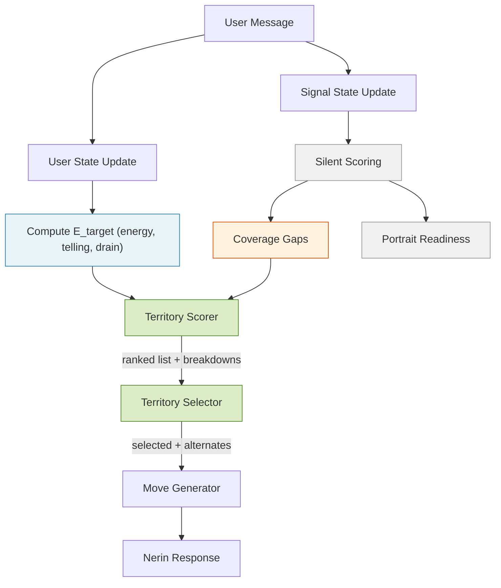

# Conversation Pacing Design Decisions

## Purpose

This document captures the design decisions and driving principles for Nerin's conversation pacing architecture. It defines *what was decided and why* to serve as the authoritative reference before building technical specs.

## Core Frame

**The product is not a personality assessment with a conversation wrapper. It is a guided self-discovery conversation with an assessment engine hidden underneath.**

Every decision in this document flows from that frame. The test for any design choice: *does this make the user feel seen or measured?*

## Problem Statement

The current system suffers from three interconnected issues:

### Adversarial Steering

When the system detects low energy, it pushes toward depth. When it detects high energy, it lets the user stay deep indefinitely. This creates two failure modes:

- **Light users** feel pushed into uncomfortable territory. Constant nudging toward depth signals "you're not giving us enough." This is exhausting and alienating for users who are naturally lighter communicators.
- **Deep users** burn out. The system permits sustained heavy engagement without enforced relief, draining the user's emotional energy even when they don't consciously feel it.

The steering is *reactive* — it corrects the user's state rather than serving it. It optimizes for signal extraction, not experience quality.

### Emotional Fatigue

Nerin excels at engaging users and going deep on subjects, but does so until it exhausts the topic or the user. The LLM drives the conversation pacing, which means depth continues until natural momentum dies. This produces a mid-conversation energy drop that damages both experience quality and data quality.

### Assessment Leakage

Assessment-native behaviors leak into the user experience: facet-level steering, contradiction-surfacing as a default move, "dig deeper" reflexes, and therapy-coded prompts. These make the user feel assessed rather than discovered. The system *thinks like an assessor* even when it partially *behaves like a guide*.

## Key Insight

**Enjoyment and data quality are aligned, not opposed.** Peak engagement moments produce more evidence, not less. A relaxed, self-propelled user reveals more authentic personality data than an emotionally fatigued one. User wellbeing is not a concession — it is part of the optimization target.

---

## Design Decisions

### Decision 1: Self-Discovery First, Assessment Hidden

The product frame is a guided self-discovery conversation. The assessment engine runs silently underneath. Nerin is responsible for flow and presence. The policy layer is responsible for pacing and territory selection. The analyzer is responsible for extracting signal from whatever the user naturally gives.

**Principle:** The user should never feel assessed. Every design choice is tested against "does this make the user feel seen or measured?"

**Rationale:** The richest signal comes from concrete stories, volunteered detail, topic choice, and self-made connections — not from pushed introspection. When users feel observed and clinical, they shift into performance mode, which produces thinner, less authentic data.

---

### Decision 2: Two-Axis State Model — Energy x Telling

User state is a 2D space defined by two independent axes:

- **Energy** — how much intensity the user brings to their message (0-10 scale)
- **Telling** — how self-propelled vs. compliance-driven the user is (ratio or score)

These combine with one derived signal for pacing:

- **Drain** — cumulative excess energy cost over a sliding window, representing fatigue

Coverage pressure (how much of the personality space remains thin) is tracked separately and feeds into **territory policy**, not into the pacing formula. See Decision 3 for rationale.

**The four quadrants:**

| State | Energy | Telling | Meaning |
|-------|--------|---------|---------|
| Flow | High | High | User is self-propelled and engaged — stay out of the way |
| Performance | High | Low | User is responding intensely but reactively — they feel assessed |
| Quiet authenticity | Low | High | User is volunteering at their own pace — respect the rhythm |
| Disengagement | Low | Low | User is fading — pivot to something fresh |

**Principle:** Intensity alone does not capture experience quality. A user performing answers at high energy is not the same as a user volunteering stories at high energy. Both axes are needed to read the room.

**Rationale:** The original system used energy alone to drive steering. This missed a critical distinction: a high-energy user in "answering mode" (responding to Nerin's prompts) is compliant, not discovering. The telling signal captures whether the user is self-propelled — introducing new ideas, telling stories unprompted, making their own connections. That is the behavioral signature of self-discovery.

---

### Decision 3: E_target Is User-State-Pure

The pacing formula computes a target energy for the next exchange based solely on user state. No phase term. No time pressure. No monetization logic. No coverage pressure.

E_target is a **pipeline of transforms**, not an additive sum. Each signal operates in its natural mode:

```text
1. E_s        = EMA of energy (smoothed anchor, init at 5.0, lambda=0.35)
2. V_up/down  = momentum from smoothed energy (split for asymmetric treatment)
3. trust      = f(telling) — qualifies upward momentum only
4. E_shifted  = E_s + alpha_up * trust * V_up - alpha_down * V_down
5. d          = average excess cost over last 5 turns (only energy above comfort counts)
6. E_cap      = concave fatigue ceiling from drain (floor=2.5, maxcap=9.0)
7. E_target   = clamp(min(E_shifted, E_cap), 0, 10)
```

**Key design choices:**

- **Momentum shifts, telling qualifies, drain constrains.** These are different *types* of force — not additive terms on the same axis. The pipeline structure makes this explicit.
- **Telling is asymmetric.** It qualifies upward momentum (is this self-propelled or performative?) but does not dampen downward momentum (always respect cooling). When telling is unavailable, trust defaults to 1.0 — the formula works without it.
- **Drain measures excess cost, not raw energy.** Only energy above a comfort threshold (5.0) counts as cost. A lively E=5 conversation accumulates zero drain. This distinguishes "sustained aliveness" from "sustained heaviness."
- **Drain is a ceiling, not a subtraction.** Fatigue protection dominates by construction — no other force can exceed the drain-derived cap. This is structural, not coefficient-dependent.
- **Coverage is NOT in the formula.** Coverage pressure is assessment state, not user state. Simulation proved it causes inverted pressure on low-energy users (light, guarded, fading users received the strongest upward push because they had the most headroom). Coverage belongs in territory policy, where it steers topic choice at the energy the user can sustain.

**Weight hierarchy:** `drain ceiling (structural) > alpha_down (0.6) >= alpha_up (0.5)`. No coverage term.

**Principle:** The pacing formula serves the user, not the business. Coverage, time-awareness, and portrait readiness live downstream in territory selection, never in the state model. E_target reads the room and outputs a number. What happens with that number is territory policy's job.

**Rationale:** An earlier draft used `E_target = E_base + a*V - b*D + g*C_deficit`. This additive form forced four different signal types onto the same axis and created scale mismatches. Coverage contaminated the state model by smuggling assessment pressure into pacing. The pipeline topology resolves both problems: each signal operates naturally, and the weight hierarchy is enforced architecturally rather than by coefficient discipline.

For the complete formula specification with constants, function shapes, and archetype simulation results, see [E_target Formula Specification](../problem-solution-2026-03-07.md).

---

### Decision 4: Four Move Types — Pull, Bridge, Hold, Pivot

The policy layer chooses from four functional move types. Richness and nuance come from Nerin's execution of the move, not from the taxonomy.

| Move | Function | Examples |
|------|----------|----------|
| **Pull** | Invite the user into a territory | Ask for a concrete story, offer a preference with contrast, invite a showcase moment |
| **Bridge** | Connect something the user said to somewhere new | Lateral connection, thematic link between topics |
| **Hold** | Reflect something specific, make space | Mirror one observation and let the sentence hang — an invitation with no pressure |
| **Pivot** | Change territory when energy or telling demands it | Topic shift, energy reset, fresh angle |

**Move selection is driven by the gap between E_target and current state:**

- `E_target ~ E(n)` — **Pull** or **Bridge** (stay the course or expand naturally)
- `E_target < E(n)` — **Pivot** (shift to lighter territory)
- `E_target > E(n)` — **Bridge** (connect to a territory at the right energy; territory policy uses coverage gaps to choose *where*)

**Principle:** The policy layer should be simple enough to tune mathematically. Fewer levers produce a more predictable system that is easier to calibrate with real data.

**Rationale:** An earlier iteration proposed seven move types. The additional types (normalize-not-knowing, affirm-and-move, rare contradiction) are not functionally distinct from the user's perspective — they are *flavors* of Hold or Pivot. Nerin handles the flavor in execution. The policy layer only needs to decide the *function*.

---

### Decision 5: Contradiction Is a Gated Flavor of Hold

Contradiction-surfacing is removed from the default rotation. It remains in the toolkit as a special flavor of Hold, available only when multiple thresholds are met simultaneously.

**Gates (all must be true):**

- Energy is high
- Telling ratio is high
- Drain is low
- The contradiction has been observed across at least two territories (not inferred from a single sentence)
- The user is not in a recently defensive or compressed mode

**Presentation rule:** Contradiction is always framed as fascination, never as verdict.

- Good: *"Something interesting is happening — earlier you described X, and here it feels almost opposite. I find that fascinating."*
- Bad: *"So you're actually contradictory about closeness."*

The first invites discovery. The second imposes a frame.

**Principle:** Contradiction is the most powerful self-discovery moment and the most dangerous assessment-feeling moment. It earns its way in through multiple thresholds.

**Rationale:** The current system uses contradiction-surfacing as a default move, which makes users feel analyzed and clinical. But deleting it entirely would sacrifice the most memorable moments in the conversation — the moments where users feel truly *seen*. The solution is to make it rare, gated, and framed as curiosity rather than diagnosis.

---

### Decision 6: Noticing Is Event-Driven, Triggered by Telling Peaks

During the conversation, Nerin occasionally offers a specific, grounded observation about the user. These "noticing" moments are not scheduled — they are triggered by high-telling-score moments.

**Constraints:**

- 2-4 moments per session maximum
- Always grounded in something specific the user just said
- Never analytical, never labeled, never trait-language
- Triggered when telling-score peaks — when the user is most alive and self-propelled

**Examples of the right class:**

- *"You really come alive when you talk about building things."*
- *"You get unusually precise when something matters to you."*
- *"You seem to care a lot about not saying something carelessly."*

**Principle:** Assessment stays hidden. Presence appears only when the user has already made the moment visible. This bridges hidden scoring and portrait trust.

**Rationale:** If Nerin never surfaces any observations during the conversation, the final portrait feels like it came from nowhere — generated by a stranger. Occasional specific noticing, triggered by the user's most authentic moments, seeds the trust that makes the portrait feel earned. The user remembers those moments and recognizes them in the final result.

---

### Decision 7: 25-Exchange Session Is an Episode Format

The conversation is capped at 25 exchanges. This is not a limitation — it is a deliberate episode format that serves both cost control and retention.

**Business model context:**

- The first conversation is free
- Users can pay for additional conversations, relationship analysis, and full portrait generation
- Each session produces a real, trustworthy portrait
- Continuation is sold as *more conversation*, not *real results*

**The target emotional exit:**

- *"That felt good, I want more — there's more depth to explore"* (desired)
- *"I think you're reading me wrong"* (avoided — this is bad frustration)
- *"They cut me off mid-sentence"* (avoided — this is manufactured scarcity)

The session should feel like a TV episode: complete enough to be satisfying, open enough to pull you back.

**Principle:** The session should feel complete AND leave living threads. The user leaves wanting more of the conversation, not more of the assessment.

**Rationale:** An open-ended conversation risks emotional drain and unpredictable costs. A fixed-length session forces the system to be efficient, creates natural retention mechanics, and makes portraits accumulative — each conversation adds a layer, like episodes building a season. The 25-exchange cap combined with a 2000-character message limit keeps cost predictable and pricing defensible.

---

### Decision 8: End on Aliveness, Not on a Manufactured Peak

The late session receives a bias toward depth-friendly territories via **conversationSkew** in the territory scoring formula. This is not a separate resonance mechanism — it's one of five terms in the unified scorer.

**Implementation:**

- `conversationSkew(t) = (1 - t.expectedEnergy) × earlyRamp + t.expectedEnergy × lateRamp` — low-energy territories are boosted early (turns 1-5), high-energy territories are boosted late (turns ~18-25), middle is quiet
- The skew lives in **territory scoring**, not in E_target — it nudges *where* to go, not *how hard* to push
- If the user is drained, energyMalus (quadratic penalty) prevents heavy territories from winning even with late-session skew — the system ends warmly and gently, it never forces a peak
- Late-session depth emerges as a bias, not an override — coverage and adjacency still compete honestly
- v2 refinement: storytelling-informed curve shape (Sophia's "whisper in the middle," earlier late ramp, peak contrast tracking) deferred until other mechanisms are testable

**The distinction:**

- **Engineering a peak** = *"Let me manufacture a dramatic moment"* (manipulation)
- **Avoiding a valley** = *"Let me not waste the moment we're in"* (craftsmanship)

The horizon layer avoids valleys. It does not engineer peaks.

**Principle:** The ending should feel like a natural pause in an ongoing relationship, not a curtain drop. The moment users sense the cliffhanger was manufactured, the trust breaks.

**Rationale:** Ending mid-drain or on a lukewarm topic produces *"yeah, I think we're done"* — no urgency to return. Ending near the user's most alive thread produces *"wait, I was just getting into that"* — natural pull to continue. But this must never feel engineered, or it becomes a manipulation that poisons the relationship.

---

### Decision 9: Portrait Readiness Is a Silent Quality Floor

The system maintains a running estimate of how trustworthy the portrait would be if the user left at any point. This estimate serves two purposes only:

1. **Quality floor** — ensure the portrait is always defensible, never embarrassing
2. **Continuation framing** — communicate to the user *"we explored X deeply, Y is still emerging"*

**Hard constraint:** Portrait readiness does NOT feed back into E_target or territory scoring. It is a read-only quality metric.

**Principle:** The system always knows how good the portrait would be if the user left now, but that knowledge never pressures the conversation.

**Rationale:** The moment portrait readiness pressures the conversation, the system reverts to assessment-first behavior. Coverage anxiety would leak into pacing, making the user feel rushed or interrogated. Keeping portrait readiness as read-only preserves the self-discovery frame while ensuring quality standards are met.

---

### Decision 10: Validate with Real Users Before Further Refinement

The framework is strong enough to test. Further theoretical refinement produces diminishing returns compared to observing real conversations.

**Validation targets:** Test across user archetypes:

- Guarded users (low telling, careful answers)
- Over-sharers (high energy, high telling, but may lack depth)
- Skeptics (resistant to the format)
- Low-self-awareness users (may not produce reflective content)

**Key behavioral metrics to observe:**

- Telling ratio across the session
- Engagement arc (does energy decline, hold, or rise?)
- Volunteered detail density
- Territory coverage achieved
- The golden question: *"Did the user forget this was an assessment?"*

**Principle:** Five real conversations teach more than five more design rounds.

**Rationale:** The design decisions above are grounded in analysis of existing conversation patterns and user behavior notes, but most evidence comes from a limited sample. The formula's constants (alpha_up, alpha_down, lambda, K, comfort) have v1 defaults derived from simulation, but they require empirical calibration against diverse user types.

---

### Decision 11: Territory Catalog Is Architecture, Not Data

The territory catalog — 25 territories with continuous `expectedEnergy`, dual-domain tags, and expected facets — is a first-order architectural concern. Three of five scorer terms (`energyMalus`, `conversationSkew`, `adjacency`) consume catalog fields directly. The scorer amplifies whatever the catalog says. Catalog quality IS scorer quality.

**Key design principles:**

- **`expectedEnergy` measures opener cost, not depth potential.** Each territory's energy value represents the typical cost of a genuine first answer to the territory's natural opener — not how deep it *could* go, how emotionally heavy it *sounds*, or how much signal it *yields*. This prevents inflation and keeps values stable. Anchor: 0.5 = comfort threshold (zero drain).
- **Don't lie about what a territory is to make the math work.** If a facet needs to be reachable at a different energy level, create a territory where it genuinely surfaces at that energy — don't artificially lower a heavy territory's energy value. The territory is what it is.
- **Create territories to fill gaps, don't force facets onto existing ones.** A new territory with narrative honesty score 1.0 (daily-frustrations for anger) beats overloading an existing territory at honesty 0.7 (adding anger to work-dynamics).
- **Accept thin facets rather than manufacturing artificial access.** Depression exists only in heavy territories (inner-struggles at 0.65, pressure-and-resilience at 0.72). The portrait communicates this as "still emerging" rather than creating a dishonest medium-energy depression territory.

**Catalog structure (25 territories):**

- **Energy distribution:** 9 light (0.20-0.37), 10 medium (0.38-0.53), 6 heavy (0.58-0.72). Upper range [0.75-0.85] is headroom for future territories.
- **Domain distribution:** relationships (15), solo (13), work (9), family (6), leisure (6). All domains appear in ≥6 territories. Every territory has exactly 2 domains.
- **Three natural corridors** emerged from honest domain tagging:
  - *Introspective* {solo, relationships}: comfort-zones → emotional-awareness → friendship-depth → opinions-values → inner-struggles
  - *Interpersonal* {relationships, work}: helping-others → daily-frustrations → work-dynamics → team-leadership → conflict-resolution
  - *Achiever* {solo, work}: daily-routines → learning-curiosity → ambition-goals → identity-purpose
- **Bridge territories** connect corridors at Jaccard = 0.33: growing-up, social-circles, social-dynamics, family-rituals, giving-and-receiving, pressure-resilience
- **Session arc affordance:** The energy distribution naturally supports a three-act structure (light exploration → medium corridor narrowing → heavy depth convergence) before `conversationSkew` even applies.

**v1 calibration status:** Energy values were cross-validated using 3 independent methods (opener-cost assessment, 4-dimension scoring audit, relative ordering with 6 anchor territories). 4 territories flagged as high-variance (social-dynamics, opinions-and-values, team-and-leadership, daily-frustrations) — first candidates for empirical recalibration.

**Known risk:** Relationships at 60% of territories creates systematic adjacency advantage. If monitoring shows >70% of turns in relationship-tagged territories, switch to inverse-frequency-weighted Jaccard in `scorer-config.ts` (a coefficient change, not a catalog change).

**Principle:** The catalog is the scorer's ground truth. Getting it right is not a data entry task — it's an architectural task with direct consequences for conversation quality.

**Rationale:** The original catalog used discrete `energyLevel: "light"|"medium"|"heavy"` and single-domain tags designed for human readability. The new unified scorer requires continuous `expectedEnergy` for `energyMalus` and `conversationSkew`, and multi-domain tags for Jaccard `adjacency`. Migrating the catalog exposed structural issues (4 cluster traps, a family island, 6 single-domain dead-ends, anger/depression isolated in heavy-only territories) that required domain re-tagging and 3 new territories to resolve.

---

## Architecture Summary

The system operates as five decoupled layers. Territory policy is split into three sub-layers (Scorer → Selector → Move Generator) for debuggability — when something goes wrong, each layer is independently diagnosable:



| Layer | Responsibility | Inputs | Output |
|-------|---------------|--------|--------|
| **Pacing (E_target)** | Estimate what the conversation can sustain | Energy, telling, drain | `E_target` (0-10) |
| **Territory Scorer** | Rank all 25 territories by unified formula | E_target, **coverage gaps**, catalog (expectedEnergy, domains, facets), visit history, turn/totalTurns | Sorted ranked list with per-term score breakdowns |
| **Territory Selector** | Pick from ranked list via deterministic rules | Ranked list, turn number | Selected territory, alternates, stayOrShift, selection rule |
| **Move Generator** | Decide how to enter the territory | Selected territory, alternates, E_target, move type | Nerin's prompt instructions |
| **Silent Scoring** | Extract evidence, update estimates | User message, conversation history | Facet scores, confidence, portrait readiness, **coverage gaps** |

**Key separation:** Coverage flows from silent scoring to territory scorer — never through E_target. E_target is user-state-pure. Territory scoring is where coverage pressure becomes topic choice, not energy pressure.

**Key separation:** The scorer ranks, the selector picks, the move generator executes. No layer does another's job. The move generator never chooses the territory — it receives the selection plus runner-ups for bridging and fallback.

**Key separation:** Silent scoring updates the state and policy inputs for the next turn. It is not allowed to affect Nerin's tone directly. This separation prevents the assessment engine from leaking into the user experience.

---

## Priority Hierarchy

When forces conflict, resolve in this order:

1. **Protect user state** — never push harder because a facet is thin (enforced structurally: drain ceiling in E_target, coverage excluded from pacing)
2. **Maintain conversational momentum** — favor transitions that feel adjacent, not random
3. **Apply quiet pressure for breadth and depth** — through territory selection, never through E_target

---

## Open Questions

### Resolved

- **Formula structure** — resolved. The additive draft was replaced by a 7-step pipeline of transforms. See Decision 3 and [E_target Formula Specification](../problem-solution-2026-03-07.md).
- **Coverage in E_target** — resolved. Removed. Coverage is assessment state, not user state. It feeds territory policy.
- **Telling integration** — resolved (design). Telling enters E_target as an asymmetric trust qualifier on upward momentum. Piecewise linear function: T=0 maps to trust=0.5, T=0.5 to trust=1.0, T=1.0 to trust=1.2. Default trust=1.0 when telling is unavailable.
- **Formula weights** — partially resolved. V1 defaults established (alpha_up=0.5, alpha_down=0.6, lambda=0.35, K=5). Empirical calibration with real conversations still required (Decision 10).
- **Energy definition and extraction** — resolved. Energy represents *cost to the user*, extracted as *observable conversational intensity/load* across 4 dimensions (emotional activation, cognitive investment, expressive investment, activation/urgency). Scored via 5 anchored bands (minimal/low/steady/high/very_high) mapped to numeric values (1/3/5/7/9). Any single dimension strongly present is sufficient for high energy (equal authority, not averaged). Six guardrails prevent systematic bias: eloquence is not energy, sophistication is not cognitive investment, peak dimension not average, understated styles protected, length is not energy, comfortable analysis scores steady. Energy is scored on an absolute scale — not relative to recent conversation history. E=5 ("steady") aligns with the formula's comfort threshold (zero drain). See [Energy and Telling Extraction Spec](../problem-solution-2026-03-07-energy-telling-extraction.md).
- **Telling signal extraction** — resolved. Telling measures *self-propulsion beyond the minimum viable answer* to the previous assistant message. The "minimum viable answer" framing implicitly handles prompt affordance (open prompts set a higher floor, narrow prompts set a lower floor). Scored via 5 anchored bands (fully_compliant/mostly_compliant/mixed/mostly_self_propelled/strongly_self_propelled) mapped to (0.0/0.25/0.5/0.75/1.0). Telling is scored relative to the previous assistant turn. High-telling markers: introduces new material, volunteers stories, makes own connections, reframes the question, asks questions back. Low-telling markers: stays inside the question's frame, echoes Nerin's language, answers then stops. Multi-part messages score peak telling shown. See [Energy and Telling Extraction Spec](../problem-solution-2026-03-07-energy-telling-extraction.md).
- **ConversAnalyzer v2 output contract** — resolved. LLM outputs `userState` block (energyBand, tellingBand, energyReason, tellingReason, withinMessageShift) alongside unchanged evidence array. LLM produces bands (enums), pipeline maps to numbers. State extraction instructions positioned before evidence in the prompt. Fail-open defaults: energy=5, telling=null on extraction failure. Orthogonality enforced via mandatory diagonal contrastive examples in the prompt (high-E/low-T and low-E/high-T). Calibration uses expert review (20-30 messages, prompt compliance) and user self-scoring (post-session, ground truth for energy-as-cost). See [Energy and Telling Extraction Spec](../problem-solution-2026-03-07-energy-telling-extraction.md).
- **Territory policy redesign** — resolved. Territory policy is decomposed into three explicit layers: **Territory Scorer** (pure ranking engine), **Territory Selector** (deterministic pick rules), and **Move Generator** (phrasing/bridging, never chooses territory). The scorer runs a unified five-term formula every turn on all territories: `score(t) = coverageGain(t) + adjacency(t) + conversationSkew(t) - energyMalus(t) - freshnessPenalty(t)`. All terms are bounded [0, 1] by construction (source-normalized). Stay/shift emerges from the ranking — no exit guard, no separate stay/shift logic. Key design choices: coverageGain reuses existing per-facet `priority_f` (confidence + signalPower deficit) with source-normalized baseYield; adjacency is Jaccard similarity on domains (0.8) + facets (0.2), self-adjacency = 1.0 provides natural inertia; conversationSkew uses `expectedEnergy` for a U-shaped session arc (light territories early, deep territories late); energyMalus is quadratic (tolerant of small mismatches, punishes large ones); freshnessPenalty is linear decay derived from existing `assessment_message.territory_id`. No trait urgency (back-door energy pressure on Neuroticism), no currentBonus (redundant with self-adjacency), no coverage dampening on energyMalus (smuggles assessment into energy protection). Territory catalog migrates from discrete `energyLevel` to continuous `expectedEnergy: number`. Validated via 4 simulation scenarios + 6 stress tests. See [Territory Policy Spec](../problem-solution-2026-03-07-territory-policy.md).
- **Territory catalog refinement** — resolved. Catalog migrated from 22 territories with discrete `energyLevel` to 25 territories with continuous `expectedEnergy: number` in [0, 1]. Energy values calibrated using opener-cost principle (cross-validated via 3 independent methods). 8 domain re-tags eliminated all cluster traps and the family island. 3 new territories added: `daily-frustrations` (anger at medium energy, 0.38), `growing-up` (family bridge at 0.45), `family-rituals` (light family entry at 0.28). All territories now have exactly 2 domains. Family and leisure domains each reach 6 territories (was 4). Depression accepted as heavy-only with "still emerging" portrait framing. `COLD_START_TERRITORIES` constant replaced by dynamic territory selector. Topology reveals three natural corridors (introspective, interpersonal, achiever) connected by bridge territories. 4 high-variance territories flagged for empirical recalibration post-launch. Relationships flood (60%) accepted for v1 with weighted Jaccard as contingency. See [Territory Catalog Migration Spec](../problem-solution-2026-03-08.md).

### Still Open
- **Territory selector layer** — the selector is a thin deterministic rule-based consumer between the scorer and move generator. v1 rules are defined (cold-start random from top candidates, turn 2+ argmax, tiebreak by catalog order), but the cold-start selection strategy (fixed K vs margin-based vs score-weighted) needs a final design decision. v2 candidates include tie-break margins and user-direction override. See [Territory Policy Spec](../problem-solution-2026-03-07-territory-policy.md) §Territory Selector rules.
- **Move generator redesign** — the move generator must be updated to consume the territory selector's output contract (`selectedTerritory`, `alternates`, `stayOrShift`, full scorer breakdown). Alternates enable Bridge move opportunities and graceful fallback when user drifts. The move generator never chooses the territory — that boundary is enforced by the three-layer architecture. The four move types (Pull/Bridge/Hold/Pivot) remain, but their selection logic and territory consumption need redesign.
- **Continuation experience** — what does conversation 2 feel like? Does Nerin remember? Does it pick up living threads from session 1?
- **Portrait framing** — how exactly does the portrait communicate "complete but inviting" after a single session? What language bridges "here's what we found" and "here's what's still emerging"?
- **Response latency** — message timestamps may serve as a weak confirmatory signal (long pause + high telling = depth; long pause + low telling = friction), but this is low-priority and ambiguous on its own

---

## Related Documents

- [E_target Formula Specification](../problem-solution-2026-03-07.md) — complete v1 formula with pipeline definition, function shapes, constants, 10-archetype simulation results, and implementation plan
- [Energy and Telling Extraction Spec](../problem-solution-2026-03-07-energy-telling-extraction.md) — precise energy/telling definitions, ConversAnalyzer v2 output contract, extraction prompt with rubrics and guardrails, calibration protocol, and implementation plan
- [Territory Policy Spec](../problem-solution-2026-03-07-territory-policy.md) — unified five-term territory scorer, three-layer architecture (Scorer → Selector → Move Generator), catalog schema change, simulation scenarios, stress tests, implementation plan, and monitoring/validation strategy
- [Territory Catalog Migration Spec](../problem-solution-2026-03-08.md) — 25-territory catalog with continuous expectedEnergy, 8 domain re-tags, 3 new territories, opener-cost calibration, topology analysis, and implementation plan
- [Idea Proposition](./idea-proposition.md) — the original proposition this document refines
- [Architecture](./architecture.md) — system architecture (to be updated post-spec)
