# UX Design Specification — Innovation Strategy Features

**Author:** Vincentlay
**Date:** 2026-02-23
**Context:** UX design for monetization, relationship analysis, and growth features defined in the Innovation Strategy (2026-02-22). Builds on the existing UX Design Specification (2026-02-12).

---

<!-- UX design content will be appended sequentially through collaborative workflow steps -->

## Executive Summary

### Project Vision

This UX specification covers the **monetization, relationship analysis, and growth features** introduced by the Innovation Strategy (2026-02-22). It builds on the existing UX Design Specification (2026-02-12) which covers visual identity, chat experience, results reveal, and component architecture.

**Key model change:** The original UX spec assumed a precision-based free/premium split (free at 70%, premium unlocks continued conversation). The innovation strategy replaces this with:
- **Free tier:** Full 25-message conversation + Haiku teaser portrait + archetype card + 1 free relationship analysis credit
- **Portrait unlock:** Pay What You Want (free-form amount, minimum €1) for full Sonnet/Opus narrative portrait
- **Relationship credits:** €5/single or €15/5-pack for additional relationship analyses
- **Extended conversation:** +25 messages bundled with portrait for €20 (Phase B)

The existing UX spec's "Monetization & Display Transparency Model" section is superseded by this document for all monetization UX decisions.

### Target Users (Jobs to Be Done)

| Job | User Segment | What They Pay For | Viral Value |
|-----|-------------|-------------------|-------------|
| **J1: "Help me understand myself"** | Self-reflective individuals, post-crisis, post-breakup | PWYW portrait (€1+) | MEDIUM — shares archetype |
| **J2: "Help me understand my relationship"** | Couples, friends, family | Relationship credits (€5-15) | HIGHEST — recruits by design |
| **J3: "Share something about myself"** | Social/casual users | Rarely converts | HIGH impressions, LOW conviction |
| **J4: "Have a meaningful conversation"** | Introspective/lonely users | Extended conversation (€20, Phase B) | LOW but highest conviction |

**Strategic hierarchy:** Build for J2 (relationships), convert via J1 (portraits), retain via J4 (conversation), acquire via J3 (sharing).

### Key UX Design Challenges

1. **Teaser-to-portrait conversion UX** — The teaser must thread the needle: trustworthy enough to believe, incomplete enough to want more. The teaser content itself creates intrigue through named tensions. Locked section titles are visible with a placeholder indicator — hinting at depth without a separate marketing message. The full portrait is not generated until after purchase, so locked sections show titles only (not blurred real content). The teaser names the threads without pulling them.

2. **PWYW payment flow** — When the user clicks "Reveal your full portrait," the **Polar embedded checkout overlay** opens directly. No custom modal — Polar IS the conversion experience.

   **Polar product description contains:** The founder's full portrait demonstrating narrative depth + the founder's story ("This portrait changed how I see myself. That's why I built Big Ocean. That's why I'm offering it to you — pay what you feel it's worth.") + PWYW with free-form amount input, minimum €1, no preset default.

   **Why Polar handles everything:** One overlay, zero custom conversion UI. The founder's portrait and story live in Polar's product description — configured in the Polar dashboard. Polar handles the conversion narrative, the payment, EU VAT, invoicing, and CNIL compliance as merchant-of-record. On `success` event, the overlay closes and the user's own full portrait unlocks immediately — no page reload.

   **Technical integration:** `@polar-sh/checkout` npm package. Create a PWYW product in Polar dashboard with founder's portrait + story as product description. "Reveal" button triggers `PolarEmbedCheckout` overlay. Listen for `success` event → call API to unlock portrait → invalidate React Query cache → PersonalPortrait re-renders with full content. Handle `close` event gracefully (user can try again later). Backend webhook verifies payment.

   The PWYW option persists on every visit — not a one-time offer. Post-purchase, a social anchor ("Others paid an average of €X") can be shown to future buyers as a gentle signal.

3. **Relationship invitation flow** — Dead-simple link sharing. Invitation framing: "[User A] is curious about your personality" — leads with curiosity about the invitee as an individual, not "analyze our relationship." Invitee lands → login if existing, quick signup if new → straight into Nerin conversation. Anonymous-first is critical for the invitee. Progress visibility for inviter (with invitee consent). Nudge sequence for stalled invitees (24h, 72h, 1 week). Privacy reassurance: "Your conversation is private. The analysis uses personality profiles, not transcripts." Relationship analysis is positioned as a delightful bonus after both complete, not the stated reason for the invite.

4. **Results page redesign** — Two equal-weight paths: portrait unlock and relationship analysis. Neither is primary or secondary — each path naturally leads to the other (portrait buyers become curious about relationships, relationship users get curious about their own depth). Maximum 2-3 options to avoid decision fatigue. No bundles, no 5-packs on results page at launch. Keep the conversion moment clean and emotionally uninterrupted. Sophie-type users (J2) may click relationship FIRST, portrait SECOND — design supports both paths equally.

### Design Challenges (Later — Not Phase A)

- **Waitlist/circuit breaker UX** — Graceful "we've reached capacity" experience when LLM budget nears limit. Creates scarcity without frustration. Must be ready before influencer outreach.

### Design Opportunities

1. **Founder portrait as conversion proof AND brand narrative** — The founder's full portrait appears in two places: (a) Homepage — partial portrait as brand storytelling, sets the tone. (b) Polar product description — full portrait shown alongside the PWYW explanation within Polar's checkout overlay, demonstrating the depth difference between teaser and full while wrapping it in the founder's authentic story. The portrait isn't positioned as "see what you're missing" — it's "this is what this product did for me, and here's why I'm letting you decide what it's worth."

2. **"Read together" ritual** — Relationship analysis results include a nudge: "We recommend reading this together — it's more powerful as a shared experience." Zero dev cost, high emotional impact. Shared reading creates the peak moment that triggers further purchases.

3. **Personality-segmented teasers (future)** — Use the user's Big Five data to personalize teaser tone. High Openness → curiosity trigger, High Neuroticism → safety-first framing, High Extraversion → social artifact emphasis.

4. **Bidirectional path between portrait and relationships** — Portrait buyers see: "Now discover what happens when two personalities collide." Relationship users see: "You've seen what Nerin sees between you two — imagine what it sees about you alone." Each product sells the other naturally.

### User Persona Insights (Focus Group)

Validated with four personas (Léa/J1, Sophie/J2, Théo/J3, Marc/J4):

| Insight | UX Decision |
|---------|-------------|
| PWYW anxiety without context | Social anchor text post-purchase: "Others paid an average of €X" — shown to future buyers, not as pre-payment pressure |
| Portrait and relationship are equal paths | Results page: both CTAs at equal visual weight, neither above the fold from the other |
| Invitation must lead with individual curiosity | "[User A] is curious about your personality" — relationship analysis revealed as bonus after completion |
| Payment must persist across visits | PWYW link available on every results page visit, not first-time only. Marc-type users pay later |
| Founder portrait = proof + narrative | Polar product description contains founder's full portrait + story. Demonstrates teaser-vs-full quality gap within the checkout experience itself. Authentic, not salesy |
| Relationship credit doesn't expire | No-pressure credit. Available whenever the user is ready. Marc-type users may not have someone to invite right away |
| Invitee needs anonymous-first | Critical for Sophie's husband, Théo's girlfriend. No signup before talking to Nerin |
| Nerin continuity matters even without Phase B | Results page acknowledges "Nerin remembers your conversation" — conversation isn't over, just paused |

### Cross-Functional War Room Findings

**Three-beat results page structure** — The results page follows a narrative arc:
- **Beat 1 (Payoff):** Existing components deliver the free-tier value — archetype reveal, teaser portrait, trait breakdown
- **Beat 2 (Two doors):** Two equal-weight conversion cards — portrait unlock (PWYW) and relationship analysis — side by side, neither primary
- **Beat 3 (Social artifact):** Shareable archetype card + share controls — the viral mechanic

**Key architecture decisions:**
- Portrait card and relationship card share a component pattern (AccentCard) for visual parity
- Post-purchase, the portrait card transforms into "Read your full portrait" — no dead UI
- Relationship card has 3 states: available (1 free credit), pending (invitee in progress), ready (both done)
- Bidirectional cross-sell: portrait card footer nudges relationships, relationship card footer nudges portrait

### Current Results Page Components (Existing)

The current results page (`/results/$assessmentSessionId`) uses these components in order:

| Component | Slot | Description |
|-----------|------|-------------|
| `ArchetypeHeroSection` | Full-width hero | Color block composition with geometric shapes, archetype name (display-hero scale), OCEAN code badge, confidence pill |
| `PersonalPortrait` | `col-span-full` | Rainbow accent bar, markdown sections of personality narrative. Currently shows full portrait if available |
| `OceanCodeStrand` | `col-span-full` | Vertical strand with 5 trait dots, 3-segment level gauge per trait, inline descriptions |
| `PersonalityRadarChart` | Half-width (2-col) | Spider/radar chart of 5 trait scores |
| `ConfidenceRingCard` | Half-width (2-col) | Overall confidence ring with trait breakdown |
| `TraitCard` ×5 | Grid (3+2 rows) | Interactive cards with score, progress bar, 2×3 facet grid, confidence mini-ring. Tap to expand DetailZone |
| `DetailZone` | Below trait row | Expanded evidence view for selected trait |
| `QuickActionsCard` | `col-span-full` | Resume conversation, View public profile, Download report (disabled) |
| `ShareProfileSection` | `col-span-full` | Public/private toggle, shareable URL with copy button |
| Action CTAs | `col-span-full` | "Read your portrait again" + "Continue Chat" buttons |

### Results Page Wireframe — Innovation Strategy Integration

The wireframe below shows how the **new monetization components** integrate with the existing results page. New additions are marked with `[NEW]`. The portrait unlock triggers **Polar's embedded checkout overlay directly** from the teaser — one tap, no custom modal.

```
┌─────────────────────────────────────────────────────────┐
│  BEAT 1: PAYOFF (free-tier value)                       │
│ ─────────────────────────────────────────────────────── │
│                                                         │
│                  ArchetypeHeroSection                    │
│  ┌───────────────────────────────────────────────────┐  │
│  │  [Geometric Signature]                            │  │
│  │                                                   │  │
│  │  "The Contemplative Explorer"                     │  │
│  │   OCEAN: HHMHM  ·  Confidence: 72%               │  │
│  └───────────────────────────────────────────────────┘  │
├─────────────────────────────────────────────────────────┤
│                                                         │
│  ┌───────────────────────────────────────────────────┐  │
│  │ [NEW] TeaserPortrait (col-span-full)              │  │
│  │ ┌rainbow accent bar──────────────────────────────┐│  │
│  │                                                   │  │
│  │   ✦ Your Personality Portrait                     │  │
│  │   Patterns discovered from your conversation      │  │
│  │   ─────────────────────────────────────────────   │  │
│  │                                                   │  │
│  │   ## The Threads Nerin Found                      │  │
│  │   "You carry a tension between your need for..."  │  │
│  │   (Haiku-generated teaser content — visible)      │  │
│  │                                                   │  │
│  │   ── LockedSection ──────────────────────────     │  │
│  │   ## The Paradox of Control                       │  │
│  │   🔒 Unlocked in your full portrait               │  │
│  │                                                   │  │
│  │   ── LockedSection ──────────────────────────     │  │
│  │   ## What Others Don't See                        │  │
│  │   🔒 Unlocked in your full portrait               │  │
│  │                                                   │  │
│  │   ── RevealCTA ──────────────────────────────     │  │
│  │   ┌─────────────────────────────────────────┐     │  │
│  │   │ ✦ Reveal your full portrait             │     │  │
│  │   └─────────────────────────────────────────┘     │  │
│  │   (Button variant="default" — opens Polar         │  │
│  │    checkout overlay directly)                     │  │
│  │                                                   │  │
│  └───────────────────────────────────────────────────┘  │
│                                                         │
│  POST-PURCHASE STATE:                                   │
│  TeaserPortrait unmounts → PersonalPortrait renders     │
│  full Sonnet/Opus narrative. No locked sections, no     │
│  CTA. "Read your portrait again" in action CTAs.        │
│                                                         │
│  ┌───────────────────────────────────────────────────┐  │
│  │ OceanCodeStrand (col-span-full)                   │  │
│  │  ● O — Openness · Imaginative                     │  │
│  │  │  [███░░░] H · Imaginative                      │  │
│  │  ● C — Conscientiousness · Methodical             │  │
│  │  │  [██░░░░] H · Methodical                       │  │
│  │  ...                                              │  │
│  └───────────────────────────────────────────────────┘  │
│                                                         │
│  ┌──────────────────────┐ ┌──────────────────────────┐  │
│  │ PersonalityRadarChart│ │ ConfidenceRingCard       │  │
│  │     ╱╲               │ │    ┌──┐                  │  │
│  │   ╱    ╲             │ │    │72│%                  │  │
│  │  ╱      ╲            │ │    └──┘                  │  │
│  │  ╲      ╱            │ │  O:81% C:74% E:65%      │  │
│  │   ╲    ╱             │ │  A:69% N:71%             │  │
│  │     ╲╱               │ │                          │  │
│  └──────────────────────┘ └──────────────────────────┘  │
│                                                         │
│  ┌─────────┐ ┌─────────┐ ┌──────────┐                  │
│  │TraitCard│ │TraitCard│ │TraitCard │  Row 1: O, C, E   │
│  │ O: 96   │ │ C: 84   │ │ E: 67    │                  │
│  │ /120    │ │ /120    │ │ /120     │                  │
│  │ [facets]│ │ [facets]│ │ [facets] │                  │
│  └────▼────┘ └─────────┘ └──────────┘                  │
│  ┌───────────────────────────────────────────────────┐  │
│  │ DetailZone (expanded for selected trait)          │  │
│  │ Evidence quotes, facet breakdowns                 │  │
│  └───────────────────────────────────────────────────┘  │
│                                                         │
│  ┌─────────┐ ┌─────────┐                               │
│  │TraitCard│ │TraitCard│     Row 2: A, N                │
│  │ A: 78   │ │ N: 52   │                               │
│  │ /120    │ │ /120    │                               │
│  └─────────┘ └─────────┘                               │
│                                                         │
│ ─────────────────────────────────────────────────────── │
│  BEAT 2: TWO DOORS (conversion)                [NEW]   │
│ ─────────────────────────────────────────────────────── │
│                                                         │
│  ┌───────────────────────────────────────────────────┐  │
│  │[NEW] RelationshipInviteNudge (lightweight, col-   │  │
│  │      span-full)                                   │  │
│  │ ┌teal accent bar (--trait-agreeableness)─────────┐│  │
│  │                                                   │  │
│  │ 🔗 "Curious what happens when two personalities   │  │
│  │    collide? Invite someone to discover their own  │  │
│  │    personality — then see what Nerin sees          │  │
│  │    between you."                                  │  │
│  │                                                   │  │
│  │ ┌───────────────────────────────────────────┐     │  │
│  │ │ Invite someone                            │     │  │
│  │ └───────────────────────────────────────────┘     │  │
│  │ (Opens InvitationBottomSheet directly)            │  │
│  │                                                   │  │
│  └───────────────────────────────────────────────────┘  │
│                                                         │
│  Relationship management (pending invites, ready        │
│  analyses, credits) lives in /profile                   │
│                                                         │
│ ─────────────────────────────────────────────────────── │
│  BEAT 3: SOCIAL ARTIFACT (viral)                       │
│ ─────────────────────────────────────────────────────── │
│                                                         │
│  ┌───────────────────────────────────────────────────┐  │
│  │ QuickActionsCard (col-span-full)                  │  │
│  │  → Resume Conversation                            │  │
│  │  → View Public Profile                            │  │
│  │  → [NEW] Save Your Card (preview → download)      │  │
│  └───────────────────────────────────────────────────┘  │
│                                                         │
│  ┌───────────────────────────────────────────────────┐  │
│  │ ShareProfileSection (col-span-full)               │  │
│  │  "Share your OCEAN code"                          │  │
│  │  [Public/Private toggle]                          │  │
│  │  ┌─────────────────────────────┐ ┌──────┐        │  │
│  │  │ bigocean.app/p/abc123...    │ │ Copy │        │  │
│  │  └─────────────────────────────┘ └──────┘        │  │
│  └───────────────────────────────────────────────────┘  │
│                                                         │
│  ┌─────────────────┐ ┌──────────────────┐               │
│  │ 📖 Read portrait│ │ 💬 Continue Chat │               │
│  │    again        │ │                  │               │
│  └─────────────────┘ └──────────────────┘               │
│  (Read portrait only shows post-purchase)               │
│                                                         │
└─────────────────────────────────────────────────────────┘


  OVERLAY: Polar Checkout (on "Reveal your full portrait" tap)
  ┌───────────────────────────────────────────┐
  │  Polar Embedded Checkout Overlay          │
  │                                           │
  │  [Founder's full portrait — demonstrates  │
  │   narrative depth. Configured in Polar    │
  │   dashboard as product description]       │
  │                                           │
  │  "This portrait changed how I see myself. │
  │   That's why I built Big Ocean..."        │
  │                                           │
  │  PWYW: [€___] (min €1, no default)        │
  │  [Pay]                                    │
  │                                           │
  │  On success → overlay closes → API        │
  │  unlocks → triggers Sonnet/Opus gen →     │
  │  React Query invalidated → full           │
  │  PersonalPortrait renders in-place        │
  └───────────────────────────────────────────┘

  OVERLAY: InvitationBottomSheet (on "Invite someone" tap)
  ┌───────────────────────────────────────────┐
  │  [Editable personal message]              │
  │  "Hey, I tried this personality thing..." │
  │                                           │
  │         ┌─────────────┐                   │
  │         │  ┌───┐┌───┐ │                   │
  │         │  │▓▓▓││▓▓▓│ │  QR Code          │
  │         │  │▓▓▓││▓▓▓│ │  (qrcode.react)   │
  │         │  └───┘└───┘ │                   │
  │         └─────────────┘                   │
  │                                           │
  │  ┌────────────────────────┐ ┌──────┐      │
  │  │ bigocean.app/invite/.. │ │ Copy │      │
  │  └────────────────────────┘ └──────┘      │
  │                                           │
  │  ┌─────────────────────────────────┐      │
  │  │ 📤 Share via...                 │      │
  │  └─────────────────────────────────┘      │
  │  (navigator.share — WhatsApp, iMessage)   │
  │                                           │
  │  On send → success animation → auto-close │
  └───────────────────────────────────────────┘

  OVERLAY: ArchetypeShareCard Preview (on "Save Your Card" tap)
  ┌───────────────────────────────────────────┐
  │  Preview your card                        │
  │                                           │
  │  ┌──────────┐  ┌────────────────────┐     │
  │  │ 9:16     │  │     1:1            │     │
  │  │ Stories  │  │     Square         │     │
  │  │          │  │                    │     │
  │  │ [Geo     │  │  [Geo sig]         │     │
  │  │  sig]    │  │  The Contemplative │     │
  │  │          │  │  Explorer          │     │
  │  │ The      │  │  HHMHM            │     │
  │  │ Contem-  │  │                    │     │
  │  │ plative  │  │  bigocean.app/     │     │
  │  │ Explorer │  │  p/abc123          │     │
  │  │ HHMHM   │  └────────────────────┘     │
  │  │          │                             │
  │  │ bigocean │  ┌──────────────────────┐   │
  │  │ .app/p/  │  │ ⬇ Download both     │   │
  │  │ abc123   │  └──────────────────────┘   │
  │  └──────────┘                             │
  └───────────────────────────────────────────┘
```

**PersonalPortrait States:**
- **Pre-purchase (teaser):** Haiku-generated teaser with named tensions as visible content, locked section titles visible with placeholder indicator (full portrait not yet generated), and inline "Reveal your full portrait" button that triggers Polar checkout overlay directly. The teaser content itself creates the intrigue — no separate hook message, no custom modal
- **Post-purchase (full):** Full Sonnet/Opus narrative — no locked sections, no unlock CTA. Same PersonalPortrait component, different content. "Read your portrait again" button appears in action CTAs for `?view=portrait` reading mode.

**Relationship UX split:**
- **Results page:** Lightweight invite nudge — "Invite someone" opens InvitationBottomSheet directly. No state management.
- **Profile page (`/profile`):** Full RelationshipCard with all states — pending invitations, ready analyses, credits, "Read together" nudge. This is where users manage relationships.

**Portrait Unlock Flow (Polar Direct):**
When user clicks "Reveal your full portrait" on the teaser:
1. Polar embedded checkout overlay opens directly (no custom modal)
2. Polar product description shows: founder's full portrait + founder's story + PWYW input (min €1)
3. On `success` event → overlay closes → API unlocks portrait → React Query invalidated → TeaserPortrait replaced by PersonalPortrait
4. On `close` event → user returns to results, can try again anytime (PWYW persists)

### Competitive Teardown Insights

Analyzed 5 comparable products across teaser-to-unlock, payment gates, relationship/invitation flows, and modal conversion patterns:

| Product | Pattern Analyzed | Key Takeaway for Big Ocean |
|---------|-----------------|---------------------------|
| **16Personalities** | Generous free tier + premium PDF | Teaser must feel *complete* (trustworthy), not *withheld*. Named tensions + visible locked section titles make the teaser feel substantive. Our personalized relationship analysis (person-vs-person) is a major differentiator over their generic type-vs-type compatibility |
| **Hinge** | Blur mechanic + "Someone liked you" curiosity framing | Validates our curiosity-first invitation ("[User A] is curious about your personality"). Our locked sections show titles of what the full portrait will explore — hinting at depth without hiding content. The founder narrative wraps the unlock in meaning, unlike Hinge's raw paywall |
| **Spotify Wrapped** | Shareable artifact as self-expression | Archetype card + OCEAN code must be screenshot-worthy and instantly recognizable. Sharing should feel like self-expression, not promotion. ShareProfileSection has the right bones — the visual artifact needs to match |
| **Calm/Headspace** | Modal conversion with backdrop blur | Polar's overlay serves the same purpose — contextual checkout triggered from the content. Founder's portrait + story live in Polar's product description. PWYW with no subscription removes commitment anxiety |
| **Bumble BFF** | Invitation link + invitee onboarding | Our anonymous-first flow (invitee talks to Nerin before signup) removes the biggest friction point. Link sharing without app download is a major advantage |

**Patterns to adopt:**
- Generous free tier that builds trust before asking for payment (16Personalities)
- Curiosity-first invitation framing (Hinge)
- Contextual modal triggered from the content itself (Calm)
- Shareable artifact as self-expression, not marketing (Spotify Wrapped)
- Anonymous-first invitee experience (vs. Bumble's signup-first)

**Patterns to avoid:**
- Making free users feel cheated by what's locked (Hinge backlash)
- Generic feature-list modals stripped of emotional context (Calm)
- Requiring account creation before delivering first value (Bumble)
- Subscription/recurring billing complexity (Calm/Headspace)

**Unique to Big Ocean (no competitor equivalent):**
- Founder's portrait as narrative-wrapped conversion proof — no competitor uses their own product output as the sales mechanic
- PWYW one-time payment — removes subscription anxiety, user controls price
- Personalized relationship analysis from actual conversations — not generic type compatibility

### Assumption Stress Test

Hidden assumptions in the core experience definition, rated by risk:

| # | Assumption | Risk | Status | Action |
|---|-----------|------|--------|--------|
| 1 | Haiku teaser will be specific enough to build trust | HIGH | Mitigate | Template with data injection points (contradiction count, outlier facets, exact quotes). A/B test Haiku vs. Sonnet teaser. Worst case: use Sonnet for teasers too, differentiate full portrait by depth/length |
| 2 | Nested modal + Polar overlay works on mobile | MEDIUM | Test later | Will test Polar embedded checkout on iOS Safari + Chrome Android. No preemptive action — test first, adapt if needed |
| 3 | Founder's portrait drives conversion | MEDIUM | Mitigate | Keep founder portrait short, focused on demonstrating *structure* (sections, contradictions, depth) not relying on specific personality content. Add bridging line: "Nerin wrote a portrait like this about you" |
| 4 | One free credit starts the viral loop (invitee completion) | MEDIUM-HIGH | Accept | Keep full 25-message conversation for invitees — reducing messages reduces relationship analysis quality. Quality is the moat. Progress visibility for inviter ("Alex has completed 8/25 messages") helps with wait anxiety. Free credit never expires |
| 5 | PWYW with min €1 generates meaningful revenue | LOW-MEDIUM | Accept at launch | Goal is PMF validation, not revenue optimization. Track distribution. If avg <€3, add gentle text context ("Most people pay between €3-10") — no preset buttons |
| 6 | Users understand teaser vs. full portrait difference | LOW | Mitigate | Founder's portrait in Polar product description + teaser's named tensions and visible locked titles already create curiosity |

**Key principle from stress test:** Quality over conversion shortcuts. The 25-message conversation is non-negotiable for both primary users and invitees — it's what makes the portrait and relationship analysis genuinely valuable. Optimizing for faster completion would undermine the product's core differentiator.

### Edge Case Safari

Unusual user paths and failure modes identified across innovation strategy flows:

| # | Edge Case | Severity | Status | Notes |
|---|----------|----------|--------|-------|
| 1 | Full portrait disappoints after payment | HIGH | Later | Quality gate on low-confidence sessions; portrait prompt uses conversation specifics. Address when portrait generation is implemented |
| 2 | Relationship analysis access model | MEDIUM | Clarified | Both participants access the analysis independently as soon as the second person completes. "Read together" is a ritual nudge (copy encouraging a call), not a gate. No waiting for the other person to "open" it |
| 3 | Repeated modal open/close without payment | LOW | Accept | Track events; no pressure; Marc-type users convert later. PWYW persists across visits |
| 4 | Mutual simultaneous invitations | LOW | Mitigate | Deduplicate per unique pair; consume one credit only |
| 5 | Viral spike hits budget limit | HIGH | Mitigate | Waitlist/circuit breaker UX must ship before social sharing goes live. Public profile pages remain viewable (static); only new conversations hit budget |
| 6 | User starts second assessment (extended +25 msgs) | LOW | Clarified | Extended +25 messages always includes a full portrait. Each assessment is independent; previous results stay accessible. Framing: "Your personality evolves — Nerin sees you as you are now" |
| 7 | Invitee teaser better than inviter's paid portrait | MEDIUM | Mitigate | Constrain teaser template structurally (fewer sections, shorter); model tier ensures consistent depth gap regardless of conversation quality |
| 8 | User wants to pay more after €1 | LOW | Later | Post-launch: consider "tip" option or relationship credit nudge. Nice problem to have |

**Key clarification — Relationship analysis access:**
- Analysis unlocks for **both** participants independently once the second person completes their assessment
- Either participant can view the analysis on their own results page at any time
- "Read together" is a ritual suggestion (e.g., "We recommend reading this together — call them and share the moment") — not a requirement
- No gate, no permission needed from the other person to access the analysis

## Core User Experience

### Defining Experience

**Core action:** The user completes a conversation with Nerin, receives their teaser portrait, and decides whether to go deeper (full portrait) or wider (relationship analysis). The critical interaction is the **moment of decision on the results page** — the user has just received something meaningful for free, and the product invites them to explore further without pressure.

The core loop is: **Converse → Receive → Decide → Share/Invite → Repeat** (with the invitee entering their own loop).

### Platform Strategy

- **Web-first, mobile-optimized** — responsive design, no native app. TanStack Start SSR stack.
- **Touch-primary** — modal interactions, tap-to-expand trait cards, share buttons designed for thumb-reach
- **No offline requirement** — conversation and results require API connectivity
- **Leverage:** Clipboard API for share links, native share sheet on mobile (`navigator.share`), embedded Polar checkout (no redirect)

### Effortless Interactions

| Interaction | Must Feel Effortless | How |
|-------------|---------------------|-----|
| **Teaser → full portrait unlock** | One tap → Polar overlay → done | No custom modal, no navigation, no page reload, portrait appears in-place |
| **Relationship invitation** | Copy link or native share → invitee clicks → talking to Nerin in <30 seconds | Anonymous-first, no signup gate before conversation |
| **Sharing archetype** | Tap share → link copied, ready to paste | ShareProfileSection already handles this |
| **Portrait reading (post-purchase)** | Tap "Read portrait" → immersive reading view | Existing `?view=portrait` PortraitReadingView |
| **Return visits** | PWYW persists, relationship card updates state, no lost context | Results page is stateful — reflects purchases, pending invites, ready analyses |

### Critical Success Moments

1. **"This teaser knows me"** — The Haiku teaser must land with enough specificity that the user trusts the product. If the teaser feels generic, nothing downstream converts.

2. **"I want to see the rest"** — The teaser's named tensions and visible locked section titles create genuine curiosity. The founder's portrait in Polar's product description demonstrates what "the rest" looks like. If this gap isn't felt, PWYW conversion fails.

3. **"That was worth it"** — The full Sonnet/Opus portrait must deliver on the promise the teaser made. This is the moment that triggers sharing and relationship invitations. If the full portrait disappoints, the viral loop breaks.

4. **"I need to show this to someone"** — The archetype card and portrait must be share-worthy as self-expression. This is the acquisition engine. If sharing feels like marketing instead of identity, it doesn't happen.

5. **"They should try this too"** — The relationship invitation must feel like a gift ("discover your personality"), not a request ("do this assessment so we can analyze our relationship"). If the framing is wrong, invitees don't convert.

### Experience Principles

1. **Depth earns trust, trust earns payment** — Give genuine value first (full conversation + trustworthy teaser), then offer depth. Never withhold to manipulate.

2. **Every conversion is contextual** — The unlock button lives on the teaser. The invitation lives on the results page. The payment happens in a modal. No navigation away from the emotional moment.

3. **Two doors, no pressure** — Portrait and relationship are equal paths. The user chooses based on what resonates, not what we push. Each path naturally leads to the other.

4. **Anonymous-first, always** — Both the primary user and invitees start talking to Nerin before any account creation. Value before commitment.

5. **The product sells itself through its own output** — The founder's portrait is the sales page. The user's teaser is the conversion hook. The archetype card is the viral artifact. No external marketing language needed.

### Focus Group Validation — Defining Experience (Léa/Sophie/Théo/Marc)

| Insight | UX Decision |
|---------|-------------|
| Léa wants to share Big Ocean generically, not just relationship invitation | Already handled: **public profile** feature exists — shareable URL with public/private toggle. ShareProfileSection covers generic sharing. Relationship card is specifically for the analysis flow |
| Sophie will peek at relationship analysis solo before "read together" | Nudge stays a suggestion, not obligation. Honest tone: "We recommend reading this together — but we won't judge if you peek first" |
| Théo: relationship analysis between two existing users | **Invitation link works for existing users too.** If invitee already has an account, detect this and ask: "You already have a profile — use your existing assessment for this analysis?" Skip re-doing the conversation |
| Marc needs permanence reassurance | Not needed — registration inherently means data persists. Obvious UX expectation |
| Portrait reading is deeply personal (Léa cries, Marc reads 3x) | Keep portrait in results page as-is. Add optional **full-screen reading mode** but portrait remains visible on results page too. No share prompts during reading |
| PWYW range is wide (Théo: might not pay, Marc: €15) | No default/suggested price. Only indicate the minimum (€1). The range is a feature — track distribution but don't anchor |
| Relationship card timing varies wildly (Léa: next week, Sophie: now, Marc: a month) | Patience is core to Big Ocean identity. The 30-minute conversation sets this tone. Card must feel comfortable and patient, never urgent. Free credit never expires |

## Desired Emotional Response

### Primary Emotional Goals

| Moment | Target Emotion | What It Feels Like |
|--------|---------------|-------------------|
| **Reading the teaser** | **Intrigue through named tension** | "I've never put it that way, but yes... what else did it see?" |
| **Polar checkout opens** | Admiration + connection | "This person shared something vulnerable about themselves" (founder's portrait in Polar product description) |
| **PWYW payment** | **Reciprocity** | "This person gave me something real, I want to give back" |
| **Full portrait reveal** | Awe + deep recognition | "I've never been described like this before" — this is where recognition lands |
| **Sharing archetype** | Pride + identity | "This is who I am — look" |
| **Inviting someone** | Curiosity + gift-giving | "You should try this" — genuine recommendation |
| **Receiving relationship analysis** | **Revelation** | "So *that's* what happens between us" — the vertigo of a third-perspective mirror |

### Emotional Journey Mapping

**First discovery → Conversation:** Intrigue → comfort → vulnerability → trust. Nerin earns the right to see the user. By message 25, the user has shared things they don't normally share.

**Results reveal → Teaser:** Anticipation → **intrigue through named tension**. The teaser surfaces a tension the user recognizes but hasn't articulated: "You present as [X], but Nerin detected [Y] underneath." The user thinks "I've never put it that way, but yes." The teaser **names tensions without resolving them** — creating questions the user can't stop thinking about.

**Polar checkout:** Admiration (founder's portrait in product description as vulnerable self-disclosure) → connection (founder's story as shared experience) → **reciprocity** (PWYW as gift exchange). The founder shared something personal; the user reciprocates by paying what they feel it's worth. This is a gift exchange, not a transaction.

**Post-purchase portrait:** Quiet awe + **full recognition**. This is where the user finally feels *seen*. The tensions the teaser named are now explored and resolved. A private moment — no confetti, no celebration. Just depth.

**Sharing/inviting:** Confidence + generosity. Sharing the archetype is self-expression. Inviting someone is a gift.

**Relationship analysis:** **Revelation**. Couples, friends, family have an internal narrative about their dynamic. The analysis holds up a mirror they've never had — seeing their relationship from the outside for the first time. The vertigo of a third perspective is what makes them say "we need to talk about this." This is the peak emotional moment and the viral trigger.

### Micro-Emotions

| Micro-Emotion | Where It Matters | Design Response |
|--------------|-----------------|-----------------|
| **Tension vs. Confusion** | Teaser portrait | Named tensions must feel *accurate* ("yes, that IS my contradiction") not vague. Use specific facet data from the conversation |
| **Reciprocity vs. Anxiety** | PWYW payment | The founder's portrait is a gift; PWYW is reciprocation. No preset amounts, no judgment. Social anchor only post-purchase |
| **Pride vs. Embarrassment** | Sharing archetype | The archetype name must feel *cool* to share. "The Contemplative Explorer" > "High O, High C profile" |
| **Curiosity vs. Anxiety** | Relationship invitation | "[User A] is curious about your personality" feels like a compliment, not a test |
| **Revelation vs. Exposure** | Relationship analysis | Privacy reassurance at every step. Analysis uses personality profiles, not transcripts. "Read together" is a ritual, not a requirement |
| **Patience vs. Frustration** | Waiting for invitee | Progress visibility ("Alex: 8/25 messages") turns waiting into anticipation |

### Design Implications

| Emotional Goal | UX Decision |
|---------------|-------------|
| Named tension in teaser | Teaser content itself surfaces tensions from facet data: "You present as [high facet], but Nerin detected [opposing pattern] underneath." Locked section titles hint at more depth. No separate hook message — the teaser carries all |
| Reciprocity in PWYW | Polar checkout arc: founder's portrait in product description as vulnerable self-disclosure → founder's story → PWYW as gift exchange. The user is reciprocating, not buying |
| Recognition in full portrait | Full portrait *resolves* the tensions the teaser named. Portrait reading view is distraction-free — no CTAs, just narrative |
| Pride in sharing | Archetype card visual must be screenshot-worthy, instantly recognizable |
| Gift-giving in invitation | Invitation copy leads with invitee benefit, relationship analysis is a surprise bonus |
| Revelation in relationship | Analysis holds up a third-perspective mirror. No competitive framing. "Read together" nudge creates a shared moment of revelation |

### Emotional Design Principles

1. **Name tensions, then resolve them** — The teaser names, the full portrait resolves. This two-beat structure is the conversion engine. Don't collapse them into one moment.

2. **Reciprocity over generosity** — The founder's portrait is a gift. PWYW is reciprocation. This is more psychologically reliable than hoping for generosity, and more authentic than obligation.

3. **Private moments stay private** — The full portrait reading and relationship analysis are intimate. No social sharing prompts during these moments. Share options exist elsewhere.

4. **Never make the user feel tested** — The invitation is a gift. The relationship analysis reveals dynamics, not winners. The PWYW has no judgment.

5. **Revelation is the viral trigger** — The relationship analysis creates the vertigo of seeing your dynamic from the outside. This is what makes people talk, share, and invite others.

6. **Patience is part of the experience** — The 25-message conversation, the wait for an invitee, the moment before the full portrait loads — these pauses create anticipation. Don't rush them.

## UX Pattern Analysis & Inspiration

### Inspiring Products Analysis

**Revolut — Payment & Invitation UX**
- Payment as conversation — embedded in social context, not a separate checkout
- "Request payment" link — recipient clicks, pays, done. No app required
- QR code always visible on profile — zero deliberate action to share

**Instagram — Sharing Flow**
- Contact layer on top of content — see WHAT and WHO simultaneously
- Optional personal message — low friction default with optional personalization
- Multiple destinations — Stories, DM, copy link, external apps from same sheet

**16Personalities — Social Comparison Pull**
- Shareable result cards that people screenshot and post
- "Compare with friends" creates organic discovery and viral loop
- Type as adopted identity persists beyond the product

### Transferable UX Patterns

| Pattern | Source | Application in Big Ocean |
|---------|--------|------------------------|
| **QR code invitation** | Revolut | "Invite someone" tap → bottom sheet with QR + link + native share. One tap to QR for the "Sophie couch moment" |
| **Link-first, no-app-required** | Revolut | Invitation link → Nerin conversation immediately. No download, no signup before value |
| **Contact overlay on content** | Instagram | Share sheet shows archetype card preview with contacts/channels layered on top |
| **Editable personal message** | Instagram | Invitation includes default framing + editable personal note. Don't auto-send |
| **Multiple share destinations** | Instagram | Copy link, QR, native share sheet (WhatsApp/iMessage), Stories-ready image |
| **Result as identity artifact** | 16Personalities | Archetype name + OCEAN code as adoptable identity ("I'm The Contemplative Explorer") |
| **Comparison desire as viral loop** | 16Personalities | Relationship analysis channels the natural "compare with friends" urge into a deeper product |
| **Payment embedded in context** | Revolut | PWYW modal keeps payment inside the emotional arc, not a separate checkout |
| **"Save your card" download** | Spotify Wrapped | Button generates branded images (9:16 Stories + 1:1 square) with subtle `bigocean.app` watermark |

### Anti-Patterns to Avoid

| Anti-Pattern | Why to Avoid |
|-------------|-------------|
| Redirect to external checkout | Breaks emotional context. Keep PWYW in-modal |
| Require app download for invitation | Massive friction. Links/QR work without recipient having an account |
| Generic share text with no preview | Share must include archetype card visual, not just a URL |
| Forced comparison / leaderboard framing | Relationship analysis reveals dynamics, never "who scored higher" |
| Share button buried in settings | Make sharing effortless and visible from the results page |
| Single share path | Users share differently by context: Stories for flex, DM for recommendation, group chat for "everyone try this" |
| QR code visible by default on card | Kills emotional tone — card looks like a boarding pass. QR lives in bottom sheet, one tap away |

### Focus Group Validation (Léa/Sophie/Théo/Marc)

| Insight | UX Decision |
|---------|-------------|
| QR critical for in-person invitations (Sophie), irrelevant for remote (Léa, Marc) | "Invite someone" tap → bottom sheet with QR + link + native share. Captures the in-person moment in one tap |
| Personal message matters | Editable message field with default suggestion. Don't auto-send |
| Archetype card must be screenshot-ready (Théo) | "Save your card" button generates branded images (9:16 + 1:1) with `bigocean.app` watermark. On-screen card optimized for results page; download optimized for social |
| Founder portrait length in Polar description (Léa: skip, Marc: reads all) | Founder's portrait in Polar product description — users scroll as much as they want within the Polar overlay. Keep it concise but complete |
| Invitation framing must lead with invitee benefit | QR landing: "Discover your personality" — standalone value. Relationship analysis revealed after completion |
| Animated archetype card (Théo) | Later enhancement: subtle CSS animation on geometric signature for digital. Static for screenshot/download |

### Architecture Decisions

| Decision | Choice | Rationale |
|----------|--------|-----------|
| QR code generation | **Client-side** (`qrcode.react` or similar) | Simpler, no storage needed. Server-side for scan analytics later if needed |
| Founder portrait location | **Polar product description** | Zero custom UI. Founder's portrait + story configured in Polar dashboard. Polar handles rendering |
| Archetype card sharing | **"Save your card" button** → generates 9:16 + 1:1 branded images | Controlled output, perfect dimensions, brand watermark. Better than relying on screenshots |
| Invitation bottom sheet | **Native share + QR + copy link** in one bottom sheet | One tap access. Clean relationship card by default. All share paths in one place |

### Design Inspiration Strategy

**Adopt directly:**
- QR code generation for invitations via bottom sheet (Revolut moment-capture)
- Native share sheet with `navigator.share` (Instagram)
- "Save your card" branded image download (Spotify Wrapped)
- Link-based invitation requiring zero onboarding (Revolut)

**Adapt for Big Ocean:**
- Revolut's "request payment" link → "invitation to discover your personality" link
- Instagram's contact overlay → bottom sheet with archetype card preview
- 16P's comparison desire → channeled into relationship analysis
- Revolut's embedded payment → Polar overlay triggered directly from teaser (founder's portrait in Polar product description)

**Keep unique to Big Ocean:**
- Founder's portrait in Polar product description — the checkout IS the conversion narrative
- Named tensions in the teaser
- "Read together" ritual for relationship analysis
- PWYW reciprocity framing
- One-tap invitation bottom sheet (QR + link + native share unified)

## Design System Foundation

### Design System Choice

**Themeable System: shadcn/ui + Tailwind CSS v4** (already in production)

The existing design system is retained. Innovation strategy features extend the component library with new patterns while reusing established primitives.

### Rationale for Selection

- Already in production with proven component set (AccentCard, TraitCard, PersonalPortrait, ShareProfileSection, etc.)
- Psychedelic Editorial visual identity and OCEAN geometric shapes are established and differentiated
- shadcn/ui provides accessible Radix primitives; Tailwind v4 handles responsive design
- CVA pattern enables component variants without new abstractions

### New Components Needed (Innovation Strategy)

| Component | Extends | Purpose |
|-----------|---------|---------|
| **TeaserPortrait** | Wraps `PersonalPortrait` + LockedSections + RevealCTA | Composition pattern: PersonalPortrait renders visible teaser sections, LockedSections shows section titles with placeholder indicator (content not yet generated), RevealCTA triggers Polar checkout directly. Different emotional job than full portrait = different component |
| **RelationshipInviteNudge** | `AccentCard` | Lightweight invite CTA on results page. Opens InvitationBottomSheet |
| **RelationshipCard** | `AccentCard` | Full state management (pending, ready, no-credits) on `/profile` page |
| **InvitationBottomSheet** | Sheet (Radix) | QR code (center) + link with copy (below) + native share button (bottom) + editable personal message (top) |
| **ArchetypeShareCard** | New (html-to-image) | Downloadable branded image (9:16 + 1:1) with geometric signature + archetype name + OCEAN code + `bigocean.app` watermark. Renders hidden DOM elements, exports via `html-to-image` |

### Implementation Approach

**Extend, don't replace:**
- TeaserPortrait composes PersonalPortrait — same component renders the visible teaser sections, wrapper adds locked UI + CTA that triggers Polar directly
- API contract drives rendering: `portraitStatus` (`none` | `generating` | `ready`) switches between TeaserPortrait, loading state, and full PersonalPortrait at the route level
- **No custom conversion modal** — founder's portrait + story live in Polar product description, configured in Polar dashboard
- RelationshipCard follows existing AccentCard pattern
- InvitationBottomSheet uses Radix Sheet primitive

### API Contract (Teaser vs. Full)

```json
{
  "teaserDescription": "You carry a tension between...",
  "lockedSectionTitles": ["The Paradox of Control", "What Others Don't See"],
  "portraitStatus": "none",
  "personalDescription": null
}
```

**Portrait status transitions:**
- `"none"` → TeaserPortrait renders (teaser + locked sections + Reveal CTA)
- `"generating"` → TeaserPortrait with loading state ("Nerin is writing your portrait..." spinner replacing locked sections). User paid but portrait not yet ready
- `"ready"` → PersonalPortrait renders with full Sonnet/Opus narrative. `personalDescription` populated. `teaserDescription` still available but not rendered

### Customization Strategy

**New design tokens:**
- `--relationship-accent`: teal color for relationship card accent bar
- ~~`--locked-blur`~~: Removed — no blur needed. Full portrait is not generated until purchase. Locked sections show titles with placeholder indicator, not blurred real content
- `--polar-overlay-z`: z-index for Polar checkout on top of modal

### Architecture Decisions

| Decision | Choice | Rationale |
|----------|--------|-----------|
| TeaserPortrait architecture | **Composition** over conditional rendering | Different emotional jobs = different components. No `locked` prop on PersonalPortrait |
| Founder portrait source | **Polar product description** (configured in dashboard) | Zero custom UI. Changes via Polar dashboard without deploy |
| QR code generation | **Client-side** (`qrcode.react`) | Simpler, no storage. Server-side for scan analytics later |
| Archetype card export | **html-to-image** rendering hidden DOM at two sizes | Reuses React component + CSS. No canvas drawing code |
| Polar checkout flow | **Direct overlay** from "Reveal" button. Optimistic unlock on `success` + webhook verification | No custom modal. One overlay. Responsive UX + secure backend. React Query invalidation triggers re-render |
| Teaser intrigue strategy | **No dataHook** — teaser content + locked section titles carry all the intrigue | Simpler. The teaser itself does the intriguing through named tensions. No separate marketing message |

## Defining Core Experience

### Defining Experience Statement

**"Discover what Nerin sees in you — then discover what it sees between you and someone else."**

The core action: complete a conversation with Nerin, receive a teaser portrait, and decide whether to go deeper (full portrait unlock) or wider (relationship analysis). The critical interaction is the **moment of decision on the results page** — the user has just received something meaningful for free, and the product invites them to explore further without pressure.

**Core loop:** Converse → Receive → Decide → Share/Invite → Repeat (invitee enters their own loop).

### User Mental Model

| User Expects | Reality |
|-------------|---------|
| Quick personality quiz (5 min) | Deep 25-message conversation (~30 min) |
| Generic personality type | Personalized portrait with named tensions from their actual words |
| Free results = the whole thing | Free results = substantial teaser + archetype + traits. Full portrait is paid (PWYW) |
| "Analyze our relationship" = comparing scores | Relationship analysis = narrative about the dynamic between two personalities |
| Payment = subscription | PWYW one-time, minimum €1, no recurring |

### Success Criteria

| Metric | Target | Denominator | Measurement |
|--------|--------|-------------|-------------|
| Teaser intrigue (tap "Reveal") | >30% | Users who see TeaserPortrait | Click tracking on Reveal CTA |
| PWYW conversion | >10% | Users who open Polar overlay | Polar webhook events |
| Invitation send rate | >15% | Users who see relationship card | Click tracking on "Invite someone" |
| Invitee completion rate | >40% | Invitees who click the link | Assessment completion events |
| Share rate (archetype card) | >20% | Users who see results page | Share button / save card clicks |

### Novel vs Established Patterns

| Pattern | Classification | Notes |
|---------|---------------|-------|
| Personality assessment conversation | **Novel** | 25-message depth is unusual; most competitors use quizzes |
| Teaser with locked sections | **Established** | Hinge, LinkedIn premium use blur/lock. Big Ocean variant: titles visible with placeholder (no blur — content not yet generated) |
| PWYW in checkout overlay | **Established pattern, novel content** | Checkout overlays are familiar (Gumroad, Lemon Squeezy). Founder's portrait as conversion narrative is novel |
| Relationship analysis from conversations | **Novel** | Competitors do type-vs-type compatibility. Person-vs-person narrative analysis is unique |
| QR code invitation | **Established** | Revolut, WeChat, many apps use QR for sharing |
| Archetype as identity artifact | **Established** | 16Personalities pioneered shareable personality types |

### Experience Mechanics

**Flow 1: Portrait Reveal**

| Step | User Action | System Response | Emotion |
|------|------------|-----------------|---------|
| 1 | Views results page | TeaserPortrait renders with visible teaser + locked section titles with placeholder | Intrigue |
| 2 | Reads named tensions in teaser | Content surfaces accurate personal patterns | Recognition of self |
| 3 | Taps "Reveal your full portrait" | Polar embedded checkout overlay opens | Anticipation |
| 4 | Sees founder's portrait + story in Polar | Product description demonstrates depth | Admiration + connection |
| 5 | Enters PWYW amount (min €1) and pays | Polar processes payment | Reciprocity |
| 6 | Overlay closes | API unlocks portrait → React Query invalidated → full PersonalPortrait renders | Awe + deep recognition |

**Flow 2: Relationship Invitation**

| Step | User Action | System Response | Emotion |
|------|------------|-----------------|---------|
| 1 | Taps "Invite someone" on RelationshipCard | InvitationBottomSheet opens (QR + link + native share + editable message) | Curiosity + gift-giving |
| 2 | Shares link (copy, QR, or native share) | Invitation created, link active | Generosity |
| 3 | Invitee clicks link | Landing page: "Discover your personality" — login if existing user, quick signup if new → Nerin conversation | — |
| 4 | Inviter checks /profile | RelationshipCard shows "Invitation sent" | Anticipation |
| 5 | Invitee completes 25 messages | Relationship analysis generated | — |

**Flow 3: Relationship Analysis**

| Step | User Action | System Response | Emotion |
|------|------------|-----------------|---------|
| 1 | Both participants complete their assessments | Analysis unlocks for both independently | — |
| 2 | Either participant visits results page | RelationshipCard shows "ready" state with "Read your analysis" CTA | Excitement |
| 3 | Taps "Read your analysis" | Relationship analysis narrative renders | Revelation |
| 4 | Reads analysis | "Read together" ritual nudge (suggestion, not gate) | Shared revelation |
| 5 | Returns to results page | Cross-sell: "You've seen what Nerin sees between you two — imagine what it sees about you alone" (if portrait not yet purchased) | Curiosity about self |

## Visual Design Foundation

### Color System

**Established — "Psychedelic Editorial"** with light/dark modes. Fully defined in `packages/ui/src/styles/globals.css`.

| Token Category | Light Mode | Dark Mode | Purpose |
|---------------|-----------|----------|---------|
| Surfaces | Warm cream (`#FFF8F0`) | Abyss navy (`#0A0E27`) | Background, cards |
| Primary | Electric pink (`#FF0080`) | Lavender (`#A78BFA`) | CTAs, rings, focus |
| Secondary | Sunset orange (`#FF6B2B`) | Emerald (`#34D399`) | Supporting actions |
| Tertiary | Teal (`#00B4A6`) | Hot pink (`#FF2D9B`) | Accent, Nerin identity |
| 5 Trait colors | OKLCH-based per trait | Brighter variants for dark bg | O=purple, C=orange, E=pink, A=teal, N=navy |
| 30 Facet colors | Stepped lightness within trait hue | +0.12 lightness boost | Per-facet granularity |

**No new color tokens needed for innovation features:**
- RelationshipCard accent bar: uses `--trait-agreeableness` (teal) directly — no alias needed
- Reveal CTA: standard `Button` with `variant="default"` (primary color) — context provides emotional weight
- Locked section placeholders: use `--muted-foreground` for placeholder text, `--border` for separator — all existing tokens

### Typography System

**Established — three-font stack:**

| Role | Font | Usage |
|------|------|-------|
| Display/Heading | Space Grotesk | Archetype names, section titles, card headers |
| Body | DM Sans | Conversation text, portrait narrative, descriptions |
| Data/Mono | JetBrains Mono | OCEAN codes, scores, share URLs |

**Type scale:** `display-hero` (3.5rem) → `display-xl` (3rem) → `display` (2.25rem) → `h1-h4` → `body` (1rem) → `body-sm` (0.875rem) → `caption` (0.75rem)

**Innovation feature typography — no new tokens, use existing:**
- TeaserPortrait narrative: `body` (DM Sans) — same as PersonalPortrait for consistency and trust
- Locked section titles: `h3`/`h4` (Space Grotesk) — visible as headings, content is a placeholder line
- "Reveal your full portrait" CTA: standard `Button` text styling
- RelationshipCard copy: `body-sm` description, `body` bold CTA
- InvitationBottomSheet: `body` for message, `caption` for link URL

### Spacing & Layout Foundation

**Established — 4px base unit:** `--space-1` (4px) through `--space-24` (96px).

**Radius scale:** `button` (12px) → `card` (16px) → `dialog` (24px) → `hero` (32px)

**Results page layout:** `max-w-[1120px]` centered, `px-5`, responsive grid `minmax(320px, 1fr)`.

**Innovation feature layout — extends existing grid:**
- TeaserPortrait: `col-span-full` (same slot as PersonalPortrait)
- RelationshipCard: `col-span-full` — full-width below trait cards, above social artifact section
- InvitationBottomSheet: Radix Sheet, slides from bottom, constrained width on desktop
- Locked sections: title rendered normally + single placeholder line below. No blur, no skeleton — the full portrait content doesn't exist yet (generated only after purchase)
- Touch targets: `min-h-11` (44px) maintained for all interactive elements

### Accessibility Considerations

- **Contrast:** OKLCH system designed for WCAG AA 4.5:1 minimum across light/dark modes
- **Reduced motion:** `motion-safe:` prefix on all animations (existing pattern)
- **Focus indicators:** `--ring` token for focus-visible outlines
- **Touch targets:** 44px minimum via `min-h-11`
- **Locked sections:** Screen readers get `aria-label="Locked section: [title]. Purchase full portrait to unlock."` — no content to hide since it doesn't exist yet
- **Polar overlay:** Third-party — Polar handles its own accessibility. Verify focus trap on open/close
- **No blur needed:** Full portrait is generated only after purchase. Locked sections show titles with a placeholder, not blurred real content. This eliminates blur-related accessibility concerns entirely

### Key Correction: No Blur in Locked Sections

**Critical constraint:** The full portrait (Sonnet/Opus) is generated **only after purchase**. The teaser (Haiku) is a separate, cheaper generation. There is no content behind the locked sections to blur.

**What locked sections actually show:**
- Section title (e.g., "The Paradox of Control") — rendered as a heading
- Placeholder indicator (e.g., lock icon + "Unlocked in your full portrait") — rendered as muted text
- No blur, no skeleton, no gradient fade — because there's nothing to mask

**This simplifies implementation:** No `backdrop-filter`, no `--locked-blur` token, no dark-mode blur adjustments. Just titles + placeholder text using existing typography and color tokens.

## Design Direction Decision

### Design Directions Explored

Given the established Psychedelic Editorial identity, the question is how new components integrate into the existing visual language, not what the visual language should be.

- **Direction A: Seamless Extension** — New components follow existing patterns exactly. Same AccentCard structure, same spacing, same visual weight.
- **Direction B: Distinct Tier** — Monetization components get subtle visual differentiation (dashed border, gradient background) to signal "additional."
- **Direction C: Emotional Zones** — Results page divided into zones with subtle background shifts per section purpose.

### Chosen Direction

**Direction A: Seamless Extension** — with a natural reading pause (subtle `border-t` + `--space-12` spacing) before the relationship section.

New components should feel like they've always been part of the results page. No visual signal that says "this is the paid part."

### Design Rationale

| Principle | Decision |
|-----------|----------|
| Trust through consistency | If conversion components look different from free components, users feel the product is "selling." Seamless integration means the product feels whole |
| Portrait as part of results | TeaserPortrait occupies the same visual slot as PersonalPortrait. Locked sections are part of the portrait, not a separate upsell |
| Relationship as natural next step | RelationshipCard uses AccentCard with teal accent — same pattern as trait cards. Another card in results, not an ad |
| No "premium" visual language | No gradients, badges, stars, or sparkles on monetization components. Content does the work |

### Implementation Approach

| Component | Visual Treatment | Pattern |
|-----------|-----------------|---------|
| **TeaserPortrait** | Same as PersonalPortrait (rainbow accent bar, AccentCard). Locked sections: title in Space Grotesk + muted placeholder line. "Reveal" button: standard primary Button inline at bottom | Extends PersonalPortrait visual |
| **RelationshipCard** | AccentCard with `--trait-agreeableness` (teal) accent bar. Same card styling as trait cards. CTA: standard primary Button | Follows AccentCard pattern |
| **InvitationBottomSheet** | Radix Sheet, `--radius-dialog` (24px) top corners. QR center, link below, native share bottom. Editable message uses `--radius-input` | Follows Sheet/Dialog pattern |
| **ArchetypeShareCard** | Hidden DOM rendered via `html-to-image`. Trait colors, Space Grotesk, geometric signature. Watermark: user's public profile URL (`bigocean.app/p/[id]`) if public, `bigocean.app` if private. Preview before download | New but uses existing tokens |
| **Locked section placeholder** | Title: `h4` Space Grotesk. Below: lock icon (Lucide `Lock`, 14px) + "Unlocked in your full portrait" in `text-muted-foreground text-sm` | Existing typography tokens |

## User Journey Flows

### Journey 1: Portrait Unlock (Léa / J1)

**Entry:** Results page after completing 25-message conversation.

```mermaid
flowchart TD
    A[Results page loads] --> B{isAuthenticated?}
    B -->|No| C[ResultsAuthGate]
    C --> D[Auth success → reload results]
    B -->|Yes| E[Fetch results]
    E --> F{portraitStatus?}
    F -->|ready| G[Render full PersonalPortrait]
    F -->|none| H[Render TeaserPortrait]
    F -->|generating| H2[TeaserPortrait with loading state]
    H2 --> H3[Poll until ready → render PersonalPortrait]
    H --> I[User reads teaser + sees locked section titles]
    I --> J{User taps 'Reveal your full portrait'?}
    J -->|No| K[Continues browsing results — CTA persists on every visit]
    J -->|Yes| L[Polar embedded checkout overlay opens]
    L --> M[User sees founder portrait + story + PWYW input]
    M --> N{User completes payment?}
    N -->|Close overlay| K
    N -->|Pays ≥€1| O[Polar success event fires]
    O --> P[API: unlock portrait + trigger Sonnet/Opus generation]
    P --> Q[React Query invalidated]
    Q --> R[Full PersonalPortrait renders in-place]
    R --> S[Action CTAs: 'Read your portrait again' appears]
```



**Key decisions:** One — tap Reveal or don't. No multi-step funnel. No secondary/floating CTA — if the user isn't interested, don't push.
**Error recovery:** Polar fails → overlay closes gracefully. User retries anytime.
**Success signal:** Full portrait appears in-place, no page reload.

### Journey 2: Relationship Invitation (Sophie / J2)

**Entry:** RelationshipInviteNudge on results page (or `/profile`).


**Free credit model:** Credit is tied to the **user**, not a specific invitation. If the invitee never completes, the user can invite someone else.

**Invitee sub-journey:**


### Journey 3: Relationship Analysis (Sophie + Partner / J2)

**Entry:** RelationshipCard on `/profile` shows "Ready" state.

```mermaid
flowchart TD
    A[/profile — RelationshipCard: 'Your analysis with Name is ready!'] --> B[User taps 'Read your analysis']
    B --> C[Relationship analysis narrative renders]
    C --> D[User reads analysis]
    D --> E['Read together' ritual nudge displayed]
    E --> F{User's next action?}
    F -->|Continues reading alone| G[Fine — nudge is a suggestion]
    F -->|Calls partner to read together| H[Shared revelation moment — peak emotional beat]
    F -->|Returns to results| I{Has purchased portrait?}
    I -->|No| J[Cross-sell: 'Imagine what Nerin sees about you alone']
    I -->|Yes| K[Full results page with portrait + analysis]
```

### Journey 4: Sharing & Viral Loop (Théo / J3)


**ArchetypeShareCard watermark:** User's public profile URL (`bigocean.app/p/[id]`) if profile is public. Falls back to `bigocean.app` if private.

### Journey Patterns

| Pattern | Where Used | Implementation |
|---------|-----------|----------------|
| **Contextual conversion** | Portrait unlock, relationship invitation | CTAs live on the content they relate to — no separate "upgrade" page |
| **Persistent opportunity** | PWYW, relationship card | Conversion CTAs appear on every visit, never expire, never pressure |
| **Anonymous-first entry** | Primary user, invitee | Value before identity. Conversation before signup |
| **In-place state transition** | TeaserPortrait → PersonalPortrait, RelationshipCard states | React Query invalidation triggers re-render, no navigation |
| **One-tap action** | Share link, save card, invite | Single interaction to complete the action |
| **Preview before commit** | ArchetypeShareCard download | User sees the generated image before saving |
| **Success confirmation** | Share profile, send invitation | Simple animation confirming action — no modal, no redirect |

### Flow Optimization Principles

1. **Zero navigation for conversion** — Portrait unlock and relationship invitation happen without leaving the results page. Polar overlay and InvitationBottomSheet are overlays, not routes.

2. **State drives UI** — `portraitStatus` (none/generating/ready), relationship card state (available/pending/ready), and auth state determine what renders. No client-side routing logic for feature gating.

3. **Graceful degradation** — Polar overlay fails → user retries later. Invitee never completes → card stays in "pending" indefinitely, no timeout. API errors → existing error states in results page.

4. **Cross-sell through curiosity, not promotion** — Post-analysis: "Imagine what Nerin sees about you alone." Post-portrait: "Curious what happens when two personalities collide?" Each product naturally leads to the other.

5. **Don't push** — No secondary CTAs, no floating buttons, no "you haven't unlocked your portrait yet" reminders. If the user isn't interested, respect that. The CTA persists but doesn't chase.

### Focus Group Validation (Léa/Sophie/Théo/Marc)

| Insight | UX Decision |
|---------|-------------|
| Users scroll past teaser to explore traits before deciding (Léa) | No secondary/floating Reveal CTA — if user isn't interested, don't force it. Single CTA on TeaserPortrait is sufficient |
| After sharing invitation, user needs confirmation (Sophie) | Simple success animation on send. Re-share deferred past MVP |
| ArchetypeShareCard needs preview before download (Théo) | Preview step showing 9:16 + 1:1 images before triggering download |
| Watermark should be profile URL, not just domain (Théo) | Watermark = `bigocean.app/p/[id]` if public, `bigocean.app` if private |
| Free relationship credit tied to user, not invitation (Sophie) | User can cancel pending invitation and re-invite someone else |

## Component Strategy

### Design System Coverage

**Available from shadcn/ui + existing Big Ocean components:** AccentCard, Button (all variants), Sheet, Dialog, Tooltip, Popover, Switch, Input, Textarea, PersonalPortrait, TraitCard, DetailZone, ArchetypeHeroSection, OceanCodeStrand, PersonalityRadarChart, ConfidenceRingCard, QuickActionsCard, ShareProfileSection, PortraitReadingView, OCEAN geometric shapes, Loader2, toast.

**Gap analysis — custom components needed:**

| Need | Base | Gap |
|------|------|-----|
| Teaser portrait with locked sections | PersonalPortrait (content) | Custom wrapper: TeaserPortrait |
| Locked section indicator | None | New: LockedSection |
| Reveal CTA triggering Polar | Button | Composition only — no new component |
| Relationship invitation card | AccentCard | Custom content: RelationshipCard |
| Invitation sharing sheet | Sheet (Radix) + QR | Custom composition: InvitationBottomSheet |
| Archetype card image export | None | Fully custom: ArchetypeShareCard |

### Custom Component Specifications

#### TeaserPortrait

**Purpose:** Wraps PersonalPortrait to show Haiku teaser with locked section indicators and Reveal CTA.

**Anatomy:** PersonalPortrait (renders `teaserDescription`) → LockedSection × N → RevealCTA (primary Button → Polar)

**States:**

| State | Renders |
|-------|---------|
| `portraitStatus: "none"` | Teaser sections + locked placeholders + Reveal button |
| `portraitStatus: "generating"` | Teaser sections + "Nerin is writing your portrait..." spinner replacing locked sections |
| `portraitStatus: "ready"` | Component unmounts — PersonalPortrait renders at route level |

**Props:**
```typescript
interface TeaserPortraitProps {
  teaserDescription: string;
  lockedSectionTitles: string[];
  onReveal: () => void;
  isGenerating?: boolean;
}
```

**Accessibility:** Locked sections: `aria-label="Locked section: [title]. Purchase full portrait to unlock."`

#### LockedSection

**Purpose:** Single locked section title with placeholder indicator.

**Anatomy:** Title (`h4`, Space Grotesk) + placeholder line (Lock icon 14px + "Unlocked in your full portrait" in `text-muted-foreground text-sm`) + separator.

**Props:** `{ title: string }`

#### RelationshipInviteNudge (Results Page)

**Purpose:** Lightweight invite CTA on results page. Opens InvitationBottomSheet directly. No state management — just a nudge.

**Anatomy:** AccentCard with `--trait-agreeableness` (teal) accent bar + description text + "Invite someone" button.

**States:** Single state — always shows invite CTA. No pending/ready/credits on the results page.

**Props:**
```typescript
interface RelationshipInviteNudgeProps {
  onInvite: () => void; // opens InvitationBottomSheet
}
```

#### RelationshipCard (Profile Page)

**Purpose:** Full relationship management on `/profile` — track invitations, access analyses, manage credits.

**Anatomy:** AccentCard with teal accent bar + state-dependent content.

**States:**

| State | Content | CTA |
|-------|---------|-----|
| **pending** | "Invitation sent" | — |
| **ready** | "Your analysis with [Name] is ready!" | "Read your analysis" + "Read together" nudge |
| **no-credits** | "Relationship Analysis" | "Get credits" (Phase B) |

**Props:**
```typescript
interface RelationshipCardProps {
  state: 'pending' | 'ready' | 'no-credits';
  inviteeName?: string;
  onReadAnalysis: () => void;
  onGetCredits: () => void;
}
```

**Accessibility:** State changes via `aria-live="polite"`.

#### InvitationBottomSheet

**Purpose:** Share invitation link via QR, clipboard, or native share.

**Anatomy:** Radix Sheet (bottom) → editable message (top) → QR code center (`qrcode.react`) → link + copy (below) → native share button (bottom, `navigator.share`).

**States:** Open → Sharing (spinner) → Sent (success animation → auto-close 1.5s) | Error (inline error text + retry).

**Props:**
```typescript
interface InvitationBottomSheetProps {
  invitationUrl: string;
  defaultMessage: string;
  isOpen: boolean;
  onClose: () => void;
  onSent: () => void;
  onError?: (error: Error) => void;
}
```

#### ArchetypeShareCard

**Purpose:** Generate downloadable branded personality card images.

**Anatomy:** Hidden DOM with geometric signature + archetype name (Space Grotesk) + OCEAN code + trait color bars + watermark (public profile URL or `bigocean.app`).

**States:** Preview (modal showing 9:16 + 1:1) → Generating (spinner) → Ready (download both).

**Implementation note:** `html-to-image` with `document.fonts.ready` await before capture. Use hex fallback colors in card DOM for OKLCH compatibility. Server-side rendering (Puppeteer) as Phase B fallback if quality complaints arise.

**Props:**
```typescript
interface ArchetypeShareCardProps {
  archetypeName: string;
  oceanCode5: string;
  traits: TraitResult[];
  publicProfileUrl?: string;
  onDownload: (format: '9:16' | '1:1') => void;
}
```

### Conversation → Results Transition

**Correction:** The existing ~10s transition screen was designed for full portrait generation. With the teaser model, backend work is ~3-5s (finalization + Haiku teaser). The elaborate transition is no longer justified.

**New approach: Minimal transition (2-3s)** — Brief "Nerin is preparing your results..." screen, just enough to feel intentional. The emotional beat ("Nerin studied your conversation") is preserved without artificial delay. Results page renders as soon as data is ready.

### Component Implementation Strategy

**Principle: Composition over invention.** Every custom component composes existing primitives.

| Decision | Choice | Rationale |
|----------|--------|-----------|
| TeaserPortrait | Composition (renders PersonalPortrait internally) | Same visual language, different data |
| RelationshipCard | AccentCard with teal accent | Follows trait card pattern |
| InvitationBottomSheet | Radix Sheet | Existing primitive with built-in accessibility |
| ArchetypeShareCard | `html-to-image` from hidden DOM | Reuses React + CSS. Server-side as Phase B fallback |
| Portrait state | `portraitStatus: 'none' \| 'generating' \| 'ready'` | Three states instead of boolean — handles post-payment generation gap |
| Relationship pending | "Invitation sent" — no progress, no invitee name | Privacy-first: inviter shouldn't track invitee's conversation progress |

### Implementation Roadmap

**Phase A (MVP):**

| Priority | Component | Needed For |
|----------|-----------|-----------|
| 1 | TeaserPortrait + LockedSection | Portrait unlock (Journey 1) |
| 2 | RelationshipCard (available + pending) | Invitation flow (Journey 2) |
| 3 | InvitationBottomSheet | Invitation sharing (Journey 2) |
| 4 | Polar checkout integration | Payment (Journey 1) |
| 5 | Minimal conversation→results transition | Replacing 10s transition |

**Phase A+ (Post-MVP):**

| Priority | Component | Needed For |
|----------|-----------|-----------|
| 6 | RelationshipCard (ready state) | Analysis access (Journey 3) |
| 7 | ArchetypeShareCard (preview + download) | Viral sharing (Journey 4) |
| 8 | Relationship analysis view | Reading analysis (Journey 3) |

**Phase B:**

| Priority | Component | Needed For |
|----------|-----------|-----------|
| 9 | RelationshipCard (no-credits state) | Credit purchase |
| 10 | Extended conversation UI | +25 messages bundle |
| 11 | Server-side card rendering | Quality fallback for ArchetypeShareCard |

---

## UX Consistency Patterns

### Overlay Behavior

All overlays follow the same interaction contract:

| Overlay | Trigger | Type | Scroll Behavior |
|---------|---------|------|-----------------|
| Polar Checkout | "Reveal your full portrait" CTA | External embed (`@polar-sh/checkout`) | Body scroll locked; overlay manages own scroll |
| InvitationBottomSheet | "Invite someone" in RelationshipInviteNudge | Radix Sheet (bottom) | Body scroll locked; sheet content scrollable |
| ArchetypeShareCard | "Save Your Card" in QuickActionsCard | Modal dialog | Body scroll locked; fixed preview |

**Scroll position preservation:** When an overlay closes (payment completed, invitation sent, card dismissed), the user returns to the same scroll position on the results page. Use `document.documentElement.scrollTop` save/restore around overlay lifecycle.

**Back button:** All overlays push a history state entry. Pressing back closes the overlay instead of navigating away. Pattern: `window.history.pushState()` on open, `popstate` listener to close.

### Feedback Patterns

Innovation features use **inline contextual feedback only** — no toasts.

| Action | Feedback | Duration |
|--------|----------|----------|
| Portrait purchase completed | Polar overlay closes → page refreshes with `portraitStatus: 'generating'` | Automatic |
| Portrait generation complete | Polling detects `ready` → LockedSections replace with full content | Automatic |
| Invitation sent | InvitationBottomSheet shows "Invitation sent" confirmation → auto-closes | 2s then close |
| Share card downloaded | Browser download dialog (native) | N/A |
| Visibility toggle | Inline switch state change (existing pattern from ShareProfileSection) | Immediate |

### State Transition Patterns

**Portrait unlock flow:**
```
portraitStatus: 'none'        → User sees TeaserPortrait with LockedSections + RevealCTA
  ↓ (Polar payment completes)
portraitStatus: 'generating'  → LockedSections show "Generating your full portrait..." placeholder
  ↓ (Backend completes Sonnet/Opus generation)
portraitStatus: 'ready'       → Full PersonalPortrait renders with all sections
```

**Polling strategy:** When `portraitStatus === 'generating'`, use React Query `refetchInterval: 3000` on the results query. Stop polling when status transitions to `'ready'`. Maximum polling duration: 2 minutes (show "Taking longer than expected, we'll email you" fallback).

**Relationship card states (on /profile page):**

| State | Visual | Action |
|-------|--------|--------|
| `available` | Teal card, "Invite someone" CTA | Opens InvitationBottomSheet |
| `pending` | Muted card, "Invitation sent" | No action (waiting for invitee) |
| `ready` | Teal card, "View Analysis" CTA | Navigates to relationship analysis view |
| `no-credits` | Muted card, "Get more credits" | Opens credit purchase flow |

### Button Hierarchy

| Level | Style | Usage in Innovation Features |
|-------|-------|------------------------------|
| Primary | `bg-primary` solid | "Reveal your full portrait" (RevealCTA) |
| Secondary | `variant="outline"` | "Invite someone", "Save Your Card", "Continue Chat" |
| Ghost | `variant="ghost"` | "Maybe later", close buttons |

Only ONE primary CTA visible at a time on any screen.

### Empty & Loading States

| Component | Loading | Empty |
|-----------|---------|-------|
| TeaserPortrait | Skeleton matching PersonalPortrait layout | N/A (always has teaser data) |
| RelationshipCard | Skeleton card | "available" state IS the empty state — shows invite CTA |
| ArchetypeShareCard preview | Canvas rendering spinner | N/A (data already loaded from results) |
| Portrait generating | Placeholder text per LockedSection: "Generating your full portrait..." | N/A |

### Navigation & Routing

Innovation features add **2 new routes** to the existing application:

| Route | Purpose | Auth Required |
|-------|---------|---------------|
| `/results/$assessmentSessionId` | Existing — enhanced with TeaserPortrait, RelationshipInviteNudge | Yes |
| `/profile` | New — user settings + RelationshipCard management | Yes |
| `/relationship/$analysisId` | New — relationship analysis view (Phase A+) | Yes |

**Results page additions (no new route):** TeaserPortrait replaces PersonalPortrait when `portraitStatus !== 'ready'`. RelationshipInviteNudge added to QuickActionsCard area. ArchetypeShareCard added to QuickActionsCard.

**Cross-page navigation:** After sending an invitation from results page, the user can navigate to `/profile` to see their RelationshipCard in pending state. No automatic redirect — the invitation confirmation in the bottom sheet mentions "Track your invitations in your profile."

---

## Responsive Design & Accessibility

### Responsive Strategy

Mobile-first (existing Tailwind v4 pattern). Innovation features follow the same responsive approach established in the results page.

**Mobile (< 640px) — Primary target:**

| Component | Behavior |
|-----------|----------|
| TeaserPortrait | Full-width, LockedSections stack vertically |
| RevealCTA | Full-width sticky button at bottom of TeaserPortrait |
| RelationshipInviteNudge | Full-width card in QuickActionsCard area |
| InvitationBottomSheet | Full-width Radix Sheet from bottom (existing pattern) |
| Polar Checkout | Full-screen overlay (Polar handles responsive internally) |
| ArchetypeShareCard preview | Full-width modal, card preview scaled to fit |

**Tablet (640px–1024px):**

| Component | Behavior |
|-----------|----------|
| TeaserPortrait | `col-span-full` (same as PersonalPortrait today) |
| RelationshipInviteNudge | Sits in the `grid-cols-[repeat(auto-fill,minmax(320px,1fr))]` grid |
| InvitationBottomSheet | Centered sheet, max-width 480px |
| ArchetypeShareCard | Centered modal, card at native aspect ratio |

**Desktop (1024px+):**

| Component | Behavior |
|-----------|----------|
| TeaserPortrait | `col-span-full`, `max-w-[1120px]` container (existing) |
| RelationshipInviteNudge | Grid cell alongside ShareProfileSection |
| InvitationBottomSheet | Centered sheet, max-width 480px |
| Polar Checkout | Centered overlay (Polar handles sizing) |

### Breakpoint Strategy

Uses existing Tailwind v4 breakpoints — no new breakpoints needed:

| Breakpoint | Tailwind | Usage |
|------------|----------|-------|
| `sm` | 640px | Grid shifts from 1-col to auto-fill |
| `md` | 768px | Overlay max-widths apply |
| `lg` | 1024px | Desktop layout density |

Mobile-first: base styles target mobile, `sm:`/`md:`/`lg:` prefixes add complexity upward.

### Accessibility Strategy

**WCAG AA compliance** (matching existing application standard).

**Semantic HTML:**

| Component | Element | Notes |
|-----------|---------|-------|
| TeaserPortrait | `<section>` | Wraps the teaser composition |
| LockedSection | `<div role="region">` with `aria-label` | Not `<article>` — content doesn't exist yet, it's a placeholder |
| RevealCTA | `<button>` | Placed before LockedSections in tab order (visually reordered with CSS `order`) |
| InvitationBottomSheet | Radix Sheet (`<dialog>`) | Built-in focus trap, Escape to close |
| ArchetypeShareCard preview | `role="dialog"` | Focus trap, image `alt="Preview of your archetype share card"` |

**ARIA and screen reader considerations:**

| Concern | Implementation |
|---------|---------------|
| LockedSection | `aria-label="Locked section: [title]. Available after portrait purchase"` |
| RevealCTA | `aria-label="Reveal your full personality portrait — pay what you want"` |
| Portrait generating status | `aria-live="polite"` scoped to the generating message text only (not the whole portrait container) |
| Portrait ready | Visual change sufficient on page load; `aria-live` announces only transitions that occur while in DOM |
| ArchetypeShareCard download | `aria-live="polite"` region announces "Your archetype card is downloading" |
| Polar overlay focus return | Listen for Polar `onSuccess`/`onClose` → `revealCTARef.current?.focus()` |
| RelationshipCard states | Each state has distinct `aria-label` describing current status and available action |

**Keyboard navigation:**

- RevealCTA is **first in tab order** within TeaserPortrait (CSS `order` for visual positioning after LockedSections). Keyboard users don't need to tab through every locked placeholder.
- Tab order follows visual order for all other components
- Overlays trap focus; Escape closes all overlays; Enter/Space activates CTAs
- InvitationBottomSheet: "Done" button for explicit close (not auto-close timer, which violates WCAG 2.2.1 for assistive technology users)

**Color contrast:** All trait colors meet 4.5:1 on card backgrounds (verified in existing design system). Placeholder text uses `text-muted-foreground` which meets AA.

**Touch targets:** All CTAs use existing `min-h-11` (44px) pattern.

### Testing Strategy

| Category | Tool/Approach |
|----------|--------------|
| Responsive | Playwright viewport tests at 375px, 768px, 1280px (existing E2E pattern) |
| Screen reader | Manual VoiceOver testing on portrait unlock + invitation flows |
| Keyboard | Tab through RevealCTA → LockedSections → Polar overlay → close, verify focus return |
| Color contrast | Existing OKLCH tokens verified; no new color tokens added |
| `aria-live` | Verify portrait status change announced (`generating` → `ready`), download feedback announced |
| Auto-close timing | Verify InvitationBottomSheet stays open until "Done" pressed when using assistive technology |

### Implementation Guidelines

- All new components inherit responsive patterns from `ProfileView` and `QuickActionsCard`
- No fixed pixel widths — all sizing via Tailwind utilities and existing `max-w-[1120px]` container
- `prefers-reduced-motion`: Our transitions already use `motion-safe:` prefix; Polar overlay transitions are external
- Portrait status polling (`refetchInterval`) has no a11y impact — DOM update triggers `aria-live`
- Use `document.fonts.ready` before `html-to-image` capture for ArchetypeShareCard
