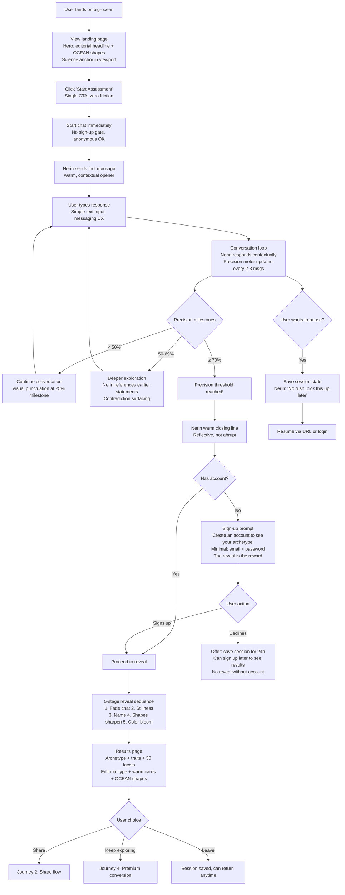
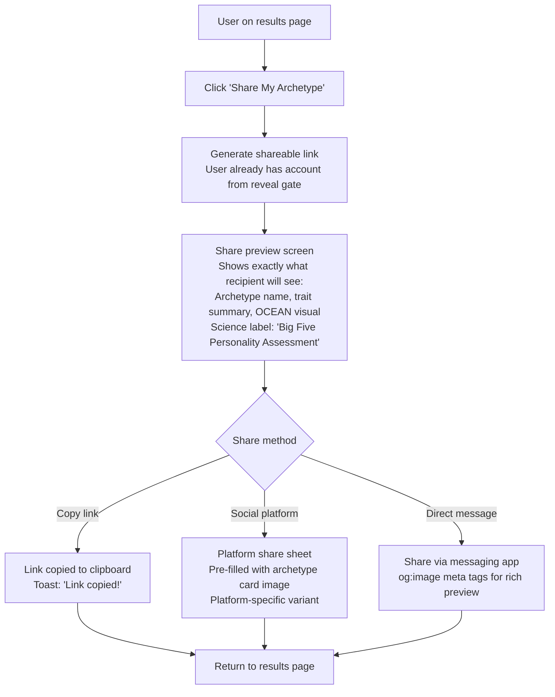
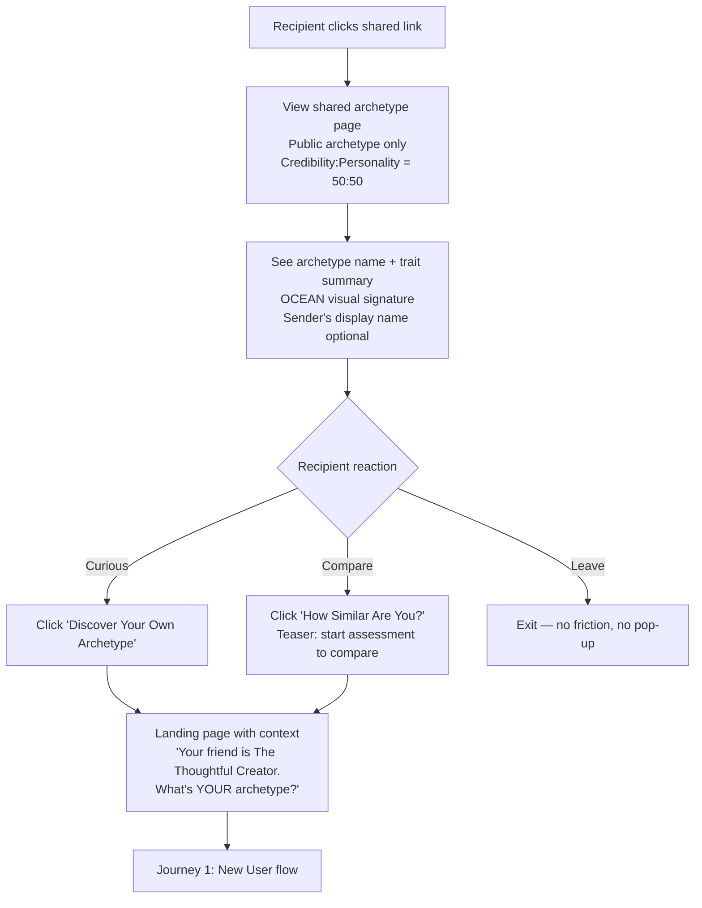
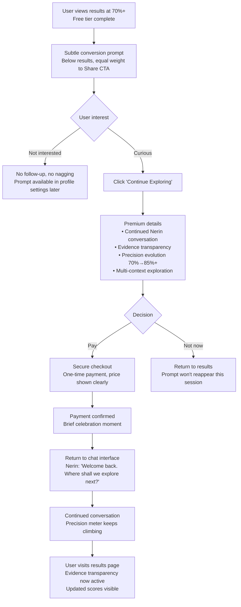
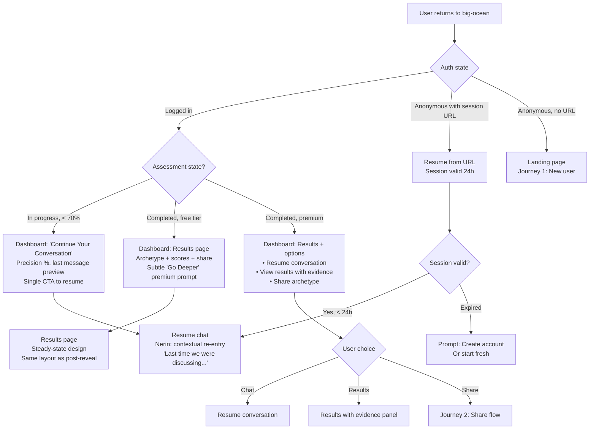

# UX Design Specification big-ocean

**Author:** Vincentlay
**Date:** 2026-02-12

---

<!-- UX design content assembled from previously completed workflow steps 2-8 -->

## Executive Summary

### Project Vision

**big-ocean** is a conversational Big Five personality assessment platform that replaces static questionnaires with dynamic, LLM-powered dialogues. Users engage with "Nerin" (Claude-based AI) for 30+ minute assessments that feel like authentic conversations, not robotic questionnaires.

The core differentiation: **Conversational depth** captures the complexity and nuance that predefined questionnaire boxes cannot. Rather than forcing users into binary choices, Nerin explores context, contradictions, and subtleties—resulting in personality profiles that feel genuinely personal and understood.

### Target Users

**Core Audience:** Anyone authenticity-seeking who is tired of oversimplified personality assessments
- Professionals frustrated by MBTI/16Personalities limitations
- Thoughtful individuals seeking genuine self-understanding
- People willing to invest 30 minutes for accuracy vs. 10-minute quick quizzes
- Primary: Age 25-45, digitally native, value authenticity and complexity
- Secondary: Naturally attracts professionals once established, but positioning is inclusive

**User Pain Point:** Existing personality tests oversimplify through predefined boxes. Users feel misunderstood or put into rigid categories that don't capture their actual complexity. big-ocean solves this through conversational exploration instead of forced categorization.

### Key Design Challenges

1. **Engagement vs. Length Risk:** 30-minute conversations risk 50% dropout. UX must make long sessions feel fast, rewarding, and valuable (progress feedback, dynamic pacing, micro-motivation).

2. **Privacy Model Complexity:** Three distinct tiers (private profile / public archetype / shareable link) create UI/UX design tension. Users must clearly understand what they're sharing before they share it.

3. **Data Complexity vs. UI Simplicity:** 30 facets + Big Five traits = complex data structure. UI must make this readable and intuitive without losing nuance or feeling overwhelming.

4. **Nerin Authenticity vs. Assessment Rigor:** Nerin must feel like a genuine conversation partner (not robotic) while systematically assessing all personality dimensions. The assessment machinery should be invisible.

5. **Trust & Privacy Signals:** Users sharing personality data = high-trust requirement. Beautiful design + clear privacy controls must work together to build confidence in data safety.

### Design Opportunities

1. **Progress as Motivation:** Visual progress indicator during assessment reduces "how much longer?" anxiety and increases completion rate beyond 50%.

2. **Archetype as Emotional Anchor:** Memorable archetype names + compelling visuals make profiles inherently shareable (vs. generic trait percentages that feel clinical).

3. **Privacy Clarity Through Design:** Obvious visual distinction between "My Private Profile" (detailed, personal) and "Share Archetype" (broad, public) builds user confidence in privacy model.

4. **Guided Sharing Experience:** Simple 3-step share flow: (1) preview what shareable link shows, (2) confirm before generating, (3) easy copy/send. Reassurance reduces sharing anxiety.

5. **Responsive Mobile-First Design:** Optimizing for phone-first use unlocks broader sharing behavior (easier to send links from mobile, fits 30-min session in commute/break time).

---

## Privacy Model Architecture

### Three Distinct Privacy Tiers

#### 1. Private Profile (User-Only, 100% Confidential)
- Full conversation history with Nerin
- Detailed personality justifications and stories collected by LLM
- All 30 Big Five facets with nuanced insights
- Personal notes and reflection points from assessment
- **Visibility:** User only — zero visibility beyond authenticated account
- **Sharing:** Not shareable, not exportable, not visible in any public form

#### 2. Public Archetype (Broad, Shareable)
- Archetype name (e.g., "The Thoughtful Creator")
- Big Five trait scores (simplified to 3-level: Low/Mid/High based on 0-20 scale)
- Facet summaries (no justifications, no detailed explanations)
- Visual archetype representation (icon/color)
- Brief archetype description (~2-3 sentences)
- **Visibility:** Only visible when user explicitly generates shareable link
- **Sharing:** Intended for sharing via unique link

#### 3. Shareable Link Profile (What Recipients See)
- Public archetype information only (name, traits, visuals, brief summary)
- No conversation details or personal stories
- No detailed facet justifications
- Broad personality snapshot, not deep dive
- Recipient sees archetype, not the user's personal data
- **Tracking:** Silent engagement tracking (link clicks, views) — not shown to user
- **Future Privacy Controls:** Phase 2 adds on/off toggle for granular visibility settings

### Privacy-First Principle

Users are **private by default, shareable by choice.** Any sharing requires explicit user action (generating a link). No automatic visibility, no discovery directory, no profile recommendations.

---

## Target User Segments & Positioning

### Primary Segment: Authenticity-Seekers
- **Who:** Professionals, students, thoughtful individuals frustrated by oversimplified personality tests
- **Pain:** MBTI/16Personalities feel reductive; tests don't capture their complexity
- **Motivation:** Genuine self-understanding, not entertainment or pop-culture categorization
- **Value Signal:** Willing to spend 30 minutes for accuracy; value conversational depth
- **Sharing Motivation:** Want to share because results feel personally accurate and meaningful

### Secondary Segment: Social Discovery (Post-MVP)
- **Who:** Professionals on LinkedIn, recruiters evaluating candidates, teams assessing dynamics
- **Pain:** Current personality assessments lack credibility for professional context
- **Motivation:** Want personality insights that feel real and science-backed
- **Value Signal:** Big Five credibility vs. MBTI; conversation-based methodology
- **Sharing Motivation:** Share to build professional profile; compare with colleagues

### Inclusive by Design
- Marketing and positioning is NOT "professional networking" but "authentic self-discovery"
- This naturally attracts professionals while remaining welcoming to all truth-seekers
- Broad positioning = larger addressable market + viral potential through diverse sharing networks

---

## Success Metrics & Engagement Goals

### Primary User Success Metrics

- **Completion Rate ≥ 50%:** Users sit through 30+ minute assessment without abandoning
- **Sharing Rate ≥ 15%:** Users proactively generate shareable profile link and share with others
- **User Sentiment ≥ 7/10:** Post-assessment survey on accuracy and relevance
- **NPS ≥ 40:** "Would you recommend big-ocean to friends?"

### UX Design Implications

These metrics shape critical UX decisions:
- **Progress feedback** during assessment keeps engagement high (addresses 50% completion goal)
- **Archetype visibility & visuals** during results make profiles memorable and shareable
- **Privacy clarity** builds trust needed for 15% sharing rate
- **Beautiful, intuitive UI** signals quality and authenticity, increasing NPS

---

## Core User Experience

### Defining Experience: Assessment as Continuous Evolution

The core big-ocean experience is fundamentally different from traditional personality assessment products: **Assessment is not completion, it is a beginning.**

**The Experience Model:**
1. **Initial Assessment (30 minutes):** Nerin has a conversational dialogue with the user, systematically exploring Big Five dimensions through context and nuance
2. **Precision Milestone (70%+):** Once precision reaches 70%+, the user's archetype is ready and valid for sharing
3. **Celebration & Choice:** System celebrates reaching 70%+ precision as an achievement, then offers two paths:
   - **Share Now:** Generate shareable archetype link immediately
   - **Keep Exploring:** Continue refining the profile in the same session
4. **Precision Evolution:** As users continue chatting with Nerin, precision increases. Results evolve. Archetype details sharpen.
5. **Return Engagement:** Users can return to continue conversations and watch their profile evolve over time

**Why This Model:**
- **Authenticity:** Conversational depth means understanding users better with more dialogue, not less
- **User Autonomy:** Users choose how deep to go — some want quick archetype (70%), others want 85%+ precision
- **Extended Engagement:** Longer total engagement amortizes LLM costs and improves precision
- **Stickiness & Virality:** Profile evolution creates return visits and ongoing sharing moments
- **Scientific Integrity:** Higher precision = better Big Five representation

### Platform Strategy

**Web-First, Mobile-Responsive**
- Primary platform: Web app via TanStack Start (React 19, full-stack SSR)
- Device support: Desktop, tablet, mobile
- Optimization: Mobile-responsive design for 30-min sessions on smartphones
- Touch-friendly inputs for long conversational sessions

**Real-Time Streaming**
- Nerin responses stream live (< 2 sec perceived latency) to maintain engagement
- User inputs submit instantly, conversation flows naturally
- Technical responsiveness is essential — delays kill 30-min engagement

**Session Persistence**
- User can pause assessment at any time and resume later
- Conversation state persists on server, accessible via session URL
- Precision snapshot at each session close point
- Device switching enabled via unique session URL (paste URL on new device to continue)
- **Phase 2 Enhancement:** ElectricSQL for automatic real-time sync + offline capability

### Effortless Interactions

**Starting Assessment**
- One click from landing page to first Nerin message
- Optional sign-up after first message (zero friction to start)
- User immediately feels the conversational quality

**During 30-Min Conversation**
- Message input feels natural (text field + send, like messaging app)
- Nerin responses appear instantly without loading spinners (streaming UI)
- Precision meter shows progress toward 70%+ threshold (passive feedback)
- No form fills, no questionnaire complexity — pure conversation

**Reaching 70%+ Precision**
- Celebration screen: "Your Personality Profile is Ready!"
- Archetype revealed with visual design flourish
- Precision score displayed prominently (e.g., "Precision: 73%")
- Clear distinction: archetype is VALID and shareable now, but also IMPROVABLE

**Choosing Next Action**
- Two prominent CTAs:
  1. **"Share My Archetype"** — Generate shareable link with one click
  2. **"Keep Exploring"** — Continue refining in same session (no friction)
- Either choice is equally valid; no pressure either way

**Sharing Profile**
- One-click generation of unique shareable link
- Preview what recipient will see (public archetype only)
- Copy link or share to social platforms directly
- No additional disclaimers or friction

**Continuation Chatting**
- Same conversational interface continues seamlessly
- Precision meter updates live as user chats further
- Milestones trigger gentle notifications: "Your profile is now 80% precise"
- User can exit and resume anytime

### Critical Success Moments

**Moment 1: First Nerin Message**
- User types first question/thought, Nerin responds with personalized, contextual message
- If Nerin feels robotic or generic, user abandons immediately
- If Nerin feels present and interested, user is hooked
- Success signal: User feels understood immediately

**Moment 2: The 15-Minute Mark**
- Halfway through 30-min assessment — abandonment risk point
- Nerin should acknowledge progress: "I'm getting a clearer picture of you..."
- Precision meter shows visible progress toward 70%
- Success signal: User feels encouraged to continue

**Moment 3: Reaching 70%+ Precision**
- Transition from "gathering information" to "revealing insights"
- Archetype reveal should feel surprising and meaningful
- Celebration tone (not clinical) acknowledges the user's investment
- Success signal: User feels their time investment was worthwhile

**Moment 4: The Share Decision**
- User sees public archetype and share option
- Must understand instantly: "This shares only the archetype, not my private details"
- Should feel safe and empowering, not risky
- Success signal: User generates and shares link, feels proud of their archetype

**Moment 5: Link Recipient Experience**
- Friend clicks shared link, sees public archetype (cool, not invasive)
- Recipient feels intrigued, not surveilled
- Recipient wants to take the assessment themselves
- Success signal: Viral loop activates

### Experience Principles

**1. Conversational Authenticity Over Questionnaire Rigor**
- Nerin must feel like a genuine conversation partner, never robotic
- Assessment machinery should be completely invisible to user
- Authenticity is the moat; all UX decisions serve this principle

**2. Precision as Achievement, Not Judgment**
- Reaching 70%+ is celebrated as an accomplishment ("Congratulations!")
- Precision is presented as evolving, not final
- Higher precision is an invitation to explore more, not a requirement
- Users control their engagement depth

**3. Privacy Transparency By Design**
- Private profile and shareable archetype are visually and functionally distinct
- "Your profile is private by default" visible in UI, not buried
- Sharing should feel empowering because users trust the privacy model
- Silent engagement tracking (no notifications to create sharing anxiety)

**4. Meaningful Insights Over Data Overload**
- Focus on archetype + Big Five summary, not all 30 facets
- Private profile contains depth; shareable profile shows essence
- Beautiful visuals + memorable archetype names beat complex data
- Every UI element earns its space

**5. Real-Time Responsiveness Over Perfection**
- Nerin responses must stream instantly (< 2 sec) to maintain flow
- User inputs submit immediately without lag
- Technical delays are death for 30-min engagement
- Responsiveness > optimization

**6. Continuous Improvement Over Completion**
- Assessment continues as long as user wants to explore
- Results evolve as precision improves
- Returning to refine profile feels natural and encouraged
- "Your profile at 78% precision" invites ongoing engagement

**7. Inclusive Authenticity Over Professional Gatekeeping**
- Design and language speak to anyone authenticity-seeking, not just professionals
- Warm, personal tone, not clinical or corporate
- "We all deserve to understand ourselves" community feeling

---

## Monetization & Display Transparency Model

### Philosophy: Generous Free Tier, Depth-Focused Premium

**Core Principle:** big-ocean offers a complete, valid personality profile for free. Premium unlocks the *journey* of deeper self-discovery, not access to withheld content.

**Why This Model:**
- Builds trust through generosity (free tier is genuinely valuable)
- Aligns with authenticity brand positioning (no manipulative paywalls)
- Self-selects serious users for premium (only those who want depth pay)
- Creates natural conversion through relationship with Nerin (not FOMO)

---

### Free Tier: Complete Snapshot (70% Precision)

**What Users Get (No Payment Required):**

- **Full Archetype Profile** — Archetype name, visual character, and description
- **All 30 Facet Scores** — Numeric scores visible for all facets
- **Big Five Trait Summary** — High/Mid/Low classification for all 5 traits
- **Shareable Link** — Generate unique public archetype link

**What's NOT Included:**
- Continued conversation with Nerin beyond 70%
- Evidence transparency ("show your work" feature)
- Precision evolution (70% → 85%+)
- Multi-context exploration (relationships, work, stress)

---

### Premium Tier: The Journey Continues (One-Time Payment - [PRICE TBD])

**What Users Unlock:**
- **Unlimited Continued Conversation** — Resume dialogue with Nerin anytime
- **Evidence Transparency ("Show Your Work")** — See which conversation messages influenced each facet score
- **Precision Evolution** — Continue refining from 70% → 85%+ precision
- **Multi-Context Exploration** — Explore how you show up in relationships, work, under stress

---

### In-Assessment Display Rules (Free & Paid)

**Principle:** Scores remain hidden during conversation to maintain assessment integrity and prevent user bias.

**During Conversation (All Users):**
- SHOW: Precision meter, precision updates every 2-3 messages, milestone notifications, Nerin's guidance
- HIDE: Individual facet scores, Big Five trait scores, archetype name or hints, score direction indicators

---

### Results Page Transparency (Free & Paid)

- **Always Visible:** Complete archetype profile, Big Five trait summary, precision percentage, facet descriptions
- **Paid-Only Features:** Evidence transparency panel, clickable facet scores with quotes, confidence-weighted highlights, bidirectional navigation

---

### Conversion Messaging Principles

- Celebrate completion: "Your personality profile is complete!"
- Show value of free tier: "Valid, shareable, scientifically-grounded"
- Create curiosity: "Want to understand the *why* behind your scores?"
- Clear one-time pricing; invitation tone
- NO FOMO language, urgency tactics, or pressure

---

### Post-Payment Experience

- Conversation resumes with same hidden-score pattern
- Results page with evidence transparency active
- Unlimited sessions with persistent state
- Precision evolution tracked over time

---

### Complete User Journey

**Free Tier Path:** Start → 30-min conversation → 70% precision → complete archetype reveal → share or continue → conversion prompt

**Paid Tier Path:** Pay → resume conversation → precision increases → updated results + evidence → repeat indefinitely

**Viral Loop:** User shares → recipient views → takes assessment → shares with their network

---

### Design Implications for Assessment Integrity

Scores remain hidden during conversation to prevent anchoring, performing, self-censoring, and optimizing. Show precision (completeness), not scores (trait values).

---

### Success Metrics for Monetization Model

- **Free-to-Paid Conversion Target:** ≥ 10%
- **Premium User Engagement:** Average precision increase 70% → 82%+
- **Free Tier Virality:** Sharing rate ≥ 15%
- **User Sentiment:** Free ≥ 7/10, Premium ≥ 8/10

---

## Desired Emotional Response

### Primary Emotional Goal: Self-Acceptance Through Clarity

The core emotional goal is **self-acceptance through clarity** — users want to see themselves accurately AND accept what they see.

1. **Clarity:** "I understand why I think and act this way"
2. **Acceptance:** "This is who I am, and that's okay"
3. **Permission:** "I'm ready to share this understanding with others"

**The Emotional Arc:** Exploration → Recognition → Acceptance → Sharing → Connection

### Emotional Journey Mapping

- **Phase 1: Discovery** — Skepticism mixed with curiosity
- **Phase 2: Assessment** — Exploration → engagement → momentum
- **Phase 3: Results Reveal** — Recognition → accomplishment → meaningful insight
- **Phase 4: Share Decision** — Pride + connection opportunity
- **Phase 5: Discovering Your Tribe** — Recognition + belonging + peer discovery
- **Phase 6: Return & Exploration** — Curiosity about growth

### Micro-Emotions & Deeper Truths

Key emotional tensions designed for: Confidence vs. Confusion, Trust vs. Skepticism, "Aha" Recognition vs. Confirmation, Understanding vs. Judgment, Peer Connection vs. Loneliness, Maturity vs. Incompleteness, Belonging vs. Judgment.

### Emotional Design Implications (From Deeper Understanding)

1. Design for "Aha" Moments (Not Just Data)
2. Show the "Why" (Science + Context + Guidance)
3. Nerin as Visible Coach (Not Hidden Algorithm)
4. Multi-Dimensional Self-Discovery (Context Matters)
5. Precision as Permission + Growth Milestone
6. Tribe as "People Who Get You" (Not Just Similar)
7. Privacy as Both Data Safety + Personality Acceptance

### Emotional Design Principles

1. Insight Over Information
2. Acceptance Over Judgment
3. Organic Discovery Over Platform Search
4. Permission Over Perfection
5. Transparent Science Over Mystique
6. Context Over Labels
7. Self-Discovery Journey Over Self-Definition

### Deeper Emotional Truths (From Socratic Exploration)

1. "Honestly Understood" is Actually Self-Acceptance
2. "Your Tribe Discovers You When You Share"
3. Privacy Fear Masks Personality Acceptance Fear
4. Precision is a Psychological Milestone, Not Just a Data Threshold
5. The Real Transformation is Insight, Not Assessment
6. Users Return Not to "Improve" But to "Explore Differently"
7. Support is Explanation + Acceptance + Guidance, Not Just Positivity

---

## Community Architecture

### Three Pillars: Personal Discovery + Peer Connection + Scientific Grounding

**Pillar 1: Personal Discovery Journey (MVP)**
- Conversational exploration with Nerin
- Safe, supportive, non-judgmental assessment

**Pillar 2: Your Tribe Discovers You (MVP + Phase 2)**
- Organic peer discovery through shared links (no searchable directory)
- Compare archetypes with people who shared with you (reciprocal only)

**Pillar 3: Scientific Credibility (Phase 2+)**
- Big Five research foundation
- Research repository and study participation

### Community Features by Phase

- **MVP:** Share & Compare — beautiful shareable archetype profile, no searchable directory
- **Phase 2:** Reciprocal Discovery — see who shared with you, research repository
- **Phase 3+:** Research partnerships, advanced analytics, optional curated groups

---

## UX Pattern Analysis & Inspiration

### Inspiring Products Analysis

1. **16Personalities** — Archetype virality + tribal identity (memorable codes, tribal belonging)
2. **Headspace** — Playful illustration + guided emotional journeys (character-driven warmth)
3. **Figma** — Bold color confidence + strategic use (saturated colors, gradient sophistication)

### Transferable UX Patterns

1. **Bold Archetype Identity** — Each archetype gets vibrant primary color, permeates experience
2. **Character-Driven Personality** — Playful illustrated characters, animation serves emotional moments
3. **Bold Visual Richness Over Clinical Minimalism** — Gradients, bold typography, personality-driven design

### Anti-Patterns to Avoid

- Reductive archetypes, sterile corporate aesthetic, neutral safe color palettes, gratuitous animation

### Design Inspiration Strategy

- **Visual Direction:** Bold Personality Over Conservative Minimalism
- Adopt: Memorable tribal identity, playful illustration, bold color
- Adapt: Headspace calm → big-ocean richness, Figma enterprise → bold consumer
- Avoid: Corporate sterility, cold minimalism, reductive archetypes

### Big-Ocean's Distinct Visual Identity

**Design Philosophy: Warm, Bold, Personality-First** — Bold colors, warm tone, celebratory, playful, scientific, alive.

### Shared-Link-Only Community Model: Privacy-First by Architecture

No platform directory. Organic sharing through unique URLs. Privacy fortress, authentic connection, controlled growth.

---

## Design System Foundation

### Design System Choice: shadcn/ui + Tailwind CSS v4

**Selected Approach:** Themeable System (shadcn/ui + Tailwind CSS v4)

### Rationale for Selection

1. Perfect Tech Stack Alignment (already using Tailwind CSS v4, React 19, TanStack Start)
2. Extreme Customization for Bold Identity (headless components, full control)
3. Speed to MVP (pre-built battle-tested components)
4. Supports Visual Goals (vibrant palettes, gradients, responsive, animation)
5. Long-Term Viability (active community, composable, scalable)

### Implementation Approach

- Phase 1: Theme & Color System (Tailwind theme, typography, spacing)
- Phase 2: Component Library (core shadcn/ui + custom components)
- Phase 3: Design Tokens (colors, spacing, typography, shadows, animations)

### Customization Strategy

- Archetype Color System (5 traits × bold color + accent)
- Custom Component Styling (Tailwind utility-first)
- Extending shadcn/ui (composition, variants)
- Brand Consistency (archetype colors, gradients, typography, animation)

### Accessibility & Performance

- ARIA labels and semantic HTML via shadcn/ui
- Responsive design, dark mode support
- Optimized bundle size, component-level code splitting

---

## Core Experience: The 30-Minute Conversation with Nerin

### Defining Experience: Conversational Assessment as Self-Discovery

**Core Interaction:** User sits down with Nerin for a 30-minute dialogue about their life, personality, experiences, and relationships. Through natural conversation, Nerin helps the user discover who they truly are.

**What Users Will Tell Friends:** *"I had this conversation with an AI and it actually understood me. It noticed things I didn't consciously know about myself."*

**Critical Success Criteria:**
- User feels genuinely understood
- Conversation feels natural
- Progress is tangibly visible
- Nerin reveals patterns
- Results feel shareable
- Emotional safety throughout

### User Mental Model

**What users expect:** "I'm taking a personality test"
**What they hope for:** "Someone actually understands me"
**What they fear:** Generic results, robotic responses, judgment, wasted time
**What makes them stay:** Visible progress, surprise moments, being heard, safety

### Experience Mechanics: Step-by-Step Flow

#### Phase 1: Invitation to Begin (Before Assessment)
- Warm, inviting intro; one-click to begin; Nerin's first message appears

#### Phase 2: First Contact (0-2 minutes) — THE CRITICAL MOMENT
- First Nerin message sets tone (warm, curious, NOT robotic)
- Simple text input like messaging app

#### Phase 3: Dialogue & Understanding Building (2-28 minutes)
- Contextual responses, not pre-written script
- Precision meter visible and updating (34% → 41% → 56% → 63% → 72%)
- Active contradiction exploration (the "aha" moments)
- Coaching tone throughout
- Key conversation moments at 5min, 15min, 22min, 28min

#### Phase 4: Results Reveal (28-30 minutes) — THE CELEBRATION
- Precision reaches 70%+ threshold — celebratory notification
- Archetype reveal with animated transition
- Private profile depth with conversation evidence
- Evidence-based transparency ("show your work")
- Precision transparency + two clear CTAs

#### Phase 5: Continuation (Optional)
- Same interface continues; Nerin shifts to contextual exploration
- Session flexibility with pause/resume

### Critical Design Principles for Nerin Conversation

1. Real Understanding Through Contradiction
2. Visible Progress as Engagement Driver
3. Coaching Tone, Not Diagnostic
4. Revelation, Not Just Confirmation
5. Emotional Safety
6. Depth Through Length
7. Precision as Meaningful Milestone
8. Shareable Results

---

## Visual Design Foundation

### Color System

**Design Philosophy:** Psychedelic, bold, saturated — a visual identity that feels alive, distinctive, and unmistakably "big-ocean."

#### Light Mode Palette

| Token | Name | Hex | Usage |
|-------|------|-----|-------|
| `--primary` | Electric Pink | `#FF0080` | Primary CTAs, brand accent, active states |
| `--primary-hover` | Neon Fuchsia | `#FF1493` | Hover/pressed states |
| `--secondary` | Vivid Orange | `#FF6B2B` | Secondary actions, highlights, warmth signals |
| `--tertiary` | Saturated Teal | `#00B4A6` | Info, progress bars, trust/science signals |
| `--background` | Warm Cream | `#FFF8F0` | Page backgrounds |
| `--surface` | Soft Blush | `#FFF0E8` | Cards, panels, elevated surfaces |
| `--surface-alt` | Light Peach | `#FFE8D8` | Alternate surface, hover backgrounds |
| `--foreground` | Deep Charcoal | `#1A1A2E` | Primary body text |
| `--muted` | Warm Gray | `#6B6580` | Secondary text, captions |
| `--border` | Blush Border | `#FFD6C4` | Card borders, dividers |
| `--success` | Ocean Green | `#00C896` | Success states, positive signals |
| `--warning` | Amber | `#FFB020` | Warning states |
| `--error` | Coral Red | `#FF3B5C` | Error states, destructive actions |

**Light Mode Gradients:**
- **Celebration gradient:** `linear-gradient(120deg, #FF0080, #FF1493, #FF6B2B)` — Pink → Fuchsia → Orange
- **Progress gradient:** `linear-gradient(90deg, #00B4A6, #00D4C8)` — Teal ramp
- **Surface glow:** `radial-gradient(circle, #FFF0E8, #FFF8F0)` — Subtle warm depth

#### Dark Mode Palette

| Token | Name | Hex | Usage |
|-------|------|-----|-------|
| `--primary` | Saturated Teal | `#00D4C8` | Primary CTAs, brand accent, active states |
| `--primary-hover` | Bright Teal | `#00EDE5` | Hover/pressed states |
| `--secondary` | Rich Gold | `#FFB830` | Highlights, premium signals, warmth |
| `--tertiary` | Hot Pink | `#FF2D9B` | Accents, secondary actions, energy |
| `--background` | Abyss Navy | `#0A0E27` | Page backgrounds |
| `--surface` | Deep Navy | `#141838` | Cards, panels, elevated surfaces |
| `--surface-alt` | Midnight | `#1C2148` | Alternate surface, hover backgrounds |
| `--foreground` | Warm White | `#F0EDE8` | Primary body text |
| `--muted` | Muted Lavender | `#8B85A0` | Secondary text, captions |
| `--border` | Navy Edge | `#252A52` | Card borders, dividers |
| `--success` | Mint | `#00E0A0` | Success states |
| `--warning` | Gold | `#FFB830` | Warning states |
| `--error` | Neon Coral | `#FF4D6A` | Error states |

**Dark Mode Gradients:**
- **Celebration gradient:** `linear-gradient(120deg, #00D4C8, #FFB830, #FF2D9B)` — Teal → Gold → Pink
- **Progress gradient:** `linear-gradient(90deg, #00D4C8, #00EDE5)` — Teal ramp
- **Surface glow:** `radial-gradient(circle, #1C2148, #0A0E27)` — Subtle depth

**Dark Mode Gold Principle:** Gold is punctuation, not surface. Teal carries dark mode as the primary accent. Gold appears exclusively at moments of achievement.

#### Dark Mode Personality Shift

Dark mode is not simply "inverted light mode" — it's the **deep-ocean version.** Light mode is the sunlit surface — warm, energetic, pink-and-orange psychedelic energy. Dark mode is the midnight zone — cool, mysterious, teal-and-gold bioluminescence.

#### Dual Color Modes by Intent

- **Celebration contexts:** Complementary vibrating pairs — Electric Pink on Teal, Orange on Navy
- **Reading contexts:** Analogous harmonious pairs — text on muted backgrounds, comfortable contrast

#### Archetype Trait Colors

| Trait | Shape | Primary | Accent | Gradient |
|-------|-------|---------|--------|----------|
| **O — Openness** | Circle | `#A855F7` Purple | `#FFB830` Gold | Purple → Gold |
| **C — Conscientiousness** | Half Circle | `#FF6B2B` Orange | `#00B4A6` Teal | Orange → Teal |
| **E — Extraversion** | Tall Slim Rectangle | `#FF0080` Electric Pink | `#FF6B2B` Orange | Pink → Orange |
| **A — Agreeableness** | Triangle | `#00B4A6` Teal | `#00E0A0` Mint | Teal → Mint |
| **N — Neuroticism** | Diamond | `#1c1c9c` Navy | `#00D4C8` Teal | Navy → Teal |

#### Color Saturation as Data Encoding

- **Low scores:** Desaturated, muted versions of the trait color
- **High scores:** Fully saturated, almost glowing
- **Confidence level:** Opacity encodes confidence

#### Accessibility Compliance

- All text/background combinations meet WCAG AA minimum
- Vibrating complementary pairs reserved for non-text celebration surfaces
- Interactive elements have distinct focus states (not color-only)
- Color is never the sole indicator of state

---

### OCEAN Geometric Identity System

**Design Philosophy:** The Big Five framework encoded into 5 geometric shapes — one per OCEAN trait.

#### Shape Definitions

| Letter | Trait | Shape | Rationale |
|--------|-------|-------|-----------|
| **O** | Openness | Circle | Wholeness, expansiveness |
| **C** | Conscientiousness | Half Circle | Structure, precision |
| **E** | Extraversion | Tall Slim Rectangle | Solid presence, energy |
| **A** | Agreeableness | Triangle | Harmony, balance |
| **N** | Neuroticism | Diamond | Pressure-formed, sensitivity |

#### Brand Mark Usage

**Logo:** "big-" in Space Grotesk bold, followed by 5 geometric shapes inline replacing "ocean."

#### Geometric Personality Signature

Each user's OCEAN code renders as their unique signature — Shape = Trait, Size = Level, Fill = Trait color.

#### Results Reveal Animation

5 shapes animate in sequence (O → C → E → A → N), ~200ms stagger, scaling to final size with color fill.

#### Decorative & Structural Use

Section dividers, loading states, background patterns, navigation markers, data visualization markers.

---

### Hero & Key Surfaces: Color Block Composition

Bold geometric color blocks with hard edges, asymmetric layout, OCEAN shapes as blocks, content overlaying blocks.

- **Light Mode Hero:** Electric Pink dominant, Teal secondary, Orange accent on Warm Cream
- **Dark Mode Hero:** Teal dominant, Navy secondary, Gold accent on Abyss Navy

---

### Typography System

| Role | Font Family | Weight Range | Rationale |
|------|-------------|-------------|-----------|
| **Headings / Display** | **Space Grotesk** | 500–700 | Geometric, modern, distinctive |
| **Body** | **DM Sans** | 400–600 | Clean, excellent readability |
| **Monospace** | **JetBrains Mono** | 400 | Data display, precision scores |

Type scale from `display-hero` (56-64px) through `caption` (12px).

---

### Data Visualization Style

Organic data forms — wave-inspired shapes, color saturation encoding, facet constellation maps, OCEAN shapes as chart markers. Character-as-data pattern for archetype characters.

---

### Illustration & Imagery System

**MVP Illustration Scope:** 1 character (The Diver), 3-4 SVG decorative elements, ocean icon set, OCEAN geometric shapes.

**Chat Interface Visual Calm:** Calmest expression of brand identity — minimal decoration, generous padding, psychedelic energy only in milestone toasts and results transition.

---

### Credibility Gradient Pattern

Pages transition from psychedelic/emotional at top to structured/scientific at depth: Hero → Overview → Detail → Evidence.

---

### Spacing & Layout Foundation

| Token | Value | Usage |
|-------|-------|-------|
| `space-1` | 4px | Tight spacing |
| `space-2` | 8px | Inline gaps |
| `space-4` | 16px | Standard padding |
| `space-6` | 24px | Section gaps |
| `space-8` | 32px | Section spacing |
| `space-12` | 48px | Major breaks |
| `space-16` | 64px | Page-level spacing |
| `space-24` | 96px | Hero sections |

Layout: Mobile-first, 12-column grid, max-width 1200px, generous breathing room, rounded everything.

| Element | Radius |
|---------|--------|
| Buttons | 12px |
| Cards | 16px |
| Modals | 24px |
| Hero containers | 32px |
| Chat bubbles | 16px (4px sender corner) |

---

### Accessibility Considerations

- WCAG AA color contrast for all text
- `prefers-reduced-motion` respected for all animations
- High-contrast focus rings on all interactive elements
- Minimum 44x44px touch targets
- All typography in rem units
- Decorative elements `aria-hidden`; meaningful content accessible
- Color never sole indicator of state

---

## Design Direction Decision

### Design Directions Explored

Seven distinct visual directions were generated and evaluated:
1. Psychedelic Poster — Maximum color block composition with OCEAN shapes as large background art
2. Ocean Depths — Dark-first bioluminescent aesthetic
3. Warm Conversational — Cream-forward, colors as accents only
4. Geometric Grid — OCEAN shapes defining page layout grid
5. Magazine Editorial — Typography-forward with dramatic display sizes
6. Split Register — Dual psychedelic/scientific register
7. Coral Reef — Organic fluid blobs and flowing gradients

Interactive showcase: `_bmad-output/planning-artifacts/ux-design-directions.html`

### Chosen Direction

**"Psychedelic Editorial"** — A hybrid combining elements from four directions, refined through SCAMPER creativity analysis:

- **Primary: Psychedelic Poster** — Floating OCEAN geometric shapes as bold background composition elements. Hard-edge color blocks for hero and celebration surfaces. Maximum brand impact through shape and color.
- **Typography: Magazine Editorial** — Large display typography (64-80px+) for hero moments and archetype reveals. Space Grotesk at dramatic scale. Confident, asymmetric text placement that lets typography carry personality.
- **Background Texture: Blurred OCEAN Shapes** — Instead of generic organic blobs, blur the actual trait shapes (circle, triangle, diamond, half-circle, rectangle) in the background for calm reading contexts. A blurred purple circle is still recognizably "Openness." Brand reinforcement even in the calm register — chat interface, evidence panels, facet detail pages.
- **Data Display: Warm Conversational Cards** — Rounded cards with trait-color gradient-fade top borders (not flat accent lines — color fades softly from the accent border into the card background). Soft shadows, generous padding, approachable warmth.

### Dark Mode: Bioluminescent Hue-Shift

Dark mode colors don't just desaturate — they **shift hue** to create authentic bioluminescent variants. Deep-sea creatures don't have the same colors as surface creatures.

| Trait | Light Mode | Dark Mode (Hue-Shifted) | Shift |
|-------|-----------|------------------------|-------|
| **O — Openness** | `#A855F7` Purple | `#7C3AED` Deep Violet | Purple → deeper violet |
| **C — Conscientiousness** | `#FF6B2B` Orange | `#D4940A` Dark Amber | Orange → warm amber |
| **E — Extraversion** | `#FF0080` Electric Pink | `#9B1B8C` Deep Magenta | Pink → magenta/violet |
| **A — Agreeableness** | `#00B4A6` Teal | `#0D9488` Deep Teal | Stays teal (already dark-friendly) |
| **N — Neuroticism** | `#1c1c9c` Navy | `#1E1B4B` Abyss Indigo | Navy → deeper indigo |

**Background shapes in dark mode:** OCEAN shapes at 15-25% opacity with subtle luminous edge glow (1px blur in the hue-shifted color). Bioluminescent organisms in the deep ocean.

**Floating shapes opacity:**
- Light mode: 20-40% opacity, full saturation
- Dark mode: 15-25% opacity, hue-shifted, soft glow edges

### Micro-Animated OCEAN Shapes (Experimental)

Floating OCEAN shapes drift with subtle sea-creature-like behavior:

| Shape | Movement Pattern | Inspiration | Speed |
|-------|-----------------|-------------|-------|
| **Circle (O)** | Slow pulsing drift, gentle size oscillation | Jellyfish pulse | 40-60s loop |
| **Half-Circle (C)** | Steady horizontal glide, slight wobble | Manta ray cruising | 30-45s loop |
| **Rectangle (E)** | Upward drift with lateral sway | Fish schooling movement | 25-35s loop |
| **Triangle (A)** | Gentle rotation + forward drift | Stingray gliding | 35-50s loop |
| **Diamond (N)** | Slow tumble with depth oscillation (scale) | Jellyfish tentacle drift | 45-60s loop |

**Implementation rules:**
- `prefers-reduced-motion`: All shapes freeze immediately (static fallback)
- GPU-accelerated CSS transforms only (`translate3d`, `scale`, `rotate`) — no layout thrash
- Maximum 3-5 shapes visible per viewport at any time (performance budget)
- Chat interface: Shapes move at 50% speed (calmer) vs hero sections at full speed
- **Prototyping gate:** Build one shape animation first, user-test for distraction before committing to all 5. If too much, fall back to static + subtle opacity pulse only.

### Archetype Reveal: Calm-to-Celebration Transformation

The archetype reveal isn't just an animation — **the entire page transforms** from calm register to full psychedelic mode:

**Sequence (2-3 seconds total):**
1. **Chat fades** — conversation dims to 30% opacity, slides up
2. **Background snaps** — blurred OCEAN shapes in background sharpen into focus, saturate to full color
3. **Color blocks emerge** — trait-color blocks slide/scale in from edges (hard-edge poster composition)
4. **Shapes animate** — 5 OCEAN shapes appear in sequence (O→C→E→A→N, ~200ms stagger), scaling to encode trait level
5. **Typography lands** — Archetype name fades in at `display-hero` size (64px+), editorial placement
6. **Hold** — Full psychedelic poster state holds, user sees their complete Geometric Personality Signature

**The metaphor:** Rising from the deep ocean (calm, dark, blurred) to the sunlit surface (vivid, sharp, celebratory). The assessment journey ends by breaking through to the light.

**`prefers-reduced-motion` fallback:** Instant cut from chat to final celebration state. No animation, same visual impact.

### Evolving Chat Background Tint (Experimental)

As Nerin maps the user's personality, the chat background subtly shifts toward their dominant trait color:

- **Messages 1-5:** Neutral warm cream / abyss navy (no tint)
- **Messages 6-15:** Very faint tint begins (5-8% opacity of emerging dominant trait color)
- **Messages 16-25:** Tint strengthens (10-15% opacity), user may notice subconsciously
- **70%+ precision:** Tint reaches 15-20% — the assessment has literally colored their world

**Implementation rules:**
- Tint is applied as a CSS background-blend or overlay — not changing actual background color token
- Must remain readable: maximum 20% overlay opacity, tested against WCAG AA contrast
- Transition between tint levels is gradual (2-3 second CSS transition)
- **Prototyping gate:** Test with 5 users first. If anyone reports it as distracting or nauseating, remove. The chat must remain the calmest surface.

### Design Rationale

1. **Brand Recognition:** Floating OCEAN shapes (even blurred) create unmistakable visual identity everywhere
2. **Premium Feel:** Editorial typography at dramatic scale makes archetype reveals feel earned
3. **Living Interface:** Micro-animated shapes make the platform feel alive — an underwater world, not a static page
4. **Reading Comfort:** Blurred trait shapes create gentle branded depth without competing with content
5. **Data Approachability:** Warm gradient-fade cards make 30 facets feel browsable, not clinical
6. **Dark Mode Authenticity:** Hue-shifted bioluminescent colors feel like a real deep-ocean environment, not a dimmer switch
7. **Reveal as Climax:** Calm-to-celebration page transformation makes the archetype moment genuinely dramatic

### Implementation Approach

**Surface Types and Their Visual Treatment:**

| Surface | Visual Treatment |
|---------|-----------------|
| **Hero / Landing** | Full psychedelic — large floating OCEAN shapes (micro-animated), color blocks, editorial typography at 64-80px |
| **Chat Interface** | Calm register — blurred OCEAN shapes at 5-10% opacity background, micro-animation at 50% speed, warm cream/navy base, warm card-style message bubbles, experimental trait tint overlay |
| **Results Reveal** | Calm-to-celebration transformation — background sharpens, color blocks emerge, OCEAN shapes animate to final signature, editorial archetype name |
| **Trait/Facet Cards** | Warm cards — rounded 16px, trait-color gradient-fade top border, soft shadow, generous padding |
| **Evidence Panels** | Scientific register — clean grid, blurred OCEAN shapes as subtle background, monospace data, minimal decoration |
| **Share Card** | Compact psychedelic — color block composition, editorial archetype name, geometric signature |
| **Milestone Toasts** | Brief psychedelic burst — single color block flash with trait shape, editorial text, fades to calm |

### Experimental Features (Prototype Before Committing)

| Feature | Gate Criteria | Fallback |
|---------|-------------|----------|
| Micro-animated shapes | Test 1 shape first; user-test for distraction | Static shapes with subtle opacity pulse |
| Evolving chat tint | Test with 5 users; check readability + distraction | No tint, neutral background throughout |

### Comparative Analysis Matrix

**Evaluation Criteria (Weighted):**

| # | Criterion | Weight | Rationale |
|---|-----------|--------|-----------|
| A | Brand Impact (uniqueness, memorability) | 25% | Must stand apart from generic personality tests |
| B | Readability & Usability | 20% | 30-min chat session demands comfortable reading |
| C | Dark Mode Quality | 15% | Critical for user comfort; many users prefer dark |
| D | Shareability (social card appeal) | 15% | Viral loop depends on share-worthy results |
| E | Emotional Resonance (self-discovery feel) | 15% | Core product promise — feeling "seen" |
| F | Dev Effort (inverse: 10=easy, 1=hard) | 10% | Lowest weight but real constraint |

**Scores (1-10 per criterion):**

| Direction | A (25%) | B (20%) | C (15%) | D (15%) | E (15%) | F (10%) | **Weighted** |
|-----------|---------|---------|---------|---------|---------|---------|-------------|
| 1. Psychedelic Poster | 9 | 5 | 4 | 8 | 7 | 5 | **6.60** |
| 2. Ocean Depths | 6 | 7 | 8 | 5 | 6 | 7 | **6.45** |
| 3. Warm Conversational | 4 | 9 | 6 | 5 | 8 | 8 | **6.45** |
| 4. Geometric Grid | 5 | 8 | 7 | 6 | 4 | 9 | **6.20** |
| 5. Magazine Editorial | 7 | 9 | 6 | 7 | 6 | 7 | **7.05** |
| 6. Split Register | 8 | 6 | 5 | 7 | 7 | 4 | **6.45** |
| 7. Coral Reef | 7 | 7 | 7 | 6 | 8 | 6 | **6.85** |
| **8. Psychedelic Editorial (Hybrid)** | **9** | **8** | **8** | **9** | **8** | **4** | **7.85** |

**Verdict:** Hybrid outscores all individual directions by 0.80-1.65 points. Only weakness is dev effort (4/10), mitigated by experimental gates and CSS-only fallbacks. Direction validated.

### User Persona Focus Group

Three personas tested against the Psychedelic Editorial direction at every touchpoint (landing, chat, reveal, dark mode, share).

**Personas:**
- **Sam (Anxious Overthinker):** 28, high neuroticism + conscientiousness. Needs emotional safety. Dark mode exclusive. Shares cautiously.
- **Alex (Skeptical Professional):** 34, moderate all traits. Values scientific credibility. Will share on LinkedIn only if it looks rigorous.
- **Jordan (Enthusiastic Sharer):** 22, high extraversion + openness. Aesthetics-driven. Shares immediately everywhere.

**Verdicts:** Sam 8/10, Alex 7/10, Jordan 9.5/10

**Cross-Persona Findings:**

| Insight | Sam | Alex | Jordan | Action |
|---------|-----|------|--------|--------|
| Chat animation must be subtle | Critical | Neutral | Wants more | Default 5-10% opacity, validate with user test |
| Breathing pause before reveal | Critical | Neutral | Doesn't care | Add 1-2s calm beat before transition |
| Reveal must not block interaction | Neutral | Critical | Neutral | Animation = visual layer, not interaction gate |
| Scientific credibility on share card | Nice-to-have | Critical | Doesn't care | Add "Big Five Personality Assessment" label |
| Credibility anchor near hero | Nice-to-have | Critical | Doesn't care | Add science line within first viewport |
| Evolving tint must be imperceptible | Critical | Neutral | Wants more | Ultra-gradual change, experimental gate applies |
| Share card customization | Neutral | Neutral | Wants badly | Post-MVP feature flag |

**4 Design Refinements Applied:**
1. **Breathing pause** — 1-2 second stillness between conversation end and reveal transition (respects emotional weight for Sam-type users)
2. **Non-blocking reveal** — Celebration animation runs as visual overlay; content remains interactive immediately (prevents impatience for Alex-type users)
3. **Science anchor in hero** — "Built on the Big Five framework" positioned within first viewport alongside editorial headline (credibility for skeptical users)
4. **Science label on share card** — Small "Big Five Personality Assessment" line on all share cards (enables professional sharing for Alex-type users)

### Party Mode: Team Design Review

Cross-functional review by UX (Sally), Architect (Winston), PM (John), Storyteller (Sophia), Developer (Amelia).

**Finding 1: Reveal Animation vs Results Page**

The reveal is a one-time transition animation that plays when results are first shown. Once the animation completes, the user sees the results page in its final steady-state form. Returning users land directly on this same results page — no animation replay, no separate "returning" layout. The results page design is identical whether the user just completed the reveal or is visiting a week later. The reveal animation is an entrance effect, not a mode.

**Finding 2: Credibility-to-Personality Ratio Per Surface**

Each surface has an explicit balance between bold visual personality and scientific credibility to prevent inconsistency:

| Surface | Personality | Credibility | Rationale |
|---------|------------|-------------|-----------|
| Landing / Hero | 80% | 20% | Hook first, science anchor in viewport but secondary |
| Chat Interface | 30% | 70% | Calm, functional, trust-building — warm cards but minimal decoration |
| Results Page | 60% | 40% | Archetype celebration + trait data coexist; editorial type bridges both |
| Evidence Panel | 10% | 90% | Scientific register — clean grid, monospace data, minimal decoration |
| Share Card | 50% | 50% | Must be visually distinctive AND professionally shareable |
| Milestone Toasts | 70% | 30% | Brief celebratory moments, trait shape flash |

**Finding 3: CSS Layer Architecture (Three-Tier)**

Feature tiers implemented as CSS layers, not JS conditional rendering:

| Tier | Layer | Contents | Activation |
|------|-------|----------|------------|
| 1 (must ship) | `base.css` | Editorial typography, warm cards, static OCEAN shapes, standard dark mode, share cards | Default — always active |
| 2 (validated) | `enhancement.css` | Micro-animations, bioluminescent hue-shift, staged reveal animation | `data-tier="2"` on `<html>` |
| 3 (post-MVP) | `experimental.css` | Evolving chat tint, share card customization | `data-tier="3"` on `<html>` |

Uses Tailwind v4 native `@layer` support. Each tier imports the previous. No JS branching for visual features — pure CSS progressive enhancement.

**Finding 4: Reveal Animation as Single Timeline**

The 5-stage reveal sequence (warm close → fade → stillness → name reveal → visual celebration) must be implemented as a single choreographed `@keyframes` animation timeline, not 5 independent transitions stitched together. Timing values stored as design tokens in Tailwind config to prevent hardcoded values in component files.

---

## User Journey Flows

### Journey 1: New User → First Assessment → Results

**Entry:** User lands on big-ocean landing page.

**Sign-Up Gate Strategy:** Users chat anonymously for the full 30 minutes. When precision reaches 70%+, the sign-up prompt appears BEFORE the reveal. The reveal is the reward for creating an account. This is the natural conversion moment — the user has invested 30 minutes and wants to see their archetype.

**Key design decisions:**
- **Zero friction to start** — Anonymous users chat immediately. No sign-up barrier at the beginning.
- **Sign-up at the reveal gate** — After 30 minutes of investment, users are highly motivated to create an account. The reveal animation is the reward.
- **No reveal without account** — This is the conversion lever. Users who decline can save their session for 24 hours and sign up later.
- **Visual punctuation** — At 25%, 50%, 70% milestones, a brief 0.5s shape opacity pulse resets visual habituation.
- **Pause is graceful** — Nerin acknowledges the pause warmly, not with "session timeout" UX.

**Error recovery:**
- Network drop during chat → Messages queued locally, sent on reconnect. Nerin: "Welcome back — I was just thinking about what you said."
- Browser close mid-session → Session persists server-side 24h for anonymous, indefinitely for accounts.
- Precision stalls (short/evasive answers) → Nerin gently steers: "I'd love to hear more about that. Can you walk me through a specific example?"

---

### Journey 2: Results → Share

**Entry:** User on results page after reveal.

**Key design decisions:**
- **No guest sharing** — Since sign-up happens at the reveal gate, all users who reach the share flow have accounts. Simplifies the flow.
- **Preview before share** — User sees exactly what recipients will see. No surprises. Privacy confidence.
- **Platform-specific cards** — og:image at 1200×630 (Facebook/LinkedIn), 1080×1080 (Instagram), 800×400 (Twitter). Compression-resistant: solid color blocks, 32px minimum archetype name.
- **Science label on every card** — "Big Five Personality Assessment" in small type.

---

### Journey 3: Share Recipient → Viral Conversion

**Entry:** Someone clicks a shared archetype link.

**Key design decisions:**
- **No data collection on view** — Recipient views the profile without cookies, tracking, or sign-up prompts. Trust first.
- **Two CTAs** — "Discover Your Own" (independent) and "How Similar Are You?" (comparison hook). Both lead to same assessment with different framing.
- **Contextual landing** — If referred from a shared link, the landing page acknowledges the friend's archetype.
- **No pop-ups on exit** — Clean exit. No desperate retention tactics.

---

### Journey 4: Free → Premium Conversion

**Entry:** User on results page after completing free assessment.

**Key design decisions:**
- **No nagging** — Conversion prompt appears once on the results page. If dismissed, doesn't reappear during session. Available later via settings.
- **One-time payment** — No subscription. Clear price. No hidden costs.
- **Seamless return to chat** — After payment, user is back with Nerin within one click.
- **Evidence unlocks silently** — When user visits results page, evidence panel is discoverable through clicking facet scores. No tutorial overlay.

---

### Journey 5: Returning User → Resume / Revisit

**Entry:** User returns to big-ocean after previous visit.

**Key design decisions:**
- **Contextual re-entry** — Nerin references the last conversation topic. Demonstrates the product remembers.
- **Dashboard is simple** — One primary action based on user state.
- **Results page is always the same** — No first-visit vs returning distinction. The reveal is a one-time entrance animation only.

---

### Journey Patterns (Cross-Journey)

**Navigation Patterns:**
- **Single primary CTA** — Every screen has one dominant action. Secondary actions exist but never compete visually.
- **Contextual back** — Returns to previous meaningful state, not previous URL.
- **Deep link friendly** — Every state (results, shared profile, chat) is URL-addressable.

**Decision Patterns:**
- **Equal-weight choices** — When two options are valid (Share / Keep Exploring), visual weight is equal. No manipulation.
- **Dismissible prompts** — Every prompt (premium, share) can be dismissed without consequence. No return-visit nagging.
- **Progressive disclosure** — Complex features (evidence panel, facet details) discoverable through interaction, not displayed upfront.

**Feedback Patterns:**
- **Visual punctuation** — Brief 0.5s animations at milestones (25%, 50%, 70%) to mark progress.
- **Toast notifications** — Non-blocking, bottom-of-screen, auto-dismiss 3s. Used for: link copied, session saved, precision milestone.
- **Nerin verbal milestones** — Conversational progress acknowledgment at key moments.

**Error Recovery Patterns:**
- **Graceful degradation** — Network drops don't lose data. Messages queue locally, sync on reconnect.
- **Warm error messages** — Nerin-voiced where possible: "Something went wrong on my end — let me try that again."
- **No dead ends** — Every error state has a clear recovery action.

### Flow Optimization Principles

1. **Minimum steps to value** — Landing → chat in 1 click. Chat → sign-up → reveal in ~30 min. Results → share in 2 clicks.
2. **Sign-up at peak motivation** — Account creation at the reveal gate, when user has maximum investment and desire to see results.
3. **State preservation everywhere** — Pausing, closing browser, switching devices — nothing loses progress.
4. **Celebration at every milestone** — 50% precision, 70% threshold, account creation, archetype reveal, first share, premium unlock.
5. **Exit without guilt** — Every exit point is clean. No "Are you sure?" dialogs. No abandoned-cart emails.

---

## Component Strategy

### Design System Components (shadcn/ui)

**Already installed:** Button, Card, Dialog, Sheet, Dropdown Menu

**To install for MVP:**

| Component | Install Command | Usage |
|-----------|----------------|-------|
| Toast | `pnpm dlx shadcn@latest add toast` | Milestone notifications (25%, 50%, 70%) with custom psychedelic burst content |
| Badge | `pnpm dlx shadcn@latest add badge` | Trait level indicators (H/M/L) on results page |
| Tabs | `pnpm dlx shadcn@latest add tabs` | Results page navigation: Overview / Facets / Evidence |
| Tooltip | `pnpm dlx shadcn@latest add tooltip` | Facet score hover details |
| Scroll Area | `pnpm dlx shadcn@latest add scroll-area` | Chat message container with custom scrollbar |
| Separator | `pnpm dlx shadcn@latest add separator` | Content section dividers |
| Progress | `pnpm dlx shadcn@latest add progress` | Precision meter — proper component for clean separation |

**Not needed for MVP:** Avatar (3 lines of Tailwind for initials circle), Accordion, Collapsible.

### Custom Components

After three rounds of refinement (First Principles reduction from 10 → 2, Architecture Decision Records, Mentor-Apprentice review), the custom component list is minimal:

**1. OceanShape**

- **Location:** `packages/ui/src/components/ocean-shape.tsx`
- **Purpose:** Renders one of 5 OCEAN geometric shapes as a decorative element.
- **Props:** `trait` (O/C/E/A/N), `variant` ("blurred" | "sharp" | "outline"), `size`, `opacity`, `className`
- **Rendering:** Hybrid approach (ADR-1). CSS `clip-path` for Circle, Rectangle, Diamond, Triangle. Inline SVG for Half-Circle (requires arc path). Shape geometry imported from shared constants.
- **Animation:** Not built in. Animation is applied externally via CSS classes on the wrapper (`animate-jellyfish`, `animate-float`, etc.). This maintains clean tier separation — deleting `enhancement.css` removes all animation without touching the component.
- **Accessibility:** `aria-hidden="true"` — purely decorative.
- **Dark mode:** Hue-shifted trait colors applied via CSS custom properties. Component is color-agnostic — reads from theme tokens.

**2. GeometricSignature**

- **Location:** `apps/front/src/components/results/GeometricSignature.tsx`
- **Purpose:** Arranges 5 OceanShapes in a per-archetype layout reflecting trait levels.
- **Props:** `traitLevels` (record of 5 H/M/L values), `variant` ("full" | "compact" | "icon"), `className`
- **Layout logic:** Delegates to `computeSignature()` pure function in `packages/domain`. Shape size = trait level (L=small, M=medium, H=large). Position follows fixed layout grid. **Deterministic** — same OCEAN code always produces same visual (243 possible outputs, 0 manual design work). Enables archetype brand recognition.
- **Reuse:** Results page header renders via React component. Share card generation renders same positions as SVG elements via `generateShareCardSVG`.

### Hooks

**useRevealAnimation**

- **Location:** `apps/front/src/hooks/useRevealAnimation.ts`
- **Purpose:** Orchestrates the 5-stage archetype reveal animation (ADR-3).
- **API:** Returns `{ stage, start, skip }`. Stage is one of: `idle`, `fade`, `still`, `name`, `shapes`, `bloom`, `complete`.
- **Implementation:** Lightweight JS orchestration via `setTimeout` chain (~30 lines). CSS does the visuals (transitions on elements responding to stage-based classes). JS is the conductor.
- **Stage timings:** `fade: 800ms`, `still: 1700ms`, `name: 1000ms`, `shapes: 1000ms`, `bloom: 1000ms` — stored as design tokens.
- **Skip support:** `skip()` jumps immediately to `complete` state. For Alex-type users who want to see data immediately.
- **Non-blocking:** Content is always rendered and interactive. Stages control CSS overlay classes only.
- **First-visit detection:** `revealedAt` timestamp set on results page mount (before animation starts), not on completion. Prevents refresh replay race condition.
- **Tier fallback:** Tier 1 — `start()` immediately sets `stage = 'complete'` (simple fade-in via CSS transition). Tier 2 — full staged sequence.

### Server Utilities

**generateShareCardSVG**

- **Location:** `apps/api/src/utils/share-card.ts`
- **Purpose:** Generates platform-optimized share card images (ADR-2).
- **Approach:** SVG template → PNG conversion via `sharp` or `resvg-js`. No headless browser.
- **Variants:** `og` (1200×630), `square` (1080×1080), `twitter` (800×400), `thumbnail` (300×160).
- **Content:** Archetype name (32px minimum), GeometricSignature shapes, trait-color solid background (compression-resistant — no gradients), "Big Five Personality Assessment" science label.
- **Shape rendering:** Imports from shared `ocean-shapes.ts` constants — same geometry as the React OceanShape component.

### Shared Domain Modules

Two new modules in `packages/domain` ensure single source of truth between frontend and backend:

**ocean-shapes.ts**

- **Location:** `packages/domain/src/constants/ocean-shapes.ts`
- **Purpose:** Pure shape geometry definitions — no React, no DOM.
- **Exports:** Clip-path polygon points, SVG path data (half-circle arc), trait-to-color mappings.
- **Consumers:** `OceanShape` React component (packages/ui) and `generateShareCardSVG` server utility (apps/api).

**geometric-signature.ts**

- **Location:** `packages/domain/src/utils/geometric-signature.ts`
- **Purpose:** `computeSignature(traitLevels) → ShapePosition[]` — pure function computing shape arrangement from trait levels.
- **Consumers:** `GeometricSignature` React component and `generateShareCardSVG` server utility.
- **Deterministic:** Same input → same output. 243 possible OCEAN codes → 243 unique arrangements.

### Components NOT Created (And Why)

These were proposed then eliminated through First Principles Analysis and Mentor-Apprentice review:

| Proposed | Replaced By | Rationale |
|----------|-------------|-----------|
| RevealTransition | `useRevealAnimation` hook | It's behavior (hook), not DOM (component) |
| ShareCard | `generateShareCardSVG` server utility | Never rendered in browser — server-side pipeline |
| SharePreview | Card + img + Button composition | Used once on share page, no reuse case |
| SharedArchetypePage | Route page composing Card, Badge, Button | It's a page, not a component |
| PremiumPrompt | Card with sessionStorage dismiss (inline) | Used once, behavior is trivial |
| MilestoneToast | shadcn Toast with custom content + CSS class | shadcn Toast handles positioning/stacking |
| PrecisionMeter | shadcn Progress with theme styling | Proper Progress component, themed to match |
| SignUpGate | Inline section of results page using existing `signup-form.tsx` | Used once, auth form is reused from existing component |

### Existing Components: Restyle, Don't Rewrite

**TherapistChat.tsx** — Needs CSS rework for Psychedelic Editorial visual register (warm card-style bubbles, OceanShape background at 5-10% opacity, milestone visual punctuation). No component restructure — implementation story, not component strategy.

**ProgressBar.tsx** — Replace with shadcn Progress component themed to Psychedelic Editorial. Clean separation between component logic and visual styling.

**TraitBar, ArchetypeCard, FacetBreakdown** — Existing results components. Restyle with editorial typography, warm card treatment, trait-color gradient-fade borders. Structure is sound.

### Component Implementation Strategy

**CSS Layer Architecture (from Party Mode: Team Design Review):**

| Tier | CSS Layer | Components Affected |
|------|-----------|-------------------|
| 1 (must ship) | `base.css` | All components — editorial type, warm cards, static OceanShapes |
| 2 (validated) | `enhancement.css` | OceanShape animations, RevealTransition stages, hue-shift dark mode |
| 3 (post-MVP) | `experimental.css` | Chat background tint, share card customization |

Activation via `data-tier` attribute on `<html>`. Tailwind v4 `@layer` support. Zero JS branching.

### Implementation Roadmap

**Tier 1 — Must Ship:**

| Priority | Item | Type | Dependency |
|----------|------|------|------------|
| P0 | `ocean-shapes.ts` | Shared constant | None — foundational |
| P0 | `geometric-signature.ts` | Shared utility | ocean-shapes.ts |
| P0 | OceanShape component | React component | ocean-shapes.ts |
| P0 | Install shadcn: Toast, Badge, Tabs, Tooltip, Scroll Area, Separator, Progress | shadcn/ui | None |
| P1 | GeometricSignature component | React component | OceanShape + geometric-signature.ts |
| P1 | `generateShareCardSVG` | Server utility | ocean-shapes.ts + geometric-signature.ts |
| P1 | Restyle TherapistChat | CSS rework | OceanShape (background) |
| P1 | Restyle results components (TraitBar, ArchetypeCard, FacetBreakdown) | CSS rework | Badge, Tabs |

**Tier 2 — Ship If Validated:**

| Priority | Item | Gate |
|----------|------|------|
| P2 | `useRevealAnimation` hook | Prototype single keyframe timeline |
| P2 | OceanShape animation classes (enhancement.css) | Test 1 shape for distraction |
| P2 | Hue-shift dark mode tokens | Real-screen contrast testing |

**Tier 3 — Post-MVP:**

| Priority | Item | Gate |
|----------|------|------|
| P3 | Evolving chat background tint | Test with 5 users |
| P3 | Share card customization UI | Post-launch user feedback |

---

## UX Consistency Patterns

### Button Hierarchy

| Level | Variant | Usage | Rule |
|-------|---------|-------|------|
| Primary | `default` (solid fill) | "Start Assessment", "Share My Archetype", "Sign Up" | One per screen. `lg` on landing/results, `default` in forms. |
| Secondary | `outline` (border only) | "Copy Link", "Back to Results", "Not Now" | Always paired with primary. Never alone. |
| Tertiary | `ghost` (text only) | "Skip", "Dismiss", "Later" | Dismissals and low-priority actions. Never destructive. |
| Destructive | `destructive` (red) | Account deletion (post-MVP only) | Always requires confirmation dialog. |
| Icon-only | `ghost` + `size: icon` | Theme toggle, hamburger, close | Always has `aria-label`. |

**Equal-Weight Pattern:** When two options are genuinely equal (Share / Keep Exploring), both use `default` variant at same size. Stacked vertically on mobile, side-by-side on desktop. No color manipulation to favor one. Each button gets `aria-description` explaining consequence for screen reader / voice control differentiation (e.g., "Share your archetype publicly via a link" vs "Continue chatting with Nerin to deepen your profile").

### Feedback Patterns

**Milestone Toast:**
- shadcn Toast with custom content: trait-colored OceanShape icon + editorial text
- Position: bottom-center. Duration: 3s auto-dismiss. Max 1 visible (new replaces previous).
- Copy: "You're 25% understood", "Halfway there — 50%", "Your archetype is ready — 70%+"
- Tier 1: static toast. Tier 2: psychedelic burst animation.

**Success Feedback:**
- Inline confirmation replacing the CTA button for 2 seconds (green checkmark + text), then reverts.
- No separate success page or modal. Keep user in flow.

**Error Feedback:**
- Nerin-voiced in chat context: "Something went wrong on my end — let me try that again."
- ErrorBanner for persistent errors. Toast for transient errors.
- Every error has a recovery action. No dead ends.
- Auto-retry: 3 attempts at 1s, 3s, 9s intervals (exponential backoff). New user message cancels active retry. After 3 failures: ErrorBanner with "Try again" button.

**Streaming Feedback (Nerin responses):**
- Tokens render as received from SSE stream. No artificial typing animation. Natural streaming cadence (~50-100ms per chunk) provides the typing feel.
- Typing indicator: 3 animated dots in a Nerin message bubble (warm card style) shown before first token arrives.
- Tier 2 polish: blinking cursor (`▍`) via CSS `::after` pseudo-element during streaming, removed on completion.
- Stream failure mid-message: "Let me rephrase that..." + automatic retry.

**Progress Feedback:**
- Precision meter (shadcn Progress): visible during chat, bottom of screen.
- Smooth CSS transition between values. Updates every 2-3 messages.

**Anticipatory Feedback:**
- **Pre-gate signal** — At 65% precision, Nerin verbally signals profile is almost ready ("I'm getting a really clear picture of you now"). Prepares user for sign-up gate at 70%.
- **Offline indicator** — Send button shows subtle wifi-off icon when connection lost, BEFORE user tries to send. Not a banner — button state change only.
- **Evidence preview** — Premium prompt includes blurred/teaser screenshot of the evidence panel. Shows what they'd unlock. Visual, not just text.

### Form Patterns

**Chat Input (core interaction):**
- Simple text field + send button (messaging app UX)
- Auto-focus on page load. Enter to send, Shift+Enter for newline.
- Max character indicator at 80% of limit (subtle).
- Disabled while Nerin is responding (prevents double-send).
- Placeholder: "Type your response..."

**Sign-Up Form (reveal gate):**
- Minimal: email + password only.
- Inline validation: email format on blur, password requirements on type.
- Password requirements below field: "12+ characters"
- Submit: "Create Account & See Your Archetype" (primary variant)
- Error: inline below field, red text, specific ("Email already registered" not "Invalid input").

**Form Principles:**
- Labels above fields (never floating/inline).
- Required by default. Optional fields marked "(optional)".
- Tab order follows visual order.
- Submit disabled until valid (no premature error display).

### Navigation Patterns

**Global Header:**
- Present on all pages except chat interface (chat is immersive — header distracts).
- Contents: Logo (left), theme toggle (right), user menu (right, if authenticated).
- Mobile: hamburger → Sheet slide-in. Sticky desktop, static mobile.

**Chat ↔ Results Bidirectional Navigation:**
- **From chat → results:** "View Results" link appears in chat header area after precision ≥ 70%. Client-side route transition (`/chat/$sessionId` → `/results/$sessionId`), 300ms fade. Results data prefetched at 60% precision via TanStack Query.
- **From results → chat:** "Continue Chatting" button on results page. Chat scroll position preserved via React state.
- **From profile/dashboard → results:** Link to view results on the dashboard/profile page. Primary entry point for returning users.

**Results Page Tabs:**
- Three tabs: Overview / Facets / Evidence.
- Evidence tab: visible but locked for free users (lock icon + "Premium" Badge).
- URL-synced: `/results/$sessionId?tab=facets` — deep-linkable.
- Mobile: horizontal scroll tabs.

**Back Navigation:**
- Returns to previous meaningful state, not browser history.
- Context preserved through React state.

**Deep Links:**
- Every meaningful state is URL-addressable: `/chat/$sessionId`, `/results/$sessionId`, `/share/$linkId`.
- Bookmarkable. Shareable. Refreshable without state loss.

### Loading & Streaming States

**Page Load:**
- Skeleton screen matching final layout (Card shapes, text line placeholders).
- OceanShapes in background at reduced opacity during load (instant visual identity).
- No blank screen. Skeleton within 100ms.
- No spinners anywhere in the product. Skeletons only. Exception: precision meter uses smooth CSS transition.

**Chat Message Loading:**
- Nerin: typing indicator (3 dots in warm card bubble) → streaming tokens → complete message.
- User: message appears immediately (optimistic rendering) with send indicator.
- Failed send: message shows "retry" icon, tap to resend.

**Offline Message Queue:**
- Queue limit: 1 message. New message replaces previous queued message.
- When reconnected: last queued message sent automatically.
- Previous unsent messages show "not sent" indicator with manual resend option.

### Empty & Error States

**Empty States:**
- Pre-assessment: Landing page hero (not empty dashboard).
- No evidence (free tier): Card with lock icon + "Unlock with premium" — not blank panel.
- Chat start: Nerin's first message appears immediately. User never sees empty chat.

**Error States:**
- **Offline:** Banner at top of chat — "You're offline. Messages will send when you reconnect." Input remains active.
- **Session expired (anonymous, >24h):** "Your session has expired. Create an account to save progress, or start fresh." Buttons: Sign Up / Start Fresh.
- **Server error:** Nerin-voiced: "I'm having trouble right now. Give me a moment..." Auto-retry 3x. After 3 failures: ErrorBanner with "Try again."
- **Rate limited:** "You've already started an assessment today. Come back tomorrow or continue your existing conversation." Resume button for active session.
- **Budget paused:** "We've reached our daily limit. Your session is saved — come back after [time]."
- **Error principles:** Warm, not clinical. Always a recovery action. Never blame user. Never show technical details.

### Modal & Overlay Patterns

**Dialog:** Used sparingly (share preview, deletion confirmation). Always dismissible via X, backdrop click, Escape. Mobile: full-screen Sheet instead of centered Dialog.

**Sheet:** Mobile navigation (hamburger), facet detail panel. Clear close mechanism.

**Toast:** Bottom-center. Max 1 visible. 3s auto-dismiss. Never for critical errors.

**Rule:** No confirmation dialogs for non-destructive actions. Undo > confirm.

### Design System Integration

| Pattern | shadcn Component | Customization |
|---------|-----------------|---------------|
| Primary CTA | Button `default` | Trait-color tint on results page |
| Toast | Toast | Custom content with OceanShape icon |
| Form fields | Input (to install) | Labels above, inline validation |
| Results tabs | Tabs | URL-synced, lock icon on Evidence |
| Skeletons | DIVs + `animate-pulse` | Match warm card shapes |
| Modals | Dialog (desktop) / Sheet (mobile) | Adaptive by viewport |
| Progress | Progress | Precision meter with theme |

---

## Responsive Design & Accessibility

### Responsive Strategy

**Design Approach: Mobile-First, Chat-Centric**

big-ocean's core experience is a 30-minute conversation — a fundamentally mobile-friendly interaction pattern (messaging). The responsive strategy prioritizes the chat interface on small screens and progressively enhances with richer layouts on larger viewports.

**Mobile (< 640px) — Primary Target**
- Single-column layout throughout. Full-width cards, no side panels.
- Chat interface: bottom-anchored input within thumb reach zone. Messages fill viewport width with 16px horizontal padding.
- Results page: traits stack vertically. Facet breakdowns expand inline (accordion pattern). Evidence panel slides up as a Sheet (bottom drawer).
- Navigation: hamburger icon → Sheet slide-in with nav links. Header is static (not sticky) to maximize chat viewport.
- GeometricSignature: renders at reduced scale (120x120px) centered above archetype name.
- OceanShapes decorative usage: reduced to 1-2 background shapes (vs 3-4 on desktop) to avoid visual clutter.
- Sign-up gate: full-screen overlay with centered form. No side art.

**Tablet (640px–1024px) — Enhanced Layout**
- Two-column layouts where appropriate: results traits list + facet detail side panel.
- Chat interface: same as mobile (single-column messaging works well at this width). Wider message bubbles (max 80% width).
- Evidence panel: persistent side panel (right) when viewing facet details, instead of Sheet overlay.
- Navigation: still hamburger on smaller tablets (< 768px); horizontal nav on larger tablets (768px+).
- GeometricSignature: medium scale (160x160px).
- Decorative OceanShapes: 2-3 background elements.

**Desktop (> 1024px) — Full Experience**
- Multi-column layouts with persistent sidebars. Max content width 1200px, centered.
- Chat interface: centered column (max 720px) with generous side margins. Precision meter visible in left margin.
- Results page: trait list + facet breakdown + evidence panel visible simultaneously (three-column at widest viewports > 1440px, two-column otherwise).
- Navigation: full horizontal header with Logo, nav links, theme toggle, user avatar/auth controls.
- GeometricSignature: full scale (200x200px) with breathing room.
- Decorative OceanShapes: full set (3-4 floating background shapes with animation).
- Reveal animation: full cinematic experience with all 5 stages. Reduced to 3 stages (fade → name → color) on mobile for performance.

### Breakpoint Strategy

**Tailwind v4 Standard Breakpoints (mobile-first):**

| Token | Min-Width | Target |
|-------|-----------|--------|
| `sm` | 640px | Large phones, small tablets |
| `md` | 768px | Tablets portrait |
| `lg` | 1024px | Tablets landscape, small laptops |
| `xl` | 1280px | Standard desktops |
| `2xl` | 1536px | Large desktops |

**Rationale:** Standard Tailwind breakpoints. No custom breakpoints needed — big-ocean's layouts are simple enough (chat, results, home) that standard breaks cover all transitions cleanly.

**Critical Breakpoint Behaviors:**

| Surface | < 640px | 640–1024px | > 1024px |
|---------|---------|------------|----------|
| Chat input | Full-width, bottom-fixed | Full-width, bottom-fixed | Centered column (720px max) |
| Precision meter | Inline below header (compact) | Inline below header | Left sidebar float |
| Results traits | Single column, accordion | Two-column (traits + facets) | Two/three-column |
| Evidence panel | Sheet (bottom drawer) | Side panel (right) | Persistent side panel |
| Header | Logo + hamburger | Logo + hamburger / inline nav | Full horizontal nav |
| Share card preview | Full-width | Centered (400px max) | Centered (400px max) |
| Home hero | Stacked, text-first | Side-by-side at `md` | Full color block composition |
| OceanShape decorative | 1-2 shapes, no animation | 2-3 shapes, subtle float | 3-4 shapes, full animation |
| Reveal animation | 3-stage (fade, name, color) | Full 5-stage | Full 5-stage |

**Container Strategy:**
- Content max-width: `max-w-7xl` (1280px) for page layouts
- Chat column max-width: `max-w-3xl` (720px) centered
- Card max-width: `max-w-md` (448px) for share card preview
- Horizontal padding: `px-4` (16px) on mobile, `px-6` (24px) on tablet, `px-8` (32px) on desktop

### Accessibility Strategy

**Compliance Level: WCAG 2.1 AA**

AA is the industry standard and appropriate for big-ocean's Phase 1 launch. AAA is not targeted but several AAA criteria are met naturally (font scaling, focus indicators, motion respect).

**Color & Contrast:**
- All body text: minimum 4.5:1 contrast ratio against background
- Large text (>= 18px bold or >= 24px regular): minimum 3:1
- UI components and graphical objects: minimum 3:1
- Vibrating complementary color pairs (celebration surfaces) restricted to non-text decorative use only
- Dark mode palette validated independently for AA compliance
- Trait colors validated for sufficient contrast against both light and dark backgrounds

**Keyboard Navigation:**
- All interactive elements reachable via Tab / Shift+Tab
- Focus order follows visual reading order (top-to-bottom, left-to-right)
- Focus ring: 2px solid, high-contrast, offset — never hidden
- Skip-to-content link as first focusable element on every page
- Chat input: Enter sends message, Shift+Enter for newline
- Results tabs: Arrow keys navigate between tabs, Tab moves into tab content
- Evidence panel: Escape closes panel, focus returns to triggering facet score
- Modals: focus trapped inside, Escape dismisses, focus returns to trigger

**Screen Reader Support:**
- Semantic HTML throughout: `<main>`, `<nav>`, `<article>`, `<section>` with appropriate headings
- Live regions (`aria-live="polite"`) for:
  - New chat messages from Nerin
  - Precision meter updates (announced at 10% intervals, not every update)
  - Toast notifications (milestone celebrations)
- Decorative elements (`aria-hidden="true"`):
  - Background OceanShapes
  - Floating shape animations
  - Color block compositions
  - Reveal animation visual effects
- Meaningful alternatives:
  - GeometricSignature: alt text describes trait levels (e.g., "Personality signature: Openness High, Conscientiousness High, Extraversion Medium, Agreeableness High, Neuroticism Medium")
  - TraitBar: value announced as "Openness: 78 out of 100"
  - Archetype card: name + summary read as heading + paragraph
- Form inputs: associated `<label>` elements, error messages linked via `aria-describedby`

**Motion & Animation:**
- All animations respect `prefers-reduced-motion: reduce`:
  - OceanShape floating → static position
  - Reveal animation 5-stage → instant display (no fade, no stagger)
  - Celebration animations → simple opacity fade
  - Background shape drift → static
  - Page transitions → instant
- No auto-playing video or audio
- No content that flashes more than 3 times per second

**Touch & Pointer:**
- Minimum touch target: 44x44px for all interactive elements
- Adequate spacing between touch targets (minimum 8px gap)
- Chat send button: 48x48px (oversized for thumb accuracy)
- No hover-only interactions — all hover states have tap/focus equivalents
- Pinch-to-zoom not disabled (`user-scalable=yes`)

**Text & Readability:**
- All typography in `rem` units — respects browser font-size settings
- Content reflows without horizontal scrolling up to 400% zoom
- Line height minimum 1.5 for body text
- Paragraph max-width ~65-75 characters for readability
- No text in images (share card SVG includes text as SVG `<text>` elements, not rasterized)

### Testing Strategy

**Automated (CI/CD):**
- `axe-core` integration via `@axe-core/react` in development mode — flags violations in console
- Storybook accessibility addon for component-level testing
- Lighthouse CI accessibility audit on PR builds (target: score >= 90)

**Manual Checklist (Per Feature):**
- Keyboard-only navigation walkthrough (Tab through entire flow)
- VoiceOver (macOS/iOS) screen reader pass on chat and results flows
- Color contrast spot-check with browser DevTools
- `prefers-reduced-motion` toggled ON — verify all animations degrade
- Zoom to 200% — verify no content loss or horizontal scroll

**Device Testing Matrix (MVP):**

| Device | Browser | Priority |
|--------|---------|----------|
| iPhone 14/15 | Safari | P0 — primary mobile target |
| Android (Pixel 7+) | Chrome | P0 — primary mobile target |
| iPad | Safari | P1 — tablet reference |
| MacBook | Chrome, Safari | P0 — desktop reference |
| Windows laptop | Chrome, Edge | P1 — secondary desktop |

**Accessibility Testing Cadence:**
- P0: Every feature PR runs axe-core + Lighthouse
- P1: Monthly manual VoiceOver walkthrough of core flows (chat, results, share)
- P2: Quarterly color blindness simulation pass (protanopia, deuteranopia, tritanopia)

### Implementation Guidelines

**Responsive Development:**
- Mobile-first media queries exclusively (`min-width` only, never `max-width`)
- Use Tailwind responsive prefixes: bare = mobile, `sm:` = 640px+, `md:` = 768px+, `lg:` = 1024px+
- Relative units: `rem` for typography and spacing, `%` and `vw` for layout widths
- Images: `<Image>` with `sizes` attribute for responsive loading, WebP format with fallback
- Container queries (`@container`) considered for component-level responsiveness (results cards adapting to sidebar vs full-width context) — Tailwind v4 supports this natively

**Accessibility Development:**
- Semantic HTML first — `<button>` for actions, `<a>` for navigation, `<input>` for forms. No `
`.
- ARIA only when semantic HTML is insufficient (live regions, complex widgets)
- Focus management: `useEffect` to move focus on route change to `<main>` or page heading
- Skip link: `<a href="#main-content" class="sr-only focus:not-sr-only">Skip to content</a>` on every page
- Error announcements: form validation errors linked via `aria-describedby`, announced on submit
- Color-independent status: trait levels use color + shape (OceanShape geometry) + text label (Low/Mid/High)

**CSS Tier Integration (from Step 9):**
- Tier 1 (`base.css`): All responsive layouts, all accessibility features, reduced-motion fallbacks
- Tier 2 (`enhancement.css`): Decorative animations, floating shapes, reveal animation stages
- Tier 3 (`experimental.css`): Advanced interactions (parallax, 3D transforms) — not in MVP scope

**Testing Integration:**
- `data-testid` attributes on key interactive elements for automated testing
- `aria-label` doubles as both accessibility label and test selector where appropriate
- Storybook stories include responsive viewport presets (mobile 375px, tablet 768px, desktop 1280px)

---
