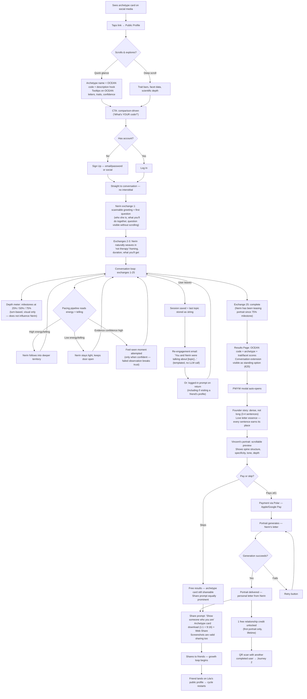
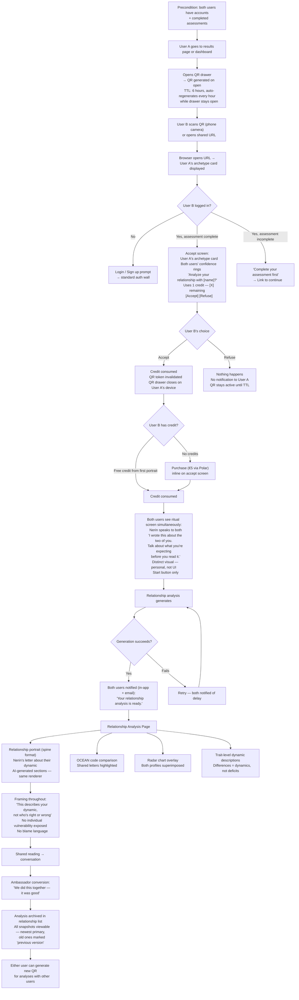
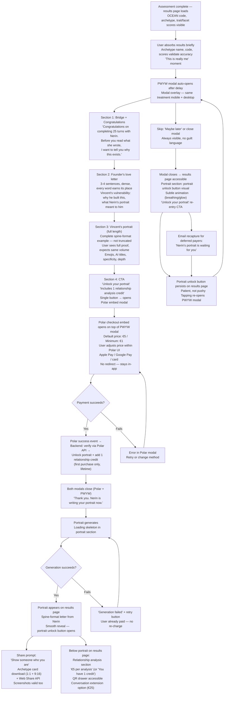
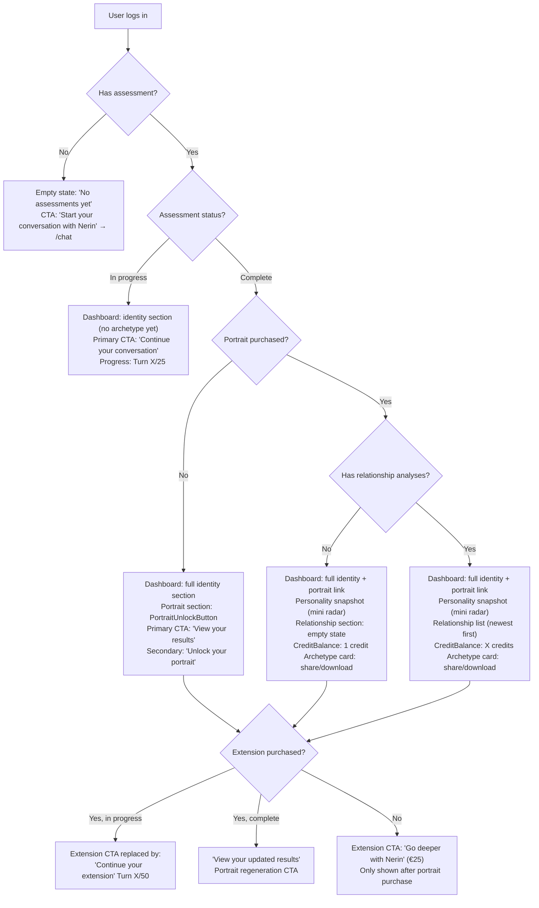
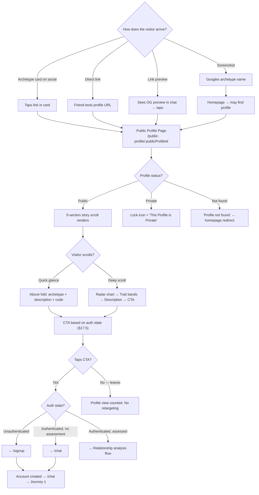

# UX Design Specification big-ocean

**Author:** Vincentlay
**Date:** 2026-03-16 (updated 2026-03-18, page specs expanded 2026-03-18)

---

## Executive Summary

### Project Vision

Big-ocean transforms personality assessment from a static questionnaire into a guided 25-turn conversation with Nerin, an AI personality specialist. Built on the Big Five (OCEAN) framework, it extracts personality evidence through natural dialogue, scores 30 facets, and maps results to memorable archetypes via a 5-letter OCEAN code. The platform combines scientific rigor with consumer-grade shareability — turning self-discovery into a social experience.

The product sits at the intersection of conversational AI and personality science, differentiated by guided UX, structured insights, and social outputs that no existing personality test or general-purpose chatbot provides.

### Assessment Invisibility Principle

The user should forget they are being assessed. Nerin operates as a perceptive conversational partner — reflecting observations about what the user has said, drawing them deeper into authentic self-reflection. No partial results, no scoring indicators, no mid-conversation reveals of the assessment layer. The trust loop is: user opens up → Nerin reflects something perceptive → user opens up more. Anything that surfaces the "we are evaluating you" subtext breaks this loop and undermines the coherence-based methodology.

Nerin's observations are conversational, not diagnostic: "I notice you describe your work relationships very differently from your friendships" — never "You seem high in agreeableness." The distinction between perceptive partner and clinical assessor is fundamental to the entire UX.

### Target Users

**Primary (Phase 1): Self-Understanding Seekers (25-40)**
Adults curious about personality and self-knowledge. They've likely taken personality tests before (16Personalities, MBTI) but found them superficial. They want something that feels more personal, nuanced, and trustworthy. They're mobile-first, social-media-literate, and accustomed to polished consumer experiences. For sophisticated users (coaches, psychology-adjacent professionals), the longer conversation format is a credibility signal — it separates big-ocean from shallow quiz apps.

**Viral Growth Lever: Relationship Explorers**
Users who arrive via a shared personality card or public profile link, not the landing page. Their entry point is someone else's archetype — the viral funnel starts at the public profile (or homepage if private), not through direct marketing. The public profile must convert curiosity into commitment before they ever see the conversation. Relationship comparison itself is powered by QR-based connection between two completed users.

**Tertiary: Self-Improvement Enthusiasts**
Users seeking actionable insights from their personality profile — how their traits affect work, relationships, and decision-making. They want evidence-linked narrative, not just scores. Deeper engagement layer for retention.

### Conversation Length Philosophy

The assessment is currently a 25-turn conversation lasting 30-45 minutes depending on engagement depth. Reducing to 20 turns (20-30 minutes) is under consideration as a trade-off between assessment quality and drop-off risk, but not decided — below 20 turns would degrade assessment quality and the richness of evidence available for archetype generation.

The length is a deliberate differentiator and audience filter — "how can you know someone in 10 minutes?" This will exclude casual users who want quick results. That is by design. The length self-selects for users who genuinely want a meaningful self-understanding experience, and those users are the ones most likely to complete, value their results, share authentically, and convert their relationships into new users. Optimizing for breadth of adoption at the cost of depth of experience would destroy what makes big-ocean different.

### Key Design Challenges

1. **The 30-45 minute commitment — earned, not endured** — The UX should frame this as a meaningful conversation, not a task to complete. The length is a credibility signal for the right audience — lean into it rather than apologize for it. Momentum comes from conversational quality, the depth engagement system, and Nerin's responsiveness as a perceptive partner.

2. **Conversational trust through Nerin's observations** — The UI environment, pacing, and visual treatment must frame Nerin as a compelling conversation partner worth opening up to. Surface-level responses produce poor assessments — the UX should encourage depth without feeling demanding. Nerin's mid-conversation observations ("I notice that when you talk about creativity, your energy shifts") are the primary trust-building and retention mechanism. These are conversational reflections, never assessment reveals.

3. **Results that demand sharing** — The archetype reveal is the critical conversion moment from user to evangelist. It must feel like a personal discovery, not a generic report. Results should reference specific conversation moments as evidence — showing the "how" behind scores, not just the scores themselves.

4. **Mobile-first conversation ergonomics with session persistence** — 30-45 minutes of mobile interaction requires careful attention to input fatigue, response sizing, and visual breathing room. Save-and-resume is essential — users will be interrupted. Auth-gating before the conversation starts ensures email is collected, enabling automated recapture.

5. **Recapture flow for interrupted sessions** — Auth-gate the conversation so email is collected before the first turn. If a user pauses mid-conversation, automated email reminders bring them back ("You and Nerin were in the middle of something — pick up where you left off"). This converts the save-and-resume problem from "lost user" to "delayed user with a nudge."

6. **The public profile as acquisition surface** — Relationship explorers arrive at public profile pages via shared archetype cards, not the homepage. The framing line ("[Name] dove deep with Nerin — here's what surfaced"), archetype description, and comparison-driven CTA ("What's YOUR code?") must convert the viewer into a new user. If the sharer's profile is private, the link shows "This user has made their profile private" and redirects to the homepage.

7. **Assessment integrity vs. ambient feedback** — The visual environment and progress signals must never telegraph personality dimensions or trait directions. If users can infer where the assessment is heading, they can game their responses, undermining the coherence-based methodology. All real-time feedback reflects conversational energy and engagement depth, never personality scoring.

8. **Day 2+ retention beyond the initial assessment** — The core assessment is a one-time experience. Initial monetization lever is a one-time €25 conversation extension (25 additional turns with Nerin for deeper exploration). Email/notification reminders nudge users to come back and purchase another extension over time. The UX should be designed with extension and return hooks in mind even if not all are in MVP. Without a compelling return loop, the product risks the same retention cliff that plagues every personality assessment platform.

### Design Opportunities

1. **Relationship comparison as viral engine** — QR scan → compare → share flows turn every completed assessment into a potential acquisition channel. The shared results page is the primary viral surface — not a generic "share" button but a dedicated conversion experience with teaser content that creates FOMO around the comparison.

2. **Immersive conversational interface** — Explore a departure from standard chat-bubble UI toward a full-screen, ambient experience where the conversation feels like entering a space, not opening a messaging app. The ocean/geometric visualization lives around and behind the text, creating an intimate environment distinct from any chatbot interaction. No timestamps, no avatar bubbles — each exchange is its own moment. (Design direction to evaluate, not a commitment.)

3. **Energy-responsive ambient visualization** — The ocean/geometric system responds to conversational energy and depth (emotional texture, engagement intensity, conversational momentum) — NOT to personality dimensions. This preserves assessment integrity while creating a living, responsive environment that rewards deeper engagement visually without revealing scoring.

4. **Depth progress system (existing pattern)** — The conversation sustains momentum through three complementary mechanisms: a depth meter (vertical bar showing conversation progress — how far through the 25 turns, not engagement quality), unnamed milestones that mark the journey without countdown anxiety, and Nerin's in-conversation validation when the system detects increasing depth and authenticity. This is the therapeutic alliance trust loop — vulnerability met with recognition encourages further opening.

5. **Evidence-linked results narrative** — Unlike any competitor, big-ocean can connect archetype insights back to specific things the user said during their conversation. "Your high openness showed up when you described..." transforms results from generic personality labels into deeply personal storytelling.

6. **Personality portrait as social identity object** — The shareable artifact should be a visual personality portrait — a unique, generative visual signature tied to the user's OCEAN code — not a results card or data summary. Designed for identity performance on social media (think: Spotify Wrapped aesthetic meets generative art). The OCEAN code becomes a visual identity, not a letter string.

### Future Considerations

- **Voice input as optional modality** — Could reduce mobile fatigue and produce richer, more natural responses. Parked due to cost implications (~$0.27/conversation via speech-to-text APIs vs. the $0.15/user LLM cost target). Revisit as a premium feature or when costs decrease.
- **Community feed** — A social discovery feed where users can browse archetypes, see anonymized personality portraits, and find people with complementary or contrasting profiles. Strong candidate for Day 2+ retention. Not MVP.
- **Reassessment over time** — "How have you changed?" periodic reassessment to track personality evolution. Planned for post-MVP.
- **Subscription model** — Considered for post-MVP as a broader monetization layer beyond conversation extensions.

## Core User Experience

### Defining Experience

The core experience of big-ocean is a 25-turn conversation with Nerin that transforms from "I'm here to get my personality results" into "I'm genuinely engaged in this conversation about myself." The user enters with an expectation of insight — for personal development or relationship understanding — and the conversation must deliver on that anticipation through two distinct value layers:

**Layer 1: The Conversation (30-45 minutes)**
Nerin's observations during the conversation — surfacing patterns, contradictions, and tensions in what the user has said — serve three purposes simultaneously: they build credibility ("this AI is actually listening"), they create the feeling of being understood ("how did she notice that?"), and they build anticipation for the portrait ("if she's catching this much now, the full results must be incredible"). The conversation is not a waiting room for results — it's the first act of a two-act experience.

**Layer 2: The Portrait & Results**
The archetype reveal, evidence-linked narrative, and trait breakdown must land with the weight of everything the conversation promised. This is where anticipation converts to conviction. The results page is the personal payoff — a private, deep insight experience designed entirely for the user.

**The core loop:**
Conversation with Nerin → Portrait reveal (private results) → Share personality card → Viewer lands on public profile (or homepage if private) → Viewer takes their own conversation → QR scan triggers relationship analysis → Both see deep comparison → Both share again

### Conversation Arc

The conversation is not a flat sequence of questions. It has a three-act narrative structure, and each act has different UX requirements for Nerin's behavior, visual pacing, and depth engagement signals.

| Act | Turns | Purpose | User State |
|-----|-------|---------|------------|
| **Act 1: Settling In** | 1-8 | Establish trust, signal depth, move past surface answers. Nerin's tone puts the user at ease while signaling this is not small talk. | Curious but guarded → opening up |
| **Act 2: Deep Exploration** | 8-18 | Nerin's observations surface patterns and contradictions. The user is fully engaged and moving into authentic self-reflection. The "how did you know?" moments happen here. | Opening up → genuinely reflecting |
| **Act 3: Convergence** | 18-25 | Themes deepen and connect. The user begins forming their own hypothesis about what their portrait will say. Anticipation peaks. | Reflecting → anticipating the portrait |

The transition between acts should be felt, not announced. The depth meter, ambient visualization energy, and Nerin's conversational tone all shift subtly as the conversation deepens.

### Three-Surface Model

The product operates across three distinct surfaces, each with a different audience and purpose:

**1. Results Page (Private)**
The full assessment output — portrait, archetype name, trait breakdown, evidence-linked narrative. Designed entirely for the authenticated user's personal insight experience. No conversion elements, no sharing pressure. This is the payoff.

**2. Public Profile (Opt-in, Private by Default)**
A separate, public-facing page the user can choose to enable. Displays the personality portrait, archetype, and curated information the user has selected. Serves as the acquisition surface for visitors arriving via shared links — includes comparison teaser ("see how you match") to convert viewers into new users. When the profile doesn't exist or is private, visitors are redirected to the homepage.

**3. Relationship Analysis (Auth-Gated, Private Data)**
Deep comparison between two users, using full private assessment data from both parties. Accessed via QR-based connection — both users must have completed assessments. One user generates a temporary QR, the other scans and accepts (paying the credit). This is the primary viral mechanism for relationship-motivated users.

**Personality Card (Always Shareable)**
A visual identity artifact — the user's personality portrait as a shareable image/link. Always available regardless of profile privacy settings. The card links to the user's public profile URL; if the profile is private or doesn't exist, the visitor is transparently redirected to the homepage. Privacy never blocks sharing — every user can express their identity without exposing personal data.

### Competitive Context

**ChatGPT is the experiential benchmark, not quiz apps.** Users are already having personality conversations with general-purpose AI. But ChatGPT offers no structure, no saved results, no shareable artifacts, no comparison features. big-ocean is the guided, scored, shareable, relationship-aware version of what people already do when they ask ChatGPT about their personality. Positioning should lean into this distinction rather than competing with quiz apps on format.

**16Personalities owns cultural ubiquity, not quality.** "I'm an ENFJ" is social currency. "I'm an OCEAR" is not — yet. The OCEAN code lacks recognition, so the visual identity system must carry the social language burden. The personality portrait and card must be so visually distinctive that they become their own recognizable format in social feeds — the way Spotify Wrapped is instantly identifiable regardless of the data inside it.

**Time-to-value is the deliberate trade-off.** Every competitor delivers results in under 15 minutes. big-ocean asks for 30-45 minutes. This is the cost of depth and the source of differentiation. The UX implication: every touchpoint before the conversation (landing page, public profile, shared personality card) must work harder than competitors to justify the commitment. The quality promise must be viscerally clear before turn 1.

### Platform Strategy

**Current:** Web application (TanStack Start SSR), mobile-responsive design. Always-connected — no offline mode required.

**Near-term consideration:** Native mobile app. The 30-45 minute conversational format and the social sharing mechanics (personality cards, comparison links) align strongly with mobile-native behaviors. If/when a native app is pursued, the conversation experience and push notification recapture flow would benefit significantly from native capabilities.

**Design implications:**
- Mobile-first responsive design is mandatory — most users will be on phones even on web
- Touch interaction patterns take priority over mouse/keyboard
- The conversation input area must be optimized for thumb typing on mobile viewports
- Share mechanics should leverage native share sheets where available (Web Share API)
- Auth-gated email collection enables cross-platform session continuity (start on mobile web, receive reminder email, resume on desktop or vice versa)

### Effortless Interactions

**Must be zero-friction:**

1. **Sharing the archetype card** — One tap to share a beautiful visual artifact. The card is generic (archetype-level: name, short description, GeometricSignature, OCEAN code — no scores). Always shareable. Link parameterized to user's public profile. If profile is private, user is prompted to make it public at the moment of sharing.

2. **Dynamic social previews** — The shared archetype card link must render the archetype card image (with short description) via OG meta tags. If the preview looks generic or broken on iMessage, Instagram, or WhatsApp, the viral loop breaks before it starts. The card must look incredible in every platform's link preview format.

3. **Initiating a relationship analysis** — From the results page, opening the QR drawer and scanning should be effortless. The scanner sees the initiator's archetype card and decides whether to accept (spending their credit). Both users must have completed assessments — no half-baked analyses.

4. **Starting the conversation** — Auth-gate collects email (and minimal profile info), then the conversation begins immediately. No onboarding tutorial, no "how this works" explainer unless the user seeks it. Nerin's first message IS the onboarding.

5. **Resuming an interrupted conversation** — If a user returns (via email reminder or direct navigation), they land exactly where they left off. No re-authentication friction, no "welcome back" modal. Just Nerin, picking up naturally.

**Should feel natural but may require some thought:**

6. **Navigating results** — The portrait, trait breakdown, evidence narrative, and comparison features have depth. Navigation should feel like exploring, not like reading a report. Progressive disclosure over information dump.

7. **Relationship analysis unlock** — Once both parties have completed, the comparison should surface automatically or with minimal action. The user shouldn't have to "find" their comparison — it should find them (notification, email, prominent placement on results page).

### Critical Success Moments

1. **The first Nerin observation (Act 1 → Act 2 transition, turns 5-8)** — The moment Nerin surfaces a pattern or tension the user didn't expect. This is the credibility inflection point. If it lands, the user thinks "okay, this is real" and commits to the full conversation. If it feels generic or off-base, trust erodes and depth of subsequent answers drops. **This is the single most important UX moment in the entire product.**

2. **The portrait reveal** — The transition from conversation end to results. This moment carries all the anticipation built over 30-45 minutes. The visual personality portrait, the archetype name, the opening narrative must deliver on the promise the conversation built. (Nice-to-have: choreographed transition — visual shift, beat of silence, sense of arrival rather than a page load.)

3. **The "that's so me" confirmation** — Somewhere in the results, the user reads something that feels uncannily accurate — ideally tied to a specific thing they said during the conversation. This is the moment that converts a user into a sharer. Evidence-linked narrative ("Your high openness showed up when you described...") is the mechanism.

4. **The relationship analysis unlock** — When both parties have completed and the comparison becomes available. This should feel like a reward, not a feature. The notification/reveal should carry excitement ("Your comparison with [name] is ready").

5. **First share action** — The moment a user decides to share their archetype card. The share flow must be instant and the card must look incredible in the destination context (iMessage preview, Instagram story, WhatsApp thumbnail). If profile is private, prompt visibility toggle at this moment.

### Experience Principles

1. **The conversation is the product, not the cost of admission.** Every design decision about the conversation should optimize for engagement quality, not completion speed. If a user feels like they're "getting through" the conversation to reach results, the UX has failed.

2. **Anticipation is a feature.** Nerin's observations build anticipation for the portrait deliberately. The longer the user has been engaged and the more credible Nerin feels, the more powerful the portrait reveal becomes. Don't shortcut this arc.

3. **The conversation has narrative structure.** Three acts — settling in, deep exploration, convergence — each with different requirements for tone, pacing, and depth signals. The UX must support this arc through ambient visualization, depth meter behavior, and Nerin's evolving conversational approach.

4. **Sharing should feel like self-expression, not distribution.** The archetype card is something users share because it says something about who they are, not because we asked them to. The card must be beautiful enough to be worth posting. Privacy is handled at the sharing moment — prompt to go public, not buried in settings.

5. **The viral loop is relationship-powered.** The personality card drives broad social sharing; the QR-based relationship analysis drives deep comparison. Both paths must be effortless, but they serve different motivations and lead to different experiences.

6. **Assessment invisibility above all.** No UX element should remind the user they are being evaluated. The depth meter shows conversation progress (how far through the 25 turns), not scoring or engagement quality. Nerin observes, doesn't diagnose. The ambient visualization responds to energy, not traits. The assessment runs silently beneath a conversation that feels genuinely human.

7. **Pre-conversation touchpoints must sell the commitment.** Because time-to-value is big-ocean's weakest competitive dimension, every surface before the conversation (landing page, public profile, shared personality card) must work harder than competitors to justify 30-45 minutes. The quality promise must be viscerally clear before turn 1.

## Desired Emotional Response

### Primary Emotional Goals

**During the conversation: "I feel heard."**
The dominant emotion throughout the conversation should be the rare sense of being genuinely listened to. Not interrogated, not entertained — *heard*. This is the feeling that separates big-ocean from every competitor. 16Personalities feels like filling out a form. ChatGPT feels like talking to a tool. big-ocean should feel like talking to someone who actually cares what you're saying.

The emotional texture adapts to the user through the pacing system:
- **Deep seekers** experience a late-night-conversation intimacy — reflection, tension, surprising self-recognition
- **Lighter engagers** experience a warm, friendly, naturally flowing chat — comfortable, curious, gently revealing

Both feel listened to. The depth differs, not the quality of attention.

**At the portrait reveal: "That's me — but I couldn't have said it that way."**
The reveal should land as both validation and discovery simultaneously. The user recognizes themselves but sees themselves articulated in a way they couldn't have done alone. It's the feeling of reading a description that captures something you've always felt but never named. The visual portrait appears first — the emotional impact lands visually before a single word is read. The narrative reinforces what the image already communicated.

**When sharing: "This says something about who I am."**
The share impulse should come from identity expression, not product promotion. The personality card should feel like a personal statement — something the user is proud to attach to their social identity.

**When seeing a relationship comparison: "I feel closer to this person."**
The comparison should deepen connection, not create competition. The emotional goal is mutual understanding — "oh, that's why they do that" — not "I scored better." The comparison should make both parties feel more understood by each other.

### The Trust-Surprise Loop: Core Emotional Engine

The foundational emotional mechanic of the entire product:

```
Trust → user opens up → Nerin has richer material →
specific observation → Surprise → reinforces Trust →
user opens up more → deeper material → ...
```

If this loop activates by turn 8, everything downstream works — Depth, Validation, Pride, Self-Expression, Virality. If it doesn't activate, nothing compensates. The first Nerin observation (turns 5-8) is the ignition point. This is why it's the single most important UX moment: it's not just a retention moment, it's the start of the emotional engine that powers the entire experience.

**Conversation depth directly determines portrait quality.** This is a hidden dependency — the results page seems like a separate design problem from the conversation UI. But deeper conversation → richer evidence → more specific portrait → stronger Validation → more Pride → more sharing. UX investment in driving deeper conversation has a direct multiplier effect on everything downstream. A beautifully designed results page with shallow evidence will feel generic. A plain results page with deep, specific evidence will feel powerful.

### Emotional Journey Mapping

| Stage | Desired Emotion | Threat Emotion | Design Response |
|-------|----------------|----------------|-----------------|
| **Landing / Public profile** | Curiosity + intrigue ("this looks different") | Skepticism ("another personality quiz") | Visual distinctiveness, quality signals, social proof from shared cards |
| **Auth gate** | Commitment ("this is worth my time") | Hesitation ("30-45 minutes is a lot") | Minimal friction, clear value promise, no overwhelming onboarding |
| **Act 1 (turns 1-8)** | Comfort + emerging trust ("this feels natural") | Guardedness ("am I being judged?") | Nerin's warm tone, adaptive pacing, no clinical framing. The ambient visualization signals "you've entered a different space" — a container for self-reflection. |
| **Act 2 (turns 8-18)** | Being understood + surprise ("how did she notice that?") | Exposure anxiety ("that's too personal") | Nerin acknowledges if she touches something sensitive, draws back to comfortable ground. After vulnerable moments, a held silence — a deliberate pause communicated through pacing and ambient visualization shift, not a typing indicator — signals respect. |
| **Act 3 (turns 18-25)** | Anticipation + self-recognition ("I'm starting to see myself") | Fatigue ("are we almost done?") | Depth meter shows momentum, conversation feels like it's converging, not dragging |
| **Closing ritual** | Gratitude + readiness ("that was meaningful, I want to see my portrait") | Abruptness ("wait, it's over?") | Nerin acknowledges the conversation as a whole before the portrait transition — "You've shared a lot with me" — bridging the emotional arc rather than cutting to results. |
| **Portrait reveal** | Awe + validation ("that's exactly me") | Disappointment ("this is generic") | Layered revelation: conversation ends → brief pause → ambient visualization transforms → archetype name appears → portrait visual materializes → opening narrative fades in. Visual first, text second. Each layer adds a beat of anticipation. |
| **Results exploration** | Discovery + pride ("I didn't know that about myself") | Overwhelm ("too much data") | Progressive disclosure, explore-don't-dump |
| **First share** | Self-expression + excitement ("people need to see this") | Privacy concern ("is this too personal?") | Personality card is curated/beautiful, privacy handled transparently |
| **Relationship comparison** | Closeness + mutual understanding ("now I get them") | Judgment ("my partner scored lower") | Frame as complementary, not competitive. Focus on understanding, not ranking |
| **Comparison notification (delayed)** | Re-ignited excitement ("something surprising came up") | Indifference ("I already got my results days ago") | The notification must re-create anticipation, not just inform: "Something surprising came up in your comparison with [name]" — framed as a new discovery, not a status update |
| **Return visit / extension** | Desire for more depth ("I want to go deeper") | Indifference ("I already got my results") | Email/notification framing emphasizes new insights, not repetition |

### Micro-Emotions

**Critical emotional states to cultivate:**

- **Trust over skepticism** — Earned through Nerin's perceptiveness, not claimed through marketing copy. Trust builds when Nerin reflects something accurate, not when the UI says "trusted by millions."
- **Surprise over predictability** — The "how did she know?" moments are the emotional fuel of the entire experience. If the conversation feels predictable, engagement drops.
- **Pride over embarrassment** — The results should make users feel good about who they are, including their complexities and contradictions. Nobody shares something that makes them look bad.
- **Closeness over competition** — Relationship comparisons must frame differences as complementary. "You bring stability, they bring spontaneity" — not "you scored 72, they scored 45."
- **Held silence after vulnerability** — When the user shares something deep, a deliberate pause in Nerin's response — communicated through pacing and a subtle ambient visualization shift — signals "I'm sitting with what you just said." Not a typing indicator. Presence, not processing.

**Critical emotional states to prevent:**

- **Clinical observation** — "You exhibit high neuroticism" is devastating. Nerin is a perceptive friend, not a psychologist reading from a chart.
- **Exposure without consent** — If the conversation touches something sensitive and the user pulls back, Nerin must acknowledge and redirect. Never push.
- **Generic flattery** — If the portrait reads like a horoscope ("you're creative and caring"), trust collapses. Specificity is the antidote.
- **Abandonment after results** — The post-reveal experience should feel like an invitation to explore further, not a dead end. The conversation extension and relationship features should feel like natural next steps, not upsells.

### Handling Negative Moments

When something goes wrong — Nerin misreads the user, touches a sensitive topic, or a technical error occurs — the emotional design principle is: **acknowledge, don't ignore.**

- **Nerin says something off-base:** Nerin acknowledges the miss naturally ("I may have read that differently than you meant — tell me more about what you were getting at") and draws the conversation back to comfortable ground. No defensiveness, no pretending it didn't happen.
- **User pulls back from a sensitive topic:** Nerin recognizes the shift and redirects with warmth. The pacing system adapts — lighter tone, safer subject, space to re-engage at the user's pace.
- **Technical interruption (error, disconnect):** The resume experience must feel seamless — Nerin picks up as if the conversation never stopped. The emotional goal is "that didn't happen" rather than "welcome back, we had an issue."
- **Delayed comparison notification:** The comparison may unlock days after the original assessment, when emotional momentum has faded. The notification must re-ignite excitement, not just inform. Framing as a new discovery ("Something surprising came up in your comparison with [name]") re-creates anticipation rather than delivering a status update.

### Emotional Design Principles

1. **Presence is the product.** The quality of attention Nerin gives — and the UI communicates — is the core emotional differentiator. Not features, not data, not gamification. Every UI element should reinforce "I am here with you." Drawing from therapy: the feeling of being truly attended to is what makes this experience transformative.

2. **The Trust-Surprise loop is everything.** If this loop activates by turn 8, the experience becomes self-sustaining. If it doesn't, nothing downstream compensates. Every UX decision about the conversation should be evaluated against: "does this help the Trust-Surprise loop fire?"

3. **The pacing system is emotional intelligence.** Adaptive pacing isn't just a conversation mechanic — it's how the product reads the room. Deep seekers get depth. Lighter engagers get warmth. Both feel the conversation was made for them.

4. **Surprise is earned through specificity.** The "how did she know?" moments only work if they reference specific things the user said. Generic observations ("you seem introspective") don't create surprise. Specific ones ("the way you talked about your childhood home was very different from how you describe where you live now") do.

5. **Vulnerability must be met with grace.** When a user opens up, the next thing that happens determines whether they open up more or shut down. Nerin's response to vulnerability is the highest-stakes emotional moment in every conversation. A held silence — presence without rushing to respond — communicates respect.

6. **Comparison deepens connection, never creates winners.** Every element of the relationship analysis — language, framing, visual design — must reinforce mutual understanding over competition. Differences are complementary, not ranked.

7. **Visual first, narrative second.** At the portrait reveal, the visual identity object appears first. The text narrative reinforces what the visual already communicated emotionally. Don't lead with a wall of text — lead with beauty, then explain.

8. **Environment is container, not decoration.** The ambient visualization signals entry into a different kind of digital space — a container for self-reflection. Drawing from meditation apps: sustained attention without gamification requires environment + presence + no judgment. The visualization says "you've left the normal internet."

9. **The reveal is layered, not instant.** Drawing from luxury unboxing: anticipation builds through sequence. Conversation ends → closing ritual → pause → visual transformation → archetype name → portrait → narrative. Each layer adds a beat. The portrait reveal is an event, not a page load.

10. **Anticipation is stored energy.** Anticipation accumulates throughout the conversation — fueled by every Trust-Surprise cycle — and discharges at the portrait reveal. The closing ritual is the peak of stored anticipation. Design the reveal to honor this accumulated energy. Conversation depth directly determines how much energy is stored.

## UX Pattern Analysis & Inspiration

### Inspiring Products Analysis

#### Headspace — The Container

**What it does well:** Creates a calm, safe digital space where users feel comfortable being vulnerable. The visual language — simple illustrations, soft color palettes, geometric shapes — communicates warmth and approachability without childishness. The positioning around self-development frames the product as something that *improves your life*, not just something you use.

**Key UX patterns to study:**
- **Environment as sanctuary:** The moment you open Headspace, you've left the noisy internet. The visual treatment, pacing, and tone all say "you're safe here." This maps directly to big-ocean's ambient visualization and immersive conversational space.
- **Simple shapes, saturated palette:** Headspace's artistic approach — geometric forms, limited but bold color palette — aligns closely with big-ocean's existing psychedelic/saturated aesthetic and geometric shape design language. The simplicity makes complex topics (meditation, mindfulness) feel accessible rather than clinical.
- **Content as retention layer:** Headspace's library of guided content (sleep stories, courses, focus sessions) creates reasons to return daily. big-ocean's future content layer — personality-grounded articles, psychology explainers, science-backed statistics — could serve the same role, but with a personality lens. "How your openness affects your creative process" or "The science behind your conflict style" — content that feels written for *your* archetype.
- **Progressive depth:** Headspace starts with basics and unlocks deeper practices over time. big-ocean's conversation extension model echoes this — your first conversation is the foundation, extensions go deeper.

**Emotional alignment:** Headspace's core emotional promise is "calm safety." big-ocean's is "heard and understood." Both require the same design principle: the environment must communicate safety before the user is asked to be vulnerable.

#### ChatGPT — The Conversational Baseline

**What it does well:** Warm, curious, responsive personality that makes you feel like you're talking to someone genuinely interested in what you're saying. Good follow-up questions that deepen the conversation rather than redirect it. The experience of asking ChatGPT to analyze your personality feels surprisingly good — it listens, reframes, and reflects back.

**Key UX patterns to study:**
- **Conversational warmth:** ChatGPT's tone feels human without trying to be human. It's warm, curious, and non-judgmental. This is the baseline Nerin must meet and exceed.
- **Follow-up questions that deepen:** Instead of moving to the next topic, ChatGPT asks "what do you mean by that?" or "can you give me an example?" — this creates the feeling of genuine curiosity. Nerin's steering system should create this same feeling of natural deepening.
- **Reframing:** ChatGPT takes what you said and reflects it back with added clarity or a new angle. This is the "how did she know?" moment in embryonic form. big-ocean takes this further by adding scientific structure and evidence tracking behind the scenes.

**Where big-ocean goes beyond:**
- Structure: ChatGPT personality conversations are freeform. big-ocean's guided 25-turn format ensures coverage of all Big Five dimensions while feeling natural.
- Persistence: ChatGPT conversations are ephemeral. big-ocean saves, scores, and generates a permanent portrait.
- Shareability: ChatGPT produces a chat log. big-ocean produces a visual identity artifact.
- Relationships: ChatGPT is single-player. big-ocean's comparison and relationship analysis create social value.

**Emotional alignment:** ChatGPT's core emotional quality is "warmth + curiosity." This is Nerin's conversational floor — the minimum standard of responsiveness. Nerin adds perceptiveness (observations the user didn't expect) and emotional intelligence (adaptive pacing, held silences, graceful handling of sensitive topics).

#### 16Personalities — The Social Layer

**What it does well:** Made personality typing accessible, shareable, and culturally relevant at massive scale. "I'm an ENFJ" is instantly understood in casual conversation. Their archetype pages are scannable, visual, and designed for quick comprehension — you can grasp the essence of a personality type in seconds.

**Key UX patterns to study:**
- **Glanceable personality:** The 4-letter code, the archetype illustration, and the one-line description create an instantly readable personality snapshot. big-ocean needs its own version — the OCEAN code + visual portrait + archetype name must be graspable in under 3 seconds.
- **Tribe effect:** 16Personalities creates belonging — "other ENFJs include..." and type-specific communities. Users feel part of a group. big-ocean's archetype system (81 combinations) could create similar belonging but with more nuance.
- **Shareability as default:** The results are designed to be shared — every page has share buttons, comparison tools, and social hooks. Sharing isn't an afterthought; it's built into the core experience.
- **Archetype construction:** Each type has a detailed, multi-page profile with strengths, weaknesses, relationships, career advice. The depth creates re-read value. big-ocean's evidence-linked narrative goes further (personalized, not generic) but can learn from the *structure* of how 16Personalities organizes type information.

**Where big-ocean goes beyond:**
- Depth: 60 checkbox questions → 25-turn conversation with an AI that adapts to you
- Personalization: Generic type descriptions → evidence-linked narrative referencing your specific conversation
- Scientific grounding: MBTI (debated validity) → Big Five (gold standard in personality research)
- Relationship depth: Generic compatibility pages → private, evidence-based comparison using both parties' real data

**Emotional alignment:** 16Personalities' core emotional quality is "recognition + belonging." big-ocean aims for the same, but deeper — not just "I'm this type" but "I'm understood in a way nobody else has articulated."

#### Journey (thatgamecompany) — The Emotional Arc

**What it does well:** A 2-hour game with no dialogue, no combat, no score. You traverse a desert toward a mountain. You occasionally encounter another anonymous player and travel together in silence. It's the closest a digital product has come to what big-ocean is trying to achieve: a sustained, emotionally transformative experience with no gamification.

**Key UX patterns to study:**
- **Wordless emotional arc:** The entire journey is communicated through music, visual scale, and movement — not text. The desert expands, the mountain looms closer, the light shifts. You *feel* progress without being told. big-ocean's ambient visualization could communicate the conversation arc similarly — not just responding to energy, but evolving across acts.
- **The companion encounter:** Midway through, you meet another anonymous player. You can't speak — only chirp. Yet players report feeling profound connection. The game proves that meaningful connection doesn't require information exchange — it requires *shared experience.* big-ocean's relationship comparison is powerful precisely because both people went through the same journey independently.
- **Scale communicates meaning:** Journey uses physical scale to create awe — tiny figure against massive dunes, a vast underground cavern, the blinding summit. The portrait reveal could use visual scale similarly — after an intimate, contained conversation space, the reveal *expands.*
- **No fail state:** You can't lose. You can't make a wrong choice. This removes performance anxiety entirely. big-ocean must feel the same — there are no wrong answers, no bad conversation paths, no judgment.
- **The summit arrival:** After 2 hours, you reach the summit. The screen fills with light. Pure emotion — no text, no score, no achievement popup. Just the arrival. The portrait reveal is big-ocean's summit.

**Emotional alignment:** Journey's core emotional quality is "sustained presence leading to wordless awe." This maps directly to big-ocean's conversation arc → portrait reveal. The lesson: sustained, non-competitive, wordlessly emotional experiences are the most powerful digital products ever made.

### Transferable UX Patterns

**From Headspace → big-ocean:**

| Pattern | Source Behavior | big-ocean Application |
|---------|---------------|----------------------|
| Environment as sanctuary | Visual calm, muted palette, simple shapes signal safety | Ambient visualization creates a container that says "you've left the normal internet" |
| Geometric simplicity | Bold shapes, limited palette, accessible feel | Align with big-ocean's existing psychedelic/saturated + geometric design language |
| Content as retention | Library of guided content drives daily returns | Future: personality-grounded articles, science explainers, archetype-specific insights |
| Progressive depth | Basics → advanced practices over time | First conversation → extensions → deeper exploration |
| Self-development positioning | "Improve your life" framing, not "use this tool" | big-ocean is a self-understanding experience, not a personality test |

**From ChatGPT → big-ocean:**

| Pattern | Source Behavior | big-ocean Application |
|---------|---------------|----------------------|
| Conversational warmth | Non-judgmental, curious, human-feeling tone | Nerin's baseline personality — warm, curious, never clinical |
| Deepening follow-ups | "What do you mean by that?" instead of moving on | Nerin's steering naturally deepens topics before moving to the next |
| Reframing | Reflects back with added clarity or a new angle | Nerin's observations surface patterns the user didn't articulate |
| Low-friction input | Simple text box, no UI complexity around the conversation | The conversation UI should be equally minimal — the focus is the dialogue, not the chrome |

**From 16Personalities → big-ocean:**

| Pattern | Source Behavior | big-ocean Application |
|---------|---------------|----------------------|
| Glanceable identity | 4-letter code + illustration + one-liner = instant recognition | OCEAN code + visual portrait + archetype name must communicate in under 3 seconds |
| Tribe/belonging | "Other ENFJs include..." creates group identity | Archetype communities, "others like you" discovery (future community feed) |
| Share-first design | Share buttons and comparison tools on every page | Personality card always available, share flow is one tap, comparison teaser on public profile |
| Structured type profiles | Strengths, weaknesses, relationships, career — organized depth | Results page with progressive disclosure: portrait → traits → evidence → relationships |

**From Journey → big-ocean:**

| Pattern | Source Behavior | big-ocean Application |
|---------|---------------|----------------------|
| Visual arc communicates progress | Environment evolves through desert → caves → summit | Ambient visualization evolves across acts: expansive/exploratory → intensifying/deepening → converging/crystallizing. (Design direction to explore — implementation feasibility TBD) |
| Shared experience as connection | Anonymous companion creates bond through parallel journey | Relationship comparison emphasizes "you both sat with Nerin" — shared experience is the emotional foundation |
| Scale shift creates awe | Tiny figure → vast spaces → blinding summit | Portrait reveal expands visually — contrast between intimate conversation and expansive reveal. (Design direction to explore — implementation feasibility TBD) |
| No fail state | Can't lose, can't make wrong choices | No wrong answers, no judgment signals, no performance anxiety in the conversation |
| Summit = pure arrival | No score, no popup, just light and arrival | Portrait reveal is an arrival — visual first, minimal chrome, let the user sit with it |

**From Hinge → big-ocean:**

| Pattern | Source Behavior | big-ocean Application |
|---------|---------------|----------------------|
| "Most compatible" reveal framing | Daily match feels like a gift, leads with best insight | Comparison notification leads with the most emotionally resonant insight: "Something surprising came up between you and [name]" |
| User-curated highlights | Users choose which prompts/photos to feature | Users select conversation moments to highlight on their public profile — curated self-expression from their own words |
| Intimate by design | Limited likes, no counts, depth over breadth | 3 deep comparisons should feel rich, not insufficient. No friend counts, no connection graphs |
| Designed to be finished | "Designed to be deleted" — the product has a natural endpoint | "One conversation. Your portrait for life." The first assessment is complete, not a retention treadmill |

### Conversation Highlights System

**On Public Profile:** Users can select specific moments from their conversation to feature on their public profile — curated self-expression using their own words and Nerin's observations. These become scannable personality signals that are more authentic than a generic bio. The user controls which moments are visible, maintaining the privacy-first principle.

**In Relationship Analysis:** The analysis produces a relationship portrait but also surfaces specific messages from *both* conversations that are relevant to the relationship dynamic. "When you said [X] and they said [Y] — this is where your different approaches to conflict become visible." This grounds the comparison in real evidence from both journeys, making it feel specific and earned rather than algorithmic.

### Anti-Patterns to Avoid

**1. Claude/LLM chat coldness**
The Claude chat interface feels clinical and detached. The LLM doesn't ask follow-up questions that deepen conversation — it tends to answer and wait. Nerin must feel fundamentally different: proactive, warm, curious, and invested in what the user is saying. The conversation should feel like it's being *driven* by genuine interest, not passively received.

**Design implication:** Nerin's responses should include observations, follow-ups, and emotional responsiveness as a default — not just answers to questions. The pacing system and steering format should create the feeling of a two-way conversation, not an interview.

**2. Facebook-style social mechanics**
The relationship analysis features are a social network at their core, but must never *feel* like one. No friend counts, no public friend lists, no "add friend" buttons, no group join mechanics. Every connection should feel meaningful and intentional — this is about understanding the people closest to you, not collecting connections.

**Design implication:** Relationship connections are direct and personal (QR scan in-person or shared link), not mass-broadcast. No follower counts. No public relationship graphs. The connection model is intimate: you connect with specific people for specific comparisons. Quality over quantity, always.

**3. Quiz-app disposability**
16Personalities' format — take once, get result, share, never return — is the anti-pattern for retention. The UX must signal from the start that big-ocean is a deeper, ongoing relationship with self-understanding, not a disposable quiz.

**Design implication:** The conversation length itself signals depth. The evidence-linked narrative signals personalization. The conversation extension and relationship features signal ongoing value. Every touchpoint should reinforce "this is the beginning of something, not a one-time result."

**4. Clinical/diagnostic framing**
Any UX that makes the user feel like a patient — progress bars labeled "assessment," clinical terminology, diagnostic language in results — breaks the emotional contract. big-ocean is a conversation, not an examination.

**Design implication:** No word "assessment" visible to users. No "test," "quiz," or "diagnostic." Nerin is a conversational partner, not an assessor. Results are a "portrait," not a "report." The entire user-facing vocabulary should be warm and personal.

**5. Performance anxiety**
Any UX signal that implies answers can be "wrong" or that the user is performing poorly undermines the experience. Drawing from Journey's no-fail-state principle: the conversation has no wrong paths, no bad answers, no judgment. The depth meter shows conversation progress (turn count), not performance. A shallow answer isn't punished — Nerin simply adjusts and finds another angle.

**Design implication:** No error states in conversation. No "try to be more detailed" prompts. No visible scoring or quality indicators on user responses. The pacing system adapts silently. If the user coasts, Nerin meets them where they are without signaling disappointment.

### Design Inspiration Strategy

**Adopt directly:**
- Headspace's environment-as-sanctuary approach for the conversation space
- ChatGPT's conversational warmth and follow-up depth as Nerin's personality baseline
- 16Personalities' glanceable identity model for the personality card and portrait
- 16Personalities' share-first design philosophy for every results touchpoint
- Hinge's comparison notification framing — lead with the most emotionally resonant insight
- Journey's no-fail-state principle — no wrong answers, no performance anxiety

**Adapt for big-ocean's unique needs:**
- Headspace's geometric/simple aesthetic → big-ocean's psychedelic/saturated palette with geometric shapes (bolder, more identity-forward than Headspace's calm neutrals)
- ChatGPT's conversational flow → add Nerin's proactive observations, adaptive pacing, and emotional intelligence layer
- 16Personalities' archetype profiles → evidence-linked, personalized narrative instead of generic type descriptions
- Headspace's content library → personality-grounded articles and science explainers (future, not MVP)
- Hinge's user-curated prompts → user-selected conversation highlights on public profile + relationship analysis highlights relevant messages from both conversations
- Journey's visual arc → ambient visualization evolving across three conversation acts (explore implementation feasibility)
- Journey's scale shift at summit → portrait reveal as visual expansion (explore implementation feasibility)

**Avoid explicitly:**
- Claude's conversational coldness and passive response style
- Facebook's social graph mechanics (friend counts, mass connections, public lists)
- Quiz-app disposability (take once, share, forget)
- Clinical/diagnostic framing and vocabulary
- Any UX that makes connections feel cheap or mass-produced
- Any UX that implies performance anxiety or wrong answers

## Design System Foundation

### Design System Choice

**shadcn/ui + Tailwind CSS v4 + Radix UI** — already established and actively used.

This is a themeable system approach that provides the ideal balance for big-ocean: proven, accessible component primitives from Radix UI, the flexibility of Tailwind utility classes for custom surfaces, and shadcn/ui's composable component architecture that can be extended without forking.

### Current System Inventory

**Foundation:**
- **Component library:** shadcn/ui components in `packages/ui/src/components/`
- **Styling engine:** Tailwind CSS v4 with CSS custom properties
- **Primitives:** Radix UI for accessible interaction patterns
- **Variant system:** CVA (class-variance-authority) for component variants
- **State management:** Data attributes (`data-state`, `data-slot`) per FRONTEND.md conventions
- **Utility:** `cn()` for class merging

**Design Tokens (defined in `packages/ui/src/styles/globals.css`):**

| Token Category | Light Mode | Dark Mode | Notes |
|---|---|---|---|
| **Surfaces** | Warm cream (`#FFF8F0`) | Abyss navy (`#0A0E27`) | "Psychedelic celebration" ↔ "Midnight aurora" |
| **Primary** | Electric pink (`#FF0080`) | Lavender (`#A78BFA`) | Dramatically different per mode — identity-forward |
| **Secondary** | Orange (`#FF6B2B`) | Emerald (`#34D399`) | |
| **Tertiary** | Teal (`#00B4A6`) | Hot pink (`#FF2D9B`) | |
| **Big Five traits** | 5 trait colors + 5 accent pairs | Brightened variants for dark bg | Full OKLCH color space with gradient pairs |
| **30 facets** | 6 per trait, stepped lightness | Dark mode adjusted | Comprehensive facet-level color system |
| **Gradients** | Celebration, progress, surface glow | Midnight aurora variants | |
| **Depth zones** | Warm cream progression | Abyss navy progression | For layered depth in UI |
| **Conversation** | Bubble, embed, input, avatar tokens | Dark variants with transparency | Chat-specific design tokens |
| **Typography** | Space Grotesk (headings), DM Sans (body), JetBrains Mono (data) | Same fonts | Three-font system |
| **Spacing** | 4px base, 8-step scale | Same | Consistent spacing tokens |
| **Radius** | Context-specific (button 12px, card 16px, dialog 24px, hero 32px, chat bubble 16px) | Same | Purpose-driven radius scale |

### Rationale for Current Choice

shadcn/ui is the right foundation for big-ocean because:

1. **Composability over configuration.** shadcn components are copied into the project, not installed as dependencies. Every component can be extended, modified, or combined without fighting a library's API constraints. Critical for the unique surfaces big-ocean needs.

2. **Radix UI accessibility for free.** Dialog, collapsible, accordion, checkbox — all come with ARIA patterns, keyboard navigation, and focus management built in. Especially important for a 30-45 minute mobile conversation where accessibility failures compound.

3. **Tailwind alignment.** The entire design token system is already CSS custom properties consumed by Tailwind. No abstraction mismatch between the styling engine and the component library.

4. **Extend, don't fork.** The strategy for unique surfaces (ambient visualization, personality portrait, personality card) is to build custom components using Tailwind, reusing and extending shadcn primitives where applicable.

### Customization Strategy

**Extend shadcn components for:**
- Chat bubbles and conversation UI (already started with conversation tokens and `nerin-prose` styles)
- Results page components (trait displays, facet cascades, score visualizations)
- Share/QR flows (personality card, relationship QR drawer)
- Any UI that builds on standard patterns (dialogs, cards, forms, navigation)

**Custom-build with Tailwind for:**
- Ambient ocean/geometric visualization (already started with `geometric-ocean-layer`)
- Personality portrait generative visual
- Portrait reveal transition/choreography
- Depth meter and milestone indicators
- Any surface that has no standard component analogue

### Animation Strategy

**Existing animations** (in `globals.css`):
- Ocean/ambient: `wave`, `caustic`, `bubble`, `bubbleRise`
- Entrance: `fadeInUp`, `fade-in`, `float`
- Geometric: `shape-reveal`, `breathe`, `bob`
- Results: `traitPairEnter/Exit`, `facetCascade`, `shapeReveal`
- Utility: `pulse-highlight`
- Accessibility: `prefers-reduced-motion` respected throughout

**Tier 1 — MVP (CSS + timing):**

| Animation Need | Implementation | Priority |
|---|---|---|
| **Conversation pacing / held silence** | Deliberate delay before Nerin's message renders + CSS transition on ambient visualization during the pause. This is a timing problem, not an animation problem — `setTimeout` + CSS class transition. | High |
| **Depth meter transitions** | CSS transitions on height/fill with custom easing curve. Subtle glow pulse on milestone hits. | High |
| **Basic portrait reveal** | CSS keyframe sequence — fade/scale transitions for portrait visual, archetype name, and opening narrative appearing in order. | High |

**Tier 2 — Post-launch iteration:**

| Animation Need | Implementation | When |
|---|---|---|
| **Orchestrated portrait reveal** | Evaluate Framer Motion (~30KB) for `AnimatePresence`, `staggerChildren` — upgrades reveal from "good" to "magical." Decision deferred until user feedback validates the investment. | After launch data |
| **Ambient energy response** | CSS custom properties to shift ocean's color temperature, animation speed, and opacity based on conversational energy. GPU-friendly, no layout thrashing. | After launch |
| **Share card animation stills** | Dynamic social preview image generation derived from personality portrait. | After launch |

**Tier 3 — Future:**

| Animation Need | Implementation | When |
|---|---|---|
| **Canvas/WebGL ambient visualization** | Evaluate Canvas 2D or WebGL for fluid, real-time responsive ocean. Only if CSS custom property approach proves insufficient. | Post-MVP |
| **Generative portrait animations** | Portrait that breathes/moves — living identity object. | Post-MVP |
| **Micro-interactions** | Polish layer — button states, scroll behaviors, page transitions. | Post-MVP |

**Performance budget:**
- < 5% CPU usage from animations during conversation (mid-range Android target: Snapdragon 6 Gen 1)
- All animations on `transform` and `opacity` only — no layout thrashing
- `will-change` on animated elements, used sparingly
- `prefers-reduced-motion` kills all non-essential animations
- No animation library added to MVP bundle — CSS only

### Design Token Evolution

The token system is comprehensive. Areas to extend as new surfaces are built:

- **Animation tokens:** Standardize duration and easing curves (e.g., `--duration-fast: 150ms`, `--duration-normal: 300ms`, `--ease-conversation: cubic-bezier(...)`)
- **Ambient visualization tokens:** Color, opacity, and motion tokens for the ocean system's responsive behavior (Tier 2)
- **Portrait tokens:** Colors and gradients specific to the generative personality portrait
- **Comparison tokens:** Visual language for relationship analysis (complementary vs. contrasting trait displays)

## Defining Experience

### 7.1 The One-Liner

**Marketing line:** "30 minutes to know yourself and others better"

**Word-of-mouth line:** "I had a conversation with an AI and it showed me something about myself I'd never put into words."

The marketing line sets the time-and-value expectation for landing pages and ads. The word-of-mouth line is what users actually say to friends — design the experience to produce this sentence organically.

### 7.2 How Users Will Describe It

Users will describe big-ocean as "a conversation that sees you" — not a test, not a quiz, not a chatbot. The differentiator in their retelling will be Nerin's observations ("she said something about how I talk about my friendships vs. my work and I'd never thought about it that way") and the portrait ("it was like reading a letter from someone who actually listened"). The OCEAN code and trait data are supporting evidence; the portrait is the emotional artifact they share.

### 7.3 User Mental Model

**Arriving expectation:** Users arrive thinking it's a personality test (quiz format, quick results) or a relationship analyzer (input two names, get compatibility). The 16Personalities mental model is dominant — answer questions, get a 4-letter code, share it.

**Reality shift:** Instead of questions, they get a conversation. This mental model gap is the most dangerous UX moment. If Nerin's first message feels like a chatbot greeting, the quiz expectation hardens. The first message must break the frame in 3 seconds — it should feel like walking into a room where someone interesting is already mid-thought, not like receiving an automated welcome.

**When the shift happens:** During the first 3-4 turns Nerin asks. By turn 4, the user should have stopped thinking "when do I get my results?" and started thinking "this is actually interesting."

**Persona-specific hooks:** The hook works differently for each persona. Self-understanding seekers respond to Nerin's tone and conversational quality. Relationship explorers respond to ease — they answer before realizing they're in the assessment. Skeptics respond to intellectual respect — Nerin not being obvious earns their attention.

### 7.4 Success Criteria

**Success states:**
1. User forgets they're being assessed and engages authentically
2. User experiences at least one "how did you know that?" moment from Nerin
3. User completes all turns without checking how many are left
4. User's portrait feels deeply personal — not generic, not interchangeable
5. User screenshots or shares their portrait within 24 hours

**Failure states:**
1. User gives surface-level answers throughout, treating it as a quiz to finish
2. User checks turn count repeatedly — the conversation feels like a task
3. User completes 25 turns and the results feel generic — worse than a dropout because it generates active negative word-of-mouth
4. The portrait paywall breaks the emotional arc instead of extending it
5. User can predict what their results will say before seeing them

### 7.5 Four-Beat Defining Experience

The defining experience follows a four-beat rhythm. All four must land for the product to work:

**Beat 1 — The Hook (turns 1-3):** Nerin says something that makes the user think "this isn't what I expected — this is better." The quiz expectation breaks. The conversation frame takes hold.

**Beat 2 — The Mirror (turns 8-18):** Nerin reflects something back that the user didn't consciously know about themselves. The "how did you know that?" moment. This is where trust converts to emotional investment. The depth engagement system, ambient visualization, and Nerin's observations must actively earn continued engagement through this mid-conversation zone. Nerin's observations serve double duty: they build trust AND they build portrait anticipation. Each observation is a preview of the portrait's depth — by turn 18, the user should sense that Nerin has been paying attention to everything and the portrait must be incredible.

**Beat 3 — The Free Reveal (post-conversation):** Archetype name, description, evidence-linked narrative, trait/facet data — all free. This proves the system works. The user sees their conversation reflected back accurately. Trust is at its peak. The free layer must feel **accurate but incomplete** — like seeing your reflection in a window vs. in a mirror. Data and evidence confirm "yes, this system understood me." But the narrative thread — the meaning of those patterns, the connections between them, what they say about who the user is becoming — lives exclusively in the portrait. The results page layout should be designed portrait-first, with the portrait as the centerpiece behind the curtain. The free elements surround it — archetype above, evidence alongside, data below. When the portrait is locked, the page feels complete-but-missing-its-heart.

**Beat 4 — The Portrait (PWYW curtain):** The portrait — Nerin's personal letter to the user — sits behind a PWYW gate (€1 minimum). The founder's own portrait serves as the conversion bridge: "I built big-ocean because of what Nerin wrote for me. Before you read yours, here's mine." This is personal vulnerability, not a product demo — the founder's willingness to be fully seen IS the conversion mechanism. The founder portrait should be a curated excerpt (30-60 seconds to read), showing the most emotionally resonant passage to demonstrate depth — A/B test which specific excerpt maximizes conversion (the highest-converting passage makes readers imagine their own version). The free results prove accuracy; the founder's portrait proves depth; the payment is a gesture of acceptance, not a transaction. Framing: "Nerin wrote you a portrait. Pay what you feel it's worth." The portrait already exists — the user isn't buying its creation, they're receiving something made for them.

### 7.6 Portrait as the Emotional Peak

The portrait IS the defining artifact of big-ocean — what no competitor offers. 16Personalities has archetype + description + data. ChatGPT gives generic responses unless pushed. Neither produces a personal letter written by an entity that spent 30-45 minutes listening. The portrait is:

- A continuation of the conversation in Nerin's voice — same entity, not a clinical report by a different voice
- Must reference 2-3 specific things from the user's conversation — recognizably their words and situations
- Connects patterns the user didn't connect themselves
- Every portrait must feel unreproducible for anyone else — one generic or Barnum-effect statement converts skeptics from advocates to active detractors
- Should identify one specific unexplored thread from the conversation — a half-open door that seeds genuine curiosity for conversation extension, without feeling like a cliffhanger or withholding tactic. The portrait must feel COMPLETE while leaving one door ajar.

**Portrait quality is non-negotiable.** A disappointed completer who paid is the worst possible outcome — active negative word-of-mouth from someone who invested 30-45 minutes AND money.

### 7.7 Monetization Architecture

**Progressive unlock model:**

| Layer | Access | What It Contains |
|-------|--------|-----------------|
| **Free** | All completers | Archetype + description + evidence snippets + trait/facet data |
| **Portrait** | PWYW €1 minimum | Nerin's personal letter + 1 relationship credit |
| **Relationship credit** | €5 per additional credit | Comparison analysis with someone who matters |
| **Conversation extension** | €25 one-time | 25 additional turns with Nerin for deeper exploration |

**PWYW modal framing:**
> *Nerin wrote you a portrait — a personal letter about who you are, drawn from everything you shared.*
>
> *Your payment also includes one relationship analysis credit.*
>
> *Pay what you feel it's worth — €1 minimum.*

The portrait is the emotional headline. The relationship credit is the practical hook that converts fence-sitters — especially relationship explorers who came for the comparison. The founder's vulnerability and Vincent's example portrait demonstrate the depth and specificity of what the user is unlocking.

**Payment implementation:** Polar embedded checkout (modal overlay, no redirect) with Apple Pay / Google Pay priority for one-gesture payment. On `success` event, portrait unfolds. The user never leaves the results page. Polar natively supports PWYW pricing with minimum price. Domain validation required for wallet payment methods.

**Portrait unlock button for deferred payers:** Portrait is generated and stored at conversation completion, not on-demand. If the user returns later, the portrait is waiting. A portrait unlock button visual signals something personal already exists. Email recapture: "Nerin's portrait is waiting for you."

### 7.8 Relationship Credit System

**Credit lifecycle:**

| Event | Credit Change |
|-------|-------------|
| Portrait PWYW payment (first time only) | +1 |
| €5 credit purchase | +1 |
| Relationship analysis accepted (scanner pays) | -1 (consumed) |

Credits never expire. One free credit per account with first portrait purchase.

**Two Polar products:**
1. Portrait — PWYW, €1 minimum, one-time (includes 1 relationship credit)
2. Relationship credit — fixed €5, purchasable multiple times

**€5 prices intention, not features.** The platform values meaningful relationships — the price should be high enough that users are deliberate about who they compare with. Partners, best friends, siblings — not casual curiosity.

**Connection model:** Both users must have completed assessments. User A generates a temporary QR code (from results page or dashboard). User B scans the QR, sees User A's archetype card, and accepts the analysis (spending their own credit). No invitation flow, no pending states. QR-only, in-person or shared URL. See Journey 2 (§10.2) for full flow details.

**Viral loop:**
```
User A completes assessment → shares archetype card
    ↓
User B sees card → signs up → completes assessment (Journey 1)
    ↓
User A and B meet → QR scan → relationship analysis (€5, scanner pays)
    ↓
Both experience the relationship analysis → talk about it
    ↓
User B shares their archetype card → User C signs up
    ↓
...each new user feeds the growth loop through sharing
```

### 7.9 Novel UX Patterns

**Familiar-adapted:**
- Conversational interface (familiar from messaging apps, adapted: no timestamps, no avatars, ambient environment)
- Profile sharing (familiar from social platforms, adapted: generic archetype card with visibility toggle at share moment)
- PWYW pricing (familiar from indie games/music, adapted: embedded modal checkout with wallet payments, no redirect)

**Genuinely novel:**
- Assessment invisibility — the user is being scientifically assessed but the UX never reveals this
- Energy-responsive ambient visualization — responds to conversational energy, not personality dimensions
- Depth meter as conversation progress — vertical bar with turn-based milestones at 25/50/75%, showing how far through the conversation
- Evidence-linked personality narrative — results reference specific things the user said
- Conversation highlights — user-selected moments from the conversation surfaced in results and relationship analysis
- Founder portrait as conversion bridge — not a product demo, a personal artifact that previews emotional weight
- Portrait passage highlighting — mark and share specific passages as visual artifacts
- Progressive unlock results page — layers reveal as user invests (free → portrait → social → extension)
- Paywall as commitment filter — €1 filters for users who genuinely value the experience, purifying the viral loop

### 7.10 Experience Mechanics

**1. Initiation:**
- User arrives via landing page, shared personality card, or public profile
- Auth-gate collects email (minimal friction, enables recapture)
- Nerin's first message IS the onboarding — no tutorial, no explainer
- First message breaks the quiz mental model immediately

**2. Interaction:**
- 25-turn guided conversation with three-act arc (Settling In → Deep Exploration → Convergence)
- Pacing system adapts to engagement depth (light vs. deep seekers)
- Depth meter (vertical bar) and ambient visualization provide non-numeric progress
- Nerin's observations surface patterns, build trust, and build portrait anticipation simultaneously
- Save-and-resume with email recapture for interrupted sessions

**3. Transition:**
- Nerin's final message plants the seed — signals she has formed a perspective, builds anticipation without being explicit about the portrait
- 3-5 second breath — ambient visualization shifts, environment transforms
- Portrait is generated only after payment (LLM generation cost) — the "breath" is a designed pause for emotional transition, not buffering
- The user is emotionally primed: trust is high, curiosity peaked

**4. Free Reveal:**
- Archetype name + description + evidence-linked snippets + trait/facet data
- Evidence snippets display life domain tags as subtle metadata (e.g., small label: "work", "relationships", "daily life") — helps user understand the source context of each observation
- Life domains are NOT surfaced as a taxonomy or breakdown — Nerin naturally references domain-specific patterns in conversation and portrait when they're meaningful
- Proves accuracy, creates intellectual satisfaction
- Story gap visible — data is there but meaning is missing
- Portrait space is the focal point of the layout — visibly waiting

**5. Portrait Curtain:**
- Founder's portrait (curated excerpt, 30-60s read) as personal vulnerability bridge
- PWYW gate: founder's love letter + Vincent's portrait as example + relationship credit mention. Polar embed, default €5, min €1
- Polar embedded checkout — modal overlay, Apple Pay/Google Pay, `success` event triggers portrait unfold
- Server-side payment verification before serving portrait content (success event → Polar API verify → serve)
- Portrait unlock button visual for deferred payers, email recapture for return visits

**6. Post-Portrait:**
- Portrait passage highlighting for sharing
- Personality card always shareable
- 1 free relationship credit unlocked (first portrait purchase only)
- Additional relationship credits available (€5 each)
- Conversation extension (€25) seeded by portrait's half-open door

### 7.11 The Reverse-Engineered Chain

Every link must hold — if any breaks, downstream conversion fails:

```
Turn 1-3: Hook breaks quiz expectation → user engages authentically
    ↓
Turn 8-18: Nerin's observations build trust AND portrait anticipation
    ↓
Turn 25: Nerin's final message signals "I have something to share"
    ↓
Transition: 3-5 second breath, environment shifts, portrait already generating
    ↓
Free reveal: Archetype + evidence + data = accuracy proof, story gap visible
    ↓
Founder portrait: Personal vulnerability demonstrates format depth
    ↓
PWYW gate: Founder's love letter + example portrait + 1 relationship credit. Polar embed, one gesture.
    ↓
Portrait unfolds: Nerin's voice, specific references, unreproducible, half-open door
    ↓
Screenshot + share: Passage so resonant it demands sharing
    ↓
Share: Archetype card enters friend group vocabulary
    ↓
New user signs up via shared card → completes assessment (Journey 1)
    ↓
Portrait purchase (PWYW) → gets 1 relationship credit
    ↓
QR scan → relationship analysis → shared reading experience
    ↓
Loop compounds: Each portrait payment funds the next relationship analysis
```

**PWYW amount as product metric:** Track payment amounts as a quality signal. Average payment above €1 minimum indicates emotional resonance; payments clustering at €1 may signal the portrait isn't landing.

## Visual Design Foundation

### 8.1 Color System

**Dual-theme architecture** with distinct personalities per mode:

**Light Mode — "Psychedelic Celebration"**
- Background: Warm cream `#FFF8F0` — soft, inviting, not clinical
- Primary: Electric pink `#FF0080` — bold, energetic, unmistakably branded
- Secondary: Vibrant orange `#FF6B2B` — warmth, energy
- Tertiary: Teal `#00B4A6` — calm counterbalance to the warm palette
- Borders/inputs: Peach-tinted `#FFD6C4` — warm even in structural elements
- Muted foreground: `#6B6580` — purple-grey, not cold grey

**Dark Mode — "Midnight Aurora"**
- Background: Abyss navy `#0A0E27` — deep, immersive, oceanic
- Primary: Lavender `#A78BFA` — softer, contemplative energy
- Secondary: Emerald `#34D399` — natural, grounded
- Tertiary: Hot pink `#FF2D9B` — retained vibrancy against dark
- Borders/inputs: Deep indigo `#252A52` — structural but atmospheric
- Muted foreground: `#8B85A0` — lavender-grey, consistent with aurora palette

**Semantic color mapping:**

| Token | Light | Dark | Purpose |
|-------|-------|------|---------|
| `--primary` | `#FF0080` | `#A78BFA` | CTAs, links, brand emphasis |
| `--secondary` | `#FF6B2B` | `#34D399` | Supporting actions, accents |
| `--tertiary` | `#00B4A6` | `#FF2D9B` | Contrast accent, highlights |
| `--destructive` | `#FF3B5C` | `#FF4D6A` | Errors, destructive actions |
| `--success` | `#00C896` | `#00E0A0` | Positive feedback |
| `--warning` | `#FFB020` | `#FFB830` | Caution states |

**Gradients:**
- `--gradient-celebration`: 3-color sweep (primary → secondary or aurora equivalents) — hero moments, personality card backgrounds
- `--gradient-progress`: 2-color sweep — progress indicators, depth meter
- `--gradient-surface-glow`: Radial — subtle surface depth, card hover states

**Depth zones** (4-tier progression for layered surfaces):
- `--depth-surface` → `--depth-shallows` → `--depth-mid` → `--depth-deep`
- Light: warm cream deepening toward peach
- Dark: abyss navy deepening toward indigo

### 8.2 Big Five Trait Color System

Each of the 5 traits has a primary color, accent color, gradient, and 6 facet color variants — 70 color tokens total.

**Trait primaries (OKLCH color space for perceptual uniformity):**

| Trait | Light | Dark | Character |
|-------|-------|------|-----------|
| Openness | Purple `oklch(0.55 0.24 293)` | Brighter purple `oklch(0.67 0.20 293)` | Imagination, depth |
| Conscientiousness | Orange `oklch(0.67 0.20 42)` | Brighter orange `oklch(0.74 0.16 46)` | Warmth, discipline |
| Extraversion | Electric pink `oklch(0.59 0.27 348)` | Brighter pink `oklch(0.65 0.23 350)` | Energy, boldness |
| Agreeableness | Teal `oklch(0.67 0.13 181)` | Brighter teal `oklch(0.77 0.14 178)` | Calm, harmony |
| Neuroticism | Navy `oklch(0.29 0.19 272)` | Brighter indigo `oklch(0.54 0.22 275)` | Depth, intensity |

**Facet colors:** Each trait's 6 facets are distributed along the lightness axis (L step = 0.05) within the same hue family. Dark mode applies a uniform lightness boost (+0.12) for readability on dark backgrounds.

**Trait gradients:** Each trait has a `--gradient-trait-{name}` combining primary → accent at 135deg, providing ready-made visual identity per dimension.

### 8.3 Typography System

**Font stack — three typefaces, distinct roles:**

| Token | Font | Role |
|-------|------|------|
| `--font-heading` / `--font-display` | Space Grotesk | Headlines, archetype names, hero text — geometric, modern, distinctive |
| `--font-body` | DM Sans | Body text, conversation bubbles, descriptions — humanist, highly readable |
| `--font-data` | JetBrains Mono | Scores, facet values, OCEAN codes, data labels — monospace, precise |

**Type scale (rem-based, 11 sizes):**

| Token | Size | Use |
|-------|------|-----|
| `--text-display-hero` | 3.5rem (56px) | Landing page hero, archetype reveal |
| `--text-display-xl` | 3rem (48px) | Section headers, personality portrait title |
| `--text-display` | 2.25rem (36px) | Page titles, major headings |
| `--text-h1` | 1.875rem (30px) | Primary headings |
| `--text-h2` | 1.5rem (24px) | Secondary headings |
| `--text-h3` | 1.25rem (20px) | Tertiary headings, card titles |
| `--text-h4` | 1.125rem (18px) | Subsection headers |
| `--text-body` | 1rem (16px) | Default body text, conversation messages |
| `--text-body-sm` | 0.875rem (14px) | Secondary text, metadata |
| `--text-caption` | 0.75rem (12px) | Labels, timestamps, fine print |
| `--text-data` | 1rem (16px) | Data values (monospace context) |

**Nerin editorial prose** (`.nerin-prose` class): Dedicated typographic hierarchy for Nerin's chat bubbles — h3/h4 headings, prose paragraphs, lists, and aside elements with controlled spacing and font-family switching between heading and body fonts.

**Line-height tokens (to add):**

| Token | Value | Use |
|-------|-------|-----|
| `--leading-tight` | 1.25 | Headings, display text |
| `--leading-prose` | 1.75 | Portrait section, extended reading |

### 8.4 Spacing & Layout Foundation

**Base unit:** 4px (`--space-1`)

**Spacing scale (9 steps):**

| Token | Value | Use |
|-------|-------|-----|
| `--space-1` | 4px | Tight element gaps, icon padding |
| `--space-2` | 8px | Inline spacing, small gaps |
| `--space-3` | 12px | Component internal padding |
| `--space-4` | 16px | Standard padding, card content |
| `--space-6` | 24px | Section padding, card margins |
| `--space-8` | 32px | Major section gaps |
| `--space-12` | 48px | Page section separators |
| `--space-16` | 64px | Hero spacing, major layout gaps |
| `--space-24` | 96px | Page-level vertical rhythm |

**Content-width tokens (to add):**

| Token | Value | Use |
|-------|-------|-----|
| `--width-conversation` | 640px | Chat interface, message column |
| `--width-prose` | 65ch | Portrait section, long-form reading |

Additional width tokens (`--width-content`, `--width-wide`) can be added when comparison views and dashboard layouts are built.

**Layout principles:**
- Mobile-first responsive — most users on phones even on web
- Spacious, not dense — the product is a personal experience, not a dashboard
- Generous vertical rhythm — conversation and results pages need breathing room for emotional pacing
- Touch-optimized — minimum 44px tap targets, thumb-friendly input areas

### 8.5 Radius System

**Component-specific radii (not generic sm/md/lg):**

| Token | Value | Use |
|-------|-------|-----|
| `--radius-button` | 12px | Buttons, CTAs |
| `--radius-input` | 12px | Form inputs, text fields |
| `--radius-card` | 16px | Cards, panels |
| `--radius-dialog` | 24px | Modals, dialogs, overlays |
| `--radius-hero` | 32px | Hero sections, feature cards |
| `--radius-full` | 9999px | Pills, badges, avatars |
| `--radius-chat-bubble` | 16px | Nerin's message bubbles |
| `--radius-chat-sender` | 4px | User's message bubbles (intentional asymmetry: Nerin = rounded/warm, user = sharper/direct) |

### 8.6 Conversation Tokens

Dedicated token layer for the chat interface — separate from global semantic tokens to allow the conversation to feel like its own environment:

- `--bubble-bg/border/fg`: Message bubble surfaces
- `--embed-bg/border`: Embedded content within bubbles
- `--user-avatar-from/to/fg`: User avatar gradient
- `--input-bar-bg/border`: Conversation input area (semi-transparent overlay)
- `--input-field-bg/border/color`: Text input styling
- `--radar-fill/fill-you`: Trait radar chart fills
- `--bar-track`: Score bar backgrounds
- `--thread-line`: Conversation threading visual
- `--share-card-gradient/border`: Share card styling

Dark mode conversation tokens use RGBA transparency for glass-morphism effects against the abyss navy background.

### 8.7 Animation Foundation

**Existing keyframes (Tier 1 — CSS only):**

| Animation | Purpose |
|-----------|---------|
| `fadeInUp` | Content entrance, progressive reveal |
| `fade-in` | Soft appearance |
| `shape-reveal` | Geometric shape pop-in (spring easing) |
| `wave` | Ocean ambient motion |
| `caustic` | Water light patterns |
| `bubble` / `bubbleRise` | Ascending bubble particles |
| `breathe` | Subtle scale pulse |
| `bob` | Gentle vertical motion |
| `float` | Subtle elevation drift |
| `traitPairEnter/Exit` | Trait stack transitions |
| `facetCascade` | Facet list entrance |
| `shapeReveal` | Geometric shape appearance |

Animation duration and easing values are currently hardcoded per keyframe. Standardized tokens (`--duration-*`, `--ease-*`) should be added during animation refactoring, not upfront — current hardcoded values are functional.

**Naming inconsistency:** Current keyframes mix camelCase (`fadeInUp`, `bubbleRise`) and kebab-case (`shape-reveal`, `fade-in`). Standardize during refactor.

**Reduced motion:** `prefers-reduced-motion: reduce` is handled for the geometric ocean layer. Needs global extension to cover all custom animations — add when refactoring animation system.

### 8.8 Z-Index Scale (to add)

Multiple overlapping layers require a managed stacking order. Define upfront to prevent stacking context bugs as new surfaces are added:

| Token | Value | Use |
|-------|-------|-----|
| `--z-ocean` | 0 | Geometric ocean background layer |
| `--z-content` | 10 | Page content, results, cards |
| `--z-input-bar` | 20 | Conversation input area (sticky) |
| `--z-depth-meter` | 30 | Depth progress indicator |
| `--z-overlay` | 40 | Portrait reveal overlay, dimmed backgrounds |
| `--z-modal` | 50 | PWYW checkout modal (Polar embed), dialogs |
| `--z-toast` | 60 | Notifications, success confirmations |

### 8.9 Specialized Token Domains

**Geometric Ocean Sea Life** (`[data-slot="geometric-ocean-layer"]`):
- Scoped tokens to avoid `:root` pollution
- Bubble border/fill/opacity with light/dark variants
- Full keyframe set for ambient visualization
- Needs a "consolidation" state for the conversation-to-results transition (ocean elements slow, converge, settle — CSS class state change on existing animations)

**Horoscope Panel** (`--horoscope-*`):
- 9 dedicated tokens for horoscope display
- Currently in `:root` — consider scoping with `data-slot` for consistency with ocean tokens

**Score Level** (`--score-high/medium/low`):
- Traffic-light semantics for trait/facet score display
- Should pair with icons or text labels, not rely solely on color (accessibility)

### 8.10 Portrait Visual Treatment

The portrait section maintains the unified artistic direction — same colors, same fonts, same surfaces. The tonal shift is achieved through **typography and spacing only**, creating a "room getting quieter" effect:

- **Reading width:** `--width-prose` (65ch) — narrower than results page, optimal for long-form reading
- **Line-height:** `--leading-prose` (1.75) — more generous than body text, allows the words to breathe
- **Vertical padding:** `--space-16` or `--space-24` above and below — creates breathing room that separates the portrait from surrounding data
- **Ambient visualization:** Ocean layer softens (reduced animation intensity, not stopped) — the environment gets quieter
- **No background color change, no separate token namespace** — the shift is felt through reading rhythm, not visual chrome

The portrait's "letter" quality comes from Nerin's writing style, not from visual ornamentation. The design stays minimal. The words do the work.

**Sealed portrait state (deferred payers):** Clean, minimal locked visual — blurred preview or simple card with archetype name and CTA. No skeuomorphic metaphors. Uses existing card tokens with a locked state variant.

**Progressive unlock results page:** Visual differentiation between locked/unlocked layers via opacity or blur. Relationship QR drawer accessible from results page. Non-payers see relationship at €5; portrait buyers have 1 free credit.

### 8.11 Personality Card Visual Spec

The personality card is the shareable visual identity artifact — optimized for social media:

- User's dominant trait gradient as background
- Archetype name in `--font-heading` at display size
- OCEAN code in `--font-data`
- Personality portrait visual (generative — future)
- Dimensions optimized for social preview ratios (1.91:1 for OG images, 9:16 for stories)

The card must render identically in-app (CSS) and in social previews (server-side image generation). Rendering strategy and dual-representation approach is an architecture concern documented separately.

### 8.12 Accessibility Considerations

**Current state:**
- `prefers-reduced-motion` respected in geometric ocean layer
- Dual-theme provides light/dark options
- OKLCH color system enables programmatic contrast adjustments

**Gaps to address incrementally:**
- **Reduced motion:** Extend globally to all custom animations (during animation refactor)
- **Focus states:** Ring token (`--ring`) exists; add focus-visible offset tokens when building interactive surfaces
- **Color-only indicators:** Score levels should pair with icons or text labels
- **High-contrast mode:** Not MVP. Architecture supports a `.high-contrast` class for future addition. Document which tokens would need overrides.
- **Portrait contrast:** Must meet WCAG AA in both themes — non-negotiable for paid content

### 8.13 Token Addition Summary

**Tokens to add now (10 total):**

| Token | Value | Rationale |
|-------|-------|-----------|
| `--leading-tight` | 1.25 | Headings, display text |
| `--leading-prose` | 1.75 | Portrait readability |
| `--width-conversation` | 640px | Chat interface |
| `--width-prose` | 65ch | Portrait reading width |
| `--z-ocean` | 0 | Ocean background |
| `--z-content` | 10 | Page content |
| `--z-input-bar` | 20 | Sticky input |
| `--z-depth-meter` | 30 | Depth indicator |
| `--z-overlay` | 40 | Portrait overlay |
| `--z-modal` | 50 | Polar checkout, dialogs |
| `--z-toast` | 60 | Notifications |

**Deferred (add when needed):**
- Animation duration/easing tokens — during animation refactor
- Opacity scale — document convention, don't tokenize
- Additional content-widths — when comparison/dashboard views are built
- Additional line-heights — when more reading contexts emerge
- Focus/interaction state tokens — when building interactive surfaces

## 9. Design Direction Decision

### 9.1 Design Directions Explored

Eight surface mockups were generated as an interactive HTML showcase (`_bmad-output/planning-artifacts/ux-design-directions.html`) exploring the full visual range of big-ocean's design system:

| Surface | What it explores |
|---------|-----------------|
| **Ambient Visualization** | Geometric ocean with trait-shaped creatures drifting alongside bubbles, responding to conversational energy across 5 states |
| **Results Page** | Grid layout matching existing codebase (ArchetypeHeroSection → OceanCodeStrand → Radar + Confidence → 3+2 TraitCards with facet grids) |
| **Portrait** | Spine format with AI-generated emoji headers, 65ch width, 1.75 line-height — Nerin's voice creates the "letter" quality, not visual decoration |
| **Portrait Curtain** | Founder origin story as love letter + blurred preview + Polar embedded checkout modal (PWYW, no custom amount picker in our UI) |
| **Transition Moment** | 5-phase "breath" sequence from conversation to results (Nerin's last word → chat fades → shapes consolidate → archetype rises → grid populates) |
| **Personality Card** | 3 gradient variants (Celebration, Abyss, Trait Gradient) with OceanShapeSet logo and uniform-size geometric shapes |
| **Relationship Analysis** | Relationship portrait (spine format matching personal portrait) + overlaid radar + side-by-side strands + insight cards |
| **Public Profile** | Reuses PersonalityRadarChart + OceanCodeStrand from results, with comparison CTA |

### 9.2 Chosen Direction

**Unified artistic direction** — a single visual language that adapts through data, not through surface-specific styles. Key decisions:

1. **Component reuse over surface-specific design.** The same `OceanCodeStrand`, `PersonalityRadarChart`, `TraitCard`, and `GeometricSignature` components render across Results, Public Profile, and Relationship Analysis. Only the data and layout context changes.

2. **Geometric shapes as trait identity.** Each Big Five trait has a base shape at its High level (O=Circle, C=HalfCircle, E=Rectangle, A=Triangle, N=Diamond) and color. These appear in: the ocean layer as creatures, strand dots, trait card headers, radar vertices, personality card footers, and profile signatures.

3. **Shape library: one shape per OCEAN code letter.** Each trait level maps to a unique letter, and each letter has its own filled geometric shape — an abstract geometric interpretation of the letter itself. The OCEAN code `OCEAR` renders as 5 distinct shapes where the shape IS the letter. All 15 shapes are solid/filled.

   **OCEAN Code Letter Map (15 unique letters):**

   | Trait | Low | Mid | High |
   |-------|-----|-----|------|
   | Openness | T (Traditional) | M (Moderate) | O (Open-minded) |
   | Conscientiousness | F (Flexible) | S (Steady) | C (Conscientious) |
   | Extraversion | I (Introverted) | B (Balanced) | E (Extravert) |
   | Agreeableness | D (Direct) | P (Pragmatic) | A (Agreeable) |
   | Neuroticism | R (Resilient) | V (Variable) | N (Neurotic) |

   **Shape Library (letter → geometric shape):**

   | Letter | Shape | Trait + Level |
   |--------|-------|---------------|
   | O | Full circle | Openness — High |
   | M | Square with inverted equilateral triangle cut out | Openness — Mid |
   | T | Equilateral cross standing upright | Openness — Low |
   | C | Half-circle (flat edge) | Conscientiousness — High |
   | S | Two quarter-circles facing outward | Conscientiousness — Mid |
   | F | Three-quarter square (one side missing) | Conscientiousness — Low |
   | E | Tall rectangle | Extraversion — High |
   | B | Quarter-circle | Extraversion — Mid |
   | I | Oval (vertical ellipse) | Extraversion — Low |
   | A | Equilateral triangle | Agreeableness — High |
   | P | Square standing on one stick | Agreeableness — Mid |
   | D | Full half-circle facing opposite direction as C | Agreeableness — Low |
   | N | Diamond | Neuroticism — High |
   | V | Inverted equilateral triangle (point down) | Neuroticism — Mid |
   | R | Square standing on two sticks | Neuroticism — Low |

   Existing High-level shapes (O, C, E, A, N) are already in the codebase. 10 new shapes to create. All shapes uniform size per context (28px hero, 18px profile, 12px cards, 10px mini). Designs finalized during component development in `ocean-shapes/`.

   **Codebase update required:** `TRAIT_LETTER_MAP` in `packages/domain/src/types/archetype.ts` — E-low from R→I, N-mid from T→V.

   **Shape library purpose:** Shapes serve primarily as **tribal recognition** — users learn their own 5 shapes and recognize others with the same shapes as sharing that trait level. The full 15-shape vocabulary is not expected to be memorized. A dedicated shape/archetype library page will exist for users who want to explore all shapes and their meanings.

4. **Portrait as tonal shift, not visual world.** Both personal and relationship portraits use the same spine format with wider reading width (65ch) and generous line-height (1.75). No background color change, no separate token namespace — "the room gets quieter."

5. **Founder origin story as love letter.** The portrait curtain features a personal letter from the founder — not a platform critique or product pitch, but a vulnerable message to close ones, family, friends, and the world. Key beats: spent a life building things that didn't make sense → built Nerin out of curiosity → what it wrote changed how I view myself and others → made it into a product for me, for those I care about, for everyone → chose a happy life over a comfortable one → "here is my portrait" → "I have put my blood and sweat in this project, I hope it will help someone somewhere. That is why I choose to let you guys choose what it is worth." The PWYW reasoning emerges organically from the story, not as a sales mechanism.

6. **Relationship portrait mirrors personal portrait.** Same spine renderer, same section count, same typography treatment. The relationship analysis is a portrait *about the dynamic*, not just a data comparison.

### 9.3 Portrait Spine Structure

Both personal and relationship portraits use the same renderer. The structure is:

- **Fixed section count** (defined per portrait type in the AI prompt)
- **AI-generated titles, subtitles, and emojis** — not hardcoded. Each portrait gets unique section headers generated by Nerin based on the conversation content
- **Highlight spans** within paragraphs for key insights (rendered as subtle background highlight, interactive — links back to transcript evidence)

The renderer accepts an array of spine sections: `{emoji, title, subtitle?, paragraphs[]}[]`. Personal and relationship portraits differ only in the AI prompt and data context — the component is identical.

**Generation constraint:** Section titles must reference specific conversation content (e.g., "The Wave You Keep Riding" not "Your Strengths"). Generic titles are a generation failure mode to guard against in the AI prompt. Specificity is what makes the portrait feel personal.

### 9.4 Chart & Data Visualization Artistic Direction

Unified visual language for all charts and data displays:

| Principle | Rule |
|-----------|------|
| **Color as Identity** | Trait colors + shapes are fixed pairs. Never reassigned. User learns to read personality through color alone. |
| **Typography** | Scores, labels, axes: `--font-data` (JetBrains Mono). Titles: `--font-heading` (Space Grotesk). Body: `--font-body` (DM Sans). |
| **Grid & Axes** | Minimal. `--border` color, 0.5-1px stroke. No fill on grid shapes. |
| **Radar** | Built with Recharts via shadcn/ui. "Lines only" style. Proper hover tooltips, responsive sizing, accessible. |
| **Radar: single vs combined** | Same component, same API. Single person: one polygon with trait-colored vertices. Relationship: two polygons overlaid — solid stroke for user A, lighter/dashed stroke for user B. Tooltip shows both scores on hover. |
| **Progress Bars** | Trait bars: 6px height, 3px radius. Facet bars: 3px height. Background: `--border`. Fill: solid trait color. |
| **Confidence Ring** | 8px stroke, rounded caps, clockwise draw animation. |
| **No gradients in charts** | Gradients live on cards and heroes. Charts use flat, solid colors for clarity. |
| **Animation** | Reveal-only (no loops). Radar: center outward 300ms. Bars: left-to-right 400ms staggered 50ms. All respect `prefers-reduced-motion`. |
| **Theme adaptation** | Same SVG, different colors via CSS custom properties. Light: vibrant traits on cream. Dark: lighter trait variants on abyss. |
| **Responsive** | Radar: fixed 180px, centered on mobile. Side-by-side strands: stack vertically below `sm`. Overlaid radar stays overlaid (never splits). Facet grid: 2-col → 1-col on narrow cards. |
| **States** | Loading: pulsing border outline, no fill. Empty (0 data): gray outline with "Not enough data" label. Error: card with retry button, no chart rendered. |

**Component reuse matrix:**

| Component | Results | Public Profile | Relationship |
|-----------|---------|---------------|-------------|
| OceanCodeStrand | Full (5 rows) | Full (5 rows) | Side-by-side (2x) |
| PersonalityRadarChart | Single polygon | Single polygon | Overlaid (2 polygons, Recharts) |
| TraitCard (w/ facets) | 3+2 grid | — | — |
| ConfidenceRingCard | Yes | — | — |
| GeometricSignature | Hero (28px) | Hero (18px) | Per user mini (10px) |

**Future refinement:** Radar vertex markers may evolve from circles to the trait's geometric shape for stronger identity at the chart level.

### 9.5 Design Rationale

- **Unified components reduce implementation cost** — build once in `packages/ui`, render everywhere with different props. Matches the existing hexagonal architecture pattern.
- **Geometric shapes as brand language** — competitors (16Personalities, Truity) use generic charts. The shape-per-letter system gives big-ocean a visual alphabet that's instantly recognizable on social feeds.
- **Tribal recognition over vocabulary mastery** — users learn their own 5 shapes, not all 15. Seeing a matching shape on someone else's profile creates instant connection ("we share this trait"). The full library exists for those who want to explore.
- **Portrait format consistency** — using the same spine renderer for both personal and relationship portraits means Nerin's voice is the constant. The AI generates unique section headers for each, but the visual treatment is identical.
- **Founder storytelling as love letter** — the origin story builds empathy and trust before asking for payment. It's vulnerable and personal, not a product pitch. The PWYW reasoning emerges from the story itself.
- **Chart minimalism** — personality data is already complex (5 traits × 6 facets). Charts must reduce cognitive load, not add to it. Flat colors, minimal gridlines, and consistent trait-color mapping let the shapes and numbers speak.
- **Recharts radar as unified chart** — one component for single and comparison modes. Recharts via shadcn provides hover tooltips, responsive sizing, and accessible markup out of the box. The "lines only" style is cleaner than hand-drawn SVG and works at any size.

### 9.6 Implementation Approach

1. **Build order:** Shape library (15 SVGs) → GeometricSignature → OceanCodeStrand → PersonalityRadarChart (Recharts) → TraitCard → ConfidenceRingCard → PortraitSpineRenderer → Personality Card update
2. **Shape library** — 15 SVG components in `ocean-shapes/`, one per OCEAN code letter. Each accepts `size` and `color` props. `GeometricSignature` maps an OCEAN code string (e.g., "OCEAR") to the corresponding 5 shapes. Requires codebase update: E-low R→I, N-mid T→V in `TRAIT_LETTER_MAP`.
3. **Radar chart** — Recharts `<RadarChart>` via shadcn/ui. Accepts `data: {trait, scoreA, scoreB?}[]`. When `scoreB` present, renders overlaid comparison mode with dashed second polygon.
4. **Portrait spine renderer** accepts `{emoji, title, subtitle?, paragraphs[]}[]` — all content AI-generated. Highlight spans parsed from markdown bold/italic markers. No full markdown parser needed.
5. **Archetype Card export** — existing Satori + Resvg pipeline (`archetype-card.server.ts`, `ArchetypeCardTemplate`, 1:1 + 9:16). Cards are generic per archetype (name + short description + GeometricSignature + OCEAN code, no individual scores). Update to support 3 gradient variants, uniform-sized geometric shapes from the shape library, and short archetype description text. One card template per archetype — no per-user rendering of score data.
6. **Polar integration** via `@polar-sh/checkout/embed`. Single button triggers modal overlay. Listen for `success` event → call backend to mark portrait as unlocked.
7. **Recharts tooltip customization** — scoped as a distinct task. Default shadcn radar handles single-polygon mode. Relationship overlay requires custom tooltip showing both users' scores per trait with shape icons. Budget this separately from base radar implementation.
8. **TRAIT_LETTER_MAP migration** — changing E-low (R→I) and N-mid (T→V) is a non-issue for assessment results: OCEAN codes are always derived at read time from facet scores, never stored. **Schema cleanup required:** `public_profile` table currently stores `ocean_code_5` and `ocean_code_4` columns — these must be removed and replaced with derive-at-read computation from the user's facet scores, consistent with the architectural rule that OCEAN codes are never persisted. This is a schema migration + repository update in `packages/infrastructure`.

## User Journey Flows

### 10.1 Journey 1: First-Timer Flow (Léa)

**Goal:** Curious stranger → completed assessment → paying portrait customer → sharing ambassador

**Entry point:** Sees friend's archetype card on social media → taps link → public profile

#### Flow Diagram


```mermaid
flowchart TD
    %% Entry
    A[Sees archetype card on social media] --> B[Taps link → Public Profile]
    B --> C{Scrolls & explores?}
    C -->|Quick glance| D["Archetype name + OCEAN code + description hook
    Tooltips on OCEAN letters, traits, confidence"]
    C -->|Deep scroll| E[Trait bars, facet data, scientific depth]
    D --> F["CTA: comparison-driven ('What's YOUR code?')"]
    E --> F

    %% Auth
    F --> G{Has account?}
    G -->|No| H[Sign Up — email/password or social]
    G -->|Yes| I[Log In]
    H --> J[Straight to conversation — no interstitial]
    I --> J

    %% Conversation start — spread across 1-3 exchanges
    J --> K["Nerin exchange 1: scannable greeting + first question
    (who she is, what you'll do together, question visible without scrolling)"]
    K --> K2["Exchanges 2-3: Nerin naturally weaves in
    'not therapy' framing, duration, what you'll get"]

    %% Conversation loop
    K2 --> L[Conversation loop: exchanges 1-25]
    L --> M["Depth meter: milestones at 25% / 50% / 75%
    (turn-based, visual only — does not influence Nerin)"]

    %% Pacing pipeline — adaptive
    L --> N{"Pacing pipeline reads energy + telling"}
    N -->|High energy/telling| O[Nerin follows into deeper territory]
    N -->|Low energy/telling| P[Nerin stays light, keeps door open]
    N -->|Evidence confidence high| Q["Feel-seen moment attempted
    (only when confident — failed observation breaks trust)"]
    Q --> L
    O --> L
    P --> L

    %% Drop-off
    L -->|User leaves| R[Session saved + last topic stored as string]
    R --> S["Re-engagement email:
    'You and Nerin were talking about [topic]...'
    (templated, no LLM call)"]
    S --> T["Or: logged-in prompt on return
    (including if visiting a friend's profile)"]
    T --> L

    %% Conversation end
    L --> U["Exchange 25: complete
    (Nerin has been teasing portrait since 75% milestone)"]

    %% Results
    U --> V["Results Page: OCEAN code + archetype + trait/facet scores
    Conversation extension visible as standing option (€25)"]

    %% PWYW
    V --> W[PWYW modal auto-opens]
    W --> X["Founder story: dense, not long (3-4 sentences)
    Love letter essence — every sentence earns its place"]
    X --> Y["Vincent's portrait: scrollable preview
    Shows spine structure, specificity, tone, depth"]
    Y --> Z{Pay or skip?}
    Z -->|Pays ≥€1| AA[Payment via Polar — Apple/Google Pay]
    Z -->|Skips| AB["Free results — archetype card still shareable
    Share prompt equally prominent"]

    %% Portrait
    AA --> AC[Portrait generates — Nerin's letter]
    AC --> AD{Generation succeeds?}
    AD -->|Yes| AE[Portrait delivered — personal letter from Nerin]
    AD -->|Fails| AF[Retry button]
    AF --> AC

    %% Post-portrait — share, no survey
    AE --> AG["Share prompt: 'Show someone who you are'
    Archetype card download (1:1 + 9:16) + Web Share
    Screenshots are valid sharing too"]
    AB --> AG

    %% Growth loop
    AG --> AH[Shares to friends — growth loop begins]
    AH --> AI[Friend lands on Léa's public profile → cycle restarts]

    %% Relationship credit
    AE --> AJ["1 free relationship credit unlocked
    (first portrait only, lifetime)"]
    AJ --> AK["QR scan with another completed user → Journey 2"]
```

#### Screen States & Key Moments

| Step | Screen | Key UX Element | Purpose |
|------|--------|---------------|---------|
| Public Profile | `/profile/:id` | Archetype name + description + OCEAN code with tooltips, GeometricSignature, trait bars on scroll | Hook comparison curiosity, tooltips aid understanding |
| Sign Up | `/signup` | Email/password + social auth | Minimal friction — one screen, no interstitial after |
| Exchange 1 | `/chat` | Nerin's scannable greeting + first question (visible without scrolling on mobile) | Start conversation, don't overwhelm |
| Exchanges 2-3 | `/chat` | Nerin weaves in framing naturally ("not therapy", ~25 min, what you'll get) | Context spread across messages, not front-loaded |
| Depth Meter | `/chat` sidebar | Visual milestones at 25% (~6), 50% (~12), 75% (~19) — turn-based | Progress reassurance, sunk-cost motivation |
| Feel-seen Moments | In-conversation | Only attempted when evidence confidence is high | Mid-conversation value delivery — swing only when confident |
| 75%+ | In-conversation | Nerin teases portrait: builds anticipation for what she's written | User finishes *wanting* to read Nerin's letter |
| Results | `/results` | OCEAN code strand, radar chart, trait cards, archetype hero, conversation extension option | Scientific credibility + delight |
| PWYW Modal | Overlay | Dense founder story (3-4 sentences) + scrollable Vincent portrait preview | Shows what they're buying — quality, specificity, tone |
| Portrait | Below results | Spine-format letter from Nerin (AI-generated sections) | Emotional payoff |
| Share | Post-portrait or post-skip | Archetype card (1:1 + 9:16) + Web Share. Screenshots also valid | Growth loop — convenience layer, not gate |

#### Decision Points

1. **Public profile scroll depth** — Quick glancers see archetype + description + code (tooltips help). Deep scrollers see scientific data. Both reach comparison-driven CTA.
2. **Pacing pipeline adaptation** — Nerin matches user energy/telling continuously. Goes deeper when user signals readiness. Stays light and curious when user is guarded. Feel-seen moments only attempted at high evidence confidence — a missed observation is worse than none.
3. **Mid-conversation drop-off** — Session auto-saves. Last conversation topic stored as simple string. Re-engagement email templates in the topic ("You and Nerin were talking about [topic]"). Logged-in prompt appears on return, including via friend's profile link. One email only — respect silence.
4. **PWYW pay or skip** — Skip gets free results + equally prominent share prompt. Pay unlocks portrait + 1 free relationship credit (first purchase only). Founder story is dense not long. Vincent's portrait preview is scrollable — shows enough depth to demonstrate value.
5. **Sharing** — Screenshots are valid sharing. Archetype card is a convenience layer: prettier format + profile link for conversion. Card designed for destination (Stories 9:16, link previews 1:1).

#### Error Recovery

| Failure | Recovery |
|---------|----------|
| Auth fails | Standard errors, social auth fallback |
| Conversation interrupted | Session saved, topic stored, templated re-engagement email |
| Feel-seen moment doesn't land | Nerin stays curious, doesn't double down — redirects naturally |
| PWYW payment fails | Retry, change method, or skip |
| Portrait generation fails | Retry button, status indicator |
| Portrait doesn't resonate | Conversation extension on results page as standing option |

#### Flow Optimizations

1. **Zero-to-value in 2 taps** — Public profile → CTA → Sign up. No landing page, no interstitial.
2. **Archetype description + tooltips on public profile** — Visitor understands what they're looking at without a tutorial.
3. **Nerin's context spread across exchanges 1-3** — First message scannable on mobile, question visible without scrolling.
4. **Adaptive pacing, not scripted beats** — Pacing pipeline reads energy/telling, Nerin matches the user's pace. Big ocean is a self-understanding companion, not a script.
5. **Feel-seen moments gated by confidence** — Only attempted when evidence is strong. Failed observation breaks trust — better to stay curious than swing and miss.
6. **Depth meter milestones at 25/50/75%** — Turn-based visual markers, don't influence Nerin's behavior.
7. **Dense PWYW modal** — Founder story in 3-4 sentences + scrollable portrait preview showing depth and specificity. Not too short (user won't see value) or too long (user skips).
8. **Portrait → Share (no micro-survey)** — Emotional peak flows to action. Behavioral proxies (share rate, extension purchase, return visits) track resonance.
9. **Screenshots are sharing** — Archetype card is convenience layer (prettier + profile link). Growth loop works either way.
10. **Simple re-engagement** — Last topic stored as string during conversation, templated into email. No LLM call needed. One email only — respect silence.

### 10.2 Journey 2: Relationship Analysis Flow

**Goal:** Two users with completed assessments → QR scan → analysis generates → shared reading experience

**Entry point:** User A opens QR drawer from results page or dashboard. Both users must have accounts + completed assessments.

#### Flow Diagram


```mermaid
flowchart TD
    %% Precondition
    A["Precondition: both users have accounts
    + completed assessments"]

    %% QR Drawer — private, on-demand
    A --> B["User A goes to results page or dashboard"]
    B --> C["Opens QR drawer
    → QR generated on open
    TTL: 6 hours, auto-regenerates every hour
    while drawer stays open"]

    %% Scanning
    C --> D["User B scans QR (phone camera)
    or opens shared URL"]
    D --> E["Browser opens URL →
    User A's archetype card displayed"]

    %% Auth gate
    E --> F{"User B logged in?"}
    F -->|No| G["Login / Sign up prompt
    → standard auth wall"]
    F -->|Yes, assessment complete| H["Accept screen:
    User A's archetype card
    Both users' confidence rings
    'Analyze your relationship with [name]?'
    Uses 1 credit — [X] remaining
    [Accept] [Refuse]"]
    F -->|Yes, assessment incomplete| I["'Complete your assessment first'
    → Link to continue"]

    %% Decision
    H --> J{User B's choice}
    J -->|Accept| K["Credit consumed
    QR token invalidated
    QR drawer closes on User A's device"]
    J -->|Refuse| L["Nothing happens
    No notification to User A
    QR stays active until TTL"]

    %% Credit
    K --> M{User B has credit?}
    M -->|Free credit from first portrait| N[Credit consumed]
    M -->|No credits| O["Purchase (€5 via Polar)
    inline on accept screen"]
    O --> N

    %% Ritual launch — synchronous
    N --> P["Both users see ritual screen simultaneously:
    Nerin speaks to both
    'I wrote this about the two of you.
    Talk about what you're expecting
    before you read it.'
    Distinct visual — personal, not UI
    Start button only"]

    %% Generation
    P --> Q[Relationship analysis generates]
    Q --> R{Generation succeeds?}
    R -->|Yes| S["Both users notified (in-app + email):
    'Your relationship analysis is ready.'"]
    R -->|Fails| T[Retry — both notified of delay]
    T --> Q

    %% Analysis content
    S --> U["Relationship Analysis Page"]
    U --> V["Relationship portrait (spine format)
    Nerin's letter about their dynamic
    AI-generated sections — same renderer"]
    U --> W["OCEAN code comparison
    Shared letters highlighted"]
    U --> X["Radar chart overlay
    Both profiles superimposed"]
    U --> Y["Trait-level dynamic descriptions
    Differences = dynamics, not deficits"]

    %% Framing
    V --> Z["Framing throughout:
    'This describes your dynamic,
    not who's right or wrong'
    No individual vulnerability exposed
    No blame language"]

    %% Post-analysis
    Z --> AA["Shared reading → conversation"]
    AA --> AB["Ambassador conversion:
    'We did this together — it was good'"]

    %% Relationship list
    AB --> AC["Analysis archived in relationship list
    All snapshots viewable — newest primary,
    old ones marked 'previous version'"]

    %% Repeat
    AC --> AD["Either user can generate new QR
    for analyses with other users"]
```

#### Screen States & Key Moments

| Step | Screen | Key UX Element | Purpose |
|------|--------|---------------|---------|
| QR Drawer | Results page or dashboard | Drawer opens → QR generated. Auto-regenerates hourly. 6h TTL | Private, on-demand, always fresh while open |
| Scanned URL | Browser (User B) | User A's archetype card + both confidence rings + accept/refuse + credit balance | Full information before committing |
| Accept | Same URL page | Accept consumes credit, invalidates QR token, closes User A's drawer | Consent + payment + synchronous transition |
| Ritual Screen | Both devices | Nerin speaks to both directly. Launches on both devices after accept | Synchronous shared moment — personal, not UI |
| Generating | In-app | Loading state | Both users see progress |
| Analysis | `/relationship/:id` | Portrait (spine) + OCEAN comparison + radar overlay + dynamics | The shared payoff |
| Relationship List | Dashboard or `/relationships` | All analyses as snapshots — newest primary, old marked "previous version" | History preserved |

#### QR Mechanics

| Element | Details |
|---------|---------|
| Where to generate | QR drawer on results page or dashboard — private screens only |
| Generation trigger | Drawer opens → QR generated. Not before |
| TTL | 6 hours |
| Auto-regeneration | Every hour while drawer is open — QR always fresh |
| Drawer closed | No active QR. Regenerates on next open |
| What QR encodes | URL with temporary token linking to User A |
| On accept | QR token invalidated immediately. No further scans possible. Drawer closes on User A's device |
| On refuse | Nothing happens. No notification. QR stays active until TTL |
| Expired QR | "This link has expired" if opened after TTL |

#### Relationship Credits

| Rule | Details |
|------|---------|
| Free credit | 1 free credit with first portrait purchase (PWYW ≥€1). One per account, lifetime |
| Paid credits | €5 each via Polar |
| Who pays | Scanner (User B) always pays |
| Non-payers | See relationship feature at full price (€5). No hidden feature — seeing the cost may motivate PWYW portrait purchase (€1 min → free credit worth €5) |
| Extension cascade | **Post-MVP.** Conversation extension invalidates existing portrait + relationship analyses. User must repay for regeneration. Economics and UX to be validated with user research before implementation |

#### Relationship Analysis as Snapshot (Archive Model)

| Event | What Happens |
|-------|-------------|
| Analysis generated | Snapshot added to relationship list for both users |
| Previous version detection | Analysis has FK to result table. If a newer result exists for either user, analysis is a previous version |
| Extension by either user | All relationship analyses involving that user marked "previous version" for both parties |
| Re-analysis | New snapshot generated (costs 1 credit). Old snapshot archived, still viewable |
| Relationship list | All snapshots listed chronologically — newest primary, older marked "previous version" |
| Account deletion | All relationship analyses involving that user deleted for both parties |

#### Content & Framing Rules

- **Spine format** — same renderer as personal portrait. AI-generated section headers, emojis, content
- **Dynamics, not deficits** — "the tension between structure and spontaneity" not "Marc is rigid"
- **No blame** — no one is the problem
- **No individual vulnerability** — inner struggles, pressure responses stay private. Only relational patterns
- **Framing reinforced** — ritual screen + within analysis: "This describes your dynamic, not who's right or wrong"

#### Error Recovery

| Failure | Recovery |
|---------|----------|
| QR expired when scanned | "This link has expired" — User A opens drawer to regenerate |
| User B not logged in | Standard auth wall — login/signup |
| User B hasn't completed assessment | "Complete your assessment first" with link to continue |
| User B has no credits | Purchase flow (€5 via Polar) inline on accept screen |
| Wrong person scanned | Archetype card + confidence rings shown before accept — verify before committing |
| Analysis generation fails | Retry, both users notified |
| One user deletes account | All shared analyses deleted |
| QR shared publicly | Safe — credit gate + auth + TTL. Card is public-level data. Token invalidated after first accept |

#### Flow Optimizations

1. **QR drawer: private, on-demand, auto-fresh** — generated on open, auto-regenerates hourly, 6h TTL. No stale codes.
2. **One QR mechanism** — encodes a URL. Works for in-person (scan) and remote (share URL). No separate flows.
3. **Scanner always pays** — simple, protects privacy, doesn't exhaust inviter's credits.
4. **QR invalidated on accept** — token dies after first acceptance. Drawer closes on User A's device. No lingering state.
5. **Ritual launches on both devices** — synchronous shared moment after accept. Nerin speaks to both.
6. **Refuse = silence** — no notification to User A. No awkward social dynamics.
7. **Standard auth wall for non-users** — no special handling. Same as any social platform.
8. **Confidence rings on accept screen** — both users' confidence visible. Subtle quality signal without gating.
9. **Archive model with FK-based version detection** — analysis references result table. Newer result = previous version. Simple DB logic.
10. **Non-payers see full-price relationship** — €5 visible. Motivates PWYW portrait purchase (€1 → free credit worth €5). Smart conversion nudge.
11. **One free credit per account, lifetime** — tied to first portrait purchase only. Not repeatable on extension/regeneration.

### 10.3 Journey 3: Portrait Curtain + PWYW Flow

**Goal:** User sees results → absorbs accuracy → PWYW modal → pays or skips → portrait delivered → relationship credit unlocked

**Entry point:** Assessment complete → results page loads → user absorbs results → PWYW modal opens after brief delay

#### Flow Diagram


```mermaid
flowchart TD
    %% Results absorption
    A["Assessment complete — results page loads
    OCEAN code, archetype, trait/facet scores visible"]
    A --> B["User absorbs results briefly
    Archetype name, code, scores validate accuracy
    'This is really me' moment"]
    B --> C["PWYW modal auto-opens after delay
    Modal overlay — same treatment mobile + desktop"]

    %% Modal content — single scrollable narrative
    C --> D["Section 1: Bridge + Congratulations
    'Congratulations on completing 25 turns with Nerin.
    Before you read what she wrote,
    I want to tell you why this exists.'"]
    D --> E["Section 2: Founder's love letter
    3-4 sentences, dense, every word earns its place
    Vincent's vulnerability: why he built this,
    what Nerin's portrait meant to him"]
    E --> F["Section 3: Vincent's portrait (full length)
    Complete spine-format example — not truncated
    User sees full proof, expects same volume
    Emojis, AI titles, specificity, depth"]
    F --> G["Section 4: CTA
    'Unlock your portrait'
    'Includes 1 relationship analysis credit'
    Single button → opens Polar embed modal"]

    %% Polar modal — stacks on top
    G --> H["Polar checkout embed opens on top of PWYW modal
    Default price: €5 / Minimum: €1
    User adjusts price within Polar UI
    Apple Pay / Google Pay / card
    No redirect — stays in-app"]

    %% Skip
    C --> I["Skip: 'Maybe later' or close modal
    Always visible, no guilt language"]
    I --> J["Modal closes → results page accessible
    Portrait section: portrait unlock button visual
    Subtle animation (breathing/glow)
    'Unlock your portrait' re-entry CTA"]

    %% Payment outcome
    H --> K{Payment succeeds?}
    K -->|Yes| L["Polar success event →
    Backend: verify via Polar API →
    Unlock portrait + add 1 relationship credit
    (first purchase only, lifetime)"]
    K -->|Fails| M["Error in Polar modal
    Retry or change method"]
    M --> H

    %% Post-payment
    L --> N["Both modals close (Polar + PWYW)
    'Thank you. Nerin is writing your portrait now.'"]

    %% Portrait generation
    N --> O["Portrait generates
    Loading skeleton in portrait section"]
    O --> P{Generation succeeds?}
    P -->|Yes| Q["Portrait appears on results page
    Spine-format letter from Nerin
    Smooth reveal — portrait unlock button opens"]
    P -->|Fails| R["'Generation failed' + retry button
    User already paid — no re-charge"]
    R --> O

    %% Post-portrait
    Q --> S["Share prompt:
    'Show someone who you are'
    Archetype card download (1:1 + 9:16)
    + Web Share API
    Screenshots valid too"]

    %% Results page continues below portrait
    Q --> T["Below portrait on results page:
    Relationship analysis section
    '€5 per analysis' (or 'You have 1 credit')
    QR drawer accessible
    Conversation extension option (€25)"]

    %% Re-entry for skippers
    J --> U["Portrait unlock button persists on results page
    Patient, not pushy
    Tapping re-opens PWYW modal"]
    U --> C

    %% Email recapture
    J --> V["Email recapture for deferred payers:
    'Nerin's portrait is waiting for you'"]
    V --> U
```

#### Modal Content Structure

Single scrollable narrative in a modal overlay. Same treatment on mobile and desktop. Polar checkout stacks on top when CTA is tapped.

| Section | Content | Purpose |
|---------|---------|---------|
| 1. Bridge | Congratulations on 25 turns. "Before you read what she wrote, I want to tell you why this exists." | Validates effort, bridges from personal to founder context |
| 2. Founder's Letter | 3-4 sentences. Vincent's love letter: why he built this, what his portrait meant to him. Dense, personal, vulnerable | Emotional permission to pay. Trust through vulnerability |
| 3. Example Portrait | Vincent's actual portrait — full length, not truncated. Complete spine format. User sees exactly the volume and quality they'll receive | Full proof. No bait-and-switch on content length |
| 4. CTA | "Unlock your portrait" + "Includes 1 relationship analysis credit." Single button → Polar modal | Clear action. Credit mention converts relationship-motivated users |

#### Polar Integration

| Element | Details |
|---------|---------|
| Method | `@polar-sh/checkout/embed` — Polar modal stacks on top of PWYW modal |
| Default price | €5 (configured in Polar) |
| Minimum price | €1 (enforced by Polar) |
| Price selection | User adjusts within Polar's UI — no pricing controls in our UI |
| Payment options | Apple Pay / Google Pay / card |
| No redirect | Entire flow stays in-app |
| Success event | `success` → backend verifies via Polar API → unlocks portrait + adds relationship credit |
| Failure | Retry within Polar modal |

#### Conversion Psychology

| Element | How It Works |
|---------|-------------|
| Delayed auto-open | User absorbs results first → "this is accurate" validates the product before the ask |
| Congratulations bridge | Acknowledges their 25-turn investment → they've earned the right to see what Nerin wrote |
| Founder vulnerability | Love letter tone builds trust → paying feels like supporting a person, not a product |
| Full-length example | No mystery about what they're buying → removes uncertainty, sets accurate expectations |
| Relationship credit at CTA | For users who came hearing about relationship analysis: €1 PWYW → free €5 credit = obvious deal |
| Default €5 | Behavioral anchoring — most users won't adjust down. Good for revenue without being pushy |
| €1 minimum | Price is never the blocker. Removes "I can't afford it" objection |
| No guilt on skip | "Maybe later" respected. Portrait unlock button waits patiently. No FOMO tactics |

#### Skip Path

| Available to Non-Payers | Not Available |
|------------------------|--------------|
| OCEAN code + archetype + description | Portrait (Nerin's letter) |
| All trait and facet scores | Free relationship credit |
| Radar chart | |
| Archetype card (download + share) | |
| Conversation extension (€25) | |
| Relationship analysis (€5, no free credit) | |

#### Sealed Envelope (Deferred Payers)

| Element | Details |
|---------|---------|
| Visual | Portrait unlock button in portrait section — evocative, not a generic button |
| Animation | Subtle breathing or glow — communicates "something personal is here, waiting" |
| Behavior | Tapping opens PWYW modal. Always accessible. Patient, not pushy |
| Email recapture | "Nerin's portrait is waiting for you" — sent to deferred payers after X days |
| On purchase | Portrait unlock button opens → portrait reveals with smooth animation |

#### Screen States

| State | Results Page | Portrait Section | PWYW Modal |
|-------|-------------|-----------------|------------|
| Results loading | Visible, scores appearing | Not shown | Not yet |
| Absorption delay | Fully visible, user reading | Not shown | Not yet |
| PWYW modal open | Dimmed behind modal | Not shown | Open — scrollable |
| Polar modal open | Dimmed | Not shown | Open — Polar stacked on top |
| Payment success | Fully visible | Loading skeleton | Closes (both) |
| Portrait generating | Fully visible | Skeleton + "Nerin is writing..." | Closed |
| Portrait delivered | Fully visible | Spine-format letter | Closed |
| Portrait failed | Fully visible | "Failed" + retry | Closed |
| Skipped | Fully visible | Portrait unlock button + re-entry CTA | Closed |

#### Error Recovery

| Failure | Recovery |
|---------|----------|
| Polar embed fails to load | "Payment temporarily unavailable. Try again later." Portrait unlock button persists |
| Payment fails | Retry or change method within Polar modal |
| Browser closed mid-payment | Payment state checked on return. If paid → auto-trigger portrait generation |
| Portrait generation fails | Retry button. Already paid — no re-charge |
| Portrait generation slow | Skeleton + "Nerin is writing..." reassurance |
| Paid but portrait missing | Backend reconciliation: payment confirmed → auto-trigger on next page load |

#### Flow Optimizations

1. **Delayed auto-open** — user absorbs results first. "This is really me" feeling fuels conversion.
2. **Bridge + congratulations** — validates 25-turn effort before transitioning to founder context.
3. **Founder letter is dense, not long** — 3-4 sentences. Love letter, not pitch.
4. **Full-length example portrait** — no truncation. User sees exact volume they'll receive. No bait-and-switch.
5. **Relationship credit at CTA** — converts relationship-motivated users. €1 PWYW → free €5 credit is an obvious deal.
6. **Polar owns pricing UI** — one CTA button, Polar handles price selection. Default €5, min €1.
7. **Modal for both mobile + desktop** — one approach, no conditional rendering. Polar stacks on top.
8. **Portrait unlock button** — simple, clear CTA. "Nerin has written something for you. Unlock your portrait." Always accessible, always visible.
9. **Email recapture** — "Nerin's portrait is waiting for you" for deferred payers.
10. **Paid-but-failed reconciliation** — backend auto-triggers portrait if payment confirmed but not generated.
11. **PWYW amount as quality metric** — average above €1 = emotional resonance. Clustering at €1 = portrait may not be landing.

### 10.4 Journey 4: Returning User Flow (Léa Returning)

**Goal:** Returning user → re-engagement → conversation extension → deeper conversation → portrait regeneration → relationship re-analysis

**Entry point:** Léa returns ~2 weeks after initial assessment, motivated by unfinished emotional resonance from Nerin's portrait

#### Flow Diagram


```mermaid
flowchart TD
    %% Re-engagement triggers
    A{"How does Léa return?"}
    A -->|Nerin check-in email| B["~2 weeks post-assessment
    Nerin-voiced: references specific tension
    from portrait, not promotional
    'I've been thinking about [theme]...'
    One email only — then silence"]
    A -->|Relationship notification| C["'Your analysis with Marc is ready'"]
    A -->|Organic return| D["Opens app / visits site"]
    A -->|Via friend's card| E["Sees friend's card → visits profile
    → navigates to own results"]

    %% Results page — returning state
    B --> F["Results page / dashboard"]
    C --> F
    D --> F
    E --> F

    %% Extension CTA surfaces at re-engagement moments
    F --> G["Extension visible across touchpoints:
    Results page, portrait view,
    relationship page, QR drawer
    Subtle 'go deeper' — not pushy"]

    %% The real CTA: portrait's half-open door
    G --> H["Portrait's narrative hook:
    Nerin's letter ends with an unresolved
    tension — an observation that hints
    at something deeper, unexplored
    THIS is the real extension CTA"]

    %% Extension decision
    H --> I{"Léa wants more depth?"}
    I -->|Yes| J["Taps extension CTA"]
    I -->|No| K["Views analyses, revisits portrait,
    shares card, initiates relationships"]

    %% Extension info screen
    J --> L["Extension info screen:
    '+25 exchanges with Nerin — €25'
    'Nerin remembers your conversation
    and wants to explore [tension she named]'
    Echoes the portrait's unfinished thread

    Evolution framing:
    'Your portrait and relationship analyses
    will evolve with deeper evidence.
    Previous versions remain viewable.'

    €25 — single purchase"]
    L --> M{Léa confirms?}
    M -->|Yes| N["Polar checkout (€25 fixed)
    Apple Pay / Google Pay / card"]
    M -->|No| F

    %% Payment
    N --> O{Payment succeeds?}
    O -->|Yes| P["Extension unlocked → /chat"]
    O -->|Fails| Q[Retry within Polar]
    Q --> N

    %% Continued conversation
    P --> R["Nerin picks up with themes, not transcripts
    References patterns and tensions,
    not specific exchanges
    'Last time, I noticed a tension between
    your need for novelty and your need
    for anchoring. I'd like to explore that.'
    Matches how humans recall conversations"]
    R --> S["Conversation loop: exchanges 26-50
    Depth meter resets with new milestones
    25% / 50% / 75% of extension"]

    %% Deeper pacing
    S --> T{"Pacing pipeline has 25 exchanges
    of prior evidence"}
    T --> U["Deeper territories with more precision
    Ambition, family dynamics, inner tensions
    Feel-seen moments more frequent +
    more specific (higher confidence base)"]

    %% Drop-off
    S -->|Léa leaves| V["Session saved + topic stored
    Same re-engagement as Journey 1"]
    V --> S

    %% Completion
    U --> W["Exchange 50: extension complete"]
    W --> X["New results generated
    Updated scores from 50 exchanges
    Archetype may evolve
    OCEAN code may shift"]

    %% Evolution framing
    X --> Y{"Archetype changed?"}
    Y -->|Yes| Z["Evolution framing:
    'With deeper evidence, your profile
    evolved from The Beacon to The Navigator.
    Both reflect real parts of you.'
    Old archetype preserved in history"]
    Y -->|No| AA["Same archetype, refined scores
    Confidence levels higher"]

    %% Cascade — evolution not loss
    Z --> AB["Previous portrait marked 'previous version'
    Previous analyses marked 'previous version'
    (FK check — newer result exists)
    All previous versions remain viewable"]
    AA --> AB

    %% Portrait regeneration
    AB --> AC["Portrait regeneration prompt:
    'Nerin has 50 exchanges to draw from now.
    Your new portrait will reveal patterns
    that weren't visible before.'
    Framed as NEW portrait, not a fix
    PWYW via Polar (same flow)"]
    AC --> AD{Pays for regeneration?}
    AD -->|Yes| AE["New portrait generates
    Noticeably richer — deeper patterns,
    more specific observations"]
    AD -->|Not now| AF["Previous portrait still viewable
    Regeneration CTA persists
    New results visible"]

    %% Relationship re-analysis
    AE --> AG["Previous analyses marked 'previous version'
    Re-analyze via QR scan (€5 each)
    → Journey 2 flow
    New snapshot archived alongside old"]
    AF --> AG
```

#### Screen States & Key Moments

| Step | Screen | Key UX Element | Purpose |
|------|--------|---------------|---------|
| Re-engagement | Email / organic | Nerin-voiced check-in referencing specific tension from portrait. One email, then silence | Emotional hook, not promotional |
| Results (returning) | `/results` | Portrait, relationship list, extension CTA visible across touchpoints | Full history accessible |
| Portrait's Half-Open Door | Portrait section | Nerin's letter ends with unresolved tension — narrative hook | The real extension CTA is the unfinished feeling |
| Extension Info | Modal/screen | Echoes portrait's unfinished thread + evolution framing + €25 | Sells on emotional resonance, not features |
| Continued Conversation | `/chat` | Nerin references themes/patterns, not transcripts. Acknowledges time gap naturally | Feels like picking up with a friend |
| Depth Meter | `/chat` sidebar | New milestones at 25/50/75% of extension | Progress through new segment |
| Updated Results | `/results` | New scores, possible archetype evolution. Old archetype in history | "Evolved" not "replaced" |
| Portrait Regeneration | Results page | "Nerin has 50 exchanges now" — PWYW, same Polar flow | New portrait, not a fix |
| Relationship Re-analysis | Relationship list | Previous versions viewable, re-analyze via QR (€5) | New snapshot, old archived |

#### Re-engagement Mechanics

| Trigger | Details |
|---------|---------|
| Nerin check-in email | ~2 weeks post-assessment. Nerin-voiced, references specific tension from portrait. Not promotional. One email only — respect silence after |
| Relationship notification | "Your analysis with [name] is ready" (if applicable) |
| Organic return | User revisits results/dashboard on their own |
| Friend's card | Sees friend's archetype → visits their profile → navigates to own results |
| Extension CTA placement | Visible on results page, portrait view, relationship page, QR drawer. Subtle, not pushy |

#### Conversation Extension Mechanics

| Element | Details |
|---------|---------|
| Price | €25 fixed (not PWYW) — intentional price filters for users who genuinely want depth |
| What it unlocks | 25 additional exchanges (26-50) with Nerin |
| Context preservation | Nerin references themes and patterns, not specific exchanges. Matches how humans recall conversations |
| Pacing pipeline | Starts with 25 exchanges of evidence. Deeper territories, higher confidence for feel-seen moments |
| Depth meter | Resets for extension segment. New milestones at 25/50/75% |
| Multiple extensions | Not in MVP scope — one extension only (50 total) |

#### Evolution Framing (Not "Outdated")

| Element | Old Framing | New Framing |
|---------|-------------|-------------|
| Portrait after extension | "Outdated" | "Previous version" — still viewable |
| Relationship analyses | "Outdated" | "Previous version" — still viewable |
| Archetype change | Implied error | "Evolved with deeper evidence. Both reflect real parts of you." |
| Regeneration prompt | "Regenerate" | "Nerin has 50 exchanges to draw from now. New patterns visible." |
| Old versions | Could feel "broken" | Preserved in history as snapshots of a less complete picture |

#### Regeneration Economics

| Item | Cost | Framing |
|------|------|---------|
| Conversation extension | €25 fixed | "Go deeper with Nerin" |
| Portrait regeneration | PWYW (default €5, min €1) | "New portrait from deeper evidence" — not a fix |
| Relationship re-analysis | €5 per analysis | New snapshot, old archived |
| Total (2 relationships) | €25 + PWYW + €10 | **Post-MVP.** Cascade economics to be validated with user research before implementation |

#### Nerin's Continuity

| Element | How It Works |
|---------|-------------|
| Time gap | Acknowledged naturally: "It's been a while..." |
| Thread references | Themes and patterns, not specific exchanges. "I noticed a tension between X and Y" |
| Deeper territories | Ambition, family dynamics, inner tensions — with precision from prior evidence |
| Feel-seen moments | More frequent, more specific — higher confidence base from 25 prior exchanges |
| Tone | Warmer than exchange 1 — they know each other. No re-introduction |

#### Error Recovery

| Failure | Recovery |
|---------|----------|
| Extension payment fails | Retry within Polar. No partial state |
| Conversation interrupted | Session saved, same re-engagement as Journey 1 |
| Portrait regeneration fails | Retry. Already paid — no re-charge |
| Archetype changes dramatically | Evolution framing + old archetype preserved in history |
| User regrets extension | Old portrait still viewable. New results reflect deeper evidence |

#### Flow Optimizations

1. **Portrait IS the extension CTA** — the half-open door in Nerin's letter creates unfinished resonance. If the portrait lands, the extension sells itself.
2. **Extension info echoes portrait's thread** — not generic "go deeper" but "Nerin wants to explore [tension she named]."
3. **Evolution, not "outdated"** — "previous version" language. Old versions preserved. Archetype change = growth, not error.
4. **Nerin references themes, not transcripts** — matches how humans recall past conversations. Patterns and tensions, not specific exchanges.
5. **One Nerin-voiced check-in email** — references specific tension from portrait. Not promotional. One email, then silence.
6. **€25 is intentional** — filters for users who genuinely want depth. Don't discount or bundle.
7. **Portrait regeneration framed as new** — "50 exchanges to draw from" emphasizes what's new, not what's replaced.
8. **Extension CTA at re-engagement touchpoints** — visible on portrait view, relationship page, QR drawer. Not just results page.
9. **Cascade cost is transparent** — extension info screen explains evolution before purchase. No surprise after.
10. **The real competitor is inaction** — €25 needs to feel cheaper than the cost of NOT exploring the tension Nerin named.

### 10.5 Journey 5: Public Profile → Conversion Flow

**Goal:** Stranger lands on a public profile → understands the product through someone else's results → comparison curiosity drives sign-up → own assessment

**Entry point:** Taps link from shared archetype card (social media, message, screenshot) → lands on public profile page

#### Flow Diagram


```mermaid
flowchart TD
    %% Entry sources
    A{"How does the stranger arrive?"}
    A -->|Archetype card on social| B["Taps link embedded in card
    Instagram Story, WhatsApp, Twitter, etc.
    Card is generic (archetype-level, no scores)
    Link parameterized to user's public profile"]
    A -->|Screenshot shared| C["Sees screenshot → googles
    archetype name or 'big ocean'
    → finds landing page or profile"]
    A -->|Direct link| D["Friend texts profile URL directly"]
    A -->|Link preview| E["Sees OG meta preview in chat
    (archetype name + archetype card image)
    → taps through"]

    %% Landing
    B --> F["Public Profile Page
    /profile/:id"]
    C --> G["Landing Page / Homepage
    → may find profile from there"]
    D --> F
    E --> F
    G --> F

    %% Profile states
    F --> FA{"Profile status?"}
    FA -->|Public| H["Profile renders"]
    FA -->|Private| FB["'This user has made their profile private.'
    Redirect to homepage
    No CTA, no archetype teaser
    Respects user's choice"]
    FA -->|Deleted| FC["'This profile has been deleted.'
    No CTA"]

    %% Above the fold — instant hook
    H --> HAF["Above the fold (mobile-first, no scroll):
    1. Framing: '[Name] dove deep with Nerin
       — here's what surfaced'
    2. Archetype name ('The Beacon')
    3. Short archetype description (2-3 sentences
       that trigger self-comparison)
    4. GeometricSignature + OCEAN code with tooltips
    5. CTA: 'What's YOUR code?
       Discover it in a conversation with Nerin'"]

    %% Scroll depth
    HAF --> I{Visitor scrolls?}
    I -->|No — quick glance| J["Above-the-fold does ALL conversion work
    Archetype description is the engine"]
    I -->|Yes — curious| K["Below the fold:
    Trait bars (5 traits, visual)
    Facet breakdown (expandable)
    Confidence rings per trait
    Tooltips on traits, facets, confidence"]

    %% Deep scroll
    K --> L{Keeps scrolling?}
    L -->|Yes| M["Scientific depth:
    Trait descriptions
    (no private evidence shown)
    'How it works' micro-preview:
    1. Talk to Nerin (~25 min)
    2. Get your archetype + code
    3. Compare with friends"]
    L -->|No| N["CTA repeated after trait bars"]

    %% CTA
    J --> O["CTA: 'What's YOUR code?
    Discover it in a conversation with Nerin'"]
    N --> O
    M --> O

    %% CTA tap
    O --> P{Visitor taps CTA}
    P -->|Yes| Q{Has account?}
    P -->|No — leaves| R["Profile visit counted as impression
    No retargeting, no follow-up
    Card/link persists if they return
    Archetype name is googlable"]

    %% Auth
    Q -->|No| S["Sign Up page
    Email/password + social auth
    One screen, minimal fields"]
    Q -->|Yes, no assessment| T["Redirected to /chat
    Start conversation with Nerin"]
    Q -->|Yes, assessment complete| U["Views friend's profile
    with relationship CTA"]

    %% Post sign-up
    S --> V["Account created →
    Straight to /chat
    No interstitial, no onboarding screen
    Nerin IS the onboarding"]

    %% Journey 1 begins
    V --> W["→ Journey 1: First-Timer Flow
    (full flow from exchange 1)"]
    T --> W

    %% Logged-in user on someone's profile
    U --> X["Sees friend's profile data
    Relationship analysis CTA:
    'You care about [Name].
    Discover your dynamic together.'
    Explains QR flow briefly
    Plants seed for next in-person moment"]

    %% Sharing prompt with visibility toggle
    HAF --> SH["When profile OWNER shares:
    If profile is private → prompt:
    'Make your profile public so friends
    can see your archetype when they
    tap your link?'
    Toggle right at sharing moment
    Not buried in settings"]
```

#### Screen States — Public Profile Page

**Above the fold (mobile-first, no scroll needed):**

| Order | Element | Details | Purpose |
|-------|---------|---------|---------|
| 1 | Framing Line | "[Name] dove deep with Nerin — here's what surfaced" | Explains what this page is + introduces Nerin. Ocean metaphor. Visitor has zero context — this line provides it |
| 2 | Archetype Name | Large, prominent ("The Beacon") | Talkable, memorable — the hook |
| 3 | Archetype Description | 2-3 sentences that trigger self-comparison: "Am I like this? Am I different?" | The conversion engine. Makes visitor think about THEMSELVES, not the profile owner |
| 4 | GeometricSignature + OCEAN Code | 5 shapes + semantic letters (e.g., OCEAR) with tooltips | Visual identity — "I want one of these." Tooltips explain but don't satisfy curiosity |
| 5 | CTA | "What's YOUR code? Discover it in a conversation with Nerin" | Sells output (code) + process (conversation with Nerin). Sets expectation |

**Below the fold (scroll reveals):**

| Element | Details | Purpose |
|---------|---------|---------|
| Trait Bars | 5 horizontal bars, colored by trait, labeled | Visual snapshot — triggers "where would I be on these?" |
| Facet Breakdown | Expandable per trait — 6 facets each | Depth for curious visitors |
| Confidence Rings | Per trait — subtle visual | Scientific credibility signal |
| Tooltips | On traits, facets, confidence — explain concepts on tap | Self-serve education — tooltips explain the OTHER person, CTA redirects curiosity to SELF |
| Repeated CTA | Same CTA after trait bars section | Catches visitors who scrolled past first CTA |
| "How it works" | 3 steps: 1. Talk to Nerin (~25 min) → 2. Get your archetype + code → 3. Compare with friends | Sets accurate expectations. Prevents quiz-expectation mismatch |

#### Archetype Card (Generic, Not Personalized)

| Element | Details |
|---------|---------|
| Content | Archetype name + short description (1-2 sentences) + GeometricSignature + OCEAN code |
| No scores | No trait bars, no facet data. Scores live on the public profile only |
| One card per archetype | Same card for everyone with that archetype — no per-user rendering |
| Link | Parameterized to the user's public profile URL |
| Formats | 1:1 (link previews, WhatsApp) + 9:16 (Instagram Stories) |
| Short description | Each archetype gets a 1-2 sentence description baked into the card. Makes the card self-contained |

#### What IS Shown vs What ISN'T

| Shown (Public Profile) | Not Shown (Private) |
|------------------------|-------------------|
| Archetype name + description | Portrait (Nerin's letter) |
| OCEAN code + GeometricSignature | Evidence snippets (what user said) |
| Trait scores + bars | Conversation content |
| Facet scores (expandable) | Relationship analyses |
| Confidence rings | |
| Trait-level descriptions | |

| Shown (Archetype Card) | Not Shown (Card) |
|------------------------|-----------------|
| Archetype name + short description | Trait/facet scores |
| GeometricSignature + OCEAN code | Confidence data |
| Profile link | Any personalized data |

The public profile is a **showcase, not a dossier.** The archetype card is a **hook, not a report.**

#### Tooltip System

| Element | Tooltip Content |
|---------|----------------|
| OCEAN code letter (e.g., "O") | "Open-minded — curious, creative, open to new experiences" |
| OCEAN code letter (e.g., "T") | "Traditional — practical, conventional, prefers the familiar" |
| Trait name (e.g., "Openness") | Brief trait description + score range context |
| Facet name (e.g., "Imagination") | One-line facet explanation |
| Confidence ring | "Based on X pieces of evidence. Higher = more data points" |
| GeometricSignature shapes | Each shape maps to a trait letter — tap to see which |

Tooltips are **tap-to-reveal on mobile, hover on desktop.** They educate about the profile owner's data, but the CTA redirects curiosity back to self: "But what would YOUR code be?"

#### Logged-In Visitor Experience

When a logged-in user with a completed assessment visits someone's public profile:

| Element | Details |
|---------|---------|
| Profile view | Standard profile data — same as any visitor |
| Relationship CTA | "You care about [Name]. Discover your dynamic together." + brief QR explanation |
| QR explanation | "Next time you're together, scan QR codes to unlock your full relationship analysis" |
| Why it works | Visitor is here because they care about this person — the perfect moment to plant the relationship seed |
| No automatic comparison overlay | Relationship analysis (Journey 2) is where the dynamic is explored, not the profile page |

#### Privacy Model (Binary)

| Setting | Default | Effect |
|---------|---------|--------|
| Profile visibility | Private | "This user has made their profile private." + redirect to homepage. No CTA, no teaser |
| Profile visibility | Public | Full profile visible: archetype, scores, facets, confidence, traits |

**No partial visibility.** Profile is either fully public or fully private. OCEAN code on the archetype card already implies the score levels — hiding scores while showing the code is redundant.

**Visibility toggle surfaced at sharing moment:** When a user with a private profile taps "Share," prompt: "Make your profile public so friends can see your archetype when they tap your link?" Toggle right there — not in settings. If they decline, the card still shares but the link shows the private profile message.

#### OG Meta / Link Previews

| Platform | Preview Content |
|----------|----------------|
| WhatsApp / iMessage | Archetype card image (with short description) + "Discover [name]'s personality on big ocean" |
| Twitter/X | Large card — archetype card image + archetype name |
| Instagram Stories | Link sticker — archetype name visible in URL preview |
| General OG tags | `og:title`: "[Name] is The Beacon — OCEAR" / `og:image`: archetype card (not just GeometricSignature — the full card with description) / `og:description`: Most compelling sentence from archetype description + "Discover your own." |

OG image = **archetype card itself** (with short description), not just the GeometricSignature. The card is designed to be eye-catching; the isolated signature loses impact at small sizes.

#### Error States

| State | Display | Action |
|-------|---------|--------|
| Profile not found (bad URL) | "Profile not found" | Redirect to homepage |
| Profile is private | "This user has made their profile private." | Redirect to homepage |
| Profile deleted | "This profile has been deleted." | No CTA |
| Link preview image fails | Fallback to text-only OG tags | Archetype name still visible |

**No CTA on error states for private/deleted profiles.** Respect the user's privacy choice. Homepage redirect is sufficient — the homepage has its own conversion flow.

#### Conversion Funnel Metrics

| Step | Metric | Purpose |
|------|--------|---------|
| Impression | Profile page views | How many people land on profiles |
| Engagement | Scroll depth, tooltip interactions | Are visitors exploring or bouncing? |
| CTA tap | Click rate on comparison CTA | Is the hook working? |
| Sign-up | Registration from profile referral | Conversion rate |
| Assessment start | First Nerin exchange from profile-referred users | Do sign-ups actually start? |
| Assessment complete | Completion rate for profile-referred users | Do they finish? |

#### Flow Optimizations

1. **Framing line introduces Nerin + ocean metaphor** — "[Name] dove deep with Nerin — here's what surfaced." Zero-context visitors understand what this page is in one line.
2. **Visual hierarchy: emotion before data** — framing → archetype name → description → shapes/code → CTA. The conversion engine is the archetype description (triggers self-comparison), not the data.
3. **CTA sells output AND process** — "What's YOUR code? Discover it in a conversation with Nerin." Sets accurate expectations (not a quiz).
4. **"How it works" micro-preview below fold** — 3 steps, 5 seconds to scan. Catches visitors who need more before committing.
5. **Archetype card is generic** — same card for everyone with that archetype. No per-user score rendering. Short description baked in makes card self-contained.
6. **Binary privacy** — public or private, no partial states. Visibility toggle surfaced at sharing moment, not buried in settings.
7. **Private/deleted = respect + redirect** — no CTA on error states. "Profile is private" + homepage redirect. Respect the choice.
8. **OG image = archetype card** — full card with description, not just GeometricSignature. Eye-catching at preview sizes.
9. **Logged-in visitors see relationship CTA** — "You care about [Name]" plants the seed for in-person QR. Acknowledges they're not together right now.
10. **Tooltips educate, CTA redirects** — tooltips explain the profile owner's data. CTA redirects curiosity back to self. Education ≠ satisfaction.
11. **Mobile-first** — most traffic from social media taps. Above-the-fold hierarchy fits first viewport on mobile.
12. **No retargeting** — visitor leaves, no follow-up. Card/link persists in social feeds. Archetype name is googlable.
13. **No social proof** — no "X friends have this archetype." Big ocean is about genuine connection, not social metrics.
14. **Screenshots are valid entry** — archetype name googlable. Homepage catches these visitors.

## 11. Component Strategy

### 11.1 Design System Coverage (shadcn/ui)

**Available from shadcn/ui (already installed):**

| Component | Usage in big-ocean |
|-----------|--------------------|
| Button | CTAs, actions, form submissions |
| Card | Trait cards, evidence cards, relationship cards |
| Dialog | PWYW curtain modal, confirmations |
| Drawer | QR drawer |
| Sheet | Mobile navigation |
| Input | Chat input, forms |
| Switch | Profile visibility toggle |
| Tooltip | OCEAN code letters, trait explanations |
| Badge | Evolution badge, credit display |
| Avatar | User avatars |
| Dropdown Menu | User navigation, settings |
| Chart (Recharts) | Radar chart base |
| Sonner (Toast) | Transient error notifications, success confirmations |

### 11.2 Already Built (Custom)

| Category | Components |
|----------|-----------|
| Chat | Message, MessageBubble, NerinMessage, ChatConversation, ChatInputBarShell, DepthMeter, EvidenceCard, FacetIcon |
| Ocean Shapes | OceanCircle, OceanTriangle, OceanDiamond, OceanHalfCircle, OceanRectangle, OceanShapeSet |
| Results | ArchetypeHeroSection, ArchetypeCard, ArchetypeDescriptionSection, PersonalityRadarChart, ConfidenceRingCard, TraitBand, FacetScoreBar, DetailZone, PersonalPortrait, PortraitReadingView, PortraitUnlockButton, HighlightedText, ProfileView, QuickActionsCard, ShareProfileSection, PublicProfileCTA, RelationshipCreditsSection, ConversationTranscript |
| Sea Life | GeometricOcean, Bubbles |
| Sharing | ArchetypeCardTemplate, ArchetypeShareCard |
| Relationship | InvitationBottomSheet, RelationshipCard |
| Auth | ChatAuthGate, ResultsAuthGate, login-form, signup-form |
| Home | HeroSection, ConversationFlow, ChatBubble, ComparisonCard, ResultPreviewEmbed, TraitStackEmbed |
| Other | FinalizationWaitScreen, PortraitWaitScreen, Logo, Header, ThemeToggle, ErrorBanner |

### 11.3 Architecture Principles

**Navigation:** All internal links use TanStack `Link` from `@tanstack/react-router`. No raw `<a>` tags for internal navigation.

**SSR-first for read-heavy surfaces:** Results page, public profile, and relationship analysis are server-rendered via TanStack Start. react-markdown runs server-side — browser receives ready HTML. Client rendering reserved for interactive components (chat, QR drawer, depth meter). Vincent's example portrait in the PWYW modal is pre-rendered at build time as static content (it never changes).

**Error strategy — three tiers:**

| Error Type | Surface | Example |
|-----------|---------|---------|
| Transient / recoverable | Sonner toast (shadcn) | "Payment failed — try again", "QR generation failed", "Network error" |
| Component crash | React Error Boundary at route composition level | Portrait renderer crashes → fallback UI, rest of page works |
| Action-blocking | Inline in component | Portrait generation failed → retry button where portrait would be |

Error boundaries are placed at the **route composition level**, not per-component. One component failure never crashes the page.

**Loading convention:** Skeleton placeholders for content with a known shape (portrait sections, signature shapes, trait bars). Spinner for indeterminate waits (QR generation, payment processing). Applied consistently across all components.

**Testing convention:** Each custom component gets: (1) a Storybook story showing all states/variants, (2) a Vitest test for interactive behavior (tooltip opening, toggle state, polling lifecycle).

### 11.4 Custom Components (New)

#### GeometricSignature

**Purpose:** Renders a user's OCEAN code as 5 geometric shapes in sequence — the visual identity mark across all surfaces.

**Props:**
- `oceanCode: string` — 5-letter code (e.g., "OCEAR")
- `size: "hero" | "profile" | "card" | "mini"` — maps to 28px / 18px / 12px / 10px
- `animated?: boolean` — subtle entrance animation

**States:** Default (5 shapes inline, even spacing) · Loading (5 gray skeleton circles)

**Satori constraint:** All 15 shapes must render identically in React DOM and Satori (server-side OG image generation). No CSS transforms for shape construction — use SVG `path` or `polygon` only. No `clip-path`, no gradients inside shapes. Solid fills only. Test each shape in Satori during development.

**Usage:** Results page hero, public profile, archetype card, relationship analysis, share card, OG image generation.

**Accessibility:** `aria-label="Personality signature: [spell out code letters]"`. Each shape: `role="img"` with trait name tooltip.

---

#### OceanCodeStrand

**Purpose:** Displays the 5-letter OCEAN code with interactive tooltips explaining each letter's meaning.

**Props:**
- `oceanCode: string`
- `size: "display" | "default" | "compact"`
- `interactive?: boolean` — enable/disable tooltips (default true)

**States:** Default (5 letters in `--font-data`, subtle trait-color underlines) · Tooltip open (letter highlighted, tooltip: letter meaning + trait name + level description)

**Usage:** Results page, public profile, relationship comparison.

**Accessibility:** Each letter is a `<button>` with `aria-describedby` linking to tooltip. Keyboard navigable (Tab between letters, Enter/Space to open).

---

#### PortraitSpineRenderer

**Purpose:** Renders personal and relationship portraits in spine format — AI-generated sections with emoji headers and narrative content.

**Props:**
- `sections: Array<{ emoji: string, title: string, subtitle?: string, content: string }>`
- `variant: "personal" | "relationship"`

**Content rendering:** Uses `react-markdown` for section content — supports bold, italic, bullet points, titles, subtitles. Runs server-side via SSR — browser receives pre-rendered HTML. Data shape is identical for personal portraits, relationship portraits, and Vincent's example portrait (static data).

**States:** Default (sections rendered with vertical rhythm, 65ch width, 1.75 line-height) · Generating (skeleton sections pulsing) · Failed (inline retry button — the error IS the content location)

**Usage:** Results page portrait section, relationship analysis page, PWYW modal (Vincent's portrait).

**Accessibility:** Semantic HTML (`<article>`, `<section>`, `<h3>` for titles). Screen readers announce section titles.

---

#### PersonalityRadarChart (Extended)

**Existing component extended** with optional `comparisonData` prop for relationship analysis.

**New prop:**
- `comparisonData?: { name: string, scores: TraitScores, color: string }` — when present, renders dual polygons

**Behavior:** Single user = solid polygon (existing). Two users = solid + dashed polygon with custom tooltip showing both scores per trait with shape icons.

**Usage:** Results page (single), relationship analysis (dual).

**Accessibility:** `role="img"` with `aria-label`. Data table fallback for screen readers when comparison mode active.

---

#### QRDrawer

**Purpose:** Generates and displays a temporary QR code for initiating relationship analysis.

**Props:**
- `userId: string`
- `onAccepted: () => void` — triggers ritual screen navigation
- `onClose: () => void`

**State management:** Extracted into `useQRToken(userId)` custom hook returning `{ qrUrl, status, regenerate }`. The hook handles polling, auto-regeneration, and status tracking. QRDrawer is a thin UI layer consuming the hook.

**Hook behavior (`useQRToken`):**
- Generates token on mount (API call)
- TTL: 6 hours. Auto-regenerates every hour
- Polls token validity every 60 seconds (`GET /api/relationship/qr/:token/status` → `valid | accepted | expired`)
- On `expired` → auto-generates fresh QR silently (no button, no manual refresh)
- On `accepted` → returns status, drawer closes and navigates
- On unmount (drawer close) → polling stops (cleanup in `useEffect`)

**Visual:** Breathing animation on **surrounding container only**, NOT on QR image (scanning interference). CSS-only animation gated by `prefers-reduced-motion`.

**States:** Generating (spinner) · Active (QR + freshness indicator + container breathing) · Accepted (auto-close)

**Errors:** Generation failure → Sonner toast. No error state in drawer UI.

**Built on:** shadcn `Drawer`.

**Accessibility:** `aria-live="polite"` for status changes. QR: `aria-label="QR code for relationship analysis"`.

---

#### RitualScreen

**Purpose:** Pre-analysis screen advising both users to read the analysis together. Pure UI — no sync, no locking.

**Props:**
- `userAName: string`
- `userBName: string`
- `onStart: () => void`

**Content:** Each user sees this screen independently after acceptance. Text advises doing it together, nothing enforces it. Start button only — no skip (Start and Skip functionally do the same thing).

**States:** Default ("I wrote this about the two of you. It's better to read this together." + Start button) · Started (Nerin's message, transition to analysis)

**Visual treatment:** Same design tokens. Clean background with floating geometric identity shapes (circle, half-circle, rectangle, triangle, diamond) at very low opacity. No vignette/backdrop shadows. Nerin identity mark (5 mini trait shapes) replaces avatar. Text in `--font-heading` at larger size.

**Usage:** Both devices after relationship analysis is accepted.

**Accessibility:** `role="dialog"` with `aria-labelledby`. Focus managed.

---

#### PortraitUnlockButton

**Purpose:** Portrait section placeholder for deferred payers. Simple button that opens PWYWCurtainModal.

**Props:**
- `archetypeName: string`
- `onTap: () => void` — opens PWYW curtain modal

**States:** Default · Hover · Tapped (opens PWYW curtain)

**Content:** "Nerin has written something for you. Unlock your portrait." — carries emotional weight in the label, not in visual complexity.

**Layout:** Sits inside a container with **reserved vertical space** for the portrait that will replace it. When portrait loads, it fills the reserved space without layout shift.

**Built on:** shadcn `Button` (primary variant, full-width).

**Usage:** Results page portrait section (deferred payers only).

**Accessibility:** `aria-label="Nerin has written something for you. Unlock your portrait."`

---

#### PWYWCurtainModal

**Purpose:** Scrollable modal presenting the PWYW experience. Single scroll container — no nested scrollable regions.

**Props:**
- `isOpen: boolean`
- `onClose: () => void`
- `onPaymentSuccess: () => void`
- `founderPortrait: PortraitSpineData`
- `includesRelationshipCredit: boolean`

**Scroll:** One continuous scroll container: bridge → founder letter → Vincent's portrait (full length, pre-rendered static content) → CTA. No inner scrollable regions (iOS Safari nested scroll issue). Body scroll locked when modal open.

**Sections:**
1. "Congratulations on completing 25 turns with Nerin. Before you read what she wrote, I want to tell you why this exists."
2. Founder's love letter (3-4 sentences, dense)
3. Vincent's portrait (full length, PortraitSpineRenderer with static data)
4. "Unlock your portrait" + "Includes 1 relationship analysis credit" + button → Polar embed

**States:** Open (scrollable overlay, same mobile + desktop) · Polar stacked (Polar embed on top) · Payment success (both close) · Payment failed (Sonner toast) · Closed/skipped ("Maybe later", no guilt)

**iOS Safari:** Body scroll locked on mount. Verify shadcn Dialog scroll behavior. Budget Safari-specific testing.

**Built on:** shadcn `Dialog`. Polar via `@polar-sh/checkout/embed`.

**Accessibility:** `aria-modal="true"`. Focus trapped. Close always visible. Heading hierarchy across sections.

---

#### ConversationCTA

**Purpose:** Primary conversion button driving visitors to sign up and start a conversation with Nerin.

**Content:** "What's YOUR code? Discover it in a conversation with Nerin"

**Props:**
- `variant: "hero" | "inline"`
- `to: string` — TanStack Link destination

**States:** Default · Hover (subtle lift/glow) · Active (pressed)

**Mobile viewport:** Above-the-fold placement (hero variant) must fit on smallest screens (375×667) alongside framing line, archetype name, description, GeometricSignature, and OceanCodeStrand. Requires mobile viewport audit during implementation.

**Built on:** TanStack `Link` + shadcn `Button`.

**Accessibility:** Descriptive text content — no icon-only variant.

---

#### DepthMeterMilestones

**Purpose:** Adds turn-based 25/50/75% visual milestones to the existing DepthMeter.

**Props:**
- `currentTurn: number`
- `totalTurns: number` — 25 for initial, 25 for extension
- `milestones?: number[]` — defaults to `[0.25, 0.5, 0.75]`

**States:** Unreached (dimmed) · Reached (lights up, brief pulse) · Passed (stays lit)

**Visual:** Small horizontal ticks or dots on vertical bar. Visual only — does not influence Nerin.

**Extends:** Existing `DepthMeter` in `apps/front/src/components/chat/`.

**Accessibility:** `aria-valuenow` on meter. Milestones announced via `aria-live="polite"`: "25% depth reached."

---

#### ProfileVisibilityToggle

**Purpose:** Contextual toggle surfaced at sharing moment, prompting private-profile users to go public.

**Props:**
- `isPublic: boolean`
- `onToggle: (value: boolean) => void`
- `context: "share" | "settings"`

**States:** Private + share context (prompt + toggle off) · Toggled on (confirmation) · Settings context (standard toggle)

**Built on:** shadcn `Switch` + custom prompt wrapper.

**Accessibility:** `role="switch"` with `aria-checked`. Prompt linked via `aria-describedby`.

---

#### RelationshipCTA

**Purpose:** Prompts logged-in visitors on a public profile to initiate a relationship analysis.

**Content:** "You care about [Name]. Discover your dynamic together."

**Props:**
- `profileUserName: string`
- `onLearnMore?: () => void`

**States:** Default (card + message + "Learn how") · Expanded (QR flow explanation: "Next time you're together, scan QR codes to unlock your full relationship analysis")

**Usage:** Public profile (logged-in visitors with completed assessments only).

**Accessibility:** `role="complementary"` with descriptive `aria-label`.

---

#### EvolutionBadge

**Purpose:** "Previous version" indicator for archived portraits and relationship analyses.

**Props:**
- `basedOnExchanges: number`
- `variant: "portrait" | "relationship"`

**States:** Default (subtle label) · Hover/tap (expanded: "Based on 25 exchanges. A newer version exists.")

**Built on:** shadcn `Badge` + shadcn `Tooltip`.

**Accessibility:** `aria-label="Previous version based on [X] exchanges"`.

---

#### CreditBalance

**Purpose:** Displays remaining relationship analysis credits with inline purchase option.

**Props:**
- `credits: number`
- `onPurchase: () => void`

**States:** Has credits ("[X] credits remaining") · No credits ("No credits — Purchase (€5)") · Purchasing (Polar modal)

**Behavior:** Optimistic updates via TanStack Query — balance updates immediately on Polar `success` event, reconciles with backend webhook.

**Errors:** Purchase failure → Sonner toast.

**Built on:** shadcn `Badge` + Polar embed.

**Usage:** QR accept screen, results page, dashboard.

**Accessibility:** `aria-live="polite"` for credit count changes.

### 11.5 Route-Level Compositions (Not Library Components)

Page layouts that compose library components with data-fetching concerns. Live in `apps/front/src/routes/`, not `packages/ui`.

| Composition | Route | Composes |
|-------------|-------|----------|
| **RelationshipAnalysisPage** | `/relationship/:id` | PortraitSpineRenderer (relationship) + OceanCodeStrand ×2 (side-by-side) + PersonalityRadarChart (comparison mode) + EvolutionBadge + framing text |
| **PublicProfilePage** | `/profile/:id` | Framing line ("[Name] dove deep with Nerin — here's what surfaced") + archetype name/description + GeometricSignature + OceanCodeStrand + ConversationCTA + trait bars + RelationshipCTA (logged-in) |
| **ResultsPage** | `/results` | ArchetypeHeroSection + GeometricSignature + OceanCodeStrand + PersonalityRadarChart + TraitBand/FacetScoreBar + PersonalPortrait or PortraitUnlockButton + QRDrawer + CreditBalance |

**Layout slot reservation:** Results page, public profile, and relationship analysis layouts must **reserve UI slots** for Phase 6 components (EvolutionBadge, CreditBalance) during Phase 1-2 development. Invisible placeholders ensure lifecycle components drop in cleanly without layout redesign.

### 11.6 Implementation Roadmap

| Phase | Components | Unlocks | Priority |
|-------|-----------|---------|----------|
| **1: Core Identity** | GeometricSignature, OceanCodeStrand | Results page, public profile, archetype card — used everywhere | Highest — blocks all visual surfaces |
| **2: Portrait** | PortraitSpineRenderer, PortraitUnlockButton, PWYWCurtainModal | Portrait delivery + PWYW monetization (Journey 1 + 3) | High — core monetization |
| **3: Conversation** | DepthMeterMilestones, ConversationCTA | Conversation experience + conversion funnel (Journey 1 + 5) | High — core experience + acquisition |
| **4: Public Profile** | ProfileVisibilityToggle, RelationshipCTA | Viral surface + sharing loop (Journey 5) | Medium — growth mechanics |
| **5: Relationship** | QRDrawer, RitualScreen, PersonalityRadarChart extension | Relationship analysis flow (Journey 2) | Medium — second monetization |
| **6: Lifecycle** | EvolutionBadge, CreditBalance | Returning user + credit economics (Journey 4) | Lower — retention features |

### 11.7 Implementation Notes

- **Satori compatibility** is a hard constraint for GeometricSignature and all 15 ocean shapes. Test in Satori during shape development, not after.
- **iOS Safari testing** budgeted for PWYWCurtainModal (scroll behavior) and any component using `position: fixed` with scroll.
- **Mobile viewport audit** required for public profile above-the-fold content (ConversationCTA hero variant on 375×667).
- **`useQRToken` hook** extracts QR lifecycle logic from QRDrawer — easier to test and maintain.
- **Sonner** added to shadcn component set for unified toast notifications across the app.
- **Vincent's portrait** pre-rendered at build time — static content, never changes, no client-side parsing.

## 12. UX Consistency Patterns

### 12.1 Feedback Patterns

**Three-tier error strategy:**

| Error Type | Surface | Example |
|-----------|---------|---------|
| Transient / informational | Sonner toast | "Link copied", "Profile is now public", "1 credit added" |
| Action-required | In-context (where user is looking) | Payment failure shown in Polar's own UI, message send failure as toast in chat |
| Component crash | React Error Boundary fallback | Portrait renderer crashes → "Something went wrong" + retry, rest of page works |

**Sonner toast configuration:**

| Setting | Value |
|---------|-------|
| Position (default) | Bottom-center (mobile), bottom-right (desktop) |
| Position (`/chat` route) | **Top-center** — avoids overlap with chat input |
| Success duration | 4 seconds |
| Error duration | 6 seconds |
| Info duration | 3 seconds |
| Max visible | 1 toast at a time |
| Dismiss | Swipe (mobile), click X (desktop) |
| During conversation | Allowed — but only for send failures. No promotional or system toasts |

**Toast inventory:**

| Situation | Type | Message |
|-----------|------|---------|
| Payment succeeded | Success | "Thank you. Nerin is writing your portrait now." |
| Payment failed | Error | Handled by Polar's own UI (in-context) |
| QR generation failed | Error | "Couldn't generate QR code — try again" |
| Network error | Error | "Connection lost. Check your network." |
| Message send failed | Error | "Message failed to send — tap to retry" |
| Profile made public | Success | "Your profile is now public" |
| Credit purchased | Success | "1 relationship credit added" |
| Link copied | Info | "Link copied to clipboard" |

**Inline error states (action-blocking):**

| Situation | Location | Display |
|-----------|----------|---------|
| Portrait generation failed | Portrait section | "Generation failed" + retry button in place of portrait |
| Relationship analysis failed | Relationship page | "Analysis couldn't be generated" + retry |
| Sign up validation | Form fields | Error message below invalid field |
| Chat input too long | Chat input bar | Character count turns red, send disabled |

**Error boundary placement:**

| Scope | Fallback | Rest of page |
|-------|----------|-------------|
| Portrait section | "Something went wrong loading your portrait" + retry | Results page works |
| Radar chart | "Chart unavailable" placeholder | Trait data visible in cards |
| Relationship analysis | "Something went wrong" + retry | Navigation works |
| QR drawer | Drawer closes, Sonner toast | Results page works |

**Long operation thresholds:**

| Duration | Behavior |
|----------|----------|
| Under 10 seconds | Skeleton pulsing, no messaging |
| 10-30 seconds | "Nerin is writing..." reassurance text below skeleton |
| 30-60 seconds | "Taking longer than usual — please wait" |
| Over 60 seconds | "Something went wrong" + retry button |

Applies to portrait generation, relationship analysis generation, and any AI-driven operation.

**Offline / degraded network:**

| Surface | Behavior |
|---------|----------|
| Banner | Top-of-page banner: "You're offline — messages will send when you reconnect" |
| Chat | Messages queue locally, send on reconnect |
| Results page | SSR content stays visible (already loaded). Dynamic features (QR, purchase) show disabled state |
| Payment | Polar handles its own offline behavior |

### 12.2 Navigation Patterns

**Navigation structure:**

| Surface | Chrome | Mobile | Desktop |
|---------|--------|--------|---------|
| Pre-auth (homepage, public profile) | Minimal header: Logo + Sign In | Same | Same |
| Conversation (`/chat`) | **Navigation-free.** Only: logo (home), depth meter | No hamburger | Same — minimal chrome |
| Results (`/results`) | Header: Logo + "Dashboard" link + User nav (avatar dropdown) | Mobile nav (hamburger → sheet) | Full header |
| Dashboard (`/dashboard`) | Header: Logo + "Dashboard" link (active) + User nav | Mobile nav (hamburger → sheet) | Full header |

**Authenticated header layout:** `Logo — [Dashboard] — spacer — UserNav (avatar dropdown)`. The "Dashboard" link appears in the header for all authenticated pages (except `/chat` which is navigation-free). On mobile, it appears in the hamburger sheet menu.

**Auth gates:**

| Route | Unauthenticated | Auth'd, no assessment | Auth'd, assessment complete |
|-------|----------------|------|------|
| `/dashboard` | → sign up | Empty state: "Start your conversation" CTA | Full dashboard with all sections |
| `/chat` | → sign up | Start/resume conversation | Resume or extension CTA |
| `/results` | → sign up | → `/chat` | Results page |
| `/profile/:id` | Public profile visible (or private msg) | Public profile visible | Profile + relationship CTA |
| `/relationship/:id` | → sign up | → `/chat` | Analysis (if participant) |
| QR URL | Login/sign up → return to accept screen | "Complete assessment first" | Accept screen |

**Key transitions:**

| From → To | Transition |
|-----------|-----------|
| Chat → Results | Breath sequence (5-phase, 3-5s). Designed pause, not buffering |
| Results → PWYW | Modal overlay (delayed auto-open after absorption) |
| PWYW → Portrait | Envelope opens → skeleton → portrait reveal |
| QR Accept → Ritual | Page transition, slower entrance (600ms) |
| Ritual → Analysis | Fade (400ms) |
| All other navigation | Instant (TanStack Router default) |

**Deep linking:**

| URL | Behavior |
|-----|----------|
| `/profile/:id` | Public profile. Private → message + redirect. Deleted → message |
| QR URL (temp token) | Auth gate → accept screen. Expired → "Link expired" |
| `/relationship/:id` | Auth gate → analysis (participant only). Otherwise 404 |
| `/results` | Auth gate → own results. No `:id` — always your own |

**Back button:**

| Context | Behavior |
|---------|---------|
| During conversation | Back exits. Session auto-saved. No confirmation modal |
| Results page | Back → chat (or home if complete) |
| PWYW modal open | Back closes modal, stays on results |
| QR accept screen | Back exits app (external entry). Accept screen is self-contained — everything needed is on one screen |
| Relationship analysis | Back → `/dashboard` (relationship list section) |

**Scroll restoration:** TanStack Router `scrollRestoration` enabled. Back navigation restores position. New page starts at top. Modal close: no scroll change.

### 12.3 Modal and Overlay Patterns

**Modal inventory:**

| Modal | Component | Trigger | Can Stack |
|-------|-----------|---------|-----------|
| PWYW Curtain | PWYWCurtainModal (Dialog) | Auto-open / PortraitUnlockButton tap | Yes — Polar on top |
| Polar Checkout | `@polar-sh/checkout/embed` | CTA in PWYW | Stacks on PWYW |
| QR Drawer | QRDrawer (Drawer) | "Generate QR" button | No |
| Profile Visibility | ProfileVisibilityToggle | Share action with private profile | No |
| Tooltips | shadcn Tooltip | Hover/tap | No — one at a time |

**Modal rules:**

| Rule | Details |
|------|---------|
| Body scroll lock | Always when modal/drawer open. Prevents iOS Safari scroll bleed |
| Backdrop | Dimmed for Dialog. Drawer slides with dimmed backdrop |
| Close mechanisms | X button + backdrop tap + Escape + "Maybe later" text (PWYW) |
| Max stack depth | 2 (PWYW + Polar only) |
| Focus trap | Tab cycles within modal. Escape closes topmost |
| Return focus | On close, focus returns to trigger element |
| No modals during conversation | Never interrupt Nerin in `/chat` |
| Same treatment mobile + desktop | Modals, not full-screen takeovers |

**Tooltip rules:**

| Rule | Details |
|------|---------|
| Mobile trigger | Tap to reveal |
| Desktop trigger | Hover (200ms delay to prevent flicker) |
| Dismiss | Tap elsewhere (mobile), mouseout (desktop) |
| Max one open | New tooltip closes previous |
| Position | Auto within viewport, prefer bottom |
| Content | Short text only — no interactive elements |
| Mobile density | Tooltips on OCEAN letters + trait names only. Facets and confidence rings use static labels on mobile. GeometricSignature shapes link to shape library page |

### 12.4 Empty States

**Every empty state:**

| State | Display | Action |
|-------|---------|--------|
| No conversation started | "Ready to dive in? Start your conversation with Nerin" | ConversationCTA |
| Conversation in progress | "You're still underwater. Continue your conversation with Nerin" + turn X/25 | Navigate to `/chat` |
| Portrait skipped (PWYW) | PortraitUnlockButton — breathing animation | Tap → PWYW curtain |
| Portrait generating | Skeleton sections pulsing | Auto-refreshes |
| Portrait failed | "Generation failed" + retry inline | Retry |
| No relationships | "Still waters. Start a relationship analysis with someone who matters." | QR drawer explanation |
| All relationships previous version | Analyses shown with EvolutionBadge — not empty | Re-analyze via QR |
| No credits | CreditBalance: "No credits — Purchase (€5)" | Polar purchase |
| Incomplete assessment (QR accept) | "Complete your assessment first" | Link to `/chat` |
| Private profile (visitor) | "This user has made their profile private." | Redirect to homepage |
| Deleted profile | "This profile has been deleted." | No action |
| Profile not found | "Profile not found" | Redirect to homepage |

**Empty state rules:**

| Rule | Details |
|------|---------|
| Tone | Warm, ocean-metaphor where natural. Never "Oops!" or "Nothing here yet!" |
| Action | Every state has a next step — never a dead end (except private/deleted → redirect) |
| No illustrations | No placeholder images or sad-face icons. Text + CTA. Matches minimal design |
| Brand voice | Ocean metaphor for empty states ("dive in", "still waters", "underwater"). Errors stay clear and functional — don't force the metaphor into error contexts |

### 12.5 Button Hierarchy

**Three tiers:**

| Tier | shadcn Variant | Usage | Visual |
|------|---------------|-------|--------|
| Primary | `default` | One per viewport. Main action | Solid fill, high contrast |
| Secondary | `outline` | Supporting actions | Outline, lower emphasis |
| Ghost | `ghost` | Dismiss, close, skip | No border, text only |

**Usage across screens:**

| Screen | Primary | Secondary | Ghost |
|--------|---------|-----------|-------|
| Public profile | ConversationCTA | — | — |
| Sign up | "Create account" | Social auth (outline) | "Already have account?" (link) |
| Chat | Send (icon button) | — | — |
| PWYW modal | "Unlock your portrait" | — | "Maybe later" |
| QR accept | "Accept" | "Refuse" | — |
| Ritual | "Start" | — | "Skip" |
| Portrait unlock button | Envelope IS the button | — | — |
| Results (post-skip) | PortraitUnlockButton (portrait) | Relationship QR, Extension CTA | — |

**Button rules:**

| Rule | Details |
|------|---------|
| One primary per viewport | Never two primaries competing |
| Primary = forward | Moves user forward. Never for destructive/backward actions |
| Ghost for dismissal | Close, skip, "maybe later" — always ghost |
| Full width on mobile | Primary and secondary go full-width. Ghost stays inline |
| Loading state | Spinner + "Processing..." text. Button disabled. Fixed width (no layout shift) |
| Disabled state | Opacity 0.5, `cursor: not-allowed`. Never hide — show disabled with reason |
| Scroll hierarchy (results) | Portrait unlock = primary visual weight. Relationship/extension CTAs = secondary (outline). Natural reading order guides priority |

**Icon buttons (limited):**

| Usage | Icon | Context |
|-------|------|---------|
| Send message | Arrow up | Chat input — only icon button |
| Close modal | X | Top-right of modals/drawers |
| Copy QR link | Copy | QR drawer |

All icon buttons have `aria-label`. No icon-only navigation.

### 12.6 Form Patterns

**Form inventory:**

| Form | Fields | Validation |
|------|--------|-----------|
| Sign up | Email, password | Email format. Password: 12+ chars, compromised check (Better Auth) |
| Login | Email, password | Email format, password required |
| Social auth | OAuth buttons | Handled by provider |
| Chat input | Text area | Character limit. Empty = send disabled |
| Profile visibility | Toggle | No validation — immediate effect |

**Validation rules:**

| Rule | Details |
|------|---------|
| Validate on blur | Not on every keystroke |
| Error below field | Red message directly below invalid field |
| Clear on focus | Error clears when user focuses field to fix |
| Submit disabled | While required fields empty. Enables when all have content |
| Server errors | Sonner toast (network/auth) or inline below relevant field (email exists) |

**Chat input specifics:**

| Element | Details |
|---------|---------|
| Type | Auto-growing text area (expands, max height then scrolls) |
| Character limit | Counter visible. Turns red near limit. Send disabled at limit |
| Send | Enter on desktop. Shift+Enter for newline. Send button on mobile |
| Draft persistence | Draft persists across page refreshes within same session |

**Form accessibility:**

| Rule | Details |
|------|---------|
| Labels | Visible `<label>` with `htmlFor` on every input |
| Errors | Linked via `aria-describedby` |
| Required | `aria-required="true"` |
| Focus on error | Submit error → focus moves to first invalid field |
| Autocomplete | `autocomplete="email"` + `autocomplete="current-password"` on auth forms |

### 12.7 Transition Patterns

**Emotional transitions (5 total):**

| Transition | From → To | Duration | Purpose |
|-----------|-----------|----------|---------|
| Breath sequence | Chat → Results | 3-5 seconds (5 phases) | Emotional shift from conversation to reveal |
| PWYW delayed open | Results → modal | ~2-3s delay | Let user absorb results before the ask |
| Portrait reveal | Envelope → portrait | 1-2s + generation | The reveal moment |
| Ritual entrance | QR accept → ritual | 600ms | Shift to quieter space |
| Analysis fade | Ritual → relationship | 400ms | Gentle entry to shared reading |

**Breath sequence phases:**

| Phase | What Happens | Duration |
|-------|-------------|----------|
| 1 | Nerin's last message finishes | Natural speed |
| 2 | Chat fades to background | 800ms |
| 3 | Ocean shapes gather, settle | 1000ms |
| 4 | Archetype name + GeometricSignature appear | 800ms |
| 5 | Trait cards, scores fill in | 600ms |

Portrait is generated only after payment — breath is a designed emotional pause between conversation and results, not buffering.

**Transition rules:**

| Rule | Details |
|------|---------|
| Emotional only | Only 5 transitions above get animation. Everything else instant |
| `prefers-reduced-motion` | All transitions respect. Fallback: instant cut |
| Skippable | Breath sequence skippable (tap anywhere). Ritual has Start button only (no skip — same action) |
| SSR-friendly | Transitions are client-side enhancements |
| CSS-first | CSS `@keyframes` + `transition` where possible. JS only for breath (multi-phase coordination) |
| No transition on back | Browser back = instant. No reverse animation |

**Reduced motion fallbacks:**

| Transition | Fallback |
|-----------|----------|
| Breath sequence | Instant cut to results |
| PWYW delayed open | Opens immediately |
| Envelope → portrait | Instant swap to skeleton |
| Ritual entrance | Standard page load |
| Analysis fade | Standard page load |

### 12.8 Pattern Insights from Competitive Analysis

**What big-ocean adopts:**

| Source | Pattern | Adaptation |
|--------|---------|------------|
| Spotify Wrapped | Transitions as emotional punctuation | Breath sequence — limited to key moments, not everywhere |
| Discord | Sonner-style toasts with context positioning | Adopted. Chat route → top-center. Others → bottom |
| Discord | Self-contained accept screens | QR accept screen has everything needed — no need to navigate away |

**What big-ocean avoids:**

| Source | Anti-pattern | Reason |
|--------|-------------|--------|
| 16Personalities | Aggressive email capture modal on results | Breaks trust. PWYW modal is earned through 25 turns of conversation |
| Spotify Wrapped | Over-animated transitions | Works for 2-min consumption. Exhausting in 25+ min experience |
| BetterHelp | Clinical tab-bar navigation | big-ocean is a companion, not a tool |

**Brand differentiation in patterns:**

| Element | How patterns reinforce brand |
|---------|---------------------------|
| Navigation-free conversation | Nerin is a companion, not a feature inside a product |
| Ocean-metaphored empty states | Brand voice persists in mundane moments |
| Breath sequence | The transition itself communicates "this matters" |
| Portrait unlock button | Waiting feels intentional, not broken |
| Ritual screen | Reading together is an invitation, not a feature |
| Tooltips in Nerin's language | Results page speaks like Nerin, not like a textbook |

## 13. Responsive Design & Accessibility

### 13.1 Responsive Strategy

**Mobile-first approach.** All layouts designed for mobile first, enhanced for larger screens. Tailwind's mobile-first media queries (`sm:`, `md:`, `lg:`) already in use across the codebase.

**Per-surface responsive behavior:**

| Surface | Mobile (< 640px) | Tablet (640-1023px) | Desktop (1024px+) |
|---------|-------------------|---------------------|-------------------|
| **Homepage** | Single column. Hero stacked. ConversationCTA full-width | Two-column where natural. Hero side-by-side | Max-width container (1280px). Generous whitespace |
| **Chat** | Full viewport. Input bar sticky bottom. Depth meter sidebar thin | Same — conversation is inherently single-column | `--width-conversation` (640px) centered. Depth meter has breathing room |
| **Results** | Single column. Cards stack. Radar full-width. Portrait full-width | Cards 2-column grid. Radar + portrait side by side | 3-column grid for trait cards. Generous margins |
| **Public profile** | Stacked: framing → archetype → description → signature/code → CTA. Traits below fold | GeometricSignature + OceanCodeStrand inline beside archetype name | Same as tablet with more whitespace |
| **PWYW modal** | Full viewport width. Single scroll. CTA visible after scroll | Same at 90% width | Modal at max 600px, centered |
| **QR drawer** | Bottom sheet (slides up) | Bottom sheet (portrait). Right drawer (landscape — handled by `lg` breakpoint) | Right-side drawer |
| **Relationship analysis** | Single column stacked: portrait → comparison → radar | Radar + comparison side-by-side. Portrait full width | Same as tablet with max-width container |
| **Ritual screen** | Full viewport. Centered text. Large type | Same | Same — intentionally simple at all sizes |

**Mobile-specific:**

| Element | Mobile Behavior |
|---------|----------------|
| Primary/secondary buttons | Full-width |
| Tooltips | Tap-to-reveal. Reduced density (OCEAN letters + trait names only) |
| Header | Hamburger → sheet (except chat: no header) |
| Chat input | Enter = send. Shift+Enter = newline. Send button always visible |
| GeometricSignature | Same component, smaller `size` prop |
| Portrait | Full width, `--width-prose` (65ch) constrains naturally on large screens |

**Desktop enhancements:**

| Element | Desktop Behavior |
|---------|-----------------|
| Tooltip trigger | Hover (200ms delay) |
| Full tooltip coverage | Facets + confidence rings get hover tooltips |
| Multi-column grids | Trait cards 3+2 layout |
| QR drawer | Right-side panel instead of bottom sheet |
| Conversation | Centered at 640px with ocean layer visible on sides |

### 13.2 Breakpoint Strategy

**Tailwind defaults — no custom breakpoints:**

| Breakpoint | Value | Design Shift |
|-----------|-------|-------------|
| Base | < 640px | Mobile. Single column. Full-width. Stacked |
| `sm` | ≥ 640px | Two-column grids start. Inline layouts |
| `md` | ≥ 768px | Side-by-side compositions (radar + portrait) |
| `lg` | ≥ 1024px | Desktop. Three-column grids. Max-width containers. Full tooltip coverage. QR drawer switches to right-side |
| `xl` | ≥ 1280px | More whitespace. Content doesn't widen, margins grow |

**Content width constraints:**

| Content | Max Width | Rationale |
|---------|-----------|-----------|
| Conversation | 640px (`--width-conversation`) | Optimal chat reading width |
| Portrait | 65ch (`--width-prose`) | Optimal long-form reading |
| Results page | 1280px | Data-rich, needs horizontal space |
| Public profile | 1024px | Conversion-focused, not data exploration |
| Modals | 600px | Comfortable modal reading width |

### 13.3 Accessibility Strategy (WCAG AA)

**Target:** WCAG 2.1 Level AA.

**Already implemented:**

| Requirement | Status |
|-------------|--------|
| `prefers-reduced-motion` | Respected in ocean layer. Extended to all transitions (§12.7) |
| Dual theme (light/dark) | Both themes available |
| OKLCH color system | Programmatic contrast adjustments |
| Focus ring token (`--ring`) | Ready for `focus-visible` states |

**WCAG AA mapped to big-ocean:**

| Criterion | Requirement | Implementation |
|-----------|------------|----------------|
| 1.1.1 Non-text Content | Alt text for images | `aria-label` on GeometricSignature, shapes, radar chart |
| 1.3.1 Info and Relationships | Semantic structure | `<article>`, `<section>`, `<nav>`, heading hierarchy |
| 1.4.3 Contrast (Minimum) | 4.5:1 text, 3:1 large text | OKLCH ensures compliance. Portrait: AA in both themes (non-negotiable) |
| 1.4.11 Non-text Contrast | 3:1 for UI components | Trait bars, depth meter, confidence rings meet 3:1 |
| 1.4.4 Resize Text | Up to 200% | Relative units (`rem`, `ch`, `%`). No fixed pixel layouts |
| 2.1.1 Keyboard | All functionality via keyboard | Tab, Enter/Space for actions, Escape for modals |
| 2.4.3 Focus Order | Logical tab order | DOM order = visual order. Focus trap in modals |
| 2.4.7 Focus Visible | Visible focus indicator | `focus-visible` ring on all interactive elements |
| 2.5.5 Target Size | 44×44px minimum touch targets | All buttons and interactive elements |
| 3.3.1 Error Identification | Errors described | Sonner toasts + inline errors with text |
| 3.3.2 Labels | Inputs have labels | Visible `<label>` with `htmlFor` |

**Chat conversation accessibility:**

| Element | Approach |
|---------|----------|
| Nerin's messages | `aria-live="polite"` with **summary announcement** ("Nerin sent a message"). Full content in DOM for screen reader exploration. Prevents wall-of-audio for long messages |
| Depth meter | `aria-valuenow` updates **every exchange** (not just milestones). "Exchange 8 of 25" |
| Milestones | `aria-live="polite"` announcement when reached: "25% depth reached" |
| Enter-to-send | Keep as-is — universal chat convention. Send button is always visible as accessible alternative |
| Message history | Chat messages use `role="log"` on the container for screen reader navigation |

**Results page accessibility:**

| Element | Approach |
|---------|----------|
| Long scroll | ARIA landmarks per section (`<section aria-label="Your traits">`, `<section aria-label="Your portrait">`, etc.). Screen reader users jump between landmarks via hotkeys |
| Sticky section nav | Phase 2 — add visual navigation if scroll depth is a problem. ARIA landmarks cover screen reader needs for MVP |
| Radar chart | `role="img"` with `aria-label` summarizing profile. Data table fallback for screen readers |
| Trait cards | Each card is an `<article>` with heading. Facet data in accessible tables |

**Portrait unlock button accessible label:**

```
aria-label="Nerin has written something for you. Unlock your portrait."
```

Carries emotional weight, not just action description.

**Color and contrast:**

| Element | Requirement | Approach |
|---------|------------|----------|
| Body text | 4.5:1 | Existing tokens compliant |
| Large text | 3:1 | Existing tokens compliant |
| Trait color bars | 3:1 against background | Paired with text labels (not color-only) |
| Confidence rings | 3:1 against background | Text label alongside visual |
| Depth meter | 3:1 | Solid bar on cream/dark — accessible by default |
| Portrait | 4.5:1 in both themes | Non-negotiable for paid content |
| Ocean layer | Decorative | `aria-hidden="true"` |

**Motion — `prefers-reduced-motion` fallbacks:**

| Animation | Reduced Motion |
|-----------|---------------|
| Breath sequence | Instant cut to results |
| Portrait unlock button | No change (already a simple button) |
| QR container pulse | No animation |
| Milestone pulse | No animation |
| Transition entrances | Standard page load |

### 13.4 Testing Strategy

**MVP testing:**

| Category | Scope | Approach |
|----------|-------|---------|
| Browsers | Chrome + Safari | Manual testing |
| Mobile devices | iPhone SE (375×667), iPhone 14/15, Android mid-range | Real devices preferred |
| Automated a11y | `@axe-core/playwright` — extend existing e2e tests with `checkA11y(page)` on static pages (homepage, public profile, results) | Piggybacks on existing Playwright setup in `e2e/` |
| Dynamic pages (chat) | Manual accessibility testing | Keyboard navigation + screen reader spot-checks |
| Keyboard navigation | Tab through all 5 journey flows | Manual per journey |
| Reduced motion | Toggle preference, verify all transitions degrade | Manual |
| iOS Safari | PWYW modal scroll, body scroll lock, fixed positioning | Real iPhone testing |

**Phase 2 testing:**

| Category | Scope |
|----------|-------|
| Screen readers | VoiceOver (Safari), NVDA (Windows) |
| Color blindness | Deuteranopia, protanopia simulation via devtools |
| Full browser matrix | Firefox, Edge, Samsung Internet |
| High contrast mode | Windows High Contrast + future `.high-contrast` class |
| Performance a11y | Lighthouse accessibility ≥ 90 |
| CI integration | axe-core blocking on a11y violations for static pages |

**Per-journey test checklist:**

| Journey | Key A11y Test Points |
|---------|---------------------|
| 1. First-Timer | Sign up form → chat keyboard nav → breath reduced motion → results landmarks → PWYW focus trap → share flow |
| 2. Relationship | QR drawer screen reader → accept screen keyboard → ritual focus management → stacked radar data table |
| 3. PWYW | Modal scroll iOS Safari → Polar embed → envelope button role → payment error feedback |
| 4. Returning | Extension CTA keyboard → evolution badge tooltip → regeneration flow |
| 5. Public Profile | Above-the-fold on 375×667 → tooltip density mobile → OG image alt → private profile announcement |

### 13.5 Implementation Guidelines

**Responsive development:**

| Guideline | Details |
|-----------|---------|
| Mobile-first CSS | Base = mobile. `sm:`, `md:`, `lg:` add complexity. Never `max-width` queries |
| Relative units | `rem` for spacing, `ch` for reading widths, `%` for fluid layouts. Pixels only for borders, shadows, icon sizes |
| Touch targets | 44×44px minimum. Add padding to small elements |
| Images | `loading="lazy"`. SVG for shapes (scalable). OG images at fixed sizes |
| Fluid typography | Phase 2. Consider `clamp()` for headings. Body text fixed for MVP |
| Container queries | Phase 2. Tailwind breakpoints for MVP |

**Accessibility development:**

| Guideline | Details |
|-----------|---------|
| Semantic HTML | `<header>`, `<main>`, `<nav>`, `<article>`, `<section>`, `<aside>`. No `<div>` soup |
| ARIA | Only when semantic HTML isn't sufficient. Prefer native elements (`<button>`, `<a>`, `<input>`) |
| Focus management | Modal open → focus to modal. Modal close → focus to trigger. Page nav → focus to `<main>` |
| Skip links | "Skip to content" as first focusable element on pages with navigation. Hidden visually, visible on focus |
| Live regions | `aria-live="polite"` for: toasts, credit changes, depth milestones, QR status, Nerin message summary |
| Color independence | Never color alone. Pair with text labels, icons, patterns, or position |
| Heading hierarchy | One `<h1>` per page. Sequential nesting. No skipped levels |
| Link vs button | Links navigate (TanStack `Link`). Buttons perform actions (`<button>`). Never `<a>` for actions |
| Results page landmarks | Each section: `<section aria-label="...">`. Screen reader users jump between sections via hotkeys |

## 14. Re-Engagement Email Specification

### 14.1 Email Inventory

| Email | Trigger | Timing | Sender Voice | Limit |
|-------|---------|--------|-------------|-------|
| **Drop-off recapture** | User leaves mid-conversation (session saved) | 24 hours after last activity | Nerin-voiced | 1 email only — then silence |
| **Portrait waiting** | User skipped PWYW (has completed assessment, no portrait) | 48 hours after completion | Nerin-voiced | 1 email only — then silence |
| **Nerin check-in** | User completed assessment + purchased portrait | ~2 weeks post-assessment | Nerin-voiced | 1 email only — then silence |
| **Relationship ready** | Both users completed QR scan, analysis generated | Immediately after generation | System | 1 notification |

### 14.2 Email Design Principles

- **One email per trigger, then silence.** Never send a second follow-up. Respect the user's decision not to return.
- **Nerin's voice, not marketing copy.** Emails from Nerin should read like a continuation of the conversation, not a product notification.
- **No LLM calls for email content.** All emails are templated. Dynamic content is limited to: user's first name, last conversation topic (stored as a simple string), archetype name, and relationship partner name.
- **Minimal design.** Text-forward, no hero images, no heavy branding. Consistent with the product's intimate tone. One CTA button per email.
- **Deep link to exact state.** Every email links directly to where the user left off — `/chat?sessionId=...` for drop-off, `/results` for portrait, `/relationship/:id` for analysis ready.

### 14.3 Email Content Templates

**Drop-off recapture:**
- Subject: "You and Nerin were in the middle of something"
- Body: "Hey {firstName}, you and Nerin were talking about {lastTopic}. She's still here if you want to pick up where you left off."
- CTA: "Continue your conversation"
- Link: `/chat?sessionId={sessionId}`

**Portrait waiting (deferred payer):**
- Subject: "Nerin's portrait is waiting for you"
- Body: "Hey {firstName}, Nerin wrote something for you after your conversation. It's personal, and it's ready whenever you are."
- CTA: "Read your portrait"
- Link: `/results`

**Nerin check-in (~2 weeks):**
- Subject: "I've been thinking about something you said"
- Body: "Hey {firstName}, I've been thinking about {tensionFromPortrait}. There's more to explore there if you're curious."
- CTA: "Continue with Nerin"
- Link: `/results` (extension CTA visible on results page)
- Note: `{tensionFromPortrait}` is extracted from the portrait's half-open door theme and stored as a simple string at portrait generation time — not an LLM call at email send time.

**Relationship analysis ready:**
- Subject: "Your relationship analysis with {partnerName} is ready"
- Body: "Hey {firstName}, Nerin has written about your dynamic with {partnerName}. Something surprising came up."
- CTA: "Read your analysis"
- Link: `/relationship/{analysisId}`

### 14.4 Technical Implementation

- **Email provider:** Transactional email service (e.g., Resend, Postmark) — not marketing platform. No sequences, no drip campaigns.
- **Scheduling:** Cron job or delayed task queue. Drop-off: 24h after last `assessment_message` timestamp. Portrait: 48h after assessment completion with no portrait purchase. Check-in: 14 days after portrait purchase.
- **Suppression:** Before sending, verify the user hasn't already taken the action (resumed conversation, purchased portrait, etc.). Don't send if action already completed.
- **Unsubscribe:** One-click unsubscribe per email category. CAN-SPAM / GDPR compliant.

## 15. Dashboard Specification

### 15.1 Dashboard Purpose

The dashboard (`/dashboard`) is the returning user's home base — the surface that answers "what do I have, and what can I do next?" It's the hub that connects all post-assessment experiences: results, portrait, relationships, and extension.

**Current state:** A minimal profile page showing a single assessment card with archetype name, geometric signature, and navigation to results or conversation resumption.

**Target state:** A cohesive dashboard that surfaces all of the user's big-ocean artifacts and available actions in one place.

### 15.2 Current Implementation (Built)

The existing `/profile` route (`apps/front/src/routes/profile.tsx`) implements a functional but minimal dashboard (to be moved to `/dashboard`):

| Component | File | What It Does |
|-----------|------|-------------|
| `profile.tsx` | `routes/profile.tsx` | Route with auth guard, fetches sessions via `useListAssessments(true)` |
| `AssessmentCard` | `components/profile/AssessmentCard.tsx` | Single card: status badge, GeometricSignature (if completed), progress bar (if in-progress), date, action buttons |
| `EmptyProfile` | `components/profile/EmptyProfile.tsx` | Empty state: MessageCircle icon + "No assessments yet" + "Start Your Assessment" CTA |
| `ProfileSkeleton` | Inline in route | Loading skeleton placeholder |

**Current layout:**
```
┌─────────────────────────────────────────────┐
│ Your Assessment                             │
│ Welcome back, {user.name}                   │
│                                             │
│  ┌─────────────────────────────────────┐   │
│  │ [Status Badge: Complete/In Progress] │   │
│  │                                     │   │
│  │  [GeometricSignature] or [Progress] │   │
│  │                                     │   │
│  │  Date: Mon, Day, Year              │   │
│  │                                     │   │
│  │  [View Results] [Keep Exploring]   │   │
│  │  or [Continue]                      │   │
│  └─────────────────────────────────────┘   │
└─────────────────────────────────────────────┘
```

**Data currently available:** `SessionSummary { id, createdAt, updatedAt, status, messageCount, oceanCode5?, archetypeName? }` + `freeTierMessageThreshold`.

**Data attributes:** `data-slot="profile-page"`, `data-slot="assessment-card"`, `data-status="completed|in-progress"`, `data-slot="status-badge"`, `data-slot="progress-section"`, `data-slot="empty-dashboard"`.

### 15.3 Target Dashboard Sections

**Above the fold — Identity at a glance:**

| Order | Element | Details |
|-------|---------|---------|
| 1 | User name + email | Simple, personal |
| 2 | Archetype name + GeometricSignature | The user's identity mark — large, prominent |
| 3 | OCEAN code (OceanCodeStrand, interactive) | Tooltips on each letter |
| 4 | Quick actions | Primary CTAs based on user state (see §15.4) |

**Below the fold — Your big-ocean world:**

| Section | Content | Visibility |
|---------|---------|-----------|
| **Portrait** | Portrait status: locked (PortraitUnlockButton) / unlocked (link to read) / not yet generated | Always (after assessment complete) |
| **Personality snapshot** | Mini radar chart + top 3 traits with scores | Always (after assessment complete) |
| **Relationship analyses** | List of all relationship analyses — newest first, older marked "previous version" (EvolutionBadge). Each card shows: partner name, archetype, date, status | After first analysis |
| **Relationship credits** | CreditBalance component — credits remaining + purchase CTA | Always (after assessment complete) |
| **Conversation extension** | Extension CTA — "Go deeper with Nerin" (€25). Only shown if not yet purchased | After portrait purchase |
| **Archetype card** | Share card preview + share button + download (1:1 + 9:16) | Always (after assessment complete) |

### 15.4 State-Dependent Quick Actions

The dashboard adapts its primary CTAs based on the user's current state:

| User State | Primary CTA | Secondary CTA |
|-----------|-------------|---------------|
| No assessment started | "Start your conversation with Nerin" → `/chat` | — |
| Assessment in progress | "Continue your conversation" → `/chat?sessionId=...` | Turn X/25 progress indicator |
| Assessment complete, no portrait | "View your results" → `/results` | "Unlock your portrait" |
| Assessment complete, portrait purchased | "View your results" → `/results` | "Share your archetype" / "Start a relationship analysis" |
| Extension purchased, in progress | "Continue your extension" → `/chat?sessionId=...` | Turn X/50 progress indicator |
| Extension complete | "View your updated results" → `/results` | "Regenerate your portrait" |

### 15.5 Flow Diagram


```mermaid
flowchart TD
    A["User logs in"] --> B{Has assessment?}
    B -->|No| C["Empty state: 'No assessments yet'
    CTA: 'Start your conversation with Nerin' → /chat"]
    B -->|Yes| D{Assessment status?}

    D -->|In progress| E["Dashboard: identity section (no archetype yet)
    Primary CTA: 'Continue your conversation'
    Progress: Turn X/25"]
    D -->|Complete| F{Portrait purchased?}

    F -->|No| G["Dashboard: full identity section
    Portrait section: PortraitUnlockButton
    Primary CTA: 'View your results'
    Secondary: 'Unlock your portrait'"]
    F -->|Yes| H{Has relationship analyses?}

    H -->|No| I["Dashboard: full identity + portrait link
    Personality snapshot (mini radar)
    Relationship section: empty state
    CreditBalance: 1 credit
    Archetype card: share/download"]
    H -->|Yes| J["Dashboard: full identity + portrait link
    Personality snapshot (mini radar)
    Relationship list (newest first)
    CreditBalance: X credits
    Archetype card: share/download"]

    %% Extension states
    G --> K{Extension purchased?}
    I --> K
    J --> K
    K -->|Yes, in progress| L["Extension CTA replaced by:
    'Continue your extension' Turn X/50"]
    K -->|Yes, complete| M["'View your updated results'
    Portrait regeneration CTA"]
    K -->|No| N["Extension CTA: 'Go deeper with Nerin' (€25)
    Only shown after portrait purchase"]
```

### 15.6 Relationship Analysis List

The relationship section is a primary feature of the dashboard — it gives returning users a way to revisit any past analysis.

| Element | Details |
|---------|---------|
| Card content | Partner's archetype name + GeometricSignature (mini) + date + "View analysis" link |
| Card link | Each card links to `/relationship/:id` — the full relationship analysis result page |
| Ordering | Newest first |
| Versioning | EvolutionBadge on analyses based on outdated results (FK check: newer result exists for either user) |
| Empty state | "Still waters. Start a relationship analysis with someone who matters." + QR explanation |
| QR access | "Generate QR" button → opens QRDrawer |
| Maximum shown | All analyses — no pagination for MVP (unlikely to exceed 10-20) |

### 15.7 Loading & Skeleton States

| Section | Skeleton |
|---------|----------|
| Identity (above fold) | Large rounded rect (signature) + 2 text lines (name, code) + 2 button-shaped rects |
| Portrait status | Card-shaped rect with subtle pulse |
| Personality snapshot | Circle (radar placeholder) + 3 horizontal bars |
| Relationship list | 2-3 card-shaped rects stacked |
| Credits | Small badge-shaped rect |
| Archetype card | Card-shaped rect at share card aspect ratio |

All skeletons use `animate-pulse` with `bg-muted`. Skeleton renders server-side to avoid layout shift.

### 15.8 Error States

| Section | Error Display | Recovery |
|---------|--------------|----------|
| Full page data fetch fails | ErrorBanner: "Something went wrong loading your profile" | Retry button (refetches query) |
| Portrait status fails | Card: "Couldn't load portrait status" | Retry link |
| Relationship list fails | "Couldn't load your relationship analyses" | Retry link. Rest of dashboard works |
| Credit balance fails | Badge shows "—" | Retry on next page visit |
| Share card generation fails | Sonner toast | "Try again" in toast action |

Per-section error boundaries — one section crashing never takes down the dashboard.

### 15.9 Animation & Transitions

| Element | Animation | Duration | Trigger |
|---------|-----------|----------|---------|
| GeometricSignature entrance | Scale 0→1 with stagger per shape | 400ms, 80ms stagger | Page load |
| Section entrance | Fade-in + slide-up (opacity 0→1, translateY 12→0) | 500ms, cubic-bezier(.16,1,.3,1) | IntersectionObserver (threshold 0.1) |
| Quick action state change | Cross-fade between CTA variants | 200ms | Data update |
| Relationship card entrance | Staggered fade-in | 300ms, 60ms stagger per card | List load |

All animations gated by `prefers-reduced-motion: no-preference`.

### 15.10 Responsive Behavior

| Viewport | Layout |
|----------|--------|
| Mobile (< 640px) | Single column, stacked sections. Quick actions full-width. Relationship cards stacked |
| Tablet (640-1023px) | Identity section full-width. Relationship cards 2-column grid |
| Desktop (1024px+) | Max-width container (1024px). Identity section with radar chart side-by-side. Relationship cards 2-column grid |

### 15.11 Navigation

| Element | Details |
|---------|---------|
| Route | `/dashboard` (moved from `/profile`) |
| Header | Standard authenticated header: Logo + "Dashboard" nav link + User nav (avatar dropdown) |
| Mobile header | Hamburger → sheet (Dashboard link in sheet menu) |
| Nav highlight | "Dashboard" link in header is active |
| Post-auth redirect | New users → `/chat`. Returning users with assessment → `/dashboard` |

### 15.12 Data Model

**Single dashboard query** — TanStack Query call to a dashboard endpoint returning all data in one request:

```typescript
interface DashboardResponse {
  user: { name: string; email: string }
  assessment: {
    sessionId: string
    status: "active" | "paused" | "finalizing" | "completed" | "archived"
    messageCount: number
    freeTierMessageThreshold: number
    oceanCode5: string | null
    archetypeName: string | null
    createdAt: string
  } | null
  portrait: {
    status: "none" | "generating" | "ready" | "failed"
    purchasedAt: string | null
  }
  relationships: Array<{
    analysisId: string
    partnerName: string
    partnerArchetype: string
    partnerOceanCode: string
    createdAt: string
    isOutdated: boolean  // FK check: newer result exists
  }>
  credits: { balance: number }
  extension: {
    purchased: boolean
    inProgress: boolean
    messageCount: number | null
  }
  publicProfileId: string | null
}
```

**Current gap:** The existing `GET /api/assessment/sessions` endpoint returns only session data. A new dashboard endpoint (or expanded session endpoint) is needed to include portrait status, relationships, credits, and extension state.

### 15.13 Implementation Notes

- **Extends existing:** The current `/profile` route moves to `/dashboard`. Existing `AssessmentCard` component serves as the foundation. Add sections incrementally.
- **Data fetching:** Single TanStack Query call to a dashboard endpoint. Server-rendered via TanStack Start.
- **Component reuse:** GeometricSignature, OceanCodeStrand, PersonalityRadarChart (mini), CreditBalance, EvolutionBadge, PortraitUnlockButton — all from `packages/ui`.
- **Empty states:** Each section has its own empty state per §12.4 conventions.
- **Error boundaries:** Per-section error boundaries. One section failing doesn't crash the dashboard.
- **Build incrementally:** Start with identity section + quick actions (replaces current AssessmentCard). Add portrait, snapshot, relationships, credits, extension, and share card as those features are built.
- **Preserve data-testid/data-slot:** Existing `data-slot` attributes must be preserved or aliased during migration.

### 15.14 Implementation Gap (Current → Target)

| Area | Current | Target | Work Required |
|------|---------|--------|---------------|
| Route | `/profile` | `/dashboard` | Move route file, update all internal links and redirects |
| Header nav | No dashboard link in header | "Dashboard" link in authenticated header | Add link to header component, mobile sheet menu |
| Identity section | User name + single AssessmentCard | Archetype name + GeometricSignature + OceanCodeStrand + state-aware CTAs | Replace AssessmentCard with identity layout + QuickActions |
| Portrait section | Not present | Portrait status card (locked/unlocked/generating) | New section, depends on portrait API |
| Personality snapshot | Not present | Mini radar chart + top 3 traits | New section, reuse PersonalityRadarChart with compact prop |
| Relationship list | Not present | Partner cards with EvolutionBadge | New section, depends on relationship API |
| Credits | Not present | CreditBalance component | New section, depends on credits API |
| Extension CTA | Not present | "Go deeper with Nerin" card | New section, conditional on portrait purchase |
| Archetype card | Not present | Share card preview + download buttons | New section, reuse ArchetypeShareCard |
| Data endpoint | `GET /api/assessment/sessions` (sessions only) | Dashboard endpoint with all data | New API endpoint or expand existing |

---

## 16. Homepage Specification

### 16.1 Homepage Purpose

The homepage is the primary conversion surface for organic visitors — people who Google "big ocean personality," land from SEO, or arrive without a shared card context. Unlike public profiles (which convert via someone else's results), the homepage must sell the experience cold.

**Current state:** A 14-beat conversational narrative between Nerin, a skeptical user, and Vincent (founder). Scroll-driven, with embedded interactive previews (trait explorer, horoscope vs. portrait comparison, radar chart). Uses a DepthScrollProvider + DepthMeter to track scroll progress.

### 16.2 Current Homepage Structure (Built)

The existing homepage (`apps/front/src/routes/index.tsx`) implements a full conversational scroll experience:

**Route:** `/` — no authentication required.

**Component inventory:**

| Component | File | Purpose |
|-----------|------|---------|
| `HeroSection` | `components/home/HeroSection.tsx` | Full-viewport intro: headline, subtitle, tagline, CTA, 5 animated OCEAN breathing shapes |
| `ConversationFlow` | `components/home/ConversationFlow.tsx` | Container with vertical CSS thread line connecting all message groups |
| `ChatBubble` | `components/home/ChatBubble.tsx` | 3 variants: `nerin` (NerinMessage from @workspace/ui), `user` (gradient bubble, "Y" avatar), `vincent` (amber gradient, "V" avatar, "Founder" label) |
| `MessageGroup` | `components/home/MessageGroup.tsx` | IntersectionObserver wrapper: fade-in + slide-up on scroll visibility |
| `ComparisonCard` | `components/home/ComparisonCard.tsx` | Beat 4: split panel — "Traditional" (16Personalities scale) vs "Conversational" (animated chat bubbles with staggered typing) |
| `TraitStackEmbed` | `components/home/TraitStackEmbed.tsx` | Beat 6: 5 interactive trait buttons → click expands to show 6 facets per trait with cascading animation |
| `HoroscopeVsPortraitComparison` | `components/home/HoroscopeVsPortraitComparison.tsx` | Beat 8 (climax): side-by-side — horoscope card (Aries, pastel, star ratings) vs real portrait excerpt from Nerin |
| `ComparisonTeaserPreview` | `components/home/ComparisonTeaserPreview.tsx` | Beat 12: dual overlaid radar charts ("You" vs "A Friend") in ResultPreviewEmbed wrapper |
| `ResultPreviewEmbed` | `components/home/ResultPreviewEmbed.tsx` | Container with border + backdrop blur + CTA button for embedded previews |
| `DepthMeter` | `components/home/DepthMeter.tsx` | Left sidebar progress bar, appears at 5% scroll, fills based on scroll percentage. Hidden on mobile |
| `DepthScrollProvider` | `components/home/DepthScrollProvider.tsx` | Context tracking scroll percentage (0-1) for DepthMeter and ChatInputBar visibility |
| `ChatInputBar` | `components/home/ChatInputBar.tsx` | Sticky bottom bar appearing at 35% scroll depth — fake input field linking to `/chat` |
| `WaveDivider` | `components/home/WaveDivider.tsx` | Wave SVG divider between sections |
| `ScrollIndicator` | `components/home/ScrollIndicator.tsx` | Bouncing chevron |

### 16.3 14-Beat Narrative Structure (Built)

| Beat | Speaker | Content | Embed |
|------|---------|---------|-------|
| 1 | Nerin | Hook — the "but" problem with personality tests | — |
| 2 | User | Skeptic reveals wound — past test disappointments | — |
| 3 | Nerin | Acknowledges wound, frames the problem | — |
| 4 | Nerin | Traditional vs Conversational comparison | `ComparisonCard` — split panel with animated chat bubbles |
| 5 | User | Bridges — skepticism continues | — |
| 6 | Nerin | Trait explorer — interactive Big Five overview | `TraitStackEmbed` — 5 clickable traits |
| 6b | (conditional) | Facet details for selected trait | `TraitFacetPair` — spawned on trait click, 6 facets with cascade animation |
| 7 | User | Challenges output — "all descriptions sound the same" | — |
| 8 | Nerin | **Climax** — horoscope vs portrait side-by-side | `HoroscopeVsPortraitComparison` — real Nerin portrait excerpt vs generic Aries horoscope |
| 9 | User | Reacts to portrait quality | — |
| 10 | Nerin | The reveal — Vincent's portrait | — |
| 10b | Vincent | Founder's personal share | — |
| 11 | User | "I'd be scared to read mine" | — |
| 11b | Nerin | Privacy + control message | — |
| 11c | User | Asks about sharing | — |
| 12 | Nerin | Social comparison — radar chart preview | `ComparisonTeaserPreview` — dual radar in ResultPreviewEmbed |
| 13 | User | Converting line: "I wonder what mine would say" | — |
| 14 | Nerin | CTA close: "Just a Conversation" | — |

**Portrait excerpt content** (used in beat 8): `portrait-excerpt.md` — two real sections from a Nerin portrait: "The Selective Gate" (strategic filtering) and "The Undertow" (protective barrier pattern).

### 16.4 Animation Inventory (Built)

| Element | Animation | Timing | Notes |
|---------|-----------|--------|-------|
| OCEAN breathing shapes (hero) | Scale breathing (6s infinite) | Staggered delays: -1.2s to -4.8s per shape | `@keyframes breathe` |
| MessageGroup entrance | Fade-in + slide-up (opacity 0→1, translateY 26→0) | 650ms, cubic-bezier(.16,1,.3,1) | IntersectionObserver, threshold 0.12, rootMargin "0px 0px -30px 0px" |
| ComparisonCard chat bubbles | Staggered typing appearance | 600-1800ms delays per bubble | Simulates real conversation |
| TraitStackEmbed click | Cross-fade between traits | 200ms exit → enter new | State-driven |
| Facet cascade | Staggered reveal per facet | 60ms stagger, starts at 400ms | `@keyframes facetCascade` |
| HoroscopeVsPortraitComparison | Staggered entrance | Left: 200ms, Right: 500ms, Closing text: 900ms | IntersectionObserver |
| DepthMeter appearance | Fade-in | At 5% scroll depth | CSS transition |
| ChatInputBar appearance | Fade-in + translateY | At 35% scroll depth, 500ms | CSS transition |
| ScrollIndicator | Bounce | Infinite | CSS animation |

All animations respect `prefers-reduced-motion`.

### 16.5 Elements to Preserve

| Element | Why |
|---------|-----|
| **Nerin-User-Vincent three-voice narrative** | Models the actual product experience. Shows Nerin's personality, not just describes it |
| **Objection-resolution arc** | User asks skeptical questions, Nerin addresses them through demonstration |
| **Embedded interactive previews** | Trait explorer, horoscope vs. portrait, radar comparison — show, don't tell |
| **Vincent's founder reveal** | Humanizes the product, introduces the portrait through personal vulnerability |
| **Scroll-as-conversation metaphor** | DepthMeter + ConversationFlow thread line create a reading experience |
| **DepthScrollProvider + DepthMeter** | Unique and on-brand scroll tracking |

### 16.6 Homepage Redesign Areas

The following areas need design attention:

#### A. Hero Section Refinement

**Current:** "Not a personality quiz. A conversation." with animated OCEAN shapes and "Begin Your Dive ↓" CTA.

**Update to align with spec:**

| Element | Current | Updated |
|---------|---------|---------|
| Headline | "Not a personality quiz. A conversation." | Keep — this is strong |
| Subtitle | "A portrait of who you are that no test has ever given you." | Keep |
| Tagline | "30 MIN · NO ACCOUNT · JUST TALKING" | Update: "~25 MIN · FREE · JUST A CONVERSATION" (align with current conversation length, remove "no account" since auth-gate exists) |
| Primary CTA | "Begin Your Dive ↓" (scrolls down) | Add secondary CTA: "Start your conversation with Nerin" → `/chat` (direct conversion for visitors who don't need convincing) |
| OCEAN shapes | Animated breathing shapes | Keep — aligns with GeometricSignature design language |

#### B. Conversion CTAs

**Problem:** Current homepage has embedded CTAs inside ResultPreviewEmbed components but no persistent, visible conversion button after the hero.

**Add:**
- **Sticky bottom CTA (mobile):** After scrolling past the hero, a sticky bottom bar appears: "Start your conversation" → `/chat`. Disappears when user scrolls back to hero. CSS-only show/hide via IntersectionObserver on hero section.
- **Final CTA section:** After beat 14 (Nerin's closing), a dedicated conversion section with the full ConversationCTA component: "What's YOUR code? Discover it in a conversation with Nerin" → `/chat`.
- **Social proof strip (optional, post-MVP):** Number of conversations completed, average portrait rating, example archetype cards. Only add when real data exists.

#### C. "How It Works" Section

**Currently missing.** Add between the conversational narrative and the final CTA:

| Step | Icon/Visual | Text |
|------|-------------|------|
| 1 | Chat bubble | **Talk to Nerin** — A 25-minute conversation about you. No quiz, no checkboxes. |
| 2 | GeometricSignature | **Get your portrait** — Your archetype, OCEAN code, and a personal letter from Nerin. |
| 3 | Two overlaid signatures | **Compare with someone who matters** — Scan QR codes together for a relationship analysis. |

Three steps, scannable in 5 seconds. Addresses the "what is this?" question for visitors who scroll past the conversational narrative without reading it.

#### D. Archetype Gallery Preview

**Currently missing.** Add as a section showing 3-4 example archetype cards (real archetypes from the system) in a horizontal scroll or grid. Purpose: demonstrate the visual identity system and trigger "I want one of these" curiosity.

| Element | Details |
|---------|---------|
| Content | 3-4 archetype cards with names, OCEAN codes, GeometricSignatures, short descriptions |
| Layout | Horizontal scroll (mobile), 3-4 column grid (desktop) |
| Interaction | Tap → nothing (no link to type pages for MVP). Visual only |
| Position | Between "How It Works" and final CTA |

### 16.7 Homepage Flow Diagram

```mermaid
flowchart TD
    A["Visitor arrives (SEO, direct, referral)"] --> B["Hero: headline + OCEAN shapes
    + 'Start your conversation' CTA"]
    B --> C{Scrolls down?}
    C -->|No — convinced| D["Taps hero CTA → /chat"]
    C -->|Yes — needs convincing| E["Conversational narrative
    (14 beats, scroll-driven)"]
    E --> F["How It Works (3 steps)"]
    F --> G["Archetype Gallery (3-4 cards)"]
    G --> H["Final CTA: 'What's YOUR code?'"]
    H --> I["→ /chat"]

    %% Sticky CTA
    E -.->|Sticky bottom bar (mobile)| I

    %% Auth gate
    D --> J{Has account?}
    I --> J
    J -->|No| K["Sign up → /chat"]
    J -->|Yes, no assessment| L["/chat — start conversation"]
    J -->|Yes, assessment complete| M["/dashboard"]
```

### 16.8 Loading & Error States

| Section | Loading | Error/Fallback |
|---------|---------|----------------|
| Hero | Server-rendered — no loading state (critical path) | Static content, cannot fail |
| OCEAN breathing shapes | Render immediately (SVG, no data dependency) | — |
| Conversational narrative | MessageGroups lazy-load via IntersectionObserver | Static content, cannot fail |
| TraitStackEmbed | Renders immediately (static trait data) | Trait data is hardcoded — no API call |
| HoroscopeVsPortraitComparison | Renders immediately (static portrait excerpt + horoscope data) | Static content |
| ComparisonTeaserPreview | Renders immediately (static sample radar data) | Static content |
| Archetype Gallery (new) | Skeleton cards while loading archetype data | Fallback: hide section entirely (non-critical) |
| ChatInputBar | Appears at 35% scroll — no data dependency | — |

**Key insight:** The entire existing homepage is static content — no API calls, no data dependencies. All interactive embeds use hardcoded data. This is intentional for performance (LCP < 2.5s target). The only new section requiring data fetching is the Archetype Gallery Preview.

### 16.9 OG Meta / SEO

| Tag | Content |
|-----|---------|
| `og:title` | "big ocean — Not a personality quiz. A conversation." |
| `og:description` | "Talk to Nerin for 25 minutes. Get a portrait of who you are that no test has ever given you." |
| `og:image` | Hero visual or branded card (not an archetype card — generic brand image) |
| `<title>` | "big ocean — Personality portrait through conversation" |
| `<meta description>` | "A 25-minute conversation with Nerin reveals your personality portrait, OCEAN code, and archetype. Compare with friends. Built on Big Five science." |

### 16.10 Responsive Behavior

| Viewport | Layout |
|----------|--------|
| Mobile (< 640px) | Single column. Hero stacked. Conversation full-width. Sticky bottom CTA after hero. Archetype gallery horizontal scroll. DepthMeter hidden. ChatInputBar visible |
| Tablet (640-1023px) | Hero side-by-side. Conversation at comfortable reading width. Archetype gallery 2x2 grid. DepthMeter visible |
| Desktop (1024px+) | Hero side-by-side at max-width (1280px). Conversation centered (900px). Archetype gallery 4-column. No sticky CTA (hero CTA visible enough). DepthMeter visible |

### 16.11 Implementation Notes

- **Preserve existing components.** HeroSection, ConversationFlow, ChatBubble, MessageGroup, ComparisonCard, TraitStackEmbed, HoroscopeVsPortraitComparison, ComparisonTeaserPreview — all stay. Modifications are additive.
- **New components:** StickyConversionBar (CSS-only show/hide via IntersectionObserver), HowItWorks (static, 3 steps), ArchetypeGalleryPreview (static cards with real archetype data).
- **Hero CTA update:** Add direct `/chat` link alongside existing scroll-down CTA. Two paths: "I'm curious, show me more" (scroll) vs. "I'm ready, let me start" (navigate).
- **DepthMeter + DepthScrollProvider:** Keep — the scroll-as-conversation metaphor is unique and on-brand.
- **Performance:** Homepage is the primary SEO surface. Ensure LCP < 2.5s. Hero section server-rendered. Embeds lazy-loaded via IntersectionObserver (already implemented in MessageGroup).
- **Preserve data-testid:** Existing `data-testid` and `data-slot` attributes must not be removed.

### 16.12 Implementation Gap (Current → Target)

| Area | Current | Target | Work Required |
|------|---------|--------|---------------|
| Hero tagline | "30 MIN · NO ACCOUNT · JUST TALKING" | "~25 MIN · FREE · JUST A CONVERSATION" | Text update in HeroSection |
| Hero secondary CTA | None | "Start your conversation with Nerin" → `/chat` | Add Button + Link in HeroSection |
| Sticky bottom CTA | None | Mobile-only sticky bar after scrolling past hero | New `StickyConversionBar` component, IntersectionObserver |
| "How It Works" section | None | 3-step static section | New `HowItWorks` component |
| Archetype Gallery | None | 3-4 example archetype cards | New `ArchetypeGalleryPreview` component, may need archetype data source |
| Final CTA section | None | ConversationCTA after beat 14 | Add section after last MessageGroup |

---

## 17. Public Profile Page Specification

### 17.1 Public Profile Purpose

The public profile (`/public-profile/:publicProfileId`) is the primary acquisition surface for relationship explorers — visitors who arrive via a shared archetype card or direct link. It must convert curiosity about someone else's personality into commitment to discover their own. No authentication required.

**Current state:** A fully implemented 5-section "story scroll" layout with SSR, OG image generation, and auth-state-dependent CTAs.

### 17.2 Current Implementation (Built)

**Route:** `apps/front/src/routes/public-profile.$publicProfileId.tsx` (~390 lines)

| Component | File | Purpose |
|-----------|------|---------|
| `ArchetypeHeroSection` | `components/results/ArchetypeHeroSection.tsx` | Section 1: archetype name, OCEAN code, GeometricSignature, scroll indicator |
| `PersonalityRadarChart` | `components/results/PersonalityRadarChart.tsx` | Section 2: 5-point radar chart with gradient fill, trait legend |
| `TraitBand` | `components/results/TraitBand.tsx` | Section 3: colored bands per trait with score bar + 6-facet grid |
| `ArchetypeDescriptionSection` | `components/results/ArchetypeDescriptionSection.tsx` | Section 4: 2-3 sentence description with decorative quotes, gradient background |
| `PublicProfileCTA` | `components/results/PublicProfileCTA.tsx` | Section 5: auth-state-dependent CTA (3 variants) |
| `GeometricSignature` | `components/ocean-shapes/GeometricSignature.tsx` | OCEAN code rendered as 5 geometric shapes |
| `PsychedelicBackground` | (inline) | Subtle background treatment for radar section |

**API:** `GET /api/public-profile/:publicProfileId` — no auth required. Returns archetype, OCEAN code, trait/facet scores, display name, description, privacy status. Fires-and-forgets view count increment + audit log.

**OG Image:** Nitro endpoint at `server/routes/api/og/public-profile/[publicProfileId].get.ts` — generates 1200×630 PNG via SVG + Resvg. Shows archetype name, OCEAN code letters (colored), display name, dominant trait gradient. Cached 24h with stale-while-revalidate.

### 17.3 Page Layout — 5-Section Story Scroll

The public profile uses a vertical "story scroll" layout where each section occupies significant viewport height, creating a progressive reveal experience:

```
┌─────────────────────────────────────────────┐
│ Section 1: ARCHETYPE HERO                   │
│  Archetype name (display-size)              │
│  GeometricSignature (animated)              │
│  Colored OCEAN code letters                 │
│  Confidence pill                            │
│  Archetype description                      │
│  Decorative background (dominant trait)      │
│  ↓ Scroll indicator                         │
├─────────────────────────────────────────────┤
│ Section 2: PERSONALITY RADAR                │
│  5-point radar chart (gradient fill)        │
│  PsychedelicBackground (subtle)             │
│  Trait legend with OCEAN shapes             │
├─────────────────────────────────────────────┤
│ Section 3: TRAIT STRATA                     │
│  5 colored trait bands:                     │
│    Trait name + OceanShape icon             │
│    Score bar (animated on scroll)           │
│    6-facet grid with scores                 │
├─────────────────────────────────────────────┤
│ Section 4: ARCHETYPE DESCRIPTION            │
│  2-3 sentence description                  │
│  Decorative quotes                          │
│  Gradient background (dominant+secondary)   │
├─────────────────────────────────────────────┤
│ Section 5: CALL TO ACTION                   │
│  Auth-state-dependent CTA (see §17.5)       │
└─────────────────────────────────────────────┘
```

### 17.4 Screen States — Above vs Below the Fold

**Above the fold (mobile-first, no scroll needed):**

| Order | Element | Details | Purpose |
|-------|---------|---------|---------|
| 1 | Archetype Name | Large, prominent ("The Beacon") | Talkable, memorable — the hook |
| 2 | GeometricSignature | 5 shapes representing OCEAN code | Visual identity — "I want one of these" |
| 3 | OCEAN Code Letters | Colored by trait, with tooltips | Semantic identity mark |
| 4 | Confidence Pill | Badge showing assessment confidence | Credibility signal |
| 5 | Archetype Description | 2-3 sentences triggering self-comparison | The conversion engine — makes visitor think about THEMSELVES |

**Below the fold (scroll reveals):**

| Element | Details | Purpose |
|---------|---------|---------|
| Personality Radar | 5-point radar chart with gradient fill | Visual snapshot — "where would I be?" |
| Trait Bands × 5 | Colored bars with score + 6-facet grid per trait | Depth for curious visitors |
| Archetype Description | Extended description with decorative treatment | Scientific credibility + emotional resonance |
| CTA | Auth-state-dependent (see §17.5) | Conversion |

### 17.5 Auth-State CTA Variants (Built)

| Auth State | Heading | CTA Button | Link Target |
|-----------|---------|-----------|------------|
| Unauthenticated | "Curious about your own personality?" | "Discover Your Personality" | `/signup` |
| Authenticated, no assessment | "Want to compare personalities?" | "Start Your Assessment" | `/chat` |
| Authenticated, assessment complete | "See how you compare with {displayName}" | "Start Relationship Analysis" | `/relationship-analysis?with={publicProfileId}` |

### 17.6 Privacy Model (Binary)

| Setting | Default | Effect |
|---------|---------|--------|
| Profile visibility | Private | Lock icon + "This Profile is Private" message. No data shown |
| Profile visibility | Public | Full profile visible: archetype, scores, facets, confidence, traits |

**No partial visibility.** Profile is either fully public or fully private. OCEAN code on the archetype card already implies score levels — hiding scores while showing the code is redundant.

**Visibility toggle surfaced at sharing moment:** When a user with a private profile taps "Share," prompt: "Make your profile public so friends can see your archetype when they tap your link?" Toggle right there — not in settings. If they decline, the card still shares but the link shows the private profile message.

### 17.7 What IS Shown vs What ISN'T

| Shown (Public Profile) | Not Shown (Private) |
|------------------------|-------------------|
| Archetype name + description | Portrait (Nerin's letter) |
| OCEAN code + GeometricSignature | Evidence snippets (what user said) |
| Trait scores + radar chart | Conversation content |
| Facet scores (in trait bands) | Relationship analyses |
| Confidence data | |
| Trait-level descriptions | |

### 17.8 OG Meta / Link Previews (Built)

| Tag | Content |
|-----|---------|
| `og:title` | "{archetypeName} \| big-ocean" |
| `og:description` | Profile description or fallback |
| `og:url` | Full profile URL |
| `og:type` | "profile" |
| `og:image` | `/api/og/public-profile/{publicProfileId}` (1200×630 PNG) |
| `twitter:card` | "summary_large_image" |

**OG image = archetype card** — full card with OCEAN code letters, archetype name, display name, dominant trait gradient. Eye-catching at preview sizes. Cached 24h.

### 17.9 Tooltip System

| Element | Tooltip Content |
|---------|----------------|
| OCEAN code letter (e.g., "O") | "Open-minded — curious, creative, open to new experiences" |
| Trait name (e.g., "Openness") | Brief trait description + score range context |
| Facet name (e.g., "Imagination") | One-line facet explanation |
| Confidence ring | "Based on X pieces of evidence. Higher = more data points" |
| GeometricSignature shapes | Each shape maps to a trait letter — tap to see which |

Tooltips are **tap-to-reveal on mobile, hover on desktop.** They educate about the profile owner's data, but the CTA redirects curiosity back to self.

### 17.10 Error States (Built)

| State | Display | Action |
|-------|---------|--------|
| Profile not found (bad URL) | "Profile not found" | Redirect to homepage |
| Profile is private | Lock icon + "This Profile is Private" | No data shown, no redirect |
| Profile deleted | "This profile has been deleted" | No CTA |
| API fetch fails | Error boundary with retry | Retry button |
| OG image fails | Fallback to text-only OG tags | Archetype name still visible in previews |

### 17.11 Flow Diagram


```mermaid
flowchart TD
    %% Entry sources
    A{"How does the visitor arrive?"}
    A -->|Archetype card on social| B["Taps link in card"]
    A -->|Direct link| C["Friend texts profile URL"]
    A -->|Link preview| D["Sees OG preview in chat → taps"]
    A -->|Screenshot| E["Googles archetype name"]

    %% Landing
    B --> F["Public Profile Page
    /public-profile/:publicProfileId"]
    C --> F
    D --> F
    E --> G["Homepage → may find profile"]
    G --> F

    %% Profile states
    F --> FA{"Profile status?"}
    FA -->|Public| H["5-section story scroll renders"]
    FA -->|Private| FB["Lock icon + 'This Profile is Private'"]
    FA -->|Not found| FC["'Profile not found' → homepage redirect"]

    %% Scroll depth
    H --> I{Visitor scrolls?}
    I -->|Quick glance| J["Above fold: archetype + description + code"]
    I -->|Deep scroll| K["Radar chart → Trait bands → Description → CTA"]

    %% CTA
    J --> O["CTA based on auth state (§17.5)"]
    K --> O

    %% CTA tap
    O --> P{Taps CTA?}
    P -->|Yes| Q{Auth state?}
    P -->|No — leaves| R["Profile view counted. No retargeting"]

    Q -->|Unauthenticated| S["→ /signup"]
    Q -->|Authenticated, no assessment| T["→ /chat"]
    Q -->|Authenticated, assessed| U["→ Relationship analysis flow"]

    S --> V["Account created → /chat → Journey 1"]
    T --> V
```

### 17.12 Logged-In Visitor Experience

When a logged-in user with a completed assessment visits someone's public profile:

| Element | Details |
|---------|---------|
| Profile view | Standard profile data — same as any visitor |
| Relationship CTA | "See how you compare with {displayName}" + "Start Relationship Analysis" |
| Why it works | Visitor is here because they care about this person — the perfect moment to plant the relationship seed |

### 17.13 Responsive Behavior

| Viewport | Layout |
|----------|--------|
| Mobile (< 640px) | Single column. Each section full-width. Trait bands stacked. Facet grids 1-column. CTA full-width |
| Tablet (640-1023px) | Sections at comfortable reading width. Facet grids 2-column. Radar centered |
| Desktop (1024px+) | Max-width container. Hero with generous whitespace. Radar + legend side-by-side. Facet grids 2-column |

### 17.14 Performance

| Metric | Target | Approach |
|--------|--------|----------|
| LCP | < 1s | SSR via TanStack Start. Hero content server-rendered. No client-side data fetch for initial render |
| CLS | < 0.1 | Fixed layout slots for all sections. No dynamic content insertion |
| FID | < 100ms | Minimal JS on initial load. Interactive tooltips lazy-loaded |

Public profiles are SEO-critical — server-rendered with unique URLs, structured OG data, `index,follow` meta.

### 17.15 Conversion Funnel Metrics

| Step | Metric | Purpose |
|------|--------|---------|
| Impression | Profile page views | How many people land on profiles |
| Engagement | Scroll depth, tooltip interactions | Are visitors exploring or bouncing? |
| CTA tap | Click rate on conversion CTA | Is the hook working? |
| Sign-up | Registration from profile referral | Conversion rate |
| Assessment start | First Nerin exchange from profile-referred users | Do sign-ups actually start? |
| Assessment complete | Completion rate for profile-referred users | Do they finish? |

### 17.16 Implementation Notes

- **Component reuse from results page:** ArchetypeHeroSection, PersonalityRadarChart, TraitBand, GeometricSignature are shared between results page and public profile. Only layout context and data source differ.
- **SSR-first:** Entire page server-rendered. No client-side data fetching for read-only content. Interactive elements (tooltips) hydrate on client.
- **Fire-and-forget analytics:** View count and audit logging never block the page render.
- **Satori compatibility:** GeometricSignature and OCEAN shapes must render in both DOM and Satori (OG image generation). SVG path only, no CSS transforms.
- **Layout slot reservation:** Reserve UI slots for Phase 6 components (EvolutionBadge) during current development.

### 17.17 Implementation Gap (Current → Target)

| Area | Current | Target (from UX spec §10.5) | Work Required |
|------|---------|------------------------------|---------------|
| Framing line | Not present | "[Name] dove deep with Nerin — here's what surfaced" above archetype name | Add to ArchetypeHeroSection (public profile variant) |
| CTA text | Generic per auth state | "What's YOUR code? Discover it in a conversation with Nerin" | Update PublicProfileCTA copy |
| "How it works" micro-preview | Not present | 3-step section below trait data | New section (reuse HowItWorks from homepage) |
| Repeated CTA | Only at bottom (section 5) | Second CTA after trait bands section | Add inline CTA between sections 3 and 4 |
| Relationship CTA (logged-in) | Links to non-existent `/relationship-analysis?with=...` route | Functional relationship initiation flow | Implement relationship initiation route + backend |
| Privacy redirect | Shows "This Profile is Private" inline | Redirect to homepage per spec | Change behavior: private → homepage redirect |

---

## 18. Results Page Specification

This section consolidates all results page specifications previously distributed across §7 (Defining Experience), §9 (Design Direction), §10.1 (Journey 1), §10.3 (Journey 3: PWYW), §10.4 (Journey 4: Returning), §11 (Component Strategy), and §12-13 (Patterns & Accessibility).

### 18.1 Results Page Purpose

The results page (`/results/:assessmentSessionId`) is the private, personal payoff — the surface that delivers on 30-45 minutes of conversation with Nerin. It's the emotional peak of the product and the bridge to every downstream action: portrait reveal, sharing, relationship analysis, and conversation extension.

**Design principle:** The results page is designed for the user's personal insight experience. No conversion pressure, no sharing CTAs above the fold. The data earns the share — if results resonate, the user will want to share without being asked.

### 18.2 Current Implementation (Built)

**Route:** `apps/front/src/routes/results/$assessmentSessionId.tsx`
**Shell:** `apps/front/src/routes/results.tsx` (handles 24-hour session resumption from localStorage)
**Orchestrator:** `apps/front/src/components/results/ProfileView.tsx` — CSS grid layout composing all sections.

| Component | File | Section |
|-----------|------|---------|
| `ArchetypeHeroSection` | `components/results/ArchetypeHeroSection.tsx` | Hero: archetype name, GeometricSignature, OCEAN code, confidence, description |
| `PersonalPortrait` | `components/results/PersonalPortrait.tsx` | Full portrait markdown (generating/failed states) |
| `PortraitUnlockButton` | `components/results/PortraitUnlockButton.tsx` | "Unlock your portrait" CTA with breathing animation → opens PWYW checkout |
| `PortraitReadingView` | `components/results/PortraitReadingView.tsx` | Full-screen immersive reading mode |
| `OceanCodeStrand` | `components/results/OceanCodeStrand.tsx` | OCEAN code legend with trait icons + connecting line |
| `PersonalityRadarChart` | `components/results/PersonalityRadarChart.tsx` | 5-point radar with trait scores |
| `ConfidenceRingCard` | `components/results/ConfidenceRingCard.tsx` | Confidence ring + message count metadata |
| `TraitCard` | `components/results/TraitCard.tsx` | Per-trait card: shape, score, percentage, confidence, level |
| `DetailZone` | `components/results/DetailZone.tsx` | Expandable facet breakdown for selected trait |
| `EvidencePanel` | `components/results/EvidencePanel.tsx` | Evidence quotes from conversation for selected facet |
| `ShareProfileSection` | `components/results/ShareProfileSection.tsx` | Privacy toggle + copy link |
| `RelationshipCard` | `components/relationship/RelationshipCard.tsx` | Relationship analysis state + sent invitations |
| `RelationshipCreditsSection` | `components/results/RelationshipCreditsSection.tsx` | Credits balance + purchase CTA + invitation form |
| `ArchetypeShareCard` | `components/sharing/archetype-share-card.tsx` | Card preview (9:16 + 1:1) + download/share |
| `QuickActionsCard` | `components/results/QuickActionsCard.tsx` | 3 actions: resume chat, view public profile, download report |
| `ResultsAuthGate` | `components/ResultsAuthGate.tsx` | Unauthenticated gate with preview (blurred archetype, deterministic OCEAN code from session hash) |

### 18.3 Page Layout — 10-Section Grid

The results page uses a CSS grid layout (`ProfileView.tsx`) with progressive disclosure:

```
┌─────────────────────────────────────────────────────┐
│ 1. ARCHETYPE HERO (full-width)                      │
│    Archetype name (display-size) + GeometricSignature│
│    OCEAN code letters (colored) + confidence pill    │
│    Archetype description + background shapes         │
│    Scroll indicator ↓                                │
├─────────────────────────────────────────────────────┤
│ 2. PORTRAIT SECTION (full-width)                    │
│    PersonalPortrait (full) OR PortraitUnlockButton   │
│    Rainbow accent bar (all 5 trait colors)           │
├─────────────────────────────────────────────────────┤
│ 3. OCEAN CODE STRAND (full-width)                   │
│    5 trait icons with vertical connecting line       │
│    Trait level descriptions + spectrum explanation   │
├──────────────────────┬──────────────────────────────┤
│ 4a. RADAR CHART      │ 4b. CONFIDENCE RING          │
│    5-point polygon   │     Overall confidence %      │
│    Gradient fill     │     Message count metadata    │
├──────────────────────┴──────────────────────────────┤
│ 5a. TRAIT CARDS — Row 1 (3 cards)                   │
│    [Openness] [Conscientiousness] [Extraversion]     │
│    Each: shape + score + % + confidence + level      │
├─────────────────────────────────────────────────────┤
│ 5b. DETAIL ZONE (if trait from row 1 selected)      │
│    Facet breakdowns for selected trait               │
│    → click facet → EvidencePanel overlay             │
├─────────────────────────────────────────────────────┤
│ 5c. TRAIT CARDS — Row 2 (2 cards)                   │
│    [Agreeableness] [Neuroticism]                     │
├─────────────────────────────────────────────────────┤
│ 5d. DETAIL ZONE (if trait from row 2 selected)      │
│    Facet breakdowns for selected trait               │
├─────────────────────────────────────────────────────┤
│ 6. SHARE PROFILE SECTION (full-width)               │
│    Privacy toggle (Switch) + copy shareable link     │
│    Gradient background                               │
├─────────────────────────────────────────────────────┤
│ 7. RELATIONSHIP CARD (full-width)                   │
│    Relationship analysis state + invitation list     │
├─────────────────────────────────────────────────────┤
│ 8. RELATIONSHIP CREDITS (full-width)                │
│    Credit balance + purchase CTA + invitation form   │
├─────────────────────────────────────────────────────┤
│ 9. ARCHETYPE SHARE CARD (full-width)                │
│    Card preview (9:16 + 1:1) + download + share     │
├─────────────────────────────────────────────────────┤
│ 10. QUICK ACTIONS (full-width)                      │
│    Resume Conversation | View Public Profile |       │
│    Download Report (disabled)                        │
└─────────────────────────────────────────────────────┘
```

### 18.4 Progressive Disclosure Model

The results page reveals content in layers — from emotional impact to scientific depth to social actions:

| Layer | Sections | What It Delivers | Scroll Position |
|-------|----------|-----------------|-----------------|
| **Identity** | Hero + Portrait | Archetype name, visual identity, Nerin's letter | Above the fold |
| **Scientific** | OCEAN Strand + Radar + Traits | Data validation — "this is really me" | First scroll |
| **Evidence** | DetailZone + EvidencePanel | Conversation-linked proof | On interaction (click trait → click facet) |
| **Social** | Share + Relationship + Card | Sharing, comparison, download | Below the fold |
| **Actions** | Quick Actions | Resume chat, public profile, report | Bottom |

### 18.5 Portrait Section States

The portrait section is the emotional centerpiece. It has multiple states depending on payment and generation status:

| State | What Renders | Behavior |
|-------|-------------|----------|
| **Portrait ready (paid)** | `PersonalPortrait` — full markdown, rainbow accent bar | Click → `PortraitReadingView` (immersive, no UI chrome) via `?view=portrait` |
| **Generating (paid)** | `PortraitWaitScreen` — loading state | "Nerin is writing..." + skeleton pulse |
| **Not purchased** | `PortraitUnlockButton` — evocative button with breathing animation | Tap → opens Polar checkout (`createThemedCheckoutEmbed`) |
| **Generation failed** | Inline error + retry button | Retry re-triggers generation (no re-charge) |
| **No portrait yet** | Not shown | Assessment not yet complete |

**Portrait status polling** (`usePortraitStatus` hook): Polls `GET /api/portrait/:sessionId/status` every 2s while generating. Stops on "ready", "failed", or "none".

### 18.6 PWYW Modal Flow (see also §10.3)

The PWYW flow is the monetization conversion moment. Full details in Journey 3 (§10.3). Summary of the results page integration:

1. **Auto-open:** PWYW modal auto-opens after brief delay on first results page visit (user absorbs free results first)
2. **Modal content:** Bridge + congratulations → founder's letter (3-4 sentences) → Vincent's portrait (full length) → "Unlock your portrait" CTA
3. **Polar checkout:** Stacks on top of PWYW modal. Default €5, minimum €1. Apple Pay / Google Pay / card
4. **On success:** Both modals close → portrait generates → skeleton → portrait reveals
5. **On skip:** "Maybe later" closes modal. PortraitUnlockButton persists in portrait section. No guilt
6. **Re-entry:** Tapping PortraitUnlockButton re-opens PWYW modal at any time

### 18.7 Trait Card Interaction Flow

Trait cards are the primary interactive element on the results page. The interaction cascade is:

```
TraitCard (click) → DetailZone expands below the clicked row
    → Shows 6 facet breakdowns (score bars + confidence)
    → FacetBar (click) → EvidencePanel overlays
        → Shows conversation quotes with confidence badges
        → Domain labels (e.g., "work", "relationships")
```

| Component | Trigger | Behavior |
|-----------|---------|----------|
| `TraitCard` | Click | Expands `DetailZone` below the card's row. Only one trait expanded at a time |
| `DetailZone` | Renders on trait selection | 6 facet bars with scores + confidence. Animated expansion |
| `EvidencePanel` | Click on facet in DetailZone | Overlay showing conversation evidence quotes. Facet name header + evidence list |

### 18.8 Data Fetching

| Hook | Endpoint | When | Polling |
|------|----------|------|---------|
| `useGetResults(sessionId)` | `GET /api/assessment/:sessionId/results` | Page load | No — single fetch, cached |
| `usePortraitStatus(sessionId)` | `GET /api/portrait/:sessionId/status` | After results load | Every 2s while "generating" |
| `useTraitEvidence(sessionId, trait)` | Evidence endpoint | On trait card click | No |
| `useFacetEvidence(sessionId, facet)` | Evidence endpoint | On facet click | No |
| `useToggleVisibility()` | `PATCH /api/public-profile/:id/visibility` | On toggle | Mutation |
| `useRelationshipState()` | Relationship endpoint | On mount | Every 5s while "generating" |
| `useCredits()` | Credits endpoint | On mount | No |

### 18.9 Auth Gate (`ResultsAuthGate`)

Unauthenticated users hitting a results URL see a teaser experience:

| Element | Details |
|---------|---------|
| Blurred archetype name | Generates deterministic teaser OCEAN code from sessionId hash |
| GeometricSignature | Rendered from teaser code |
| 24-hour localStorage window | Unauthenticated users can view for 24h after assessment completion |
| Auth modes | "teaser" (preview), "signup", "signin" |

### 18.10 Screen States

| State | Results Page | Portrait Section | PWYW Modal |
|-------|-------------|-----------------|------------|
| Results loading | Skeleton (all sections) | Not shown | Not yet |
| Results loaded | Fully visible | Depends on portrait state (§18.5) | Auto-opens after delay (first visit) |
| PWYW modal open | Dimmed behind modal | Not shown | Open — scrollable |
| Polar modal open | Dimmed | Not shown | Open — Polar stacked on top |
| Payment success | Fully visible | Loading skeleton | Closes (both) |
| Portrait generating | Fully visible | Skeleton + "Nerin is writing..." | Closed |
| Portrait delivered | Fully visible | Spine-format letter | Closed |
| Portrait failed | Fully visible | "Failed" + retry | Closed |
| Skipped PWYW | Fully visible | PortraitUnlockButton | Closed |
| Portrait reading mode | Hidden (full-screen takeover) | `PortraitReadingView` fills viewport | — |

### 18.11 Error States

| Component/Section | Error Display | Recovery | Page Impact |
|-------------------|--------------|----------|-------------|
| Full results fetch | ErrorBanner: "Something went wrong" | Retry button | Entire page blocked |
| Portrait section | "Something went wrong loading your portrait" + retry | Retry in-place | Rest of page works |
| Portrait generation | "Generation failed" + retry | Retry (no re-charge) | Rest of page works |
| Trait evidence | Sonner toast | Auto-retry once | DetailZone shows skeleton |
| QR drawer | Drawer closes, Sonner toast | Re-open drawer | Results page works |
| Share link copy | Sonner toast: "Couldn't copy link" | Manual URL selection | — |
| Payment fails | Error in Polar modal | Retry or change method | — |
| Offline/network | SSR content stays visible. Dynamic features disabled | Reconnect | Static content readable |

### 18.12 Responsive Behavior

| Viewport | Layout |
|----------|--------|
| Mobile (< 640px) | Single column. Hero full-width. Radar stacked above confidence. Trait cards single column. Detail zone full-width. Share/relationship sections stacked. Card previews stacked |
| Tablet (640-1023px) | Radar + confidence side-by-side. Trait cards: 3-column row 1, 2-column row 2. Detail zone spans row width |
| Desktop (1024px+) | Max-width container (1280px). Same grid as tablet with more generous spacing. Reading mode centered at prose width (65ch) |

### 18.13 Performance

| Metric | Target | Approach |
|--------|--------|----------|
| LCP | < 1.5s | SSR via TanStack Start. Hero section server-rendered. Portrait markdown pre-rendered server-side via react-markdown |
| CLS | < 0.1 | Reserved layout slots for portrait (known height range), trait cards (fixed), and all sections |
| TTI | < 3s | Interactive elements (trait clicks, tooltips, QR drawer) hydrate progressively. Static content readable immediately |

### 18.14 Accessibility

| Element | Requirement |
|---------|-------------|
| Page landmarks | Each section: `<section aria-label="...">`. Screen reader users jump between sections via hotkeys |
| Radar chart | `role="img"` with `aria-label`. Data table fallback for screen readers |
| Trait cards | Keyboard navigable (Tab + Enter to expand DetailZone). `aria-expanded` state |
| Evidence panel | `role="dialog"` with focus trap. `aria-labelledby` linked to facet name |
| Portrait reading view | `role="article"`. Semantic headings (`h3`) for spine sections |
| OCEAN code strand | Each letter: `<button>` with `aria-describedby` → tooltip. Tab navigable |
| Confidence rings | `aria-valuenow`, `aria-valuemin`, `aria-valuemax` |
| Color contrast | All trait colors meet WCAG AA on both light and dark backgrounds |
| Reduced motion | All animations gated by `prefers-reduced-motion`. Radar draw, bar fills, card entrances all respect preference |
| Tooltips in Nerin's language | Results page speaks like Nerin, not like a textbook |

### 18.15 Navigation

| Element | Details |
|---------|---------|
| Route | `/results/:assessmentSessionId` |
| Auth | Required — redirects to login if unauthenticated (except 24h teaser window) |
| Header | Standard authenticated header |
| Back navigation | → `/chat` (if conversation in progress) or `/dashboard` (if complete) |
| Portrait reading mode | `?view=portrait` URL param. Back button returns to results grid |
| Quick action links | Resume conversation → `/chat?sessionId=...`, Public profile → `/public-profile/:id`, Download report → disabled (placeholder) |

### 18.16 Key Cross-References

This specification consolidates content from:
- §7.5-7.7 — Four-beat experience, portrait as emotional peak, monetization architecture
- §9.2 — Chosen design direction, component reuse matrix
- §9.3 — Portrait spine structure
- §9.4 — Chart and data visualization direction
- §10.1 — Journey 1 results page touchpoints
- §10.3 — Journey 3 PWYW flow (complete flow diagram and modal spec)
- §10.4 — Journey 4 returning user results experience
- §11.4-11.5 — Component specs (PortraitSpineRenderer, PortraitUnlockButton, PWYWCurtainModal, etc.) and route composition
- §12.1-12.7 — Feedback patterns, navigation, modals, empty states, button hierarchy, transitions
- §13.1-13.4 — Responsive strategy, breakpoints, accessibility, testing
