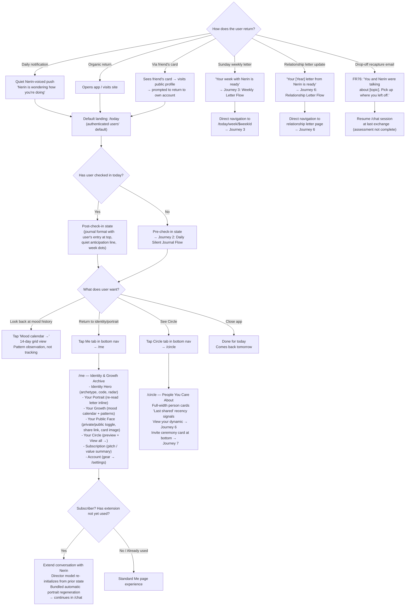
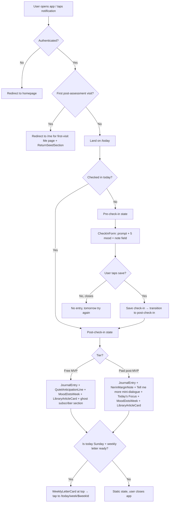
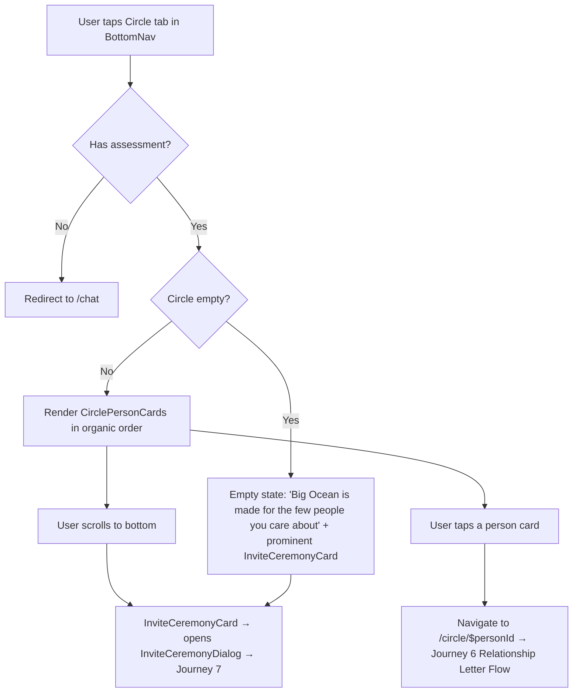
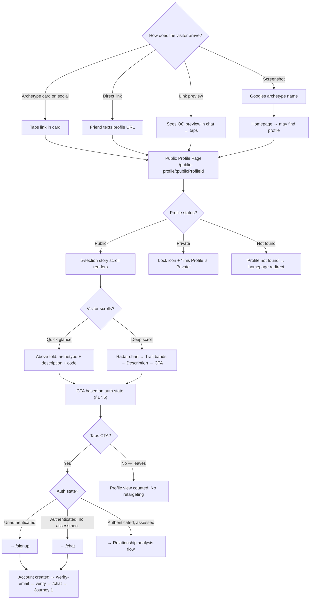

# UX Design Specification big-ocean

**Author:** Vincentlay
**Date:** 2026-04-11 (latest revision — see `editHistory` frontmatter for full timeline)

**Status:** Revision in progress. All 14 workflow steps are marked completed in `stepsCompleted`; the 2026-04-11 revision is an in-place update to the completed spec, not a re-run of the workflow.

**Known gap:** §8 Visual Design Foundation, §9 Design Direction, §12 UX Patterns, §13 Responsive/Accessibility, §14 Re-Engagement Emails, and §17 Public Profile still contain lingering PWYW, credit, and dashboard references from the pre-2026-04-11 era. These are not architecturally load-bearing — the three-space architecture and retired monetization model are reflected in the core spec sections (§1-2, §7, §10, §11, §15, §16, §18, §19, §20). A cleanup pass is recommended but not blocking.

---

## Executive Summary

### Project Vision

Big-ocean transforms personality assessment from a static questionnaire into a guided 15-turn conversation with Nerin, an AI personality specialist. Built on the Big Five (OCEAN) framework, it extracts personality evidence through natural dialogue, scores 30 facets, and maps results to memorable archetypes via a 5-letter OCEAN code.

**The assessment is onboarding, not the product.** The product itself is a three-space companion world the user lives in afterwards: **Today** (daily ephemeral companion — silent journal, mood calendar, Sunday weekly letter from Nerin), **Me** (persistent identity — portrait, archetype, scores, public face, subscription), and **Circle** (the few people you care about — relationship letters, invite ceremony). Assessment tunnels into this world; it is never the destination.

The product sits at the intersection of conversational AI, personality science, and daily companion apps — differentiated by a guided assessment, scientifically grounded insights, a daily return loop powered by personality-informed recognition, and relationship letters that turn every relationship into a reason to come back.

### Brand DNA: The Intimacy Principle

**"Big Ocean is built for a few people, not a crowd."** Every feature must pass this audit:

1. Does it show "how many"? → probably wrong
2. Does it reward broad visibility over focused connection? → wrong
3. Does it use follower/fan/network language? → wrong
4. Does it celebrate depth and duration of fewer relationships? → right
5. Does it treat the user as a sovereign member of a small circle, not a node in a growth graph? → right

**Implementation rules (all user-facing copy and components must comply):**
- No count metrics anywhere ("X connections", profile view counters, sign-up attribution shown to user)
- No follower/friend/fan language — use "people you care about"
- No search, no recommendations, no directory of users
- No sorting options on Circle — organic order only
- Each person rendered as full-width card with individual weight, not a grid of avatars
- Scroll length itself is honest feedback about circle size
- Empty states teach the value system rather than prompting growth
- No hard cap on Circle size (rules create resentment; culture through design)

### Assessment Invisibility Principle

The user should forget they are being assessed. Nerin operates as a perceptive conversational partner — reflecting observations about what the user has said, drawing them deeper into authentic self-reflection. No partial results, no scoring indicators, no mid-conversation reveals of the assessment layer. The trust loop is: user opens up → Nerin reflects something perceptive → user opens up more. Anything that surfaces the "we are evaluating you" subtext breaks this loop and undermines the coherence-based methodology.

Nerin's observations are conversational, not diagnostic: "I notice you describe your work relationships very differently from your friendships" — never "You seem high in agreeableness." The distinction between perceptive partner and clinical assessor is fundamental to the entire UX.

### Target Users

**Primary (Phase 1): Self-Understanding Seekers (25-40)**
Adults curious about personality and self-knowledge. They've likely taken personality tests before (16Personalities, MBTI) but found them superficial. They want something that feels more personal, nuanced, and trustworthy. They're mobile-first, social-media-literate, and accustomed to polished consumer experiences. For sophisticated users (coaches, psychology-adjacent professionals), the longer conversation format is a credibility signal — it separates big-ocean from shallow quiz apps.

**Viral Growth Lever: Relationship Explorers**
Users who arrive via a shared personality card or public profile link, not the landing page. Their entry point is someone else's archetype — the viral funnel starts at the public profile (or homepage if private), not through direct marketing. The public profile must convert curiosity into commitment before they ever see the conversation. Relationship comparison itself is powered by QR-based connection between two completed users.

**Tertiary: Self-Improvement Enthusiasts**
Users seeking actionable insights from their personality profile — how their traits affect work, relationships, and decision-making. They want evidence-linked narrative, not just scores. Deeper engagement layer for retention.

### Conversation Length Philosophy

The assessment is a 15-turn conversation lasting 30-45 minutes depending on engagement depth.

The length is a deliberate differentiator and audience filter — "how can you know someone in 10 minutes?" This will exclude casual users who want quick results. That is by design. The length self-selects for users who genuinely want a meaningful self-understanding experience, and those users are the ones most likely to complete, value their results, share authentically, and convert their relationships into new users. Optimizing for breadth of adoption at the cost of depth of experience would destroy what makes big-ocean different.

### Key Design Challenges

1. **The 30-45 minute commitment — earned, not endured** — The UX should frame this as a meaningful conversation, not a task to complete. The length is a credibility signal for the right audience — lean into it rather than apologize for it. Momentum comes from conversational quality, the depth engagement system, and Nerin's responsiveness as a perceptive partner.

2. **Conversational trust through Nerin's observations** — The UI environment, pacing, and visual treatment must frame Nerin as a compelling conversation partner worth opening up to. Surface-level responses produce poor assessments — the UX should encourage depth without feeling demanding. Nerin's mid-conversation observations ("I notice that when you talk about creativity, your energy shifts") are the primary trust-building and retention mechanism. These are conversational reflections, never assessment reveals.

3. **Three-space navigation cognitive model** — Today / Me / Circle is a departure from standard "dashboard + profile" IA. Users must instantly grasp that Today is ephemeral (come back tomorrow), Me is persistent identity, and Circle is the few people you care about. The bottom nav must carry this model without a tutorial. Default routing: first post-assessment visit → `/me`; every subsequent visit → `/today`. Assessment (`/chat`) sits outside the three-space world as an onboarding tunnel. `/settings` is a thin admin route accessed via gear icon on Me, not a fourth tab.

4. **The post-assessment transition is the emotional peak** — The transition from conversation close to first portrait read is the single most valuable moment in the product. It must use focused reading, not a cluttered results page. Flow: closing exchange → "Show me what you found →" button (user-voiced) → navigate to `PortraitReadingView` in a "generating" state with OceanSpinner and the line *"Nerin is writing your letter..."* → letter fades in full-screen, distraction-free, max-width 720px → warm "There's more to see →" link at the bottom → full results/Me page with identity hero, inline portrait, return seed, and notification permission request in Nerin's voice. The emotional weight of the first read must not be diluted by navigation or chrome.

5. **Phase 5 → Phase 6 bridge (daily return loop)** — Without a daily reason to come back, the 90% churn cliff kills the subscription flywheel before Week 3. The **silent journal fork** is the bridge: free users deposit a mood + optional note daily into a calendar with no LLM response, with a quiet anticipation line — *"Nerin will write you a letter about your week on Sunday."* — and the Sunday weekly letter arrives as the reward. Silence in the free tier is a feature, not a cost optimization. Paid daily dialogue (LLM recognition + mini-dialogue) is post-MVP.

6. **Weekly letter as the subscription conversion moment** — The subscription pitch does not appear at the portrait paywall (there isn't one — the portrait is free). It appears **inside the Sunday weekly letter**, in Nerin's voice, after 2-3 weeks of free recognition. The conversion copy is not a pricing page: *"I have more I want to say about what comes next. With a subscription, I can write you a fuller letter each week — with what to try, what patterns I'm seeing across weeks, and what I think might help in the week ahead."* The free version of the weekly letter must feel COMPLETE and satisfying on its own — not a preview, not a cripple-ware teaser.

7. **Relationship letter as a living space, not an artifact** — The page for one specific relationship is not a one-time analysis. It's a living relational space with an annual regeneration ritual (Spotify Wrapped model). Section A (This Year's Letter), Section B (real-time data grid with complementarity framing), Section C (letter history), Section E (shared notes), Section F (Your Next Letter countdown) are all free for everyone. Annual regeneration is automatic on connection anniversary, notified (not approved). Section D relational observations (D1-D4) are post-MVP subscriber-only.

8. **The invite ceremony as viral moment** — Inviting someone into Circle is self-expression, not marketing. The ceremony copy must lead with the reward ("Discover the dynamic between you. When they finish their conversation with Nerin, the two of you get a letter about your relationship…"), not the cost. The invite is placed at: bottom of Circle list, Me → Your Circle section, contextual CTA on another user's public profile, and highest-converting placement — inside the Sunday weekly letter when Nerin references the relational dimension.

9. **Mobile-first conversation ergonomics with session persistence** — 30-45 minutes of mobile interaction requires careful attention to input fatigue, response sizing, and visual breathing room. Save-and-resume is essential — users will be interrupted. The anonymous conversation path has been removed, so all users are authenticated from turn 1; this simplifies session ownership but puts more conversion pressure on the homepage and pre-conversation onboarding.

10. **Recapture flow for interrupted sessions** — Email is captured upfront at signup (per FR50). If a user pauses mid-conversation, automated email reminders bring them back ("You and Nerin were in the middle of something — pick up where you left off"). Works for every started user because email is collected before the first turn.

11. **The public profile as acquisition surface, separate from Me** — Relationship explorers arrive at public profile pages via shared archetype cards, not the homepage. Public profile is SEO, SSR, no auth, separate route (`/public-profile/$id`) from Me (`/me`, authenticated, private). Me contains a "Your Public Face" section as the control center for the separate public route. Different audiences, different JTBD, don't merge.

12. **Assessment integrity vs. ambient feedback** — The visual environment and progress signals must never telegraph personality dimensions or trait directions. If users can infer where the assessment is heading, they can game their responses, undermining the coherence-based methodology. All real-time feedback reflects conversational energy and engagement depth, never personality scoring.

13. **Intimacy Principle enforcement across every surface** — Every feature and every copy string must pass the Intimacy Principle audit. No counts, no follower language, no search/sort/recommend on Circle, no profile view counters, no sign-up attribution metrics anywhere. This is not style guidance — it is brand DNA and must be design-reviewed on every change.

### Design Opportunities

1. **Three-space product world as daily return loop** — Today / Me / Circle transforms big-ocean from a one-time test into a place people live. Today as ephemeral daily companion (BeReal philosophy — consistency over days, not engagement within a day), Me as identity sanctuary (low-frequency but high-emotion visits), Circle as relational scroll (intimacy without network). The three spaces cover three different emotional registers that can't coexist on one page.

2. **Silent journal as a ritual** — Drawing from BeReal: one daily action, low friction, content gated behind the user's own deposit, ephemeral feel, static after check-in. Free users deposit mood + note with no LLM response. The silence is the feature — Nerin's voice is rare and precious, stored up for the Sunday weekly letter. The quiet anticipation line *"Nerin will write you a letter about your week on Sunday"* turns waiting into longing.

3. **Weekly letter from Nerin as conversion engine** — The Sunday weekly letter is the primary retention-to-revenue bridge. Free version is a complete descriptive artifact (date range, week narrative, visual mood shape, "what stood out" beat, Nerin's sign-off). Subscriber version adds a prescriptive "For the week ahead" coaching layer, "Zooming out" cross-week pattern detection, and a reflective prompt. The conversion pitch at the end of the free version is in Nerin's voice, not system voice — *"I have more I want to say about what comes next."*

4. **Relationship letter as living relational space** — Section A is the emotional center (this year's letter + ritual screen), Section B is a real-time data grid updating as either user has new Nerin conversations, Section C is letter history as a multi-year relationship biography, Section E is user-owned shared notes, Section F is the "Your Next Letter" countdown. The annual regeneration model (Spotify Wrapped) creates predictable anticipation; letter history compounds into an irreplaceable moat by Year 3+. The letter itself is free for everyone — the annual moment is a gift, not a paywall.

5. **Invite ceremony as viral flywheel moment** — Invite copy leads with the reward (relationship letter), not the cost (30-min conversation). Concrete promise: "click / clash / unspoken rhythms." Self-reflexive hook: "a side of yourself that only shows up around them." The invitee's side is reframed as a gift from them ("just someone curious about them"). Invite name field is an intentionality ceremony, not a form.

6. **Nerin output grammar — three visual formats** — Users learn to read each format in its own emotional register. **Journal format** (margin notes, shared-page feel) = daily check-in recognition on Today [post-MVP for paid users; free users see the quiet anticipation line]. **Letter format** (focused reading, max-width 720px, warm body font) = portrait, weekly summary, annual relationship letter. **Chat format** = subscriber mini-dialogue on Today (post-MVP). Each format has its own UI conventions, typography, and pacing.

7. **Post-assessment focused reading transition** — The first read of the portrait happens in a distraction-free focused reading view (`PortraitReadingView` at `/results/$sessionId?view=portrait`), not on a cluttered results page. Entry: "Show me what you found →" button after Nerin's closing exchange (user-voiced). Generating state: OceanSpinner + "Nerin is writing your letter...". Ready state: letter fades in full-screen. End-of-letter transition: warm "There's more to see →" link → full results/Me page. This is the single most emotionally-weighted flow in the product and deserves a full-tier focused reading container.

8. **Return seed on first Me page visit** — At the bottom of the full results/Me page on the first visit, Nerin plants the return seed: *"Tomorrow, I'll ask how you're doing. Come check in with me."* Paired with a notification permission request in Nerin's voice: *"I'd like to check in with you tomorrow. Mind if I send a quiet note?"* — NOT a system-voice "Enable notifications" prompt. If granted, schedule a first daily prompt for the next day. If denied, the relationship still works — no lock-in. This is the Phase 5 → Phase 6 bridge.

9. **Immersive conversational interface** — Explore a departure from standard chat-bubble UI toward a full-screen, ambient experience where the conversation feels like entering a space, not opening a messaging app. The ocean/geometric visualization lives around and behind the text, creating an intimate environment distinct from any chatbot interaction. No timestamps, no avatar bubbles — each exchange is its own moment. (Design direction to evaluate, not a commitment.)

10. **Energy-responsive ambient visualization** — The ocean/geometric system responds to conversational energy and depth (emotional texture, engagement intensity, conversational momentum) — NOT to personality dimensions. This preserves assessment integrity while creating a living, responsive environment that rewards deeper engagement visually without revealing scoring.

11. **Depth progress system (existing pattern)** — The conversation sustains momentum through three complementary mechanisms: a depth meter (vertical bar showing conversation progress — how far through the 15 turns, not engagement quality), unnamed milestones that mark the journey without countdown anxiety, and Nerin's in-conversation validation when the system detects increasing depth and authenticity. This is the therapeutic alliance trust loop — vulnerability met with recognition encourages further opening.

12. **Evidence-linked results narrative** — Unlike any competitor, big-ocean can connect archetype insights back to specific things the user said during their conversation. "Your high openness showed up when you described..." transforms results from generic personality labels into deeply personal storytelling.

13. **Personality portrait as social identity object** — The shareable artifact is a visual personality portrait — a unique, generative visual signature tied to the user's OCEAN code — not a results card or data summary. Designed for identity performance on social media (think: Spotify Wrapped aesthetic meets generative art). The OCEAN code becomes a visual identity, not a letter string.

### Future Considerations

- **Paid daily dialogue (post-MVP subscriber layer)** — LLM-generated daily check-in recognition in journal format (margin notes), plus "Tell me more →" mini-dialogue (3-5 exchange conversation with Nerin who has read the actual note). Splits the free/paid line into qualitatively different products (free = silent journal, paid = daily dialogue), not two versions of the same product. Rejected the template engine approach as over-engineering; every place Nerin speaks uses LLM.
- **Personality-typed daily triggers (post-MVP)** — Daily notification copy uses personality data to deliver personality-informed prompts per user. High-Neuroticism: "Let's check the weather inside." High-Openness: "What surprised you today?" High-Conscientiousness: "How's the list looking?" MVP ships with one default notification time; users can customize in settings.
- **Prescriptive weekly letter layer (post-MVP)** — Subscriber version of the weekly letter adds "For the week ahead" (prescriptive focus statement + one concrete micro-action), "Zooming out" cross-week pattern detection, and a reflective prompt. In MVP, subscribers already receive the descriptive free version.
- **Portrait gallery and regeneration (post-MVP subscriber)** — Longitudinal portrait gallery with side-by-side comparison, subscriber-only regeneration ceremony with wait screen, "Who you're becoming" delta annotations on radar, growth arc narrative. In MVP, subscribers receive one automatic portrait regeneration bundled with their first conversation extension.
- **Section D relational observations (post-MVP)** — Subscriber-only layer on the relationship letter page. D1 (mood trends side by side, requires mutual opt-in), D2 (Nerin's relational observations), D3 ("take care of" personality-informed suggestions, per-subscriber), D4 (alignment patterns). D5 (gentle check-ins and prompts) deferred pending user testing.
- **Annual letter regeneration (Year 1 Q4+)** — Automatic trigger on connection anniversary, no on-demand regeneration. Both users notified, not asked for approval. Letter history preserved forever. Creates Spotify Wrapped-style annual ceremony.
- **Voice input as optional modality** — Could reduce mobile fatigue and produce richer, more natural responses. Parked due to cost implications. Revisit as a premium feature or when costs decrease.
- **Reassessment over time** — "How have you changed?" periodic reassessment to track personality evolution. Planned for post-MVP.
- **Subscription depth expansion** — €9.99/mo. MVP perks: conversation extension (+15 exchanges with Director model re-initialization) and automatic first-extension portrait regeneration. Post-MVP perks unlock in phases: Phase 1b (daily LLM recognition, mini-dialogue, prescriptive weekly letter, personality-typed notification scheduling), Phase 2a (Coach agent, portrait gallery, Section D D2-D4), Phase 2b (Relationship / Career agents, cross-agent intelligence), Phase 2c (annual relationship letter regeneration).
- **Agent platform (post-MVP)** — Coach agent as the first subscription-gated agent, with extensible agent architecture for future specialized agents (career coach, relationship advisor, etc.). Each agent leverages the personality profile as persistent context.
- **B2B therapist wedge (post-MVP)** — Therapists surface pre-screening tool. Team management, group dynamics. Optional future path, not a core motivation.

> **Removed from the roadmap (violates Intimacy Principle):** ~~Community feed — browsing archetypes, anonymized portraits, and finding people with complementary or contrasting profiles.~~ Rejected: community feeds are network-scale, not intimacy-scale, and contradict the "built for a few people, not a crowd" brand DNA.

## Core User Experience

### Defining Experience

The core experience of big-ocean unfolds in two phases: an **onboarding tunnel** (the 15-turn assessment, run once) and a **three-space companion world** (lived in indefinitely afterwards). The assessment is where credibility is earned and the portrait is delivered; the three-space world is where the user returns, grows, and invites others.

**Phase 1 — Onboarding tunnel (Day 0, ~30 min):**

The 15-turn conversation with Nerin transforms from "I'm here to get my personality results" into "I'm genuinely engaged in this conversation about myself." Nerin's observations — surfacing patterns, contradictions, and tensions in what the user has said — build credibility ("this AI is actually listening"), create the feeling of being understood ("how did she notice that?"), and build anticipation for the portrait ("if she's catching this much now, the full results must be incredible"). The conversation is not a waiting room for results — it's the first act of a multi-act experience.

Onboarding closes with a focused reading transition: Nerin's distinct closing → "Show me what you found →" button → `PortraitReadingView` in generating state → letter fades in full-screen → "There's more to see →" → full results/Me page → return seed + notification permission request in Nerin's voice.

**Phase 2 — Three-space companion world (Day 1+):**

From Day 1 onwards, the user lives in three spaces accessed via persistent bottom nav:

- **Today** — Daily ephemeral companion. Pre-check-in: personality-typed prompt from Nerin + 5 mood options + optional text + week dots (7 days, today empty). Post-check-in (free tier): the entry is saved silently into the mood calendar, no LLM response, the quiet anticipation line *"Nerin will write you a letter about your week on Sunday"* is displayed. Paid tier journal format with LLM recognition in margin notes is post-MVP. Static after check-in — one daily action, come back tomorrow. BeReal philosophy.
- **Me** — Persistent identity. Identity hero (archetype, OCEAN code, radar, confidence), Your Portrait (re-read the letter), Your Growth (mood calendar + pattern observations, conditional on history), Your Public Face (preview + private/public toggle + share link + card image), Your Circle preview, Subscription pitch, Account (gear → `/settings`). Low-frequency but high-emotion visits.
- **Circle** — The few people you care about. Each person rendered as full-width card with archetype, OCEAN code, duration ("understanding each other since February"), "last shared" recency signal (presence, not activity, never a streak), and "View your dynamic" link to the relationship letter page. Invite ceremony card always appended at the bottom. No counts, no sorting, no search, no recommendations, organic order only. Empty state teaches the value system: "Big Ocean is made for the few people you care about."

Assessment (`/chat`) sits outside the three-space world. Public profile (`/public-profile/$id`) is a separate SEO/SSR route (no auth), controlled from Me → Your Public Face. A thin `/settings` route handles admin (email, password, delete) via the gear icon on Me.

**The core loop (from onboarding through the daily flywheel):**

1. Conversation with Nerin (15 turns, 30-45 min)
2. Focused reading portrait reveal (free, distraction-free `PortraitReadingView`)
3. First Me page visit with return seed ("Tomorrow, I'll ask how you're doing")
4. Daily: silent journal deposit on Today
5. Weekly: Sunday letter from Nerin in letter format at `/today/week/$weekId` — free version descriptive, complete, satisfying
6. Relationship invite ceremony → invitee takes their own assessment → relationship letter generated → both sit with it together on a Read Together Again ritual → annual regeneration on anniversary
7. Week 3+ subscription conversion inside the Sunday weekly letter — Nerin's voice, not paywall voice — unlocks conversation extension + first-extension portrait regeneration
8. Satisfied user shares their archetype card + invites more people → new conversations begin

**Viral and retention flywheels share one moment then diverge.** The post-assessment emotional peak offers both Path A (share + invite = viral) and Path B ("come back tomorrow" = retention). Both are offered; neither blocks the other.

### Conversation Arc

The conversation is not a flat sequence of questions. It has a three-act narrative structure, and each act has different UX requirements for Nerin's behavior, visual pacing, and depth engagement signals.

| Act | Turns | Purpose | User State |
|-----|-------|---------|------------|
| **Act 1: Settling In** | 1-5 | Establish trust, signal depth, move past surface answers. Nerin's tone puts the user at ease while signaling this is not small talk. | Curious but guarded → opening up |
| **Act 2: Deep Exploration** | 5-11 | Nerin's observations surface patterns and contradictions. The user is fully engaged and moving into authentic self-reflection. The "how did you know?" moments happen here. | Opening up → genuinely reflecting |
| **Act 3: Convergence** | 11-15 | Themes deepen and connect. The user begins forming their own hypothesis about what their portrait will say. Anticipation peaks. | Reflecting → anticipating the portrait |

The transition between acts should be felt, not announced. The depth meter, ambient visualization energy, and Nerin's conversational tone all shift subtly as the conversation deepens.

### Three-Space Navigation Model

The authenticated product is organized around **three spaces**, not a dashboard. Each space has a different emotional register, a different visit frequency, and a different job. Bottom nav carries the three tabs: **Today | Me | Circle**.

**1. Today — Daily Ephemeral Companion**
`/today` — Default landing for every visit after the first. Silent journal check-in, week-so-far dots, mood calendar link, quiet anticipation line, Sunday weekly letter inline card. Visited daily. The page is static after check-in — one action, come back tomorrow. Not a feed. Not a museum. Ephemeral by design: yesterday's page doesn't live here; the mood calendar is a separate view for looking back.

**2. Me — Persistent Identity & Growth Archive**
`/me` — First visit post-assessment lands here (portrait reveal + identity celebration). Subsequent visits are low-frequency, high-emotion. Contains: Identity Hero (archetype, OCEAN code, radar, confidence), Your Portrait (re-read the letter), Your Growth (mood calendar + pattern observations, conditional on mood history), Your Public Face (preview of what strangers see + public/private toggle + shareable link + card image — NO view counts, NO sign-up attribution metrics), Your Circle preview (with "View all →"), Subscription pitch (for free users) or value summary (for subscribers), Account (gear icon → `/settings`).

**3. Circle — People You Care About**
`/circle` — The few people the user cares about, rendered as full-width person cards (not a grid of avatars). Each card shows archetype, OCEAN code, duration ("understanding each other since February"), "last shared" recency signal, and "View your dynamic" link to the relationship letter page. Invite ceremony card is always appended at the bottom. Header framing: "The few people you care about." **No counts, no sorting, no search, no recommendations, organic order only.** Empty state: "Big Ocean is made for the few people you care about. This is where they'll live."

#### Supporting surfaces (outside the three-space world)

**Assessment tunnel (`/chat`)** — The 15-turn conversation. Sits outside the three-space world as an onboarding tunnel. Not a tab. Run once (or extended once per subscription cycle via Director model re-initialization).

**Focused reading views** — Dedicated distraction-free routes for Nerin's letter-format outputs:
- `/results/$sessionId?view=portrait` — First portrait read (`PortraitReadingView`)
- `/today/week/$weekId` — Weekly letter from Nerin
- Relationship letter Section A entered via "Read Together Again" ritual screen

**Relationship letter page** — Deep page for one specific relationship, accessed from Circle → person card → "View your dynamic". Living relational space (not an artifact) with annual regeneration ritual. Free for everyone.

**Public profile (`/public-profile/$id`)** — Separate SEO/SSR route, no auth. What strangers see. Controlled from Me → Your Public Face. Different audience, different JTBD from Me; the two are NOT merged.

**Personality card (always shareable)** — A visual identity artifact the user can share from Me → Your Public Face. The card links to the user's public profile URL; if the profile is private, the visitor is transparently redirected to the homepage. Privacy never blocks sharing — every user can express their identity without exposing personal data.

**`/settings`** — Thin admin route (email, password, data export, delete) accessed via gear icon on Me. Not a fourth nav tab.

#### Routing decisions

- **First visit post-assessment:** → `/me` (portrait reveal, identity celebration)
- **All subsequent authenticated visits:** → `/today` (daily return default)
- **Unauthenticated visits:** → `/` (homepage)
- **Relationship letter page first visit:** enters through "Read this together when you can sit with it" ritual screen; subsequent visits bypass ritual by default ("Read Together Again" re-enters ritual mode)
- No `/dashboard` route — the dashboard concept has been retired. `/dashboard` if hit redirects to `/today`.

### Competitive Context

**ChatGPT is the experiential benchmark, not quiz apps.** Users are already having personality conversations with general-purpose AI. But ChatGPT offers no structure, no saved results, no shareable artifacts, no comparison features. big-ocean is the guided, scored, shareable, relationship-aware version of what people already do when they ask ChatGPT about their personality. Positioning should lean into this distinction rather than competing with quiz apps on format.

**16Personalities owns cultural ubiquity, not quality.** "I'm an ENFJ" is social currency. "I'm an OCEAR" is not — yet. The OCEAN code lacks recognition, so the visual identity system must carry the social language burden. The personality portrait and card must be so visually distinctive that they become their own recognizable format in social feeds — the way Spotify Wrapped is instantly identifiable regardless of the data inside it.

**Time-to-value is the deliberate trade-off.** Every competitor delivers results in under 15 minutes. big-ocean asks for 30-45 minutes. This is the cost of depth and the source of differentiation. The UX implication: every touchpoint before the conversation (landing page, public profile, shared personality card) must work harder than competitors to justify the commitment. The quality promise must be viscerally clear before turn 1.

### Platform Strategy

**Current:** Web application (TanStack Start SSR), mobile-responsive design. Always-connected — no offline mode required.

**Near-term consideration:** Native mobile app. The 30-45 minute conversational format and the social sharing mechanics (personality cards, comparison links) align strongly with mobile-native behaviors. If/when a native app is pursued, the conversation experience and push notification recapture flow would benefit significantly from native capabilities.

**Design implications:**
- Mobile-first responsive design is mandatory — most users will be on phones even on web
- Touch interaction patterns take priority over mouse/keyboard
- The conversation input area must be optimized for thumb typing on mobile viewports
- Share mechanics should leverage native share sheets where available (Web Share API)
- Auth-gated email collection enables cross-platform session continuity (start on mobile web, receive reminder email, resume on desktop or vice versa)

### Effortless Interactions

**Must be zero-friction:**

1. **Sharing the archetype card** — One tap to share a beautiful visual artifact. The card is generic (archetype-level: name, short description, GeometricSignature, OCEAN code — no scores). Always shareable. Link parameterized to user's public profile. If profile is private, user is prompted to make it public at the moment of sharing.

2. **Dynamic social previews** — The shared archetype card link must render the archetype card image (with short description) via OG meta tags. If the preview looks generic or broken on iMessage, Instagram, or WhatsApp, the viral loop breaks before it starts. The card must look incredible in every platform's link preview format.

3. **Daily silent check-in** — Open app → Today is the default route → tap mood → optionally type a note → tap save. No ceremony, no friction. The entry is saved silently to the mood calendar. Week-so-far dots update. The quiet anticipation line is shown. Target: ~10 seconds on quiet days. The BeReal principle — the act of depositing is itself valuable.

4. **Reading the Sunday weekly letter** — Sunday evening push notification ("Your week with Nerin is ready") → tap → land directly in `/today/week/$weekId` focused reading view → read the letter → scroll to conversion moment (free users) or sign-off (subscribers) → dismiss. The letter is the payoff for the week. Same typographic register as the portrait.

5. **Initiating an invite ceremony** — From Me → Your Circle section, Circle → bottom of list, or the weekly letter's relational beat → "Invite someone you care about" → short Nerin-voiced ceremony screen → name field (optional) → choose QR / copy link / native share sheet. One intentional tap, not a form.

6. **Starting the conversation** — Homepage CTA → signup (email + password, per FR50) → email verification (FR50a, FR50b) → pre-conversation onboarding introducing Nerin and format (FR54) → `/chat`. Authenticated from turn 1. Nerin's first message IS the onboarding. The anonymous path has been removed — homepage conversion is load-bearing.

7. **Resuming an interrupted conversation** — If a user returns (via email reminder or direct navigation), they land exactly where they left off. No re-authentication friction, no "welcome back" modal. Just Nerin, picking up naturally.

**Should feel natural but may require some thought:**

8. **Navigating Me** — The portrait, trait breakdown, evidence narrative, public face control, subscription pitch, and Circle preview have depth. Navigation should feel like exploring, not like reading a report. Progressive disclosure over information dump.

9. **Entering the relationship letter page** — Circle person card → "View your dynamic" → first-visit ritual screen ("Read this together when you can sit with it") → Section A letter fades in → scroll exposes Section B data grid, Section C letter history, Section E shared notes, Section F "Your Next Letter" countdown. Subsequent visits bypass ritual by default; "Read Together Again" re-enters ritual mode.

10. **Subscription conversion at the weekly letter** — End of free weekly letter → Nerin's voice conversion copy → one primary CTA button ("Unlock Nerin's full weekly letter — €9.99/mo →") + soft dismiss ("Not right now"). No pricing page, no feature comparison table, no aggressive retention nag. The dismiss returns next Sunday with the same framing.

### Critical Success Moments

1. **The first Nerin observation (Act 1 → Act 2 transition, turns 5-8)** — The moment Nerin surfaces a pattern or tension the user didn't expect. This is the credibility inflection point. If it lands, the user thinks "okay, this is real" and commits to the full conversation. If it feels generic or off-base, trust erodes and depth of subsequent answers drops. **This is the single most important UX moment in the entire assessment.**

2. **The portrait reveal inside focused reading** — The transition from conversation end to first portrait read, delivered inside `PortraitReadingView` (not on a cluttered results page). Closing exchange → "Show me what you found →" button → navigate to `/results/$sessionId?view=portrait` → OceanSpinner with Nerin-voiced line *"Nerin is writing your letter..."* → letter fades in full-screen, max-width 720px, warm background. The visual personality portrait, the archetype name, the opening narrative must deliver on the promise the conversation built. This is the emotional peak. The focused reading container exists specifically to protect this moment from dilution.

3. **The "that's so me" confirmation during the first read** — Somewhere in the portrait letter, the user reads something that feels uncannily accurate — ideally tied to a specific thing they said during the conversation. This is the moment that converts a user into a sharer. Evidence-linked narrative ("Your high openness showed up when you described...") is the mechanism.

4. **The return seed on first Me page visit** — After end-of-letter transition ("There's more to see →") and the full results/Me page scroll, at the bottom: Nerin's message *"Tomorrow, I'll ask how you're doing. Come check in with me."* + notification permission request in Nerin's voice *"I'd like to check in with you tomorrow. Mind if I send a quiet note?"* — NOT a system-voice "Enable notifications" prompt. **This is the Phase 5 → Phase 6 bridge.** If this moment fails, the daily loop never starts and the subscription flywheel dies in Week 1.

5. **First share action** — The moment a user decides to share their archetype card. The share flow must be instant and the card must look incredible in the destination context (iMessage preview, Instagram story, WhatsApp thumbnail). If profile is private, prompt visibility toggle at this moment.

6. **The first silent journal check-in (Day 1)** — User opens app the next day after seeing the return seed → lands on `/today` → sees the pre-check-in state with Nerin's prompt + mood options → deposits their first entry → sees the week-so-far dots and the quiet anticipation line. Must feel light, respectful, and quiet. If the first check-in feels like a chore or a survey, the BeReal habit never forms.

7. **The first Sunday weekly letter (Week 1)** — User receives push notification *"Your week with Nerin is ready"* → taps → lands in `/today/week/$weekId` focused reading view → reads a complete, satisfying, descriptive letter. **The free version must feel COMPLETE, not a teaser.** If Week 1 free is mediocre, no Week 2 happens and the three-act conversion story dies before Act 2.

8. **The subscription conversion moment (Week 3+ inside the weekly letter)** — End of the free weekly letter: *"I have more I want to say about what comes next…"* → one CTA button → conversion. Not a pricing page, not a feature grid, not a retention nag. Should feel like the natural next step in an ongoing relationship with Nerin, not a paywall.

9. **The relationship letter reveal** — When both parties have completed and the Section A letter is generated. First-visit ritual screen ("Read this together when you can sit with it") → Section A letter fades in → both users experience the letter as a shared moment. Should feel like a gift, not a feature unlock notification.

10. **The invite ceremony moment** — User decides to invite someone into Circle. The ceremony copy leads with the reward ("Discover the dynamic between you…"), the name field is an intentionality pause, not a form. The share method choice (QR / link / native) closes the ceremony without friction.

### Experience Principles

1. **The assessment is onboarding, not the product.** Every design decision about the assessment should optimize for engagement quality and credibility, not for completion speed — but the assessment also cannot be the end of the experience. The product is the three-space world the user lives in afterwards. If the assessment feels like the destination, the return loop never forms.

2. **Anticipation is a feature.** Nerin's observations build anticipation for the portrait deliberately. The longer the user has been engaged and the more credible Nerin feels, the more powerful the portrait reveal becomes. Silence in the free daily check-in is also anticipation — Nerin's rare voice in the Sunday weekly letter carries weight because the user hasn't heard from Nerin since their portrait. Design anticipation as a currency the product spends at the right moments.

3. **The conversation has narrative structure.** Three acts — settling in, deep exploration, convergence — each with different requirements for tone, pacing, and depth signals. The UX must support this arc through ambient visualization, depth meter behavior, and Nerin's evolving conversational approach.

4. **The product has three emotional registers, carried by three visual formats.** Nerin's output grammar is locked: **Journal format** (margin notes, shared-page feel) for daily check-in recognition [post-MVP paid], **Letter format** (focused reading, max-width 720px, warm body font) for portrait / weekly summary / annual relationship letter, **Chat format** for subscriber mini-dialogue [post-MVP]. Each format has its own typography, pacing, and UI conventions. Users learn to read each format in the appropriate emotional register.

5. **Free users get a silent journal. Paid users (post-MVP) get a daily dialogue with Nerin.** These are not two versions of the same product — they are qualitatively different experiences. Users understand forks better than gradients. Silence in the free tier is a feature, not a limitation.

6. **The free weekly letter must feel COMPLETE.** The free version of the Sunday weekly letter is not a preview, not a teaser, not cripple-ware. It is a full descriptive artifact the user is glad to receive. If the free version feels incomplete, the conversion dynamic reverses and users resent the platform. The conversion pitch at the end is Nerin wanting to tell the user more, not a paywall.

7. **Subscription conversion lives inside the daily loop, not at the assessment end.** The portrait is free. The relationship letter is free. The subscription pitch appears inside the Sunday weekly letter after 2-3 weeks of free recognition, in Nerin's voice: *"I have more I want to say about what comes next."* Three-act story: Act 1 (Day 0-7) build habit, Act 2 (Day 7-21) show the gap, Act 3 (Day 21+) natural unlock.

8. **Sharing should feel like self-expression, not distribution.** The archetype card is something users share because it says something about who they are, not because we asked them to. The card must be beautiful enough to be worth posting. Privacy is handled at the sharing moment — prompt to go public, not buried in settings.

9. **The viral loop is relationship-powered.** The personality card drives broad social sharing; the invite ceremony + relationship letter drive deep dyadic engagement. The relationship letter is free because every letter = potential new user acquisition (zero friction growth). Both paths must be effortless, but they serve different motivations.

10. **Assessment invisibility above all.** No UX element should remind the user they are being evaluated. The depth meter shows conversation progress (how far through the 15 turns), not scoring or engagement quality. Nerin observes, doesn't diagnose. The ambient visualization responds to energy, not traits. The assessment runs silently beneath a conversation that feels genuinely human.

11. **Intimacy Principle is design-reviewed on every change.** "Built for a few people, not a crowd" is not style guidance. Every new surface must pass the audit: no counts, no follower/network language, no search/sort/recommend on Circle, no profile view counters, no sign-up attribution metrics anywhere user-facing, full-width person cards (not grids of avatars).

12. **Pre-conversation touchpoints are now load-bearing.** The anonymous path has been removed. Cold visitors cannot experience Nerin before committing to signup + email verification. Every surface before `/chat` (homepage, Nerin preview, portrait excerpt, public profile they arrived from) must work harder than competitors to justify 30-45 minutes AND signup friction. Trade-off accepted: lower top-of-funnel conversion for higher middle-of-funnel quality (Headspace / BetterUp precedent).

## Desired Emotional Response

### Primary Emotional Goals

**During the conversation: "I feel heard."**
The dominant emotion throughout the conversation should be the rare sense of being genuinely listened to. Not interrogated, not entertained — *heard*. This is the feeling that separates big-ocean from every competitor. 16Personalities feels like filling out a form. ChatGPT feels like talking to a tool. big-ocean should feel like talking to someone who actually cares what you're saying.

The emotional texture adapts to the user through the pacing system:
- **Deep seekers** experience a late-night-conversation intimacy — reflection, tension, surprising self-recognition
- **Lighter engagers** experience a warm, friendly, naturally flowing chat — comfortable, curious, gently revealing

Both feel listened to. The depth differs, not the quality of attention.

**At the portrait reveal: "That's me — but I couldn't have said it that way."**
The reveal should land as both validation and discovery simultaneously. The user recognizes themselves but sees themselves articulated in a way they couldn't have done alone. It's the feeling of reading a description that captures something you've always felt but never named. The visual portrait appears first — the emotional impact lands visually before a single word is read. The narrative reinforces what the image already communicated.

**When sharing: "This says something about who I am."**
The share impulse should come from identity expression, not product promotion. The personality card should feel like a personal statement — something the user is proud to attach to their social identity.

**When seeing a relationship comparison: "I feel closer to this person."**
The comparison should deepen connection, not create competition. The emotional goal is mutual understanding — "oh, that's why they do that" — not "I scored better." The comparison should make both parties feel more understood by each other.

### The Trust-Surprise Loop: Core Emotional Engine

The foundational emotional mechanic of the entire product:

```
Trust → user opens up → Nerin has richer material →
specific observation → Surprise → reinforces Trust →
user opens up more → deeper material → ...
```

If this loop activates by turn 8, everything downstream works — Depth, Validation, Pride, Self-Expression, Virality. If it doesn't activate, nothing compensates. The first Nerin observation (turns 5-8) is the ignition point. This is why it's the single most important UX moment: it's not just a retention moment, it's the start of the emotional engine that powers the entire experience.

**Conversation depth directly determines portrait quality.** This is a hidden dependency — the results page seems like a separate design problem from the conversation UI. But deeper conversation → richer evidence → more specific portrait → stronger Validation → more Pride → more sharing. UX investment in driving deeper conversation has a direct multiplier effect on everything downstream. A beautifully designed results page with shallow evidence will feel generic. A plain results page with deep, specific evidence will feel powerful.

### Emotional Journey Mapping

| Stage | Desired Emotion | Threat Emotion | Design Response |
|-------|----------------|----------------|-----------------|
| **Landing / Public profile** | Curiosity + intrigue ("this looks different") | Skepticism ("another personality quiz") | Visual distinctiveness, quality signals, social proof from shared cards |
| **Auth gate** | Commitment ("this is worth my time") | Hesitation ("30-45 minutes is a lot") | Minimal friction, clear value promise, no overwhelming onboarding |
| **Act 1 (turns 1-8)** | Comfort + emerging trust ("this feels natural") | Guardedness ("am I being judged?") | Nerin's warm tone, adaptive pacing, no clinical framing. The ambient visualization signals "you've entered a different space" — a container for self-reflection. |
| **Act 2 (turns 5-11)** | Being understood + surprise ("how did she notice that?") | Exposure anxiety ("that's too personal") | Nerin acknowledges if she touches something sensitive, draws back to comfortable ground. After vulnerable moments, a held silence — a deliberate pause communicated through pacing and ambient visualization shift, not a typing indicator — signals respect. |
| **Act 3 (turns 11-15)** | Anticipation + self-recognition ("I'm starting to see myself") | Fatigue ("are we almost done?") | Depth meter shows momentum, conversation feels like it's converging, not dragging |
| **Closing ritual** | Gratitude + readiness ("that was meaningful, I want to see my portrait") | Abruptness ("wait, it's over?") | Nerin acknowledges the conversation as a whole before the portrait transition — "You've shared a lot with me" — bridging the emotional arc rather than cutting to results. |
| **Portrait reveal** | Awe + validation ("that's exactly me") | Disappointment ("this is generic") | Layered revelation: conversation ends → brief pause → ambient visualization transforms → archetype name appears → portrait visual materializes → opening narrative fades in. Visual first, text second. Each layer adds a beat of anticipation. |
| **Results exploration** | Discovery + pride ("I didn't know that about myself") | Overwhelm ("too much data") | Progressive disclosure, explore-don't-dump |
| **First share** | Self-expression + excitement ("people need to see this") | Privacy concern ("is this too personal?") | Personality card is curated/beautiful, privacy handled transparently |
| **Relationship comparison** | Closeness + mutual understanding ("now I get them") | Judgment ("my partner scored lower") | Frame as complementary, not competitive. Focus on understanding, not ranking |
| **Comparison notification (delayed)** | Re-ignited excitement ("something surprising came up") | Indifference ("I already got my results days ago") | The notification must re-create anticipation, not just inform: "Something surprising came up in your comparison with [name]" — framed as a new discovery, not a status update |
| **Return visit / extension** | Desire for more depth ("I want to go deeper") | Indifference ("I already got my results") | Email/notification framing emphasizes new insights, not repetition |

### Micro-Emotions

**Critical emotional states to cultivate:**

- **Trust over skepticism** — Earned through Nerin's perceptiveness, not claimed through marketing copy. Trust builds when Nerin reflects something accurate, not when the UI says "trusted by millions."
- **Surprise over predictability** — The "how did she know?" moments are the emotional fuel of the entire experience. If the conversation feels predictable, engagement drops.
- **Pride over embarrassment** — The results should make users feel good about who they are, including their complexities and contradictions. Nobody shares something that makes them look bad.
- **Closeness over competition** — Relationship comparisons must frame differences as complementary. "You bring stability, they bring spontaneity" — not "you scored 72, they scored 45."
- **Held silence after vulnerability** — When the user shares something deep, a deliberate pause in Nerin's response — communicated through pacing and a subtle ambient visualization shift — signals "I'm sitting with what you just said." Not a typing indicator. Presence, not processing.

**Critical emotional states to prevent:**

- **Clinical observation** — "You exhibit high neuroticism" is devastating. Nerin is a perceptive friend, not a psychologist reading from a chart.
- **Exposure without consent** — If the conversation touches something sensitive and the user pulls back, Nerin must acknowledge and redirect. Never push.
- **Generic flattery** — If the portrait reads like a horoscope ("you're creative and caring"), trust collapses. Specificity is the antidote.
- **Abandonment after results** — The post-reveal experience should feel like an invitation to explore further, not a dead end. The conversation extension and relationship features should feel like natural next steps, not upsells.

### Handling Negative Moments

When something goes wrong — Nerin misreads the user, touches a sensitive topic, or a technical error occurs — the emotional design principle is: **acknowledge, don't ignore.**

- **Nerin says something off-base:** Nerin acknowledges the miss naturally ("I may have read that differently than you meant — tell me more about what you were getting at") and draws the conversation back to comfortable ground. No defensiveness, no pretending it didn't happen.
- **User pulls back from a sensitive topic:** Nerin recognizes the shift and redirects with warmth. The pacing system adapts — lighter tone, safer subject, space to re-engage at the user's pace.
- **Technical interruption (error, disconnect):** The resume experience must feel seamless — Nerin picks up as if the conversation never stopped. The emotional goal is "that didn't happen" rather than "welcome back, we had an issue."
- **Delayed comparison notification:** The comparison may unlock days after the original assessment, when emotional momentum has faded. The notification must re-ignite excitement, not just inform. Framing as a new discovery ("Something surprising came up in your comparison with [name]") re-creates anticipation rather than delivering a status update.

### Emotional Design Principles

1. **Presence is the product.** The quality of attention Nerin gives — and the UI communicates — is the core emotional differentiator. Not features, not data, not gamification. Every UI element should reinforce "I am here with you." Drawing from therapy: the feeling of being truly attended to is what makes this experience transformative.

2. **The Trust-Surprise loop is everything.** If this loop activates by turn 8, the experience becomes self-sustaining. If it doesn't, nothing downstream compensates. Every UX decision about the conversation should be evaluated against: "does this help the Trust-Surprise loop fire?"

3. **The pacing system is emotional intelligence.** Adaptive pacing isn't just a conversation mechanic — it's how the product reads the room. Deep seekers get depth. Lighter engagers get warmth. Both feel the conversation was made for them.

4. **Surprise is earned through specificity.** The "how did she know?" moments only work if they reference specific things the user said. Generic observations ("you seem introspective") don't create surprise. Specific ones ("the way you talked about your childhood home was very different from how you describe where you live now") do.

5. **Vulnerability must be met with grace.** When a user opens up, the next thing that happens determines whether they open up more or shut down. Nerin's response to vulnerability is the highest-stakes emotional moment in every conversation. A held silence — presence without rushing to respond — communicates respect.

6. **Comparison deepens connection, never creates winners.** Every element of the relationship analysis — language, framing, visual design — must reinforce mutual understanding over competition. Differences are complementary, not ranked.

7. **Visual first, narrative second.** At the portrait reveal, the visual identity object appears first. The text narrative reinforces what the visual already communicated emotionally. Don't lead with a wall of text — lead with beauty, then explain.

8. **Environment is container, not decoration.** The ambient visualization signals entry into a different kind of digital space — a container for self-reflection. Drawing from meditation apps: sustained attention without gamification requires environment + presence + no judgment. The visualization says "you've left the normal internet."

9. **The reveal is layered, not instant.** Drawing from luxury unboxing: anticipation builds through sequence. Conversation ends → closing ritual → pause → visual transformation → archetype name → portrait → narrative. Each layer adds a beat. The portrait reveal is an event, not a page load.

10. **Anticipation is stored energy.** Anticipation accumulates throughout the conversation — fueled by every Trust-Surprise cycle — and discharges at the portrait reveal. The closing ritual is the peak of stored anticipation. Design the reveal to honor this accumulated energy. Conversation depth directly determines how much energy is stored.

## UX Pattern Analysis & Inspiration

### Inspiring Products Analysis

#### Headspace — The Container

**What it does well:** Creates a calm, safe digital space where users feel comfortable being vulnerable. The visual language — simple illustrations, soft color palettes, geometric shapes — communicates warmth and approachability without childishness. The positioning around self-development frames the product as something that *improves your life*, not just something you use.

**Key UX patterns to study:**
- **Environment as sanctuary:** The moment you open Headspace, you've left the noisy internet. The visual treatment, pacing, and tone all say "you're safe here." This maps directly to big-ocean's ambient visualization and immersive conversational space.
- **Simple shapes, saturated palette:** Headspace's artistic approach — geometric forms, limited but bold color palette — aligns closely with big-ocean's existing psychedelic/saturated aesthetic and geometric shape design language. The simplicity makes complex topics (meditation, mindfulness) feel accessible rather than clinical.
- **Content as retention layer:** Headspace's library of guided content (sleep stories, courses, focus sessions) creates reasons to return daily. big-ocean's future content layer — personality-grounded articles, psychology explainers, science-backed statistics — could serve the same role, but with a personality lens. "How your openness affects your creative process" or "The science behind your conflict style" — content that feels written for *your* archetype.
- **Progressive depth:** Headspace starts with basics and unlocks deeper practices over time. big-ocean echoes this — your first conversation is the foundation, and post-MVP subscription features (conversation extension, Coach agent) go deeper.

**Emotional alignment:** Headspace's core emotional promise is "calm safety." big-ocean's is "heard and understood." Both require the same design principle: the environment must communicate safety before the user is asked to be vulnerable.

#### ChatGPT — The Conversational Baseline

**What it does well:** Warm, curious, responsive personality that makes you feel like you're talking to someone genuinely interested in what you're saying. Good follow-up questions that deepen the conversation rather than redirect it. The experience of asking ChatGPT to analyze your personality feels surprisingly good — it listens, reframes, and reflects back.

**Key UX patterns to study:**
- **Conversational warmth:** ChatGPT's tone feels human without trying to be human. It's warm, curious, and non-judgmental. This is the baseline Nerin must meet and exceed.
- **Follow-up questions that deepen:** Instead of moving to the next topic, ChatGPT asks "what do you mean by that?" or "can you give me an example?" — this creates the feeling of genuine curiosity. Nerin's steering system should create this same feeling of natural deepening.
- **Reframing:** ChatGPT takes what you said and reflects it back with added clarity or a new angle. This is the "how did she know?" moment in embryonic form. big-ocean takes this further by adding scientific structure and evidence tracking behind the scenes.

**Where big-ocean goes beyond:**
- Structure: ChatGPT personality conversations are freeform. big-ocean's guided 15-turn format ensures coverage of all Big Five dimensions while feeling natural.
- Persistence: ChatGPT conversations are ephemeral. big-ocean saves, scores, and generates a permanent portrait.
- Shareability: ChatGPT produces a chat log. big-ocean produces a visual identity artifact.
- Relationships: ChatGPT is single-player. big-ocean's comparison and relationship analysis create social value.

**Emotional alignment:** ChatGPT's core emotional quality is "warmth + curiosity." This is Nerin's conversational floor — the minimum standard of responsiveness. Nerin adds perceptiveness (observations the user didn't expect) and emotional intelligence (adaptive pacing, held silences, graceful handling of sensitive topics).

#### 16Personalities — The Social Layer

**What it does well:** Made personality typing accessible, shareable, and culturally relevant at massive scale. "I'm an ENFJ" is instantly understood in casual conversation. Their archetype pages are scannable, visual, and designed for quick comprehension — you can grasp the essence of a personality type in seconds.

**Key UX patterns to study:**
- **Glanceable personality:** The 4-letter code, the archetype illustration, and the one-line description create an instantly readable personality snapshot. big-ocean needs its own version — the OCEAN code + visual portrait + archetype name must be graspable in under 3 seconds.
- **Tribe effect:** 16Personalities creates belonging — "other ENFJs include..." and type-specific communities. Users feel part of a group. big-ocean's archetype system (81 combinations) could create similar belonging but with more nuance.
- **Shareability as default:** The results are designed to be shared — every page has share buttons, comparison tools, and social hooks. Sharing isn't an afterthought; it's built into the core experience.
- **Archetype construction:** Each type has a detailed, multi-page profile with strengths, weaknesses, relationships, career advice. The depth creates re-read value. big-ocean's evidence-linked narrative goes further (personalized, not generic) but can learn from the *structure* of how 16Personalities organizes type information.

**Where big-ocean goes beyond:**
- Depth: 60 checkbox questions → 15-turn conversation with an AI that adapts to you
- Personalization: Generic type descriptions → evidence-linked narrative referencing your specific conversation
- Scientific grounding: MBTI (debated validity) → Big Five (gold standard in personality research)
- Relationship depth: Generic compatibility pages → private, evidence-based comparison using both parties' real data

**Emotional alignment:** 16Personalities' core emotional quality is "recognition + belonging." big-ocean aims for the same, but deeper — not just "I'm this type" but "I'm understood in a way nobody else has articulated."

#### Journey (thatgamecompany) — The Emotional Arc

**What it does well:** A 2-hour game with no dialogue, no combat, no score. You traverse a desert toward a mountain. You occasionally encounter another anonymous player and travel together in silence. It's the closest a digital product has come to what big-ocean is trying to achieve: a sustained, emotionally transformative experience with no gamification.

**Key UX patterns to study:**
- **Wordless emotional arc:** The entire journey is communicated through music, visual scale, and movement — not text. The desert expands, the mountain looms closer, the light shifts. You *feel* progress without being told. big-ocean's ambient visualization could communicate the conversation arc similarly — not just responding to energy, but evolving across acts.
- **The companion encounter:** Midway through, you meet another anonymous player. You can't speak — only chirp. Yet players report feeling profound connection. The game proves that meaningful connection doesn't require information exchange — it requires *shared experience.* big-ocean's relationship comparison is powerful precisely because both people went through the same journey independently.
- **Scale communicates meaning:** Journey uses physical scale to create awe — tiny figure against massive dunes, a vast underground cavern, the blinding summit. The portrait reveal could use visual scale similarly — after an intimate, contained conversation space, the reveal *expands.*
- **No fail state:** You can't lose. You can't make a wrong choice. This removes performance anxiety entirely. big-ocean must feel the same — there are no wrong answers, no bad conversation paths, no judgment.
- **The summit arrival:** After 2 hours, you reach the summit. The screen fills with light. Pure emotion — no text, no score, no achievement popup. Just the arrival. The portrait reveal is big-ocean's summit.

**Emotional alignment:** Journey's core emotional quality is "sustained presence leading to wordless awe." This maps directly to big-ocean's conversation arc → portrait reveal. The lesson: sustained, non-competitive, wordlessly emotional experiences are the most powerful digital products ever made.

### Transferable UX Patterns

**From Headspace → big-ocean:**

| Pattern | Source Behavior | big-ocean Application |
|---------|---------------|----------------------|
| Environment as sanctuary | Visual calm, muted palette, simple shapes signal safety | Ambient visualization creates a container that says "you've left the normal internet" |
| Geometric simplicity | Bold shapes, limited palette, accessible feel | Align with big-ocean's existing psychedelic/saturated + geometric design language |
| Content as retention | Library of guided content drives daily returns | Future: personality-grounded articles, science explainers, archetype-specific insights |
| Progressive depth | Basics → advanced practices over time | First conversation → relationship analysis → (post-MVP) subscription extensions |
| Self-development positioning | "Improve your life" framing, not "use this tool" | big-ocean is a self-understanding experience, not a personality test |

**From ChatGPT → big-ocean:**

| Pattern | Source Behavior | big-ocean Application |
|---------|---------------|----------------------|
| Conversational warmth | Non-judgmental, curious, human-feeling tone | Nerin's baseline personality — warm, curious, never clinical |
| Deepening follow-ups | "What do you mean by that?" instead of moving on | Nerin's steering naturally deepens topics before moving to the next |
| Reframing | Reflects back with added clarity or a new angle | Nerin's observations surface patterns the user didn't articulate |
| Low-friction input | Simple text box, no UI complexity around the conversation | The conversation UI should be equally minimal — the focus is the dialogue, not the chrome |

**From 16Personalities → big-ocean:**

| Pattern | Source Behavior | big-ocean Application |
|---------|---------------|----------------------|
| Glanceable identity | 4-letter code + illustration + one-liner = instant recognition | OCEAN code + visual portrait + archetype name must communicate in under 3 seconds |
| Tribe/belonging | "Other ENFJs include..." creates group identity | Archetype communities, "others like you" discovery (future community feed) |
| Share-first design | Share buttons and comparison tools on every page | Personality card always available, share flow is one tap, comparison teaser on public profile |
| Structured type profiles | Strengths, weaknesses, relationships, career — organized depth | Results page with progressive disclosure: portrait → traits → evidence → relationships |

**From Journey → big-ocean:**

| Pattern | Source Behavior | big-ocean Application |
|---------|---------------|----------------------|
| Visual arc communicates progress | Environment evolves through desert → caves → summit | Ambient visualization evolves across acts: expansive/exploratory → intensifying/deepening → converging/crystallizing. (Design direction to explore — implementation feasibility TBD) |
| Shared experience as connection | Anonymous companion creates bond through parallel journey | Relationship comparison emphasizes "you both sat with Nerin" — shared experience is the emotional foundation |
| Scale shift creates awe | Tiny figure → vast spaces → blinding summit | Portrait reveal expands visually — contrast between intimate conversation and expansive reveal. (Design direction to explore — implementation feasibility TBD) |
| No fail state | Can't lose, can't make wrong choices | No wrong answers, no judgment signals, no performance anxiety in the conversation |
| Summit = pure arrival | No score, no popup, just light and arrival | Portrait reveal is an arrival — visual first, minimal chrome, let the user sit with it |

**From Hinge → big-ocean:**

| Pattern | Source Behavior | big-ocean Application |
|---------|---------------|----------------------|
| "Most compatible" reveal framing | Daily match feels like a gift, leads with best insight | Comparison notification leads with the most emotionally resonant insight: "Something surprising came up between you and [name]" |
| User-curated highlights | Users choose which prompts/photos to feature | Users select conversation moments to highlight on their public profile — curated self-expression from their own words |
| Intimate by design | Limited likes, no counts, depth over breadth | 3 deep comparisons should feel rich, not insufficient. No friend counts, no connection graphs |
| Designed to be finished | "Designed to be deleted" — the product has a natural endpoint | "One conversation. Your portrait for life." The first assessment is complete, not a retention treadmill |

### Conversation Highlights System

**On Public Profile:** Users can select specific moments from their conversation to feature on their public profile — curated self-expression using their own words and Nerin's observations. These become scannable personality signals that are more authentic than a generic bio. The user controls which moments are visible, maintaining the privacy-first principle.

**In Relationship Analysis:** The analysis produces a relationship portrait but also surfaces specific messages from *both* conversations that are relevant to the relationship dynamic. "When you said [X] and they said [Y] — this is where your different approaches to conflict become visible." This grounds the comparison in real evidence from both journeys, making it feel specific and earned rather than algorithmic.

### Anti-Patterns to Avoid

**1. Claude/LLM chat coldness**
The Claude chat interface feels clinical and detached. The LLM doesn't ask follow-up questions that deepen conversation — it tends to answer and wait. Nerin must feel fundamentally different: proactive, warm, curious, and invested in what the user is saying. The conversation should feel like it's being *driven* by genuine interest, not passively received.

**Design implication:** Nerin's responses should include observations, follow-ups, and emotional responsiveness as a default — not just answers to questions. The pacing system and steering format should create the feeling of a two-way conversation, not an interview.

**2. Facebook-style social mechanics**
The relationship analysis features are a social network at their core, but must never *feel* like one. No friend counts, no public friend lists, no "add friend" buttons, no group join mechanics. Every connection should feel meaningful and intentional — this is about understanding the people closest to you, not collecting connections.

**Design implication:** Relationship connections are direct and personal (QR scan in-person or shared link), not mass-broadcast. No follower counts. No public relationship graphs. The connection model is intimate: you connect with specific people for specific comparisons. Quality over quantity, always.

**3. Quiz-app disposability**
16Personalities' format — take once, get result, share, never return — is the anti-pattern for retention. The UX must signal from the start that big-ocean is a deeper, ongoing relationship with self-understanding, not a disposable quiz.

**Design implication:** The conversation length itself signals depth. The evidence-linked narrative signals personalization. The relationship features signal ongoing value, and post-MVP the subscription (Coach agent, conversation extension, Growth Journal) signals continuous depth. Every touchpoint should reinforce "this is the beginning of something, not a one-time result."

**4. Clinical/diagnostic framing**
Any UX that makes the user feel like a patient — progress bars labeled "assessment," clinical terminology, diagnostic language in results — breaks the emotional contract. big-ocean is a conversation, not an examination.

**Design implication:** No word "assessment" visible to users. No "test," "quiz," or "diagnostic." Nerin is a conversational partner, not an assessor. Results are a "portrait," not a "report." The entire user-facing vocabulary should be warm and personal.

**5. Performance anxiety**
Any UX signal that implies answers can be "wrong" or that the user is performing poorly undermines the experience. Drawing from Journey's no-fail-state principle: the conversation has no wrong paths, no bad answers, no judgment. The depth meter shows conversation progress (turn count), not performance. A shallow answer isn't punished — Nerin simply adjusts and finds another angle.

**Design implication:** No error states in conversation. No "try to be more detailed" prompts. No visible scoring or quality indicators on user responses. The pacing system adapts silently. If the user coasts, Nerin meets them where they are without signaling disappointment.

### Design Inspiration Strategy

**Adopt directly:**
- Headspace's environment-as-sanctuary approach for the conversation space
- ChatGPT's conversational warmth and follow-up depth as Nerin's personality baseline
- 16Personalities' glanceable identity model for the personality card and portrait
- 16Personalities' share-first design philosophy for every results touchpoint
- Hinge's comparison notification framing — lead with the most emotionally resonant insight
- Journey's no-fail-state principle — no wrong answers, no performance anxiety

**Adapt for big-ocean's unique needs:**
- Headspace's geometric/simple aesthetic → big-ocean's psychedelic/saturated palette with geometric shapes (bolder, more identity-forward than Headspace's calm neutrals)
- ChatGPT's conversational flow → add Nerin's proactive observations, adaptive pacing, and emotional intelligence layer
- 16Personalities' archetype profiles → evidence-linked, personalized narrative instead of generic type descriptions
- Headspace's content library → personality-grounded articles and science explainers (future, not MVP)
- Hinge's user-curated prompts → user-selected conversation highlights on public profile + relationship analysis highlights relevant messages from both conversations
- Journey's visual arc → ambient visualization evolving across three conversation acts (explore implementation feasibility)
- Journey's scale shift at summit → portrait reveal as visual expansion (explore implementation feasibility)

**Avoid explicitly:**
- Claude's conversational coldness and passive response style
- Facebook's social graph mechanics (friend counts, mass connections, public lists)
- Quiz-app disposability (take once, share, forget)
- Clinical/diagnostic framing and vocabulary
- Any UX that makes connections feel cheap or mass-produced
- Any UX that implies performance anxiety or wrong answers

## Design System Foundation

### Design System Choice

**shadcn/ui + Tailwind CSS v4 + Radix UI** — already established and actively used.

This is a themeable system approach that provides the ideal balance for big-ocean: proven, accessible component primitives from Radix UI, the flexibility of Tailwind utility classes for custom surfaces, and shadcn/ui's composable component architecture that can be extended without forking.

### Current System Inventory

**Foundation:**
- **Component library:** shadcn/ui components in `packages/ui/src/components/`
- **Styling engine:** Tailwind CSS v4 with CSS custom properties
- **Primitives:** Radix UI for accessible interaction patterns
- **Variant system:** CVA (class-variance-authority) for component variants
- **State management:** Data attributes (`data-state`, `data-slot`) per FRONTEND.md conventions
- **Utility:** `cn()` for class merging

**Design Tokens (defined in `packages/ui/src/styles/globals.css`):**

| Token Category | Light Mode | Dark Mode | Notes |
|---|---|---|---|
| **Surfaces** | Warm cream (`#FFF8F0`) | Abyss navy (`#0A0E27`) | "Psychedelic celebration" ↔ "Midnight aurora" |
| **Primary** | Electric pink (`#FF0080`) | Lavender (`#A78BFA`) | Dramatically different per mode — identity-forward |
| **Secondary** | Orange (`#FF6B2B`) | Emerald (`#34D399`) | |
| **Tertiary** | Teal (`#00B4A6`) | Hot pink (`#FF2D9B`) | |
| **Big Five traits** | 5 trait colors + 5 accent pairs | Brightened variants for dark bg | Full OKLCH color space with gradient pairs |
| **30 facets** | 6 per trait, stepped lightness | Dark mode adjusted | Comprehensive facet-level color system |
| **Gradients** | Celebration, progress, surface glow | Midnight aurora variants | |
| **Depth zones** | Warm cream progression | Abyss navy progression | For layered depth in UI |
| **Conversation** | Bubble, embed, input, avatar tokens | Dark variants with transparency | Chat-specific design tokens |
| **Typography** | Space Grotesk (headings), DM Sans (body), JetBrains Mono (data) | Same fonts | Three-font system |
| **Spacing** | 4px base, 8-step scale | Same | Consistent spacing tokens |
| **Radius** | Context-specific (button 12px, card 16px, dialog 24px, hero 32px, chat bubble 16px) | Same | Purpose-driven radius scale |

### Rationale for Current Choice

shadcn/ui is the right foundation for big-ocean because:

1. **Composability over configuration.** shadcn components are copied into the project, not installed as dependencies. Every component can be extended, modified, or combined without fighting a library's API constraints. Critical for the unique surfaces big-ocean needs.

2. **Radix UI accessibility for free.** Dialog, collapsible, accordion, checkbox — all come with ARIA patterns, keyboard navigation, and focus management built in. Especially important for a 30-45 minute mobile conversation where accessibility failures compound.

3. **Tailwind alignment.** The entire design token system is already CSS custom properties consumed by Tailwind. No abstraction mismatch between the styling engine and the component library.

4. **Extend, don't fork.** The strategy for unique surfaces (ambient visualization, personality portrait, personality card) is to build custom components using Tailwind, reusing and extending shadcn primitives where applicable.

### Customization Strategy

**Extend shadcn components for:**
- Chat bubbles and conversation UI (already started with conversation tokens and `nerin-prose` styles)
- Results page components (trait displays, facet cascades, score visualizations)
- Share/QR flows (personality card, relationship QR drawer)
- Any UI that builds on standard patterns (dialogs, cards, forms, navigation)

**Custom-build with Tailwind for:**
- Ambient ocean/geometric visualization (already started with `geometric-ocean-layer`)
- Personality portrait generative visual
- Portrait reveal transition/choreography
- Depth meter and milestone indicators
- Any surface that has no standard component analogue

### Animation Strategy

**Existing animations** (in `globals.css`):
- Ocean/ambient: `wave`, `caustic`, `bubble`, `bubbleRise`
- Entrance: `fadeInUp`, `fade-in`, `float`
- Geometric: `shape-reveal`, `breathe`, `bob`
- Results: `traitPairEnter/Exit`, `facetCascade`, `shapeReveal`
- Utility: `pulse-highlight`
- Accessibility: `prefers-reduced-motion` respected throughout

**Tier 1 — MVP (CSS + timing):**

| Animation Need | Implementation | Priority |
|---|---|---|
| **Conversation pacing / held silence** | Deliberate delay before Nerin's message renders + CSS transition on ambient visualization during the pause. This is a timing problem, not an animation problem — `setTimeout` + CSS class transition. | High |
| **Depth meter transitions** | CSS transitions on height/fill with custom easing curve. Subtle glow pulse on milestone hits. | High |
| **Basic portrait reveal** | CSS keyframe sequence — fade/scale transitions for portrait visual, archetype name, and opening narrative appearing in order. | High |

**Tier 2 — Post-launch iteration:**

| Animation Need | Implementation | When |
|---|---|---|
| **Orchestrated portrait reveal** | Evaluate Framer Motion (~30KB) for `AnimatePresence`, `staggerChildren` — upgrades reveal from "good" to "magical." Decision deferred until user feedback validates the investment. | After launch data |
| **Ambient energy response** | CSS custom properties to shift ocean's color temperature, animation speed, and opacity based on conversational energy. GPU-friendly, no layout thrashing. | After launch |
| **Share card animation stills** | Dynamic social preview image generation derived from personality portrait. | After launch |

**Tier 3 — Future:**

| Animation Need | Implementation | When |
|---|---|---|
| **Canvas/WebGL ambient visualization** | Evaluate Canvas 2D or WebGL for fluid, real-time responsive ocean. Only if CSS custom property approach proves insufficient. | Post-MVP |
| **Generative portrait animations** | Portrait that breathes/moves — living identity object. | Post-MVP |
| **Micro-interactions** | Polish layer — button states, scroll behaviors, page transitions. | Post-MVP |

**Performance budget:**
- < 5% CPU usage from animations during conversation (mid-range Android target: Snapdragon 6 Gen 1)
- All animations on `transform` and `opacity` only — no layout thrashing
- `will-change` on animated elements, used sparingly
- `prefers-reduced-motion` kills all non-essential animations
- No animation library added to MVP bundle — CSS only

### Design Token Evolution

The token system is comprehensive. Areas to extend as new surfaces are built:

- **Animation tokens:** Standardize duration and easing curves (e.g., `--duration-fast: 150ms`, `--duration-normal: 300ms`, `--ease-conversation: cubic-bezier(...)`)
- **Ambient visualization tokens:** Color, opacity, and motion tokens for the ocean system's responsive behavior (Tier 2)
- **Portrait tokens:** Colors and gradients specific to the generative personality portrait
- **Comparison tokens:** Visual language for relationship analysis (complementary vs. contrasting trait displays)

## Defining Experience

### 7.1 The One-Liner

**Marketing line:** "30 minutes to know yourself and others better"

**Word-of-mouth line:** "I had a conversation with an AI and it showed me something about myself I'd never put into words."

The marketing line sets the time-and-value expectation for landing pages and ads. The word-of-mouth line is what users actually say to friends — design the experience to produce this sentence organically.

### 7.2 How Users Will Describe It

Users will describe big-ocean as "a conversation that sees you" — not a test, not a quiz, not a chatbot. The differentiator in their retelling will be Nerin's observations ("she said something about how I talk about my friendships vs. my work and I'd never thought about it that way") and the portrait ("it was like reading a letter from someone who actually listened"). The OCEAN code and trait data are supporting evidence; the portrait is the emotional artifact they share.

### 7.3 User Mental Model

**Arriving expectation:** Users arrive thinking it's a personality test (quiz format, quick results) or a relationship analyzer (input two names, get compatibility). The 16Personalities mental model is dominant — answer questions, get a 4-letter code, share it.

**Reality shift:** Instead of questions, they get a conversation. This mental model gap is the most dangerous UX moment. If Nerin's first message feels like a chatbot greeting, the quiz expectation hardens. The first message must break the frame in 3 seconds — it should feel like walking into a room where someone interesting is already mid-thought, not like receiving an automated welcome.

**When the shift happens:** During the first 3-4 turns Nerin asks. By turn 4, the user should have stopped thinking "when do I get my results?" and started thinking "this is actually interesting."

**Persona-specific hooks:** The hook works differently for each persona. Self-understanding seekers respond to Nerin's tone and conversational quality. Relationship explorers respond to ease — they answer before realizing they're in the assessment. Skeptics respond to intellectual respect — Nerin not being obvious earns their attention.

### 7.4 Success Criteria

**Success states:**
1. User forgets they're being assessed and engages authentically
2. User experiences at least one "how did you know that?" moment from Nerin
3. User completes all 15 turns without checking how many are left
4. User's portrait feels deeply personal — not generic, not interchangeable
5. User reaches the focused reading portrait view and reads the entire letter without navigating away
6. User screenshots or shares their portrait / archetype card within 24 hours
7. User returns the next day (Day 1) and completes their first silent journal check-in
8. User reads the first Sunday weekly letter end-to-end (Week 1)
9. User invites at least one person into Circle within the first 30 days
10. User either subscribes or dismisses softly at the Week 3+ weekly letter conversion moment — not with resentment

**Failure states:**
1. User gives surface-level answers throughout, treating it as a quiz to finish
2. User checks turn count repeatedly — the conversation feels like a task
3. User completes 15 turns and the results feel generic — worse than a dropout because it generates active negative word-of-mouth
4. User can predict what their results will say before seeing them
5. The focused reading portrait view feels like a loading screen (rather than Nerin writing) — the emotional peak is lost
6. User completes the assessment and never returns — the Phase 5 → Phase 6 bridge failed
7. User opens `/today` for the first daily check-in and the silent journal feels like a chore, not a ritual
8. The Week 1 free weekly letter feels incomplete or cripple-ware — conversion dynamic reverses
9. The subscription pitch inside the weekly letter reads as a paywall, not as Nerin wanting to say more
10. Circle contains only the invite card at Day 30 — the viral / retention flywheel never engaged

### 7.5 Four-Beat Defining Experience (Assessment) + The Bridge

The assessment follows a four-beat rhythm. All four must land for the assessment onboarding to work — but the assessment is only Act 1 of the full product experience. A fifth beat bridges into the three-space companion world.

**Beat 1 — The Hook (turns 1-3):** Nerin says something that makes the user think "this isn't what I expected — this is better." The quiz expectation breaks. The conversation frame takes hold.

**Beat 2 — The Mirror (turns 5-11):** Nerin reflects something back that the user didn't consciously know about themselves. The "how did you know that?" moment. This is where trust converts to emotional investment. The depth engagement system, ambient visualization, and Nerin's observations must actively earn continued engagement through this mid-conversation zone. Nerin's observations serve double duty: they build trust AND they build portrait anticipation. By turn 11, the user should sense that Nerin has been paying attention to everything and the portrait must be incredible.

**Beat 3 — The Convergence (turns 11-15):** Themes deepen and connect. The user begins forming their own hypothesis about what their portrait will say. Anticipation peaks. Nerin's final closing message (FR12) signals *"I have something to share with you."*

**Beat 4 — The Portrait Read (focused reading, free):** The portrait is free. The user taps "Show me what you found →" → navigates to `PortraitReadingView` at `/results/$sessionId?view=portrait` → sees the generating state (OceanSpinner + *"Nerin is writing your letter..."*) → letter fades in full-screen, distraction-free, max-width 720px, warm background, letter format. The user reads the letter uninterrupted. This is the emotional peak.

**Beat 5 — The Bridge (return seed + daily world):** At the end of the letter, a warm link: *"There's more to see →"* navigates to the full results/Me page. At the bottom of that page, Nerin plants the return seed — *"Tomorrow, I'll ask how you're doing. Come check in with me."* + notification permission request in Nerin's voice. Tomorrow, the user lands on `/today` for their first silent journal check-in. **The assessment is not the destination; the three-space companion world is.**

### 7.6 Portrait as the Emotional Peak

The portrait IS the defining artifact of big-ocean — what no competitor offers. 16Personalities has archetype + description + data. ChatGPT gives generic responses unless pushed. Neither produces a personal letter written by an entity that spent 30-45 minutes listening. The portrait is:

- A continuation of the conversation in Nerin's voice — same entity, not a clinical report by a different voice
- Must reference 2-3 specific things from the user's conversation — recognizably their words and situations
- Connects patterns the user didn't connect themselves
- Every portrait must feel unreproducible for anyone else — one generic or Barnum-effect statement converts skeptics from advocates to active detractors
- Should identify one specific unexplored thread from the conversation — a half-open door that seeds genuine curiosity for deeper exploration without feeling like a cliffhanger or withholding tactic. The portrait must feel COMPLETE while leaving one door ajar. This drives both invite-into-Circle behavior and eventual subscription conversion at the weekly letter.

**The portrait is free.** It is the "feel seen" moment that drives subscription conversion downstream, not the conversion moment itself. Gating it destroys trust before the daily return loop even begins. The portrait delivers for free; the subscription pitch lands 2-3 weeks later inside the Sunday weekly letter, in Nerin's voice, after the daily habit has formed.

**Portrait quality is non-negotiable.** A disappointed completer is the worst possible outcome — active negative word-of-mouth from someone who invested 30-45 minutes. Since the portrait is the first emotional peak in a longer relationship (not a one-time purchase), a mediocre portrait poisons every downstream moment: Day 1 check-in, Week 1 weekly letter, relationship invite, Week 3 subscription pitch.

### 7.7 Monetization Architecture

**MVP monetization is a single subscription product. The portrait is free. Relationship letters are free. Everything user-facing at MVP is free except conversation extensions.**

**Free tier — everyone:**
- 15-exchange assessment with Nerin (Director model)
- Portrait (free — the "feel seen" moment)
- OCEAN code + archetype + trait/facet scores
- Three-space navigation (Today / Me / Circle)
- Silent daily journal + mood calendar
- **Free weekly descriptive letter from Nerin** (Sunday 7pm, `/today/week/$weekId`)
- Relationship letter (Section A this year's letter + Section B real-time data grid + Section C letter history + Section E shared notes + Section F next letter countdown)
- Circle + invite ceremony
- Shareable public profile (`/public-profile/$id`, private by default)
- Archetype card sharing

**Subscription — €9.99/mo, two MVP perks only:**

| What | Detail |
|------|--------|
| **Conversation extension with Nerin** | +15 exchanges to continue the assessment via Director model re-initialization from prior state (FR25) |
| **Automatic portrait regeneration** | Bundled with the first conversation extension per subscriber — no additional purchase, no separate flow (FR23) |

All other paid features are post-MVP (see Future Considerations).

**No PWYW, no credits, no pay-per-anything in MVP.** The portrait paywall, the €5 relationship credit, the one-time portrait purchase — all retired. The monetization philosophy is: *Data INPUT is free. Nerin's voice is free at two touchpoints in MVP (portrait, weekly descriptive letter) — the retention engine. Subscription buys more conversation with Nerin, nothing else in MVP.*

**Subscription conversion moment:** Inside the Sunday weekly letter, end-of-letter, from ~Week 3 onwards. Nerin's voice, not system voice. One primary CTA (*"Unlock Nerin's full weekly letter — €9.99/mo →"*) and soft dismiss (*"Not right now"*). No pricing page, no feature grid. See §Weekly Letter spec for the full copy.

**Payment implementation:** Polar embedded checkout for the subscription flow. Apple Pay / Google Pay priority. On `success` event, subscription activates and user's Today page updates immediately. No redirect, no disruption of the reading flow.

### 7.8 Relationship Letter as Free Growth Engine

The relationship letter is the primary growth mechanism. It is free because every letter = potential new user acquisition (zero friction growth). The intimacy of the dyad is the marketing.

**Flow:**

1. User A completes assessment → receives portrait → lands in three-space world
2. User A navigates to Circle → taps invite ceremony card → Nerin-voiced screen → names the invitee (optional) → chooses QR / link / native share
3. User B receives invite → signs up → completes assessment → receives their portrait
4. On Section B data completing for both users, Nerin generates the Section A letter → both notified → first read enters the "Read Together Again" ritual screen
5. Section B (real-time data grid) updates automatically as either user has new conversations
6. On connection anniversary (Year 1+): automatic Section A regeneration → both notified ("Your [Year] letter from Nerin is ready") → new letter added to Section C history → previous letter preserved forever
7. User B may invite others → compounds the flywheel

**QR consent model:**
- Accepting the QR = sharing personality scores with the other user forever (until revoked)
- Nerin uses ongoing conversation data to keep the relationship letter current
- One-time ongoing consent, not per-action opt-in
- Revocable at any time from Me → Your Circle → person card → "Stop sharing"
- **No per-regeneration approval.** Original QR consent covers all future annual letter regenerations. Notification is the mechanism for keeping users informed.

**Circle card "last shared" signal:** Tracks moments of mutual understanding (relationship letter views, shared notes, portrait sends) — celebrates presence, not activity. NOT a streak. No penalty, no shaming for inactivity.

### 7.9 Novel UX Patterns

**Familiar-adapted:**
- Conversational interface (familiar from messaging apps, adapted: no timestamps, no avatars, ambient environment)
- Profile sharing (familiar from social platforms, adapted: generic archetype card with visibility toggle at share moment)
- Bottom nav with three tabs (familiar from mobile apps, adapted: Today / Me / Circle with distinct emotional registers, no dashboard, no feed)
- Daily mood check-in (familiar from Headspace / BeReal, adapted: personality-typed prompt, silent deposit for free tier, no LLM response)
- Weekly content notification (familiar from Spotify Wrapped / Substack, adapted: letter format from Nerin, not a report)

**Genuinely novel:**
- Assessment invisibility — the user is being scientifically assessed but the UX never reveals this
- Energy-responsive ambient visualization — responds to conversational energy, not personality dimensions
- Depth meter as conversation progress — vertical bar with turn-based milestones, showing how far through the 15 turns
- Evidence-linked personality narrative — results reference specific things the user said
- Conversation highlights — user-selected moments from the conversation surfaced in results and relationship letters
- **Nerin output grammar (three visual formats)** — Journal (margin notes, post-MVP paid), Letter (focused reading: portrait / weekly letter / annual relationship letter), Chat (subscriber mini-dialogue, post-MVP). Three emotional registers carried by three typographic systems.
- **Silent journal fork** — Free tier = silent deposit, no LLM. Paid tier (post-MVP) = daily dialogue. Qualitative difference, not quantitative. Silence is a feature.
- **Weekly letter as subscription conversion moment** — Conversion lives inside the free daily loop, not at the assessment end. Three-act story across 3+ weeks.
- **Post-assessment focused reading transition** — First portrait read protected by a dedicated distraction-free container (`PortraitReadingView`), generating state with Nerin-voiced spinner line, letter fades in full-screen.
- **Return seed in Nerin's voice** — Notification permission request phrased as Nerin asking, not as system UI. *"I'd like to check in with you tomorrow. Mind if I send a quiet note?"*
- **Relationship letter as living relational space** — Not an artifact. Annual regeneration ritual (Spotify Wrapped), letter history as multi-year biography, Section B real-time data grid updating as users have new conversations.
- **Intimacy Principle as brand DNA** — Every feature passes an explicit "built for a few people, not a crowd" audit. No counts, no follower language, no search/sort/recommend, no profile view metrics.
- **Invite ceremony as self-expression** — Copy leads with the reward (letter about your dynamic), not the cost (30-min conversation). Name field as intentionality ceremony.

### 7.10 Experience Mechanics

**1. Pre-conversation (homepage → signup → verification → onboarding):**
- Cold visitor arrives via homepage, shared personality card, or public profile
- Homepage conversion is load-bearing (anonymous path removed): Nerin conversation preview (FR63) and portrait excerpt (FR62) sell the commitment
- Signup (email + password, FR50) → email verification (FR50a, FR50b)
- Pre-conversation onboarding introducing Nerin and format (FR54)
- Entry into `/chat` with an authenticated user ID from turn 1

**2. Assessment (15 turns, 30-45 min):**
- 15-turn guided conversation with three-act arc (Settling In → Deep Exploration → Convergence)
- Pacing system adapts to engagement depth (light vs. deep seekers)
- Depth meter (vertical bar) and ambient visualization provide non-numeric progress
- Nerin's observations surface patterns, build trust, and build portrait anticipation simultaneously
- Save-and-resume works for every user (email captured upfront, FR76 drop-off re-engagement possible)

**3. Closing exchange → focused reading transition:**
- Nerin's distinct closing per FR12
- Input field fades
- Single button below closing message: **[Show me what you found →]** — user-voiced, warm, keeps the conversation feel alive for one more beat
- Tap button → navigate to `/results/$sessionId?view=portrait` (focused reading, NOT to full results page first)

**4. PortraitReadingView generating state (new work required):**
- OceanSpinner centered
- Nerin-voiced line: *"Nerin is writing your letter..."*
- No other content visible
- Portrait generated server-side; polling / subscription triggers state transition when ready

**5. Portrait read (focused reading, free):**
- Spinner resolves and the letter fades in
- Full-screen, distraction-free, max-width 720px, warm background, letter format
- User reads uninterrupted — this is the emotional peak
- At the end of the letter: warm link *"There's more to see →"* → `/results/$sessionId` (full results/Me page with inline portrait, radar, scores, etc.)

**6. Full results/Me page + return seed:**
- Identity hero (archetype, OCEAN code, radar chart)
- Portrait section renders inline via `PersonalPortrait` for re-read-in-context
- Public Face section with private default
- Subscription pitch visible (free-tier CTA — "Unlock Nerin's full attention" — soft, not aggressive)
- Circle section (empty on first visit, with invite ceremony card)
- Share & invite affordances revealed on scroll
- **Return seed at the bottom:** Nerin's message *"Tomorrow, I'll ask how you're doing. Come check in with me."* + notification permission request in Nerin's voice

**7. Day 1+ daily return loop:**
- Default landing for every subsequent visit: `/today`
- Pre-check-in: personality-typed prompt + 5 mood options + optional text + week dots (7 days, today empty)
- Post-check-in (free tier): entry saved silently to mood calendar, NO LLM response, quiet anticipation line displayed
- Static after check-in — one action, come back tomorrow
- Contextually-surfaced library article (2-3/week, not daily, cheap static content)

**8. Sunday weekly letter (free, everyone):**
- Sunday 7pm local time push notification: *"Your week with Nerin is ready"*
- Tap → `/today/week/$weekId` focused reading view (same visual language as `PortraitReadingView`)
- Free version: date range header, personalized opening, week narrative (2-3 paragraphs), visual mood shape (7-day dot grid), "what stood out" beat, Nerin's sign-off
- Complete and satisfying on its own — not a preview
- End-of-letter conversion pitch (from Week 3+): Nerin's voice, one CTA, soft dismiss

**9. Relationship flywheel (Circle + invite ceremony + relationship letter):**
- User navigates Circle → bottom invite ceremony card → ceremony screen → name field → share method
- Invitee signs up → completes assessment → receives portrait
- Section A letter generated automatically when both users have sufficient data
- First read: "Read this together when you can sit with it" ritual screen → Section A letter fades in
- Section B data grid updates automatically as either user continues to have conversations with Nerin
- Annual regeneration on connection anniversary

**10. Subscription conversion (Week 3+, inside weekly letter):**
- End of free weekly letter
- Nerin's voice copy: *"I have more I want to say about what comes next. With a subscription, I can write you a fuller letter each week…"*
- One primary CTA: *"Unlock Nerin's full weekly letter — €9.99/mo →"*
- Soft dismiss: *"Not right now"* — returns next Sunday with same framing
- On success: subscription activates → Today page updates → next weekly letter is the full version → first conversation extension becomes available (with bundled portrait regeneration)

### 7.11 The Reverse-Engineered Chain

Every link must hold — if any breaks, downstream conversion fails. The chain is longer than before because the product continues past the assessment:

```
Homepage: Nerin preview + portrait excerpt sell 30+ min signup commitment
    ↓
Signup + email verification: email captured upfront, auth from turn 1
    ↓
Turn 1-3: Hook breaks quiz expectation → user engages authentically
    ↓
Turn 5-11: Nerin's observations build trust AND portrait anticipation (the Trust-Surprise loop)
    ↓
Turn 15: Nerin's distinct closing signals "I have something to share"
    ↓
Closing exchange: "Show me what you found →" button (user-voiced)
    ↓
Navigate to /results/$sessionId?view=portrait (focused reading, NOT results page first)
    ↓
PortraitReadingView generating state: OceanSpinner + "Nerin is writing your letter..."
    ↓
Letter fades in: Nerin's voice, specific references, unreproducible, half-open door — FREE
    ↓
End-of-letter: "There's more to see →" → full results/Me page
    ↓
Full Me page scroll: identity hero, re-read portrait inline, public face control, invite ceremony
    ↓
RETURN SEED: Nerin's message + notification permission in Nerin's voice — Phase 5→6 bridge fires
    ↓
Day 1: User opens app → lands on /today → first silent journal check-in
    ↓
Days 1-6: Silent daily deposits + week-so-far dots + quiet anticipation line
    ↓
Sunday Week 1: Push notification → weekly letter focused reading view → FREE letter complete and satisfying
    ↓
Days 7-20: Habit forms; silent daily deposits; user experiences accumulating mood calendar
    ↓
Circle invite: User invites someone → invitee completes assessment → relationship letter generated → shared Read Together Again ritual (viral flywheel)
    ↓
Sunday Week 3+: Weekly letter includes subscription conversion moment in Nerin's voice
    ↓
Conversion: User subscribes → conversation extension + bundled first portrait regeneration unlock
    ↓
Subscription retention: Sunday weekly letters get the prescriptive layer, the conversation can be extended, portrait can regenerate, post-MVP daily dialogue will arrive
```

**Three-act conversion story tracking:** Act 1 = Day 0-7 (build habit, no subscription mention). Act 2 = Day 7-21 (show the gap in the weekly letter, ghost subscriber section visible on Today). Act 3 = Day 21+ (natural unlock inside the flow the user already uses).

**Metrics watchpoints:** Day 7 return >40%, Day 30 retention >25%, Sunday weekly letter open rate >60%, daily silent check-in rate >30%, invite-to-Circle rate >25%, Week 3+ subscription conversion from weekly letter >3%. Qualitative signal: "companion not test" — do users describe big-ocean as a relationship with Nerin, not an assessment they took?

## Visual Design Foundation

### 8.1 Color System

**Dual-theme architecture** with distinct personalities per mode:

**Light Mode — "Psychedelic Celebration"**
- Background: Warm cream `#FFF8F0` — soft, inviting, not clinical
- Primary: Electric pink `#FF0080` — bold, energetic, unmistakably branded
- Secondary: Vibrant orange `#FF6B2B` — warmth, energy
- Tertiary: Teal `#00B4A6` — calm counterbalance to the warm palette
- Borders/inputs: Peach-tinted `#FFD6C4` — warm even in structural elements
- Muted foreground: `#6B6580` — purple-grey, not cold grey

**Dark Mode — "Midnight Aurora"**
- Background: Abyss navy `#0A0E27` — deep, immersive, oceanic
- Primary: Lavender `#A78BFA` — softer, contemplative energy
- Secondary: Emerald `#34D399` — natural, grounded
- Tertiary: Hot pink `#FF2D9B` — retained vibrancy against dark
- Borders/inputs: Deep indigo `#252A52` — structural but atmospheric
- Muted foreground: `#8B85A0` — lavender-grey, consistent with aurora palette

**Semantic color mapping:**

| Token | Light | Dark | Purpose |
|-------|-------|------|---------|
| `--primary` | `#FF0080` | `#A78BFA` | CTAs, links, brand emphasis |
| `--secondary` | `#FF6B2B` | `#34D399` | Supporting actions, accents |
| `--tertiary` | `#00B4A6` | `#FF2D9B` | Contrast accent, highlights |
| `--destructive` | `#FF3B5C` | `#FF4D6A` | Errors, destructive actions |
| `--success` | `#00C896` | `#00E0A0` | Positive feedback |
| `--warning` | `#FFB020` | `#FFB830` | Caution states |

**Gradients:**
- `--gradient-celebration`: 3-color sweep (primary → secondary or aurora equivalents) — hero moments, personality card backgrounds
- `--gradient-progress`: 2-color sweep — progress indicators, depth meter
- `--gradient-surface-glow`: Radial — subtle surface depth, card hover states

**Depth zones** (4-tier progression for layered surfaces):
- `--depth-surface` → `--depth-shallows` → `--depth-mid` → `--depth-deep`
- Light: warm cream deepening toward peach
- Dark: abyss navy deepening toward indigo

### 8.2 Big Five Trait Color System

Each of the 5 traits has a primary color, accent color, gradient, and 6 facet color variants — 70 color tokens total.

**Trait primaries (OKLCH color space for perceptual uniformity):**

| Trait | Light | Dark | Character |
|-------|-------|------|-----------|
| Openness | Purple `oklch(0.55 0.24 293)` | Brighter purple `oklch(0.67 0.20 293)` | Imagination, depth |
| Conscientiousness | Orange `oklch(0.67 0.20 42)` | Brighter orange `oklch(0.74 0.16 46)` | Warmth, discipline |
| Extraversion | Electric pink `oklch(0.59 0.27 348)` | Brighter pink `oklch(0.65 0.23 350)` | Energy, boldness |
| Agreeableness | Teal `oklch(0.67 0.13 181)` | Brighter teal `oklch(0.77 0.14 178)` | Calm, harmony |
| Neuroticism | Navy `oklch(0.29 0.19 272)` | Brighter indigo `oklch(0.54 0.22 275)` | Depth, intensity |

**Facet colors:** Each trait's 6 facets are distributed along the lightness axis (L step = 0.05) within the same hue family. Dark mode applies a uniform lightness boost (+0.12) for readability on dark backgrounds.

**Trait gradients:** Each trait has a `--gradient-trait-{name}` combining primary → accent at 135deg, providing ready-made visual identity per dimension.

### 8.3 Typography System

**Font stack — three typefaces, distinct roles:**

| Token | Font | Role |
|-------|------|------|
| `--font-heading` / `--font-display` | Space Grotesk | Headlines, archetype names, hero text — geometric, modern, distinctive |
| `--font-body` | DM Sans | Body text, conversation bubbles, descriptions — humanist, highly readable |
| `--font-data` | JetBrains Mono | Scores, facet values, OCEAN codes, data labels — monospace, precise |

**Type scale (rem-based, 11 sizes):**

| Token | Size | Use |
|-------|------|-----|
| `--text-display-hero` | 3.5rem (56px) | Landing page hero, archetype reveal |
| `--text-display-xl` | 3rem (48px) | Section headers, personality portrait title |
| `--text-display` | 2.25rem (36px) | Page titles, major headings |
| `--text-h1` | 1.875rem (30px) | Primary headings |
| `--text-h2` | 1.5rem (24px) | Secondary headings |
| `--text-h3` | 1.25rem (20px) | Tertiary headings, card titles |
| `--text-h4` | 1.125rem (18px) | Subsection headers |
| `--text-body` | 1rem (16px) | Default body text, conversation messages |
| `--text-body-sm` | 0.875rem (14px) | Secondary text, metadata |
| `--text-caption` | 0.75rem (12px) | Labels, timestamps, fine print |
| `--text-data` | 1rem (16px) | Data values (monospace context) |

**Nerin editorial prose** (`.nerin-prose` class): Dedicated typographic hierarchy for Nerin's chat bubbles — h3/h4 headings, prose paragraphs, lists, and aside elements with controlled spacing and font-family switching between heading and body fonts.

**Line-height tokens (to add):**

| Token | Value | Use |
|-------|-------|-----|
| `--leading-tight` | 1.25 | Headings, display text |
| `--leading-prose` | 1.75 | Portrait section, extended reading |

### 8.4 Spacing & Layout Foundation

**Base unit:** 4px (`--space-1`)

**Spacing scale (9 steps):**

| Token | Value | Use |
|-------|-------|-----|
| `--space-1` | 4px | Tight element gaps, icon padding |
| `--space-2` | 8px | Inline spacing, small gaps |
| `--space-3` | 12px | Component internal padding |
| `--space-4` | 16px | Standard padding, card content |
| `--space-6` | 24px | Section padding, card margins |
| `--space-8` | 32px | Major section gaps |
| `--space-12` | 48px | Page section separators |
| `--space-16` | 64px | Hero spacing, major layout gaps |
| `--space-24` | 96px | Page-level vertical rhythm |

**Content-width tokens (to add):**

| Token | Value | Use |
|-------|-------|-----|
| `--width-conversation` | 640px | Chat interface, message column |
| `--width-prose` | 65ch | Portrait section, long-form reading |

Additional width tokens (`--width-content`, `--width-wide`) can be added when comparison views and dashboard layouts are built.

**Layout principles:**
- Mobile-first responsive — most users on phones even on web
- Spacious, not dense — the product is a personal experience, not a dashboard
- Generous vertical rhythm — conversation and results pages need breathing room for emotional pacing
- Touch-optimized — minimum 44px tap targets, thumb-friendly input areas

### 8.5 Radius System

**Component-specific radii (not generic sm/md/lg):**

| Token | Value | Use |
|-------|-------|-----|
| `--radius-button` | 12px | Buttons, CTAs |
| `--radius-input` | 12px | Form inputs, text fields |
| `--radius-card` | 16px | Cards, panels |
| `--radius-dialog` | 24px | Modals, dialogs, overlays |
| `--radius-hero` | 32px | Hero sections, feature cards |
| `--radius-full` | 9999px | Pills, badges, avatars |
| `--radius-chat-bubble` | 16px | Nerin's message bubbles |
| `--radius-chat-sender` | 4px | User's message bubbles (intentional asymmetry: Nerin = rounded/warm, user = sharper/direct) |

### 8.6 Conversation Tokens

Dedicated token layer for the chat interface — separate from global semantic tokens to allow the conversation to feel like its own environment:

- `--bubble-bg/border/fg`: Message bubble surfaces
- `--embed-bg/border`: Embedded content within bubbles
- `--user-avatar-from/to/fg`: User avatar gradient
- `--input-bar-bg/border`: Conversation input area (semi-transparent overlay)
- `--input-field-bg/border/color`: Text input styling
- `--radar-fill/fill-you`: Trait radar chart fills
- `--bar-track`: Score bar backgrounds
- `--thread-line`: Conversation threading visual
- `--share-card-gradient/border`: Share card styling

Dark mode conversation tokens use RGBA transparency for glass-morphism effects against the abyss navy background.

### 8.7 Animation Foundation

**Existing keyframes (Tier 1 — CSS only):**

| Animation | Purpose |
|-----------|---------|
| `fadeInUp` | Content entrance, progressive reveal |
| `fade-in` | Soft appearance |
| `shape-reveal` | Geometric shape pop-in (spring easing) |
| `wave` | Ocean ambient motion |
| `caustic` | Water light patterns |
| `bubble` / `bubbleRise` | Ascending bubble particles |
| `breathe` | Subtle scale pulse |
| `bob` | Gentle vertical motion |
| `float` | Subtle elevation drift |
| `traitPairEnter/Exit` | Trait stack transitions |
| `facetCascade` | Facet list entrance |
| `shapeReveal` | Geometric shape appearance |

Animation duration and easing values are currently hardcoded per keyframe. Standardized tokens (`--duration-*`, `--ease-*`) should be added during animation refactoring, not upfront — current hardcoded values are functional.

**Naming inconsistency:** Current keyframes mix camelCase (`fadeInUp`, `bubbleRise`) and kebab-case (`shape-reveal`, `fade-in`). Standardize during refactor.

**Reduced motion:** `prefers-reduced-motion: reduce` is handled for the geometric ocean layer. Needs global extension to cover all custom animations — add when refactoring animation system.

### 8.8 Z-Index Scale (to add)

Multiple overlapping layers require a managed stacking order. Define upfront to prevent stacking context bugs as new surfaces are added:

| Token | Value | Use |
|-------|-------|-----|
| `--z-ocean` | 0 | Geometric ocean background layer |
| `--z-content` | 10 | Page content, results, cards |
| `--z-input-bar` | 20 | Conversation input area (sticky) |
| `--z-depth-meter` | 30 | Depth progress indicator |
| `--z-overlay` | 40 | Portrait reveal overlay, dimmed backgrounds |
| `--z-modal` | 50 | PWYW checkout modal (Polar embed), dialogs |
| `--z-toast` | 60 | Notifications, success confirmations |

### 8.9 Specialized Token Domains

**Geometric Ocean Sea Life** (`[data-slot="geometric-ocean-layer"]`):
- Scoped tokens to avoid `:root` pollution
- Bubble border/fill/opacity with light/dark variants
- Full keyframe set for ambient visualization
- Needs a "consolidation" state for the conversation-to-results transition (ocean elements slow, converge, settle — CSS class state change on existing animations)

**Horoscope Panel** (`--horoscope-*`):
- 9 dedicated tokens for horoscope display
- Currently in `:root` — consider scoping with `data-slot` for consistency with ocean tokens

**Score Level** (`--score-high/medium/low`):
- Traffic-light semantics for trait/facet score display
- Should pair with icons or text labels, not rely solely on color (accessibility)

### 8.10 Portrait Visual Treatment

The portrait section maintains the unified artistic direction — same colors, same fonts, same surfaces. The tonal shift is achieved through **typography and spacing only**, creating a "room getting quieter" effect:

- **Reading width:** `--width-prose` (65ch) — narrower than results page, optimal for long-form reading
- **Line-height:** `--leading-prose` (1.75) — more generous than body text, allows the words to breathe
- **Vertical padding:** `--space-16` or `--space-24` above and below — creates breathing room that separates the portrait from surrounding data
- **Ambient visualization:** Ocean layer softens (reduced animation intensity, not stopped) — the environment gets quieter
- **No background color change, no separate token namespace** — the shift is felt through reading rhythm, not visual chrome

The portrait's "letter" quality comes from Nerin's writing style, not from visual ornamentation. The design stays minimal. The words do the work.

**Sealed portrait state (deferred payers):** Clean, minimal locked visual — blurred preview or simple card with archetype name and CTA. No skeuomorphic metaphors. Uses existing card tokens with a locked state variant.

**Progressive unlock results page:** Visual differentiation between locked/unlocked layers via opacity or blur. Relationship QR drawer accessible from results page. Non-payers see relationship at €5; portrait buyers have 1 free credit.

### 8.11 Personality Card Visual Spec

The personality card is the shareable visual identity artifact — optimized for social media:

- User's dominant trait gradient as background
- Archetype name in `--font-heading` at display size
- OCEAN code in `--font-data`
- Personality portrait visual (generative — future)
- Dimensions optimized for social preview ratios (1.91:1 for OG images, 9:16 for stories)

The card must render identically in-app (CSS) and in social previews (server-side image generation). Rendering strategy and dual-representation approach is an architecture concern documented separately.

### 8.12 Accessibility Considerations

**Current state:**
- `prefers-reduced-motion` respected in geometric ocean layer
- Dual-theme provides light/dark options
- OKLCH color system enables programmatic contrast adjustments

**Gaps to address incrementally:**
- **Reduced motion:** Extend globally to all custom animations (during animation refactor)
- **Focus states:** Ring token (`--ring`) exists; add focus-visible offset tokens when building interactive surfaces
- **Color-only indicators:** Score levels should pair with icons or text labels
- **High-contrast mode:** Not MVP. Architecture supports a `.high-contrast` class for future addition. Document which tokens would need overrides.
- **Portrait contrast:** Must meet WCAG AA in both themes — non-negotiable for paid content

### 8.13 Token Addition Summary

**Tokens to add now (10 total):**

| Token | Value | Rationale |
|-------|-------|-----------|
| `--leading-tight` | 1.25 | Headings, display text |
| `--leading-prose` | 1.75 | Portrait readability |
| `--width-conversation` | 640px | Chat interface |
| `--width-prose` | 65ch | Portrait reading width |
| `--z-ocean` | 0 | Ocean background |
| `--z-content` | 10 | Page content |
| `--z-input-bar` | 20 | Sticky input |
| `--z-depth-meter` | 30 | Depth indicator |
| `--z-overlay` | 40 | Portrait overlay |
| `--z-modal` | 50 | Polar checkout, dialogs |
| `--z-toast` | 60 | Notifications |

**Deferred (add when needed):**
- Animation duration/easing tokens — during animation refactor
- Opacity scale — document convention, don't tokenize
- Additional content-widths — when comparison/dashboard views are built
- Additional line-heights — when more reading contexts emerge
- Focus/interaction state tokens — when building interactive surfaces

## 9. Design Direction Decision

### 9.1 Design Directions Explored

Eight surface mockups were generated as an interactive HTML showcase (`_bmad-output/planning-artifacts/ux-design-directions.html`) exploring the full visual range of big-ocean's design system:

| Surface | What it explores |
|---------|-----------------|
| **Ambient Visualization** | Geometric ocean with trait-shaped creatures drifting alongside bubbles, responding to conversational energy across 5 states |
| **Results Page** | Grid layout matching existing codebase (ArchetypeHeroSection → OceanCodeStrand → Radar + Confidence → 3+2 TraitCards with facet grids) |
| **Portrait** | Spine format with AI-generated emoji headers, 65ch width, 1.75 line-height — Nerin's voice creates the "letter" quality, not visual decoration |
| **Portrait Curtain** | Founder origin story as love letter + blurred preview + Polar embedded checkout modal (PWYW, no custom amount picker in our UI) |
| **Transition Moment** | 5-phase "breath" sequence from conversation to results (Nerin's last word → chat fades → shapes consolidate → archetype rises → grid populates) |
| **Personality Card** | 3 gradient variants (Celebration, Abyss, Trait Gradient) with OceanShapeSet logo and uniform-size geometric shapes |
| **Relationship Analysis** | Relationship portrait (spine format matching personal portrait) + overlaid radar + side-by-side strands + insight cards |
| **Public Profile** | Reuses PersonalityRadarChart + OceanCodeStrand from results, with comparison CTA |

### 9.2 Chosen Direction

**Unified artistic direction** — a single visual language that adapts through data, not through surface-specific styles. Key decisions:

1. **Component reuse over surface-specific design.** The same `OceanCodeStrand`, `PersonalityRadarChart`, `TraitCard`, and `GeometricSignature` components render across Results, Public Profile, and Relationship Analysis. Only the data and layout context changes.

2. **Geometric shapes as trait identity.** Each Big Five trait has a base shape at its High level (O=Circle, C=HalfCircle, E=Rectangle, A=Triangle, N=Diamond) and color. These appear in: the ocean layer as creatures, strand dots, trait card headers, radar vertices, personality card footers, and profile signatures.

3. **Shape library: one shape per OCEAN code letter.** Each trait level maps to a unique letter, and each letter has its own filled geometric shape — an abstract geometric interpretation of the letter itself. The OCEAN code `OCEAR` renders as 5 distinct shapes where the shape IS the letter. All 15 shapes are solid/filled.

   **OCEAN Code Letter Map (15 unique letters):**

   | Trait | Low | Mid | High |
   |-------|-----|-----|------|
   | Openness | T (Traditional) | M (Moderate) | O (Open-minded) |
   | Conscientiousness | F (Flexible) | S (Steady) | C (Conscientious) |
   | Extraversion | I (Introverted) | B (Balanced) | E (Extravert) |
   | Agreeableness | D (Direct) | P (Pragmatic) | A (Agreeable) |
   | Neuroticism | R (Resilient) | V (Variable) | N (Neurotic) |

   **Shape Library (letter → geometric shape):**

   | Letter | Shape | Trait + Level |
   |--------|-------|---------------|
   | O | Full circle | Openness — High |
   | M | Square with inverted equilateral triangle cut out | Openness — Mid |
   | T | Equilateral cross standing upright | Openness — Low |
   | C | Half-circle (flat edge) | Conscientiousness — High |
   | S | Two quarter-circles facing outward | Conscientiousness — Mid |
   | F | Three-quarter square (one side missing) | Conscientiousness — Low |
   | E | Tall rectangle | Extraversion — High |
   | B | Quarter-circle | Extraversion — Mid |
   | I | Oval (vertical ellipse) | Extraversion — Low |
   | A | Equilateral triangle | Agreeableness — High |
   | P | Square standing on one stick | Agreeableness — Mid |
   | D | Full half-circle facing opposite direction as C | Agreeableness — Low |
   | N | Diamond | Neuroticism — High |
   | V | Inverted equilateral triangle (point down) | Neuroticism — Mid |
   | R | Square standing on two sticks | Neuroticism — Low |

   Existing High-level shapes (O, C, E, A, N) are already in the codebase. 10 new shapes to create. All shapes uniform size per context (28px hero, 18px profile, 12px cards, 10px mini). Designs finalized during component development in `ocean-shapes/`.

   **Codebase update required:** `TRAIT_LETTER_MAP` in `packages/domain/src/types/archetype.ts` — E-low from R→I, N-mid from T→V.

   **Shape library purpose:** Shapes serve primarily as **tribal recognition** — users learn their own 5 shapes and recognize others with the same shapes as sharing that trait level. The full 15-shape vocabulary is not expected to be memorized. A dedicated shape/archetype library page will exist for users who want to explore all shapes and their meanings.

4. **Portrait as tonal shift, not visual world.** Both personal and relationship portraits use the same spine format with wider reading width (65ch) and generous line-height (1.75). No background color change, no separate token namespace — "the room gets quieter."

5. **Founder origin story as love letter.** The portrait curtain features a personal letter from the founder — not a platform critique or product pitch, but a vulnerable message to close ones, family, friends, and the world. Key beats: spent a life building things that didn't make sense → built Nerin out of curiosity → what it wrote changed how I view myself and others → made it into a product for me, for those I care about, for everyone → chose a happy life over a comfortable one → "here is my portrait" → "I have put my blood and sweat in this project, I hope it will help someone somewhere. That is why I choose to let you guys choose what it is worth." The PWYW reasoning emerges organically from the story, not as a sales mechanism.

6. **Relationship portrait mirrors personal portrait.** Same spine renderer, same section count, same typography treatment. The relationship analysis is a portrait *about the dynamic*, not just a data comparison.

### 9.3 Portrait Spine Structure

Both personal and relationship portraits use the same renderer. The structure is:

- **Fixed section count** (defined per portrait type in the AI prompt)
- **AI-generated titles, subtitles, and emojis** — not hardcoded. Each portrait gets unique section headers generated by Nerin based on the conversation content
- **Highlight spans** within paragraphs for key insights (rendered as subtle background highlight, interactive — links back to transcript evidence)

The renderer accepts an array of spine sections: `{emoji, title, subtitle?, paragraphs[]}[]`. Personal and relationship portraits differ only in the AI prompt and data context — the component is identical.

**Generation constraint:** Section titles must reference specific conversation content (e.g., "The Wave You Keep Riding" not "Your Strengths"). Generic titles are a generation failure mode to guard against in the AI prompt. Specificity is what makes the portrait feel personal.

### 9.4 Chart & Data Visualization Artistic Direction

Unified visual language for all charts and data displays:

| Principle | Rule |
|-----------|------|
| **Color as Identity** | Trait colors + shapes are fixed pairs. Never reassigned. User learns to read personality through color alone. |
| **Typography** | Scores, labels, axes: `--font-data` (JetBrains Mono). Titles: `--font-heading` (Space Grotesk). Body: `--font-body` (DM Sans). |
| **Grid & Axes** | Minimal. `--border` color, 0.5-1px stroke. No fill on grid shapes. |
| **Radar** | Built with Recharts via shadcn/ui. "Lines only" style. Proper hover tooltips, responsive sizing, accessible. |
| **Radar: single vs combined** | Same component, same API. Single person: one polygon with trait-colored vertices. Relationship: two polygons overlaid — solid stroke for user A, lighter/dashed stroke for user B. Tooltip shows both scores on hover. |
| **Progress Bars** | Trait bars: 6px height, 3px radius. Facet bars: 3px height. Background: `--border`. Fill: solid trait color. |
| **Confidence Ring** | 8px stroke, rounded caps, clockwise draw animation. |
| **No gradients in charts** | Gradients live on cards and heroes. Charts use flat, solid colors for clarity. |
| **Animation** | Reveal-only (no loops). Radar: center outward 300ms. Bars: left-to-right 400ms staggered 50ms. All respect `prefers-reduced-motion`. |
| **Theme adaptation** | Same SVG, different colors via CSS custom properties. Light: vibrant traits on cream. Dark: lighter trait variants on abyss. |
| **Responsive** | Radar: fixed 180px, centered on mobile. Side-by-side strands: stack vertically below `sm`. Overlaid radar stays overlaid (never splits). Facet grid: 2-col → 1-col on narrow cards. |
| **States** | Loading: pulsing border outline, no fill. Empty (0 data): gray outline with "Not enough data" label. Error: card with retry button, no chart rendered. |

**Component reuse matrix:**

| Component | Results | Public Profile | Relationship |
|-----------|---------|---------------|-------------|
| OceanCodeStrand | Full (5 rows) | Full (5 rows) | Side-by-side (2x) |
| PersonalityRadarChart | Single polygon | Single polygon | Overlaid (2 polygons, Recharts) |
| TraitCard (w/ facets) | 3+2 grid | — | — |
| ConfidenceRingCard | Yes | — | — |
| GeometricSignature | Hero (28px) | Hero (18px) | Per user mini (10px) |

**Future refinement:** Radar vertex markers may evolve from circles to the trait's geometric shape for stronger identity at the chart level.

### 9.5 Design Rationale

- **Unified components reduce implementation cost** — build once in `packages/ui`, render everywhere with different props. Matches the existing hexagonal architecture pattern.
- **Geometric shapes as brand language** — competitors (16Personalities, Truity) use generic charts. The shape-per-letter system gives big-ocean a visual alphabet that's instantly recognizable on social feeds.
- **Tribal recognition over vocabulary mastery** — users learn their own 5 shapes, not all 15. Seeing a matching shape on someone else's profile creates instant connection ("we share this trait"). The full library exists for those who want to explore.
- **Portrait format consistency** — using the same spine renderer for both personal and relationship portraits means Nerin's voice is the constant. The AI generates unique section headers for each, but the visual treatment is identical.
- **Founder storytelling as love letter** — the origin story builds empathy and trust before asking for payment. It's vulnerable and personal, not a product pitch. The PWYW reasoning emerges from the story itself.
- **Chart minimalism** — personality data is already complex (5 traits × 6 facets). Charts must reduce cognitive load, not add to it. Flat colors, minimal gridlines, and consistent trait-color mapping let the shapes and numbers speak.
- **Recharts radar as unified chart** — one component for single and comparison modes. Recharts via shadcn provides hover tooltips, responsive sizing, and accessible markup out of the box. The "lines only" style is cleaner than hand-drawn SVG and works at any size.

### 9.6 Implementation Approach

1. **Build order:** Shape library (15 SVGs) → GeometricSignature → OceanCodeStrand → PersonalityRadarChart (Recharts) → TraitCard → ConfidenceRingCard → PortraitSpineRenderer → Personality Card update
2. **Shape library** — 15 SVG components in `ocean-shapes/`, one per OCEAN code letter. Each accepts `size` and `color` props. `GeometricSignature` maps an OCEAN code string (e.g., "OCEAR") to the corresponding 5 shapes. Requires codebase update: E-low R→I, N-mid T→V in `TRAIT_LETTER_MAP`.
3. **Radar chart** — Recharts `<RadarChart>` via shadcn/ui. Accepts `data: {trait, scoreA, scoreB?}[]`. When `scoreB` present, renders overlaid comparison mode with dashed second polygon.
4. **Portrait spine renderer** accepts `{emoji, title, subtitle?, paragraphs[]}[]` — all content AI-generated. Highlight spans parsed from markdown bold/italic markers. No full markdown parser needed.
5. **Archetype Card export** — existing Satori + Resvg pipeline (`archetype-card.server.ts`, `ArchetypeCardTemplate`, 1:1 + 9:16). Cards are generic per archetype (name + short description + GeometricSignature + OCEAN code, no individual scores). Update to support 3 gradient variants, uniform-sized geometric shapes from the shape library, and short archetype description text. One card template per archetype — no per-user rendering of score data.
6. **Polar integration** via `@polar-sh/checkout/embed`. Single button triggers modal overlay. Listen for `success` event → call backend to mark portrait as unlocked.
7. **Recharts tooltip customization** — scoped as a distinct task. Default shadcn radar handles single-polygon mode. Relationship overlay requires custom tooltip showing both users' scores per trait with shape icons. Budget this separately from base radar implementation.
8. **TRAIT_LETTER_MAP migration** — changing E-low (R→I) and N-mid (T→V) is a non-issue for assessment results: OCEAN codes are always derived at read time from facet scores, never stored. **Schema cleanup required:** `public_profile` table currently stores `ocean_code_5` and `ocean_code_4` columns — these must be removed and replaced with derive-at-read computation from the user's facet scores, consistent with the architectural rule that OCEAN codes are never persisted. This is a schema migration + repository update in `packages/infrastructure`.

## User Journey Flows

### 10.1 Journey 1: First-Timer Flow (Léa) — Onboarding Tunnel into Companion World

**Goal:** Curious stranger → signed-up user → completed assessment → free portrait read in focused reading → lands in three-space companion world with a return seed planted for Day 1

**Entry point:** Sees friend's archetype card on social media → taps link → public profile (or directly via homepage)

**End state:** First silent journal check-in on Day 1 (via notification or organic return). Subscription conversion is Week 3+ and lives in Journey 8.

#### Flow Diagram


```mermaid
flowchart TD
    %% Entry
    A[Sees archetype card on social media] --> B[Taps link → Public Profile]
    B --> C{Scrolls & explores?}
    C -->|Quick glance| D["Archetype name + OCEAN code + description hook
    Tooltips on OCEAN letters, traits, confidence"]
    C -->|Deep scroll| E[Trait bars, facet data, scientific depth]
    D --> F["CTA: comparison-driven ('What's YOUR code?')"]
    E --> F

    %% Auth (mandatory — anonymous path removed)
    F --> G{Has account?}
    G -->|No| H[Sign Up — email/password per FR50]
    G -->|Yes| I[Log In]
    H --> H2["Verify-email page per FR50a/FR50b:
    'Check your inbox — click the link to activate your account'
    Resend button if not received. Link expires after 1 week"]
    H2 --> H3["User clicks verification link in email"]
    H3 --> H4["Pre-conversation onboarding per FR54:
    introduces Nerin and format briefly"]
    I --> H4
    H4 --> J[Enter /chat with authenticated user ID from turn 1]

    %% Conversation start — spread across exchanges 1-3
    J --> K["Nerin exchange 1: scannable greeting + first question
    (scannable on mobile, question visible without scrolling)"]
    K --> K2["Exchanges 2-3: Nerin naturally weaves in
    framing, duration, what to expect"]

    %% Conversation loop
    K2 --> L[Conversation loop: exchanges 1-15]
    L --> M["Depth meter: milestones at 25% / 50% / 75%
    (turn-based, visual only — does not influence Nerin)"]

    %% Director model — adaptive
    L --> N{"Director model reads energy + telling"}
    N -->|High energy/telling| O[Nerin follows into deeper territory]
    N -->|Low energy/telling| P[Nerin stays light, keeps door open]
    N -->|Evidence confidence high| Q["Feel-seen moment attempted
    (only when confident — failed observation breaks trust)"]
    Q --> L
    O --> L
    P --> L

    %% Drop-off
    L -->|User leaves| R[Session saved + last topic stored as string]
    R --> S["Re-engagement email per FR76:
    'You and Nerin were talking about [topic]...'
    (templated, no LLM call)
    Works for every started user — email captured upfront"]
    S --> T["Or: logged-in prompt on return
    (including if visiting a friend's profile)"]
    T --> L

    %% Conversation end
    L --> U["Exchange 15 per FR12: Nerin's distinct closing message
    'I have something to share with you.'
    Input field fades"]

    %% Closing exchange → focused reading button (user-voiced)
    U --> U2["Single button appears below closing:
    [Show me what you found →]
    User-voiced, warm, keeps conversation feel alive"]

    %% Navigate to focused reading (NOT to results page)
    U2 --> V["Navigate directly to
    /results/$sessionId?view=portrait
    (focused reading view)"]

    %% PortraitReadingView generating state (new work — FR93-FR95)
    V --> V1["PortraitReadingView in generating state:
    OceanSpinner centered
    Nerin-voiced line: 'Nerin is writing your letter...'
    No other content visible"]
    V1 --> V2{Generation succeeds?}
    V2 -->|Yes| V3["Spinner resolves, letter fades in
    Full-screen, max-width 720px
    Warm background, letter format
    User reads uninterrupted"]
    V2 -->|Fails| V4["Retry state — Nerin-voiced reassurance
    'Something slipped. One moment.'
    Auto-retry, no user action needed"]
    V4 --> V1

    %% Portrait is free — no paywall
    V3 --> V5["THE EMOTIONAL PEAK
    Portrait is FREE — no PWYW, no paywall
    The 'feel seen' moment"]

    %% End-of-letter transition
    V5 --> V6["At bottom of PortraitReadingView:
    warm link 'There's more to see →'
    Navigate to /results/$sessionId (full Me page)"]

    %% Full Me page first visit
    V6 --> W["Full results/Me page loads:
    - Identity hero (archetype, OCEAN code, radar)
    - Portrait renders inline via PersonalPortrait
    - Your Public Face (private by default)
    - Subscription pitch (soft)
    - Circle section (empty, invite ceremony card)
    - Share & invite affordances on scroll"]

    %% Return seed — THE Phase 5→6 bridge (FR96)
    W --> W1["RETURN SEED at bottom of page:
    Nerin's message:
    'Tomorrow, I'll ask how you're doing.
    Come check in with me.'
    +
    Notification permission in Nerin's voice:
    'I'd like to check in with you tomorrow.
    Mind if I send a quiet note?'
    NOT a system-voice prompt"]
    W1 --> W2{Permission granted?}
    W2 -->|Yes| W3["Schedule first daily prompt for next day
    at profile-appropriate time
    (post-MVP: personality-typed; MVP: default 7pm)"]
    W2 -->|No| W4["Relationship still works
    User opens app themselves — no lock-in"]

    %% Share + invite (revealed on scroll, not competing)
    W --> X["Share prompt: 'Show someone who you are'
    Archetype card download (1:1 + 9:16) + Web Share
    Screenshots also valid"]
    W --> Y["Invite ceremony card in Circle section
    → Journey 7 (Invite Ceremony)"]

    %% Day 1 return
    W3 --> Z1["DAY 1: Quiet notification fires
    'Nerin is wondering how you're doing'"]
    W4 --> Z2["DAY 1+: User opens app organically
    Default landing: /today (three-space world)"]
    Z1 --> Z2
    Z2 --> Z3["First silent journal check-in
    → Journey 2 (Daily Silent Journal)"]

    %% Growth loop
    X --> AA[Shares to friends — growth loop begins]
    AA --> AB[Friend lands on Léa's public profile → cycle restarts]

    %% Relationship flywheel
    Y --> AC["Journey 7: Invite ceremony
    → invitee completes assessment
    → Journey 6: Relationship Letter Flow"]
```

#### Screen States & Key Moments

| Step | Screen | Key UX Element | Purpose |
|------|--------|---------------|---------|
| Public Profile | `/public-profile/$id` | Archetype name + description + OCEAN code with tooltips, GeometricSignature, trait bars on scroll | Hook comparison curiosity, tooltips aid understanding |
| Sign Up | `/signup` | Email/password (FR50), one screen | Minimal friction — redirects to verify-email page after submission |
| Verify Email | `/verify-email` | "Check your inbox" message + resend button (FR50a/50b) | Gate before platform access. Resend available if link expired or not received. Link expires after 1 week |
| Pre-conversation onboarding | `/chat` (intro) | Brief introduction to Nerin and format (FR54) | Sets expectations without overwhelming |
| Exchange 1 | `/chat` | Nerin's scannable greeting + first question (visible without scrolling on mobile) | Start conversation, don't overwhelm |
| Exchanges 2-3 | `/chat` | Nerin weaves in framing naturally | Context spread across messages, not front-loaded |
| Depth Meter | `/chat` sidebar | Visual milestones at 25% / 50% / 75% — turn-based | Progress reassurance, sunk-cost motivation |
| Feel-seen Moments | In-conversation | Only attempted when evidence confidence is high | Mid-conversation value delivery — swing only when confident |
| Exchange 15 | `/chat` | Nerin's distinct closing (FR12) + [Show me what you found →] button | User-voiced transition, conversational continuity |
| PortraitReadingView generating | `/results/$sessionId?view=portrait` | OceanSpinner + "Nerin is writing your letter..." | Emotional framing, not a loading screen |
| PortraitReadingView ready | `/results/$sessionId?view=portrait` | Letter fades in, full-screen max-width 720px, warm background | THE emotional peak — free, distraction-free |
| End-of-letter link | PortraitReadingView bottom | "There's more to see →" warm link | Soft transition to full Me page |
| Full Me page | `/results/$sessionId` | Identity hero, inline portrait, public face control, subscription pitch, empty Circle + invite, share affordances | Explore-don't-dump, progressive disclosure |
| Return Seed | Me page bottom | Nerin's message + Nerin-voiced notification permission request | Phase 5→6 bridge — the single most important retention moment |
| Day 1 silent check-in | `/today` | First journal deposit | Journey 2 begins |

#### Decision Points

1. **Public profile scroll depth** — Quick glancers see archetype + description + code (tooltips help). Deep scrollers see scientific data. Both reach comparison-driven CTA.
2. **Auth path is mandatory** — The anonymous conversation path has been removed. All users sign up and verify email before turn 1. Homepage conversion is now load-bearing.
3. **Director model adaptation** — Nerin matches user energy/telling continuously. Goes deeper when user signals readiness. Stays light and curious when user is guarded. Feel-seen moments only attempted at high evidence confidence — a missed observation is worse than none.
4. **Mid-conversation drop-off** — Session auto-saves. Last conversation topic stored as simple string. Re-engagement email templates in the topic (per FR76). Logged-in prompt appears on return. One email only — respect silence.
5. **Closing exchange → focused reading** — The button is user-voiced ("Show me what you found") and navigates directly to `/results/$sessionId?view=portrait` (NOT to the full results page first). The focused reading container exists to protect the emotional weight of the first read.
6. **Portrait read is FREE** — No PWYW, no modal, no paywall. The portrait is the "feel seen" moment that powers everything downstream. Gating it destroys trust before the daily return loop even begins.
7. **Return seed permission outcome** — Permission granted → schedule Day 1 notification. Permission denied → no lock-in, daily loop still works via organic return. Either way, Day 1 the user lands on `/today` by default.
8. **Sharing vs invite** — Sharing the archetype card (broad viral) and the invite ceremony (deep dyadic) are two different paths; both are revealed on scroll below the identity hero, neither blocks the other.

#### Error Recovery

| Failure | Recovery |
|---------|----------|
| Auth fails | Standard errors, social auth fallback |
| Verification email not received | Resend button on `/verify-email` page (rate-limited) |
| Verification link expired | Redirect to `/verify-email` with "Link expired" message + resend button |
| Login with unverified account | Redirect to `/verify-email` with resend option |
| Conversation interrupted | Session saved, topic stored, templated re-engagement email (FR76) |
| Feel-seen moment doesn't land | Nerin stays curious, doesn't double down — redirects naturally |
| PortraitReadingView generating state stuck | Auto-retry with Nerin-voiced reassurance; escalate to soft error after 3 retries |
| Portrait generation fails outright | "Nerin needs a moment" screen, backend reconciles, user notified by email when ready |
| Portrait doesn't resonate | Me page shows inline portrait + invite ceremony + share affordances + subscription pitch — multiple next steps |
| Notification permission denied | Daily loop still works via organic return; no lock-in; Circle and weekly letter arrive regardless |

#### Flow Optimizations

1. **Homepage is load-bearing** — Anonymous path removed means cold visitors must commit to signup + email verification before experiencing Nerin. Homepage Nerin preview (FR63) and portrait excerpt (FR62) do the sales work that the anonymous conversation used to do.
2. **Email captured upfront** — Enables FR76 drop-off re-engagement for every started user. No anonymous-to-authenticated session linking needed.
3. **User-voiced closing button** — "Show me what you found" keeps the conversational register alive for one more beat before transitioning to focused reading. Feels like asking Nerin, not clicking a UI element.
4. **Focused reading as the first portrait destination** — Not the full results page. Protects the emotional weight of the first read. One extra navigation step is a tiny price for a distraction-free letter experience.
5. **Generating state in Nerin's voice** — "Nerin is writing your letter..." frames the wait as intimate, not as buffering.
6. **Portrait is free** — No PWYW. The portrait is the acquisition engine, not the revenue engine. Revenue lives in the Sunday weekly letter at Week 3+ (Journey 8).
7. **End-of-letter link is warm** — "There's more to see →" rather than "Continue" or "Next". Carries the letter's emotional register into the full Me page.
8. **Return seed in Nerin's voice, NOT system voice** — "I'd like to check in with you tomorrow. Mind if I send a quiet note?" The notification permission request is framed as Nerin asking, which is the highest-converting permission copy in the product.
9. **Day 1 default landing is `/today`** — After the first visit, the user never lands on `/me` by default again. Me becomes the low-frequency identity space; Today becomes the daily habit.
10. **Sharing + invite + subscription pitch coexist** — None of them blocks the others. The user can share, invite, and subscribe in any order, at any time, without feeling funneled.

### 10.2 Journey 2: Daily Silent Journal Flow

**Goal:** Daily return → silent mood + note deposit → mood calendar entry → week-so-far dots update → quiet anticipation line reminds of Sunday weekly letter → user closes app within ~10 seconds on quiet days, 5 minutes on deep days.

**Entry point:** Either a quiet Nerin-voiced notification ("Nerin is wondering how you're doing") or organic app open. Default landing after the first post-assessment visit is always `/today`.

**Principle:** BeReal philosophy. One daily action. Content gated behind the user's own deposit. Static after check-in — no feed, no scrolling through yesterday. Silence in the free tier is a feature, not a limitation.

#### Flow Diagram


```mermaid
flowchart TD
    %% Trigger
    A{"How does the user arrive?"}
    A -->|Quiet Nerin notification| B["Day 1+ quiet push notification
    (Nerin's voice, not system voice)
    'Nerin is wondering how you're doing'
    Tap → /today"]
    A -->|Organic return| C["User opens app on their own
    Default authenticated landing: /today"]
    A -->|Post-assessment Day 0| D["First arrival via return seed
    notification permission accepted on Me page"]

    %% Arrive on /today
    B --> E["/today — pre-check-in state"]
    C --> E
    D --> E

    %% Pre-check-in state
    E --> F["Pre-check-in layout:
    - Personality-typed prompt from Nerin
      (MVP: one default prompt;
       post-MVP: profile-aware per user)
    - 5 mood options (emoji selection)
    - Optional text field ('One note, if you want')
    - Week dots: 7 days, today empty
    - Previous days filled based on past check-ins
    - Bottom nav persistent: Today / Me / Circle"]

    %% Decide to check in
    F --> G{User engages?}
    G -->|Taps mood → saves| H[Check-in deposit]
    G -->|Opens app, looks, closes| I["No penalty, no shaming
    Today dot stays empty"]
    G -->|Writes long note| J["Takes a few minutes
    Deep-day mode — user still saves
    when they're done"]
    J --> H

    %% Save the check-in
    H --> K["Save to mood calendar:
    - Mood emoji + optional note text
    - Timestamp
    - Note visibility (Private by default;
      post-MVP: Inner Circle / Public Pulse)"]

    %% Post-check-in state (FREE TIER — silent)
    K --> L["Post-check-in Today state (FREE):
    JOURNAL FORMAT (no chat bubbles)
    - Your entry anchored at top
      (mood + note displayed as-is)
    - NO Nerin response
    - NO LLM call
    - Week-so-far dots: 7 days, today now filled
    - Quiet anticipation line:
      'Nerin will write you a letter about
       your week on Sunday.'
    - Contextually surfaced library article
      (2-3/week cap, not daily, cheap static)
    - Ghost subscriber section (post-MVP):
      faint outline of what paid users see
      (mini-dialogue, today's focus) —
      not clickable, not naggy"]

    %% Paid tier (post-MVP — documented for completeness)
    K --> L2["POST-MVP — Paid tier post-check-in:
    - Your entry at top (same)
    - Nerin's personalized recognition in
      margin note format (LLM call, Haiku)
      '2-3 sentences connecting mood to personality,
       no wellness language, no advice, one open question'
    - 'Tell me more →' button opens mini-dialogue
      (3-5 exchange conversation with Nerin)
    - Today's Focus / micro-action section
    - LLM cost: ~$0.04-0.12/mo per active subscriber"]

    %% Static after check-in — BeReal philosophy
    L --> M["Page is static after check-in.
    Yesterday is not here — mood calendar is
    a separate view for looking back.
    No feed. No infinite scroll.
    User closes app. Comes back tomorrow."]

    %% Mood calendar view
    L --> N{"User wants to look back?"}
    N -->|Yes| O["Tap 'Mood calendar →'
    → /today/calendar view
    14-day grid of mood emojis
    Empty dots for days without check-ins
    No shaming, no streak counter"]
    N -->|No| M

    %% Sunday arrival
    M --> P{"Is today Sunday?"}
    P -->|Yes, and 3+ check-ins this week| Q["Inline weekly letter card appears
    on Today page top:
    'Your week with Nerin is ready →'
    Tap → /today/week/$weekId
    (Journey 3: Sunday Weekly Letter Flow)"]
    P -->|No| M

    %% Skip path
    I --> R["No entry saved for today
    Week dot stays empty — no shaming
    Tomorrow's prompt still arrives
    User can still check in later today"]
```

#### Screen States & Key Moments

| Step | Screen | Key UX Element | Purpose |
|------|--------|---------------|---------|
| Pre-check-in | `/today` | Nerin-voiced prompt + 5 mood emojis + optional note field + week dots (today empty) | One daily action, low friction (~10 sec) |
| Check-in save | `/today` | User selects mood, optionally writes note, taps save | Deposits into silent journal |
| Post-check-in (free) | `/today` | Journal format: user entry at top + week-so-far dots filled + quiet anticipation line + library article slot | Silence is a feature; the wait for Sunday is valuable |
| Post-check-in (paid, post-MVP) | `/today` | Same journal format + Nerin's margin note recognition + "Tell me more →" mini-dialogue entry + today's focus | Daily dialogue with Nerin who knows you |
| Static page | `/today` | No feed, no scrolling through old days, just today's state | BeReal philosophy — one action per day |
| Mood calendar | `/today/calendar` | 14-day grid of mood emojis, empty dots for missed days | Pattern discovery, not tracking chore |
| Sunday inline card | `/today` top on Sundays | "Your week with Nerin is ready →" card linking to weekly letter | Bridges Daily → Weekly; signals reward for the week's deposits |

#### Silent Journal Architecture (Free Tier — MVP)

| Element | Detail |
|---------|--------|
| LLM calls on daily check-in | **Zero.** No Nerin response in free tier. Silence is the feature. |
| Cost per active free user | ~$0.02-0.08/month (only the Sunday weekly letter LLM call) |
| Anticipation mechanism | Quiet line on Today after check-in: *"Nerin will write you a letter about your week on Sunday."* |
| Note storage | Saved verbatim to mood calendar. Private by default. Three visibility levels post-MVP (Private / Inner Circle / Public Pulse emoji-only) |
| Library article | Contextually surfaced 2-3/week (not daily), picked from SEO library based on user's personality profile. Static content, zero LLM cost. |
| Pattern signals | **Not surfaced in MVP free tier.** Passed as prompt context to the Sunday weekly letter LLM call (streak, silence break) but never shown to the user as a numeric metric. |
| No push, no nag | Each check-in is the user's choice. Missing a day has no penalty. No streak counter, no "don't break your streak" language. |

#### Paid Daily Check-in Architecture (Post-MVP)

**Not in first ship.** Documented here for traceability since Journey 1's return seed promises "check in tomorrow" and the free tier's silent journal is the MVP implementation; the paid daily dialogue is the post-MVP upgrade path.

| Element | Detail |
|---------|--------|
| LLM call | One per check-in. Haiku. 2-3 sentences connecting mood to personality, no wellness language, no advice, one open question if natural. |
| Visual format | **Journal format** — Nerin's response renders as a margin note on the same page as the user's entry. Warm body font, shared-page feel. NOT chat bubbles. |
| Mini-dialogue | "Tell me more →" button opens a 3-5 exchange conversation with Nerin who has read the actual note. Chat format. ~30% engagement assumed. |
| Today's Focus | Prescriptive micro-action section: one concrete thing to try today based on check-in context. |
| LLM prompt context | Top 3 facets, dominant traits, archetype, key evidence strings, mood selection, note text, pattern signals (streak, silence break, mood/note divergence). |
| Cost per active subscriber | ~$0.32-0.72/month (daily recognition + mini-dialogue + weekly letter) |

**Principle: LLM for everything Nerin says.** No template engine. Three places Nerin speaks (daily check-in, weekly letter, portrait) all use LLM. Three places where templates ARE appropriate: notification copy, UI labels, error states.

#### Note Visibility (Post-MVP)

Three levels, user chooses per check-in:

| Level | Label | Who Can See |
|-------|-------|-------------|
| 🔒 **Private (default)** | "Only you and Nerin" | User + Nerin (LLM context) |
| 💙 **Inner circle** | "Visible to consented people in your Circle" | Circle members who've mutually opted into each other's inner circle (like Instagram Close Friends) |
| 🌊 **Public pulse** | "Mood emoji only on your public profile" | Public — but ONLY the mood emoji, never the note text |

MVP ships with Private only. Inner Circle and Public Pulse are post-MVP additions.

#### Error Recovery

| Failure | Recovery |
|---------|----------|
| User loses network while writing note | Auto-save draft locally, restore on reconnect |
| Mood calendar fails to load | Today state still works — mood calendar is a separate view, not a hard dependency |
| Notification permission revoked mid-cycle | Daily loop still works via organic return; no lock-in; next Sunday weekly letter still delivers via email fallback |
| User checks in twice in one day | Second check-in overwrites first (with soft confirm); day represents current state, not a timeline |
| User skips 7+ days | No shame, no "we miss you" nag. Next Sunday generates a "Nerin noticed you checked in a few times" letter (if ≥3 check-ins) or no letter at all |
| Library article fetch fails | Article slot hidden — post-check-in state is still valid without it |
| LLM call fails on Sunday weekly letter (paid) | Retry silently; fall back to a simple "this week in dots" visual if persistent failure; never show an error state to the user |

#### Flow Optimizations

1. **Silent is the default in MVP** — No LLM call, no Nerin response, no chat bubbles. The silence is what makes the Sunday weekly letter carry weight.
2. **Quiet anticipation line is the bridge** — "Nerin will write you a letter about your week on Sunday" turns waiting into longing. Most-read copy string in the product.
3. **Journal format, not chat bubbles** — Even in the post-MVP paid tier, Nerin's response is rendered as a margin note on a shared page, not as a chat bubble. Different emotional register from `/chat`.
4. **Static after check-in** — No feed, no infinite scroll, no "what else?" pressure. One daily action. BeReal philosophy.
5. **Week dots are the only "progress"** — Not a streak, not a counter. A visual representation of deposits. Empty days are OK.
6. **Mood calendar is a separate view** — Looking back is a deliberate choice, not the default view. Today is ephemeral.
7. **Ghost subscriber section (post-MVP)** — Faint outline of paid-tier features (mini-dialogue, today's focus) visible to free users. Creates awareness without nagging.
8. **Personality-typed prompts (post-MVP)** — MVP uses one default prompt. Post-MVP per-user prompts use assessment data (High-N "Let's check the weather inside", High-O "What surprised you today?", etc.).
9. **Notification is in Nerin's voice, not system voice** — "Nerin is wondering how you're doing" — not "Time for your daily check-in." The permission was requested in Nerin's voice (Journey 1 return seed); the notification honors the same register.
10. **No streak punishment** — Missing a day has no penalty, no red streak broken, no guilt copy. Consistency over days, not perfection.

### 10.3 Journey 3: Sunday Weekly Letter Flow

**Goal:** Sunday evening → push notification → focused reading of Nerin's weekly letter → complete satisfying artifact for free users → subscription conversion moment at Week 3+ inside the letter itself (Journey 8).

**Entry point:** Sunday 6-8pm local time. Push notification *"Your week with Nerin is ready"* (or inline card on Today page top if user opens organically on Sunday). Generation triggered at Sunday 6pm local time per user, for users with ≥3 check-ins that week.

**Principle:** The weekly letter is the single most important subscription conversion moment in the product. The **free version must feel COMPLETE and satisfying on its own** — not a preview, not cripple-ware. A full descriptive artifact the user is glad to receive.

#### Flow Diagram


```mermaid
flowchart TD
    %% Sunday scheduling
    A["Sunday 6pm local time per user"]
    A --> B{"Did user check in ≥3 times this week?"}
    B -->|No, 0 check-ins| C["Do nothing. No summary generated.
    No notification. No shame.
    Next week tries again."]
    B -->|No, 1-2 check-ins| D["Generate short 'Nerin noticed you
    checked in a few times' letter.
    Warm, no guilt.
    Same delivery flow."]
    B -->|Yes, 3+ check-ins| E["Generate full weekly letter
    via LLM with tight prompt +
    rich user context"]

    %% Generation
    E --> F["LLM prompt context:
    - Top 3 facets with scores
    - Dominant traits + archetype
    - Key evidence strings
    - Personality signature framing
    - Week's check-ins (moods + notes)
    - Pattern signals (if any):
      streak, silence break,
      mood/note divergence"]
    F --> G{User tier?}
    G -->|Free| H["Generate FREE version only:
    - Date range header
    - Personalized opening ('Dear [name]')
    - Week narrative (2-3 paragraphs)
    - Visual mood shape (7-day dot grid)
    - 'What stood out' beat
    - Nerin's sign-off
    - Conversion pitch (Week 3+)"]
    G -->|Subscriber| I["Generate BOTH versions together:
    (same LLM call, richer output)
    - FREE version sections (above)
    - + 'For the week ahead' prescriptive
      focus + micro-action
    - + 'Zooming out' cross-week
      pattern detection
    - + Relational beat (if partner in
      circle + mutual opt-in + both sub'd)
    - + Library article link
    - + Reflective prompt"]

    %% Storage
    H --> J[Save to weekly_summaries table]
    I --> J
    D --> J
    J --> K["Both content_free and content_subscriber
    stored, so user can preview subscriber
    version if they convert mid-week"]

    %% Delivery
    K --> L["Delivery channels (Sunday 7pm local):
    - Push notification
    - Email fallback
    - Inline card on /today top on Sundays"]
    L --> M["Push notification copy:
    'Your week with Nerin is ready'
    Possessive, personal, Nerin's voice.
    NOT 'weekly report available'"]

    %% Entry
    M --> N{How does user enter?}
    N -->|Push notification tap| O["Direct navigation to
    /today/week/$weekId"]
    N -->|Organic /today visit on Sunday| P["Inline card at top of /today
    'Your week with Nerin is ready →'
    Tap → /today/week/$weekId"]
    N -->|Email link| O

    %% Focused reading view
    O --> Q["/today/week/$weekId
    Focused reading view
    Same visual language as PortraitReadingView:
    max-width 720px, warm background,
    letter format, distraction-free"]
    P --> Q

    %% Reading the letter
    Q --> R["Letter structure:
    1. Date range header
    2. Personalized opening
    3. Week narrative (2-3 paragraphs,
       references specific mood selections
       + personality-informed framing)
    4. Visual mood shape (7-day dots as
       small secondary element, not center)
    5. 'What stood out' beat — one
       specific observation that feels seen
    6. Nerin's sign-off"]

    %% Tier branch at end of letter
    R --> S{User tier?}
    S -->|Free| T["End of free letter:
    — Nerin

    ─ ─ ─ ─ ─ ─ ─ ─ ─ ─

    'I have more I want to say about
     what comes next.
     With a subscription, I can write
     you a fuller letter each week —
     with what to try, what patterns
     I'm seeing across weeks, and what
     I think might help in the week ahead.'

    [Unlock Nerin's full weekly letter — €9.99/mo →]

    [Not right now]"]
    S -->|Subscriber| U["Subscriber letter continues
    with prescriptive layer:
    - 'For the week ahead' focus statement
      + one concrete micro-action
    - 'Zooming out' cross-week observations
    - (Optional) Relational beat about
      partner's week
    - Library article link
    - Reflective prompt to sit with
      until next week
    - Nerin's sign-off"]

    %% Free tier — three-act conversion
    T --> V{"Week number?"}
    V -->|Week 1| W["First Sunday letter.
    User reads complete free version.
    May notice the conversion line.
    Week 1 trust built. No conversion expected."]
    V -->|Week 2-3| X["User reads complete free version.
    Conversion line begins to feel like
    a gap they might want filled."]
    V -->|Week 3+| Y["Cumulative felt gap + accumulated trust.
    Natural conversion moment.
    User subscribes because they WANT
    the fuller version, not because
    they hit a paywall.
    → Journey 8: Subscription Conversion Flow"]

    %% Dismiss path
    T --> Z["'Not right now' = soft dismiss
    Closes conversion section
    Letter body still visible
    No escalating nag, no retention wall
    Returns next Sunday with same framing"]

    %% Post-read
    U --> AA["Sign-off + sit with it
    User closes letter, may return
    to /today, may not"]
    W --> AA
    X --> AA
    Y --> AA
    Z --> AA
```

#### Free vs Subscriber Content Structure

| Section | Free | Subscriber |
|---------|------|-----------|
| Date range header | ✅ | ✅ |
| Personalized opening ("Dear [name]") | ✅ | ✅ |
| Week narrative (2-3 paragraphs, mood + personality framing) | ✅ | ✅ |
| Visual mood shape (7-day dot grid) | ✅ | ✅ |
| "What stood out" beat (one specific observation) | ✅ | ✅ |
| Nerin's sign-off | ✅ | ✅ |
| **Descriptive letter feels complete** | **✅ YES — THIS IS THE RULE** | ✅ |
| "For the week ahead" (prescriptive focus + micro-action) | — | ✅ |
| "Zooming out" (cross-week pattern detection) | — | ✅ |
| Relational beat (partner's week, if both subscribed + opted in) | — | ✅ (post-MVP) |
| Library article link | — | ✅ |
| Reflective prompt | — | ✅ |
| Conversion pitch at end | ✅ (Week 3+) | — |

**Translation:** Free = descriptive letter. Paid = descriptive letter + prescriptive coaching layer + pattern detection + resources. These are genuinely different artifacts, not the same artifact split in half.

#### Conversion Mechanic Inside the Weekly Summary

End of free version (copy locked in design-thinking session):

```
— Nerin

─ ─ ─ ─ ─ ─ ─ ─ ─ ─

I have more I want to say about
what comes next.

With a subscription, I can write
you a fuller letter each week —
with what to try, what patterns
I'm seeing across weeks, and what
I think might help in the week
ahead.

[Unlock Nerin's full weekly letter — €9.99/mo →]

[Not right now]
```

**Design principles for the conversion ending:**

1. Nerin's voice, not system voice — "I have more I want to say"
2. Concretely names what's missing ("what to try, what patterns, what might help")
3. Framed as Nerin wanting to tell the user more, not as paywall
4. "Not right now" is soft dismiss — returns next Sunday with same framing
5. No aggressive retention nag, no escalating prompts
6. The conversion line should feel like one more sentence in the letter, not a page break into a pricing page

#### Three-Act Conversion Landing in Weekly Summaries

| Act | When | What Happens | Goal |
|-----|------|--------------|------|
| **Act 1 — Build the habit** | Day 0-7 | No weekly letter yet (needs a full week of check-ins). Free daily silent journal. Zero subscription mention anywhere. | Trust Nerin; form habit |
| **Act 1.5 — First Sunday** | Week 1 | First full weekly letter. Free version complete and satisfying. User reads end-to-end. Conversion line appears but user rarely converts yet — accumulated trust is too thin. | Deliver value; prove the weekly letter is worth opening |
| **Act 2 — Show the gap** | Weeks 2-3 | Each Sunday, full descriptive letter arrives with same conversion line. User builds trust through the free descriptive artifact. The gap becomes felt. | Build habit of reading Sunday letter; let the gap accumulate |
| **Act 3 — Natural unlock** | Week 3+ | Cumulative felt gap + accumulated trust = natural conversion moment. User subscribes because they want the fuller version, not because they hit a paywall. | Convert via desire, not coercion |

**Why the free version must be GOOD:** It is the engine of conversion, not a teaser. If Week 1 free is mediocre, no Week 2 happens. If Week 2 is mediocre, no Week 3 happens. The free letter is the retention engine and the conversion engine simultaneously.

#### Edge Cases

| Case | Behavior |
|------|----------|
| User skipped all check-ins this week | No summary generated. No notification. No shame. No "you missed a week" message. |
| User has 1-2 check-ins | Generate a short "Nerin noticed you checked in a few times" letter. Warm, no guilt. Same delivery flow. |
| User just subscribed mid-week | Their next Sunday letter is the full subscriber version (already generated alongside the free version at 6pm). |
| User just cancelled mid-billing | Full version continues until end of billing period, then free version. |
| Generation fails | Retry silently. If persistent failure, fall back to a simple "this week in dots" visual. Never show an error state. |
| Generation succeeds after Sunday 6pm cutoff (late check-in) | Still generate and deliver — late is OK. |
| Push notification not delivered | Email fallback + inline card on Today on Sunday. Three delivery channels; user experiences the letter via whichever they open first. |
| User has no name set | Fall back to "Dear you" or omit the personalized opening gracefully. |

#### Screen States

| State | URL | Content |
|-------|-----|---------|
| Sunday 6pm (generation) | n/a (background) | Generation job fires. User not aware. |
| Sunday 7pm (delivery) | `/today` | Inline card at top of Today: "Your week with Nerin is ready →" |
| Sunday 7pm (push fired) | notification tray | "Your week with Nerin is ready" |
| Reading (free) | `/today/week/$weekId` | Focused reading, max-width 720px, warm background, free letter body + conversion ending (Week 3+) |
| Reading (subscriber) | `/today/week/$weekId` | Same focused reading, subscriber letter body (descriptive + prescriptive) |
| Letter not yet ready (user taps too early) | `/today/week/$weekId` | "Nerin is writing your letter..." — same OceanSpinner + Nerin-voiced line as PortraitReadingView |
| Letter never generated (<3 check-ins) | `/today/week/$weekId` | Soft state: "No letter this week — Nerin needs a few deposits to write with" + link back to /today |
| Letter archived | `/today/week/$weekId` (old weekId) | Still readable; previous weeks' letters accessible from a history view (post-MVP) |

#### Error Recovery

| Failure | Recovery |
|---------|----------|
| LLM generation fails | Retry up to 3 times silently. Escalate to fallback visual "this week in dots" only as last resort. Never surface error to user. |
| Push notification delivery fails | Email fallback fires. User still sees inline card on next /today visit. |
| User opens link before generation completes | Show PortraitReadingView-style generating state; poll until ready. |
| Relational beat LLM context missing | Omit relational beat section gracefully; rest of letter intact. |
| Subscription conversion tap fails (Polar checkout error) | Clear error inline; dismiss button still works; letter remains readable. |
| User unsubscribes mid-read | Letter remains complete for this read; next week arrives as free version. |

#### Flow Optimizations

1. **Generation at 6pm, delivery at 7pm** — One hour buffer for generation retries before notification fires. Users never experience a "generating" state from a push notification tap.
2. **Both free + subscriber content generated together** — Same LLM call produces both outputs. If user converts mid-week, next Sunday's subscriber letter is already waiting. Cost is slightly higher (one call generates two sections) but operationally simpler.
3. **No template engine** — LLM for the whole letter, free and paid. Haiku for cost, Sonnet optional for premium subscribers. Rich user context dominates output.
4. **Focused reading view reuses PortraitReadingView visual language** — Same typography, max-width, warm background, letter format. Users already understand how to read a "letter from Nerin."
5. **Three delivery channels** — Push + email + inline card. User experiences the letter via whichever they open first. No reminder nag.
6. **Possessive notification copy** — "Your week with Nerin is ready" — personal, continuous with Nerin's character voice. Not "weekly report available."
7. **Conversion pitch is inside the letter body, not a page break** — The conversion section flows from the sign-off, in Nerin's voice. Users who dismiss with "Not right now" close the conversion section in place; the letter body remains.
8. **Soft dismiss, not retention wall** — "Not right now" returns next Sunday with the same framing. No escalating prompts, no exit surveys, no "are you sure?" modal.
9. **Free letter must be COMPLETE** — This is the most important rule in the product. A mediocre free letter kills conversion downstream. The free version is the retention engine AND the conversion engine.
10. **Edge cases favor warmth** — Zero check-ins = no letter, no shame. 1-2 check-ins = short warm letter, no guilt. The product rewards consistency without punishing inconsistency.
11. **Cost control via product design, not template shortcuts** — Free users get one LLM call per week (~$0.02-0.08/month). Silent daily fork means free tier never pays for daily LLM. NFR7a satisfied without damaging quality.

### 10.4 Journey 4: Returning User Flow (Three-Space Return)

**Goal:** Returning user (not first-visit) → lands on `/today` by default → completes their daily check-in → optionally explores Me or Circle → leaves without friction

**Entry points:**
- Quiet Nerin-voiced daily notification ("Nerin is wondering how you're doing")
- Sunday weekly letter push notification ("Your week with Nerin is ready")
- Relationship letter notification ("Your [Year] letter from Nerin is ready") — Year 1+ annual regenerations
- Organic return (user opens app / visits site)
- Via friend's public profile or shared archetype card
- Drop-off re-engagement email (per FR76) for users who didn't complete the assessment

**Principle:** Returning user default landing is always `/today`, never `/me`. Me is a low-frequency, high-emotion identity space — not a hub. Today is the return habit.

#### Flow Diagram


```mermaid
flowchart TD
    %% Triggers
    A{"How does the user return?"}
    A -->|Daily notification| B["Quiet Nerin-voiced push
    'Nerin is wondering how you're doing'"]
    A -->|Sunday weekly letter| C["'Your week with Nerin is ready'
    → Journey 3: Weekly Letter Flow"]
    A -->|Relationship letter update| D["'Your [Year] letter from Nerin is ready'
    → Journey 6: Relationship Letter Flow"]
    A -->|Organic return| E["Opens app / visits site"]
    A -->|Via friend's card| F["Sees friend's card → visits public profile
    → prompted to return to own account"]
    A -->|Drop-off recapture email| G["FR76: 'You and Nerin were talking
    about [topic]. Pick up where you left off.'"]

    %% Default route
    B --> H["Default landing: /today
    (authenticated users' default)"]
    E --> H
    F --> H

    %% Special-case routes
    C --> I["Direct navigation to
    /today/week/$weekId
    → Journey 3"]
    D --> J["Direct navigation to
    relationship letter page
    → Journey 6"]
    G --> K["Resume /chat session
    at last exchange (assessment not complete)"]

    %% On /today
    H --> L{"Has user checked in today?"}
    L -->|No| M["Pre-check-in state
    → Journey 2: Daily Silent Journal Flow"]
    L -->|Yes| N["Post-check-in state
    (journal format with user's entry at top,
    quiet anticipation line, week dots)"]

    %% Navigation choices
    N --> O{"What does user want?"}
    M --> O
    O -->|Look back at mood history| P["Tap 'Mood calendar →'
    14-day grid view
    Pattern observation, not tracking"]
    O -->|Return to identity/portrait| Q["Tap Me tab in bottom nav
    → /me"]
    O -->|See Circle| R["Tap Circle tab in bottom nav
    → /circle"]
    O -->|Close app| S["Done for today
    Comes back tomorrow"]

    %% Me page — low-frequency but high-emotion
    Q --> T["/me — Identity & Growth Archive
    - Identity Hero (archetype, code, radar)
    - Your Portrait (re-read letter inline)
    - Your Growth (mood calendar + patterns)
    - Your Public Face (private/public toggle,
      share link, card image)
    - Your Circle (preview + View all →)
    - Subscription (pitch / value summary)
    - Account (gear → /settings)"]

    %% Circle
    R --> U["/circle — People You Care About
    Full-width person cards
    'Last shared' recency signals
    View your dynamic → Journey 6
    Invite ceremony card at bottom →
    Journey 7"]

    %% Conversation extension for subscribers
    T --> V{"Subscriber? Has extension not yet used?"}
    V -->|Yes| W["Extend conversation with Nerin
    Director model re-initializes from prior state
    Bundled automatic portrait regeneration
    → continues in /chat"]
    V -->|No / Already used| X["Standard Me page experience"]
```

#### Screen States & Key Moments

| Step | Screen | Key UX Element | Purpose |
|------|--------|---------------|---------|
| Daily notification | Notification tray | Nerin-voiced copy, not system voice | Emotional hook, not promotional |
| Sunday weekly letter notification | Notification tray | "Your week with Nerin is ready" — possessive, personal | Journey 3 entry point |
| Returning user default landing | `/today` | Bottom nav visible, pre-check-in or post-check-in state based on day | Daily habit reinforcement |
| Me page visit | `/me` | Identity Hero, re-read portrait, public face, Circle preview, subscription CTA | Identity sanctuary — re-read the letter, share, manage |
| Circle visit | `/circle` | Full-width person cards, "last shared" signals, invite ceremony card | Relational intimacy scroll |
| Relationship letter visit | Relationship letter page | Section A letter + Section B real-time data grid + letter history | Living relational space |
| Drop-off recapture | Email → `/chat` | Session resumed at last exchange | FR76 — email captured upfront works for every started user |

#### Re-engagement Mechanics

| Trigger | Details |
|---------|---------|
| Daily notification (post-permission) | Fires at profile-appropriate time (MVP: default 7pm; post-MVP: personality-typed). Nerin-voiced copy. Tapping navigates to `/today`. Skippable; permission revocable in settings. |
| Sunday weekly letter notification | Fires Sunday 7pm local time when the weekly letter is generated. "Your week with Nerin is ready." Email fallback. Inline card on /today as third channel. |
| Relationship letter notification | Fires on annual regeneration (Year 1+ anniversary of QR accept). "Your [Year] letter from Nerin is ready." Notification, not approval request. |
| Drop-off recapture (FR76) | Triggered for users who didn't complete the assessment. Referenced the last conversation topic. Templated, no LLM call. Email captured upfront so this works for every started user. |
| Friend's public profile | User visits a friend's `/public-profile/$id`. If logged in, the profile shows a "You've already done this — see your own Me page" link back to `/me`. |
| Organic return | User opens app on their own. Default landing is always `/today`. |

#### Conversation Extension (MVP Subscription Perk — FR23, FR25)

| Element | Details |
|---------|---------|
| Access | **Included in subscription (€9.99/mo).** One of only two MVP subscription perks; not a standalone purchase. |
| What it unlocks | +15 additional exchanges with Nerin via Director model re-initialization from prior state |
| Automatic portrait regeneration | **Bundled** with the first conversation extension per subscriber. No additional purchase, no separate flow, no PWYW. Subsequent extensions post-MVP. |
| Context preservation | Nerin references themes and patterns from prior 15 exchanges, not specific exchanges. Matches how humans recall conversations. |
| Director model | Starts with prior 15 exchanges of evidence. Deeper territories, higher confidence for feel-seen moments. |
| Depth meter | Resets for extension segment. New milestones at 25/50/75% of the new 15 exchanges. |
| Multiple extensions | **Post-MVP.** MVP ships one extension per subscriber with bundled regen. Subsequent extensions deferred pending subscription engagement data. |
| Entry point | From Me page subscription section, or from subscription conversion moment inside the Sunday weekly letter (Journey 8). |

#### Evolution Framing (Extension Results)

| Element | Framing |
|---------|---------|
| Portrait after extension | "Previous version" — still viewable; new portrait rendered automatically |
| Relationship letters after extension | Section B data grid updates automatically (derive-at-read from new facet scores); Section A letter is preserved and re-generated on next annual anniversary |
| Archetype change | "Evolved with deeper evidence. Both reflect real parts of you." Never framed as an error. |
| Old versions | Preserved in history as snapshots of a less complete picture |

#### Nerin's Continuity on Extension

| Element | How It Works |
|---------|-------------|
| Time gap | Acknowledged naturally: "It's been a while..." |
| Thread references | Themes and patterns, not specific exchanges. "I noticed a tension between X and Y" |
| Deeper territories | Ambition, family dynamics, inner tensions — with precision from prior evidence |
| Feel-seen moments | More frequent, more specific — higher confidence base from 15 prior exchanges |
| Tone | Warmer than exchange 1 — they know each other. No re-introduction |

#### Error Recovery

| Failure | Recovery |
|---------|----------|
| Notification permission revoked | Daily loop still works via organic return; next Sunday letter still arrives via email fallback; no lock-in |
| User never returns | No further outreach beyond drop-off recapture email. No retention nag. Public profile and archetype card persist for future discovery. |
| Friend's profile is private | Redirect to homepage; user can still return to their own account from there |
| Subscription extension payment fails | Retry within Polar checkout; no partial state; user remains free-tier until payment confirms |
| Extension conversation interrupted | Session saved with extension flag; resume works the same as initial assessment |
| Archetype changes dramatically on extension | Evolution framing preserves old archetype in history; new portrait explicitly references the change |
| User unsubscribes before using extension | Extension still available until end of billing period; after that, returns to standard free-tier Today/Me/Circle experience |

#### Flow Optimizations

1. **Three-space world is the return hub, not a dashboard** — `/today` by default. Me and Circle are lateral moves via bottom nav, not separate return destinations.
2. **Daily notification in Nerin's voice, not system voice** — "Nerin is wondering how you're doing" — consistent with the permission request in Journey 1's return seed.
3. **Sunday weekly letter is the retention spike** — It's the single biggest re-engagement event of the week and also the primary subscription conversion moment.
4. **Annual relationship letter is a scheduled ritual** — Once a year per relationship, automatic regeneration, notification not approval. Creates predictable anticipation like Spotify Wrapped.
5. **Drop-off recapture works for everyone** — Email captured upfront at signup (FR50) means FR76 re-engagement works for every started user, not just completers.
6. **No dashboard dead-end** — The old "dashboard as hub" model is gone. Every return path leads to a live space (Today / Me / Circle), not an identity card with links.
7. **Portrait re-read is a Me page behavior, not a return trigger** — Users don't return to re-read the portrait; they return to check in daily. Re-reading happens inside Me when they scroll past Identity Hero.
8. **Extension is a Me page action, not a separate return path** — The subscription section on Me offers the extension for subscribers who haven't used it yet. Also offered inside the Sunday weekly letter conversion moment (Journey 8).
9. **Subscription sells deeper relationship with Nerin, not features** — "Unlock Nerin's full attention" — depth, not feature list.
10. **One email only per recapture attempt** — FR76 drop-off recapture email fires once per drop-off event. No escalating nag. Respect silence after.

### 10.5 Journey 5: Public Profile → Conversion Flow

**Goal:** Stranger lands on a public profile → understands the product through someone else's results → comparison curiosity drives sign-up → own assessment

**Entry point:** Taps link from shared archetype card (social media, message, screenshot) → lands on public profile page

#### Flow Diagram


```mermaid
flowchart TD
    %% Entry sources
    A{"How does the stranger arrive?"}
    A -->|Archetype card on social| B["Taps link embedded in card
    Instagram Story, WhatsApp, Twitter, etc.
    Card is generic (archetype-level, no scores)
    Link parameterized to user's public profile"]
    A -->|Screenshot shared| C["Sees screenshot → googles
    archetype name or 'big ocean'
    → finds landing page or profile"]
    A -->|Direct link| D["Friend texts profile URL directly"]
    A -->|Link preview| E["Sees OG meta preview in chat
    (archetype name + archetype card image)
    → taps through"]

    %% Landing
    B --> F["Public Profile Page
    /profile/:id"]
    C --> G["Landing Page / Homepage
    → may find profile from there"]
    D --> F
    E --> F
    G --> F

    %% Profile states
    F --> FA{"Profile status?"}
    FA -->|Public| H["Profile renders"]
    FA -->|Private| FB["'This user has made their profile private.'
    Redirect to homepage
    No CTA, no archetype teaser
    Respects user's choice"]
    FA -->|Deleted| FC["'This profile has been deleted.'
    No CTA"]

    %% Above the fold — instant hook
    H --> HAF["Above the fold (mobile-first, no scroll):
    1. Framing: '[Name] dove deep with Nerin
       — here's what surfaced'
    2. Archetype name ('The Beacon')
    3. Short archetype description (2-3 sentences
       that trigger self-comparison)
    4. GeometricSignature + OCEAN code with tooltips
    5. CTA: 'What's YOUR code?
       Discover it in a conversation with Nerin'"]

    %% Scroll depth
    HAF --> I{Visitor scrolls?}
    I -->|No — quick glance| J["Above-the-fold does ALL conversion work
    Archetype description is the engine"]
    I -->|Yes — curious| K["Below the fold:
    Trait bars (5 traits, visual)
    Facet breakdown (expandable)
    Confidence rings per trait
    Tooltips on traits, facets, confidence"]

    %% Deep scroll
    K --> L{Keeps scrolling?}
    L -->|Yes| M["Scientific depth:
    Trait descriptions
    (no private evidence shown)
    'How it works' micro-preview:
    1. Talk to Nerin (~30 min)
    2. Get your archetype + code
    3. Compare with friends"]
    L -->|No| N["CTA repeated after trait bars"]

    %% CTA
    J --> O["CTA: 'What's YOUR code?
    Discover it in a conversation with Nerin'"]
    N --> O
    M --> O

    %% CTA tap
    O --> P{Visitor taps CTA}
    P -->|Yes| Q{Has account?}
    P -->|No — leaves| R["Profile visit counted as impression
    No retargeting, no follow-up
    Card/link persists if they return
    Archetype name is googlable"]

    %% Auth
    Q -->|No| S["Sign Up page
    Email/password, one screen, minimal fields"]
    Q -->|Yes, no assessment| T["Redirected to /chat
    Start conversation with Nerin"]
    Q -->|Yes, assessment complete| U["Views friend's profile
    with relationship CTA"]

    %% Post sign-up
    S --> S2["→ /verify-email
    'Check your inbox' + resend button
    Link expires after 1 week"]
    S2 --> S3["User clicks verification link"]
    S3 --> V["Account activated →
    Straight to /chat
    Nerin IS the onboarding"]

    %% Journey 1 begins
    V --> W["→ Journey 1: First-Timer Flow
    (full flow from exchange 1)"]
    T --> W

    %% Logged-in user on someone's profile
    U --> X["Sees friend's profile data
    Relationship analysis CTA:
    'You care about [Name].
    Discover your dynamic together.'
    Explains QR flow briefly
    Plants seed for next in-person moment"]

    %% Sharing prompt with visibility toggle
    HAF --> SH["When profile OWNER shares:
    If profile is private → prompt:
    'Make your profile public so friends
    can see your archetype when they
    tap your link?'
    Toggle right at sharing moment
    Not buried in settings"]
```

#### Screen States — Public Profile Page

**Above the fold (mobile-first, no scroll needed):**

| Order | Element | Details | Purpose |
|-------|---------|---------|---------|
| 1 | Framing Line | "[Name] dove deep with Nerin — here's what surfaced" | Explains what this page is + introduces Nerin. Ocean metaphor. Visitor has zero context — this line provides it |
| 2 | Archetype Name | Large, prominent ("The Beacon") | Talkable, memorable — the hook |
| 3 | Archetype Description | 2-3 sentences that trigger self-comparison: "Am I like this? Am I different?" | The conversion engine. Makes visitor think about THEMSELVES, not the profile owner |
| 4 | GeometricSignature + OCEAN Code | 5 shapes + semantic letters (e.g., OCEAR) with tooltips | Visual identity — "I want one of these." Tooltips explain but don't satisfy curiosity |
| 5 | CTA | "What's YOUR code? Discover it in a conversation with Nerin" | Sells output (code) + process (conversation with Nerin). Sets expectation |

**Below the fold (scroll reveals):**

| Element | Details | Purpose |
|---------|---------|---------|
| Trait Bars | 5 horizontal bars, colored by trait, labeled | Visual snapshot — triggers "where would I be on these?" |
| Facet Breakdown | Expandable per trait — 6 facets each | Depth for curious visitors |
| Confidence Rings | Per trait — subtle visual | Scientific credibility signal |
| Tooltips | On traits, facets, confidence — explain concepts on tap | Self-serve education — tooltips explain the OTHER person, CTA redirects curiosity to SELF |
| Repeated CTA | Same CTA after trait bars section | Catches visitors who scrolled past first CTA |
| "How it works" | 3 steps: 1. Talk to Nerin (~30 min) → 2. Get your archetype + code → 3. Compare with friends | Sets accurate expectations. Prevents quiz-expectation mismatch |

#### Archetype Card (Generic, Not Personalized)

| Element | Details |
|---------|---------|
| Content | Archetype name + short description (1-2 sentences) + GeometricSignature + OCEAN code |
| No scores | No trait bars, no facet data. Scores live on the public profile only |
| One card per archetype | Same card for everyone with that archetype — no per-user rendering |
| Link | Parameterized to the user's public profile URL |
| Formats | 1:1 (link previews, WhatsApp) + 9:16 (Instagram Stories) |
| Short description | Each archetype gets a 1-2 sentence description baked into the card. Makes the card self-contained |

#### What IS Shown vs What ISN'T

| Shown (Public Profile) | Not Shown (Private) |
|------------------------|-------------------|
| Archetype name + description | Portrait (Nerin's letter) |
| OCEAN code + GeometricSignature | Evidence snippets (what user said) |
| Trait scores + bars | Conversation content |
| Facet scores (expandable) | Relationship analyses |
| Confidence rings | |
| Trait-level descriptions | |

| Shown (Archetype Card) | Not Shown (Card) |
|------------------------|-----------------|
| Archetype name + short description | Trait/facet scores |
| GeometricSignature + OCEAN code | Confidence data |
| Profile link | Any personalized data |

The public profile is a **showcase, not a dossier.** The archetype card is a **hook, not a report.**

#### Tooltip System

| Element | Tooltip Content |
|---------|----------------|
| OCEAN code letter (e.g., "O") | "Open-minded — curious, creative, open to new experiences" |
| OCEAN code letter (e.g., "T") | "Traditional — practical, conventional, prefers the familiar" |
| Trait name (e.g., "Openness") | Brief trait description + score range context |
| Facet name (e.g., "Imagination") | One-line facet explanation |
| Confidence ring | "Based on X pieces of evidence. Higher = more data points" |
| GeometricSignature shapes | Each shape maps to a trait letter — tap to see which |

Tooltips are **tap-to-reveal on mobile, hover on desktop.** They educate about the profile owner's data, but the CTA redirects curiosity back to self: "But what would YOUR code be?"

#### Logged-In Visitor Experience

When a logged-in user with a completed assessment visits someone's public profile:

| Element | Details |
|---------|---------|
| Profile view | Standard profile data — same as any visitor |
| Relationship CTA | "You care about [Name]. Discover your dynamic together." + "Invite them into your Circle →" |
| What this triggers | Tapping the CTA opens the invite ceremony (Journey 7) with the viewer's Circle. If the profile owner is already in the viewer's Circle, the CTA reads "You already have a letter with [Name] →" and links to the relationship letter page (Journey 6). |
| Why it works | Visitor is here because they care about this person — the perfect moment to plant the relationship seed |
| No automatic comparison overlay | The relationship letter lives in its own page (Journey 6), not on the public profile |

#### Privacy Model (Binary)

| Setting | Default | Effect |
|---------|---------|--------|
| Profile visibility | Private | "This user has made their profile private." + redirect to homepage. No CTA, no teaser |
| Profile visibility | Public | Full profile visible: archetype, scores, facets, confidence, traits |

**No partial visibility.** Profile is either fully public or fully private. OCEAN code on the archetype card already implies the score levels — hiding scores while showing the code is redundant.

**Visibility toggle surfaced at sharing moment:** When a user with a private profile taps "Share," prompt: "Make your profile public so friends can see your archetype when they tap your link?" Toggle right there — not in settings. If they decline, the card still shares but the link shows the private profile message.

#### OG Meta / Link Previews

| Platform | Preview Content |
|----------|----------------|
| WhatsApp / iMessage | Archetype card image (with short description) + "Discover [name]'s personality on big ocean" |
| Twitter/X | Large card — archetype card image + archetype name |
| Instagram Stories | Link sticker — archetype name visible in URL preview |
| General OG tags | `og:title`: "[Name] is The Beacon — OCEAR" / `og:image`: archetype card (not just GeometricSignature — the full card with description) / `og:description`: Most compelling sentence from archetype description + "Discover your own." |

OG image = **archetype card itself** (with short description), not just the GeometricSignature. The card is designed to be eye-catching; the isolated signature loses impact at small sizes.

#### Error States

| State | Display | Action |
|-------|---------|--------|
| Profile not found (bad URL) | "Profile not found" | Redirect to homepage |
| Profile is private | "This user has made their profile private." | Redirect to homepage |
| Profile deleted | "This profile has been deleted." | No CTA |
| Link preview image fails | Fallback to text-only OG tags | Archetype name still visible |

**No CTA on error states for private/deleted profiles.** Respect the user's privacy choice. Homepage redirect is sufficient — the homepage has its own conversion flow.

#### Conversion Funnel Metrics

| Step | Metric | Purpose |
|------|--------|---------|
| Impression | Profile page views | How many people land on profiles |
| Engagement | Scroll depth, tooltip interactions | Are visitors exploring or bouncing? |
| CTA tap | Click rate on comparison CTA | Is the hook working? |
| Sign-up | Registration from profile referral | Conversion rate |
| Assessment start | First Nerin exchange from profile-referred users | Do sign-ups actually start? |
| Assessment complete | Completion rate for profile-referred users | Do they finish? |

#### Flow Optimizations

1. **Framing line introduces Nerin + ocean metaphor** — "[Name] dove deep with Nerin — here's what surfaced." Zero-context visitors understand what this page is in one line.
2. **Visual hierarchy: emotion before data** — framing → archetype name → description → shapes/code → CTA. The conversion engine is the archetype description (triggers self-comparison), not the data.
3. **CTA sells output AND process** — "What's YOUR code? Discover it in a conversation with Nerin." Sets accurate expectations (not a quiz).
4. **"How it works" micro-preview below fold** — 3 steps, 5 seconds to scan. Catches visitors who need more before committing.
5. **Archetype card is generic** — same card for everyone with that archetype. No per-user score rendering. Short description baked in makes card self-contained.
6. **Binary privacy** — public or private, no partial states. Visibility toggle surfaced at sharing moment, not buried in settings.
7. **Private/deleted = respect + redirect** — no CTA on error states. "Profile is private" + homepage redirect. Respect the choice.
8. **OG image = archetype card** — full card with description, not just GeometricSignature. Eye-catching at preview sizes.
9. **Logged-in visitors see invite-into-Circle CTA** — "You care about [Name]. Invite them into your Circle" is the relationship flywheel entry point (Journey 7), not a QR mechanic. If already connected, the CTA links to the relationship letter (Journey 6).
10. **Tooltips educate, CTA redirects** — tooltips explain the profile owner's data. CTA redirects curiosity back to self. Education ≠ satisfaction.
11. **Mobile-first** — most traffic from social media taps. Above-the-fold hierarchy fits first viewport on mobile.
12. **No retargeting** — visitor leaves, no follow-up. Card/link persists in social feeds. Archetype name is googlable.
13. **No social proof** — no "X friends have this archetype." Big ocean is about genuine connection, not social metrics.
14. **Screenshots are valid entry** — archetype name googlable. Homepage catches these visitors.

### 10.6 Journey 6: Relationship Letter Flow — Living Relational Space

**Goal:** Two users connected via Circle → Section A letter generated on first sufficient data → read together in ritual screen → Section B data grid updates automatically as either user has new Nerin conversations → annual regeneration on connection anniversary compounds the relationship archive into a multi-year biography.

**Entry point:** User navigates Circle → taps a person card → "View your dynamic" → enters the relationship letter page (`/circle/$personId` or similar). First visit triggers the ritual screen; subsequent visits bypass unless "Read Together Again" is tapped.

**Principle:** Not a one-time generated artifact. A living relational space with an annual ritual at its center (Spotify Wrapped model). Free for everyone. The letter itself is the emotional center; the real-time data grid is the ongoing intelligence.

#### Flow Diagram


```mermaid
flowchart TD
    %% Precondition
    A["Precondition:
    Both users authenticated
    Both have completed at least one assessment
    QR consent accepted (Journey 7)"]

    %% Entry via Circle
    A --> B["User opens Circle tab → /circle
    Sees full-width person card for this relationship
    Taps 'View your dynamic →'"]

    %% First visit vs subsequent
    B --> C{"First visit to this letter?"}
    C -->|Yes| D["Ritual Screen:
    'Read this together when you can sit with it'
    Nerin-voiced framing
    Single Start button
    Visual: distinct from UI, personal"]
    C -->|No| E["Bypass ritual by default
    'Read Together Again' button
    available to re-enter ritual mode"]

    %% Ritual → Section A
    D --> F["Section A — This Year's Letter
    Emotional center, top of page
    Warm narrative, same visual language as portrait
    Letter format, max-width 720px, warm background
    Free for both users"]
    E --> F

    %% Letter structure
    F --> G["Letter content:
    - 'This year, the two of you…'
    - Parts that click
    - Parts that clash
    - Unspoken rhythms
    - A side of yourself that only shows up around them
    - Close with next-letter anticipation"]

    %% Scroll down
    G --> H["Section B — Where You Are Right Now
    Real-time data grid
    Side-by-side traits, facets, overlap
    Complementarity framing — NOT comparison
    Shared OCEAN letters highlighted
    Differences framed as rhythm, not deficit
    Each row has short interpretive framing
    (generated at letter-gen time)
    Updates automatically as either user
    has new Nerin conversations (derive-at-read)"]

    H --> I["Section C — Letter History
    Small vertical timeline of all past annual letters
    'Your 2026 letter' · 'Your 2027 letter (coming this February)'
    Creates anticipation — future letters visible as queued
    Multi-year relationship biography
    Free for everyone"]

    %% Section D — post-MVP
    I --> J["Section D — How You're Both Doing
    POST-MVP subscriber layer
    MVP: section collapsed / ghosted
    D1: Mood trends side by side (free, mutual opt-in)
    D2: Nerin's relational observations (subscriber)
    D3: 'Take care of' suggestions (subscriber)
    D4: Alignment patterns (subscriber)
    D5: Gentle check-ins (deferred, user testing first)"]

    J --> K["Section E — Things You've Learned About Each Other
    User-owned shared journal
    Attributed per entry
    Short curated observations
    No likes, no reactions
    Free for everyone — zero LLM cost"]

    K --> L["Section F — Your Next Letter
    Anticipation anchor
    Shows upcoming annual regeneration date
    'Nerin is already learning more about both of you'
    Soft countdown creating perpetual return reason"]

    %% Annual regen trigger
    L --> M{"Has anniversary passed?"}
    M -->|Yes, letter due| N["Automatic regeneration trigger
    (NO user approval required —
     QR consent covers all ongoing use)"]
    N --> O["Generate new Section A letter
    (1 LLM call per relationship per year)"]
    O --> P["Both users notified:
    'Your [Year] letter from Nerin is ready'
    Notification in Nerin's voice, not system voice
    Both users enter ritual screen again
    Previous letter preserved in Section C history"]

    M -->|No, not yet| Q["Show 'Your Next Letter' countdown
    + 'Nerin is already learning more about both of you'"]

    %% Privacy contract
    G --> R["Privacy contract (stays intact):
    What NEVER crosses users:
    - Note text from daily check-ins
    - Pattern details about the individual
    - Mini-dialogue content from Today
    - Private portrait regeneration insights
    - Any raw evidence strings
    What CAN cross users:
    - Mood emoji selections (5 options only)
    - Daily presence (did they check in today?)
    - Nerin's interpretive framings about the shared dynamic
    - Pattern observations about the relationship"]

    %% Deferred sub-section
    P --> S["Section [deferred] — Moments
    Relationship scrapbook
    Timeline of meaningful shared moments
    Would power the 'last shared' signal on Circle cards
    Parked for later discussion"]
```

#### Section Architecture

| Section | Content | Free/Paid | When |
|---------|---------|-----------|------|
| **A — This Year's Letter** | Warm, narrative, same visual language as personal portrait. Entered through ritual screen on first read. | **Free** | First read + annual regen |
| **B — Where You Are Right Now** | Real-time data grid, side-by-side traits/facets/overlap with complementarity framing. Updates automatically from conversation data. | **Free** | Always current |
| **C — Letter History** | Vertical timeline of all past annual letters. Multi-year relationship biography. | **Free** | Always visible |
| **D — How You're Both Doing** | D1: Mood trends side by side (mutual opt-in). D2: Nerin's relational observations. D3: "Take care of" suggestions. D4: Alignment patterns. | **D1 Free (post-MVP), D2-D4 subscriber (post-MVP)** | Post-MVP |
| **E — Things You've Learned About Each Other** | User-owned shared journal, attributed per entry, no likes/reactions. | **Free** | User-generated, zero cost |
| **F — Your Next Letter** | Anticipation anchor with countdown to next annual regeneration. | **Free** | Between letters |
| **[deferred] — Moments** | Relationship scrapbook timeline. Parked. | — | Parked |

**MVP ships: A, B, C, E, F.** D1-D5 are post-MVP.

#### Annual Regeneration Model (Spotify Wrapped Pattern)

| Element | Detail |
|---------|--------|
| Cadence | Once per year, on connection anniversary (one year after QR accept) |
| Trigger | Automatic — no on-demand regeneration, no approval flow |
| Consent | Original QR consent covers all future regenerations (Journey 7). Notification is the mechanism, not approval. |
| Both users notified | "Your [Year] letter from Nerin is ready" — Nerin's voice, not system voice |
| Ritual re-entry | Both users re-enter ritual screen on first read of new letter |
| Previous letter | Preserved forever in Section C history |
| Cost | ~1 LLM call per relationship per year — negligible at scale |
| Year 3+ moat | Multi-year letter history becomes irreplaceable — a biography no competitor can retroactively build |

**Letter is free for everyone.** Highest-emotion moment must not be gated. Spotify Wrapped precedent: free to all, drives retention and virality. Free users experiencing the annual letter with a subscribed partner creates natural subscription pull.

#### QR Consent Contract (established in Journey 7)

The original QR accept screen (Journey 7 invitee side) must clearly state:
- Accepting = sharing personality scores with the other user forever (until revoked)
- Nerin uses ongoing conversation data to keep the relationship letter current
- Users receive an annually updated letter on anniversary
- One-time ongoing consent, not per-action opt-in
- Data-sharing is revocable at any time from Me → Your Circle → person card → "Stop sharing"

**No per-regeneration consent required.** Original QR consent covers all future letter regenerations. Notification (not approval) is the mechanism for keeping users informed.

#### Section D — Harm Reduction Design (Post-MVP)

- Observations are ALWAYS about the dynamic, NEVER about the individual
- No observation characterizes the partner negatively
- Suggestions are always collaborative framings ("you two"), never diagnostic
- Directional suggestions are specific and actionable ("go for a walk after dinner"), never generic empathy advice
- Users can flag "this doesn't fit" to improve calibration
- Nerin never singles out one person as the problem
- Framing rule: **"dynamics not deficits, no blame, no one is the problem"**

#### Section D — Asymmetric Visibility (Post-MVP Subscription Conversion Mechanic)

When Léa (subscribed) sees a "For Léa" suggestion and tells Marc "Nerin said I should try something tonight," Marc experiences socially-observable asymmetry — she's getting intelligence he's not. Over time, this drives organic subscription conversion for Marc without any push, feature comparison page, or upsell banner.

**This is the highest-LTV feature on the platform** because subscription value is about *someone you love*, not just about yourself. Relationship-benefit subscriptions have dramatically higher retention than self-only subscriptions.

#### Screen States

| State | URL | Content |
|-------|-----|---------|
| Ritual Screen (first visit) | `/circle/$personId` | "Read this together when you can sit with it" + Start button |
| Ritual Screen (re-entered) | `/circle/$personId?ritual=true` | Same ritual screen, user-initiated |
| Normal view (post-ritual) | `/circle/$personId` | Sections A → B → C → E → F scrollable, ritual bypassed |
| Letter generating | `/circle/$personId` | OceanSpinner + "Nerin is writing your letter..." (same visual language as PortraitReadingView) |
| Letter ready | `/circle/$personId` | Section A letter fades in, full-screen max-width 720px |
| Annual regen in progress | `/circle/$personId` | Section A shows "Your [Year] letter is on its way" + current letter still visible as previous |
| Consent revoked | `/circle/$personId` | "[Name] is no longer sharing with you. Your shared history remains visible." + Section E preserved |

#### Error Recovery

| Failure | Recovery |
|---------|----------|
| Letter generation fails | Retry silently. Fall back to "Nerin is still writing" state. Never show raw error. |
| Section B data grid fetch fails | Show skeleton + "Refreshing your dynamic..." |
| Annual regeneration fails | Retry next day; current letter remains visible; user notified of delay in Nerin's voice |
| User revokes sharing | Future updates stop; existing letters preserved in Section C; Section E shared notes preserved but read-only |
| Partner deletes account | Relationship letter remains accessible to the surviving user as read-only history; clear indication that partner has left |
| First-visit ritual dismissed accidentally | "Read Together Again" button re-enters ritual mode on demand |

#### Flow Optimizations

1. **Section A is the emotional center** — Same visual language as the portrait. Entered through ritual, read in letter format, not dashboard format.
2. **Ritual screen only on first visit (default)** — Subsequent visits go straight to the letter. "Read Together Again" button re-enters ritual for intentional re-reads.
3. **Real-time data grid** — Updates automatically via derive-at-read. No manual refresh, no "regenerate data" button. Always current.
4. **Letter history as biography** — Year 1 + Year 2 + Year 3 + … compounds into a multi-year record that becomes irreplaceable moat by Year 3+.
5. **Annual regeneration is automatic, not requested** — No approval flows, no regenerate buttons, no pending states. QR consent covers it. Notification is the mechanism.
6. **Annual letter is free** — Highest-emotion moment is a gift, not a paywall. Spotify Wrapped pattern.
7. **Complementarity, not comparison** — Section B framing: "rhythm" not "differences", "how you fit together" not "who's higher". No competitive language anywhere.
8. **Privacy contract is non-negotiable** — Note text, mini-dialogue content, individual pattern details NEVER cross users. Nerin is the abstraction layer; only Nerin's interpretive framings flow between users.
9. **Section E shared notes** — User-owned, attributed, no likes/reactions. Zero LLM cost. Accumulates into shared memory over years.
10. **"Your Next Letter" countdown** — Makes the annual ritual visible between letters. Creates perpetual return reason even in quiet months.
11. **Dynamics not deficits** — Harm reduction rule applies to every Section A and Section D string (post-MVP). No observation characterizes one person as the problem.

### 10.7 Journey 7: Invite Ceremony Flow — Bringing Someone Into Your Circle

**Goal:** User decides to invite someone they care about → passes through a Nerin-voiced invite ceremony that frames the act as a gift, not marketing → chooses QR / link / native share → invitee signs up → both users connected → relationship letter generation chain begins (Journey 6).

**Entry points (multiple, distributed across the product):**

1. Me page → Your Circle section → "Invite someone you care about"
2. Circle page → bottom of list → invite ceremony card
3. Another user's public profile (if logged in) → "Invite [Name] into your Circle"
4. Inside the Sunday weekly letter → Nerin references the relational dimension at week close — **highest-converting placement** because it fires in an emotional state Nerin just created

**Principle:** The invite ceremony is self-expression, not marketing. Lead with the reward (relationship letter about the two of you), not the cost (30-min conversation). Name field is an intentionality ceremony, not a form.

#### Flow Diagram


```mermaid
flowchart TD
    %% Multiple entry points
    A{"Entry point?"}
    A -->|Me → Your Circle section| B[Static CTA card]
    A -->|Circle → invite card at bottom| C[Invite ceremony card]
    A -->|Public profile of non-connected user| D[Contextual CTA]
    A -->|Weekly letter relational beat| E[Inline CTA in Nerin's voice
    Highest converting placement]

    %% Enter ceremony
    B --> F[Invite Ceremony Dialog]
    C --> F
    D --> F
    E --> F

    %% Ceremony copy (LOCKED)
    F --> G["INVITE SOMEONE YOU CARE ABOUT

    Discover the dynamic between you.

    When they finish their conversation with Nerin,
    the two of you get a letter about your relationship —
    the parts that click, the parts that clash, and
    the unspoken rhythms you've been navigating for years.

    You'll also see a side of yourself that only
    shows up around them.

    Most people say it names something they've felt
    but never put into words.

    ─ ─ ─ ─ ─ ─ ─ ─ ─ ─

    Their side: a 30-minute conversation with Nerin.
    No forms. No quizzes. Just someone curious about them.

    It stays between the two of you.

    Who are you inviting?
    [Their name (optional)]

    [Share a QR to scan]
    [Copy a link to send]
    [Share via…]"]

    %% Name field (optional — intentionality pause)
    G --> H["Name field (optional):
    'Their name (optional)'
    — intentionality ceremony
    — not required
    — personalizes follow-up flow"]

    %% Share method
    H --> I{"Share method?"}
    I -->|QR to scan| J["QR drawer opens
    Displays QR code
    TTL ~6 hours, auto-regenerates
    In-person mode: invitee scans phone to phone"]
    I -->|Copy link| K["Copy temporary invite link
    Toast: 'Link copied'
    Inviter can paste anywhere
    (message, email, AirDrop, etc.)"]
    I -->|Native share| L["Native share sheet
    (Web Share API / iOS share sheet / Android)
    Invite link pre-populated"]

    %% Invitee receives invite
    J --> M[Invitee scans QR]
    K --> N[Invitee opens link]
    L --> N

    M --> O["/invite/$inviteId page"]
    N --> O

    %% Invitee arrives
    O --> P["Invite landing page:
    - 'You've been invited by [Inviter name or 'someone']'
    - Framing: 'They want to understand the dynamic between you.'
    - Explanation: 30-min conversation with Nerin,
      private, no forms/quizzes
    - Promise: 'When you finish, you'll both get a letter
      about your relationship.'
    - QR consent disclosure:
      'Accepting means you share personality scores
       with [Inviter] forever (until revoked).'
    - Buttons: [Accept] [Not now]"]

    %% Invitee decision
    P --> Q{"Accept?"}
    Q -->|Not now| R["No accept.
    Inviter gets no notification.
    Invite link remains active until TTL."]
    Q -->|Yes| S[Acceptance recorded]

    %% Auth for invitee
    S --> T{"Has account?"}
    T -->|No| U["Sign up
    → verify email (FR50/50a/50b)
    → pre-conversation onboarding (FR54)
    → /chat"]
    T -->|Yes, no assessment| V["→ /chat
    (authenticated)"]
    T -->|Yes, assessment complete| W["Instant connection
    Section B data grid populates immediately
    Section A letter generation queues"]

    %% Invitee flows into assessment
    U --> X[Journey 1: First-Timer Flow
    continues from exchange 1]
    V --> X

    %% Post-assessment
    X --> Y["Invitee completes assessment
    Receives their own portrait
    Section A letter generation triggered now
    (both users have scores)"]
    W --> Y

    %% Letter generation
    Y --> Z["Section A relationship letter generates
    Both users notified in Nerin's voice:
    'Your letter with [Name] is ready'
    Both enter ritual screen on first read
    → Journey 6: Relationship Letter Flow"]
```

#### Invite Ceremony Copy (LOCKED from design thinking session)

The invite ceremony copy is **locked**. Changes require a new design session.

```
INVITE SOMEONE YOU CARE ABOUT

Discover the dynamic between you.

When they finish their conversation with Nerin, the two of you get a letter
about your relationship — the parts that click, the parts that clash, and
the unspoken rhythms you've been navigating for years.

You'll also see a side of yourself that only shows up around them.

Most people say it names something they've felt but never put into words.

─ ─ ─ ─ ─ ─ ─ ─ ─ ─

Their side: a 30-minute conversation with Nerin. No forms. No quizzes.
Just someone curious about them.

It stays between the two of you.

Who are you inviting?
[Their name (optional)]

[Share a QR to scan] [Copy a link to send] [Share via...]
```

#### Key Framing Moves (The Copy Audit)

1. **Lead with the reward, not the cost** — The letter is the gift. The 30-min conversation is reframed as "Their side" and presented as a gift back ("just someone curious about them").
2. **"A letter about your relationship"** — Continuous with portrait, not "relationship analysis." Internal data model stays as `relationship_analysis`; **all user-facing copy must say "relationship letter" or "letter about your dynamic."**
3. **Concrete promise** — "click / clash / unspoken rhythms" — specific, not abstract.
4. **Self-reflexive hook** — "a side of yourself that only shows up around them" — the most powerful line in the ceremony.
5. **Social proof without testimonials** — "Most people say it names something they've felt but never put into words."
6. **Reframe cost as gift to invitee** — "Their side" / "just someone curious about them" — makes the 30-min conversation feel like a kindness, not an ask.
7. **Privacy promise at send moment** — "It stays between the two of you" — preempts the "what about my data?" objection before it forms.
8. **Name field as intentionality ceremony** — Optional, but asking for the name turns the tap into a pause that converts the act from impulse into intention.

#### Invite Placement

| Location | Trigger | Why |
|----------|---------|-----|
| Me → Your Circle section | Static, always visible | Low-friction return-visit entry |
| Circle → bottom of list | Static, after the person cards | Organic scroll destination |
| Another user's public profile (logged in, not connected) | Contextual CTA | Fires at the exact moment of relational curiosity |
| **Sunday weekly letter — relational beat** | **Inline in Nerin's voice, week close** | **HIGHEST CONVERTING — fires in an emotional state Nerin just created** |

#### QR Consent at Accept Time (Invitee Side)

The invite accept screen (invitee-facing) must **clearly** state the consent contract:

- Accepting = sharing personality scores with [Inviter] forever (until revoked)
- Nerin uses ongoing conversation data to keep the relationship letter current
- Users receive an annually updated letter on anniversary
- One-time ongoing consent, not per-action opt-in
- Revocable at any time from Me → Your Circle → person card → "Stop sharing"

**No per-regeneration consent required downstream.** Original accept covers all future letter regenerations (Journey 6).

#### Error Recovery

| Failure | Recovery |
|---------|----------|
| Invite link expired | "This invite link has expired. Ask [Inviter] for a new one." Soft redirect to homepage. |
| Invitee already has an active invite from same inviter | De-dupe: show existing invite instead of creating a new one. |
| Invitee opens invite but has the inviter blocked | Show soft refusal: "You can't accept this invite right now." No further detail. |
| Name field left blank | Silent fallback — ceremony uses "someone" in invitee landing page |
| Invitee accepts but abandons signup | No connection formed. Inviter not notified. Invite link still active until TTL. |
| Invitee accepts + completes assessment, but one user later deletes account | Relationship letter preserved as read-only history for surviving user; Section B data grid shows "[Name] has left" state |
| QR drawer fails to generate | Fall back to copy-link flow |

#### Flow Optimizations

1. **Lead with the reward** — Ceremony copy opens with the letter, not with the conversation. Cost comes after reward.
2. **Name field is optional but offered** — Typing a name is an intentionality pause that converts impulse into commitment.
3. **Three share methods** — QR (in-person), copy link (async), native share (platform integration). One screen, one tap each.
4. **Weekly letter relational beat is the highest-converting placement** — Inviting inside the Sunday letter fires in an emotional state Nerin just created. MVP should prioritize this entry point.
5. **QR consent disclosed upfront, not buried** — Invitee sees the consent contract on the landing page before accept. Transparent.
6. **Copy is locked** — The ceremony copy was through multiple iterations in the design thinking session. It is not to be edited without a new design review.
7. **Nerin's voice, not system voice** — Every line of ceremony copy is in Nerin's register. No marketing speak, no CTA shouting.
8. **Privacy promise at send moment** — "It stays between the two of you" preempts objections before they form.
9. **Internal naming unchanged** — Data model stays as `relationship_analysis`; only user-facing copy changes to "relationship letter." Reduces rename scope during implementation.
10. **No social proof via testimonials** — The social proof line is written in the voice of the ceremony, not as a quoted testimonial. Preserves intimacy register.

### 10.8 Journey 8: Subscription Conversion at Weekly Letter (Week 3+)

**Goal:** By Week 3+, cumulative trust from three descriptive weekly letters + felt gap of "what comes next" converts the user to a subscriber inside the flow they already use — not on a pricing page.

**Entry point:** End of Sunday weekly letter, free version (Journey 3, Act 3 landing). User has received ≥2 prior free weekly letters. Subscription conversion copy appears as the letter's sign-off transitions to Nerin asking for more.

**Principle:** Conversion happens through desire, not coercion. The subscription pitch lives inside the letter, in Nerin's voice, with a soft dismiss. No pricing page, no feature grid, no retention nag.

#### Flow Diagram


```mermaid
flowchart TD
    %% Precondition
    A["Precondition:
    Sunday weekly letter flow active (Journey 3)
    User has received ≥2 prior weekly letters
    User is on free tier
    User is currently reading the free version"]

    %% Reach end of letter
    A --> B["User reads through free letter body:
    - Date range header
    - Personalized opening
    - Week narrative
    - Visual mood shape
    - 'What stood out' beat
    - Nerin's sign-off"]

    %% Conversion section (inline, not page break)
    B --> C["Conversion section appears as continuation
    of Nerin's sign-off — NOT a separate page:

    — Nerin

    ─ ─ ─ ─ ─ ─ ─ ─ ─ ─

    'I have more I want to say about
     what comes next.
     With a subscription, I can write
     you a fuller letter each week —
     with what to try, what patterns
     I'm seeing across weeks, and what
     I think might help in the week
     ahead.'

    [Unlock Nerin's full weekly letter — €9.99/mo →]

    [Not right now]"]

    %% User decision
    C --> D{"User tap?"}
    D -->|Unlock CTA| E[Polar embedded checkout opens]
    D -->|Not right now| F[Soft dismiss]
    D -->|Close app / navigate away| G[Treated as soft dismiss]

    %% Soft dismiss
    F --> H["Conversion section collapses in place
    Letter body still visible
    No retention wall, no 'are you sure?' modal
    No exit survey
    Returns next Sunday with same framing"]
    G --> H

    %% Polar checkout
    E --> I["Polar embedded checkout modal
    €9.99/mo subscription product
    Apple Pay / Google Pay / card
    No redirect — stays in-app"]

    I --> J{"Payment?"}
    J -->|Succeeds| K["Polar success event →
    Backend verifies via Polar API →
    Subscription activates →
    User is now on paid tier"]
    J -->|Fails| L["Error in Polar modal
    Retry or change method"]
    J -->|Dismissed| M["Return to weekly letter
    Conversion section still visible
    User can re-tap Unlock or Not right now"]
    L --> I

    %% Post-conversion
    K --> N["Immediate state changes:
    - Current weekly letter re-renders
      with subscriber version (already
      generated at Sunday 6pm alongside free)
    - User sees 'For the week ahead' section,
      'Zooming out' pattern detection,
      relational beat, library article link,
      reflective prompt
    - Next Sunday's letter will also be
      the subscriber version"]

    N --> O["Conversation extension becomes available
    (MVP subscription perk #1)
    FR25: Director model re-initialization from prior state
    FR23: Automatic portrait regeneration bundled
    with first extension per subscriber"]

    O --> P["Me page updates:
    - Subscription section shows 'Subscribed' state
    - Value summary visible instead of pitch
    - 'Extend your conversation with Nerin →'
      CTA appears
    - Portrait regen will bundle with first extension"]

    %% Post-MVP unlocks
    P --> Q["Post-MVP unlocks over time
    (NOT in first ship):
    - Daily LLM recognition (margin notes)
    - Mini-dialogue ('Tell me more →')
    - Prescriptive weekly letter layer
    - Personality-typed notification scheduling
    - Portrait gallery + regeneration ceremony
    - Section D relational observations
    - Coach agent"]
```

#### Conversion Copy (LOCKED from design thinking session)

```
— Nerin

─ ─ ─ ─ ─ ─ ─ ─ ─ ─

I have more I want to say about
what comes next.

With a subscription, I can write
you a fuller letter each week —
with what to try, what patterns
I'm seeing across weeks, and what
I think might help in the week
ahead.

[Unlock Nerin's full weekly letter — €9.99/mo →]

[Not right now]
```

#### Design Principles for the Conversion Ending

1. **Nerin's voice, not system voice** — "I have more I want to say" is personal, not a sales pitch. Every word is in Nerin's register.
2. **Concretely names what's missing** — "what to try, what patterns, what might help" — the user knows exactly what subscription unlocks.
3. **Framed as Nerin wanting to tell the user more, not as a paywall** — The pitch is emotional, not transactional.
4. **"Not right now" is a soft dismiss** — Returns next Sunday with same framing. No retention wall.
5. **No aggressive retention nag** — No escalating prompts, no "last chance", no exit survey.
6. **Conversion section flows from sign-off** — It reads as one more sentence in the letter, not a page break into a pricing page.
7. **One CTA button** — Not a pricing comparison, not a feature grid, not a plan selector. Just the unlock action and the soft dismiss.

#### Three-Act Story Landing at Week 3+

| Act | Week | What Happened | Conversion State |
|-----|------|---------------|------------------|
| **Act 1 — Build the habit** | Day 0-7 | Silent journal daily deposits. No subscription mention. No weekly letter yet. | Not asked |
| **Act 1.5 — First Sunday** | Week 1 | First weekly letter. Free version complete and satisfying. Conversion line appears. | Rare conversion — trust too thin |
| **Act 2 — Show the gap** | Weeks 2-3 | Each Sunday, same full letter + same conversion line. Felt gap accumulates. | Some conversion begins |
| **Act 3 — Natural unlock** | Week 3+ | Cumulative felt gap + accumulated trust = natural conversion moment. User subscribes because they WANT the fuller version. | Primary conversion window |

**Why Week 3+ is the sweet spot:**
- Week 1 is too early — user is still evaluating whether Nerin delivers consistently
- Week 2 is the "could be a fluke" moment — user needs one more data point
- Week 3 is when the habit is real, the trust is earned, and the gap is felt
- Beyond Week 4+ — if user hasn't converted, subsequent Sundays reset the opportunity with the same framing

#### Post-Conversion State Changes

| Surface | Before | After |
|---------|--------|-------|
| Current weekly letter | Free version (descriptive) | Subscriber version (descriptive + prescriptive layer) — re-renders in place |
| Next Sunday's letter | Would be free version | Will be subscriber version |
| Me page — Subscription section | "Unlock Nerin's full attention" pitch | "Subscribed" value summary + conversation extension CTA |
| Conversation extension | Locked | Available — first extension triggers bundled portrait regeneration |
| Portrait regeneration | Locked (MVP) | Bundled automatically with first extension (MVP, FR23) |
| Today page | Silent journal (free) | Silent journal (free) — **post-MVP**: daily LLM recognition + mini-dialogue upgrade |
| Today page ghost subscriber section | Visible as faint outline (post-MVP) | Activated (post-MVP) |
| Cost to user | €0/month | €9.99/month |

#### MVP vs Post-MVP Subscription Value

| MVP Perks (Ship Now) | Post-MVP Perks (Don't Ship Yet) |
|---|---|
| Conversation extension (+15 exchanges, Director model re-init) | Daily LLM recognition in journal format (margin notes) |
| Automatic portrait regeneration bundled with first extension | "Tell me more →" mini-dialogue on daily check-in |
| Prescriptive layer in Sunday weekly letter | Personality-typed notification scheduling |
| | Portrait gallery + regeneration ceremony + "Who you're becoming" deltas |
| | Section D relational observations (D2-D4) |
| | Annual relationship letter regeneration (Year 1 Q4+) |
| | Coach agent |
| | Library article contextual surfacing in daily flow |

**At MVP, the subscription is effectively: "+15 more turns with Nerin + fuller weekly letter."** That is the honest value proposition. Do not oversell post-MVP features as MVP perks.

#### Error Recovery

| Failure | Recovery |
|---------|----------|
| Polar embed fails to load | Inline error + retry; letter remains readable; dismiss button still works |
| Payment fails | Retry within Polar modal; subscription does not activate |
| User closes browser mid-payment | On return, check payment state via Polar API; if confirmed, activate subscription retroactively |
| Subscription activates but letter doesn't re-render | Fallback: refresh page manually; backend reconciles state on next load |
| User subscribes but immediately regrets | Cancel flow available in Me → Subscription → Manage; remains subscribed until end of billing period |
| Polar webhook delayed | Optimistic activation on success event; reconcile with webhook within 24h |

#### Flow Optimizations

1. **Conversion pitch is inside the letter body, not a page break** — Flows from sign-off. Reads as one more sentence.
2. **Nerin's voice throughout** — Every line including the CTA is in Nerin's register. Even "Unlock Nerin's full weekly letter" frames subscription as unlocking depth with Nerin, not unlocking features.
3. **One CTA button** — Not a pricing comparison, not a feature grid. Tap to unlock or tap to dismiss.
4. **Soft dismiss returns next Sunday** — No retention wall, no exit survey, no escalating nag. The same framing fires again in 7 days.
5. **Three-act story lands at Week 3+** — The conversion line has been visible for 2-3 weeks already; by Week 3 the user knows exactly what they're saying yes or no to.
6. **Weekly letter re-renders in place on conversion** — Subscriber version was already generated alongside the free version at Sunday 6pm, so the re-render is instant, no regeneration delay.
7. **MVP subscription perks are modest and honest** — +15 turns + fuller weekly letter. Post-MVP features are real but not yet built; the pitch copy does not promise them.
8. **No pricing page, no feature grid, no plan selector** — Single flat product at €9.99/mo. Polar checkout is a modal overlay, not a navigation.
9. **Me page subscription section is a control center, not a marketing wall** — After conversion, the section becomes a value summary + conversation extension CTA. It is not a place for upsells.
10. **Conversation extension is the MVP retention hook, not the conversion hook** — Conversion happens via the weekly letter. Extension is what the subscriber gets AFTER converting — it's a retention + deepening mechanism, not the reason people subscribe.
11. **Bundled portrait regeneration removes friction** — First extension automatically includes a regenerated portrait. No separate flow, no additional tap, no "would you like to regenerate?" modal. Just happens.

## 11. Component Strategy

### 11.1 Design System Coverage (shadcn/ui)

**Available from shadcn/ui (already installed):**

| Component | Usage in big-ocean |
|-----------|--------------------|
| Button | CTAs, actions, form submissions |
| Card | Trait cards, evidence cards, Circle person cards, weekly letter card |
| Dialog | Invite ceremony dialog, subscription conversion modal wrapper, confirmations |
| Drawer | Share drawer, mobile filters |
| Sheet | Mobile settings / secondary navigation |
| Input | Chat input, forms, daily check-in note field |
| Textarea | Daily check-in note field (multi-line), shared notes entries |
| Switch | Profile visibility toggle, mood sharing opt-in, notification permission toggle |
| Tooltip | OCEAN code letters, trait explanations |
| Badge | Evolution badge, archetype badge on person cards |
| Avatar | User avatars (sparingly — Intimacy Principle bans grid of avatars on Circle) |
| Dropdown Menu | Account / settings menu |
| Chart (Recharts) | Radar chart base |
| Sonner (Toast) | Transient error notifications, success confirmations ("Link copied", "Check-in saved") |
| Tabs | (reserved — do NOT use for Today/Me/Circle navigation; see BottomNav below) |

**Do not install:** Carousel, Navigation Menu (desktop-oriented), Menubar. Three-space navigation uses a custom `BottomNav`, not shadcn's Navigation Menu.

### 11.2 Already Built (Custom)

| Category | Components |
|----------|-----------|
| Chat | Message, MessageBubble, NerinMessage, ChatConversation, ChatInputBarShell, DepthMeter, EvidenceCard, FacetIcon |
| Ocean Shapes | OceanCircle, OceanTriangle, OceanDiamond, OceanHalfCircle, OceanRectangle, OceanShapeSet |
| Results | ArchetypeHeroSection, ArchetypeCard, ArchetypeDescriptionSection, PersonalityRadarChart, ConfidenceRingCard, TraitBand, FacetScoreBar, DetailZone, PersonalPortrait, PortraitReadingView, HighlightedText, ProfileView, QuickActionsCard, ShareProfileSection, PublicProfileCTA, ConversationTranscript |
| Sea Life | GeometricOcean, Bubbles |
| Sharing | ArchetypeCardTemplate, ArchetypeShareCard |
| Relationship | RelationshipCard |
| Auth | ResultsAuthGate, login-form, signup-form |
| Home | HeroSection, ConversationFlow, ChatBubble, ComparisonCard, ResultPreviewEmbed, TraitStackEmbed |
| Other | FinalizationWaitScreen, Logo, Header, ThemeToggle, ErrorBanner |

**Retired (remove during this migration):**

| Retired Component | Reason | Replacement |
|---|---|---|
| `ChatAuthGate` | Anonymous path removed — all /chat users are authenticated from turn 1 | Route-level auth check (no gate component needed) |
| `PortraitUnlockButton` | Portrait is free — no "unlock" state | Inline `PersonalPortrait` on Me page; `PortraitReadingView` for first-read focused reading |
| `PWYWCurtainModal` | PWYW retired — no paywall modal | N/A — portrait renders directly |
| `RelationshipCreditsSection` | Credits system retired | `InviteCeremonyDialog` (new) + Circle person cards |
| `CreditBalance` | Credits system retired | N/A — no credits to display |
| `InvitationBottomSheet` | Old relationship invitation flow | `InviteCeremonyDialog` (new) |
| `PortraitWaitScreen` | Old multi-frame identity reveal sequence | `PortraitReadingView` in generating state with OceanSpinner |
| `QuickActionsCard` (dashboard variant) | Dashboard retired — see §15 | N/A — three-space nav replaces dashboard |
| `RelationshipCTA` (as QR flow) | QR-credit-scan retired | Repurposed as invite CTA that opens `InviteCeremonyDialog` |

### 11.3 Architecture Principles

**Navigation:** All internal links use TanStack `Link` from `@tanstack/react-router`. No raw `<a>` tags for internal navigation.

**Three-space navigation:** Authenticated users see a persistent `BottomNav` with exactly three tabs (Today / Me / Circle). No `/dashboard` route. `/settings` is a thin admin route accessed via gear icon on Me, not a fourth tab. Assessment (`/chat`) and focused reading views (`PortraitReadingView`, weekly letter reading view) sit outside the three-space world and hide `BottomNav`.

**SSR-first for read-heavy surfaces:** Public profile (`/public-profile/$id`) and library articles are server-rendered via TanStack Start. react-markdown runs server-side — browser receives ready HTML. Authenticated three-space surfaces (`/today`, `/me`, `/circle`) are client-rendered with TanStack Query hydration for fast navigation between tabs. Focused reading views (`PortraitReadingView`, `/today/week/$weekId`, relationship letter Section A) are SSR-friendly but client-hydrated to support the generating state transitions.

**Frontend API rule (project-wide):** All backend calls use the typed Effect `HttpApiClient` with `@workspace/contracts`. Never raw `fetch`. See `apps/front/src/lib/api-client.ts` and CLAUDE.md for the pattern.

**Forms rule (project-wide):** All forms use `@tanstack/react-form` with shadcn/ui form components. The daily check-in form, invite ceremony name field, and shared notes entry all follow this pattern. No plain `useState` per field.

**Error strategy — three tiers:**

| Error Type | Surface | Example |
|-----------|---------|---------|
| Transient / recoverable | Sonner toast (shadcn) | "Check-in saved", "Link copied", "Network error" |
| Component crash | React Error Boundary at route composition level | Portrait renderer crashes → fallback UI, rest of page works |
| Action-blocking | Inline in component | Portrait generation failed → retry inline with Nerin-voiced reassurance |

Error boundaries are placed at the **route composition level**, not per-component. One component failure never crashes the page. Focused reading views (`PortraitReadingView`, weekly letter) have their own error boundary to protect the emotional register.

**Loading convention:** Skeleton placeholders for content with a known shape (portrait sections, signature shapes, trait bars, Circle person cards). `OceanSpinner` with a Nerin-voiced line ("Nerin is writing your letter...") for emotionally-weighted waits (portrait generation, weekly letter generation, relationship letter generation). Do NOT use generic spinners for letter generation — the wait is part of the emotional experience.

**Nerin output grammar in component types:** Components that render Nerin's voice fall into three visual format families, each with its own base component:
- **Journal format** (`JournalEntry`, `NerinMarginNote`) — shared-page feel, warm body font, no chat bubbles. Used on Today post-check-in state (paid tier, post-MVP).
- **Letter format** (`PortraitReadingView`, `WeeklyLetterReadingView`, `RelationshipLetterSectionA`) — focused reading, max-width 720px, warm background, letter typography. Used for portrait, weekly letter, annual relationship letter.
- **Chat format** (`ChatConversation`, existing) — traditional message bubbles with avatars. Used only in `/chat` assessment tunnel and post-MVP mini-dialogue.

**Testing convention:** Each custom component gets: (1) a Storybook story showing all states/variants, (2) a Vitest test for interactive behavior (tooltip opening, toggle state, polling lifecycle, generating-state transition). Focused reading components must be tested in the generating state, not just the ready state.

### 11.4 Custom Components (New)

#### GeometricSignature

**Purpose:** Renders a user's OCEAN code as 5 geometric shapes in sequence — the visual identity mark across all surfaces.

**Props:**
- `oceanCode: string` — 5-letter code (e.g., "OCEAR")
- `size: "hero" | "profile" | "card" | "mini"` — maps to 28px / 18px / 12px / 10px
- `animated?: boolean` — subtle entrance animation

**States:** Default (5 shapes inline, even spacing) · Loading (5 gray skeleton circles)

**Satori constraint:** All 15 shapes must render identically in React DOM and Satori (server-side OG image generation). No CSS transforms for shape construction — use SVG `path` or `polygon` only. No `clip-path`, no gradients inside shapes. Solid fills only. Test each shape in Satori during development.

**Usage:** Results page hero, public profile, archetype card, relationship analysis, share card, OG image generation.

**Accessibility:** `aria-label="Personality signature: [spell out code letters]"`. Each shape: `role="img"` with trait name tooltip.

---

#### OceanCodeStrand

**Purpose:** Displays the 5-letter OCEAN code with interactive tooltips explaining each letter's meaning.

**Props:**
- `oceanCode: string`
- `size: "display" | "default" | "compact"`
- `interactive?: boolean` — enable/disable tooltips (default true)

**States:** Default (5 letters in `--font-data`, subtle trait-color underlines) · Tooltip open (letter highlighted, tooltip: letter meaning + trait name + level description)

**Usage:** Results page, public profile, relationship comparison.

**Accessibility:** Each letter is a `<button>` with `aria-describedby` linking to tooltip. Keyboard navigable (Tab between letters, Enter/Space to open).

---

#### PortraitSpineRenderer

**Purpose:** Renders personal and relationship portraits in spine format — AI-generated sections with emoji headers and narrative content.

**Props:**
- `sections: Array<{ emoji: string, title: string, subtitle?: string, content: string }>`
- `variant: "personal" | "relationship"`

**Content rendering:** Uses `react-markdown` for section content — supports bold, italic, bullet points, titles, subtitles. Runs server-side via SSR — browser receives pre-rendered HTML. Data shape is identical for personal portraits, relationship portraits, and Vincent's example portrait (static data).

**States:** Default (sections rendered with vertical rhythm, 65ch width, 1.75 line-height) · Generating (skeleton sections pulsing) · Failed (inline retry button — the error IS the content location)

**Usage:** Results page portrait section, relationship analysis page, PWYW modal (Vincent's portrait).

**Accessibility:** Semantic HTML (`<article>`, `<section>`, `<h3>` for titles). Screen readers announce section titles.

---

#### PersonalityRadarChart (Extended)

**Existing component extended** with optional `comparisonData` prop for relationship analysis.

**New prop:**
- `comparisonData?: { name: string, scores: TraitScores, color: string }` — when present, renders dual polygons

**Behavior:** Single user = solid polygon (existing). Two users = solid + dashed polygon with custom tooltip showing both scores per trait with shape icons.

**Usage:** Results page (single), relationship analysis (dual).

**Accessibility:** `role="img"` with `aria-label`. Data table fallback for screen readers when comparison mode active.

---

#### QRDrawer

**Purpose:** Generates and displays a temporary QR code for initiating relationship analysis.

**Props:**
- `userId: string`
- `onAccepted: () => void` — triggers ritual screen navigation
- `onClose: () => void`

**State management:** Extracted into `useQRToken(userId)` custom hook returning `{ qrUrl, status, regenerate }`. The hook handles polling, auto-regeneration, and status tracking. QRDrawer is a thin UI layer consuming the hook.

**Hook behavior (`useQRToken`):**
- Generates token on mount (API call)
- TTL: 6 hours. Auto-regenerates every hour
- Polls token validity every 60 seconds (`GET /api/relationship/qr/:token/status` → `valid | accepted | expired`)
- On `expired` → auto-generates fresh QR silently (no button, no manual refresh)
- On `accepted` → returns status, drawer closes and navigates
- On unmount (drawer close) → polling stops (cleanup in `useEffect`)

**Visual:** Breathing animation on **surrounding container only**, NOT on QR image (scanning interference). CSS-only animation gated by `prefers-reduced-motion`.

**States:** Generating (spinner) · Active (QR + freshness indicator + container breathing) · Accepted (auto-close)

**Errors:** Generation failure → Sonner toast. No error state in drawer UI.

**Built on:** shadcn `Drawer`.

**Accessibility:** `aria-live="polite"` for status changes. QR: `aria-label="QR code for relationship analysis"`.

---

#### RitualScreen

**Purpose:** Pre-analysis screen advising both users to read the analysis together. Pure UI — no sync, no locking.

**Props:**
- `userAName: string`
- `userBName: string`
- `onStart: () => void`

**Content:** Each user sees this screen independently after acceptance. Text advises doing it together, nothing enforces it. Start button only — no skip (Start and Skip functionally do the same thing).

**States:** Default ("I wrote this about the two of you. It's better to read this together." + Start button) · Started (Nerin's message, transition to analysis)

**Visual treatment:** Same design tokens. Clean background with floating geometric identity shapes (circle, half-circle, rectangle, triangle, diamond) at very low opacity. No vignette/backdrop shadows. Nerin identity mark (5 mini trait shapes) replaces avatar. Text in `--font-heading` at larger size.

**Usage:** Both devices after relationship analysis is accepted.

**Accessibility:** `role="dialog"` with `aria-labelledby`. Focus managed.

---

#### PortraitReadingView (Extended — Generating State)

**Existing component extended** to support the "generating" state required for the post-assessment transition (Journey 1).

**New prop:**
- `generationState?: "idle" | "generating" | "ready" | "failed"` — drives the render branch

**New state — "generating":**
- `OceanSpinner` centered on the viewport
- Nerin-voiced line beneath: *"Nerin is writing your letter..."*
- Same warm background, max-width 720px container, typography tokens as the ready state
- No other content visible — no header, no nav chrome, no retry button until error
- Auto-transitions to "ready" via polling or subscription on portrait generation completion

**New state — "failed" (rare, after retries exhausted):**
- Same container, Nerin-voiced line: *"Something slipped. One moment."*
- Auto-retry silently up to 3 times
- Only if persistent failure: expose a soft "Try again" link at the bottom of the container

**End-of-letter transition:**
- At the bottom of the rendered portrait letter, a warm link: *"There's more to see →"*
- Navigates to `/results/$sessionId` (full Me page), NOT back to the chat
- This link is part of the `PortraitReadingView` composition, not a separate component

**Existing state — "ready":**
- Letter fades in, full-screen, max-width 720px, warm background, letter typography
- No nav chrome, no `BottomNav`, no footer distractions
- Scroll triggers the end-of-letter link when the user reaches the bottom

**Hide BottomNav:** This route hides `BottomNav` entirely. The reading experience is the whole viewport.

**Usage:** `/results/$sessionId?view=portrait` (post-assessment first read per Journey 1). Also reused as the visual language reference for `WeeklyLetterReadingView` and `RelationshipLetterSectionA`.

**Accessibility:** `role="main"` on the letter container. Screen readers announce "Nerin is writing your letter" during generating state via `aria-live="polite"`.

---

#### ConversationCTA

**Purpose:** Primary conversion button driving visitors to sign up and start a conversation with Nerin.

**Content:** "What's YOUR code? Discover it in a conversation with Nerin"

**Props:**
- `variant: "hero" | "inline"`
- `to: string` — TanStack Link destination

**States:** Default · Hover (subtle lift/glow) · Active (pressed)

**Mobile viewport:** Above-the-fold placement (hero variant) must fit on smallest screens (375×667) alongside framing line, archetype name, description, GeometricSignature, and OceanCodeStrand. Requires mobile viewport audit during implementation.

**Built on:** TanStack `Link` + shadcn `Button`.

**Accessibility:** Descriptive text content — no icon-only variant.

---

#### DepthMeterMilestones

**Purpose:** Adds turn-based 25/50/75% visual milestones to the existing DepthMeter for the initial 15-turn assessment.

**Props:**
- `currentTurn: number`
- `totalTurns: number` — 15 for the assessment
- `milestones?: number[]` — defaults to `[0.25, 0.5, 0.75]`

**States:** Unreached (dimmed) · Reached (lights up, brief pulse) · Passed (stays lit)

**Visual:** Small horizontal ticks or dots on vertical bar. Visual only — does not influence Nerin.

**Extends:** Existing `DepthMeter` in `apps/front/src/components/chat/`.

**Accessibility:** `aria-valuenow` on meter. Milestones announced via `aria-live="polite"`: "25% depth reached."

> **Post-MVP:** When conversation extension is available via subscription, the DepthMeterMilestones resets for the extension segment (exchanges 26-50) with new milestones.

---

#### ProfileVisibilityToggle

**Purpose:** Contextual toggle surfaced at sharing moment, prompting private-profile users to go public.

**Props:**
- `isPublic: boolean`
- `onToggle: (value: boolean) => void`
- `context: "share" | "settings"`

**States:** Private + share context (prompt + toggle off) · Toggled on (confirmation) · Settings context (standard toggle)

**Built on:** shadcn `Switch` + custom prompt wrapper.

**Accessibility:** `role="switch"` with `aria-checked`. Prompt linked via `aria-describedby`.

---

#### InviteIntoCircleCTA (formerly RelationshipCTA)

**Purpose:** Prompts logged-in visitors on someone else's public profile (or other contextual surfaces) to invite that person into their Circle via the invite ceremony.

**Props:**
- `profileUserName: string`
- `relationshipState: "not-connected" | "already-connected"`
- `onInvite: () => void` — opens InviteCeremonyDialog
- `onViewLetter?: () => void` — only when `relationshipState === "already-connected"`

**States:**
- **Not connected:** Card + message + "You care about [Name]. Invite them into your Circle →" button
- **Already connected:** Card + message + "You already have a letter with [Name] →" link to relationship letter page (Journey 6)

**Content (not connected):** *"You care about [Name]. Discover the dynamic between you."* + primary CTA that opens the invite ceremony.

**Content (connected):** *"You and [Name] already have a letter."* + link to relationship letter page.

**Usage:** Public profile (logged-in visitors with completed assessments only). NOT on Me or Circle — those surfaces have their own invite ceremony entry points.

**Accessibility:** `role="complementary"` with descriptive `aria-label`.

---

#### EvolutionBadge

**Purpose:** "Previous version" indicator for archived portraits and relationship letters.

**Props:**
- `basedOnExchanges: number`
- `variant: "portrait" | "relationship-letter"`

**States:** Default (subtle label) · Hover/tap (expanded: "Based on [X] exchanges. A newer version exists.")

**Built on:** shadcn `Badge` + shadcn `Tooltip`.

**Usage:** Me → Your Portrait section (for subscribers who have extended conversations and regenerated portraits). Also used on relationship letter Section C letter history timeline to label past annual regenerations.

**Accessibility:** `aria-label="Previous version based on [X] exchanges"`.

---

### 11.4a New Three-Space Components

The following components are new additions required for the three-space architecture, silent journal, weekly letter, relationship letter, and invite ceremony flows. Component prefixing follows the target space / feature area.

#### BottomNav

**Purpose:** Persistent bottom navigation for authenticated users, showing exactly three tabs: Today / Me / Circle. The foundation of the three-space model.

**Props:**
- None — reads current route and subscription state from TanStack Router and auth context

**Structure:**
- Three tabs, equal width, labeled ("Today" / "Me" / "Circle") with simple icons
- Active tab visually distinct (color fill + bold label)
- No badge counts, no unread indicators — Intimacy Principle forbids counts
- Height: ~56-64px (mobile-native bottom nav height)
- Persistent on `/today`, `/me`, `/circle`, and their subroutes (e.g., `/today/calendar`)
- **Hidden** on `/chat`, `/results/$sessionId?view=portrait`, `/today/week/$weekId`, relationship letter Section A first-visit ritual screen, `/public-profile/$id`, `/settings`, and unauthenticated routes
- Safe-area-inset-bottom padding for notched devices

**States:**
- Today active
- Me active
- Circle active
- (No "all inactive" state — one tab is always active when visible)

**Route detection:** Uses TanStack Router's current-match API. No manual prop passing.

**Accessibility:** `role="navigation"` with `aria-label="Main navigation"`. Each tab is a `<button>` or `Link` with `aria-current="page"` when active.

**Why not shadcn Tabs:** shadcn's `Tabs` are for in-page content switching with state, not for route-level navigation. Three-space nav is persistent across route changes and uses router state.

---

#### CheckInForm

**Purpose:** The daily check-in form on the Today page pre-check-in state. Captures mood + optional note + visibility level.

**Props:**
- `prompt: string` — Nerin-voiced prompt for the day (MVP: one default; post-MVP: personality-typed per user)
- `onSubmit: (checkIn: { mood: MoodOption, note?: string, visibility: NoteVisibility }) => void`

**Structure:**
- Nerin-voiced prompt line at the top
- 5 mood options rendered as large tappable emoji buttons
- Optional `Textarea` for the note, placeholder: "One note, if you want"
- Visibility selector (MVP: hidden, defaults to Private; post-MVP: segmented control for Private / Inner Circle / Public Pulse)
- Save button at the bottom (disabled until a mood is selected)

**Form library:** TanStack Form with shadcn form components (per project forms rule). Validation via Effect Schema (`@effect/schema`) — mood required, note optional with soft max length, visibility enum.

**States:**
- Empty (no mood selected, save disabled)
- Mood selected, no note
- Mood selected, note in progress
- Saving (button shows spinner)
- Saved (transitions to post-check-in state on the Today page)

**Accessibility:** Each mood emoji is a `<button role="radio">` inside a `role="radiogroup"` with `aria-label` describing the mood. The note textarea has a visible label.

---

#### MoodDotsWeek

**Purpose:** Renders the "week-so-far" 7-day dot grid on the Today page. Small secondary visual element, not the page center.

**Props:**
- `weekCheckIns: Array<{ date: Date, mood: MoodOption | null }>` — 7 entries for the current week
- `todayIndex: number` — which dot represents today (0-6)

**Visual:**
- 7 dots horizontally, equal spacing
- Filled dots for days with check-ins (colored by mood or a single accent color)
- Empty outlined dots for days without check-ins
- Today's dot has a subtle highlight (ring) whether filled or empty
- Day labels (M T W T F S S) below each dot, small and muted

**No streak counter, no percentage, no "days this week"** — just the dots. The dots ARE the progress representation.

**States:**
- All empty (start of week, no check-ins yet)
- Mixed (some filled, some empty — typical state)
- Today empty, past days filled (pre-check-in state today)
- Today filled, past days filled (post-check-in state today)

**Accessibility:** `role="list"` with 7 `role="listitem"` dots. Each dot has `aria-label` describing the day and check-in status ("Monday: checked in" or "Tuesday: no check-in").

---

#### JournalEntry

**Purpose:** Renders the user's own check-in entry (mood + note) on the Today page post-check-in state, in journal format (not chat bubbles).

**Props:**
- `mood: MoodOption`
- `note?: string`
- `timestamp: Date`
- `visibility: NoteVisibility`

**Structure:**
- Warm body font (not monospace, not the ambient UI font)
- Mood emoji at the left margin (like a journal icon)
- Note text flows to the right, wrapped in comfortable reading width
- Timestamp subtle, small, muted
- Visibility icon subtle at the corner (🔒 Private, 💙 Inner Circle, 🌊 Public Pulse — MVP shows Private only)

**No chat bubble, no avatar, no "sent" indicator.** The entry is rendered as text on a shared page, not as a message.

**Usage:** Today page post-check-in state. Also used in the mood calendar detail view when a user taps a past check-in.

**Accessibility:** `<article>` with semantic `<time>` for the timestamp. Note text is unstyled paragraph content.

---

#### NerinMarginNote (Post-MVP)

**Purpose:** Renders Nerin's LLM-generated recognition response on the Today page post-check-in state in paid tier. Appears as a margin note on the same page as the user's `JournalEntry`, creating a shared-page feel.

**Props:**
- `content: string` — Nerin's 2-3 sentence recognition
- `generationState: "generating" | "ready" | "failed"`
- `onTellMeMore?: () => void` — opens mini-dialogue (post-MVP)

**Structure:**
- Positioned as a sibling to the user's entry (not a reply bubble)
- Indented slightly, smaller text, different warmth tone
- No "Nerin:" prefix — it's clearly Nerin by typography and position
- "Tell me more →" button at the bottom (post-MVP)

**Post-MVP only.** MVP ships with the silent journal fork (no NerinMarginNote). This component is documented here so the free-tier Today page reserves visual space for the "ghost subscriber section" faint outline.

**Generating state:** Pulses softly with a Nerin-voiced line ("Nerin is thinking about your day..."). No separate spinner — the margin note container itself pulses.

**Accessibility:** `aria-live="polite"` announces Nerin's response when ready.

---

#### QuietAnticipationLine

**Purpose:** The free-tier Today page post-check-in line that bridges daily → weekly. Single most-read copy string in the product.

**Props:**
- `nextLetterDate?: Date` — if provided, can softly indicate "this Sunday" or "in 3 days"

**Content (locked):** *"Nerin will write you a letter about your week on Sunday."*

**Variant (optional, with `nextLetterDate`):** *"Nerin will write you a letter about your week in [3 days]."*

**Visual:**
- Small text, muted color, below the user's `JournalEntry`
- No icon, no button, no decoration
- Centered or left-aligned (per layout) but not emphasized
- Typography one step smaller than the journal entry body

**No animation, no attention-grabbing treatment.** The line is meant to be quietly noticed, not visually shouted.

**Usage:** Today page, free tier only. On paid tier (post-MVP), this line is replaced by `NerinMarginNote`.

**Accessibility:** Plain text with no special role. Screen readers read it inline with the page flow.

---

#### LibraryArticleCard

**Purpose:** Contextually-surfaced library article slot on the Today page post-check-in state. 2-3 per week max (not daily), picked from SEO library based on the user's personality profile.

**Props:**
- `article: { slug: string, title: string, excerpt: string, archetypeMatch?: string }`
- `onDismiss?: () => void` — optional hide-for-today

**Visual:**
- Thin card, not the page center
- Title + 1-sentence excerpt
- "Read →" link to the article at `/library/$slug`
- Muted treatment — does not compete with the journal entry

**Rate limit:** Hidden on days without a matched article. Never shown more than 3 times per week per user. Never shown on Sundays (weekly letter takes priority).

**Content source:** Static SEO library content. Zero LLM cost. Matching done server-side based on the user's dominant archetype + recent mood patterns.

**Accessibility:** `<article>` with semantic headings. Link to the full article.

---

#### WeeklyLetterCard (Today page top inline card)

**Purpose:** Inline card on the Today page top on Sundays (and Mondays if user didn't open on Sunday). Signals "your weekly letter is ready" and links to the focused reading view.

**Props:**
- `weekId: string`
- `isSubscriber: boolean` — affects preview text and conversion hint
- `weekDateRange: { start: Date, end: Date }`

**Visual:**
- Full-width card at the top of the Today page, above the check-in state
- Nerin-voiced heading: *"Your week with Nerin is ready"*
- Date range subtitle: "[Month Day] — [Month Day]"
- CTA: *"Read your letter →"*
- Warm visual treatment, distinct from standard cards
- Subtle entrance animation on first Sunday load (gentle fade + rise)

**Auto-dismiss:** If user has read the letter (tracked by a "read" timestamp on the weekly_summaries row), the card shows a "Re-read →" variant instead of being hidden.

**Usage:** Top of `/today` on Sundays. Also visible on Monday if user didn't open app on Sunday. Disappears Tuesday.

**Accessibility:** `aria-labelledby` pointing to the heading. Card is a single large clickable region.

---

#### WeeklyLetterReadingView

**Purpose:** Focused reading route at `/today/week/$weekId` for the Sunday weekly letter. Same visual language as `PortraitReadingView`.

**Props:**
- `weekId: string`
- `content: WeeklyLetterContent` — includes tier, sections, generation metadata

**Structure (shared with PortraitReadingView):**
- Full-screen, distraction-free
- Max-width 720px, warm background, letter typography
- Hide `BottomNav`
- Top: soft close button (chevron back to `/today`)
- Body: letter content rendered via `react-markdown` with letter-format CSS
- Bottom: sign-off, conversion section (free tier, Week 3+), or prescriptive layer (subscriber)

**States:**
- **Generating** (rare — user taps too early): OceanSpinner + "Nerin is writing your letter..."
- **Ready, free tier, Week 1-2:** Full descriptive letter, sign-off
- **Ready, free tier, Week 3+:** Full descriptive letter + conversion section with locked copy + [Unlock CTA] + [Not right now]
- **Ready, subscriber tier:** Descriptive letter + prescriptive layer (For the week ahead, Zooming out, relational beat, library article link, reflective prompt) + sign-off
- **No letter this week** (user had <3 check-ins): Soft state "No letter this week — Nerin needs a few deposits to write with" + link back to `/today`
- **Failed generation:** Same fallback as PortraitReadingView

**Conversion section:**
- Renders inline with the letter body, not as a separate modal or page break
- Nerin-voiced locked copy (see Journey 3 §10.3)
- Primary CTA opens Polar embedded subscription checkout
- Soft dismiss collapses the section in place; letter body remains visible

**Accessibility:** `role="main"` on letter container. Conversion CTA has clear `aria-label`. Screen readers read the conversion section as part of the letter flow.

---

#### CirclePersonCard

**Purpose:** Full-width card on the Circle page representing one person in the user's Circle. Not a grid tile — individual weight.

**Props:**
- `person: { name: string, archetype: string, oceanCode: string, connectedSince: Date, lastShared?: Date }`
- `onView: () => void` — navigates to relationship letter page

**Visual:**
- Full-width (not grid), generous vertical spacing
- Person's name prominent
- Archetype + OCEAN code (GeometricSignature mini + letters)
- Duration line: *"Understanding each other since [Month Year]"*
- "Last shared" recency signal (if available): *"Last shared: [relative time]"* — presence, not activity
- "View your dynamic →" link to relationship letter page
- Warm, intimate treatment — not a contact card, not a social profile

**Intimacy Principle compliance:**
- **No** avatar grid — full-width card per person
- **No** follower/friend count
- **No** sort/filter controls
- **No** "last active" online indicator
- **No** profile view counter
- "Last shared" celebrates presence of mutual understanding moments (letter reads, portrait sends, shared notes), NOT a streak or activity graph

**States:**
- Default (mutual sharing active)
- Partner has stopped sharing (soft label: "[Name] is no longer sharing with you. Your shared history remains.")
- Partner deleted account (label: "[Name] has left. Your letters remain as history.")

**Accessibility:** Entire card is a single large clickable region with `aria-label` summarizing the relationship.

---

#### InviteCeremonyCard (static, on Circle and Me)

**Purpose:** The always-appended invite ceremony card at the bottom of the Circle list and inside Me → Your Circle section. Entry point into `InviteCeremonyDialog`.

**Props:**
- `placement: "circle-bottom" | "me-section" | "weekly-letter-inline"`
- `onOpen: () => void` — opens InviteCeremonyDialog

**Visual:**
- Full-width card, same width as person cards on Circle
- Warm, Nerin-voiced short teaser: *"Invite someone you care about →"*
- No count, no "invite 3 more friends to unlock" gimmick
- Subtle icon or visual that signals "this is about a relationship", not "this is a share button"

**Usage:** Bottom of `/circle`. Inside Me → Your Circle section. Inside the Sunday weekly letter relational beat inline variant.

**Accessibility:** `<button>` with full card surface clickable. `aria-label="Invite someone you care about into your Circle"`.

---

#### InviteCeremonyDialog

**Purpose:** The invite ceremony modal dialog that presents the locked ceremony copy, captures optional name, and offers three share methods. Single most load-bearing conversion component in the relationship flywheel.

**Props:**
- `isOpen: boolean`
- `onClose: () => void`
- `onInviteSent: (method: "qr" | "link" | "native", inviteId: string) => void`
- `presetName?: string` — when opened from a public profile, pre-fills the name field

**Structure (scrollable dialog, mobile-first):**
- Heading: "INVITE SOMEONE YOU CARE ABOUT"
- Locked ceremony copy (see Journey 7 §10.7 for the full text — copy is NOT editable without design review)
- Name field: optional, placeholder "Their name (optional)"
- Three share buttons:
  - "Share a QR to scan" → opens QR share drawer (uses existing share QR infrastructure, no credits)
  - "Copy a link to send" → copies invite link, Sonner toast "Link copied"
  - "Share via…" → native Web Share API share sheet
- Soft close (X or tap outside) — no guilt language

**Built on:** shadcn `Dialog` (scrollable). TanStack Form for the name field.

**Copy audit:** The ceremony copy is locked from the design thinking session. Any change requires a new design review. `InviteCeremonyDialog` imports the copy from a single source file that is marked `@readonly` and gated by CODEOWNERS on design review.

**States:**
- Default (copy + name field + three buttons)
- Name typed (buttons enabled)
- Sharing via QR (QR visible)
- Sharing via link (toast shown, dialog auto-dismisses after brief confirm)
- Sharing via native (native share sheet open)
- Closed / dismissed

**Accessibility:** `aria-modal="true"`. Focus trapped. Close always visible. Semantic heading hierarchy for the ceremony copy (heading, paragraphs, share buttons as `<button>`).

---

#### InviteLandingPage (route: `/invite/$inviteId`)

**Purpose:** The invitee-side landing page when someone accepts an invite link. Shows the inviter's framing, the QR consent contract, and the Accept / Not now decision.

**Route-level composition, not a library component.** Lives in `apps/front/src/routes/`.

**Structure:**
- "You've been invited by [Inviter name or 'someone']"
- Framing: "They want to understand the dynamic between you."
- Explanation of the 30-min conversation with Nerin
- Promise: "When you finish, you'll both get a letter about your relationship."
- **QR consent disclosure (prominent):**
  - "Accepting means you share personality scores with [Inviter] forever (until revoked)."
  - "Nerin uses ongoing conversation data to keep your relationship letter current."
  - "You'll receive an annually updated letter on the anniversary of accepting."
  - "Revocable at any time from Me → Your Circle → [Inviter's name] → Stop sharing."
- Buttons: `[Accept]` `[Not now]`

**State transitions on Accept:**
- Not logged in → redirect to `/signup?invite=$inviteId`
- Logged in, no assessment → create connection record + redirect to `/chat` (Journey 1)
- Logged in, assessment complete → instant connection, Section B data grid populates, Section A letter generation queues, redirect to `/circle/$inviterPersonId`

**Accessibility:** Consent disclosure is a labelled `<section>` with clear heading. Accept button has descriptive `aria-label`.

---

#### RelationshipLetterPage (route: `/circle/$personId`)

**Purpose:** The living relational space page for one specific relationship. Not a component — a route-level composition of multiple components.

**Sections composed (top to bottom):**
1. `RelationshipLetterSectionA` — This year's letter (letter format, ritual entry)
2. `RelationshipLetterSectionB` — Real-time data grid (traits, facets, overlap)
3. `RelationshipLetterSectionC` — Letter history timeline
4. `RelationshipLetterSectionD` — (post-MVP) How you're both doing (D1 free, D2-D4 subscriber)
5. `RelationshipLetterSectionE` — Things you've learned about each other (shared notes)
6. `RelationshipLetterSectionF` — Your next letter countdown

**First-visit ritual screen:** Intercepts first load via a wrapping `RelationshipLetterRitualGate` component that shows the ritual screen before Section A. Subsequent visits bypass by default; a "Read Together Again" button in the header re-enters the ritual gate.

**Letter generating state:** Section A renders in a `PortraitReadingView`-style generating state with OceanSpinner + "Nerin is writing your letter..." until generation completes.

**BottomNav visibility:** Hidden during the ritual screen; visible after the user taps Start and enters the sections.

---

#### RelationshipLetterSectionA (Letter Format)

**Purpose:** Renders the annual "This year's letter" from Nerin about the relationship in letter format — same visual language as `PortraitReadingView`.

**Props:**
- `letterContent: string` — Nerin's generated letter
- `generationState: "generating" | "ready" | "failed"`
- `letterYear: number`

**Structure:**
- Max-width 720px, warm background, letter typography
- Warm narrative content, render via react-markdown
- "— Nerin" sign-off at the bottom
- Same typography + reading experience as `PortraitReadingView`

**Free for both users.** No gating, no partial visibility.

**Accessibility:** Semantic `<article>` with `<h1>` for the year header. Letter body as paragraphs.

---

#### RelationshipLetterSectionB (Real-Time Data Grid)

**Purpose:** Side-by-side traits, facets, and overlap comparison with complementarity framing (not competitive comparison).

**Props:**
- `userA: { name: string, traits: TraitScores, facets: FacetScores, archetype: string }`
- `userB: { name: string, traits: TraitScores, facets: FacetScores, archetype: string }`

**Visual:**
- Table-like structure with two columns (one per user)
- Shared OCEAN letters highlighted as a band across both columns
- Each trait row has a short interpretive framing generated at letter-generation time
- Differences framed as "rhythm" not "deficit" — no competitive scoring language

**Update behavior:** Derive-at-read. Pulls latest facet scores from both users at render time. No cached/stale data grid.

**Free for both users.**

**Accessibility:** Proper table semantics with `<th>` for trait names. Screen readers can compare row-by-row.

---

#### RelationshipLetterSectionC (Letter History Timeline)

**Purpose:** Vertical timeline of past annual letters, showing the multi-year relationship biography.

**Props:**
- `letterHistory: Array<{ year: number, letterId: string, generatedAt: Date, isNext?: boolean }>`

**Structure:**
- Vertical list, year-by-year
- Each entry: year label + small excerpt + link to that year's letter
- Next year's letter shown as queued ("Your 2027 letter (coming this February)") with disabled state — visible but unread
- Creates perpetual return anticipation

**Free for both users.**

**Accessibility:** `<ol>` (ordered list) with year headings. Next-year entry has `aria-disabled="true"`.

---

#### RelationshipLetterSectionE (Shared Notes)

**Purpose:** User-owned shared journal where both users can add short observations about each other. Attributed per entry, no likes, no reactions.

**Props:**
- `sharedNotes: Array<{ noteId: string, authorId: string, authorName: string, content: string, createdAt: Date }>`
- `onAddNote: (content: string) => void`
- `onDeleteNote: (noteId: string) => void` — author-only

**Structure:**
- Vertical feed of notes, attributed to each user
- Input field at the bottom for adding a new note
- Delete option on hover/long-press for the author's own notes only
- No likes, no hearts, no reactions, no threaded replies

**Visibility:** Shared between the two connected users only. Never visible on public profile or to third parties.

**Free for both users. Zero LLM cost** — user-generated content only.

**Accessibility:** `<article>` per note with author and timestamp.

---

#### RelationshipLetterSectionF (Your Next Letter Countdown)

**Purpose:** Anticipation anchor at the bottom of the relationship letter page. Shows the upcoming annual regeneration date and a Nerin-voiced line about learning more.

**Props:**
- `connectionAnniversary: Date`
- `nextRegenerationDate: Date`

**Visual:**
- Soft countdown display (e.g., "Your next letter: February 14, 2027")
- Nerin-voiced line: *"Nerin is already learning more about both of you."*
- Subtle, not a banner, not a CTA

**No "notify me" button** — notification is automatic on regeneration. This section is pure anticipation anchor.

**Accessibility:** `aria-live="polite"` for the countdown (if it changes during page lifetime — unlikely).

---

#### MePageSection (layout primitive)

**Purpose:** Consistent section wrapper for the Me page's 7 sections (Identity Hero, Your Portrait, Your Growth, Your Public Face, Your Circle preview, Subscription, Account link).

**Props:**
- `title: string`
- `children: ReactNode`
- `action?: { label: string, onClick: () => void }` — optional inline action
- `isConditional?: boolean` — e.g., Your Growth section only renders if mood history exists

**Structure:**
- Section heading
- Content area
- Optional "View all →" or similar action link
- Consistent vertical rhythm between sections

**Usage:** Me page only. Not a general-purpose section component.

**Accessibility:** Semantic `<section>` with heading.

---

#### ReturnSeedSection (first Me page visit only)

**Purpose:** The return seed section at the bottom of the full results/Me page on the FIRST post-assessment visit only. Contains Nerin's message + notification permission request in Nerin's voice.

**Props:**
- `userName?: string`
- `onRequestPermission: () => Promise<boolean>` — triggers browser notification permission API

**Structure:**
- Nerin's message: *"Tomorrow, I'll ask how you're doing. Come check in with me."*
- Permission button, Nerin-voiced: *"I'd like to check in with you tomorrow. Mind if I send a quiet note?"*
- Two buttons: `[Yes, send me a quiet note]` `[Not right now]`
- On "Yes" → triggers browser permission API → if granted, schedules first daily notification for the next day at default time (MVP: 7pm; post-MVP: personality-typed)
- On "Not right now" → daily loop still works via organic return, no lock-in

**Visibility:** Renders **only on the first Me page visit** (after the post-assessment transition in Journey 1). Subsequent visits do not show this section. The first-visit flag is stored server-side, not in localStorage.

**Tone rule:** This component is where the Nerin-voice vs system-voice distinction matters most. Every string must be Nerin-voiced. NO "Enable notifications", NO "Allow notifications for the best experience", NO generic permission copy.

**Accessibility:** `role="region"` with labelled heading. Permission button is a clear `<button>` with descriptive label.

---

#### SubscriptionPitchSection / SubscriptionValueSummary

**Purpose:** Me page subscription section — two variants based on user's subscription state.

**Free user variant (SubscriptionPitchSection):**
- Props: `onSubscribe: () => void`
- Headline: *"Unlock Nerin's full attention"*
- Short description of MVP perks: conversation extension + bundled first-extension portrait regeneration
- Soft CTA: *"Learn more →"* → opens subscription details (post-MVP: pricing modal; MVP: inline expand with Polar embed)
- **NOT** a feature grid or pricing comparison
- Refers to weekly letter conversion moment as the primary conversion path: "Nerin will also ask you at the end of your next Sunday letter"

**Subscriber variant (SubscriptionValueSummary):**
- Props: `subscriber: { since: Date, extensionUsed: boolean, portraitRegenerated: boolean }`
- Headline: *"You and Nerin"* — subscription status visible without shouting
- Value summary: "Subscribed since [Month Year]"
- If extension not yet used: primary CTA *"Extend your conversation with Nerin →"* (triggers extension flow)
- If extension used: subtle note *"You extended your conversation on [date]. Your portrait was regenerated on the same day."*
- Management link (gear → `/settings` or inline): *"Manage subscription →"*

**Accessibility:** Clear semantic structure. Subscription state announced on load for screen readers.

---

#### MoodCalendarView (route: `/today/calendar`)

**Purpose:** Separate view for looking back at past check-ins. Not on Today by default — Today is ephemeral.

**Props:**
- `moodHistory: Array<{ date: Date, mood: MoodOption | null, noteExcerpt?: string }>`
- `rangeDays: number` — defaults to 14

**Visual:**
- 14-day grid of mood emojis
- Empty dots for days without check-ins (no shaming)
- Tap on a past day → shows the full `JournalEntry` for that day
- No streak counter, no "days in a row", no percentage
- No "share your calendar" button (Intimacy Principle — this is private)

**Accessibility:** Grid structure with `role="grid"` and row/column labels.

---

### 11.5 Route-Level Compositions (Not Library Components)

Page layouts that compose library components with data-fetching concerns. Live in `apps/front/src/routes/`, not `packages/ui`.

| Composition | Route | Composes |
|-------------|-------|----------|
| **HomePage** | `/` | HeroSection, ConversationFlow, ChatBubble, ComparisonCard, ResultPreviewEmbed, TraitStackEmbed, Nerin preview (FR63), portrait excerpt (FR62) — load-bearing because anonymous path is removed |
| **ChatPage** | `/chat` | ChatConversation, DepthMeter + DepthMeterMilestones, NerinMessage, ChatInputBarShell, EvidenceCard. Authenticated from turn 1. `BottomNav` hidden. |
| **PortraitReadingView route** | `/results/$sessionId?view=portrait` | `PortraitReadingView` (extended with generating state) + end-of-letter link. First portrait read destination. `BottomNav` hidden. |
| **ResultsPage / Me (first visit)** | `/results/$sessionId` | Identity hero (ArchetypeHeroSection + GeometricSignature + OceanCodeStrand + PersonalityRadarChart) + inline PersonalPortrait + Your Public Face section + invite ceremony card + subscription pitch + **ReturnSeedSection** (first visit only). `BottomNav` visible. |
| **TodayPage** | `/today` | BottomNav + CheckInForm (pre-check-in) or JournalEntry + MoodDotsWeek + QuietAnticipationLine + LibraryArticleCard (rate-limited) + WeeklyLetterCard (Sundays). Default authenticated landing. |
| **MoodCalendarView** | `/today/calendar` | BottomNav + MoodCalendarView component. Separate view for looking back. |
| **WeeklyLetterReadingView route** | `/today/week/$weekId` | `WeeklyLetterReadingView` with tier-aware rendering. `BottomNav` hidden. Focused reading. |
| **MePage** | `/me` | BottomNav + MePageSection ×7: Identity Hero, Your Portrait (inline re-read), Your Growth (conditional), Your Public Face (ProfileVisibilityToggle + share card), Your Circle (preview with View all →), SubscriptionPitchSection or SubscriptionValueSummary, Account (gear → `/settings`) |
| **CirclePage** | `/circle` | BottomNav + CirclePersonCard (full-width, one per connected person) + InviteCeremonyCard (always at bottom). Empty state: "Big Ocean is made for the few people you care about." |
| **RelationshipLetterPage** | `/circle/$personId` | RelationshipLetterRitualGate (first visit only) + Section A (`RelationshipLetterSectionA`) + Section B + Section C + Section D (post-MVP) + Section E + Section F. `BottomNav` hidden during ritual, visible after. |
| **InviteLandingPage** | `/invite/$inviteId` | Inviter framing + ceremony explanation + QR consent contract + Accept / Not now buttons. No auth gate — renders for all visitors; Accept flow handles auth routing. |
| **PublicProfilePage** | `/public-profile/$id` | Framing line + archetype name/description + GeometricSignature + OceanCodeStrand + ConversationCTA + trait bars + InviteIntoCircleCTA (logged-in visitors). SSR. `BottomNav` hidden. |
| **SettingsPage** | `/settings` | Account admin: email, password, notification preferences, notification permission revoke, data export, delete account. `BottomNav` visible. Accessed via gear icon on Me. |

**Hidden BottomNav routes:** `/chat`, `/results/$sessionId?view=portrait`, `/today/week/$weekId`, `/circle/$personId?ritual=true`, `/public-profile/$id`, unauthenticated routes.

**Authenticated default landing:** First post-assessment visit → `/me`. All subsequent visits → `/today`. Tracked via a server-side `has_visited_me_once` flag on the user record.

### 11.6 Implementation Roadmap

| Phase | Components | Unlocks | Priority |
|-------|-----------|---------|----------|
| **1: Core Identity (already mostly built)** | GeometricSignature, OceanCodeStrand, PersonalityRadarChart | Shared visual identity across all surfaces | Highest — blocks every surface |
| **2: Assessment onboarding tunnel (mostly built)** | ChatConversation, DepthMeter + DepthMeterMilestones, NerinMessage, ChatInputBarShell, EvidenceCard | Assessment Journey 1 | High — core experience |
| **3: Post-assessment transition** | `PortraitReadingView` extension (generating state), end-of-letter link, `ReturnSeedSection` | Journey 1 ending + Phase 5→6 bridge | **Highest — load-bearing for retention** |
| **4: Three-space nav shell** | `BottomNav`, `/today` / `/me` / `/circle` route composition, routing default-landing logic | Entire three-space product shell | Highest — foundational |
| **5: Today page** | `CheckInForm`, `MoodDotsWeek`, `JournalEntry`, `QuietAnticipationLine`, `LibraryArticleCard`, `WeeklyLetterCard` | Journey 2 Daily Silent Journal | High — retention engine |
| **6: Me page** | `MePageSection`, `SubscriptionPitchSection` / `SubscriptionValueSummary`, inline `PersonalPortrait` re-read, public face controls | Me page (low-frequency identity space) | High — post-assessment identity sanctuary |
| **7: Circle page + invite ceremony** | `CirclePersonCard`, `InviteCeremonyCard`, `InviteCeremonyDialog`, `InviteLandingPage` route | Journey 7 Invite Ceremony + Circle | High — viral flywheel |
| **8: Weekly letter** | `WeeklyLetterReadingView`, Sunday 6pm generation job, push notification wiring, conversion copy component | Journey 3 Weekly Letter + Journey 8 Subscription Conversion | **Highest — primary revenue path** |
| **9: Relationship letter** | `RelationshipLetterPage` route, Section A/B/C/E/F components, ritual gate | Journey 6 Relationship Letter Flow | Medium — viral deepening |
| **10: Subscription flow** | Polar embedded checkout integration, `SubscriptionPitchSection` conversion trigger, conversation extension flow, automatic portrait regeneration bundling | Journey 8 + conversation extension | High — monetization |
| **11: Mood calendar** | `MoodCalendarView`, 14-day grid with past entry detail | Journey 2 look-back view | Low — enhancement |
| **12: Settings** | `/settings` route with email, password, notification permissions, delete account | Account management | Low — table stakes |
| **13: Post-MVP depth layer** | `NerinMarginNote`, mini-dialogue chat flow, personality-typed notification scheduling, prescriptive weekly letter layer, Section D D1-D4, portrait gallery, Coach agent | Post-MVP subscriber perks | Not MVP |

**Retirements this migration:** `ChatAuthGate`, `PortraitUnlockButton`, `PWYWCurtainModal`, `RelationshipCreditsSection`, `CreditBalance`, `InvitationBottomSheet`, `PortraitWaitScreen`, `QRDrawer` (as credit flow — may be repurposed for invite QR share if the mechanics are compatible), dashboard components from §15.

### 11.7 Implementation Notes

- **Satori compatibility** is a hard constraint for GeometricSignature and all 15 ocean shapes. Test in Satori during shape development, not after.
- **PortraitReadingView generating state** is load-bearing for Journey 1's emotional arc. Budget explicit test coverage for the transition from generating → ready and for the end-of-letter link rendering after scroll.
- **ReturnSeedSection first-visit flag** must be server-side (user record), not localStorage, to survive device changes and sign-outs.
- **BottomNav visibility logic** is driven by route metadata — each route exports a `hideBottomNav?: boolean` flag, and the layout root checks it. No per-component conditional rendering.
- **Nerin-voice vs system-voice audit** required for: ReturnSeedSection, notification permission request, daily notification copy, Sunday weekly letter push notification copy, subscription conversion copy, InviteCeremonyDialog copy. One PR reviewer owns this audit (copy review gate).
- **Weekly letter generation job** runs Sunday 6pm local time per user. Cron infrastructure + local-time handling required. Generation produces both free and subscriber content in one LLM call.
- **Polar embedded checkout** is reused for subscription flow. Subscription product at €9.99/mo, one product, no plan selector. Apple Pay / Google Pay priority for one-gesture payment.
- **Frontend API rule compliance:** All data fetching uses the typed Effect `HttpApiClient` with `@workspace/contracts`. New endpoints required: daily check-in (POST), weekly letter (GET), relationship letter (GET), invite ceremony (POST/GET), subscription state (GET).
- **TanStack Form compliance:** `CheckInForm`, `InviteCeremonyDialog` name field, `RelationshipLetterSectionE` shared notes input, settings page — all use TanStack Form + shadcn form components per project forms rule.
- **Sonner** used for transient confirmations ("Check-in saved", "Link copied", "Invite sent"). Never used for emotionally-weighted state changes (letter ready, subscription active — those update in-place).
- **Invite ceremony copy is locked** — imports from a single source file gated by CODEOWNERS on design review. Runtime A/B testing of ceremony copy is explicitly forbidden.
- **Kitchen sink update required (per CLAUDE.md):** Every new component in `packages/ui` must have a demo in `/dev/components`. This migration adds ~15 new components — `/dev/components` must be updated alongside component implementation.

## 12. UX Consistency Patterns

### 12.1 Feedback Patterns

**Three-tier error strategy:**

| Error Type | Surface | Example |
|-----------|---------|---------|
| Transient / informational | Sonner toast | "Link copied", "Profile is now public", "1 credit added" |
| Action-required | In-context (where user is looking) | Payment failure shown in Polar's own UI, message send failure as toast in chat |
| Component crash | React Error Boundary fallback | Portrait renderer crashes → "Something went wrong" + retry, rest of page works |

**Sonner toast configuration:**

| Setting | Value |
|---------|-------|
| Position (default) | Bottom-center (mobile), bottom-right (desktop) |
| Position (`/chat` route) | **Top-center** — avoids overlap with chat input |
| Success duration | 4 seconds |
| Error duration | 6 seconds |
| Info duration | 3 seconds |
| Max visible | 1 toast at a time |
| Dismiss | Swipe (mobile), click X (desktop) |
| During conversation | Allowed — but only for send failures. No promotional or system toasts |

**Toast inventory:**

| Situation | Type | Message |
|-----------|------|---------|
| Payment succeeded | Success | "Thank you. Nerin is writing your portrait now." |
| Payment failed | Error | Handled by Polar's own UI (in-context) |
| QR generation failed | Error | "Couldn't generate QR code — try again" |
| Network error | Error | "Connection lost. Check your network." |
| Message send failed | Error | "Message failed to send — tap to retry" |
| Profile made public | Success | "Your profile is now public" |
| Credit purchased | Success | "1 relationship credit added" |
| Link copied | Info | "Link copied to clipboard" |
| Verification email sent | Success | "Verification email sent — check your inbox" |
| Verification email resent | Success | "New verification email sent" |
| Verification link expired | Warning | "This link has expired. Request a new one below." |

**Inline error states (action-blocking):**

| Situation | Location | Display |
|-----------|----------|---------|
| Portrait generation failed | Portrait section | "Generation failed" + retry button in place of portrait |
| Relationship analysis failed | Relationship page | "Analysis couldn't be generated" + retry |
| Sign up validation | Form fields | Error message below invalid field |
| Chat input too long | Chat input bar | Character count turns red, send disabled |

**Error boundary placement:**

| Scope | Fallback | Rest of page |
|-------|----------|-------------|
| Portrait section | "Something went wrong loading your portrait" + retry | Results page works |
| Radar chart | "Chart unavailable" placeholder | Trait data visible in cards |
| Relationship analysis | "Something went wrong" + retry | Navigation works |
| QR drawer | Drawer closes, Sonner toast | Results page works |

**Long operation thresholds:**

| Duration | Behavior |
|----------|----------|
| Under 10 seconds | Skeleton pulsing, no messaging |
| 10-30 seconds | "Nerin is writing..." reassurance text below skeleton |
| 30-60 seconds | "Taking longer than usual — please wait" |
| Over 60 seconds | "Something went wrong" + retry button |

Applies to portrait generation, relationship analysis generation, and any AI-driven operation.

**Offline / degraded network:**

| Surface | Behavior |
|---------|----------|
| Banner | Top-of-page banner: "You're offline — messages will send when you reconnect" |
| Chat | Messages queue locally, send on reconnect |
| Results page | SSR content stays visible (already loaded). Dynamic features (QR, purchase) show disabled state |
| Payment | Polar handles its own offline behavior |

### 12.2 Navigation Patterns

**Navigation structure:**

| Surface | Chrome | Mobile | Desktop |
|---------|--------|--------|---------|
| Pre-auth (homepage, public profile) | Minimal header: Logo + Sign In | Same | Same |
| Conversation (`/chat`) | **Navigation-free.** Only: logo (home), depth meter | No hamburger | Same — minimal chrome |
| Results (`/results`) | Header: Logo + "Dashboard" link + User nav (avatar dropdown) | Mobile nav (hamburger → sheet) | Full header |
| Dashboard (`/dashboard`) | Header: Logo + "Dashboard" link (active) + User nav | Mobile nav (hamburger → sheet) | Full header |

**Authenticated header layout:** `Logo — [Dashboard] — spacer — UserNav (avatar dropdown)`. The "Dashboard" link appears in the header for all authenticated pages (except `/chat` which is navigation-free). On mobile, it appears in the hamburger sheet menu.

**Auth gates:**

| Route | Unauthenticated (incl. unverified) | Auth'd, no assessment | Auth'd, assessment complete |
|-------|----------------|------|------|
| `/` | Home page (public) | Home page | Home page |
| `/dashboard` | → sign up | Empty state: "Start your conversation" CTA | Full dashboard with all sections |
| `/chat` | → sign up | Start/resume conversation | Resume conversation (extension post-MVP via subscription) |
| `/results` | → sign up | → `/chat` | Results page |
| `/profile/:id` | Public profile visible (or private msg) | Public profile visible | Profile + relationship CTA |
| `/relationship/:id` | → sign up | → `/chat` | Analysis (if participant) |
| QR URL | Login/sign up → return to accept screen | "Complete assessment first" | Accept screen |
| `/verify-email` | Verify-email page (post-signup) | N/A (already verified) | N/A |

**Unverified users:** Treated as unauthenticated. All authenticated routes redirect unverified users to `/verify-email` with a prompt to check their inbox and a resend button. Logging in with an unverified account also redirects to `/verify-email`.

**Key transitions:**

| From → To | Transition |
|-----------|-----------|
| Chat → Results | Breath sequence (5-phase, 3-5s). Designed pause, not buffering |
| Results → PWYW | Modal overlay (delayed auto-open after absorption) |
| PWYW → Portrait | Envelope opens → skeleton → portrait reveal |
| QR Accept → Ritual | Page transition, slower entrance (600ms) |
| Ritual → Analysis | Fade (400ms) |
| All other navigation | Instant (TanStack Router default) |

**Deep linking:**

| URL | Behavior |
|-----|----------|
| `/profile/:id` | Public profile. Private → message + redirect. Deleted → message |
| QR URL (temp token) | Auth gate → accept screen. Expired → "Link expired" |
| `/relationship/:id` | Auth gate → analysis (participant only). Otherwise 404 |
| `/results` | Auth gate → own results. No `:id` — always your own |

**Back button:**

| Context | Behavior |
|---------|---------|
| During conversation | Back exits. Session auto-saved. No confirmation modal |
| Results page | Back → chat (or home if complete) |
| PWYW modal open | Back closes modal, stays on results |
| QR accept screen | Back exits app (external entry). Accept screen is self-contained — everything needed is on one screen |
| Relationship analysis | Back → `/dashboard` (relationship list section) |

**Scroll restoration:** TanStack Router `scrollRestoration` enabled. Back navigation restores position. New page starts at top. Modal close: no scroll change.

### 12.3 Modal and Overlay Patterns

**Modal inventory:**

| Modal | Component | Trigger | Can Stack |
|-------|-----------|---------|-----------|
| PWYW Curtain | PWYWCurtainModal (Dialog) | Auto-open / PortraitUnlockButton tap | Yes — Polar on top |
| Polar Checkout | `@polar-sh/checkout/embed` | CTA in PWYW | Stacks on PWYW |
| QR Drawer | QRDrawer (Drawer) | "Generate QR" button | No |
| Profile Visibility | ProfileVisibilityToggle | Share action with private profile | No |
| Tooltips | shadcn Tooltip | Hover/tap | No — one at a time |

**Modal rules:**

| Rule | Details |
|------|---------|
| Body scroll lock | Always when modal/drawer open. Prevents iOS Safari scroll bleed |
| Backdrop | Dimmed for Dialog. Drawer slides with dimmed backdrop |
| Close mechanisms | X button + backdrop tap + Escape + "Maybe later" text (PWYW) |
| Max stack depth | 2 (PWYW + Polar only) |
| Focus trap | Tab cycles within modal. Escape closes topmost |
| Return focus | On close, focus returns to trigger element |
| No modals during conversation | Never interrupt Nerin in `/chat` |
| Same treatment mobile + desktop | Modals, not full-screen takeovers |

**Tooltip rules:**

| Rule | Details |
|------|---------|
| Mobile trigger | Tap to reveal |
| Desktop trigger | Hover (200ms delay to prevent flicker) |
| Dismiss | Tap elsewhere (mobile), mouseout (desktop) |
| Max one open | New tooltip closes previous |
| Position | Auto within viewport, prefer bottom |
| Content | Short text only — no interactive elements |
| Mobile density | Tooltips on OCEAN letters + trait names only. Facets and confidence rings use static labels on mobile. GeometricSignature shapes link to shape library page |

### 12.4 Empty States

**Every empty state:**

| State | Display | Action |
|-------|---------|--------|
| No conversation started | "Ready to dive in? Start your conversation with Nerin" | ConversationCTA |
| Conversation in progress | "You're still underwater. Continue your conversation with Nerin" + turn X/15 | Navigate to `/chat` |
| Portrait skipped (PWYW) | PortraitUnlockButton — breathing animation | Tap → PWYW curtain |
| Portrait generating | Skeleton sections pulsing | Auto-refreshes |
| Portrait failed | "Generation failed" + retry inline | Retry |
| No relationships | "Still waters. Start a relationship analysis with someone who matters." | QR drawer explanation |
| All relationships previous version | Analyses shown with EvolutionBadge — not empty | Re-analyze via QR |
| No credits | CreditBalance: "No credits — Purchase (€5)" | Polar purchase |
| Incomplete assessment (QR accept) | "Complete your assessment first" | Link to `/chat` |
| Private profile (visitor) | "This user has made their profile private." | Redirect to homepage |
| Deleted profile | "This profile has been deleted." | No action |
| Profile not found | "Profile not found" | Redirect to homepage |

**Empty state rules:**

| Rule | Details |
|------|---------|
| Tone | Warm, ocean-metaphor where natural. Never "Oops!" or "Nothing here yet!" |
| Action | Every state has a next step — never a dead end (except private/deleted → redirect) |
| No illustrations | No placeholder images or sad-face icons. Text + CTA. Matches minimal design |
| Brand voice | Ocean metaphor for empty states ("dive in", "still waters", "underwater"). Errors stay clear and functional — don't force the metaphor into error contexts |

### 12.5 Button Hierarchy

**Three tiers:**

| Tier | shadcn Variant | Usage | Visual |
|------|---------------|-------|--------|
| Primary | `default` | One per viewport. Main action | Solid fill, high contrast |
| Secondary | `outline` | Supporting actions | Outline, lower emphasis |
| Ghost | `ghost` | Dismiss, close, skip | No border, text only |

**Usage across screens:**

| Screen | Primary | Secondary | Ghost |
|--------|---------|-----------|-------|
| Public profile | ConversationCTA | — | — |
| Sign up | "Create account" | — | "Already have account?" (link) |
| Verify email | "Resend verification email" | — | — |
| Chat | Send (icon button) | — | — |
| PWYW modal | "Unlock your portrait" | — | "Maybe later" |
| QR accept | "Accept" | "Refuse" | — |
| Ritual | "Start" | — | "Skip" |
| Portrait unlock button | Envelope IS the button | — | — |
| Results (post-skip) | PortraitUnlockButton (portrait) | Relationship QR, Share archetype | — |

**Button rules:**

| Rule | Details |
|------|---------|
| One primary per viewport | Never two primaries competing |
| Primary = forward | Moves user forward. Never for destructive/backward actions |
| Ghost for dismissal | Close, skip, "maybe later" — always ghost |
| Full width on mobile | Primary and secondary go full-width. Ghost stays inline |
| Loading state | Spinner + "Processing..." text. Button disabled. Fixed width (no layout shift) |
| Disabled state | Opacity 0.5, `cursor: not-allowed`. Never hide — show disabled with reason |
| Scroll hierarchy (results) | Portrait unlock = primary visual weight. Relationship CTA and sharing = secondary (outline). Natural reading order guides priority |

**Icon buttons (limited):**

| Usage | Icon | Context |
|-------|------|---------|
| Send message | Arrow up | Chat input — only icon button |
| Close modal | X | Top-right of modals/drawers |
| Copy QR link | Copy | QR drawer |

All icon buttons have `aria-label`. No icon-only navigation.

### 12.6 Form Patterns

**Form inventory:**

| Form | Fields | Validation |
|------|--------|-----------|
| Sign up | Email, password | Email format. Password: 12+ chars, compromised check (Better Auth). On success → redirect to `/verify-email` |
| Verify email | Resend button | Rate-limited. Shows "Check your inbox" message. Resend enabled after cooldown. Link expires after 1 week |
| Login | Email, password | Email format, password required. Unverified accounts → redirect to `/verify-email` |
| Chat input | Text area | Character limit. Empty = send disabled |
| Profile visibility | Toggle | No validation — immediate effect |

**Validation rules:**

| Rule | Details |
|------|---------|
| Validate on blur | Not on every keystroke |
| Error below field | Red message directly below invalid field |
| Clear on focus | Error clears when user focuses field to fix |
| Submit disabled | While required fields empty. Enables when all have content |
| Server errors | Sonner toast (network/auth) or inline below relevant field (email exists) |

**Chat input specifics:**

| Element | Details |
|---------|---------|
| Type | Auto-growing text area (expands, max height then scrolls) |
| Character limit | Counter visible. Turns red near limit. Send disabled at limit |
| Send | Enter on desktop. Shift+Enter for newline. Send button on mobile |
| Draft persistence | Draft persists across page refreshes within same session |

**Form accessibility:**

| Rule | Details |
|------|---------|
| Labels | Visible `<label>` with `htmlFor` on every input |
| Errors | Linked via `aria-describedby` |
| Required | `aria-required="true"` |
| Focus on error | Submit error → focus moves to first invalid field |
| Autocomplete | `autocomplete="email"` + `autocomplete="current-password"` on auth forms |

### 12.7 Transition Patterns

**Emotional transitions (5 total):**

| Transition | From → To | Duration | Purpose |
|-----------|-----------|----------|---------|
| Breath sequence | Chat → Results | 3-5 seconds (5 phases) | Emotional shift from conversation to reveal |
| PWYW delayed open | Results → modal | ~2-3s delay | Let user absorb results before the ask |
| Portrait reveal | Envelope → portrait | 1-2s + generation | The reveal moment |
| Ritual entrance | QR accept → ritual | 600ms | Shift to quieter space |
| Analysis fade | Ritual → relationship | 400ms | Gentle entry to shared reading |

**Breath sequence phases:**

| Phase | What Happens | Duration |
|-------|-------------|----------|
| 1 | Nerin's last message finishes | Natural speed |
| 2 | Chat fades to background | 800ms |
| 3 | Ocean shapes gather, settle | 1000ms |
| 4 | Archetype name + GeometricSignature appear | 800ms |
| 5 | Trait cards, scores fill in | 600ms |

Portrait is generated only after payment — breath is a designed emotional pause between conversation and results, not buffering.

**Transition rules:**

| Rule | Details |
|------|---------|
| Emotional only | Only 5 transitions above get animation. Everything else instant |
| `prefers-reduced-motion` | All transitions respect. Fallback: instant cut |
| Skippable | Breath sequence skippable (tap anywhere). Ritual has Start button only (no skip — same action) |
| SSR-friendly | Transitions are client-side enhancements |
| CSS-first | CSS `@keyframes` + `transition` where possible. JS only for breath (multi-phase coordination) |
| No transition on back | Browser back = instant. No reverse animation |

**Reduced motion fallbacks:**

| Transition | Fallback |
|-----------|----------|
| Breath sequence | Instant cut to results |
| PWYW delayed open | Opens immediately |
| Envelope → portrait | Instant swap to skeleton |
| Ritual entrance | Standard page load |
| Analysis fade | Standard page load |

### 12.8 Pattern Insights from Competitive Analysis

**What big-ocean adopts:**

| Source | Pattern | Adaptation |
|--------|---------|------------|
| Spotify Wrapped | Transitions as emotional punctuation | Breath sequence — limited to key moments, not everywhere |
| Discord | Sonner-style toasts with context positioning | Adopted. Chat route → top-center. Others → bottom |
| Discord | Self-contained accept screens | QR accept screen has everything needed — no need to navigate away |

**What big-ocean avoids:**

| Source | Anti-pattern | Reason |
|--------|-------------|--------|
| 16Personalities | Aggressive email capture modal on results | Breaks trust. PWYW modal is earned through 15 turns of conversation |
| Spotify Wrapped | Over-animated transitions | Works for 2-min consumption. Exhausting in 30+ min experience |
| BetterHelp | Clinical tab-bar navigation | big-ocean is a companion, not a tool |

**Brand differentiation in patterns:**

| Element | How patterns reinforce brand |
|---------|---------------------------|
| Navigation-free conversation | Nerin is a companion, not a feature inside a product |
| Ocean-metaphored empty states | Brand voice persists in mundane moments |
| Breath sequence | The transition itself communicates "this matters" |
| Portrait unlock button | Waiting feels intentional, not broken |
| Ritual screen | Reading together is an invitation, not a feature |
| Tooltips in Nerin's language | Results page speaks like Nerin, not like a textbook |

## 13. Responsive Design & Accessibility

### 13.1 Responsive Strategy

**Mobile-first approach.** All layouts designed for mobile first, enhanced for larger screens. Tailwind's mobile-first media queries (`sm:`, `md:`, `lg:`) already in use across the codebase.

**Per-surface responsive behavior:**

| Surface | Mobile (< 640px) | Tablet (640-1023px) | Desktop (1024px+) |
|---------|-------------------|---------------------|-------------------|
| **Homepage** | Single column. Hero stacked. ConversationCTA full-width | Two-column where natural. Hero side-by-side | Max-width container (1280px). Generous whitespace |
| **Chat** | Full viewport. Input bar sticky bottom. Depth meter sidebar thin | Same — conversation is inherently single-column | `--width-conversation` (640px) centered. Depth meter has breathing room |
| **Results** | Single column. Cards stack. Radar full-width. Portrait full-width | Cards 2-column grid. Radar + portrait side by side | 3-column grid for trait cards. Generous margins |
| **Public profile** | Stacked: framing → archetype → description → signature/code → CTA. Traits below fold | GeometricSignature + OceanCodeStrand inline beside archetype name | Same as tablet with more whitespace |
| **PWYW modal** | Full viewport width. Single scroll. CTA visible after scroll | Same at 90% width | Modal at max 600px, centered |
| **QR drawer** | Bottom sheet (slides up) | Bottom sheet (portrait). Right drawer (landscape — handled by `lg` breakpoint) | Right-side drawer |
| **Relationship analysis** | Single column stacked: portrait → comparison → radar | Radar + comparison side-by-side. Portrait full width | Same as tablet with max-width container |
| **Ritual screen** | Full viewport. Centered text. Large type | Same | Same — intentionally simple at all sizes |

**Mobile-specific:**

| Element | Mobile Behavior |
|---------|----------------|
| Primary/secondary buttons | Full-width |
| Tooltips | Tap-to-reveal. Reduced density (OCEAN letters + trait names only) |
| Header | Hamburger → sheet (except chat: no header) |
| Chat input | Enter = send. Shift+Enter = newline. Send button always visible |
| GeometricSignature | Same component, smaller `size` prop |
| Portrait | Full width, `--width-prose` (65ch) constrains naturally on large screens |

**Desktop enhancements:**

| Element | Desktop Behavior |
|---------|-----------------|
| Tooltip trigger | Hover (200ms delay) |
| Full tooltip coverage | Facets + confidence rings get hover tooltips |
| Multi-column grids | Trait cards 3+2 layout |
| QR drawer | Right-side panel instead of bottom sheet |
| Conversation | Centered at 640px with ocean layer visible on sides |

### 13.2 Breakpoint Strategy

**Tailwind defaults — no custom breakpoints:**

| Breakpoint | Value | Design Shift |
|-----------|-------|-------------|
| Base | < 640px | Mobile. Single column. Full-width. Stacked |
| `sm` | ≥ 640px | Two-column grids start. Inline layouts |
| `md` | ≥ 768px | Side-by-side compositions (radar + portrait) |
| `lg` | ≥ 1024px | Desktop. Three-column grids. Max-width containers. Full tooltip coverage. QR drawer switches to right-side |
| `xl` | ≥ 1280px | More whitespace. Content doesn't widen, margins grow |

**Content width constraints:**

| Content | Max Width | Rationale |
|---------|-----------|-----------|
| Conversation | 640px (`--width-conversation`) | Optimal chat reading width |
| Portrait | 65ch (`--width-prose`) | Optimal long-form reading |
| Results page | 1280px | Data-rich, needs horizontal space |
| Public profile | 1024px | Conversion-focused, not data exploration |
| Modals | 600px | Comfortable modal reading width |

### 13.3 Accessibility Strategy (WCAG AA)

**Target:** WCAG 2.1 Level AA.

**Already implemented:**

| Requirement | Status |
|-------------|--------|
| `prefers-reduced-motion` | Respected in ocean layer. Extended to all transitions (§12.7) |
| Dual theme (light/dark) | Both themes available |
| OKLCH color system | Programmatic contrast adjustments |
| Focus ring token (`--ring`) | Ready for `focus-visible` states |

**WCAG AA mapped to big-ocean:**

| Criterion | Requirement | Implementation |
|-----------|------------|----------------|
| 1.1.1 Non-text Content | Alt text for images | `aria-label` on GeometricSignature, shapes, radar chart |
| 1.3.1 Info and Relationships | Semantic structure | `<article>`, `<section>`, `<nav>`, heading hierarchy |
| 1.4.3 Contrast (Minimum) | 4.5:1 text, 3:1 large text | OKLCH ensures compliance. Portrait: AA in both themes (non-negotiable) |
| 1.4.11 Non-text Contrast | 3:1 for UI components | Trait bars, depth meter, confidence rings meet 3:1 |
| 1.4.4 Resize Text | Up to 200% | Relative units (`rem`, `ch`, `%`). No fixed pixel layouts |
| 2.1.1 Keyboard | All functionality via keyboard | Tab, Enter/Space for actions, Escape for modals |
| 2.4.3 Focus Order | Logical tab order | DOM order = visual order. Focus trap in modals |
| 2.4.7 Focus Visible | Visible focus indicator | `focus-visible` ring on all interactive elements |
| 2.5.5 Target Size | 44×44px minimum touch targets | All buttons and interactive elements |
| 3.3.1 Error Identification | Errors described | Sonner toasts + inline errors with text |
| 3.3.2 Labels | Inputs have labels | Visible `<label>` with `htmlFor` |

**Chat conversation accessibility:**

| Element | Approach |
|---------|----------|
| Nerin's messages | `aria-live="polite"` with **summary announcement** ("Nerin sent a message"). Full content in DOM for screen reader exploration. Prevents wall-of-audio for long messages |
| Depth meter | `aria-valuenow` updates **every exchange** (not just milestones). "Exchange 8 of 15" |
| Milestones | `aria-live="polite"` announcement when reached: "25% depth reached" |
| Enter-to-send | Keep as-is — universal chat convention. Send button is always visible as accessible alternative |
| Message history | Chat messages use `role="log"` on the container for screen reader navigation |

**Results page accessibility:**

| Element | Approach |
|---------|----------|
| Long scroll | ARIA landmarks per section (`<section aria-label="Your traits">`, `<section aria-label="Your portrait">`, etc.). Screen reader users jump between landmarks via hotkeys |
| Sticky section nav | Phase 2 — add visual navigation if scroll depth is a problem. ARIA landmarks cover screen reader needs for MVP |
| Radar chart | `role="img"` with `aria-label` summarizing profile. Data table fallback for screen readers |
| Trait cards | Each card is an `<article>` with heading. Facet data in accessible tables |

**Portrait unlock button accessible label:**

```
aria-label="Nerin has written something for you. Unlock your portrait."
```

Carries emotional weight, not just action description.

**Color and contrast:**

| Element | Requirement | Approach |
|---------|------------|----------|
| Body text | 4.5:1 | Existing tokens compliant |
| Large text | 3:1 | Existing tokens compliant |
| Trait color bars | 3:1 against background | Paired with text labels (not color-only) |
| Confidence rings | 3:1 against background | Text label alongside visual |
| Depth meter | 3:1 | Solid bar on cream/dark — accessible by default |
| Portrait | 4.5:1 in both themes | Non-negotiable for paid content |
| Ocean layer | Decorative | `aria-hidden="true"` |

**Motion — `prefers-reduced-motion` fallbacks:**

| Animation | Reduced Motion |
|-----------|---------------|
| Breath sequence | Instant cut to results |
| Portrait unlock button | No change (already a simple button) |
| QR container pulse | No animation |
| Milestone pulse | No animation |
| Transition entrances | Standard page load |

### 13.4 Testing Strategy

**MVP testing:**

| Category | Scope | Approach |
|----------|-------|---------|
| Browsers | Chrome + Safari | Manual testing |
| Mobile devices | iPhone SE (375×667), iPhone 14/15, Android mid-range | Real devices preferred |
| Automated a11y | `@axe-core/playwright` — extend existing e2e tests with `checkA11y(page)` on static pages (homepage, public profile, results) | Piggybacks on existing Playwright setup in `e2e/` |
| Dynamic pages (chat) | Manual accessibility testing | Keyboard navigation + screen reader spot-checks |
| Keyboard navigation | Tab through all 5 journey flows | Manual per journey |
| Reduced motion | Toggle preference, verify all transitions degrade | Manual |
| iOS Safari | PWYW modal scroll, body scroll lock, fixed positioning | Real iPhone testing |

**Phase 2 testing:**

| Category | Scope |
|----------|-------|
| Screen readers | VoiceOver (Safari), NVDA (Windows) |
| Color blindness | Deuteranopia, protanopia simulation via devtools |
| Full browser matrix | Firefox, Edge, Samsung Internet |
| High contrast mode | Windows High Contrast + future `.high-contrast` class |
| Performance a11y | Lighthouse accessibility ≥ 90 |
| CI integration | axe-core blocking on a11y violations for static pages |

**Per-journey test checklist:**

| Journey | Key A11y Test Points |
|---------|---------------------|
| 1. First-Timer | Sign up form → chat keyboard nav → breath reduced motion → results landmarks → PWYW focus trap → share flow |
| 2. Relationship | QR drawer screen reader → accept screen keyboard → ritual focus management → stacked radar data table |
| 3. PWYW | Modal scroll iOS Safari → Polar embed → envelope button role → payment error feedback |
| 4. Returning | Dashboard navigation → relationship initiation → sharing flow → (post-MVP: subscription CTA, evolution badge) |
| 5. Public Profile | Above-the-fold on 375×667 → tooltip density mobile → OG image alt → private profile announcement |

### 13.5 Implementation Guidelines

**Responsive development:**

| Guideline | Details |
|-----------|---------|
| Mobile-first CSS | Base = mobile. `sm:`, `md:`, `lg:` add complexity. Never `max-width` queries |
| Relative units | `rem` for spacing, `ch` for reading widths, `%` for fluid layouts. Pixels only for borders, shadows, icon sizes |
| Touch targets | 44×44px minimum. Add padding to small elements |
| Images | `loading="lazy"`. SVG for shapes (scalable). OG images at fixed sizes |
| Fluid typography | Phase 2. Consider `clamp()` for headings. Body text fixed for MVP |
| Container queries | Phase 2. Tailwind breakpoints for MVP |

**Accessibility development:**

| Guideline | Details |
|-----------|---------|
| Semantic HTML | `<header>`, `<main>`, `<nav>`, `<article>`, `<section>`, `<aside>`. No `<div>` soup |
| ARIA | Only when semantic HTML isn't sufficient. Prefer native elements (`<button>`, `<a>`, `<input>`) |
| Focus management | Modal open → focus to modal. Modal close → focus to trigger. Page nav → focus to `<main>` |
| Skip links | "Skip to content" as first focusable element on pages with navigation. Hidden visually, visible on focus |
| Live regions | `aria-live="polite"` for: toasts, credit changes, depth milestones, QR status, Nerin message summary |
| Color independence | Never color alone. Pair with text labels, icons, patterns, or position |
| Heading hierarchy | One `<h1>` per page. Sequential nesting. No skipped levels |
| Link vs button | Links navigate (TanStack `Link`). Buttons perform actions (`<button>`). Never `<a>` for actions |
| Results page landmarks | Each section: `<section aria-label="...">`. Screen reader users jump between sections via hotkeys |

## 14. Re-Engagement Email Specification

### 14.1 Email Inventory

| Email | Trigger | Timing | Sender Voice | Limit |
|-------|---------|--------|-------------|-------|
| **Drop-off recapture** | User leaves mid-conversation (session saved) | 24 hours after last activity | Nerin-voiced | 1 email only — then silence |
| **Portrait waiting** | User skipped PWYW (has completed assessment, no portrait) | 48 hours after completion | Nerin-voiced | 1 email only — then silence |
| **Nerin check-in** | User completed assessment + purchased portrait | ~2 weeks post-assessment | Nerin-voiced | 1 email only — then silence |
| **Relationship ready** | Both users completed QR scan, analysis generated | Immediately after generation | System | 1 notification |

### 14.2 Email Design Principles

- **One email per trigger, then silence.** Never send a second follow-up. Respect the user's decision not to return.
- **Nerin's voice, not marketing copy.** Emails from Nerin should read like a continuation of the conversation, not a product notification.
- **No LLM calls for email content.** All emails are templated. Dynamic content is limited to: user's first name, last conversation topic (stored as a simple string), archetype name, and relationship partner name.
- **Minimal design.** Text-forward, no hero images, no heavy branding. Consistent with the product's intimate tone. One CTA button per email.
- **Deep link to exact state.** Every email links directly to where the user left off — `/chat?sessionId=...` for drop-off, `/results` for portrait, `/relationship/:id` for analysis ready.

### 14.3 Email Content Templates

**Drop-off recapture:**
- Subject: "You and Nerin were in the middle of something"
- Body: "Hey {firstName}, you and Nerin were talking about {lastTopic}. She's still here if you want to pick up where you left off."
- CTA: "Continue your conversation"
- Link: `/chat?sessionId={sessionId}`

**Portrait waiting (deferred payer):**
- Subject: "Nerin's portrait is waiting for you"
- Body: "Hey {firstName}, Nerin wrote something for you after your conversation. It's personal, and it's ready whenever you are."
- CTA: "Read your portrait"
- Link: `/results`

**Nerin check-in (~2 weeks):**
- Subject: "I've been thinking about something you said"
- Body: "Hey {firstName}, I've been thinking about {tensionFromPortrait}. There's more to explore there if you're curious."
- CTA: "Continue with Nerin"
- Link: `/results` (portrait, relationship CTA, and sharing options visible on results page)
- Note: `{tensionFromPortrait}` is extracted from the portrait's half-open door theme and stored as a simple string at portrait generation time — not an LLM call at email send time.

**Relationship analysis ready:**
- Subject: "Your relationship analysis with {partnerName} is ready"
- Body: "Hey {firstName}, Nerin has written about your dynamic with {partnerName}. Something surprising came up."
- CTA: "Read your analysis"
- Link: `/relationship/{analysisId}`

### 14.4 Technical Implementation

- **Email provider:** Transactional email service (e.g., Resend, Postmark) — not marketing platform. No sequences, no drip campaigns.
- **Scheduling:** Cron job or delayed task queue. Drop-off: 24h after last `assessment_message` timestamp. Portrait: 48h after assessment completion with no portrait purchase. Check-in: 14 days after portrait purchase.
- **Suppression:** Before sending, verify the user hasn't already taken the action (resumed conversation, purchased portrait, etc.). Don't send if action already completed.
- **Unsubscribe:** One-click unsubscribe per email category. CAN-SPAM / GDPR compliant.

## 15. Three-Space Page Specifications (Today / Me / Circle)

> **Retired:** The previous §15 Dashboard Specification (built around `/dashboard`, `DashboardIdentityCard`, `DashboardPortraitCard`, `DashboardRelationshipsCard`, `DashboardCreditsCard`, and the `/profile` route) has been retired in full. The dashboard concept is dead. The authenticated product shell is now the **three-space model** (Today / Me / Circle) with a persistent `BottomNav` and no `/dashboard` route. See §Core User Experience → Three-Space Navigation Model for the architectural rationale.

### 15.0 Retirement Notice

**Retired components (delete):**
- `apps/front/src/routes/dashboard.tsx`
- `apps/front/src/routes/profile.tsx`
- `components/dashboard/DashboardIdentityCard.tsx`
- `components/dashboard/DashboardPortraitCard.tsx`
- `components/dashboard/DashboardRelationshipsCard.tsx`
- `components/dashboard/DashboardCreditsCard.tsx`
- `components/dashboard/DashboardEmptyState.tsx`
- `components/profile/AssessmentCard.tsx`
- `components/profile/EmptyProfile.tsx`

**Route redirect:** `/dashboard` → 301 redirect to `/today` for any bookmarked links.

**Nav cleanup:** Remove "Dashboard" and "Profile" links from `Header.tsx`, `UserNav.tsx`, `MobileNav.tsx`. Replace desktop nav with account dropdown (gear → `/settings`) and mobile nav with the new `BottomNav` component.

**Data-testid migration:** Existing e2e tests referencing `data-testid="dashboard-page"`, `data-testid="dashboard-identity-card"`, `data-testid="dashboard-archetype-name"` must be updated to the new `data-testid="today-page"`, `data-testid="me-page"`, `data-testid="circle-page"`, etc. **Do not reuse the `dashboard-` prefix** for new testids.

### 15.1 Today Page Specification (`/today`)

**Purpose:** Daily ephemeral companion page. The default landing for every authenticated visit after the first post-assessment visit. Low-friction daily habit surface. BeReal philosophy: one daily action, content gated behind the user's own deposit, static after check-in.

**Not a dashboard. Not a feed.** Today is ephemeral — yesterday's state doesn't live here; the mood calendar is a separate view (`/today/calendar`).

#### 15.1.1 Target Sections

**Pre-check-in state (user hasn't checked in today):**

| Order | Element | Component | Details |
|-------|---------|-----------|---------|
| 1 | Nerin-voiced prompt | `CheckInForm` header | MVP: one default prompt. Post-MVP: personality-typed per user |
| 2 | Mood selection | `CheckInForm` body | 5 mood options rendered as large tappable emojis |
| 3 | Optional note field | `CheckInForm` body | `Textarea` with placeholder "One note, if you want" |
| 4 | Save button | `CheckInForm` footer | Disabled until mood selected |
| 5 | Week-so-far dots | `MoodDotsWeek` | 7 dots, today empty, past days filled from check-in history |
| 6 | Bottom nav | `BottomNav` | Persistent Today / Me / Circle tabs |

**Post-check-in state (user has checked in today) — FREE TIER:**

| Order | Element | Component | Details |
|-------|---------|-----------|---------|
| 1 | User's entry (journal format) | `JournalEntry` | Mood emoji + note text on a shared page, NOT a chat bubble |
| 2 | Week-so-far dots (today filled) | `MoodDotsWeek` | 7 dots, today now filled |
| 3 | Quiet anticipation line | `QuietAnticipationLine` | *"Nerin will write you a letter about your week on Sunday."* |
| 4 | Library article slot (rate-limited) | `LibraryArticleCard` | 2-3/week max, never on Sundays |
| 5 | Ghost subscriber section (post-MVP) | Faint outline of `NerinMarginNote` + mini-dialogue entry | Visible but not clickable for free users |
| 6 | Sunday weekly letter inline card (Sundays only) | `WeeklyLetterCard` | Top of page on Sundays, auto-dismisses after read |
| 7 | Bottom nav | `BottomNav` | Persistent |

**Post-check-in state — PAID TIER (post-MVP, not MVP):**

| Order | Element | Component |
|-------|---------|-----------|
| 1 | User's entry | `JournalEntry` |
| 2 | Nerin's recognition (margin note) | `NerinMarginNote` (generated by LLM) |
| 3 | "Tell me more →" mini-dialogue entry | Triggers chat format mini-dialogue (post-MVP) |
| 4 | Today's Focus / micro-action | Post-MVP only |
| 5 | Week-so-far dots | `MoodDotsWeek` |
| 6 | Library article slot | `LibraryArticleCard` |
| 7 | Sunday weekly letter card | `WeeklyLetterCard` |
| 8 | Bottom nav | `BottomNav` |

#### 15.1.2 State-Dependent Behavior

| User State | Today Page Shows |
|-----------|------------------|
| No assessment started | Redirect to `/chat` (authenticated user without assessment shouldn't be on /today) |
| Assessment in progress | Redirect to `/chat?sessionId=...` with "Pick up where you left off" |
| Assessment complete, no check-in today, weekday | Pre-check-in state |
| Assessment complete, checked in today, weekday | Post-check-in state (free tier) |
| Assessment complete, checked in today, Sunday + weekly letter ready | Post-check-in state + `WeeklyLetterCard` at top |
| Assessment complete, no check-ins this week (Mon-Sun), Sunday | Pre-check-in state (still offered) + reminder that weekly letter needs ≥3 check-ins |
| Subscribed (post-MVP) | Paid tier journal format with `NerinMarginNote` + mini-dialogue |

#### 15.1.3 Flow Diagram


```mermaid
flowchart TD
    A[User opens app / taps notification] --> B{Authenticated?}
    B -->|No| C[Redirect to homepage]
    B -->|Yes| D{First post-assessment visit?}
    D -->|Yes| E[Redirect to /me for first-visit Me page + ReturnSeedSection]
    D -->|No| F[Land on /today]

    F --> G{Checked in today?}
    G -->|No| H[Pre-check-in state]
    G -->|Yes| I[Post-check-in state]

    H --> J[CheckInForm: prompt + 5 mood + note field]
    J --> K{User taps save?}
    K -->|Yes| L[Save check-in → transition to post-check-in]
    K -->|No, closes| M[No entry, tomorrow try again]

    L --> I

    I --> N{Tier?}
    N -->|Free MVP| O[JournalEntry + QuietAnticipationLine + MoodDotsWeek + LibraryArticleCard + ghost subscriber section]
    N -->|Paid post-MVP| P[JournalEntry + NerinMarginNote + Tell me more mini-dialogue + Today's Focus + MoodDotsWeek + LibraryArticleCard]

    O --> Q{Is today Sunday + weekly letter ready?}
    P --> Q
    Q -->|Yes| R[WeeklyLetterCard at top → tap to /today/week/$weekId]
    Q -->|No| S[Static state, user closes app]
```

#### 15.1.4 Loading & Skeleton States

| Section | Skeleton |
|---------|----------|
| CheckInForm | Prompt text line + 5 gray circle mood placeholders + textarea placeholder + disabled save button |
| JournalEntry | Mood emoji placeholder + 2-3 text lines |
| MoodDotsWeek | 7 gray circles |
| LibraryArticleCard | Card-shaped rect with 2 text lines |
| WeeklyLetterCard | Full-width card rect with headline placeholder |

All skeletons use `animate-pulse` with `bg-muted`. Skeleton renders during TanStack Query initial load.

#### 15.1.5 Error States

| Section | Error Display | Recovery |
|---------|--------------|----------|
| Full page data fetch fails | ErrorBanner: "Something slipped. One moment." | Auto-retry, then manual retry button |
| Check-in save fails | Inline toast "Couldn't save your check-in. Try again?" | Retry button; draft preserved locally |
| Week dots fetch fails | Show empty dots | Silent fail, retry on next load |
| Library article fetch fails | Hide article slot | Silent fail |
| Weekly letter card fetch fails | Hide card | Silent fail |

Error boundaries per section — one section crashing never takes down Today.

#### 15.1.6 Animation & Transitions

| Element | Animation | Duration | Trigger |
|---------|-----------|----------|---------|
| Mood selection | Subtle scale + bounce on tap | 200ms | Tap |
| Save button enable | Fade from disabled to enabled | 150ms | Mood selected |
| Pre → post check-in transition | Cross-fade + slight vertical slide | 400ms | Save success |
| MoodDotsWeek today dot fill | Fill in with gentle pulse | 300ms | Post-check-in transition |
| QuietAnticipationLine entry | Fade in | 300ms | Post-check-in transition |
| WeeklyLetterCard entry (Sunday) | Gentle fade + rise | 500ms | Page load on Sunday with letter ready |

All animations gated by `prefers-reduced-motion: no-preference`. No aggressive animations — Today is a calm surface.

#### 15.1.7 Responsive Behavior

| Viewport | Layout |
|----------|--------|
| Mobile (< 640px) | Single column, full-width. BottomNav at bottom with safe-area-inset-bottom padding. Max content width equals viewport |
| Tablet (640-1024px) | Single column, centered, max-width 640px. BottomNav remains at bottom |
| Desktop (≥ 1024px) | Single column, centered, max-width 720px (same as letter reading view). BottomNav replaced with top nav tabs (Today / Me / Circle) — desktop variant of BottomNav |

#### 15.1.8 Data Model

The Today page composes data from multiple TanStack Query hooks:

| Hook | Data | Purpose |
|------|------|---------|
| `useAuth()` | `user` | Authentication check |
| `useTodayCheckIn(userId, date)` | Check-in record for today (or null) | Determines pre- vs post-check-in state |
| `useWeekCheckIns(userId, weekId)` | Array of check-ins for current week | `MoodDotsWeek` |
| `useLibraryArticleForToday(userId)` | Matched article (or null) | `LibraryArticleCard` |
| `useWeeklyLetter(userId, weekId)` | Weekly letter summary (or null) | `WeeklyLetterCard` on Sundays |
| `useTodayPrompt(userId)` | Personality-typed prompt for today | `CheckInForm` header |
| `useSubscriptionState(userId)` | Free / subscriber | Determines free vs paid post-check-in layout |

**New endpoints required (contracts package):**
- `POST /api/today/check-in` — save daily check-in
- `GET /api/today/check-in?date=:date` — fetch check-in for date
- `GET /api/today/week?weekId=:weekId` — fetch week's check-ins
- `GET /api/today/prompt?date=:date` — fetch personalized prompt
- `GET /api/today/library-article` — fetch matched library article

#### 15.1.9 Implementation Notes

- **Default landing is `/today`** for all authenticated users after their first post-assessment visit. First-visit flag stored server-side on user record.
- **Redirect `/dashboard` → `/today`** — single 301 redirect route.
- **Check-in idempotency:** Second check-in for the same day overwrites the first (with soft confirm "Update today's entry?").
- **Draft preservation:** If network fails during save, preserve draft locally and auto-retry on reconnect.
- **No streak counter anywhere.** `MoodDotsWeek` is the only progress visual.
- **BottomNav visibility:** Visible on `/today` and `/today/calendar`, hidden on `/today/week/$weekId`.
- **Ghost subscriber section:** Renders as a faint outlined placeholder in the free tier showing "what paid users see" (NerinMarginNote + Tell me more). Not clickable. Increases subscription awareness without nagging.

### 15.2 Me Page Specification (`/me`)

**Purpose:** Persistent identity space. Low-frequency but high-emotion visits. Identity sanctuary where users re-read their portrait, manage their public face, control their subscription, and see a preview of their Circle. **First-visit destination post-assessment.**

**Not a feed, not a dashboard.** Me is a scrollable identity page composed of 7 sections, each with clear purpose and no redundancy.

#### 15.2.1 Target Sections (top to bottom)

| Order | Section | Component | Details |
|-------|---------|-----------|---------|
| 1 | **Identity Hero** | `MePageSection` + `ArchetypeHeroSection` + `GeometricSignature` + `OceanCodeStrand` + `PersonalityRadarChart` + `ConfidenceRingCard` | Archetype name, OCEAN code, radar, confidence. Always visible. Primary visual anchor. |
| 2 | **Your Portrait** | `MePageSection` + inline `PersonalPortrait` | Re-read Nerin's letter in context. Post-MVP: portrait gallery with regeneration ceremony. |
| 3 | **Your Growth** | `MePageSection` + `MoodCalendarView` preview (link to `/today/calendar`) + pattern observations | Conditional: only renders when mood history exists. Post-MVP: "Who you're becoming" + delta annotations on radar + growth arc narrative. |
| 4 | **Your Public Face** | `MePageSection` + `ProfileVisibilityToggle` + share card preview + shareable link + copy button | Preview of what strangers see on `/public-profile/$id`. Toggle to go public. Share archetype card. **NO view counts, NO sign-up attribution metrics (Intimacy Principle).** |
| 5 | **Your Circle** (preview) | `MePageSection` + 2-3 `CirclePersonCard` (truncated) + "View all →" to `/circle` + `InviteCeremonyCard` (static) | Small preview linking to full Circle page. Always includes invite ceremony card. |
| 6 | **Subscription** | `MePageSection` + `SubscriptionPitchSection` or `SubscriptionValueSummary` | Free: pitch ("Unlock Nerin's full attention"). Subscriber: value summary + conversation extension CTA. |
| 7 | **Account** | Small link at the bottom: gear icon → `/settings` | Admin: email, password, delete. Not a full section. |
| 8 | **ReturnSeedSection** (first visit only) | `ReturnSeedSection` | Nerin's message + Nerin-voiced notification permission request. **Renders only on first post-assessment visit.** |

#### 15.2.2 First Visit vs Subsequent Visits

| Visit | Behavior |
|-------|----------|
| **First post-assessment visit** | User lands here after the PortraitReadingView end-of-letter link ("There's more to see →"). Full page renders + **ReturnSeedSection at bottom**. Sets `has_visited_me_once = true` flag server-side. |
| **All subsequent visits** | Full page renders, ReturnSeedSection hidden. Subsequent visits are low-frequency; most users return via `/today`, not `/me`. |

**No first-visit Me divergence.** The Me page has one canonical layout — only the ReturnSeedSection is conditional. No separate "first-visit Me" component tree.

#### 15.2.3 State-Dependent Behavior

| User State | Me Page Shows |
|-----------|---------------|
| No assessment started | Redirect to `/chat` |
| Assessment in progress | Redirect to `/chat?sessionId=...` |
| Assessment complete, first visit | Full page + ReturnSeedSection |
| Assessment complete, returning | Full page (no ReturnSeedSection) |
| Free user | SubscriptionPitchSection in section 6 |
| Subscriber | SubscriptionValueSummary in section 6 + "Extend your conversation" CTA if extension not yet used |
| Subscriber, extension used | Value summary shows "You extended on [date]. Portrait regenerated on the same day." |
| Has mood history | Your Growth section renders with mood calendar preview |
| No mood history yet (Day 0) | Your Growth section hidden or shows empty-state placeholder |
| Has Circle members | Your Circle shows 2-3 person cards + View all link |
| Empty Circle | Your Circle shows empty state + invite ceremony card prominent |

#### 15.2.4 Loading & Skeleton States

| Section | Skeleton |
|---------|----------|
| Identity Hero | Large archetype name placeholder + radar chart placeholder + 5 ocean shape placeholders |
| Your Portrait | Letter-format skeleton (section header + paragraphs) |
| Your Growth | Calendar preview skeleton + observation text lines |
| Your Public Face | Toggle + card preview skeleton |
| Your Circle | 2-3 person card skeletons + invite card placeholder |
| Subscription | Headline + description skeleton |

#### 15.2.5 Error States

| Section | Error Display | Recovery |
|---------|--------------|----------|
| Full page fetch fails | ErrorBanner at page top | Retry button |
| Portrait fetch fails | Inline "Portrait temporarily unavailable — retry" in Your Portrait section | Retry link; rest of page works |
| Circle preview fetch fails | Empty state fallback | Silent |
| Subscription state fetch fails | Default to free tier pitch | Reconcile on next load |

Per-section error boundaries.

#### 15.2.6 Animation & Transitions

| Element | Animation | Duration | Trigger |
|---------|-----------|----------|---------|
| Identity Hero entrance | Fade + slight rise | 500ms | Page load |
| GeometricSignature shapes | Stagger in | 80ms per shape | Hero load |
| Section reveal on scroll | Fade in + slide up | 400ms | IntersectionObserver threshold 0.1 |
| ReturnSeedSection entrance (first visit only) | Slower fade + gentle glow on permission button | 800ms | Scroll reaches bottom |
| Subscription section state change | Cross-fade pitch ↔ value summary | 300ms | Subscription state change |

All animations gated by `prefers-reduced-motion`.

#### 15.2.7 Responsive Behavior

| Viewport | Layout |
|----------|--------|
| Mobile (< 640px) | Single column, full-width sections. Safe-area padding for BottomNav. |
| Tablet (640-1024px) | Single column, centered, max-width 720px. |
| Desktop (≥ 1024px) | Single column, centered, max-width 720px. Top nav tabs replace BottomNav. |

Me is NOT a multi-column dashboard. Even on desktop, it's a single-column scroll.

#### 15.2.8 Data Model

| Hook | Data | Purpose |
|------|------|---------|
| `useAuth()` | `user` | Authentication |
| `useGetResults(sessionId)` | Archetype, OCEAN, traits, facets, publicProfileId, confidence | Identity Hero |
| `usePortrait(userId)` | Portrait letter | Your Portrait |
| `useMoodCalendarPreview(userId)` | Last 14 days summary | Your Growth |
| `usePublicProfileState(userId)` | Is public, shareable URL, card image | Your Public Face |
| `useCircle(userId)` | First 3 Circle members | Your Circle preview |
| `useSubscriptionState(userId)` | Free / subscribed, extensionUsed, portraitRegenerated, subscribedSince | Subscription section |
| `useHasVisitedMeOnce(userId)` | Boolean | ReturnSeedSection conditional |

**New endpoints required:**
- `GET /api/me` — aggregated Me page data (optional optimization)
- `POST /api/me/mark-first-visit` — set `has_visited_me_once = true`
- `GET /api/subscription/state` — current subscription state
- `POST /api/subscription/extend-conversation` — trigger extension + bundled portrait regen

#### 15.2.9 Implementation Notes

- **ReturnSeedSection is conditional on server-side flag** — localStorage is insufficient because it doesn't survive device changes.
- **Notification permission request is Nerin-voiced** — copy must pass the Nerin-voice audit (§11.7 Implementation Notes).
- **Subscription section is a control center, not a marketing wall** — after subscription, it becomes a value summary + conversation extension CTA. Never an upsell banner.
- **Portrait renders inline via `PersonalPortrait`** — not via `PortraitReadingView` (that's for first-read focused reading only).
- **First-visit flag:** Server sets `has_visited_me_once = true` on the first Me page view after assessment completion. ReturnSeedSection renders only when this flag is false.
- **No `/profile` route exists** — Your Public Face section is the control center; the actual public profile lives at `/public-profile/$id`.

### 15.3 Circle Page Specification (`/circle`)

**Purpose:** The few people the user cares about. Full-width person cards, not a grid of avatars. The invite ceremony card is always at the bottom. Intimacy Principle enforced end-to-end: no counts, no sort, no search, no recommendations.

**The scroll length itself is honest feedback about circle size.** A user with 2 Circle members sees a short page. A user with 8 sees a longer page. No "X connections" metric anywhere.

#### 15.3.1 Target Sections (top to bottom)

| Order | Element | Component | Details |
|-------|---------|-----------|---------|
| 1 | Header framing | Plain text heading | "The few people you care about" — no subtitle, no count |
| 2 | Circle person list | `CirclePersonCard` × N (one per connected person) | Full-width cards, organic order (accept order), no sorting |
| 3 | Invite ceremony card | `InviteCeremonyCard` with `placement="circle-bottom"` | Always appended at the bottom |
| 4 | Bottom nav | `BottomNav` | Persistent |

#### 15.3.2 Empty State

| Element | Content |
|---------|---------|
| Illustration | Minimal — a subtle ocean pattern or geometric element, no pictures of people |
| Headline | "Big Ocean is made for the few people you care about." |
| Body | "This is where they'll live — the ones you understand deeply and want to keep understanding more." |
| CTA | `InviteCeremonyCard` prominent, centered |

**No "invite 5 friends to unlock" gimmicks.** The empty state teaches the value system.

#### 15.3.3 State-Dependent Behavior

| User State | Circle Page Shows |
|-----------|------------------|
| No assessment started | Redirect to `/chat` |
| Assessment in progress | Redirect to `/chat?sessionId=...` |
| Assessment complete, empty Circle | Empty state with prominent invite ceremony card |
| Assessment complete, Circle has members | Person cards (organic order) + invite ceremony card at bottom |
| Partner has stopped sharing | Their `CirclePersonCard` shows the soft label "No longer sharing with you. Your shared history remains." |
| Partner deleted account | Their card shows "Has left. Your letters remain as history." |

#### 15.3.4 Flow Diagram


```mermaid
flowchart TD
    A[User taps Circle tab in BottomNav] --> B{Has assessment?}
    B -->|No| C[Redirect to /chat]
    B -->|Yes| D{Circle empty?}
    D -->|Yes| E[Empty state: 'Big Ocean is made for the few people you care about' + prominent InviteCeremonyCard]
    D -->|No| F[Render CirclePersonCards in organic order]

    F --> G[User taps a person card]
    G --> H[Navigate to /circle/$personId → Journey 6 Relationship Letter Flow]

    F --> I[User scrolls to bottom]
    I --> J[InviteCeremonyCard → opens InviteCeremonyDialog → Journey 7]

    E --> J
```

#### 15.3.5 Loading & Skeleton States

| Section | Skeleton |
|---------|----------|
| Person cards | 2-3 full-width card placeholders with name + signature + archetype lines |
| Invite ceremony card | Card placeholder at the bottom |

#### 15.3.6 Error States

| Section | Error Display | Recovery |
|---------|--------------|----------|
| Full list fetch fails | "Couldn't load your Circle right now." | Retry |
| Single person card fetch fails | Card shows "Couldn't load [Name] — retry" | Retry link per card; rest of Circle works |

#### 15.3.7 Animation & Transitions

| Element | Animation | Duration | Trigger |
|---------|-----------|----------|---------|
| Person card entrance | Staggered fade + rise | 60ms stagger per card | Page load |
| New person added | Card fades in at top after invite accepted | 500ms | WebSocket or refetch |
| Partner stops sharing | Card label cross-fades | 300ms | State change |

No competitive animations (heart counts, activity indicators). Calm scroll.

#### 15.3.8 Responsive Behavior

| Viewport | Layout |
|----------|--------|
| All viewports | Single column, full-width cards. Max-width 720px on desktop. |

**No multi-column grid at any viewport.** Intimacy Principle rule: full-width cards, individual weight.

#### 15.3.9 Data Model

| Hook | Data | Purpose |
|------|------|---------|
| `useAuth()` | `user` | Authentication |
| `useCircle(userId)` | Array of connected people with archetype, OCEAN, connectedSince, lastShared | Person card list |
| `useCirclePersonState(userId, personId)` | Mutual sharing state, partner deletion state | Per-card state labels |

**New endpoints required:**
- `GET /api/circle` — list of connected Circle members with their public-facing data
- `GET /api/circle/$personId/state` — mutual sharing state
- `POST /api/circle/$personId/stop-sharing` — revoke sharing

#### 15.3.10 Implementation Notes

- **Organic order only** — order of acceptance, not alphabetical, not recency, not "active first". No sort options.
- **No search bar**. Users know who's in their Circle; search implies a large list.
- **Person cards are full-width** — even on desktop at max-width 720px, cards are full-width within the column. Never a 2-column or 3-column grid.
- **"Last shared" is a recency signal, not a streak** — shows when the last mutual moment happened (letter read, portrait send, shared note added). No penalty, no shaming for inactivity.
- **Intimacy Principle enforcement in code:** The component props and endpoints must NOT expose "circle size" or "count" fields. Access those values only through internal logic, never render them to the user.

### 15.4 Cross-Space Implementation Gap (Current → Target)

| Area | Current | Target | Work Required |
|------|---------|--------|---------------|
| Dashboard route | `/dashboard` exists with DashboardIdentityCard etc | Retired | Delete route + all dashboard components + update nav |
| Profile route | `/profile` exists | Retired | Delete route + profile components |
| Today page | Doesn't exist | `/today` is default authenticated landing | New route + CheckInForm, MoodDotsWeek, JournalEntry, QuietAnticipationLine, LibraryArticleCard, WeeklyLetterCard components |
| Me page | Overlaps with dashboard identity card | Full 7-section scroll + ReturnSeedSection first-visit | New `/me` route composition; mostly reuses existing ArchetypeHeroSection, PersonalPortrait, ProfileVisibilityToggle |
| Circle page | Doesn't exist | `/circle` with CirclePersonCard list + invite ceremony card | New route + CirclePersonCard, InviteCeremonyCard, InviteCeremonyDialog components |
| Settings route | Partial — some settings in user menu | `/settings` with account admin | Consolidate existing account actions + add notification permission control |
| Bottom nav | Doesn't exist | BottomNav persistent on /today, /me, /circle | New BottomNav component + layout integration |
| Default landing | `/dashboard` after login | `/today` (or `/me` first visit) | Redirect logic in auth routing |
| Notification permission | Not collected | Collected via ReturnSeedSection in Nerin's voice | New permission request flow tied to browser API |
| Mood calendar | Doesn't exist | `/today/calendar` | New MoodCalendarView component |

---

## 16. Homepage Specification

### 16.1 Homepage Purpose

The homepage is the primary conversion surface for organic visitors — people who Google "big ocean personality," land from SEO, or arrive without a shared card context. Unlike public profiles (which convert via someone else's results), the homepage must sell the experience cold.

**⚠️ Load-bearing since anonymous path removed.** All users must sign up and verify email before turn 1 of the assessment (FR50/50a/50b). Cold visitors cannot experience Nerin before committing to signup. The homepage is now doing the sales work that the anonymous conversation used to do — Nerin preview (FR63) and portrait excerpt (FR62) are the primary conversion content, not scroll decoration. Trade-off: lower top-of-funnel conversion, higher middle-of-funnel quality (Headspace / BetterUp precedent).

**Important: the homepage is NOT where subscription conversion happens.** The portrait is free. The relationship letter is free. The silent daily journal is free. The Sunday weekly letter is free. The subscription conversion moment lives inside the Sunday weekly letter at Week 3+ (see §10.8 Journey 8). The homepage sells the experience, not the paywall.

**Current state:** A 14-beat conversational narrative between Nerin, a skeptical user, and Vincent (founder). Scroll-driven, with embedded interactive previews (trait explorer, horoscope vs. portrait comparison, radar chart). Uses a DepthScrollProvider + DepthMeter to track scroll progress.

### 16.2 Current Homepage Structure (Built)

The existing homepage (`apps/front/src/routes/index.tsx`) implements a full conversational scroll experience:

**Route:** `/` — no authentication required.

**Component inventory:**

| Component | File | Purpose |
|-----------|------|---------|
| `HeroSection` | `components/home/HeroSection.tsx` | Full-viewport intro: headline, subtitle, tagline, CTA, 5 animated OCEAN breathing shapes |
| `ConversationFlow` | `components/home/ConversationFlow.tsx` | Container with vertical CSS thread line connecting all message groups |
| `ChatBubble` | `components/home/ChatBubble.tsx` | 3 variants: `nerin` (NerinMessage from @workspace/ui), `user` (gradient bubble, "Y" avatar), `vincent` (amber gradient, "V" avatar, "Founder" label) |
| `MessageGroup` | `components/home/MessageGroup.tsx` | IntersectionObserver wrapper: fade-in + slide-up on scroll visibility |
| `ComparisonCard` | `components/home/ComparisonCard.tsx` | Beat 4: split panel — "Traditional" (16Personalities scale) vs "Conversational" (animated chat bubbles with staggered typing) |
| `TraitStackEmbed` | `components/home/TraitStackEmbed.tsx` | Beat 6: 5 interactive trait buttons → click expands to show 6 facets per trait with cascading animation |
| `HoroscopeVsPortraitComparison` | `components/home/HoroscopeVsPortraitComparison.tsx` | Beat 8 (climax): side-by-side — horoscope card (Aries, pastel, star ratings) vs real portrait excerpt from Nerin |
| `ComparisonTeaserPreview` | `components/home/ComparisonTeaserPreview.tsx` | Beat 12: dual overlaid radar charts ("You" vs "A Friend") in ResultPreviewEmbed wrapper |
| `ResultPreviewEmbed` | `components/home/ResultPreviewEmbed.tsx` | Container with border + backdrop blur + CTA button for embedded previews |
| `DepthMeter` | `components/home/DepthMeter.tsx` | Left sidebar progress bar, appears at 5% scroll, fills based on scroll percentage. Hidden on mobile |
| `DepthScrollProvider` | `components/home/DepthScrollProvider.tsx` | Context tracking scroll percentage (0-1) for DepthMeter and ChatInputBar visibility |
| `ChatInputBar` | `components/home/ChatInputBar.tsx` | Sticky bottom bar appearing at 35% scroll depth — fake input field linking to `/chat` |
| `WaveDivider` | `components/home/WaveDivider.tsx` | Wave SVG divider between sections |
| `ScrollIndicator` | `components/home/ScrollIndicator.tsx` | Bouncing chevron |

### 16.3 14-Beat Narrative Structure (Built)

| Beat | Speaker | Content | Embed |
|------|---------|---------|-------|
| 1 | Nerin | Hook — the "but" problem with personality tests | — |
| 2 | User | Skeptic reveals wound — past test disappointments | — |
| 3 | Nerin | Acknowledges wound, frames the problem | — |
| 4 | Nerin | Traditional vs Conversational comparison | `ComparisonCard` — split panel with animated chat bubbles |
| 5 | User | Bridges — skepticism continues | — |
| 6 | Nerin | Trait explorer — interactive Big Five overview | `TraitStackEmbed` — 5 clickable traits |
| 6b | (conditional) | Facet details for selected trait | `TraitFacetPair` — spawned on trait click, 6 facets with cascade animation |
| 7 | User | Challenges output — "all descriptions sound the same" | — |
| 8 | Nerin | **Climax** — horoscope vs portrait side-by-side | `HoroscopeVsPortraitComparison` — real Nerin portrait excerpt vs generic Aries horoscope |
| 9 | User | Reacts to portrait quality | — |
| 10 | Nerin | The reveal — Vincent's portrait | — |
| 10b | Vincent | Founder's personal share | — |
| 11 | User | "I'd be scared to read mine" | — |
| 11b | Nerin | Privacy + control message | — |
| 11c | User | Asks about sharing | — |
| 12 | Nerin | Social comparison — radar chart preview | `ComparisonTeaserPreview` — dual radar in ResultPreviewEmbed |
| 13 | User | Converting line: "I wonder what mine would say" | — |
| 14 | Nerin | CTA close: "Just a Conversation" | — |

**Portrait excerpt content** (used in beat 8): `portrait-excerpt.md` — two real sections from a Nerin portrait: "The Selective Gate" (strategic filtering) and "The Undertow" (protective barrier pattern).

### 16.4 Animation Inventory (Built)

| Element | Animation | Timing | Notes |
|---------|-----------|--------|-------|
| OCEAN breathing shapes (hero) | Scale breathing (6s infinite) | Staggered delays: -1.2s to -4.8s per shape | `@keyframes breathe` |
| MessageGroup entrance | Fade-in + slide-up (opacity 0→1, translateY 26→0) | 650ms, cubic-bezier(.16,1,.3,1) | IntersectionObserver, threshold 0.12, rootMargin "0px 0px -30px 0px" |
| ComparisonCard chat bubbles | Staggered typing appearance | 600-1800ms delays per bubble | Simulates real conversation |
| TraitStackEmbed click | Cross-fade between traits | 200ms exit → enter new | State-driven |
| Facet cascade | Staggered reveal per facet | 60ms stagger, starts at 400ms | `@keyframes facetCascade` |
| HoroscopeVsPortraitComparison | Staggered entrance | Left: 200ms, Right: 500ms, Closing text: 900ms | IntersectionObserver |
| DepthMeter appearance | Fade-in | At 5% scroll depth | CSS transition |
| ChatInputBar appearance | Fade-in + translateY | At 35% scroll depth, 500ms | CSS transition |
| ScrollIndicator | Bounce | Infinite | CSS animation |

All animations respect `prefers-reduced-motion`.

### 16.5 Elements to Preserve

| Element | Why |
|---------|-----|
| **Nerin-User-Vincent three-voice narrative** | Models the actual product experience. Shows Nerin's personality, not just describes it |
| **Objection-resolution arc** | User asks skeptical questions, Nerin addresses them through demonstration |
| **Embedded interactive previews** | Trait explorer, horoscope vs. portrait, radar comparison — show, don't tell |
| **Vincent's founder reveal** | Humanizes the product, introduces the portrait through personal vulnerability |
| **Scroll-as-conversation metaphor** | DepthMeter + ConversationFlow thread line create a reading experience |
| **DepthScrollProvider + DepthMeter** | Unique and on-brand scroll tracking |

### 16.6 Homepage Redesign Areas

The following areas need design attention:

#### A. Hero Section Redesign (FR59, FR60, FR61)

**Current:** "Not a personality quiz. A conversation." — defines by negation, references tests (irrelevant to visitors who haven't taken any), has dual CTAs that dilute conversion.

**Brainstorming insight:** The test-frame trap (#10). Most visitors don't arrive thinking about personality tests. The headline has a conversation about something they never asked about. The founder's in-person pitch — a transformation story — converts instantly. The homepage doesn't use this approach.

**Updated hero:**

| Element | Current | Updated | Rationale |
|---------|---------|---------|-----------|
| Headline | "Not a personality quiz. A conversation." | **New: transformation-oriented hook.** Must land for zero-context visitors. No test references. Leads with what the portrait *does to you*, not what the method *is*. Exact copy TBD — brainstorming direction: something about discovering a part of yourself you've never been able to articulate | FR59: no test references. FR60: transformation-oriented |
| Subtitle | "A portrait of who you are that no test has ever given you." | **New: one-line clarity.** "A 15-turn conversation with an AI that writes you a personal letter about who you are (~30 minutes)." — concrete, specific, immediately understandable | FR59: communicate what it is in 3 seconds |
| Tagline | "30 MIN · NO ACCOUNT · JUST TALKING" | "~30 MIN · FREE · NO CREDIT CARD" — surfaces zero-cost commitment immediately. Signup is still required (email verification) but the experience is free; subscription is optional and lives in the weekly letter, not on the homepage | Anonymous path retired; PWYW retired — the signal is "no money on the table" rather than "pay what you want" |
| Primary CTA | "Begin Your Dive ↓" (scroll-down) | **Single CTA:** "Start your conversation" → `/chat`. No scroll-down alternative. No "See how it works." One action | FR61: single primary CTA |
| Secondary CTA | None (proposed in previous spec) | **Removed.** No competing CTAs. Visitors who need convincing scroll; the page content converts them. The CTA reappears as sticky bar (mobile) and at page bottom | FR61 |
| OCEAN shapes | Animated breathing shapes | Keep — aligns with GeometricSignature design language | §16.5 preserve |
| Scroll indicator | Bouncing chevron | **Remove.** Trust the content to pull visitors down | Brainstorming #60 |

#### B. Conversion CTAs (FR61)

**Principle:** One CTA, repeated at natural decision points. Never competing CTAs. The same action ("Start your conversation" → `/chat`) appears in three places, one at a time:

| Placement | Behavior | Viewport |
|-----------|----------|----------|
| **Hero CTA** | Static, above the fold. The primary conversion point for visitors who don't need convincing | All |
| **Sticky bottom bar** | Appears after scrolling past the hero. Disappears when user scrolls back to hero. CSS-only via IntersectionObserver | Mobile only |
| **Final CTA section** | After the last beat. Dedicated conversion section: "What's YOUR code?" → `/chat` | All |

**Removed:** All embedded CTAs inside ResultPreviewEmbed components. The page should feel like reading/experiencing, not like being sold to. The CTA is always available but never intrusive.

#### C. "How It Works" Section — Fear-Resolving, Not Feature-Based (FR64)

**Currently missing.** Add between the conversational narrative and the final CTA.

**Brainstorming insight:** The homepage never addresses "Will this be awkward?" (#15), "Is ~30 minutes worth it?" (#11), or "What if I don't like what it says?" (#17). These are the actual barriers to conversion, not lack of feature understanding.

**Reframe as three fear-resolving steps:**

| Step | Fear Addressed | Content |
|------|---------------|---------|
| 1 | "Will this be awkward?" (process anxiety) | **It feels like a conversation, not a test.** No quiz. No checkboxes. Nerin asks about your life — your routines, your relationships, what you care about. Most people are surprised by how natural it feels. ~30 minutes. |
| 2 | "Is it worth ~30 minutes?" (time commitment) | **You'll get something no test can produce.** A personal letter from Nerin about who you are — not generic descriptions, but patterns from YOUR conversation. Your OCEAN code, your archetype, your scores, a shareable archetype card. All free. |
| 3 | "What if I don't like what it says?" (self-exposure fear) | **It's a mirror, not a judgment.** Nerin describes patterns and tensions — things you'll recognize. Nothing clinical, nothing labeling. And it's private — only you see it unless you choose to share. |

**Design:** Three cards or stacked sections, scannable in 5 seconds. Each addresses a real visitor question, not a product feature. Tone: warm, direct, reassuring.

#### D. Archetype Gallery Preview

**Currently missing.** Add as a section showing 3-4 example archetype cards (real archetypes from the system) in a horizontal scroll or grid. Purpose: demonstrate the visual identity system and trigger "I want one of these" curiosity.

| Element | Details |
|---------|---------|
| Content | 3-4 archetype cards with names, OCEAN codes, GeometricSignatures, short descriptions |
| Layout | Horizontal scroll (mobile), 3-4 column grid (desktop) |
| Interaction | Tap → nothing (no link to type pages for MVP). Visual only |
| Position | Between "How It Works" and final CTA |

#### E. Beat Compression & Reordering (FR62, brainstorming #59, #66)

**Current:** 14 beats, portrait excerpt at Beat 8 (~57% scroll), trait explorer at Beat 6.

**Brainstorming insight:** The homepage's greatest strength (immersive format) is also its conversion weakness (#13). Value not visible fast enough. Best content buried deep. The page rewards patience but punishes scanning.

**Compressed to ~9 beats with portrait at ~40%:**

| Beat | Speaker | Content | Maps to old beat |
|------|---------|---------|-----------------|
| 1 | Nerin | **Hook — sharp, weighted opening.** Not about tests. Something that creates different reactions for different visitors: the therapy-seeker thinks "yes, I need this," the fun-seeker thinks "ooh that's bold." Bold, scannable headline on this bubble | New |
| 2 | User | One-line gut reaction — not a scripted dialogue, a single authentic response | Compressed from old 2 |
| 3 | Nerin | **Portrait excerpt — proof of output quality.** A real paragraph from a Nerin portrait. Specific, personal, emotionally resonant. Shows what you'll get, not describes it. This is the "I want to know what it would say about ME" moment | Moved from old 8 (FR62: within 40%) |
| 4 | Nerin | **Nerin being Nerin — a pattern observation.** Not pitching. A demonstration of conversational depth: Nerin noticing something specific about someone's behavior that feels startlingly perceptive. Shows what the conversation *feels like* | New (FR63) |
| 5 | User | Reacts — "how did you notice that?" or equivalent | New |
| 6 | Nerin | **The founder reveal.** Vincent's personal story — why he built this, what Nerin's letter did for him. Humanizes the product. Includes zero-cost reassurance: "The whole thing is free. Nerin writes you a letter, you get your archetype, you can share it, you can invite someone into your Circle — no paywall." | Compressed from old 10/10b |
| 7 | User | The converting line — "I want to know what mine would say" | Old 13 |
| 8 | Nerin | **CTA close.** "Just a conversation." Single CTA | Old 14 |

**Beats removed:** Old 4 (Traditional vs Conversational comparison — test-frame), old 6 (Trait explorer — machinery explanation), old 7 (User challenges output), old 5 (skepticism bridge), old 11/11b/11c (fear + privacy — moved to How It Works section), old 12 (radar comparison preview — moved to after CTA or removed).

**Key structural changes:**
- Portrait excerpt at Beat 3 (~33% through) instead of Beat 8 (~57%) — FR62 met
- Nerin depth preview at Beat 4 — FR63 met
- Zero-cost reassurance at Beat 6 (replacing the old PWYW transparency beat)
- Removed test-comparison framing entirely — FR59 met
- Reduced trait machinery to zero (moved to results page where it belongs) — brainstorming #61

**Elements preserved from §16.5:**
- Nerin-User-Vincent three-voice narrative ✓
- Objection-resolution arc (compressed, not eliminated) ✓
- Vincent's founder reveal ✓
- Scroll-as-conversation metaphor (DepthMeter + thread line) ✓
- Embedded interactive preview: HoroscopeVsPortraitComparison repurposed as Beat 3's portrait excerpt ✓

**Elements moved, not deleted:**
- TraitStackEmbed → results page or public profile (where visitors who care about methodology can explore)
- ComparisonTeaserPreview → optional section after final CTA, or removed for MVP
- ComparisonCard (Traditional vs Conversational) → removed (test-frame)

#### F. Nerin Depth Preview Beat (FR63)

**Purpose:** Show Nerin being Nerin — not explaining, not pitching, but demonstrating the conversational depth that makes the product different. This is the "proof of character" moment.

**Content direction:** A Nerin observation from a real conversation (anonymized). Something like: "You mentioned you redesign your workspace every few months but you've kept the same morning routine for years. That's an interesting tension — the part of you that craves novelty has a deal with the part that needs anchoring."

**Design requirements:**
- This beat should feel like eavesdropping on a real conversation, not reading marketing copy
- Bold, scannable headline on the Nerin bubble (brainstorming #47): e.g., "What Nerin sounds like"
- Nerin's observation should be 2-3 sentences max — specific enough to feel real, general enough that multiple visitor types recognize the depth
- No explanation of methodology. Just the observation landing.

#### G. Zero-Cost Reassurance (replaces old PWYW Transparency)

**Purpose:** Cold visitors need to know up front that the full assessment + portrait + relationship letter + daily journal + Sunday weekly letter experience is free. No paywall, no hidden cost, no "pay what you feel it's worth." The subscription exists (€9.99/mo) but lives inside the Sunday weekly letter conversion moment at Week 3+, not on the homepage.

**Placement:** Integrated into Beat 6 (founder reveal) and the hero tagline.

**Content direction:**
- Hero tagline: "~30 MIN · FREE · NO CREDIT CARD"
- Beat 6 (Vincent): "The whole thing is free. Nerin writes you a letter. You get your archetype, your OCEAN code, your scores. You can share your card. You can invite someone you care about and get a letter about your dynamic. No paywall. No pay-what-you-feel. Just free."
- If the visitor eventually subscribes, it'll be inside the Sunday weekly letter at Week 3+ — Nerin asking for more — not here.

**Design:** Not a pricing table, not a subscription mention. Woven into Vincent's personal story as a natural aside. The tone is confidence, not justification. **The homepage does NOT mention the €9.99/mo subscription.** That conversation belongs inside the weekly letter, where Nerin has earned the right to ask.

**Retired content:** Previous PWYW messaging ("pay what you want", "starting at €1", "most people pay around €5") is fully retired. The monetization story has changed — the portrait is free, and the subscription conversation happens inside the Sunday weekly letter, not on the homepage.

#### H. Multi-Persona Considerations (FR66)

**Purpose:** The homepage must work for visitors with different motivations without requiring a single narrative arc.

**Brainstorming personas:**
1. **Zero-context visitor** (someone who discovered big-ocean via a shared archetype card) — needs to understand what this is in 3 seconds
2. **Invited friend** (someone pulled in via Journey 7 Invite Ceremony) — already has social proof via the inviter's framing, needs a clear path forward
3. **Social media curious** — saw a clip or archetype card, wants fun, low-friction energy
4. **Therapy-seeker** — going through something, emotionally open, needs to feel safe

**How the compressed arc serves all four:**
- **Beat 1 (hook):** A weighted, provocative opening creates different reactions for each persona. The therapy-seeker thinks "yes." The fun-seeker thinks "ooh." The zero-context visitor thinks "what is this?" — and scrolls to find out. One line, four doors
- **Beat 3 (portrait excerpt):** Proof of quality. The zero-context visitor sees what they'll get. The invited friend sees their partner's experience validated. The therapy-seeker sees emotional depth. The fun-seeker sees something surprisingly personal
- **Beat 6 (founder + zero-cost reassurance):** The zero-context visitor's last friction (cost) is removed — the whole thing is free. The invited friend is reassured. The therapy-seeker connects with Vincent's vulnerability. The fun-seeker sees there's no paywall at all
- **How It Works (fear-resolving):** Addresses the three universal fears regardless of entry motivation

**For invited friends specifically:** If a visitor arrives with a referral parameter (from QR flow or shared link), the homepage should feel relevant even though their primary conversion path is the QR accept screen. The compressed, non-test-frame arc ensures the homepage doesn't feel like a mismatch if they land here first.

### 16.7 Homepage Flow Diagram

```mermaid
flowchart TD
    A["Visitor arrives (SEO, direct, referral)"] --> B["Hero: transformation hook + OCEAN shapes
    + single CTA: 'Start your conversation'"]
    B --> C{Scrolls down?}
    C -->|No — convinced| D["Taps hero CTA → /chat"]
    C -->|Yes — exploring| E["Compressed narrative (8 beats)
    Portrait excerpt at Beat 3 (~33%)
    Nerin depth preview at Beat 4
    Founder + PWYW at Beat 6"]
    E --> F["How It Works (3 fear-resolving steps)"]
    F --> G["Archetype Gallery (3-4 cards)"]
    G --> H["Final CTA: 'What's YOUR code?'"]
    H --> I["→ /chat"]

    %% Sticky CTA
    E -.->|Sticky bottom bar (mobile)| I

    %% Auth gate
    D --> J{Has account?}
    I --> J
    J -->|No| K["Sign up → /verify-email → verify → /chat"]
    J -->|Yes, no assessment| L["/chat — start conversation"]
    J -->|Yes, assessment complete| M["/today (default landing) — three-space world"]
```

### 16.8 Loading & Error States

| Section | Loading | Error/Fallback |
|---------|---------|----------------|
| Hero | Server-rendered — no loading state (critical path) | Static content, cannot fail |
| OCEAN breathing shapes | Render immediately (SVG, no data dependency) | — |
| Conversational narrative | MessageGroups lazy-load via IntersectionObserver | Static content, cannot fail |
| TraitStackEmbed | Renders immediately (static trait data) | Trait data is hardcoded — no API call |
| HoroscopeVsPortraitComparison | Renders immediately (static portrait excerpt + horoscope data) | Static content |
| ComparisonTeaserPreview | Renders immediately (static sample radar data) | Static content |
| Archetype Gallery (new) | Skeleton cards while loading archetype data | Fallback: hide section entirely (non-critical) |
| ChatInputBar | Appears at 35% scroll — no data dependency | — |

**Key insight:** The entire existing homepage is static content — no API calls, no data dependencies. All interactive embeds use hardcoded data. This is intentional for performance (LCP < 2.5s target). The only new section requiring data fetching is the Archetype Gallery Preview.

### 16.9 OG Meta / SEO

| Tag | Content |
|-----|---------|
| `og:title` | "big ocean — [Updated to match new hero headline, no test references]" |
| `og:description` | "A 15-turn conversation (~30 minutes) with an AI that writes you a personal letter about who you are. Free — assessment, portrait, archetype, relationship letters, weekly check-ins. No paywall." |
| `og:image` | Hero visual or branded card (not an archetype card — generic brand image) |
| `<title>` | "big ocean — Personality portrait through conversation" |
| `<meta description>` | "A 15-turn conversation (~30 minutes) with Nerin reveals your personality portrait, OCEAN code, and archetype. Compare with friends. Built on Big Five science." |

### 16.10 Responsive Behavior

| Viewport | Layout |
|----------|--------|
| Mobile (< 640px) | Single column. Hero stacked. Conversation full-width. Sticky bottom CTA after hero. Archetype gallery horizontal scroll. DepthMeter hidden. ChatInputBar visible |
| Tablet (640-1023px) | Hero side-by-side. Conversation at comfortable reading width. Archetype gallery 2x2 grid. DepthMeter visible |
| Desktop (1024px+) | Hero side-by-side at max-width (1280px). Conversation centered (900px). Archetype gallery 4-column. No sticky CTA (hero CTA visible enough). DepthMeter visible |

### 16.11 Implementation Notes

- **This is a content restructure, not a rebuild.** ConversationFlow, ChatBubble, MessageGroup, DepthMeter, DepthScrollProvider all stay. The change is: fewer beats, reordered content, new beats, removed components.
- **Components to remove from homepage flow:** ComparisonCard (test-frame), TraitStackEmbed (machinery), ComparisonTeaserPreview (moved or removed), ScrollIndicator (removed). These components may be reused elsewhere (TraitStackEmbed on results page) — don't delete the source files.
- **Components to add:** StickyConversionBar (CSS-only show/hide via IntersectionObserver), HowItWorks (static, 3 fear-resolving steps), ArchetypeGalleryPreview (static cards with real archetype data).
- **Hero CTA:** Single "Start your conversation" → `/chat`. No scroll-down alternative.
- **New beat content:** Beat 3 (portrait excerpt) reuses the existing portrait-excerpt.md content but presented standalone, not in a horoscope comparison. Beat 4 (Nerin observation) is new ChatBubble content with a bold headline.
- **DepthMeter + DepthScrollProvider:** Keep — recalibrate for 8 beats instead of 14.
- **Performance:** Homepage is the primary SEO surface. Ensure LCP < 1s (updated target from PRD). Hero section server-rendered. Embeds lazy-loaded via IntersectionObserver (already implemented in MessageGroup).
- **Preserve data-testid:** Existing `data-testid` and `data-slot` attributes must not be removed.
- **Copy dependency:** Hero headline (FR60) and Nerin observation beat (FR63) require copywriting iteration. Placeholder content can be used for initial implementation, then refined.

### 16.12 Implementation Gap (Current → Target)

| Area | Current | Target | Work Required |
|------|---------|--------|---------------|
| **Hero headline** | "Not a personality quiz. A conversation." | Transformation-oriented hook, no test references (FR59, FR60) | Rewrite headline + subtitle in HeroSection. Copy TBD |
| **Hero subtitle** | "A portrait of who you are that no test has ever given you." | "A 15-turn conversation with an AI that writes you a personal letter about who you are (~30 minutes)." | Text update in HeroSection |
| **Hero tagline** | "30 MIN · NO ACCOUNT · JUST TALKING" | "~30 MIN · FREE · NO CREDIT CARD" — signup required but zero-cost experience | Text update in HeroSection |
| **Hero CTA** | "Begin Your Dive ↓" (scroll-down) | Single "Start your conversation" → `/chat` (FR61) | Replace scroll CTA with nav link |
| **Scroll indicator** | Bouncing chevron | Remove | Delete ScrollIndicator component usage |
| **Beat compression** | 14 beats | ~8 beats (FR62 portrait at 40%) | Reorder ConversationFlow beats, remove 5-6 beats, add 2 new beats |
| **Portrait excerpt position** | Beat 8 (~57%) | Beat 3 (~33%) (FR62) | Move HoroscopeVsPortraitComparison earlier, simplify to portrait-only |
| **Nerin depth preview** | None | New beat showing Nerin observation (FR63) | New ChatBubble content with bold headline |
| **Test-comparison framing** | ComparisonCard at Beat 4 | Remove (FR59) | Remove ComparisonCard from flow |
| **Trait explorer** | TraitStackEmbed at Beat 6 | Remove from homepage (move to results page) | Remove TraitStackEmbed from flow |
| **Zero-cost reassurance in founder beat** | Vincent reveals portrait, no pricing | Add zero-cost reassurance ("The whole thing is free. No paywall.") — replaces old PWYW transparency ask | Update Beat 6 content |
| **Subscription on homepage** | None | **Explicitly do not mention subscription on homepage.** €9.99/mo conversation lives inside the Sunday weekly letter at Week 3+, not here | Enforce in copy review — no "subscribe" copy on homepage |
| **Anonymous path reference** | Tagline says "NO ACCOUNT" (false — signup required post-FR50) | "NO CREDIT CARD" — honest about signup, honest about zero cost | Tagline + any body copy references |
| **Sticky bottom CTA** | None | Mobile-only sticky bar after scrolling past hero | New `StickyConversionBar` component, IntersectionObserver |
| **"How It Works"** | None | 3-step fear-resolving section (FR64) | New `HowItWorks` component |
| **Archetype Gallery** | None | 3-4 example archetype cards | New `ArchetypeGalleryPreview` component |
| **Final CTA section** | None | ConversationCTA after last beat | Add section after last MessageGroup |
| **OG meta tags** | Test-frame headline | Updated to match new hero (FR59) | Update meta tags in route |

---

## 17. Public Profile Page Specification

### 17.1 Public Profile Purpose

The public profile (`/public-profile/:publicProfileId`) is the primary acquisition surface for relationship explorers — visitors who arrive via a shared archetype card or direct link. It must convert curiosity about someone else's personality into commitment to discover their own. No authentication required.

**Current state:** A fully implemented 5-section "story scroll" layout with SSR, OG image generation, and auth-state-dependent CTAs.

### 17.2 Current Implementation (Built)

**Route:** `apps/front/src/routes/public-profile.$publicProfileId.tsx` (~390 lines)

| Component | File | Purpose |
|-----------|------|---------|
| `ArchetypeHeroSection` | `components/results/ArchetypeHeroSection.tsx` | Section 1: archetype name, OCEAN code, GeometricSignature, scroll indicator |
| `PersonalityRadarChart` | `components/results/PersonalityRadarChart.tsx` | Section 2: 5-point radar chart with gradient fill, trait legend |
| `TraitBand` | `components/results/TraitBand.tsx` | Section 3: colored bands per trait with score bar + 6-facet grid |
| `ArchetypeDescriptionSection` | `components/results/ArchetypeDescriptionSection.tsx` | Section 4: 2-3 sentence description with decorative quotes, gradient background |
| `PublicProfileCTA` | `components/results/PublicProfileCTA.tsx` | Section 5: auth-state-dependent CTA (3 variants) |
| `GeometricSignature` | `components/ocean-shapes/GeometricSignature.tsx` | OCEAN code rendered as 5 geometric shapes |
| `PsychedelicBackground` | (inline) | Subtle background treatment for radar section |

**API:** `GET /api/public-profile/:publicProfileId` — no auth required. Returns archetype, OCEAN code, trait/facet scores, display name, description, privacy status. Fires-and-forgets view count increment + audit log.

**OG Image:** Nitro endpoint at `server/routes/api/og/public-profile/[publicProfileId].get.ts` — generates 1200×630 PNG via SVG + Resvg. Shows archetype name, OCEAN code letters (colored), display name, dominant trait gradient. Cached 24h with stale-while-revalidate.

### 17.3 Page Layout — 5-Section Story Scroll

The public profile uses a vertical "story scroll" layout where each section occupies significant viewport height, creating a progressive reveal experience:

```
┌─────────────────────────────────────────────┐
│ Section 1: ARCHETYPE HERO                   │
│  Archetype name (display-size)              │
│  GeometricSignature (animated)              │
│  Colored OCEAN code letters                 │
│  Confidence pill                            │
│  Archetype description                      │
│  Decorative background (dominant trait)      │
│  ↓ Scroll indicator                         │
├─────────────────────────────────────────────┤
│ Section 2: PERSONALITY RADAR                │
│  5-point radar chart (gradient fill)        │
│  PsychedelicBackground (subtle)             │
│  Trait legend with OCEAN shapes             │
├─────────────────────────────────────────────┤
│ Section 3: TRAIT STRATA                     │
│  5 colored trait bands:                     │
│    Trait name + OceanShape icon             │
│    Score bar (animated on scroll)           │
│    6-facet grid with scores                 │
├─────────────────────────────────────────────┤
│ Section 4: ARCHETYPE DESCRIPTION            │
│  2-3 sentence description                  │
│  Decorative quotes                          │
│  Gradient background (dominant+secondary)   │
├─────────────────────────────────────────────┤
│ Section 5: CALL TO ACTION                   │
│  Auth-state-dependent CTA (see §17.5)       │
└─────────────────────────────────────────────┘
```

### 17.4 Screen States — Above vs Below the Fold

**Above the fold (mobile-first, no scroll needed):**

| Order | Element | Details | Purpose |
|-------|---------|---------|---------|
| 1 | Archetype Name | Large, prominent ("The Beacon") | Talkable, memorable — the hook |
| 2 | GeometricSignature | 5 shapes representing OCEAN code | Visual identity — "I want one of these" |
| 3 | OCEAN Code Letters | Colored by trait, with tooltips | Semantic identity mark |
| 4 | Confidence Pill | Badge showing assessment confidence | Credibility signal |
| 5 | Archetype Description | 2-3 sentences triggering self-comparison | The conversion engine — makes visitor think about THEMSELVES |

**Below the fold (scroll reveals):**

| Element | Details | Purpose |
|---------|---------|---------|
| Personality Radar | 5-point radar chart with gradient fill | Visual snapshot — "where would I be?" |
| Trait Bands × 5 | Colored bars with score + 6-facet grid per trait | Depth for curious visitors |
| Archetype Description | Extended description with decorative treatment | Scientific credibility + emotional resonance |
| CTA | Auth-state-dependent (see §17.5) | Conversion |

### 17.5 Auth-State CTA Variants (Built)

| Auth State | Heading | CTA Button | Link Target |
|-----------|---------|-----------|------------|
| Unauthenticated | "Curious about your own personality?" | "Discover Your Personality" | `/signup` |
| Authenticated, no assessment | "Want to compare personalities?" | "Start Your Assessment" | `/chat` |
| Authenticated, assessment complete | "See how you compare with {displayName}" | "Start Relationship Analysis" | `/relationship-analysis?with={publicProfileId}` |

### 17.6 Privacy Model (Binary)

| Setting | Default | Effect |
|---------|---------|--------|
| Profile visibility | Private | Lock icon + "This Profile is Private" message. No data shown |
| Profile visibility | Public | Full profile visible: archetype, scores, facets, confidence, traits |

**No partial visibility.** Profile is either fully public or fully private. OCEAN code on the archetype card already implies score levels — hiding scores while showing the code is redundant.

**Visibility toggle surfaced at sharing moment:** When a user with a private profile taps "Share," prompt: "Make your profile public so friends can see your archetype when they tap your link?" Toggle right there — not in settings. If they decline, the card still shares but the link shows the private profile message.

### 17.7 What IS Shown vs What ISN'T

| Shown (Public Profile) | Not Shown (Private) |
|------------------------|-------------------|
| Archetype name + description | Portrait (Nerin's letter) |
| OCEAN code + GeometricSignature | Evidence snippets (what user said) |
| Trait scores + radar chart | Conversation content |
| Facet scores (in trait bands) | Relationship analyses |
| Confidence data | |
| Trait-level descriptions | |

### 17.8 OG Meta / Link Previews (Built)

| Tag | Content |
|-----|---------|
| `og:title` | "{archetypeName} \| big-ocean" |
| `og:description` | Profile description or fallback |
| `og:url` | Full profile URL |
| `og:type` | "profile" |
| `og:image` | `/api/og/public-profile/{publicProfileId}` (1200×630 PNG) |
| `twitter:card` | "summary_large_image" |

**OG image = archetype card** — full card with OCEAN code letters, archetype name, display name, dominant trait gradient. Eye-catching at preview sizes. Cached 24h.

### 17.9 Tooltip System

| Element | Tooltip Content |
|---------|----------------|
| OCEAN code letter (e.g., "O") | "Open-minded — curious, creative, open to new experiences" |
| Trait name (e.g., "Openness") | Brief trait description + score range context |
| Facet name (e.g., "Imagination") | One-line facet explanation |
| Confidence ring | "Based on X pieces of evidence. Higher = more data points" |
| GeometricSignature shapes | Each shape maps to a trait letter — tap to see which |

Tooltips are **tap-to-reveal on mobile, hover on desktop.** They educate about the profile owner's data, but the CTA redirects curiosity back to self.

### 17.10 Error States (Built)

| State | Display | Action |
|-------|---------|--------|
| Profile not found (bad URL) | "Profile not found" | Redirect to homepage |
| Profile is private | Lock icon + "This Profile is Private" | No data shown, no redirect |
| Profile deleted | "This profile has been deleted" | No CTA |
| API fetch fails | Error boundary with retry | Retry button |
| OG image fails | Fallback to text-only OG tags | Archetype name still visible in previews |

### 17.11 Flow Diagram


```mermaid
flowchart TD
    %% Entry sources
    A{"How does the visitor arrive?"}
    A -->|Archetype card on social| B["Taps link in card"]
    A -->|Direct link| C["Friend texts profile URL"]
    A -->|Link preview| D["Sees OG preview in chat → taps"]
    A -->|Screenshot| E["Googles archetype name"]

    %% Landing
    B --> F["Public Profile Page
    /public-profile/:publicProfileId"]
    C --> F
    D --> F
    E --> G["Homepage → may find profile"]
    G --> F

    %% Profile states
    F --> FA{"Profile status?"}
    FA -->|Public| H["5-section story scroll renders"]
    FA -->|Private| FB["Lock icon + 'This Profile is Private'"]
    FA -->|Not found| FC["'Profile not found' → homepage redirect"]

    %% Scroll depth
    H --> I{Visitor scrolls?}
    I -->|Quick glance| J["Above fold: archetype + description + code"]
    I -->|Deep scroll| K["Radar chart → Trait bands → Description → CTA"]

    %% CTA
    J --> O["CTA based on auth state (§17.5)"]
    K --> O

    %% CTA tap
    O --> P{Taps CTA?}
    P -->|Yes| Q{Auth state?}
    P -->|No — leaves| R["Profile view counted. No retargeting"]

    Q -->|Unauthenticated| S["→ /signup"]
    Q -->|Authenticated, no assessment| T["→ /chat"]
    Q -->|Authenticated, assessed| U["→ Relationship analysis flow"]

    S --> V["Account created → /verify-email → verify → /chat → Journey 1"]
    T --> V
```

### 17.12 Logged-In Visitor Experience

When a logged-in user with a completed assessment visits someone's public profile:

| Element | Details |
|---------|---------|
| Profile view | Standard profile data — same as any visitor |
| Relationship CTA | "See how you compare with {displayName}" + "Start Relationship Analysis" |
| Why it works | Visitor is here because they care about this person — the perfect moment to plant the relationship seed |

### 17.13 Responsive Behavior

| Viewport | Layout |
|----------|--------|
| Mobile (< 640px) | Single column. Each section full-width. Trait bands stacked. Facet grids 1-column. CTA full-width |
| Tablet (640-1023px) | Sections at comfortable reading width. Facet grids 2-column. Radar centered |
| Desktop (1024px+) | Max-width container. Hero with generous whitespace. Radar + legend side-by-side. Facet grids 2-column |

### 17.14 Performance

| Metric | Target | Approach |
|--------|--------|----------|
| LCP | < 1s | SSR via TanStack Start. Hero content server-rendered. No client-side data fetch for initial render |
| CLS | < 0.1 | Fixed layout slots for all sections. No dynamic content insertion |
| FID | < 100ms | Minimal JS on initial load. Interactive tooltips lazy-loaded |

Public profiles are SEO-critical — server-rendered with unique URLs, structured OG data, `index,follow` meta.

### 17.15 Conversion Funnel Metrics

| Step | Metric | Purpose |
|------|--------|---------|
| Impression | Profile page views | How many people land on profiles |
| Engagement | Scroll depth, tooltip interactions | Are visitors exploring or bouncing? |
| CTA tap | Click rate on conversion CTA | Is the hook working? |
| Sign-up | Registration from profile referral | Conversion rate |
| Assessment start | First Nerin exchange from profile-referred users | Do sign-ups actually start? |
| Assessment complete | Completion rate for profile-referred users | Do they finish? |

### 17.16 Implementation Notes

- **Component reuse from results page:** ArchetypeHeroSection, PersonalityRadarChart, TraitBand, GeometricSignature are shared between results page and public profile. Only layout context and data source differ.
- **SSR-first:** Entire page server-rendered. No client-side data fetching for read-only content. Interactive elements (tooltips) hydrate on client.
- **Fire-and-forget analytics:** View count and audit logging never block the page render.
- **Satori compatibility:** GeometricSignature and OCEAN shapes must render in both DOM and Satori (OG image generation). SVG path only, no CSS transforms.
- **Layout slot reservation:** Reserve UI slots for Phase 6 components (EvolutionBadge) during current development.

### 17.17 Implementation Gap (Current → Target)

| Area | Current | Target (from UX spec §10.5) | Work Required |
|------|---------|------------------------------|---------------|
| Framing line | Not present | "[Name] dove deep with Nerin — here's what surfaced" above archetype name | Add to ArchetypeHeroSection (public profile variant) |
| CTA text | Generic per auth state | "What's YOUR code? Discover it in a conversation with Nerin" | Update PublicProfileCTA copy |
| "How it works" micro-preview | Not present | 3-step section below trait data | New section (reuse HowItWorks from homepage) |
| Repeated CTA | Only at bottom (section 5) | Second CTA after trait bands section | Add inline CTA between sections 3 and 4 |
| Relationship CTA (logged-in) | Links to non-existent `/relationship-analysis?with=...` route | Functional relationship initiation flow | Implement relationship initiation route + backend |
| Privacy redirect | Shows "This Profile is Private" inline | Redirect to homepage per spec | Change behavior: private → homepage redirect |

---

## 18. Results / Me Page Specification

This section consolidates all `/results/$sessionId` full-page specifications. The **first portrait read** happens in the focused `PortraitReadingView` at `/results/$sessionId?view=portrait` — that flow is documented in §10.1 Journey 1. This section covers the **full results / Me page** that the user lands on after the focused reading's "There's more to see →" link (first visit) or when they navigate to Me directly (subsequent visits).

**Important terminology:** In the three-space architecture, this page IS the Me page (§15.2). The `/results/$sessionId` route and the `/me` route converge — they render the same page composition. `$sessionId` is a URL param for backward compatibility; the first-visit vs subsequent-visit divergence is controlled by the server-side `has_visited_me_once` flag, not by the route.

### 18.1 Results / Me Page Purpose

The full results / Me page is the **personal identity sanctuary** — the surface users return to when they want to re-read their portrait in context, manage their public face, see their Circle preview, or control their subscription. It is NOT where the first portrait read happens — that's the focused `PortraitReadingView` (§11.4 PortraitReadingView extended + §10.1 Journey 1).

**Design principle:** The page is designed for both the emotional first-visit moment (Nerin just wrote you a letter; here's the return seed bridging you into Day 1) AND the low-frequency returning visit (scroll through identity hero, re-read portrait inline, check Circle, manage subscription). Both experiences share the same layout — only the `ReturnSeedSection` is conditional on the first-visit flag.

**No conversion pressure.** The portrait is free. There is no PWYW gate. The subscription pitch is a soft section midway down the page (§15.2), not a modal. Primary subscription conversion lives in the Sunday weekly letter (§10.3 Journey 3 + §20).

### 18.2 Current Implementation (Built)

**Route:** `apps/front/src/routes/results/$assessmentSessionId.tsx`
**Shell:** `apps/front/src/routes/results.tsx`
**Orchestrator:** `apps/front/src/components/results/ProfileView.tsx` — CSS grid layout composing all sections.

| Component | File | Status |
|-----------|------|--------|
| `ArchetypeHeroSection` | `components/results/ArchetypeHeroSection.tsx` | Keep — Identity Hero section |
| `PersonalPortrait` | `components/results/PersonalPortrait.tsx` | Keep — inline portrait re-read on Me |
| `PortraitReadingView` | `components/results/PortraitReadingView.tsx` | **Extended** — add generating state (§11.4) |
| `OceanCodeStrand` | `components/results/OceanCodeStrand.tsx` | Keep |
| `PersonalityRadarChart` | `components/results/PersonalityRadarChart.tsx` | Keep |
| `ConfidenceRingCard` | `components/results/ConfidenceRingCard.tsx` | Keep |
| `TraitCard` | `components/results/TraitCard.tsx` | Keep |
| `DetailZone` | `components/results/DetailZone.tsx` | Keep |
| `EvidencePanel` | `components/results/EvidencePanel.tsx` | Keep |
| `ShareProfileSection` | `components/results/ShareProfileSection.tsx` | Keep — Your Public Face section |
| `ArchetypeShareCard` | `components/sharing/archetype-share-card.tsx` | Keep |
| `ResultsAuthGate` | `components/ResultsAuthGate.tsx` | Keep — simplified: anonymous path removed, so teaser state is less load-bearing; keep for deep-linked results URLs |
| `PortraitUnlockButton` | `components/results/PortraitUnlockButton.tsx` | **RETIRE** — portrait is free, no unlock state |
| `PWYWCurtainModal` | (deleted) | **RETIRE** — PWYW retired |
| `RelationshipCreditsSection` | `components/results/RelationshipCreditsSection.tsx` | **RETIRE** — credits retired |
| `RelationshipCard` | `components/relationship/RelationshipCard.tsx` | **Repurpose** — becomes Circle person card with updates (§11.4a CirclePersonCard) |
| `QuickActionsCard` | `components/results/QuickActionsCard.tsx` | **Retire or repurpose** — most actions now live in `BottomNav` three-space navigation |
| `PortraitWaitScreen` | `components/PortraitWaitScreen.tsx` | **RETIRE** — replaced by `PortraitReadingView` generating state |
| `ReturnSeedSection` | — | **NEW** (§11.4a) — first-visit conditional |
| `SubscriptionPitchSection` / `SubscriptionValueSummary` | — | **NEW** (§11.4a) — tier-aware subscription section |
| `InviteCeremonyCard` | — | **NEW** (§11.4a) — invite ceremony entry in Your Circle section |

### 18.3 Page Layout — 7-Section Me Page Scroll (no more 10-section grid)

The 10-section grid is retired. The new layout is a single-column 7-section scroll aligned with the Me page spec (§15.2). See §15.2.1 for the full section order. Summary:

```
┌─────────────────────────────────────────────────────┐
│ 1. IDENTITY HERO                                    │
│    ArchetypeHeroSection + GeometricSignature        │
│    + OceanCodeStrand + PersonalityRadarChart        │
│    + ConfidenceRingCard                              │
├─────────────────────────────────────────────────────┤
│ 2. YOUR PORTRAIT (inline re-read)                   │
│    PersonalPortrait rendered inline                  │
│    (Portrait is FREE — no unlock state)              │
├─────────────────────────────────────────────────────┤
│ 3. YOUR GROWTH (conditional)                        │
│    MoodCalendarView preview + pattern observations   │
│    Only renders when mood history exists             │
├─────────────────────────────────────────────────────┤
│ 4. YOUR PUBLIC FACE                                 │
│    ShareProfileSection (ProfileVisibilityToggle     │
│    + shareable link + archetype card preview)        │
│    NO view counts, NO sign-up metrics (Intimacy)    │
├─────────────────────────────────────────────────────┤
│ 5. YOUR CIRCLE (preview)                            │
│    2-3 CirclePersonCard (truncated)                  │
│    + "View all →" link to /circle                    │
│    + InviteCeremonyCard (always)                    │
├─────────────────────────────────────────────────────┤
│ 6. SUBSCRIPTION                                     │
│    SubscriptionPitchSection (free)                   │
│    OR SubscriptionValueSummary (subscriber)          │
├─────────────────────────────────────────────────────┤
│ 7. ACCOUNT                                          │
│    Small gear icon link → /settings                  │
├─────────────────────────────────────────────────────┤
│ 8. RETURN SEED (FIRST VISIT ONLY)                   │
│    ReturnSeedSection — Nerin's message               │
│    + Nerin-voiced notification permission request   │
└─────────────────────────────────────────────────────┘
```

**BottomNav visible** on this page (unlike the focused `PortraitReadingView` which hides it).

**No 2-column grid.** Even on desktop, the page is a single-column scroll at max-width 720px to match the letter reading view typography width and preserve the identity sanctuary feel.

**Retired sections:**
- ~~Section 2 Portrait with `PortraitUnlockButton` state~~ — portrait is free, renders inline
- ~~Section 7 Relationship Card + Section 8 Relationship Credits~~ — replaced by Section 5 Your Circle preview
- ~~Section 10 Quick Actions~~ — navigation lives in `BottomNav` three-space model

### 18.4 Progressive Disclosure Model

The Me page reveals content in layers, from identity peak to social actions to subscription:

| Layer | Sections | What It Delivers | Scroll Position |
|-------|----------|-----------------|-----------------|
| **Identity peak** | Identity Hero + Your Portrait | Archetype, visual identity, Nerin's letter re-read inline | Above the fold |
| **Growth** | Your Growth (conditional) | Mood calendar preview, pattern observations | First scroll |
| **Evidence** | DetailZone + EvidencePanel (triggered by Identity Hero trait cards) | Conversation-linked proof | On interaction |
| **Social** | Your Public Face + Your Circle | Public profile control, Circle preview, invite ceremony | Below the fold |
| **Subscription** | Subscription section | Pitch (free) or value summary (subscriber) | Deeper scroll |
| **Admin** | Account gear | Settings entry | Bottom |
| **First visit only: Return Seed** | ReturnSeedSection | Nerin's message + notification permission | Very bottom, first visit |

### 18.5 Portrait Section States

The portrait section is rendered inline via `PersonalPortrait`. It has the following states:

| State | What Renders | Behavior |
|-------|-------------|----------|
| **Portrait ready** | `PersonalPortrait` — full markdown, rainbow accent bar | Default state after generation. Inline, not behind any gate. |
| **Generating** | Inline skeleton + Nerin-voiced line | For post-assessment users whose portrait is still generating — should be rare because focused reading view handles generating state upstream. |
| **Generation failed** | Inline error + retry button | Retry re-triggers generation. No payment involved. |
| **No portrait yet** | Not shown | Assessment not yet complete — user should be on `/chat`, not here. |

**No "not purchased" state.** Portrait is free. No `PortraitUnlockButton`. No PWYW gate.

**Portrait reading mode (separate route):** `/results/$sessionId?view=portrait` is the **focused reading view**, not a modal on this page. It's a full-viewport route that hides `BottomNav` and renders the letter full-screen. Tapping the portrait on the Me page opens this route for a distraction-free re-read.

**Portrait status polling** (`usePortraitStatus` hook): Polls `GET /api/portrait/:sessionId/status` every 2s while generating. Stops on "ready", "failed", or "none".

### 18.6 Post-Assessment Transition Flow (Replaces Old PWYW Modal Flow)

The old §18.6 PWYW Modal Flow is retired. The post-assessment flow is documented in §10.1 Journey 1. Summary of the transition path that lands a user on this page:

1. **Closing exchange** at `/chat`: Nerin's distinct closing (FR12) + user-voiced button *"Show me what you found →"* appears below the closing message. Input field fades.
2. **Navigate to focused reading:** Button tap → direct navigation to `/results/$sessionId?view=portrait` (NOT to this full results page first).
3. **PortraitReadingView generating state:** `OceanSpinner` + Nerin-voiced line *"Nerin is writing your letter..."*. No other content visible.
4. **Letter fades in:** Full-screen, max-width 720px, warm background, letter typography. User reads uninterrupted. **Emotional peak.**
5. **End-of-letter link:** At the bottom of PortraitReadingView, warm link *"There's more to see →"*.
6. **Navigate to full Me page:** `/results/$sessionId` — this page. Identity hero + inline portrait (re-read in context) + Your Public Face + Your Circle preview (empty + invite ceremony card) + subscription pitch + Account.
7. **First-visit: ReturnSeedSection at bottom.** Nerin's message + notification permission in Nerin's voice.
8. **Day 1+:** User returns. Default landing is `/today`, not here.

**No modal.** No PWYW curtain. No payment. No auto-opening overlay. The portrait is free and the subscription conversion moment lives in the Sunday weekly letter at Week 3+.

### 18.7 Trait Card Interaction Flow

Trait cards are the primary interactive element on the results page. The interaction cascade is:

```
TraitCard (click) → DetailZone expands below the clicked row
    → Shows 6 facet breakdowns (score bars + confidence)
    → FacetBar (click) → EvidencePanel overlays
        → Shows conversation quotes with confidence badges
        → Domain labels (e.g., "work", "relationships")
```

| Component | Trigger | Behavior |
|-----------|---------|----------|
| `TraitCard` | Click | Expands `DetailZone` below the card's row. Only one trait expanded at a time |
| `DetailZone` | Renders on trait selection | 6 facet bars with scores + confidence. Animated expansion |
| `EvidencePanel` | Click on facet in DetailZone | Overlay showing conversation evidence quotes. Facet name header + evidence list |

### 18.8 Data Fetching

| Hook | Endpoint | When | Polling |
|------|----------|------|---------|
| `useGetResults(sessionId)` | `GET /api/assessment/:sessionId/results` | Page load | No — single fetch, cached |
| `usePortraitStatus(sessionId)` | `GET /api/portrait/:sessionId/status` | After results load, only if portrait not ready | Every 2s while "generating" |
| `useTraitEvidence(sessionId, trait)` | Evidence endpoint | On trait card click | No |
| `useFacetEvidence(sessionId, facet)` | Evidence endpoint | On facet click | No |
| `useToggleVisibility()` | `PATCH /api/public-profile/:id/visibility` | On toggle | Mutation |
| `useCirclePreview(userId)` | `GET /api/circle?limit=3` | On mount | No |
| `useSubscriptionState(userId)` | `GET /api/subscription/state` | On mount | No |
| `useHasVisitedMeOnce(userId)` | `GET /api/me/has-visited-once` | On mount | No |
| `useMarkFirstVisit()` | `POST /api/me/mark-first-visit` | On first-visit Me page render | Mutation |
| `useRequestNotificationPermission()` | Browser Notification API + `POST /api/notifications/subscribe` | On ReturnSeedSection button tap | Mutation |

**Retired hooks:**
- ~~`useCredits()`~~ — credits retired
- ~~`useRelationshipState()` (as old credit model)~~ — replaced by `useCirclePreview`

### 18.9 Auth Gate (`ResultsAuthGate`)

**Reduced relevance since anonymous path removed.** All assessment users are authenticated from turn 1 (FR50). The only scenario where `ResultsAuthGate` fires is deep-linked results URLs from unauthenticated sessions (e.g., shared links, logged-out browsers visiting old bookmarks).

| Element | Details |
|---------|---------|
| Behavior on deep link | Show a minimal teaser with blurred archetype + "Sign in to see your full results" CTA |
| 24-hour localStorage window | **Retired** — anonymous path is gone, no localStorage session resumption needed |
| Auth modes | "signin" only (no "teaser with preview" mode — that was for the anonymous flow) |
| Implementation | Simplified: check auth → if unauthenticated, show "Sign in to continue" with redirect back to `/results/$sessionId` on success |

### 18.10 Screen States

| State | Me Page | Portrait Section | Notes |
|-------|---------|-----------------|-------|
| Results loading | Skeleton (all sections) | Not shown | Initial fetch |
| Results loaded, portrait ready | Fully visible | `PersonalPortrait` inline | Standard state |
| Results loaded, portrait generating | Fully visible | Inline skeleton + "Nerin is writing..." | Rare — focused reading view handles generating state upstream |
| Results loaded, portrait failed | Fully visible | Inline error + retry | Retry re-generates |
| First visit (has_visited_me_once = false) | Fully visible | `PersonalPortrait` inline | ReturnSeedSection at bottom |
| Subsequent visit (has_visited_me_once = true) | Fully visible | `PersonalPortrait` inline | ReturnSeedSection hidden |
| Portrait reading mode | Not applicable — user navigates to `/results/$sessionId?view=portrait` which is a different route | — | `BottomNav` hidden |
| Free user | Fully visible | `PersonalPortrait` | SubscriptionPitchSection in subscription slot |
| Subscriber | Fully visible | `PersonalPortrait` | SubscriptionValueSummary + conversation extension CTA |
| Unauthenticated deep link | `ResultsAuthGate` | Not shown | "Sign in to see your full results" |

**Retired states:**
- ~~PWYW modal open / Polar modal stacked~~ — no PWYW
- ~~Payment success / Payment fails~~ — no portrait payment
- ~~Skipped PWYW with PortraitUnlockButton~~ — no unlock state

### 18.11 Error States

| Component/Section | Error Display | Recovery | Page Impact |
|-------------------|--------------|----------|-------------|
| Full results fetch | ErrorBanner: "Something slipped. One moment." | Auto-retry then manual retry button | Entire page blocked |
| Portrait section | Inline "Something went wrong loading your portrait" + retry | Retry in-place | Rest of page works |
| Portrait generation | Inline "Generation failed" + retry | Retry re-triggers — no payment involved | Rest of page works |
| Trait evidence | Sonner toast | Auto-retry once | DetailZone shows skeleton |
| Share link copy | Sonner toast: "Couldn't copy link" | Manual URL selection | — |
| Circle preview fetch | Hide Circle section gracefully | Retry on next visit | Rest of page works |
| Subscription state fetch | Default to free tier pitch | Reconcile on next load | Subscription section shows pitch even if user is subscribed (temporarily) |
| Notification permission denied | No error — daily loop still works via organic return | N/A | ReturnSeedSection marks "Maybe later" |
| Notification permission error (browser API fails) | Inline: "Couldn't set up notifications. You can enable them later in Settings." | Retry button | ReturnSeedSection remains visible |
| Offline/network | SSR content stays visible. Dynamic features disabled | Reconnect | Static content readable |

**Retired error cases:**
- ~~Payment fails~~
- ~~QR drawer errors~~ — QR drawer is retired for credit flow; new invite QR share uses a simpler share drawer

### 18.12 Responsive Behavior

| Viewport | Layout |
|----------|--------|
| Mobile (< 640px) | Single column. Hero full-width. Radar stacked above confidence. Trait cards single column. Detail zone full-width. Share/relationship sections stacked. Card previews stacked |
| Tablet (640-1023px) | Radar + confidence side-by-side. Trait cards: 3-column row 1, 2-column row 2. Detail zone spans row width |
| Desktop (1024px+) | Max-width container (1280px). Same grid as tablet with more generous spacing. Reading mode centered at prose width (65ch) |

### 18.13 Performance

| Metric | Target | Approach |
|--------|--------|----------|
| LCP | < 1.5s | SSR via TanStack Start. Hero section server-rendered. Portrait markdown pre-rendered server-side via react-markdown |
| CLS | < 0.1 | Reserved layout slots for portrait (known height range), trait cards (fixed), and all sections |
| TTI | < 3s | Interactive elements (trait clicks, tooltips, QR drawer) hydrate progressively. Static content readable immediately |

### 18.14 Accessibility

| Element | Requirement |
|---------|-------------|
| Page landmarks | Each section: `<section aria-label="...">`. Screen reader users jump between sections via hotkeys |
| Radar chart | `role="img"` with `aria-label`. Data table fallback for screen readers |
| Trait cards | Keyboard navigable (Tab + Enter to expand DetailZone). `aria-expanded` state |
| Evidence panel | `role="dialog"` with focus trap. `aria-labelledby` linked to facet name |
| Portrait reading view | `role="article"`. Semantic headings (`h3`) for spine sections |
| OCEAN code strand | Each letter: `<button>` with `aria-describedby` → tooltip. Tab navigable |
| Confidence rings | `aria-valuenow`, `aria-valuemin`, `aria-valuemax` |
| Color contrast | All trait colors meet WCAG AA on both light and dark backgrounds |
| Reduced motion | All animations gated by `prefers-reduced-motion`. Radar draw, bar fills, card entrances all respect preference |
| Tooltips in Nerin's language | Results page speaks like Nerin, not like a textbook |

### 18.15 Navigation

| Element | Details |
|---------|---------|
| Route | `/results/$sessionId` (and alias `/me` which composes the same page — see §15.2) |
| Auth | Required — unauthenticated deep links show simplified `ResultsAuthGate` |
| Header | Standard authenticated header + `BottomNav` at the bottom (three-space tabs) |
| Back navigation | `BottomNav` replaces "back" button. User navigates laterally to Today, Me, Circle. |
| Portrait focused reading | `/results/$sessionId?view=portrait` — separate route with `PortraitReadingView`, hides `BottomNav`, full-screen letter format |
| First-visit redirect | After focused reading end-of-letter link ("There's more to see →"), lands here with `has_visited_me_once = false` → ReturnSeedSection visible |
| Subsequent visits | Default landing is `/today`, not here. User reaches Me via `BottomNav` Me tab. ReturnSeedSection hidden. |
| Section 5 links | Your Circle preview links to `/circle` for the full Circle page |
| Section 7 link | Account gear → `/settings` |
| Subscription section CTAs | Free: inline pitch with "Learn more →" (post-MVP: inline expand). Subscriber: "Extend your conversation with Nerin →" (triggers extension flow + bundled portrait regen) |

**Retired:**
- ~~`/dashboard` redirect on back~~ — dashboard retired
- ~~Quick Actions row~~ — replaced by `BottomNav`
- ~~24h teaser localStorage window~~ — anonymous path retired

### 18.16 Key Cross-References

This specification consolidates content from:
- §7.5-7.7 — Four-beat + Bridge experience, portrait as emotional peak, monetization architecture
- §9.2 — Chosen design direction, component reuse matrix
- §9.3 — Portrait spine structure
- §9.4 — Chart and data visualization direction
- **§10.1 — Journey 1 First-Timer Flow** (post-assessment transition, closing button, focused reading, end-of-letter link, return seed)
- **§10.4 — Journey 4 Returning User Flow** (three-space return, default landing on /today)
- **§15.2 — Me Page Specification** (the Me page IS this results page; both routes converge)
- §11.4 — Component specs (`PortraitReadingView` extended with generating state, `ReturnSeedSection`, `SubscriptionPitchSection`, `SubscriptionValueSummary`, inline `PersonalPortrait`)
- §11.4a — New three-space components (`BottomNav`, `InviteCeremonyCard`, `CirclePersonCard` preview)
- §12.1-12.7 — Feedback patterns, navigation, modals, empty states, button hierarchy, transitions
- §13.1-13.4 — Responsive strategy, breakpoints, accessibility, testing

---

## 19. Relationship Letter Page Specification

### 19.1 Purpose

The relationship letter page (`/circle/$personId`) is the **living relational space** for one specific relationship. Not a one-time generated artifact — a place where Léa and Marc (or any pair) go to experience their dynamic together over time, with an annual regeneration ritual at its center (Spotify Wrapped model).

**Design principle:** The page is *lived in*, not read once. Section A (this year's letter) is the emotional center; Section B (real-time data grid) is the ongoing intelligence; Section C (letter history) compounds into a multi-year relationship biography. The letter is **free for everyone** — gating the highest-emotion moment destroys the viral flywheel.

**Entry points:**
- Circle page → tap a `CirclePersonCard` → "View your dynamic →"
- Invite acceptance (Journey 7) → after both users complete assessments → notification → direct entry
- Annual regeneration (Year 1+) → notification → direct entry with ritual re-entry
- Me page → Your Circle preview → tap a person

**See also:** §10.6 Journey 6 (flow + architectural rationale), §11.4a components (RelationshipLetterSectionA-F), §10.7 Journey 7 (how users arrive here via the invite ceremony).

### 19.2 Current Implementation (Built)

Limited. The current codebase has `RelationshipCard` and an older `/relationship/:id` route that reflected the retired relationship-analysis credit model. That route is being repurposed.

| Component | File | Status |
|-----------|------|--------|
| `RelationshipCard` | `components/relationship/RelationshipCard.tsx` | **Reuse** for Circle person card with updates |
| `/relationship/:id` route | `routes/relationship.$id.tsx` | **Retire** — replace with `/circle/$personId` |
| Old relationship analysis page | — | **Retire** — replace with new multi-section relationship letter page |

**Data available:** Existing `relationship_analysis` table continues to power Section A and Section B. Internal data model **stays as `relationship_analysis`** — only user-facing copy changes to "relationship letter" / "letter about your dynamic." This reduces rename scope and preserves existing foreign keys.

### 19.3 Target Page Layout

**Scroll structure (top to bottom):**

```
┌─────────────────────────────────────────┐
│  Ritual Screen (first visit only)       │  ← RelationshipLetterRitualGate
│  "Read this together when you can       │
│   sit with it"                           │
│  [Start]                                 │
└─────────────────────────────────────────┘
              ↓ (user taps Start)
┌─────────────────────────────────────────┐
│  Section A — This Year's Letter          │  ← RelationshipLetterSectionA
│  Letter format, max-width 720px          │
│  Warm background, letter typography      │
│  Free for both users                     │
│  — Nerin                                 │
├─────────────────────────────────────────┤
│  Section B — Where You Are Right Now    │  ← RelationshipLetterSectionB
│  Real-time data grid                     │
│  Traits, facets, overlap                 │
│  Complementarity framing                 │
│  Updates automatically                   │
│  Free                                    │
├─────────────────────────────────────────┤
│  Section C — Letter History              │  ← RelationshipLetterSectionC
│  Vertical timeline of past letters       │
│  Multi-year biography                    │
│  "Your 2027 letter (coming February)"    │
│  Free                                    │
├─────────────────────────────────────────┤
│  Section D — How You're Both Doing       │  ← Post-MVP only
│  (MVP: collapsed / ghosted)              │
│  D1: Mood trends (free, opt-in)          │
│  D2-D4: Subscriber-only                  │
├─────────────────────────────────────────┤
│  Section E — Things You've Learned       │  ← RelationshipLetterSectionE
│  Shared notes, attributed per entry     │
│  No likes, no reactions                  │
│  Free                                    │
├─────────────────────────────────────────┤
│  Section F — Your Next Letter            │  ← RelationshipLetterSectionF
│  Annual regeneration countdown           │
│  "Nerin is already learning more..."    │
│  Free                                    │
└─────────────────────────────────────────┘
```

**BottomNav visibility:** Hidden during ritual screen; visible after user taps Start and enters the sections.

### 19.4 Section Details

#### Section A — This Year's Letter

| Element | Detail |
|---------|--------|
| Component | `RelationshipLetterSectionA` |
| Visual | Same as `PortraitReadingView`: max-width 720px, warm background, letter typography |
| Content | Nerin's generated narrative about the relationship — parts that click, parts that clash, unspoken rhythms, a side of yourself that only shows up around them |
| Ritual gate | First visit: `RelationshipLetterRitualGate` wraps this section with "Read this together when you can sit with it" screen |
| Re-read | "Read Together Again" button in header re-enters ritual gate |
| Cost | Free for both users |
| Generation | One LLM call per year per relationship. Nerin-voiced tight prompt with both users' facets, archetypes, and evidence |
| Sign-off | "— Nerin" |

#### Section B — Where You Are Right Now (Real-Time Data Grid)

| Element | Detail |
|---------|--------|
| Component | `RelationshipLetterSectionB` |
| Visual | Two-column data grid (one column per user) with side-by-side traits, facets, overlap highlighted |
| Framing rule | **Complementarity, not comparison.** "Rhythm" not "differences". "How you fit together" not "who's higher". No competitive scoring language. |
| Shared OCEAN letters | Highlighted as a band across both columns |
| Per-row framing | Each trait row has a short interpretive framing generated at letter-generation time (not real-time) |
| Update behavior | **Derive-at-read.** Pulls latest facet scores from both users at render time. No cached/stale data grid. |
| Cost | Free for both users |

#### Section C — Letter History

| Element | Detail |
|---------|--------|
| Component | `RelationshipLetterSectionC` |
| Visual | Vertical timeline, year-by-year |
| Entries | Past annual letters ("Your 2026 letter", "Your 2027 letter") + next year's letter as a disabled/queued entry ("Your 2027 letter (coming this February)") |
| Purpose | Creates perpetual return anticipation. Multi-year biography compounds into irreplaceable moat by Year 3+ |
| Letter excerpt | Each entry shows a small excerpt of that year's letter + link to the full letter |
| Cost | Free for both users |

#### Section D — How You're Both Doing (Post-MVP)

**MVP: section is collapsed or shown as a faint "Coming soon" placeholder.** Post-MVP adds the following:

| Sub-section | Detail | MVP/Post-MVP |
|-------------|--------|--------------|
| D1 — Mood trends side by side | 14-day emoji grid for both users. Only mood emoji shown, never note text. Requires mutual opt-in. | **Post-MVP free** (for both, when mutually opted in) |
| D2 — Nerin's relational observations | Pattern-level framings about the shared dynamic. Always about "you two" or "your rhythm," never about one person as a problem. | **Post-MVP subscriber-only, per user** |
| D3 — "Take care of" suggestions | Directional, personality-informed coaching. Each user sees their own "For [name]" suggestion only. Never see the suggestion written about you for your partner. | **Post-MVP subscriber-only, per user** |
| D4 — Alignment patterns | Gentle noticing cards, not actionable. "You've shared 4 weeks in rhythm." | **Post-MVP subscriber-only, per user** |
| D5 — Gentle check-ins and prompts | **DEFERRED** pending user testing. Risk of feeling prescriptive/invasive. Ship D1-D4 first, validate, then revisit. | **Deferred** |

**Harm reduction rules for Section D (post-MVP):**
- Observations are ALWAYS about the dynamic, NEVER about the individual
- No observation characterizes the partner negatively
- Suggestions are always collaborative framings ("you two"), never diagnostic
- Directional suggestions are specific and actionable, never generic empathy advice
- Users can flag "this doesn't fit" to improve calibration
- Nerin never singles out one person as the problem
- Framing rule: **"dynamics not deficits, no blame, no one is the problem"**

#### Section E — Things You've Learned About Each Other

| Element | Detail |
|---------|--------|
| Component | `RelationshipLetterSectionE` |
| Visual | Vertical feed of notes, attributed to each user |
| Add entry | Input field at the bottom for adding a new note |
| Delete | Author-only, on hover/long-press |
| No reactions | No likes, no hearts, no reaction emoji, no threaded replies. Accumulates into shared memory over years. |
| Visibility | Shared between the two connected users only. Never visible on public profile or to third parties. |
| Cost | Free. Zero LLM cost — user-generated content. |

#### Section F — Your Next Letter

| Element | Detail |
|---------|--------|
| Component | `RelationshipLetterSectionF` |
| Visual | Soft countdown + Nerin-voiced line |
| Countdown display | "Your next letter: [Month Day, Year]" |
| Nerin-voiced line | *"Nerin is already learning more about both of you."* |
| No "notify me" button | Notification is automatic on regeneration; this section is pure anticipation anchor. |
| Cost | Free. |

### 19.5 Annual Regeneration Model

**Letter regeneration is annual only, not on-demand.** Critical rule.

| Element | Detail |
|---------|--------|
| Trigger | Automatic on connection anniversary (one year after QR accept / invite ceremony completion) |
| Approval | **None required.** Original QR consent covers all future regenerations (see §10.7 Journey 7). Notification is the mechanism. |
| Notification | Both users notified: *"Your [Year] letter from Nerin is ready"* — Nerin-voiced, not system voice |
| Letter history | Old letters preserved in Section C forever — never deleted, never overwritten |
| Ritual re-entry | First read of new letter enters the ritual gate ("Read this together when you can sit with it") |
| Cost | ~1 LLM call per relationship per year — negligible at scale |
| Year 3+ moat | Letter history compounds into a multi-year relationship biography that no competitor can retroactively build |

**Annual letter is FREE for everyone.**
- Highest-emotion moment must not be gated
- Spotify Wrapped precedent: free to all, drives retention and virality
- Free users experiencing the annual letter with a subscribed partner creates natural subscription pull (asymmetric visibility → Section D post-MVP)

**Post-MVP:** First annual regeneration kicks in at Year 1 Q4 when first-cohort relationships approach their one-year anniversary. Build the regeneration job before that window.

### 19.6 Privacy Contract

**What CAN cross users (between Léa and Marc):**
- Mood emoji selections (5 options only, D1 post-MVP with mutual opt-in)
- Daily presence (did they check in today? — D1 post-MVP)
- Nerin's interpretive framings about the shared dynamic (Sections A, D2-D4 post-MVP)
- "Take care of" suggestions directed at self (D3 post-MVP, informed by partner's profile but never revealing partner's raw data)
- Pattern observations about the relationship (Sections A, D2-D4 post-MVP)
- Shared notes (Section E — user-chosen visibility)
- Facet and trait scores (derived into Section B framings)

**What NEVER crosses users:**
- Note text from daily check-ins
- Pattern details about the individual
- Mini-dialogue content from Today (post-MVP)
- Private portrait regeneration insights
- Any raw evidence strings from the assessment

**The principle:** Nerin observes both users' data. Nerin's output is *interpretive framings*, not raw data. Nerin is the abstraction layer — everything flows through Nerin's voice, nothing flows raw between users.

### 19.7 Loading & Skeleton States

| Section | Skeleton |
|---------|----------|
| Ritual screen | Heading + Start button placeholder |
| Section A | Letter-format skeleton (title + 4-6 paragraphs in max-width 720px container) |
| Section B | Two-column data grid skeleton (trait rows with bar placeholders) |
| Section C | 2-3 timeline entry placeholders + "next letter" queued state |
| Section E | 2-3 shared note card placeholders + empty input at bottom |
| Section F | Countdown placeholder + one Nerin-voiced line |

**Section A generating state:** `OceanSpinner` + "Nerin is writing your letter..." — same visual language as `PortraitReadingView` generating state. Never shown as a generic loading spinner.

### 19.8 Error States

| Section | Error Display | Recovery |
|---------|--------------|----------|
| Full page fetch fails | ErrorBanner: "Something slipped. One moment." | Retry button |
| Section A letter generation fails | Inline in Section A container: "Nerin is still writing your letter. We'll let you know when it's ready." | Auto-retry silently; user notified by email when ready |
| Section B data grid fetch fails | Skeleton + "Refreshing your dynamic..." retry | Auto-retry; Section A remains readable |
| Section C letter history fetch fails | Silent — show empty timeline | Retry on next visit |
| Section E shared notes fetch fails | "Couldn't load your shared notes" | Retry link |
| Partner has stopped sharing | Section A + existing history preserved; future updates disabled | Clear message: "[Name] is no longer sharing with you. Your shared history remains visible." |
| Partner deleted account | Section A + existing history preserved as read-only | Clear message: "[Name] has left. Your letters remain as history." |
| Annual regeneration fails | Current letter remains visible; user notified of delay in Nerin's voice via email | Retry next day automatically |

### 19.9 Animation & Transitions

| Element | Animation | Duration | Trigger |
|---------|-----------|----------|---------|
| Ritual screen → Section A | Full-screen fade out + Section A fade in | 800ms | Start button tap |
| Section A letter fade-in | Slow fade + slight rise | 600ms | Letter ready (after generating state) |
| Section B data grid entrance | Staggered fade | 80ms per row | Scroll into view |
| Section C letter history entrance | Vertical fade-in | 300ms | Scroll into view |
| Section E new note add | Gentle fade-in at bottom of feed | 300ms | Note submit success |
| Section F countdown tick | Subtle pulse (if countdown updates during page lifetime) | 200ms | Time update |
| Annual regeneration arrival (real-time, if open) | Current Section A fades → Nerin-voiced line "Nerin has written a new letter" → ritual re-entry | 1s + ritual | WebSocket or refetch |

All animations gated by `prefers-reduced-motion`.

### 19.10 Responsive Behavior

| Viewport | Layout |
|----------|--------|
| Mobile (< 640px) | Single column, full-width. Section A letter max-width equals viewport. Section B data grid stacks rows vertically with two columns per row. BottomNav at bottom (hidden during ritual). |
| Tablet (640-1024px) | Single column, centered, max-width 720px. Section A uses full 720px. Section B data grid side-by-side columns. |
| Desktop (≥ 1024px) | Single column, centered, max-width 720px. Section A letter same as portrait reading view. BottomNav replaced with top nav tabs. |

### 19.11 Data Model

| Hook | Data | Purpose |
|------|------|---------|
| `useAuth()` | `user` | Authentication |
| `useRelationshipLetter(userId, personId)` | Section A letter content, generation state, letter year | Section A |
| `useRelationshipDataGrid(userId, personId)` | Both users' facets, traits, overlap framings | Section B (derive-at-read) |
| `useLetterHistory(userId, personId)` | Array of past annual letters + next queued | Section C |
| `useSharedNotes(userId, personId)` | Array of shared notes attributed per author | Section E |
| `useNextLetterDate(userId, personId)` | Date of next annual regeneration | Section F |
| `useSharingState(userId, personId)` | Mutual sharing state, deletion state | Error states |
| `useHasRitualBeenSeen(userId, personId)` | Boolean for first-visit ritual gate | Ritual gate |

**New endpoints required:**
- `GET /api/circle/$personId/letter` — Section A letter content + generation state
- `GET /api/circle/$personId/data-grid` — derive-at-read Section B data
- `GET /api/circle/$personId/letter-history` — past annual letters
- `GET /api/circle/$personId/shared-notes` — Section E notes
- `POST /api/circle/$personId/shared-notes` — add shared note
- `DELETE /api/circle/$personId/shared-notes/$noteId` — author-only delete
- `POST /api/circle/$personId/mark-ritual-seen` — dismiss ritual gate for subsequent visits
- `POST /api/circle/$personId/read-together-again` — re-enter ritual mode

### 19.12 Implementation Notes

- **Copy audit rule:** User-facing copy must say "relationship letter" / "letter about your dynamic." Internal data model stays as `relationship_analysis`. This is a copy-only migration on the existing data.
- **Ritual gate first-visit flag:** Server-side, not localStorage. Stored per relationship per user (so Léa's ritual seen state doesn't affect Marc's).
- **Section A visual reuse:** Reuses `PortraitReadingView`'s letter format container. Consider extracting a `LetterReadingContainer` primitive shared by portrait, weekly letter, and relationship letter Section A.
- **Section B update cadence:** Derive-at-read pulls latest facets. No WebSocket invalidation needed for MVP — next visit will reflect new facets.
- **Section E zero LLM cost:** User-generated content only. No LLM calls for shared notes.
- **Section D implementation waits for Year 1 Q4+** since D1 requires mood tracking history, D2-D4 require subscription infrastructure + harm reduction review. MVP ships with sections A, B, C, E, F only.
- **No on-demand regeneration button.** Annual regeneration is the only path. No "regenerate now" CTA for subscribers — that would violate the Spotify Wrapped model.
- **Revoke sharing:** User can revoke from Me → Your Circle → person card → "Stop sharing". Revocation does NOT delete history; both users retain their shared letter history as read-only. Future Section A and Section B updates stop.

### 19.13 Implementation Gap (Current → Target)

| Area | Current | Target | Work Required |
|------|---------|--------|---------------|
| Route | `/relationship/:id` (old credit model) | `/circle/$personId` (living space) | New route, delete old |
| Ritual screen | Exists for old relationship analysis | `RelationshipLetterRitualGate` wrapper for Section A first visit | Rebuild with first-visit flag logic + Read Together Again entry point |
| Section A | Exists as spine-format portrait renderer | `RelationshipLetterSectionA` letter format | Rebuild as letter format reusing portrait reading view typography |
| Section B | OCEAN comparison table | `RelationshipLetterSectionB` real-time data grid with complementarity framing | New component + derive-at-read endpoint |
| Section C | Didn't exist | `RelationshipLetterSectionC` letter history timeline | New component + endpoint |
| Section D | Didn't exist | **Post-MVP** — collapsed placeholder for MVP | Defer |
| Section E | Didn't exist | `RelationshipLetterSectionE` shared notes | New component + endpoints |
| Section F | Didn't exist | `RelationshipLetterSectionF` countdown | New component + computed field |
| Annual regeneration job | Didn't exist | Cron job at anniversary per connection | Build for Year 1 Q4+ timeline |
| QR consent contract | Partial | Full disclosure at invite accept (§10.7) | Update InviteLandingPage |
| Copy migration | "Relationship analysis" in user-facing copy | "Relationship letter" / "letter about your dynamic" | Search-and-replace on user-facing copy only; data model unchanged |

---

## 20. Weekly Letter Specification

### 20.1 Purpose

The Sunday weekly letter from Nerin is a Sunday-evening artifact that summarizes the user's week of check-ins, mood patterns, and personality insights. It is a **letter from Nerin**, not a weekly report — same warm typography and reading experience as the portrait.

**Strategic role:** The single most important subscription conversion moment in the product. The three-act story lands here (Act 1 Day 0-7 build habit, Act 2 Weeks 2-3 show the gap, Act 3 Week 3+ natural unlock). The free version must feel COMPLETE and satisfying on its own — not a preview, not cripple-ware.

**Delivery:** Sunday 7pm local time per user. Push notification + email fallback + inline card on Today page top on Sundays. Focused reading route at `/today/week/$weekId`.

**See also:** §10.3 Journey 3 (flow + locked copy), §11.4a components (`WeeklyLetterReadingView`, `WeeklyLetterCard`), §10.8 Journey 8 (subscription conversion mechanic).

### 20.2 Current Implementation (Built)

**None.** This is new work.

The codebase currently has no weekly letter generation job, no `weekly_summaries` table, no `/today/week/$weekId` route, and no weekly letter notification wiring. All infrastructure for this feature is new.

### 20.3 Target Architecture

#### 20.3.1 Nerin Output Grammar — Three Visual Formats

The weekly letter establishes the **third leg** of Nerin's output visual grammar:
- **Journal format** (margin notes, shared-page feel) → daily check-in recognition on Today (post-MVP paid)
- **Letter format** (focused reading, max-width 720px, warm body font) → **portrait, weekly letter, annual relationship letter**
- **Chat format** (chat bubbles) → subscriber mini-dialogue on Today (post-MVP)

Users learn to read each format in the appropriate emotional register. The weekly letter is always **letter format**.

#### 20.3.2 Timing

| Element | Detail |
|---------|--------|
| Generation time | Sunday 6pm local time per user (per-user cron / scheduler) |
| Delivery time | Sunday 7pm local time per user |
| Buffer | One hour between generation and delivery for retries |
| Trigger condition | User has ≥3 check-ins that week |
| Fallback (1-2 check-ins) | Generate a short "Nerin noticed you checked in a few times" letter. Warm, no guilt. |
| No letter (0 check-ins) | No summary generated. No notification. No shame. Next week tries again. |

#### 20.3.3 Route

| Route | Purpose |
|-------|---------|
| `/today/week/$weekId` | Focused reading view for the weekly letter. Hides `BottomNav`. Same visual language as `PortraitReadingView`. |
| Entry points | Push notification tap, email fallback link, inline `WeeklyLetterCard` on `/today` top |

#### 20.3.4 Notification

| Element | Detail |
|---------|--------|
| Push copy | *"Your week with Nerin is ready"* — possessive, personal, Nerin's voice. NOT "weekly report available". |
| Email fallback | Sent if push permission not granted, or as secondary channel |
| Inline card | `WeeklyLetterCard` on `/today` top on Sundays (auto-dismisses after read) |

### 20.4 Content Structure

#### 20.4.1 Free Version Contents

**Critical rule:** The free version must feel **COMPLETE and satisfying on its own.** Not a preview, not a cripple-ware teaser. A full descriptive artifact the user is glad to receive.

| Order | Element | Description |
|-------|---------|-------------|
| 1 | Date range header | "[Month Day] — [Month Day]" for the week |
| 2 | Personalized opening | *"Dear [name],"* — fall back to "Dear you" if no name |
| 3 | Week narrative | 2-3 paragraphs observing the pattern of the week, referencing specific mood selections, personality-informed framing |
| 4 | Visual mood shape | 7-day dot grid as a small secondary element (not the center) |
| 5 | "What stood out" beat | One specific observation that makes it warm and seen |
| 6 | Nerin's sign-off | "— Nerin" |
| 7 | Conversion pitch (Week 3+ only) | Locked copy, Nerin-voiced, inline with sign-off |

#### 20.4.2 Subscriber Version Contents (Free + Additional Sections)

The subscriber version is generated in the **same LLM call** as the free version, producing both outputs together. If a user converts mid-week, next Sunday's subscriber letter is already waiting — no regeneration delay.

| Order | Element | Description | Free | Subscriber |
|-------|---------|-------------|------|-----------|
| 1 | Date range header | Week range | ✅ | ✅ |
| 2 | Personalized opening | "Dear [name]" | ✅ | ✅ |
| 3 | Week narrative | 2-3 paragraphs (descriptive) | ✅ | ✅ |
| 4 | Visual mood shape | 7-day dot grid | ✅ | ✅ |
| 5 | "What stood out" beat | One specific observation | ✅ | ✅ |
| 6 | Nerin's sign-off | "— Nerin" | ✅ | ✅ |
| 7 | **"For the week ahead"** | Prescriptive focus statement + one concrete micro-action | — | ✅ |
| 8 | **"Zooming out"** | Cross-week pattern detection observations | — | ✅ |
| 9 | **Relational beat** | (If partner in Circle + mood sharing opted in + both subscribed) Observations about how partners' weeks looked relative to each other | — | ✅ (post-MVP) |
| 10 | **Library article link** | Contextually selected from SEO library based on this week's theme | — | ✅ |
| 11 | **Reflective prompt** | Single open question to sit with until next week | — | ✅ |

**Translation:** Free = descriptive letter. Paid = descriptive letter + prescriptive coaching layer + pattern detection + resources. These are **genuinely different artifacts**, not the same artifact split in half.

### 20.5 Conversion Mechanic (Week 3+ Free Version)

End of free version, from Week 3 onwards, the conversion pitch appears inline with the sign-off (not a page break):

```
— Nerin

─ ─ ─ ─ ─ ─ ─ ─ ─ ─

I have more I want to say about
what comes next.

With a subscription, I can write
you a fuller letter each week —
with what to try, what patterns
I'm seeing across weeks, and what
I think might help in the week
ahead.

[Unlock Nerin's full weekly letter — €9.99/mo →]

[Not right now]
```

**Design principles for the conversion ending (LOCKED):**
1. Nerin's voice, not system voice — "I have more I want to say"
2. Concretely names what's missing ("what to try, what patterns, what might help")
3. Framed as Nerin wanting to tell the user more, not as paywall
4. "Not right now" is soft dismiss — returns next Sunday with same framing
5. No aggressive retention nag, no escalating prompts
6. Conversion section flows from sign-off, NOT a separate page break into pricing

**Soft dismiss:** Collapses the conversion section in place. Letter body remains visible. No retention wall, no "are you sure?" modal, no exit survey. Returns next Sunday with the same framing.

**Primary CTA:** Opens Polar embedded subscription checkout (see §10.8 Journey 8 for full conversion flow).

### 20.6 Three-Act Conversion Landing

| Act | Week | Conversion State |
|-----|------|------------------|
| **Act 1 — Build the habit** | Day 0-7 | No weekly letter yet. Silent journal daily deposits. Zero subscription mention. |
| **Act 1.5 — First Sunday** | Week 1 | First full weekly letter. Free version complete. Conversion line NOT shown (trust too thin). |
| **Act 2 — Show the gap** | Weeks 2-3 | Weekly letter arrives with conversion line. Felt gap accumulates. Some conversion. |
| **Act 3 — Natural unlock** | Week 3+ | Cumulative felt gap + accumulated trust = natural conversion moment. Primary conversion window. |

**Why Week 3+ is the sweet spot:** Week 1 is too early (still evaluating Nerin). Week 2 is "could be a fluke" (needs one more data point). Week 3 is when habit is real, trust is earned, and the gap is felt. Beyond Week 4+ — if user hasn't converted, subsequent Sundays reset the opportunity with the same framing.

**Week 1 special treatment:** The conversion line is hidden from the first weekly letter. User experiences only the descriptive letter on Week 1. Conversion line appears starting Week 2, becomes load-bearing Week 3+.

### 20.7 Loading & Skeleton States

| State | Display |
|-------|---------|
| Sunday 6pm (generation running) | User not aware — background job |
| Sunday 7pm (delivery fires) | Notification + inline card on /today appear |
| Reading route opened, letter not yet ready | `OceanSpinner` + Nerin-voiced line "Nerin is writing your letter..." — same visual language as `PortraitReadingView` generating state |
| Letter ready, rendering | Letter fades in, full-screen max-width 720px |
| Letter not generated (<3 check-ins) | Soft state: "No letter this week — Nerin needs a few deposits to write with" + link back to `/today` |
| Letter fetch fails | Inline error: "Nerin is still writing. We'll let you know when it's ready." |

**Never show a generic loading spinner** for the weekly letter. The wait is part of the emotional experience.

### 20.8 Error Recovery

| Failure | Recovery |
|---------|----------|
| LLM generation fails at Sunday 6pm | Retry up to 3 times silently. Fall back to "this week in dots" visual if persistent. Never show error to user. |
| Push notification delivery fails | Email fallback fires. Inline card on next /today visit. |
| User opens route before generation completes | Show `OceanSpinner` + Nerin-voiced line; poll until ready. |
| Relational beat LLM context missing | Omit that section gracefully; rest of letter intact. |
| Subscription conversion tap fails (Polar error) | Clear error inline; dismiss button still works; letter remains readable. |
| User unsubscribes mid-read | Current letter remains complete for this read; next week arrives as free version. |

### 20.9 Edge Cases

| Case | Behavior |
|------|----------|
| User skipped all check-ins this week | No summary generated. No notification. No shame. |
| User has 1-2 check-ins | Generate a short "Nerin noticed you checked in a few times" letter. Warm, no guilt. |
| User just subscribed mid-week | Their next weekly letter is the full subscriber version (already generated alongside free at 6pm). |
| User just cancelled mid-billing | Full version continues until end of billing period, then free version. |
| User has no name set | Fall back to "Dear you" or omit personalized opening gracefully. |
| User's timezone changed mid-week | Generate based on their current timezone at generation time. |
| Generation succeeds after Sunday 6pm cutoff (late check-in) | Still generate and deliver — late is OK. |
| User opens the route for a past week | Show that week's letter if it exists; "No letter this week" otherwise. |
| Week 1 first letter | Conversion line hidden. Descriptive letter only. |

### 20.10 Responsive Behavior

| Viewport | Layout |
|----------|--------|
| Mobile (< 640px) | Focused reading, full viewport. Letter content at viewport width with comfortable padding. |
| Tablet (640-1024px) | Focused reading, max-width 720px, centered, warm background. |
| Desktop (≥ 1024px) | Focused reading, max-width 720px, centered, warm background. Same as portrait reading view. |

All breakpoints hide BottomNav. Focused reading is the whole viewport.

### 20.11 Data Model

**New table:** `weekly_summaries`

| Column | Type | Description |
|--------|------|-------------|
| `id` | uuid | Primary key |
| `user_id` | uuid | FK to users |
| `week_id` | text | ISO week identifier (e.g., "2026-W15") |
| `week_start_date` | date | First day of the week |
| `week_end_date` | date | Last day of the week |
| `content_free` | text | Free version letter body (markdown) |
| `content_subscriber` | text | Subscriber version letter body (markdown, generated alongside free) |
| `generation_status` | enum | `pending`, `generating`, `ready`, `failed`, `skipped` |
| `generated_at` | timestamp | When generation completed |
| `read_at_free` | timestamp | When user first read the free version (for auto-dismiss card) |
| `read_at_subscriber` | timestamp | When user first read the subscriber version |
| `check_in_count` | int | Number of check-ins that week |
| `includes_conversion_pitch` | boolean | Whether the free version included the Week 3+ conversion pitch |

**Generation job:** Runs at Sunday 6pm local time per user (via per-user cron or scheduled job queue). Generates both `content_free` and `content_subscriber` in one LLM call with a tight prompt + rich user context (facets, archetype, evidence, week's check-ins, pattern signals).

**New endpoints:**
- `GET /api/today/week/$weekId` — fetch weekly letter content based on user's tier
- `POST /api/today/week/$weekId/mark-read` — set `read_at_*` timestamp for auto-dismiss
- `GET /api/today/week/$weekId/status` — polling endpoint for generating state

### 20.12 Cost Model

| Tier | Per-user weekly letter cost | Notes |
|------|---------------------------|-------|
| Free | ~$0.02-0.08 per week ($0.08-0.32/month) | One LLM call per week at Haiku pricing |
| Subscriber | ~$0.08-0.20 per week ($0.32-0.80/month) | Same call produces both outputs; subscriber output is slightly richer |

**NFR7a satisfied:** Free-tier total ongoing cost ~$0.02-0.08/month including daily silent journal (which is $0 — no LLM) + weekly letter. Well within the "approach $0/month" target, achieved through product design (silent daily fork), not template shortcuts.

**Subscriber margin:** Gross margin at €9.99/mo is 93-97%, slightly below the original 96-98% target but healthy and with ample room for LLM cost increases.

### 20.13 Implementation Notes

- **LLM for everything Nerin says.** No template engine for weekly summaries. Same rule as daily check-in recognition and portrait generation.
- **Both versions generated together.** One LLM call produces `content_free` and `content_subscriber` sections with a tight prompt. Cost is slightly higher per call but operationally simpler and enables instant mid-week subscription activation.
- **Sunday 6pm generation is per-user, not global.** Requires timezone-aware job scheduling. Consider a worker that iterates user timezones and fires per user at their local 6pm.
- **Push notification wiring:** Needs service worker registration + subscription storage + FCM/APNs or Web Push. Budget for setup in Phase 8.
- **Email fallback:** Uses existing transactional email infrastructure (SendGrid / Postmark / etc). Subject line: "Your week with Nerin is ready" — same as push copy.
- **Inline card auto-dismiss:** `WeeklyLetterCard` on /today queries `read_at_free` or `read_at_subscriber` to show "Read →" vs "Re-read →" state.
- **No template engine.** Previously proposed template-based weekly summaries were rejected as over-engineering. Rich user context dominates LLM output.
- **Conversion pitch visibility rule:** `includes_conversion_pitch = (week_number >= 3 AND user_tier == 'free')`. Week 1 and Week 2 free users do NOT see the conversion pitch — only the descriptive letter with sign-off.
- **Route auth:** `/today/week/$weekId` requires authentication. Uses the same auth pattern as other three-space routes.
- **Generating state polling:** If user opens the route before the letter is ready (rare — generation completes 1 hour before delivery), show `OceanSpinner` + Nerin-voiced line and poll `GET /api/today/week/$weekId/status` every 3-5 seconds until ready.
- **Nerin-voice audit:** All copy in the weekly letter notification, CTA, and conversion pitch must pass the Nerin-voice review (see §11.7). One PR reviewer owns this audit.
- **Soft dismiss behavior:** "Not right now" collapses the conversion section via CSS `max-height` + opacity transition. Letter body remains visible. User can scroll through the letter again without the conversion pitch re-appearing until next Sunday.

### 20.14 Implementation Gap (Current → Target)

| Area | Current | Target | Work Required |
|------|---------|--------|---------------|
| `weekly_summaries` table | Doesn't exist | Full schema with free + subscriber content | Migration + Drizzle schema + seed |
| Generation job | Doesn't exist | Per-user Sunday 6pm scheduler | Build worker / scheduler, LLM prompt, rich context builder |
| LLM prompt template | Doesn't exist | Tight prompt with facets, archetype, evidence, week's check-ins, pattern signals | Author prompt, iterate with real user data |
| Route | Doesn't exist | `/today/week/$weekId` | New route + component composition |
| `WeeklyLetterReadingView` component | Doesn't exist | Focused reading view, tier-aware | Build component reusing letter format primitive |
| `WeeklyLetterCard` inline card | Doesn't exist | Top of `/today` on Sundays | Build component + auto-dismiss logic |
| Push notification wiring | Doesn't exist | Sunday 7pm delivery with Nerin-voiced copy | Service worker + Web Push API + subscription storage |
| Email fallback | Partial (transactional emails exist) | "Your week with Nerin is ready" | Add weekly letter email template |
| Conversion pitch component | Doesn't exist | Inline conversion section with Polar checkout | Build component + integrate Polar embed |
| Three-act logic | Doesn't exist | `includes_conversion_pitch` calculation | Build week-number calculator |
| Edge case handling | Doesn't exist | Skipped weeks, 1-2 check-ins fallback, late check-ins | Build in generation job logic |

---
